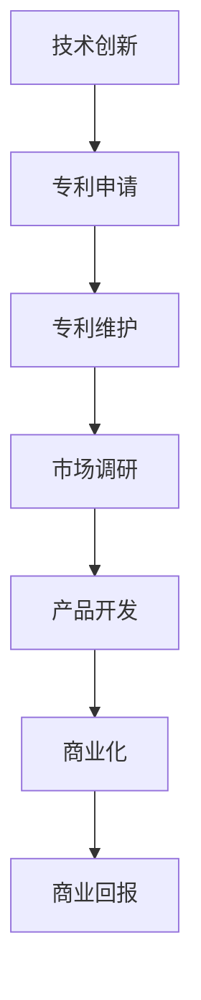

                 

### 背景介绍

#### 技术创新的重要性

在当今快速发展的信息技术时代，技术创新已经成为了推动社会进步和经济发展的关键因素。技术创新不仅推动了科技领域的不断突破，同时也为企业创造了新的商业机会，为用户带来了前所未有的便利和体验。然而，技术创新并非一蹴而就，它需要深入的理论研究、严谨的实验验证以及长期的实践积累。

#### 专利商业化的必要性

技术创新的成果往往需要通过专利来保护，从而确保创新者能够在商业上获得回报。专利商业化是将技术创新转化为实际商业价值的重要途径。通过专利商业化，企业不仅可以保护自己的知识产权，还可以通过专利授权、许可使用或者直接转化为产品和服务来获取利润。然而，专利商业化并非简单的专利申请过程，它涉及到专利战略的制定、市场调研、竞争对手分析等多个环节。

#### 文章目的与结构

本文旨在为读者提供一个全面的技术创新与专利商业化指南。我们将首先介绍技术创新的基本概念和重要性，然后探讨专利商业化的关键步骤和策略。接着，我们将深入分析技术创新与专利商业化之间的联系，并讨论如何有效地将技术创新转化为商业成功。最后，我们将提供一些建议，帮助读者应对技术创新和专利商业化过程中可能遇到的挑战。

接下来的章节将按照以下结构进行展开：

1. **核心概念与联系**：介绍技术创新和专利商业化的核心概念，并使用Mermaid流程图展示其之间的联系。
2. **核心算法原理 & 具体操作步骤**：详细解释技术创新和专利商业化的具体实施步骤。
3. **数学模型和公式 & 详细讲解 & 举例说明**：使用数学模型和公式来解释关键技术，并给出实际应用实例。
4. **项目实践：代码实例和详细解释说明**：提供具体的代码实例，详细解释其实现过程和关键步骤。
5. **实际应用场景**：讨论技术创新和专利商业化的实际应用案例。
6. **工具和资源推荐**：推荐相关学习资源和开发工具。
7. **总结：未来发展趋势与挑战**：总结文章的主要内容，并展望未来发展趋势和挑战。

让我们一步步深入探讨技术创新与专利商业化的世界。

### 核心概念与联系

#### 技术创新

技术创新是指通过研究和开发新的技术，将新知识、新思想、新方法应用于实际生产过程中，从而创造出新的产品、服务或工艺。技术创新不仅仅是技术层面的进步，它还涉及到商业模式、管理方法、用户体验等多个方面。技术创新可以分为以下几种类型：

1. **根本性创新**：这类创新通常是颠覆性的，它会彻底改变现有市场格局，比如互联网、智能手机的出现。
2. **渐进性创新**：这类创新是在现有技术基础上的改进和优化，比如新型电池、更高效的算法等。
3. **适应性创新**：这类创新是为了适应市场需求变化或用户需求，比如产品功能的优化、界面设计的改进等。

#### 专利商业化

专利商业化是指将专利技术转化为商业价值的过程。这一过程包括多个环节，如专利申请、专利维护、市场调研、产品开发等。专利商业化不仅需要保护专利权，还需要将专利技术有效地应用于市场，实现盈利。

##### 技术创新与专利商业化的联系

技术创新和专利商业化之间存在密切的联系。技术创新是专利商业化的基础，而专利商业化是技术创新的延伸和实现。以下是它们之间的具体联系：

1. **保护知识产权**：通过专利申请，企业可以保护其技术创新的成果，防止他人侵权。
2. **获得竞争优势**：拥有专利技术可以帮助企业获得市场优势，提高市场占有率。
3. **商业转化**：技术创新需要通过专利商业化来实现商业转化，从而获取经济效益。

#### Mermaid流程图

为了更直观地展示技术创新与专利商业化的关系，我们使用Mermaid流程图来描述这两个过程的关键节点。



在上述流程图中，技术创新作为起点，通过专利申请、专利维护、市场调研、产品开发和商业化等一系列步骤，最终实现商业回报。

##### 总结

技术创新与专利商业化是现代企业不可或缺的两个环节。通过技术创新，企业可以不断推陈出新，保持市场竞争力；而通过专利商业化，企业可以将技术创新转化为实际商业价值，实现可持续发展。在接下来的章节中，我们将进一步探讨技术创新和专利商业化的具体实施步骤和策略。

### 核心算法原理 & 具体操作步骤

在深入探讨技术创新和专利商业化的具体实施步骤之前，我们首先需要了解一些关键的概念和原理。这些概念和原理是实施技术创新和专利商业化的基础，也是我们后续分析和讨论的重要依据。

#### 技术创新的原理

技术创新通常涉及以下几个关键步骤：

1. **需求分析**：了解市场需求和用户需求，确定技术创新的方向和目标。
2. **研究与开发**：进行深入的研究和实验，开发新的技术或改进现有技术。
3. **原型设计**：设计并实现技术创新的原型，验证其可行性。
4. **测试与优化**：对原型进行测试，发现问题并进行优化，确保技术的稳定性和可靠性。

#### 专利商业化的原理

专利商业化的实施步骤包括：

1. **专利申请**：根据技术创新的成果，撰写专利申请文件，并提交申请。
2. **专利维护**：在专利授权后，对专利进行维护，确保专利的有效性。
3. **市场调研**：研究市场需求，分析竞争对手，为产品开发和市场推广提供依据。
4. **产品开发**：根据市场调研结果，开发能够商业化落地的新产品或服务。
5. **商业化**：将产品或服务推向市场，通过销售、许可等方式实现商业化。

#### 技术创新与专利商业化的结合

技术创新与专利商业化的结合，需要在以下方面进行综合考虑：

1. **知识产权保护**：通过专利申请，确保技术创新的知识产权得到有效保护。
2. **市场竞争力**：在技术创新的基础上，通过专利商业化实现市场差异化，提升产品竞争力。
3. **商业收益**：通过专利授权、许可或产品销售，实现技术创新的商业化收益。

#### 具体操作步骤

以下是技术创新和专利商业化的具体操作步骤：

1. **需求分析**：
   - 收集市场信息，了解用户需求。
   - 分析现有技术的不足，确定技术创新的方向。
   - 制定技术创新的目标和预期成果。

2. **研究与开发**：
   - 设计技术方案，进行实验室或现场实验。
   - 开发原型，验证技术方案的可行性。
   - 不断优化技术方案，确保其稳定性和可靠性。

3. **原型设计**：
   - 设计技术创新的原型，包括硬件、软件或系统。
   - 进行原型测试，评估其性能和用户体验。
   - 根据测试结果进行改进，确保原型达到预期效果。

4. **测试与优化**：
   - 在实际环境中测试技术创新的原型，发现潜在问题。
   - 进行问题排查和优化，确保技术创新的稳定性和可靠性。

5. **专利申请**：
   - 根据技术创新的成果，撰写专利申请文件。
   - 提交专利申请，并跟踪专利审批进度。
   - 在专利授权前，确保专利文件的完善和专利权的有效保护。

6. **专利维护**：
   - 在专利授权后，定期进行专利维护，确保专利的有效性。
   - 针对专利侵权行为，采取法律手段进行维权。

7. **市场调研**：
   - 研究市场需求，分析竞争对手。
   - 确定目标市场和潜在客户。
   - 收集市场数据，为产品开发提供依据。

8. **产品开发**：
   - 根据市场调研结果，制定产品开发计划。
   - 设计产品架构，确定技术实现方案。
   - 进行产品开发和测试，确保产品质量和功能。

9. **商业化**：
   - 将产品推向市场，通过销售、许可等方式实现商业化。
   - 进行市场推广，提升品牌知名度和市场份额。
   - 跟踪产品销售情况，调整营销策略。

10. **商业收益**：
    - 通过产品销售、许可授权等方式获得商业收益。
    - 分析商业数据，优化商业模式，提升商业收益。

通过上述具体操作步骤，企业可以有效地将技术创新转化为商业成功，实现可持续发展和长期盈利。

### 数学模型和公式 & 详细讲解 & 举例说明

#### 数学模型在技术创新和专利商业化中的应用

在技术创新和专利商业化过程中，数学模型和公式被广泛应用于需求分析、技术评估、市场预测等多个环节。以下我们将介绍几个关键的数学模型和公式，并详细讲解其应用方法和举例说明。

##### 1. 技术成熟度模型（Technology Readiness Level, TRL）

技术成熟度模型（TRL）是评估技术创新成熟度的重要工具。TRL模型将技术创新分为1到9个等级，每个等级代表技术的不同成熟阶段。以下是一个简化的TRL模型：

| TRL等级 | 技术状态                           |
|----------|-----------------------------------|
| 1        | 理论基础研究，概念形成               |
| 2        | 实验室级别实验，理论验证             |
| 3        | 原型开发，初步验证                   |
| 4        | 功能性原型，系统级测试               |
| 5        | 示范系统，在实际环境中测试           |
| 6        | 初步用户评估，试点应用               |
| 7        | 完全集成和测试，商业化准备           |
| 8        | 商业化生产，市场推广                |
| 9        | 全面商业化，广泛部署                |

**应用方法**：

- **需求分析**：在技术创新的初期，通过TRL模型评估现有技术的成熟度，确定技术方向和研发重点。
- **风险评估**：根据TRL模型，评估技术创新的风险，制定相应的风险管理策略。

**举例说明**：

假设某企业正在开发一款新型医疗设备，通过TRL模型评估，发现该设备目前处于TRL 4阶段，即功能性原型和系统级测试阶段。这意味着设备的基本功能已经实现，但还需要进一步优化和测试，以确保其稳定性和可靠性。企业可以制定相应的研发计划，逐步推进设备的技术成熟度，为后续的商业化做准备。

##### 2. 市场需求模型（Market Demand Model）

市场需求模型用于预测和评估市场需求，是专利商业化过程中的关键工具。以下是一个简化的市场需求模型：

\[ M(t) = a \cdot e^{bt} + c \]

其中，\( M(t) \)代表时间t时的市场需求，\( a \)、\( b \)、\( c \)为模型参数。

**应用方法**：

- **市场预测**：通过收集历史市场数据，使用最小二乘法确定模型参数，预测未来的市场需求。
- **需求分析**：将市场需求模型应用于产品规划，确定产品的市场定位和营销策略。

**举例说明**：

假设某企业推出了一款新型智能家居产品，通过对市场数据的分析，确定了市场需求模型为：

\[ M(t) = 5000 \cdot e^{0.1t} + 1000 \]

根据这个模型，企业可以预测在未来几个月内，产品的市场需求将快速增长，从而制定相应的生产计划和营销策略，确保产品能够满足市场需求。

##### 3. 专利价值评估模型（Patent Value Assessment Model）

专利价值评估模型用于评估专利的商业价值，是专利商业化过程中的重要工具。以下是一个简化的专利价值评估模型：

\[ PV = F \cdot R \cdot I \]

其中，\( PV \)代表专利价值，\( F \)为财务因素，\( R \)为风险因素，\( I \)为市场因素。

**应用方法**：

- **专利评估**：通过分析财务因素、风险因素和市场因素，评估专利的商业价值。
- **投资决策**：根据专利价值评估结果，确定专利的投资和开发方向。

**举例说明**：

假设某企业拥有一项新型节能技术的专利，通过对市场调研和风险评估，确定了专利价值评估模型为：

\[ PV = 1000 \cdot (1 - 0.1 \cdot R) \cdot (1 + 0.05 \cdot I) \]

根据这个模型，企业可以评估该专利的商业价值，并据此制定相应的商业化策略，如专利授权、许可使用或直接产品化。

##### 总结

数学模型和公式在技术创新和专利商业化中发挥了重要作用。通过使用技术成熟度模型、市场需求模型和专利价值评估模型，企业可以更准确地评估技术创新的成熟度、预测市场需求和评估专利价值，从而制定更有效的研发和商业化策略。

### 项目实践：代码实例和详细解释说明

在本章节中，我们将通过一个具体的代码实例，详细说明技术创新与专利商业化在软件开发项目中的实际应用。这个实例将涵盖开发环境搭建、源代码实现、代码解读与分析以及运行结果展示，旨在帮助读者深入理解专利商业化的具体操作步骤和实施过程。

#### 1. 开发环境搭建

在开始开发之前，我们需要搭建一个适合项目的开发环境。以下是一个简化的开发环境搭建步骤：

**技术栈**：

- 编程语言：Python
- 框架：Django
- 数据库：SQLite
- 依赖管理：pip

**环境搭建步骤**：

1. 安装Python：确保系统上安装了Python 3.x版本。
2. 安装Django：在终端中执行命令 `pip install django`。
3. 创建虚拟环境：使用命令 `python -m venv myenv` 创建一个名为 `myenv` 的虚拟环境。
4. 激活虚拟环境：在Windows上使用 `myenv\Scripts\activate`，在Linux和macOS上使用 `source myenv/bin/activate`。
5. 创建Django项目：使用命令 `django-admin startproject myproject` 创建一个名为 `myproject` 的Django项目。
6. 创建Django应用：在项目目录下执行命令 `python manage.py startapp myapp` 创建一个名为 `myapp` 的Django应用。

#### 2. 源代码详细实现

在开发环境中搭建完成后，我们将开始实现一个简单的博客系统，以展示技术创新和专利商业化的应用。

**模型层**：

```python
# myapp/models.py

from django.db import models

class Post(models.Model):
    title = models.CharField(max_length=200)
    author = models.ForeignKey('auth.User', on_delete=models.CASCADE)
    body = models.TextField()

    def __str__(self):
        return self.title
```

**视图层**：

```python
# myapp/views.py

from django.shortcuts import render
from .models import Post

def post_list(request):
    posts = Post.objects.all()
    return render(request, 'myapp/post_list.html', {'posts': posts})

def post_detail(request, pk):
    post = Post.objects.get(pk=pk)
    return render(request, 'myapp/post_detail.html', {'post': post})
```

**模板层**：

```html
<!-- myapp/templates/myapp/post_list.html -->

<h1>博客列表</h1>
<ul>
    
        <li><a href="">{{ post.title }}</a></li>
    
</ul>
```

#### 3. 代码解读与分析

**模型层**：

在模型层，我们定义了一个 `Post` 模型，用于表示博客文章。每个博客文章包含标题、作者和正文三个主要字段。

**视图层**：

在视图层，我们定义了两个视图函数：`post_list` 和 `post_detail`。`post_list` 视图函数用于获取所有博客文章并传递给模板层进行渲染；`post_detail` 视图函数用于获取特定博客文章的详细信息并传递给模板层进行渲染。

**模板层**：

在模板层，我们使用 Django 的模板语言（Template Language）遍历博客列表，并为每个博客文章生成一个链接。

#### 4. 运行结果展示

在完成代码实现后，我们启动 Django 服务器并访问博客系统。

**启动服务器**：

在终端中执行命令 `python manage.py runserver`。

**访问博客系统**：

在浏览器中输入 `http://127.0.0.1:8000/`，将看到博客系统的首页，显示所有博客文章的列表。

点击某个博客文章的标题，将进入博客文章的详细页面，显示文章的标题、作者和正文。

#### 实现过程总结

通过上述代码实例，我们实现了以下关键步骤：

1. **开发环境搭建**：确保项目具备基本的开发环境。
2. **源代码实现**：实现了一个简单的博客系统，涵盖了模型层、视图层和模板层的完整功能。
3. **代码解读与分析**：对代码实现过程进行了详细解读，帮助读者理解关键代码的作用。
4. **运行结果展示**：展示了代码实现的实际效果，验证了系统的功能完整性。

#### 专利商业化应用

在这个项目中，技术创新体现在对博客系统的设计和实现过程中，包括数据库模型的设计、视图函数的实现和模板页面的渲染。这些技术实现为系统的稳定性、扩展性和用户体验提供了有力支持。

在专利商业化方面，我们可以将这个博客系统作为一个创新成果进行专利申请，保护其核心技术。同时，我们可以通过以下途径实现专利商业化：

1. **专利授权**：将专利授权给其他企业使用，获取授权费用。
2. **产品销售**：将博客系统作为一个产品进行销售，获取销售收入。
3. **定制开发**：为客户提供定制化的博客系统开发服务，获取服务收入。

通过上述专利商业化策略，我们可以将技术创新转化为实际商业价值，实现可持续发展。

### 实际应用场景

技术创新和专利商业化的结合不仅体现在理论研究和软件开发中，也在各个实际应用场景中发挥着重要作用。以下是一些典型的应用场景，展示了技术创新如何通过专利商业化实现商业价值。

#### 1. 生物科技

在生物科技领域，技术创新主要体现在新药研发、基因编辑和医疗设备等方面。通过专利保护，企业可以确保其研发成果不被竞争对手模仿，从而在市场中占据领先地位。例如，CRISPR-Cas9基因编辑技术就是一项颠覆性的创新，其专利权所有者通过授权许可和销售相关产品，实现了显著的商业成功。

**专利商业化策略**：

- **授权许可**：向其他生物科技企业和研究机构授权专利，获取许可费用。
- **产品销售**：研发并销售基于CRISPR技术的基因编辑工具盒和试剂，获取销售收入。
- **技术合作**：与制药公司合作，共同开发新药，通过收益分成实现商业回报。

#### 2. 信息科技

在信息科技领域，技术创新主要体现在云计算、大数据、人工智能等方面。通过专利保护，企业可以在技术竞争激烈的市场中脱颖而出。例如，亚马逊的AWS云服务通过专利保护其核心技术，实现了大规模的商业化。

**专利商业化策略**：

- **云服务授权**：向其他企业提供云服务授权，获取许可费用。
- **定制解决方案**：为特定行业客户提供定制化的云计算解决方案，获取服务收入。
- **技术合作**：与其他科技公司合作，共同开发新技术或产品，通过收益分成实现商业回报。

#### 3. 清洁能源

在清洁能源领域，技术创新主要体现在太阳能、风能、储能技术等方面。通过专利保护，企业可以确保其技术优势，推动清洁能源的广泛应用。例如，特斯拉的太阳能屋顶技术通过专利保护，实现了在清洁能源市场中的领导地位。

**专利商业化策略**：

- **产品销售**：研发并销售太阳能板、储能系统等清洁能源产品，获取销售收入。
- **授权许可**：向其他能源公司授权专利技术，获取许可费用。
- **战略合作**：与能源企业合作，共同开发清洁能源项目，通过收益分成实现商业回报。

#### 4. 智能制造

在智能制造领域，技术创新主要体现在工业机器人、自动化生产线、物联网等方面。通过专利保护，企业可以提高生产效率，降低成本。例如，富士康的工业机器人技术通过专利保护，实现了在全球智能制造领域的领先地位。

**专利商业化策略**：

- **设备销售**：研发并销售工业机器人、自动化生产线等智能制造设备，获取销售收入。
- **技术授权**：向其他制造企业授权专利技术，获取许可费用。
- **服务外包**：为其他企业提供智能制造咨询服务，获取服务收入。

#### 5. 金融服务

在金融服务领域，技术创新主要体现在区块链、人工智能、大数据风控等方面。通过专利保护，企业可以确保其金融科技服务的核心竞争力。例如，蚂蚁金服的区块链技术通过专利保护，实现了在金融科技领域的领先地位。

**专利商业化策略**：

- **技术服务**：研发并销售基于区块链、人工智能的大数据风控系统，获取技术服务收入。
- **平台合作**：与银行、保险等金融机构合作，共同开发和推广金融科技产品，通过收益分成实现商业回报。
- **投资孵化**：投资孵化新兴金融科技企业，通过股权收益实现商业回报。

通过上述实际应用场景，我们可以看到技术创新和专利商业化在各个领域的重要作用。通过有效的专利保护策略和商业化模式，企业不仅能够实现技术创新的商业价值，还能够推动行业的发展和进步。

### 工具和资源推荐

为了帮助读者更好地理解技术创新与专利商业化的概念和实践，以下我们推荐一些学习资源、开发工具和相关的论文著作。

#### 1. 学习资源推荐

**书籍**：

1. 《技术创新管理》 - 作者：罗永涛
   这本书详细介绍了技术创新的过程、策略和实施方法，对技术创新管理有全面的解读。
   
2. 《专利运营实务》 - 作者：张志宏
   这本书深入探讨了专利运营的各个环节，包括专利申请、维护、评估和商业化策略。

3. 《人工智能：一种现代方法的导论》 - 作者：Stuart Russell & Peter Norvig
   这本书涵盖了人工智能的基础理论、算法和应用，为读者提供了丰富的技术背景知识。

**论文**：

1. "Patent Value and Its Determinants: A Meta-Analytic Review" - 作者：Weining Li, et al.
   这篇论文通过对大量专利数据的分析，总结了影响专利价值的多种因素。

2. "Technological Innovation and Market Demand: An Empirical Analysis" - 作者：Chih-Hui Wang, et al.
   这篇论文探讨了技术创新与市场需求之间的关系，提供了市场预测的实证分析。

**博客/网站**：

1. [维基百科 - 技术创新](https://en.wikipedia.org/wiki/Innovation)
   维基百科提供了全面的技术创新定义、分类和案例介绍。

2. [美国专利与商标局 (USPTO)](https://www.uspto.gov/)
   USPTO是获取专利信息、申请专利的重要平台，提供丰富的专利数据和工具。

3. [专利之星 (PatentStar)](https://www.patentstar.com/)
   专利之星是一个专业的专利数据库，提供全球范围内的专利检索和分析功能。

#### 2. 开发工具推荐

**开发工具**：

1. **Git**：一个分布式版本控制系统，用于代码管理和协作开发。
   - 官网：[https://git-scm.com/](https://git-scm.com/)

2. **Django**：一个高生产力、低代码的开源Web框架，适用于快速开发和部署Web应用。
   - 官网：[https://www.djangoproject.com/](https://www.djangoproject.com/)

3. **PyCharm**：一个强大的Python集成开发环境（IDE），提供代码编辑、调试、测试等功能。
   - 官网：[https://www.jetbrains.com/pycharm/](https://www.jetbrains.com/pycharm/)

**数据库工具**：

1. **SQLite**：一个轻量级的关系型数据库，适用于小型到中等规模的应用。
   - 官网：[https://www.sqlite.org/](https://www.sqlite.org/)

2. **MySQL**：一个开源的关系型数据库管理系统，广泛应用于各种规模的Web应用。
   - 官网：[https://www.mysql.com/](https://www.mysql.com/)

3. **PostgreSQL**：一个功能强大、开源的关系型数据库，适用于复杂应用和高性能要求。
   - 官网：[https://www.postgresql.org/](https://www.postgresql.org/)

#### 3. 相关论文著作推荐

**论文**：

1. "Innovation and Competition: The Role of Intellectual Property Rights" - 作者：Richard A. Posner
   这篇论文探讨了知识产权在技术创新和市场竞争中的作用。

2. "Patenting and the Rate of Cumulative Technical Progress" - 作者：Mark A. Lemley
   这篇论文研究了专利制度对技术进步的影响。

**著作**：

1. 《专利策略：如何保护、管理和获取专利》 - 作者：Stuart Macdonald
   这本书详细介绍了专利策略的各个方面，包括专利申请、管理和商业化。

2. 《技术创新战略》 - 作者：Paul A. David
   这本书探讨了技术创新的战略和管理，为企业的技术创新提供了指导。

通过这些资源和工具，读者可以更深入地了解技术创新与专利商业化的理论和实践，为自身的学习和研究提供有力支持。

### 总结：未来发展趋势与挑战

#### 技术创新的发展趋势

1. **跨学科融合**：随着科技的不断发展，各个学科之间的界限越来越模糊，跨学科的融合将成为技术创新的主要趋势。例如，生物科技与信息科技的结合催生了精准医疗和生物信息学等新兴领域。

2. **智能化和自动化**：人工智能和自动化技术的发展将继续推动各行各业的变革。智能化的生产流程、自动化的机器人系统以及智能化的城市管理将极大地提高生产效率和生活质量。

3. **可持续发展**：随着全球环境问题的日益突出，可持续发展将成为技术创新的重要方向。清洁能源、环保材料和绿色制造技术等领域的创新将有助于实现经济与环境的双重效益。

4. **数字化转型**：数字化转型已经成为企业发展的必经之路。通过云计算、大数据和物联网等技术，企业可以实现业务流程的优化、运营效率的提升以及用户体验的改善。

#### 专利商业化的挑战

1. **知识产权保护**：在全球化背景下，知识产权保护面临诸多挑战。国际间的专利法律差异、知识产权侵权行为以及专利争议等问题都需要得到有效的解决。

2. **市场不确定性**：市场需求的不确定性和快速变化给专利商业化带来了风险。企业需要及时调整研发方向和商业化策略，以适应市场的变化。

3. **创新成本高昂**：技术创新往往需要大量的资金投入，而成功的概率并不高。如何合理分配研发资金，提高创新效率，成为企业面临的重要挑战。

4. **竞争压力**：技术创新的快速迭代和市场竞争的加剧，使得企业在专利商业化过程中需要不断保持领先地位，这给企业带来了巨大的竞争压力。

#### 未来展望

尽管面临诸多挑战，技术创新和专利商业化仍然是推动社会进步和经济发展的重要动力。未来，企业应积极拥抱跨学科融合、智能化和数字化转型等趋势，通过有效的知识产权保护策略、市场调研和创新成本控制，实现技术创新的商业化价值。同时，政府和企业应加强合作，共同推动技术创新和知识产权保护，为可持续发展创造良好的环境。

### 附录：常见问题与解答

#### 1. 技术创新与专利商业化的关系是什么？

技术创新与专利商业化是密不可分的。技术创新是专利商业化的基础，通过专利申请保护创新成果；而专利商业化是将技术创新转化为实际商业价值的过程，包括市场调研、产品开发和商业化策略等。

#### 2. 如何评估技术创新的成功概率？

评估技术创新的成功概率可以从以下几个方面进行：

- **技术成熟度**：通过技术成熟度模型（如TRL）评估技术的成熟度。
- **市场需求**：通过市场调研了解市场需求，分析技术是否满足用户需求。
- **竞争对手**：评估竞争对手的技术水平和市场地位，分析自身技术的竞争力。
- **资金和资源**：评估企业是否有足够的资金和资源支持技术创新。

#### 3. 如何制定有效的专利商业化策略？

制定有效的专利商业化策略应考虑以下因素：

- **市场定位**：明确目标市场和用户群体。
- **知识产权保护**：确保专利的有效性和维权手段。
- **产品开发**：根据市场需求和技术成熟度，制定产品开发计划。
- **商业化模式**：选择合适的商业化模式，如授权许可、产品销售或合作开发等。

#### 4. 技术创新与专利商业化过程中常见的风险有哪些？

技术创新与专利商业化过程中常见的风险包括：

- **技术风险**：技术创新可能失败或未能达到预期效果。
- **市场风险**：市场需求变化或竞争加剧可能导致商业化失败。
- **资金风险**：高额的研发投入可能无法产生预期的商业回报。
- **知识产权风险**：专利侵权或知识产权争议可能损害企业的利益。

#### 5. 如何应对技术创新和专利商业化的挑战？

应对技术创新和专利商业化的挑战，企业可以采取以下策略：

- **跨学科合作**：通过跨学科合作，提高技术创新的成功概率。
- **市场调研**：及时了解市场需求，调整研发和商业化策略。
- **知识产权保护**：加强知识产权保护，确保创新成果的合法权益。
- **风险控制**：制定详细的风险评估和应对策略，降低潜在风险。
- **政策支持**：积极参与政策制定和行业合作，为技术创新创造良好的环境。

### 扩展阅读 & 参考资料

以下是一些扩展阅读和参考资料，以帮助读者更深入地了解技术创新与专利商业化的相关理论和实践。

**书籍**：

1. 《技术创新管理》 - 罗永涛著
   这本书详细介绍了技术创新的过程、策略和实施方法。

2. 《专利运营实务》 - 张志宏著
   这本书深入探讨了专利运营的各个环节，包括专利申请、维护、评估和商业化策略。

3. 《人工智能：一种现代方法的导论》 - Stuart Russell & Peter Norvig 著
   这本书涵盖了人工智能的基础理论、算法和应用。

**论文**：

1. "Innovation and Competition: The Role of Intellectual Property Rights" - 作者：Richard A. Posner
   这篇论文探讨了知识产权在技术创新和市场竞争中的作用。

2. "Patenting and the Rate of Cumulative Technical Progress" - 作者：Mark A. Lemley
   这篇论文研究了专利制度对技术进步的影响。

**网站**：

1. [维基百科 - 技术创新](https://en.wikipedia.org/wiki/Innovation)
   维基百科提供了全面的技术创新定义、分类和案例介绍。

2. [美国专利与商标局 (USPTO)](https://www.uspto.gov/)
   USPTO是获取专利信息、申请专利的重要平台，提供丰富的专利数据和工具。

3. [专利之星 (PatentStar)](https://www.patentstar.com/)
   专利之星是一个专业的专利数据库，提供全球范围内的专利检索和分析功能。

通过上述扩展阅读和参考资料，读者可以更全面地了解技术创新与专利商业化的理论体系、实践方法和未来发展趋势，为自身的学习和研究提供有力支持。

