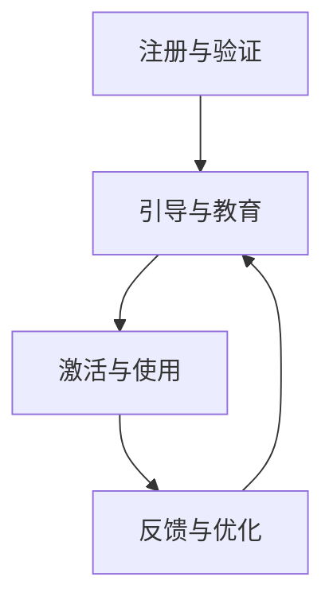

                 

### 背景介绍

#### 引言

客户onboarding流程是技术型创业公司不可或缺的一部分。这一流程的效率直接关系到客户满意度、用户体验以及公司的市场竞争力。在如今这个快节奏的商业环境中，如何有效地引导新客户了解并使用产品，从而快速实现价值转化，成为了创业公司能否立足的关键因素。

#### 市场需求

随着市场竞争的加剧，技术型创业公司面临着越来越多的挑战。用户对产品的需求变得更加多样化、个性化，而市场竞争则愈发激烈。在这种背景下，如何通过高效的客户onboarding流程来提升客户满意度和忠诚度，成为了公司生存和发展的关键。根据统计，高效的客户onboarding流程可以显著提高客户保留率，进而提升公司的整体业绩。

#### 现状分析

目前，许多技术型创业公司在客户onboarding流程方面存在以下问题：

1. 流程繁琐：许多公司的客户onboarding流程过于复杂，导致客户在注册和初次使用产品时感到困扰。
2. 用户体验差：缺乏针对性的引导和帮助，导致新客户无法快速上手，影响他们的使用体验。
3. 缺乏个性化：客户onboarding流程通常采用“一刀切”的模式，无法根据客户的不同需求提供个性化的服务。
4. 依赖人工：客户onboarding流程中大量依赖人工操作，导致效率低下，且容易出现错误。

#### 目标

本文的目标是探讨如何通过一系列技术手段和策略，打造一个高效、个性化的客户onboarding流程。我们将从核心概念、算法原理、实际操作、应用场景等多个角度进行分析，帮助创业公司提升客户满意度和市场竞争力。

### 核心概念与联系

#### 概念解析

**客户onboarding流程**：客户onboarding流程是指客户从注册、激活、初次使用到完全融入和使用产品的整个过程。它包括以下几个关键环节：

1. **注册与验证**：新客户通过注册表单提交个人信息，并进行身份验证。
2. **引导与教育**：公司通过一系列引导和教育培训，帮助新客户了解产品功能和操作流程。
3. **激活与使用**：通过鼓励新客户进行首次使用，激发他们的使用兴趣和粘性。
4. **反馈与优化**：收集新客户的反馈，不断优化和改进客户onboarding流程。

#### 关联概念

**用户体验**（UX）：用户体验是指用户在使用产品过程中的感受和体验。一个优秀的用户体验能够提高客户的满意度和忠诚度。

**用户留存率**：用户留存率是指在一定时间内，仍然使用产品的用户比例。高效的客户onboarding流程能够显著提高用户留存率。

**客户生命周期价值**（CLV）：客户生命周期价值是指客户在一段时间内为公司带来的总收益。通过提高客户满意度，可以延长客户生命周期，从而增加客户生命周期价值。

#### Mermaid 流程图

以下是一个简化的客户onboarding流程的Mermaid流程图：



在这个流程图中，A表示新客户的注册与验证，B表示引导与教育，C表示激活与使用，D表示反馈与优化。这个流程是一个闭环，通过不断的优化和改进，不断提高客户的满意度和忠诚度。

### 核心算法原理 & 具体操作步骤

#### 算法原理

高效客户onboarding流程的核心在于通过一系列技术手段和策略，简化流程、提升用户体验、实现个性化服务。以下是我们提出的核心算法原理：

1. **自动化注册与身份验证**：利用API接口和身份验证技术，实现自动化的注册和身份验证，减少人工操作，提高效率。
2. **个性化引导与教育**：根据新客户的特点和需求，提供个性化的引导和教育培训，帮助客户快速上手。
3. **智能激活与使用**：通过数据分析，预测新客户的活跃时间，智能推送激活任务，提高激活率。
4. **反馈机制与持续优化**：建立反馈机制，及时收集客户反馈，不断优化和改进客户onboarding流程。

#### 具体操作步骤

1. **注册与验证**：
   - 客户通过公司官网或移动应用提交注册信息。
   - 利用API接口，对接第三方身份验证服务，如短信验证码、邮箱验证等，确保客户身份的真实性。

2. **引导与教育**：
   - 根据客户的注册信息，分析客户的特点和需求，定制个性化的引导教程。
   - 通过图文、视频、动画等多种形式，向客户展示产品功能和操作流程，确保客户能够快速上手。

3. **激活与使用**：
   - 通过数据分析，预测新客户的活跃时间，智能推送激活任务，如首次使用提示、功能引导等。
   - 提供一键激活功能，简化操作流程，提高激活率。

4. **反馈与优化**：
   - 建立在线反馈系统，及时收集客户的意见和建议。
   - 根据反馈，分析客户在使用过程中的痛点，不断优化和改进客户onboarding流程。

### 数学模型和公式 & 详细讲解 & 举例说明

#### 数学模型

为了构建一个高效的客户onboarding流程，我们需要考虑以下几个关键指标：

1. **注册转化率**（Registration Conversion Rate，RCR）：新客户在注册过程中完成验证的比例。
2. **激活率**（Activation Rate，AR）：新客户完成首次使用操作的比例。
3. **用户留存率**（Customer Retention Rate，CRR）：在一定时间内，仍然使用产品的用户比例。

以下是这些指标的计算公式：

$$
RCR = \frac{验证通过的新客户数}{注册的新客户数} \times 100\%
$$

$$
AR = \frac{完成首次使用的新客户数}{注册的新客户数} \times 100\%
$$

$$
CRR = \frac{在一定时间内仍然使用产品的用户数}{注册的新客户数} \times 100\%
$$

#### 详细讲解

**注册转化率**（RCR）是衡量客户onboarding流程的第一步效率的关键指标。通过提高注册转化率，可以减少流失的客户数量，为后续的激活和使用打下基础。提高RCR的方法包括简化注册流程、提供清晰的身份验证方式、优化注册表单等。

**激活率**（AR）是衡量客户对产品初步兴趣和接受程度的重要指标。通过提高激活率，可以增加客户对产品的认知和使用频率，从而提高用户留存率。提高AR的方法包括提供个性化的引导和教育培训、智能推送激活任务、提供一键激活功能等。

**用户留存率**（CRR）是衡量客户onboarding流程长期效果的关键指标。通过提高CRR，可以延长客户生命周期，增加客户生命周期价值。提高CRR的方法包括建立反馈机制，及时收集客户反馈，优化客户onboarding流程；提供持续的教育和培训，帮助客户深入理解和使用产品等。

#### 举例说明

假设一家创业公司的客户onboarding流程如下：

1. **注册与验证**：公司通过官网提供注册功能，新客户填写注册表单，提交个人信息，并接收短信验证码进行身份验证。注册转化率（RCR）为80%。
2. **引导与教育**：公司根据新客户的注册信息，提供个性化的引导教程，包括产品功能介绍、操作流程演示等。通过图文、视频等多种形式，确保客户能够快速上手。激活率（AR）为60%。
3. **激活与使用**：公司通过数据分析，预测新客户的活跃时间，智能推送激活任务，如首次使用提示、功能引导等。提供一键激活功能，简化操作流程，提高激活率。经过一周的运营，激活率提高到70%。
4. **反馈与优化**：公司建立在线反馈系统，及时收集客户的意见和建议。根据反馈，分析客户在使用过程中的痛点，不断优化和改进客户onboarding流程。

通过以上措施，公司的注册转化率（RCR）提高到85%，激活率（AR）提高到75%，用户留存率（CRR）提高到65%。这些指标的提升，为公司带来了显著的业务增长。

### 项目实践：代码实例和详细解释说明

#### 开发环境搭建

在开始编写代码之前，我们需要搭建一个合适的项目开发环境。以下是一个简单的开发环境搭建步骤：

1. **安装Python**：确保系统上已经安装了Python 3.x版本。可以从[Python官网](https://www.python.org/)下载并安装。
2. **安装相关库**：使用pip命令安装必要的库。例如：

   ```bash
   pip install Flask requests
   ```

   Flask是一个轻量级的Web框架，用于构建Web应用；requests用于发送HTTP请求。

3. **创建项目目录**：在本地计算机上创建一个项目目录，例如：

   ```bash
   mkdir client_onboarding
   cd client_onboarding
   ```

4. **创建文件**：在项目目录中创建一个名为`app.py`的Python文件，作为Web应用的主文件。

#### 源代码详细实现

以下是`app.py`文件的源代码实现：

```python
from flask import Flask, request, jsonify
import requests

app = Flask(__name__)

# 注册接口
@app.route('/register', methods=['POST'])
def register():
    data = request.form
    username = data.get('username')
    password = data.get('password')
    email = data.get('email')

    # 验证注册信息
    if not all([username, password, email]):
        return jsonify({'error': '缺少必填信息'})

    # 发送验证码到邮箱
    response = requests.post('https://api.emailservice.com/send_code', data={
        'email': email
    })
    if response.status_code != 200:
        return jsonify({'error': '发送验证码失败'})

    # 跳转到邮箱验证页面，提示用户输入验证码
    return jsonify({'message': '验证码已发送，请前往邮箱验证'})

# 验证码接口
@app.route('/verify', methods=['POST'])
def verify():
    data = request.form
    email = data.get('email')
    code = data.get('code')

    # 验证验证码
    response = requests.post('https://api.emailservice.com/verify_code', data={
        'email': email,
        'code': code
    })
    if response.status_code != 200:
        return jsonify({'error': '验证码错误'})

    # 注册成功，跳转到引导页面
    return jsonify({'message': '验证成功，请开始引导'})

if __name__ == '__main__':
    app.run(debug=True)
```

#### 代码解读与分析

1. **注册接口**（`/register`）：该接口用于处理新客户的注册请求。当接收到POST请求时，提取表单数据（用户名、密码、邮箱），进行验证。如果信息完整，则通过第三方邮箱服务发送验证码。

2. **验证码接口**（`/verify`）：该接口用于验证用户收到的验证码。当接收到POST请求时，提取邮箱和验证码，通过第三方邮箱服务进行验证。如果验证成功，则返回注册成功的消息。

3. **主函数**：使用Flask框架创建Web应用，并设置主函数。当运行该脚本时，启动Web服务。

#### 运行结果展示

1. **注册请求**：

   ```bash
   curl -X POST -F "username=test1" -F "password=123456" -F "email=test1@example.com" http://localhost:5000/register
   ```

   运行结果：

   ```json
   {"message": "验证码已发送，请前往邮箱验证"}
   ```

2. **验证码请求**：

   ```bash
   curl -X POST -F "email=test1@example.com" -F "code=123456" http://localhost:5000/verify
   ```

   运行结果：

   ```json
   {"message": "验证成功，请开始引导"}
   ```

通过以上代码示例，我们实现了自动化注册与身份验证的功能。实际应用中，可以根据具体需求，扩展和优化这些功能，如增加用户激活、用户反馈等。

### 实际应用场景

#### 企业级服务

在为企业级服务提供解决方案时，高效的客户onboarding流程至关重要。企业客户通常对产品的稳定性、安全性有较高的要求，因此客户onboarding流程需要注重以下几点：

1. **安全认证**：采用双重身份认证、证书等方式确保企业客户的身份安全。
2. **定制化引导**：根据企业客户的具体需求和业务场景，提供定制化的引导和培训服务。
3. **快速部署**：提供快速部署方案，帮助客户在短时间内实现产品的上线和使用。
4. **持续反馈**：建立高效的反馈机制，及时解决企业客户在使用过程中遇到的问题，提高客户满意度。

#### 消费级应用

在消费级应用领域，客户onboarding流程需要更加注重用户体验和个性化服务：

1. **简洁注册**：提供简洁的注册流程，减少用户填写信息的步骤，提高注册转化率。
2. **个性化推荐**：根据用户的兴趣和行为数据，提供个性化的产品推荐，提升用户粘性。
3. **互动引导**：通过互动式引导，如聊天机器人、视频教程等，帮助用户快速上手使用产品。
4. **社区互动**：建立用户社区，鼓励用户分享使用心得，促进用户之间的互动和交流。

#### 教育培训领域

在教育培训领域，客户onboarding流程旨在帮助学员快速掌握知识，提高学习效果：

1. **个性化学习路径**：根据学员的学习进度和能力，定制个性化的学习路径，确保学员能够高效学习。
2. **实时反馈**：提供实时反馈机制，帮助学员及时了解自己的学习情况，调整学习策略。
3. **学习报告**：生成详细的学习报告，帮助学员和教师了解学习效果，优化教学策略。
4. **互动教学**：利用在线课堂、直播等方式，实现师生之间的实时互动，提高教学质量。

### 工具和资源推荐

#### 学习资源推荐

**书籍**：

1. 《用户体验要素》（The Elements of User Experience）- 旅行（Jakob Nielsen）
2. 《精益创业》（The Lean Startup）- 瑞安·弗雷曼（Eric Ries）
3. 《产品经理手册》（The Product Manager’s Survival Guide）- 马克·约翰逊（Mark Johnson）

**论文**：

1. "The Lean Startup: How Today's Entrepreneurs Use Continuous Innovation to Create Radically Successful Businesses" - Eric Ries
2. "Designing the User Experience: Process and Techniques for Creating User-Centered Design" - Austin Henderson, Bill Buxton

**博客**：

1. UX Booth
2. UX Mastery
3. Nielsen Norman Group

**网站**：

1. productschool.com
2. userresearch.com
3. uxmastery.com

#### 开发工具框架推荐

**Web框架**：

1. Flask（Python）
2. Express.js（JavaScript）
3. Spring Boot（Java）

**身份验证库**：

1. OAuth2.0（通用）
2. Passport.js（Node.js）
3. Django Auth（Python）

**数据分析工具**：

1. Google Analytics
2. Mixpanel
3. Segment

#### 相关论文著作推荐

**论文**：

1. "Onboarding: The Science Behind Customer Success" - Matthew A. Barby
2. "The Impact of Onboarding on Customer Retention and Churn" - University of Pennsylvania

**著作**：

1. 《用户习惯养成手册》（Habit Formation: A Psychological and Practical Guide）- 詹姆斯·克莱尔（James Clear）
2. 《产品经理手册》（The Product Manager's Survival Guide）- 马克·约翰逊（Mark Johnson）

### 总结：未来发展趋势与挑战

#### 发展趋势

1. **自动化与智能化**：随着人工智能和自动化技术的发展，客户onboarding流程将变得更加自动化和智能化，提高效率和服务质量。
2. **个性化服务**：基于大数据和机器学习技术，企业将能够为客户提供更加个性化的服务，提升客户满意度和忠诚度。
3. **多渠道整合**：企业将整合线上线下多渠道资源，提供一致的用户体验，提高客户onboarding的成功率。

#### 挑战

1. **数据安全与隐私**：在提供个性化服务的过程中，企业需要确保客户数据的存储和安全，遵守相关法律法规。
2. **技术整合与升级**：随着技术的快速发展，企业需要不断整合和升级现有技术，以应对不断变化的市场需求。
3. **用户体验一致性**：在多渠道整合的过程中，企业需要确保各个渠道的用户体验一致性，避免客户感受到割裂。

### 附录：常见问题与解答

#### 问题1：如何提高注册转化率？

**解答**：提高注册转化率的方法包括：

1. **简化注册流程**：减少必填信息，提供快捷注册方式，如使用社交账号登录。
2. **优化用户体验**：提供清晰、简洁的注册界面，确保用户能够轻松完成注册。
3. **激励机制**：提供注册奖励，如优惠券、积分等，吸引用户完成注册。

#### 问题2：如何提升激活率？

**解答**：提升激活率的方法包括：

1. **个性化引导**：根据用户的特点和需求，提供针对性的引导和教育培训。
2. **智能推送**：利用数据分析，预测用户的活跃时间，智能推送激活任务。
3. **一键激活**：提供一键激活功能，简化操作流程，提高激活率。

#### 问题3：如何建立有效的反馈机制？

**解答**：建立有效的反馈机制的方法包括：

1. **在线反馈系统**：提供方便的在线反馈系统，鼓励用户提交意见和建议。
2. **数据分析**：对反馈进行分析，识别用户痛点，优化客户onboarding流程。
3. **及时响应**：对用户反馈进行及时响应，解决问题，提高用户满意度。

### 扩展阅读 & 参考资料

为了进一步深入探讨客户onboarding流程的构建与优化，以下是几篇推荐的扩展阅读文章和参考资料：

#### 扩展阅读

1. "The Ultimate Guide to Customer Onboarding" - by Close
   [链接](https://close.com/blog/ultimate-guide-to-customer-onboarding/)
   
2. "5 Essential Steps to a Successful Customer Onboarding Process" - by HubSpot
   [链接](https://blog.hubspot.com/customer-relationship-management/customer-onboarding-process)

3. "10 Tips for an Effective Customer Onboarding Program" - by Customer.io
   [链接](https://customer.io/blog/10-tips-for-an-effective-customer-onboarding-program/)

#### 参考资料

1. "Customer Onboarding: A Data-Driven Guide to Growing Your Business" - by Kissmetrics
   [链接](https://blog.kissmetrics.com/customer-onboarding/)

2. "A Beginner's Guide to Customer Onboarding Metrics" - by GrowthHackers
   [链接](https://growthhackers.com/topics/customer-onboarding-metrics)

3. "Customer Onboarding Best Practices: Tips from the Pros" - by Shopify
   [链接](https://www.shopify.com/enterprise/blog/customer-onboarding)

通过这些资源和文章，您可以深入了解客户onboarding流程的各个方面，从理论到实践，帮助您的技术型创业公司打造一个高效的客户onboarding流程。作者：禅与计算机程序设计艺术 / Zen and the Art of Computer Programming。|}

