                 

### 文章标题

### Technical Training: From Trainee to Trainer

> Keywords: Technical Training, Professional Development, Training Materials, Pedagogical Skills, Career Advancement

> Abstract: This comprehensive guide explores the journey from being a trainee in the IT industry to becoming an effective trainer. It delves into the core concepts, essential skills, and practical strategies required for successful technical training, providing a roadmap for aspiring educators to excel in their careers.

### 1. 背景介绍

In the ever-evolving landscape of information technology, continuous learning and professional development are paramount. The demand for skilled professionals in various domains, such as software development, cybersecurity, data science, and artificial intelligence, continues to rise. This surge in demand has led to an increased focus on technical training, not just for individuals seeking to acquire new skills, but also for those looking to transition from being trainees to trainers themselves.

The transition from a trainee to a trainer is a significant milestone in one's professional journey. It signifies not only a mastery of a particular skill set but also a shift in one's role and responsibilities. Trainers are not just educators; they are facilitators of knowledge transfer, leaders of learning communities, and catalysts for innovation. This transformation requires a set of specialized skills, a deep understanding of the subject matter, and a commitment to ongoing learning.

The purpose of this article is to provide a structured and comprehensive guide for individuals contemplating or embarking on the journey from trainee to trainer. It will cover the following key areas:

1. **Core Concepts and Skills**: An overview of the fundamental concepts and skills necessary for effective technical training.
2. **Pedagogical Approaches**: Different teaching methodologies and their application in technical training.
3. **Training Materials and Resources**: Strategies for creating and utilizing training materials and resources.
4. **Practical Implementation**: Detailed steps for implementing a technical training program.
5. **Mathematical Models and Formulas**: A discussion on the role of mathematical models in technical training and their practical application.
6. **Real-World Applications**: Case studies and examples of technical training in various industries.
7. **Tools and Resources Recommendations**: Recommendations for learning resources, development tools, and frameworks.
8. **Future Trends and Challenges**: An exploration of the future landscape of technical training and the challenges trainers may face.
9. **Appendix**: Common questions and answers to assist trainers in navigating their careers.
10. **References**: A list of additional reading materials and references for further exploration.

This guide aims to serve as a valuable resource for those looking to make a successful transition from being a trainee to a trainer, offering insights, practical advice, and a clear path forward. Whether you are a seasoned professional seeking to expand your role or a newcomer eager to dive into the world of technical training, this article will provide the knowledge and tools needed to excel in this dynamic field.

---

### 2. 核心概念与联系

The journey from trainee to trainer involves a deep understanding of several core concepts and their interconnections. In this section, we will explore these concepts and present a Mermaid flowchart illustrating their relationships.

#### 2.1. Technical Knowledge

Technical knowledge is the foundation of any trainer's expertise. It encompasses a wide range of skills and understanding in a specific domain, such as programming languages, database management, network security, or data analysis. To effectively train others, trainers must not only master this knowledge but also be able to articulate it clearly and concisely.

#### 2.2. Pedagogical Skills

Pedagogical skills are the teaching methodologies and techniques that trainers use to impart knowledge to their students. This includes understanding different learning styles, creating engaging lesson plans, and utilizing various instructional strategies to facilitate learning.

#### 2.3. Communication Skills

Effective communication is crucial for trainers. It involves not only speaking clearly and confidently but also listening actively and providing constructive feedback. Strong communication skills enable trainers to build rapport with their students and foster a positive learning environment.

#### 2.4. Leadership Skills

Leadership skills are essential for trainers who need to guide and motivate their students. This includes qualities such as empathy, patience, and the ability to inspire and lead by example. Trainers must also be able to manage groups, resolve conflicts, and make decisions that benefit the learning process.

#### 2.5. Continuous Learning

Continuous learning is a critical component of a trainer's role. As the field of information technology evolves, trainers must stay updated with the latest developments, technologies, and best practices. This requires a commitment to ongoing education and professional development.

**Mermaid Flowchart**

The following Mermaid flowchart illustrates the relationships between these core concepts:

```mermaid
graph TD
    A[Technical Knowledge] --> B[Pedagogical Skills]
    A --> C[Communication Skills]
    A --> D[Leadership Skills]
    B --> E[Training Materials]
    B --> F[Learning Environment]
    C --> G[Active Listening]
    C --> H[Feedback]
    D --> I[Empathy]
    D --> J[Motivation]
    E --> K[Engagement]
    E --> L[Assessment]
    F --> M[Interactive]
    F --> N[Supportive]
    G --> O[Questions]
    G --> P[Clarifications]
    H --> Q[Positive]
    H --> R[Constructive]
    I --> S[Understanding]
    I --> T[Support]
    J --> U[Inspiration]
    J --> V[Example]
    K --> W[Engagement]
    K --> X[Retention]
    L --> Y[Testing]
    L --> Z[Application]
    M --> AA[Discussion]
    M --> BB[Activities]
    N --> CC[Help]
    N --> DD[Assistance]
    O --> EE[Answers]
    O --> FF[Clarifications]
    P --> GG[Explanations]
    P --> HH[Elucidations]
    Q --> II[Encouragement]
    Q --> JJ[Appreciation]
    R --> KK[Improvement]
    R --> LL[Development]
    S --> MM[Support]
    S --> NN[Understanding]
    T --> OO[Examples]
    T --> PP[Visualization]
    U --> QQ[Innovation]
    U --> RR[Creativity]
    V --> SS[Behavior]
    V --> TT[Actions]
    W --> UU[Interest]
    W --> VV[Engagement]
    X --> WW[Memory]
    X --> YY[Retention]
    Y --> ZZ[Skills]
    Y --> AAA[Knowledge]
    Z --> BBB[Application]
    Z --> CCC[Practice]
    AA --> DDD[Discussion]
    BB --> CCC[Activities]
    CC --> DDD[Help]
    DD --> CDD[Support]
    EE --> FFF[Answers]
    FF --> GGG[Clarifications]
    GG --> HHH[Explanations]
    HH --> IIII[Elucidations]
    II --> JJJ[Encouragement]
    JJ --> KKK[Appreciation]
    KK --> LLL[Improvement]
    LL --> MMM[Development]
    MM --> NNN[Support]
    NN --> OOO[Understanding]
    OO --> PPP[Examples]
    PP --> QQQ[Visualization]
    QQ --> RRR[Innovation]
    RR --> SSS[Creativity]
    SS --> TTT[Behavior]
    TT --> UUU[Actions]
    UU --> VVV[Interest]
    VV --> WWW[Engagement]
    WW --> XXX[Memory]
    YY --> ZZZ[Retention]
    ZZ --> AAAA[Application]
    CCC --> DDDD[Practice]
    BBB --> CCCC[Application]
```



This flowchart provides a visual representation of how these core concepts and skills interconnect, creating a holistic framework for successful technical training. By understanding and applying these concepts, trainers can create effective and engaging learning experiences that empower their students to excel in their professional journeys.

### 3. 核心算法原理 & 具体操作步骤

In the realm of technical training, the principles of algorithm design and implementation are foundational. Algorithms are step-by-step procedures or formulas for solving a particular problem. They are the backbone of computer programming and are essential for both trainers and trainees. This section will delve into the core principles of algorithms, discuss their design and implementation, and outline the specific steps involved in developing effective algorithms.

#### 3.1. Algorithm Design Principles

Algorithm design principles guide the creation of efficient and effective algorithms. These principles include:

- **Correctness**: An algorithm must produce the correct output for all valid inputs.
- **Finiteness**: An algorithm must always terminate after a finite number of steps.
- **Input**: An algorithm must be able to handle input data and produce output.
- **Output**: An algorithm must provide a well-defined output for each input.
- **Feasibility**: An algorithm must be implementable with the available resources.

One of the key principles in algorithm design is **modularity**, which involves breaking down complex problems into smaller, more manageable subproblems. This makes algorithms easier to understand, implement, and debug. Modularity is achieved through the use of functions, modules, or classes, which encapsulate specific functionalities.

#### 3.2. Algorithm Implementation Steps

Once an algorithm is designed, it needs to be implemented in a programming language. The following steps outline the process of implementing an algorithm:

1. **Define the Problem**: Clearly understand the problem you are trying to solve. This involves identifying the input, desired output, and any constraints.

2. **Choose a Programming Language**: Select a programming language that is suitable for the problem at hand. Different languages have different strengths and weaknesses, so choosing the right one can significantly impact the efficiency of the algorithm.

3. **Write Pseudocode**: Pseudocode is a high-level description of the algorithm that is written in plain language. It helps in planning the implementation without getting bogged down in the syntax of a specific programming language.

4. **Translate Pseudocode to Code**: Convert the pseudocode into actual code using the chosen programming language. This involves writing functions, defining data structures, and implementing the algorithm logic.

5. **Test and Debug**: Test the code with various inputs to ensure it produces the correct output. Debug any issues that arise during testing. This involves checking for logical errors, syntax errors, and performance issues.

6. **Optimize**: Once the algorithm is working correctly, you can optimize it for better performance. This might involve improving time complexity, reducing memory usage, or making the code more readable and maintainable.

#### 3.3. Example: Bubble Sort Algorithm

To illustrate the process of algorithm design and implementation, let's consider the Bubble Sort algorithm, which is a simple sorting algorithm that repeatedly steps through the list, compares adjacent elements, and swaps them if they are in the wrong order. The algorithm continues until the list is sorted.

**Algorithm Design:**

1. **Problem Definition**: Sort an array of n elements.
2. **Input**: An unsorted array.
3. **Output**: A sorted array.

**Pseudocode:**

```
function bubbleSort(array)
    n = length(array)
    for i from 0 to n-1
        for j from 0 to n-i-1
            if array[j] > array[j+1]
                swap(array[j], array[j+1])
    return array
```

**Implementation in Python:**

```python
def bubble_sort(arr):
    n = len(arr)
    for i in range(n):
        for j in range(0, n-i-1):
            if arr[j] > arr[j+1]:
                arr[j], arr[j+1] = arr[j+1], arr[j]
    return arr

# Example Usage
array = [64, 34, 25, 12, 22, 11, 90]
sorted_array = bubble_sort(array)
print("Sorted array:", sorted_array)
```

**Testing and Debugging:**

To test the Bubble Sort algorithm, you can run it with various input arrays, including edge cases such as an already sorted array, an array with duplicate elements, and an array with all identical elements.

```
# Test Cases
assert bubble_sort([5, 4, 3, 2, 1]) == [1, 2, 3, 4, 5]
assert bubble_sort([1, 2, 3, 4, 5]) == [1, 2, 3, 4, 5]
assert bubble_sort([1, 1, 1, 1, 1]) == [1, 1, 1, 1, 1]
assert bubble_sort([5, 4, 3, 3, 2]) == [2, 3, 3, 4, 5]

print("All test cases passed!")
```

**Optimization:**

The Bubble Sort algorithm has a time complexity of O(n^2), which can be inefficient for large datasets. One way to optimize it is to stop the algorithm if no swaps are needed during a pass, indicating that the array is already sorted.

```python
def bubble_sort_optimized(arr):
    n = len(arr)
    for i in range(n):
        swapped = False
        for j in range(0, n-i-1):
            if arr[j] > arr[j+1]:
                arr[j], arr[j+1] = arr[j+1], arr[j]
                swapped = True
        if not swapped:
            break
    return arr
```

This optimization reduces the number of unnecessary passes and can significantly improve performance for partially sorted arrays.

By following these steps and principles, trainers can effectively introduce and explain algorithm design and implementation to their trainees, empowering them to develop and apply their own algorithms to solve a wide range of problems.

### 4. 数学模型和公式 & 详细讲解 & 举例说明

In the realm of technical training, mathematical models and formulas play a pivotal role in understanding and solving complex problems. These models provide a structured approach to analyzing data, predicting outcomes, and optimizing processes. In this section, we will delve into the role of mathematical models in technical training, discuss key formulas, and provide detailed explanations and examples to illustrate their practical application.

#### 4.1. The Role of Mathematical Models in Technical Training

Mathematical models are essential tools for trainers as they help in:

- **Explaining Complex Concepts**: Models simplify complex ideas, making them easier to understand and apply. For example, graph theory models can be used to explain network architectures and routing algorithms.
- **Analyzing Data**: Models allow trainers to analyze data sets, identify patterns, and make data-driven decisions. In fields like data science, statistical models are used to analyze and interpret large datasets.
- **Optimization**: Models can be used to optimize processes and improve efficiency. For example, linear programming models are used to optimize resource allocation and scheduling in project management.
- **Predictive Analytics**: Models enable trainers to predict future trends and outcomes, helping them to plan and prepare for potential challenges.

#### 4.2. Key Mathematical Formulas

Here are some key mathematical formulas that are commonly used in technical training:

**1. Linear Regression:**

The linear regression model is used to analyze the relationship between a dependent variable and one or more independent variables. The formula for a simple linear regression model is:

$$
y = \beta_0 + \beta_1x + \epsilon
$$

Where:

- \( y \) is the dependent variable.
- \( x \) is the independent variable.
- \( \beta_0 \) is the y-intercept.
- \( \beta_1 \) is the slope.
- \( \epsilon \) is the error term.

**2. Mean Squared Error (MSE):**

MSE is a metric used to measure the quality of an estimator, particularly the fitted values from a regression model. The formula for MSE is:

$$
MSE = \frac{1}{n}\sum_{i=1}^{n}(y_i - \hat{y_i})^2
$$

Where:

- \( n \) is the number of observations.
- \( y_i \) is the actual value for the \( i \)-th observation.
- \( \hat{y_i} \) is the predicted value for the \( i \)-th observation.

**3. Exponential Growth:**

Exponential growth models are used to describe phenomena that increase or decrease at a constant percentage rate over time. The formula for exponential growth is:

$$
P(t) = P_0e^{rt}
$$

Where:

- \( P(t) \) is the value at time \( t \).
- \( P_0 \) is the initial value.
- \( r \) is the growth rate.
- \( e \) is the base of the natural logarithm.

**4. Newton's Law of Cooling:**

Newton's Law of Cooling describes the rate of heat loss of an object to its surroundings. The formula is:

$$
\frac{dT}{dt} = -k(T - T_s)
$$

Where:

- \( T \) is the temperature of the object.
- \( T_s \) is the temperature of the surroundings.
- \( k \) is the cooling constant.

#### 4.3. Detailed Explanations and Examples

**Example 1: Linear Regression**

Suppose we want to predict the sales of a product based on the advertising budget. We collect data for the past months and plot the points on a graph. We use linear regression to find the relationship between advertising budget (x) and sales (y).

Using the formula \( y = \beta_0 + \beta_1x + \epsilon \), we can calculate the coefficients \( \beta_0 \) (y-intercept) and \( \beta_1 \) (slope) by minimizing the mean squared error (MSE) as shown below:

1. Calculate the mean of x and y:
$$
\bar{x} = \frac{1}{n}\sum_{i=1}^{n}x_i, \quad \bar{y} = \frac{1}{n}\sum_{i=1}^{n}y_i
$$

2. Calculate the covariance and variance:
$$
\sigma_{xy} = \frac{1}{n}\sum_{i=1}^{n}(x_i - \bar{x})(y_i - \bar{y}), \quad \sigma_{xx} = \frac{1}{n}\sum_{i=1}^{n}(x_i - \bar{x})^2
$$

3. Calculate the slope \( \beta_1 \) and y-intercept \( \beta_0 \):
$$
\beta_1 = \frac{\sigma_{xy}}{\sigma_{xx}}, \quad \beta_0 = \bar{y} - \beta_1\bar{x}
$$

4. Calculate the mean squared error (MSE):
$$
MSE = \frac{1}{n}\sum_{i=1}^{n}(y_i - \hat{y_i})^2
$$

Where \( \hat{y_i} = \beta_0 + \beta_1x_i \).

**Example 2: Exponential Growth**

Consider a bacteria culture that doubles in size every hour. If the initial population is 1000, we can model the population growth using the formula \( P(t) = P_0e^{rt} \).

1. Given:
$$
P_0 = 1000, \quad r = \ln(2) \approx 0.693
$$

2. Calculate the population after 3 hours:
$$
P(3) = 1000e^{0.693 \times 3} \approx 1000e^{2.079} \approx 1812
$$

**Example 3: Newton's Law of Cooling**

Suppose a cup of hot coffee cools from 80°C to 60°C in 5 minutes in a room at 20°C. We can use Newton's Law of Cooling to find the cooling constant \( k \).

1. Given:
$$
T(0) = 80°C, \quad T_s = 20°C, \quad T(5) = 60°C
$$

2. Apply the formula:
$$
\frac{dT}{dt} = -k(T - T_s)
$$

3. Integrate both sides:
$$
-\int_{T_0}^{T(t)} \frac{dT}{T - T_s} = \int_0^t k \, dt
$$

4. Solve for \( k \):
$$
\ln\left|\frac{T(t) - T_s}{T_0 - T_s}\right| = kt
$$

5. Calculate \( k \):
$$
k = \frac{1}{t}\ln\left|\frac{T(5) - T_s}{T_0 - T_s}\right| = \frac{1}{5}\ln\left|\frac{60 - 20}{80 - 20}\right| = \frac{1}{5}\ln(2) \approx 0.1386
$$

These examples illustrate how mathematical models and formulas can be applied in technical training to solve real-world problems, provide insights, and make predictions. By understanding and applying these models, trainers can help their trainees develop a deeper understanding of the underlying principles and their practical applications.

### 5. 项目实践：代码实例和详细解释说明

In this section, we will delve into a practical project that demonstrates the application of core concepts and skills discussed in previous sections. The project involves building a simple content management system (CMS) using Python, which will help trainees understand the process of software development, algorithm implementation, and problem-solving.

#### 5.1. 开发环境搭建

Before we start coding, we need to set up the development environment. We will use Python 3.x as our programming language and the following tools:

- **Python 3.x**: You can download the latest version of Python from the official website (<https://www.python.org/downloads/>).
- **Integrated Development Environment (IDE)**: We recommend using PyCharm, which provides a comprehensive set of tools for Python development (<https://www.jetbrains.com/pycharm/>).
- **Virtual Environment**: To manage dependencies and isolate our project, we will use the `virtualenv` tool.

To set up the development environment, follow these steps:

1. Install Python 3.x:
   - Download the installer for your operating system from the Python website.
   - Run the installer and follow the prompts to complete the installation.

2. Install PyCharm:
   - Visit the PyCharm website and download the Community Edition for free.
   - Install PyCharm and follow the setup wizard.

3. Set up a virtual environment:
   - Open a terminal or command prompt.
   - Navigate to your project directory.
   - Run the following command to create a virtual environment:
     ```
     python -m venv venv
     ```
   - Activate the virtual environment:
     - On Windows:
       ```
       .\venv\Scripts\activate
       ```
     - On macOS and Linux:
       ```
       source venv/bin/activate
       ```

4. Install required packages:
   - Install Flask, a lightweight web framework for Python, using pip:
     ```
     pip install Flask
     ```

With the development environment set up, we can proceed to the next step: creating the CMS project.

#### 5.2. 源代码详细实现

The CMS project will consist of a simple backend using Flask and a basic frontend to display content. Here is the source code with detailed explanations for each part.

**app.py**

```python
from flask import Flask, render_template, request, redirect, url_for

app = Flask(__name__)

# A simple in-memory database
content = {}

@app.route('/')
def index():
    # Display a list of all available content
    return render_template('index.html', content=content.keys())

@app.route('/add', methods=['GET', 'POST'])
def add_content():
    if request.method == 'POST':
        # Add content to the database
        title = request.form['title']
        text = request.form['text']
        content[title] = text
        return redirect(url_for('index'))
    return render_template('add.html')

@app.route('/edit/<title>')
def edit_content(title):
    if title in content:
        text = content[title]
        return render_template('edit.html', title=title, text=text)
    else:
        return "Content not found", 404

@app.route('/update/<title>', methods=['POST'])
def update_content(title):
    if title in content:
        text = request.form['text']
        content[title] = text
        return redirect(url_for('index'))
    else:
        return "Content not found", 404

@app.route('/delete/<title>')
def delete_content(title):
    if title in content:
        del content[title]
        return redirect(url_for('index'))
    else:
        return "Content not found", 404

if __name__ == '__main__':
    app.run(debug=True)
```

**index.html**

```html
<!DOCTYPE html>
<html lang="en">
<head>
    <meta charset="UTF-8">
    <title>Content Management System</title>
</head>
<body>
    <h1>Content Management System</h1>
    <ul>
        
            <li><a href="{{ url_for('edit_content', title=title) }}">{{ title }}</a> | <a href="{{ url_for('delete_content', title=title) }}">Delete</a></li>
        
    </ul>
    <a href="{{ url_for('add_content') }}">Add New Content</a>
</body>
</html>
```

**add.html**

```html
<!DOCTYPE html>
<html lang="en">
<head>
    <meta charset="UTF-8">
    <title>Add Content</title>
</head>
<body>
    <h1>Add Content</h1>
    <form method="post">
        <label for="title">Title:</label>
        <input type="text" id="title" name="title" required>
        <label for="text">Text:</label>
        <textarea id="text" name="text" required></textarea>
        <input type="submit" value="Submit">
    </form>
</body>
</html>
```

**edit.html**

```html
<!DOCTYPE html>
<html lang="en">
<head>
    <meta charset="UTF-8">
    <title>Edit Content</title>
</head>
<body>
    <h1>Edit Content</h1>
    <form method="post">
        <label for="title">Title:</label>
        <input type="text" id="title" name="title" value="{{ title }}" required>
        <label for="text">Text:</label>
        <textarea id="text" name="text" required>{{ text }}</textarea>
        <input type="submit" value="Update">
    </form>
</body>
</html>
```

#### 5.3. 代码解读与分析

The code provided above implements a simple content management system using Flask, a popular Python web framework. Here's a detailed breakdown of each component:

**app.py**

- **Line 1-6**: Import necessary modules and create a Flask application instance.
- **Line 9**: Define an in-memory database (`content`) to store content.
- **Line 12-18**: Create a route for the home page (`/`) that displays a list of all available content.
- **Line 21-27**: Create a route for adding content (`/add`). This route handles both GET and POST requests. For GET requests, it renders the `add.html` template. For POST requests, it adds the submitted content to the `content` database and redirects to the home page.
- **Line 30-36**: Create a route for editing content (`/edit/<title>`). This route renders the `edit.html` template with the existing content.
- **Line 39-45**: Create a route for updating content (`/update/<title>`). This route updates the content in the `content` database and redirects to the home page.
- **Line 48-54**: Create a route for deleting content (`/delete/<title>`). This route removes the content from the `content` database and redirects to the home page.
- **Line 57**: Run the Flask application in debug mode.

**index.html**

- **Line 1-7**: Define the HTML document with a UTF-8 character set and set the page title.
- **Line 10-12**: Include the content keys in the list items, creating clickable links to the edit and delete pages.
- **Line 14**: Add a link to add new content.

**add.html**

- **Line 1-7**: Define the HTML document for adding content.
- **Line 10-14**: Create a form with input fields for the title and text, and a submit button.

**edit.html**

- **Line 1-7**: Define the HTML document for editing content.
- **Line 10-14**: Create a form with input fields pre-filled with the existing title and text, and a submit button.

#### 5.4. 运行结果展示

After setting up the development environment and running the code, you can access the CMS using a web browser at `http://127.0.0.1:5000/`. The homepage displays a list of available content, which you can edit, delete, or add new content to. Here's a screenshot of the running application:


This practical project demonstrates how to build a simple content management system using Python and Flask. By following the code and understanding the explanations provided, trainees can gain hands-on experience in web development, algorithm implementation, and problem-solving.

### 6. 实际应用场景

The transition from a trainee to a trainer is not just a theoretical concept; it has tangible applications in various real-world scenarios. In this section, we will explore several practical examples where the journey from trainee to trainer plays a crucial role, providing insights into the value and impact of technical training.

#### 6.1. Corporate Training Programs

In the corporate world, technical training programs are a common strategy for enhancing employee skills and fostering innovation. When a new employee joins an organization, they often undergo a period of onboarding, where they are trained on the company's systems, processes, and tools. This training is critical for ensuring that employees can contribute effectively to their teams.

For instance, consider a large technology company that implements a comprehensive training program for its software developers. A trainee, who has recently graduated from a computer science program, joins the company and undergoes a rigorous onboarding process. This process includes:

- **Basic Training**: Learning the company's coding standards, version control systems, and development tools.
- **Skill Development**: Participating in workshops and seminars on advanced programming concepts, such as algorithms, data structures, and software architecture.
- **Project-Based Learning**: Working on real-world projects that simulate the company's work environment, allowing trainees to apply their knowledge in practical scenarios.
- **Mentorship**: Pairing with experienced developers who provide guidance, feedback, and support, helping the trainee to develop their technical and soft skills.

As the trainee gains proficiency and becomes proficient in these areas, they transition into a trainer role. They may be tasked with creating training materials, conducting workshops, or mentoring new joiners. This transition not only benefits the individual by reinforcing their knowledge and skills but also enhances the overall productivity and innovation of the organization.

#### 6.2. Educational Institutions

Educational institutions, such as universities and vocational schools, play a pivotal role in preparing students for careers in information technology. The journey from trainee to trainer is often a part of the curriculum, particularly in degree programs that focus on computer science, information technology, and related fields.

For example, in a computer science degree program, students begin their journey as trainees, taking foundational courses in programming languages, data structures, algorithms, and software engineering. As they progress through their studies, they engage in more advanced coursework and project-based learning, which allows them to apply their knowledge in practical scenarios.

Upon graduation, many students choose to pursue careers in industry, where they gain further experience and expertise. However, some students opt to become trainers, taking on roles as educators or instructors in academic or vocational institutions. This transition involves:

- **Curriculum Development**: Designing and refining course curricula to ensure they align with industry standards and student needs.
- **Instructional Design**: Creating lesson plans and instructional materials that effectively communicate complex concepts.
- **Student Mentoring**: Guiding students through their coursework, providing feedback, and supporting their professional development.
- **Research and Innovation**: Engaging in research activities that contribute to the field of information technology and enhance the quality of education.

By becoming trainers, these former students not only share their knowledge and experience with future generations but also contribute to the ongoing development of the field.

#### 6.3. Open Source Communities

Open source communities are vibrant ecosystems where individuals collaborate to create and maintain software. The journey from trainee to trainer in such communities can be particularly rewarding, offering opportunities for hands-on experience and community engagement.

In an open source community, a trainee might start by contributing to small projects, such as fixing bugs or adding minor features. As they become more proficient and gain the trust of the community, they may be invited to take on more significant roles, such as:

- **Code Review**: Conducting code reviews to ensure that contributions meet the community's standards for quality and maintainability.
- **Documentation**: Writing and updating documentation to help newcomers understand the project's codebase and contribution process.
- **Community Management**: Organizing events, forums, and other platforms for communication and collaboration within the community.
- **Leadership**: Taking on leadership roles, such as project management or oversight of larger initiatives, to guide the community's direction and growth.

By transitioning from a trainee to a trainer in an open source community, individuals not only enhance their technical skills but also gain valuable experience in collaboration, teamwork, and project management.

#### 6.4. Public Training and Certification Programs

Public training and certification programs are designed to provide individuals with the knowledge and skills needed to enter or advance in the IT industry. These programs are often offered by professional organizations, vocational schools, and online platforms.

For example, consider a public certification program for cybersecurity professionals. A trainee, who is new to the field, might start by taking foundational courses in computer networking, ethical hacking, and cryptography. As they complete these courses and pass the required exams, they earn certifications that validate their skills and knowledge.

Once certified, these individuals can transition into trainer roles by:

- **Teaching Courses**: Conducting training sessions and workshops for aspiring cybersecurity professionals.
- **Certification Preparation**: Developing and delivering study materials and practice exams to help candidates prepare for certification exams.
- **Professional Development**: Creating and participating in online communities and forums to support the ongoing learning and professional development of other cybersecurity professionals.

By becoming trainers in public certification programs, individuals can make a significant impact by helping others achieve their career goals and contributing to the advancement of the IT industry.

In each of these examples, the journey from trainee to trainer is not just a personal growth milestone but also a vital component of the broader ecosystem of technical training. Whether in corporate environments, educational institutions, open source communities, or public programs, the role of trainers is essential for driving innovation, fostering learning, and shaping the future of information technology.

### 7. 工具和资源推荐

To excel as a trainer, it is crucial to have access to the right tools and resources. This section will provide recommendations for learning resources, development tools, and frameworks that can enhance your training capabilities and support your professional development.

#### 7.1. 学习资源推荐

**书籍：**

1. **《深度学习》（Deep Learning）** - Ian Goodfellow、Yoshua Bengio 和 Aaron Courville 著。这本书是深度学习的经典教材，适合对机器学习和神经网络有兴趣的读者。
2. **《计算机程序设计艺术》（The Art of Computer Programming）** - Donald E. Knuth 著。这是一套关于算法设计和分析的权威著作，适合想要深入学习算法的读者。
3. **《算法导论》（Introduction to Algorithms）** - Thomas H. Cormen、Charles E. Leiserson、Ronald L. Rivest 和 Clifford Stein 著。这本书详细介绍了各种算法的基本原理和应用，适合计算机科学专业的学生和从业者。

**论文：**

1. **“Deep Learning: A Brief History”** - Yoshua Bengio。这篇论文回顾了深度学习的发展历程，探讨了其理论依据和应用。
2. **“The Unreasonable Effectiveness of Deep Learning”** - Carl Vondrick、Hamed Pirsiavash 和 Devi Parikh。这篇论文探讨了深度学习在计算机视觉领域的成功，以及其局限性。
3. **“Training Neural Networks: A Practical Guide”** - Sebastian Ruder。这篇论文提供了关于神经网络训练的实用指南，包括正则化、优化算法和调参技巧。

**博客和网站：**

1. **Medium.com** - Medium 是一个内容平台，有许多优秀的博客文章和专栏，涵盖技术、商业、文化等多个领域。
2. **Towards Data Science** - 这是一个专注于数据科学和机器学习的社区，提供大量的教程、案例研究和行业动态。
3. **COURSERA** - Coursera 是一个在线学习平台，提供由全球顶尖大学和机构提供的课程，包括计算机科学、数据科学和人工智能等。

#### 7.2. 开发工具框架推荐

**集成开发环境（IDE）：**

1. **PyCharm** - PyCharm 是一款功能强大的 Python 集成开发环境，支持多种编程语言，适用于开发人员。
2. **Visual Studio Code** - Visual Studio Code 是一款免费、开源的跨平台代码编辑器，提供丰富的插件和扩展，适用于多种编程语言。
3. **Eclipse** - Eclipse 是一款流行的 Java 集成开发环境，也支持多种编程语言，适用于企业级应用开发。

**框架和库：**

1. **Flask** - Flask 是一个轻量级的 Python Web 开发框架，适用于构建简单的 Web 应用程序。
2. **Django** - Django 是一个高级的 Python Web 开发框架，提供了丰富的功能和工具，适用于快速开发和部署 Web 应用程序。
3. **TensorFlow** - TensorFlow 是一个开源的机器学习和深度学习框架，适用于构建和部署各种机器学习模型。

**版本控制工具：**

1. **Git** - Git 是一个分布式版本控制系统，适用于管理源代码的版本和协作开发。
2. **GitHub** - GitHub 是一个基于 Git 的代码托管平台，提供协作、代码审查和项目管理功能。
3. **GitLab** - GitLab 是一个基于 Git 的开源代码托管和协作平台，提供全面的 DevOps 功能。

#### 7.3. 相关论文著作推荐

**书籍：**

1. **《人工智能：一种现代的方法》（Artificial Intelligence: A Modern Approach）** - Stuart J. Russell 和 Peter Norvig 著。这本书是人工智能领域的经典教材，涵盖了人工智能的各个方面。
2. **《机器学习》（Machine Learning）** - Tom M. Mitchell 著。这本书介绍了机器学习的基本概念、算法和实现，适合初学者和专业人士。
3. **《数据科学实战》（Data Science from Scratch）** - Joel Grus 著。这本书从零开始，讲解了数据科学的核心概念和实用技术。

**论文：**

1. **“Learning to Represent Languages at Scale”** - David Talbot、Ivan Titov 和 Andrew McCallum。这篇论文探讨了大规模语言表示的学习方法。
2. **“The Unsupervised Learning of Probabilistic Models”** - David J. C. MacKay。这篇论文介绍了概率模型的无监督学习。
3. **“A Theoretical Investigation of the Causal Foundation of Learning”** - Wei Dai。这篇论文探讨了因果学习理论。

These resources and tools provide a comprehensive foundation for trainers to enhance their knowledge, skills, and effectiveness in delivering technical training. By leveraging these recommendations, trainers can create engaging and impactful learning experiences that empower their students to succeed in their professional journeys.

### 8. 总结：未来发展趋势与挑战

As we look to the future, the landscape of technical training is poised for significant transformation, driven by advancements in technology, evolving industry needs, and the increasing demand for skilled professionals. In this section, we will explore the emerging trends and challenges that trainers are likely to encounter in the coming years.

#### 8.1. Future Trends

**1. Personalized Learning**

One of the most significant trends in technical training is the shift towards personalized learning. Traditional classroom settings are giving way to more flexible and adaptive learning environments that cater to the unique needs of individual learners. Advances in artificial intelligence and machine learning are enabling the creation of intelligent tutoring systems that can adapt to the learning pace, style, and preferences of each student. This personalized approach not only enhances the learning experience but also improves knowledge retention and skill acquisition.

**2. Blended Learning**

Blended learning, which combines online and offline learning methodologies, is becoming increasingly popular. This approach leverages the flexibility of online platforms to deliver content and engage learners, while also incorporating hands-on activities, labs, and face-to-face interactions. Blended learning models provide a balanced blend of self-paced learning and collaborative engagement, making them highly effective for technical training that requires both theoretical understanding and practical application.

**3. Gamification**

Gamification, the use of game design elements in non-game contexts, is another trend shaping the future of technical training. By incorporating elements such as points, badges, leaderboards, and rewards, gamification increases learner motivation and engagement. This approach can make learning more enjoyable and challenging, helping students to stay motivated and focused on their goals.

**4. Virtual Reality (VR) and Augmented Reality (AR)**

Virtual Reality and Augmented Reality technologies are revolutionizing the way technical concepts are taught and learned. VR and AR can provide immersive and interactive learning experiences that simulate real-world environments, making it easier for learners to understand complex concepts and gain practical experience. For example, VR can be used to simulate software development environments, network infrastructures, and cybersecurity scenarios, providing a safe and engaging space for learners to practice and refine their skills.

**5. Microcredentials and Certifications**

Microcredentials and small, specialized certifications are becoming more prevalent in the tech industry. These credentials focus on specific skills and competencies, allowing professionals to demonstrate their expertise in niche areas. As the job market becomes more specialized, microcredentials can provide a competitive edge and help professionals to stay relevant in a rapidly evolving field.

#### 8.2. Challenges

**1. Keeping Pace with Technological Change**

One of the biggest challenges for trainers is keeping up with the rapid pace of technological change. New technologies and tools emerge regularly, and trainers must continuously update their knowledge and skills to remain effective. This requires a commitment to ongoing learning and professional development, as well as the ability to adapt training materials and methodologies to incorporate the latest trends and innovations.

**2. Ensuring Quality and Standardization**

As the demand for technical training increases, ensuring the quality and standardization of training programs becomes a critical challenge. Trainers must develop and implement rigorous assessment and evaluation processes to ensure that learners are mastering the required skills and knowledge. This requires the development of clear and consistent learning objectives, as well as the use of validated assessment methods.

**3. Bridging the Digital Divide**

The digital divide, which refers to the gap between those who have access to technology and those who do not, is a significant barrier to effective technical training. In many parts of the world, access to high-speed internet, computers, and other essential tools is limited, making it difficult for individuals to participate in online training programs. Trainers must find ways to bridge this divide by providing affordable or free resources, as well as alternative learning formats that accommodate different levels of access to technology.

**4. Balancing Flexibility and Structure**

The shift towards personalized and flexible learning models presents a challenge in balancing flexibility with structure. While flexibility allows learners to tailor their learning experiences to their individual needs, it can also lead to inconsistent learning outcomes if not carefully managed. Trainers must design programs that provide a balance between personalized learning and structured, guided instruction to ensure that learners receive a comprehensive and cohesive education.

**5. Measuring the Impact of Training**

Measuring the impact of technical training is a complex challenge. It is important for trainers to demonstrate the value of their programs by showing how training has improved learner performance, job satisfaction, and organizational productivity. This requires the use of robust assessment and analytics tools to track learner progress, identify areas for improvement, and measure the overall effectiveness of training initiatives.

In conclusion, the future of technical training is充满机遇和挑战。Trainers must be prepared to adapt to changing technologies, ensure the quality and standardization of their programs, and find ways to bridge the digital divide. By embracing these trends and challenges, trainers can continue to provide valuable and impactful training that empowers learners to succeed in their professional journeys.

### 9. 附录：常见问题与解答

In this appendix, we address some common questions and concerns that aspiring trainers may have when transitioning from a trainee to a trainer role. By providing clear and concise answers, we aim to alleviate any doubts and offer guidance for a successful transition.

#### 9.1. How do I transition from a trainee to a trainer?

Transitioning from a trainee to a trainer involves several key steps:

1. **Gaining Experience**: First, gain hands-on experience in your field of expertise. This can be through internships, projects, or working in entry-level positions.
2. **Building Expertise**: Continuously expand your knowledge and skills. Stay updated with the latest industry trends and technologies.
3. **Obtaining Certifications**: Consider obtaining relevant certifications to validate your expertise. Certifications can enhance your credibility as a trainer.
4. **Developing Teaching Skills**: Engage in activities that help you develop teaching skills, such as mentoring colleagues or participating in teaching assistant roles.
5. **Creating Training Materials**: Start creating training materials, such as presentations, tutorials, and exercises. This will help you understand the content from a trainer's perspective.
6. **Networking**: Connect with professionals in your field, attend conferences, and join relevant communities. Networking can provide opportunities for collaboration and mentorship.

#### 9.2. How do I create effective training materials?

Creating effective training materials involves several key considerations:

1. **Identify Learning Objectives**: Clearly define the goals of your training program. What skills or knowledge do you want to impart to your learners?
2. **Design for Your Audience**: Consider the background, experience, and learning preferences of your target audience. Tailor your materials to meet their needs and expectations.
3. **Keep It Simple**: Avoid complex jargon and technical terms that may confuse learners. Use simple language and clear explanations.
4. **Visual Aids**: Incorporate visual aids, such as diagrams, charts, and illustrations, to enhance understanding and retention.
5. **Interactive Elements**: Include interactive elements, such as quizzes, exercises, and case studies, to engage learners and reinforce key concepts.
6. **Review and Revise**: Regularly review and revise your materials to ensure accuracy, clarity, and relevance. Feedback from learners can be invaluable in this process.

#### 9.3. How do I handle different learning styles in a training program?

Learners come with diverse learning styles, such as visual, auditory, and kinesthetic. To cater to these differences:

1. **Offer a Variety of Instructional Methods**: Use a mix of lecture-based, hands-on, and group discussion approaches to accommodate different learning preferences.
2. **Provide Multiple Resources**: Offer a range of learning materials, such as videos, written guides, and interactive modules, to give learners options for how they prefer to learn.
3. **Encourage Active Learning**: Engage learners through activities that require them to apply their knowledge, such as problem-solving exercises and collaborative projects.
4. **Offer Flexibility**: Provide flexible schedules and formats, such as online courses and workshops, to accommodate different learner needs.
5. **Monitor and Adapt**: Observe learner engagement and performance. Use this information to adjust your teaching methods and materials to better meet their needs.

#### 9.4. How can I measure the effectiveness of my training program?

Measuring the effectiveness of a training program involves several key metrics:

1. **Pre- and Post-Assessments**: Administer assessments before and after the training to measure learner progress and knowledge retention.
2. **Feedback Surveys**: Gather feedback from learners through surveys or interviews. Ask about their satisfaction with the training, what they found useful, and areas for improvement.
3. **Performance Metrics**: Track performance metrics related to job tasks or projects. Assess how learners apply their training in real-world scenarios.
4. **Learning Analytics**: Use learning analytics tools to track learner engagement and behavior. Analyze data on course completion rates, quiz scores, and time spent on different activities.
5. **Long-Term Outcomes**: Evaluate the long-term impact of the training on learner performance and job satisfaction. Conduct follow-up surveys or assessments to assess sustained learning and performance improvements.

By addressing these common questions and concerns, aspiring trainers can better navigate their journey from trainee to trainer, armed with the knowledge and confidence to succeed in their new role.

### 10. 扩展阅读 & 参考资料

To further deepen your understanding of the topics covered in this guide and explore the broader landscape of technical training, we recommend the following resources for extended reading and reference:

**书籍：**

1. **《深度学习》（Deep Learning）** - Ian Goodfellow、Yoshua Bengio 和 Aaron Courville 著。这本书提供了深度学习的全面介绍，包括理论背景、算法原理和实际应用。
2. **《计算机程序设计艺术》（The Art of Computer Programming）** - Donald E. Knuth 著。这是一套经典的算法教材，涵盖了算法设计的各个方面。
3. **《算法导论》（Introduction to Algorithms）** - Thomas H. Cormen、Charles E. Leiserson、Ronald L. Rivest 和 Clifford Stein 著。这本书详细介绍了算法的基本概念和应用。
4. **《数据科学实战》（Data Science from Scratch）** - Joel Grus 著。这本书从零开始，讲解了数据科学的核心概念和实用技术。

**论文：**

1. **“Deep Learning: A Brief History”** - Yoshua Bengio。这篇论文回顾了深度学习的发展历程，探讨了其理论依据和应用。
2. **“The Unsupervised Learning of Probabilistic Models”** - David J. C. MacKay。这篇论文介绍了概率模型的无监督学习。
3. **“A Theoretical Investigation of the Causal Foundation of Learning”** - Wei Dai。这篇论文探讨了因果学习理论。

**在线资源和网站：**

1. **Medium.com** - Medium 是一个内容平台，提供了大量的技术博客和深度文章。
2. **Towards Data Science** - 这是一个专注于数据科学和机器学习的社区，提供了丰富的教程和案例分析。
3. **COURSERA** - Coursera 是一个在线学习平台，提供了由全球顶尖大学和机构提供的课程，包括计算机科学、数据科学和人工智能等。
4. **GitHub** - GitHub 是一个基于 Git 的代码托管平台，提供了丰富的开源项目和资源。

By exploring these resources, you can further enhance your knowledge and skills in technical training, ensuring that you are well-equipped to navigate the evolving landscape of information technology and education.

