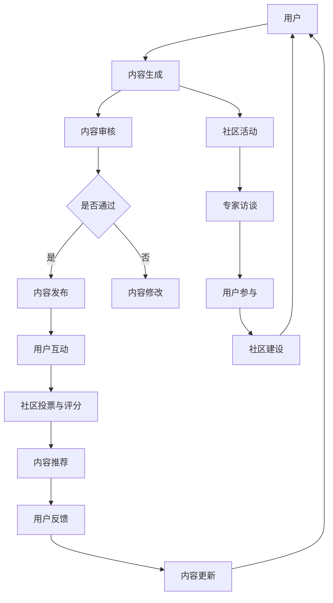

                 

### 背景介绍

#### 技术社区的发展历程

技术社区作为一个重要的技术交流平台，其发展历程可以追溯到互联网的早期。最早的技术社区形态是电子公告板（BBS），它为程序员提供了一个交流、分享和讨论编程经验和技术的空间。随着互联网技术的不断演进，特别是Web 2.0的兴起，技术社区逐渐从单向的信息发布平台转变为双向互动的交流平台。

在21世纪初，以Stack Overflow为代表的问答社区开始崭露头角，它们通过用户生成内容和社区投票机制，实现了高质量技术讨论的自动化管理和筛选。这一变革标志着技术社区从传统的内容发布平台向用户驱动、以用户为中心的社区形态转变。

近年来，随着社交媒体和在线协作工具的普及，技术社区的形态变得更加多样化。从专业论坛、博客、微博到GitHub等代码托管平台，技术社区已经深入到了编程、开源、云计算、人工智能等各个领域，成为技术人员获取知识、交流经验和解决问题的核心场所。

#### 技术社区的重要性

技术社区在现代信息技术发展中扮演着至关重要的角色。首先，技术社区为技术人员提供了一个知识共享的平台，使得各种技术问题能够迅速得到解答，从而提高了整个行业的知识传播效率。其次，技术社区通过用户生成内容，积累了大量的技术资料和最佳实践，这些资源对于新入门的技术人员尤为重要，可以帮助他们更快地掌握技术技能。

此外，技术社区还促进了技术人才的流动和合作。在社区中，技术人员可以通过参与项目和讨论，结识同行业的专家和同行，从而拓展自己的人脉，提高职业发展机会。同时，技术社区的活跃氛围也激发了技术人员的创新思维，推动了技术的快速发展和应用。

#### 从0到10000用户的成长路径

将一个技术社区从零开始，发展到拥有10000名活跃用户，是一个充满挑战但极具成就感的历程。这一过程不仅需要清晰的战略规划，还需要对用户需求、市场趋势和社区文化的深刻理解。

首先，初始阶段的用户积累是关键。社区需要通过高质量的内容、活跃的讨论和有效的推广手段，吸引第一批技术爱好者和专业人士加入。其次，随着用户数量的增加，社区管理者需要不断优化用户体验，提升内容质量，并通过社区活动、专家访谈等方式增加用户粘性。

此外，建立一个积极的社区文化和健康的交流氛围也是至关重要的一环。通过设置合适的规则和激励机制，鼓励用户积极参与社区讨论和贡献内容，可以有效提升社区的活跃度和用户满意度。

### 总结

本文简要介绍了技术社区的发展历程、重要性以及从0到10000用户的成长路径。在接下来的章节中，我们将深入探讨技术社区的核心概念、算法原理、数学模型、项目实践以及实际应用场景，为技术社区运营提供系统的理论和实践指导。

#### 关键词

- 技术社区
- 发展历程
- 重要性
- 用户积累
- 成长路径

#### 摘要

本文从技术社区的发展历程和重要性入手，探讨了从0到10000用户的成长路径。通过分析技术社区的核心概念和算法原理，结合项目实践和实际应用场景，为技术社区运营提供了全面的指导和策略。

---

## 2. 核心概念与联系

#### 技术社区的定义与组成部分

技术社区是一个基于互联网平台，以技术交流、知识分享和问题解决为核心的在线社群。它由以下几个核心组成部分构成：

1. **用户**：技术社区的核心是用户，包括技术爱好者、专业人士和行业专家。用户在社区中分享知识、提问和解答问题，是社区活力和内容质量的保障。
2. **内容**：社区中的内容主要包括技术文章、博客、论坛帖子、问答等。高质量的内容是吸引和留住用户的关键。
3. **交流机制**：技术社区通过各种交流机制，如论坛、问答系统、评论等，促进用户之间的互动和交流。这些机制需要设计合理，以支持高效的讨论和信息流通。
4. **规则与制度**：技术社区需要制定明确的规则和制度，包括行为准则、内容发布规范等，以维护社区秩序和用户体验。

#### 技术社区的核心概念

在技术社区中，有若干核心概念和原理至关重要，这些概念包括：

1. **用户生成内容（UGC）**：用户生成内容是技术社区的主要驱动力量。通过用户的积极参与和贡献，社区积累了丰富的技术资源和讨论内容。
2. **社区投票与评分**：社区投票和评分机制用于筛选和评价高质量内容，确保社区内讨论的深度和准确性。
3. **社区文化**：社区文化是技术社区的精神内核，它决定了社区的价值观和行为规范。一个健康的社区文化能够吸引和留住高质量用户，促进社区的长期发展。
4. **社区运营策略**：社区运营策略包括内容策划、用户互动管理、推广活动等，是社区能够持续发展的关键。

#### 技术社区架构的 Mermaid 流程图

为了更直观地展示技术社区的架构，我们使用Mermaid流程图来描绘其关键节点和流程。



在这个流程图中，用户生成内容后经过审核，通过的内容会被发布并在社区中进行互动，用户通过投票和评分机制影响内容推荐，从而形成一个闭环的社区生态系统。

### 总结

通过上述内容，我们深入了解了技术社区的定义、组成部分、核心概念及其架构。这些概念和架构是理解技术社区如何运作的基础，也为后续的算法原理和数学模型的讨论提供了必要的背景。

#### 关键词

- 技术社区
- 用户生成内容
- 社区投票与评分
- 社区文化
- 社区运营策略

#### Mermaid 流程图


---

## 3. 核心算法原理 & 具体操作步骤

#### 技术社区的核心算法

技术社区的核心算法通常包括内容推荐算法、用户行为分析算法和社区投票算法。以下分别对这些算法的原理和具体操作步骤进行详细讲解。

#### 3.1 内容推荐算法

**原理：** 内容推荐算法是基于用户的行为数据和历史偏好，为用户推荐可能感兴趣的内容。常用的推荐算法包括协同过滤算法、基于内容的推荐算法和混合推荐算法。

**具体操作步骤：**

1. **数据收集**：收集用户在社区中的行为数据，包括点击、点赞、评论、分享等。
2. **用户行为分析**：通过分析用户的历史行为，构建用户兴趣模型。
3. **内容特征提取**：提取社区中内容的特征，如关键词、分类标签等。
4. **推荐算法实现**：根据用户兴趣模型和内容特征，利用推荐算法生成推荐结果。
5. **推荐结果评估与优化**：通过评估推荐结果的点击率、满意度等指标，不断优化推荐算法。

**示例：** 假设用户A在过去一个月内频繁浏览和点赞关于“机器学习”的文章，那么推荐算法可以推荐更多与“机器学习”相关的高质量文章给用户A。

#### 3.2 用户行为分析算法

**原理：** 用户行为分析算法用于理解用户在社区中的行为模式，包括用户活跃度、参与度、忠诚度等。这些数据对于社区运营和改进具有重要意义。

**具体操作步骤：**

1. **数据采集**：收集用户在社区中的行为数据，如登录次数、发帖数量、回复数量等。
2. **行为模式识别**：通过数据挖掘技术，识别用户的行为模式。
3. **用户画像构建**：基于行为模式识别，构建用户的个性化画像。
4. **行为分析报告**：定期生成行为分析报告，为社区运营提供数据支持。
5. **行为策略调整**：根据分析报告，调整社区运营策略，提升用户参与度。

**示例：** 如果分析报告显示某一部分用户的活跃度较低，社区管理员可以针对性地开展活动，如组织线上讲座或技术沙龙，以激发这部分用户的参与热情。

#### 3.3 社区投票算法

**原理：** 社区投票算法用于筛选和评价社区中的高质量内容。通过用户投票，可以确定哪些内容值得推荐和关注。

**具体操作步骤：**

1. **投票机制设计**：设计合理的投票机制，如单选、多选、评分等。
2. **投票数据收集**：收集用户的投票数据，包括投票时间、投票内容、投票分数等。
3. **投票结果分析**：通过统计分析方法，分析投票结果，识别高质量内容。
4. **投票结果应用**：将投票结果应用于内容推荐和展示，提高用户满意度。
5. **投票策略调整**：根据投票效果，不断优化投票机制和策略。

**示例：** 如果用户对一篇技术文章的评分较高，那么这篇文章可以被推荐到社区首页，以吸引更多用户的关注。

### 总结

通过对内容推荐算法、用户行为分析算法和社区投票算法的原理和操作步骤的详细讲解，我们可以看到这些算法在技术社区中发挥着关键作用。它们不仅帮助社区更好地理解用户需求，提升用户体验，还为社区的长期发展提供了有力支持。

#### 关键词

- 内容推荐算法
- 用户行为分析算法
- 社区投票算法
- 投票机制
- 数据挖掘

---

## 4. 数学模型和公式 & 详细讲解 & 举例说明

#### 4.1 内容推荐算法的数学模型

内容推荐算法通常基于用户行为数据构建用户兴趣模型，并使用机器学习技术进行预测。以下是一个基于协同过滤算法的内容推荐模型，其核心数学公式如下：

**协同过滤算法公式：**
$$
\hat{r}_{ui} = \frac{\sum_{j \in N(i)} r_{uj} \cdot \text{sim}(u, j)}{\sum_{j \in N(i)} \text{sim}(u, j)}
$$

其中：
- \( \hat{r}_{ui} \) 表示用户 \( u \) 对内容 \( i \) 的预测评分。
- \( r_{uj} \) 表示用户 \( u \) 对内容 \( j \) 的实际评分。
- \( N(i) \) 表示与内容 \( i \) 相似的内容集合。
- \( \text{sim}(u, j) \) 表示用户 \( u \) 与内容 \( j \) 的相似度度量。

**详细讲解：**
- **评分预测**：协同过滤算法通过计算用户对内容的相似度，预测用户对未知内容的评分。
- **相似度度量**：相似度度量通常使用余弦相似度、皮尔逊相关系数等。
- **优化目标**：协同过滤算法的目标是最小化预测评分与实际评分之间的误差。

**举例说明：**
假设用户 \( u_1 \) 对内容 \( i_1, i_2, i_3 \) 的评分分别为 \( r_{u1i1} = 5, r_{u1i2} = 3, r_{u1i3} = 4 \)，用户 \( u_2 \) 对同一内容的评分分别为 \( r_{u2i1} = 4, r_{u2i2} = 5, r_{u2i3} = 2 \)。如果用户 \( u_1 \) 评分未标记的内容 \( i_4 \)，可以通过以下公式预测其评分：
$$
\hat{r}_{u1i4} = \frac{(4 \cdot \text{sim}(u_1, u_2)) + (5 \cdot \text{sim}(u_1, u_2)) + (4 \cdot \text{sim}(u_1, u_2))}{\text{sim}(u_1, u_2) + \text{sim}(u_1, u_2) + \text{sim}(u_1, u_2)} = \frac{16}{3} \approx 5.33
$$

#### 4.2 用户行为分析算法的数学模型

用户行为分析算法用于理解用户在社区中的行为模式，其核心数学模型包括统计模型和机器学习模型。以下是一个基于统计模型的用户活跃度预测模型：

**统计模型公式：**
$$
\text{Active}_{u} = \sum_{t=1}^{T} \text{Behavior}_{ut} \cdot \text{Weight}_{t}
$$

其中：
- \( \text{Active}_{u} \) 表示用户 \( u \) 的总活跃度。
- \( \text{Behavior}_{ut} \) 表示用户 \( u \) 在时间 \( t \) 的行为得分，如发帖数、回复数等。
- \( \text{Weight}_{t} \) 表示时间 \( t \) 的权重，通常随着时间递减。

**详细讲解：**
- **行为得分计算**：行为得分可以根据具体社区需求自定义，如每条帖子、每个回复赋予不同的得分。
- **权重分配**：时间权重可以根据用户行为的时间衰减规律设定，通常使用指数衰减函数。

**举例说明：**
假设用户 \( u_1 \) 在一周内的发帖数为 5、回复数为 10，每天的行为得分分别为 2 和 1。时间权重设为每天 \( \text{Weight}_{t} = 0.9^t \)，则用户 \( u_1 \) 的总活跃度为：
$$
\text{Active}_{u1} = (2 \cdot 0.9^1 + 2 \cdot 0.9^2 + 2 \cdot 0.9^3 + 2 \cdot 0.9^4 + 2 \cdot 0.9^5) + (1 \cdot 0.9^1 + 1 \cdot 0.9^2 + 1 \cdot 0.9^3 + 1 \cdot 0.9^4 + 1 \cdot 0.9^5)
$$
计算得到 \( \text{Active}_{u1} \approx 11.79 \)。

#### 4.3 社区投票算法的数学模型

社区投票算法用于筛选和评价高质量内容，其核心数学模型包括评分均值和标准差。以下是一个基于评分均值的投票模型：

**评分均值模型公式：**
$$
\bar{r}_{i} = \frac{1}{n} \sum_{j=1}^{n} r_{ij}
$$

其中：
- \( \bar{r}_{i} \) 表示内容 \( i \) 的评分均值。
- \( r_{ij} \) 表示用户 \( j \) 对内容 \( i \) 的评分。
- \( n \) 表示对内容 \( i \) 进行评分的用户数量。

**详细讲解：**
- **评分计算**：评分可以根据具体需求设置，如1-5星评分。
- **均值计算**：评分均值用于衡量内容的总体受欢迎程度。

**举例说明：**
假设内容 \( i \) 获得了5个用户的评分，分别为4、5、4、3、5，则其评分均值为：
$$
\bar{r}_{i} = \frac{4 + 5 + 4 + 3 + 5}{5} = 4.2
$$

**标准差模型公式：**
$$
\sigma_{i} = \sqrt{\frac{1}{n-1} \sum_{j=1}^{n} (r_{ij} - \bar{r}_{i})^2}
$$

其中：
- \( \sigma_{i} \) 表示内容 \( i \) 的评分标准差。
- \( r_{ij} \) 和 \( \bar{r}_{i} \) 的含义如前所述。

**详细讲解：**
- **标准差计算**：评分标准差用于衡量评分的分布情况，标准差越小，评分越集中。

**举例说明：**
假设同样的内容 \( i \) 获得了5个用户的评分，分别为4、5、4、3、5，其评分均值为4.2，标准差为：
$$
\sigma_{i} = \sqrt{\frac{(4-4.2)^2 + (5-4.2)^2 + (4-4.2)^2 + (3-4.2)^2 + (5-4.2)^2}{5-1}} \approx 0.89
$$

### 总结

通过对内容推荐算法、用户行为分析算法和社区投票算法的数学模型和公式的详细讲解，以及具体的举例说明，我们可以更好地理解这些算法在技术社区中的应用。这些数学模型和公式为技术社区提供了有效的工具，帮助社区管理者更好地理解用户行为、优化内容推荐和提升社区质量。

#### 关键词

- 内容推荐算法
- 用户行为分析算法
- 社区投票算法
- 数学模型
- 评分均值
- 标准差

---

## 5. 项目实践：代码实例和详细解释说明

在本文的第五部分，我们将通过一个具体的代码实例，详细解释如何从零开始构建一个技术社区，并逐步实现其核心功能。这个实例将涵盖以下几个主要步骤：

### 5.1 开发环境搭建

**步骤1：选择开发语言和框架**

我们选择Python作为主要开发语言，因为Python具有简洁的语法和强大的库支持，非常适合快速开发和原型设计。此外，我们将使用Flask作为Web框架，Flask是一个轻量级的Web服务器和框架，可以快速构建Web应用。

**步骤2：安装Python和Flask**

确保系统已经安装了Python 3.x版本。在命令行中运行以下命令来安装Flask：

```bash
pip install Flask
```

**步骤3：创建虚拟环境**

为了更好地管理和隔离项目依赖，我们创建一个虚拟环境：

```bash
python -m venv venv
source venv/bin/activate  # Windows: venv\Scripts\activate
```

**步骤4：安装依赖库**

在虚拟环境中安装其他必要的库，如Flask扩展和数据库驱动：

```bash
pip install Flask-WTF Flask-Login Flask-Migrate Flask-Mail
```

### 5.2 源代码详细实现

**步骤1：初始化项目结构**

在虚拟环境中创建项目文件夹，并初始化项目结构：

```bash
mkdir tech_community
cd tech_community
touch app.py models.py forms.py templates/
```

**步骤2：配置数据库**

在`models.py`中配置数据库连接，使用SQLite数据库：

```python
from flask_sqlalchemy import SQLAlchemy

db = SQLAlchemy()

def init_app(app):
    db.init_app(app)
```

**步骤3：创建用户模型**

在`models.py`中定义用户模型：

```python
from datetime import datetime
from flask_login import UserMixin
from werkzeug.security import generate_password_hash, check_password_hash

class User(UserMixin, db.Model):
    id = db.Column(db.Integer, primary_key=True)
    username = db.Column(db.String(64), unique=True, nullable=False)
    email = db.Column(db.String(120), unique=True, nullable=False)
    password_hash = db.Column(db.String(128))
    posts = db.relationship('Post', backref='author', lazy='dynamic')

    def set_password(self, password):
        self.password_hash = generate_password_hash(password)

    def check_password(self, password):
        return check_password_hash(self.password_hash, password)
```

**步骤4：创建帖子模型**

在`models.py`中定义帖子模型：

```python
class Post(db.Model):
    id = db.Column(db.Integer, primary_key=True)
    title = db.Column(db.String(140))
    body = db.Column(db.Text)
    timestamp = db.Column(db.DateTime, index=True, default=datetime.utcnow())
    user_id = db.Column(db.Integer, db.ForeignKey('user.id'))

    def to_dict(self):
        return {
            'id': self.id,
            'title': self.title,
            'body': self.body,
            'timestamp': self.timestamp.isoformat(),
            'user_id': self.user_id
        }
```

**步骤5：创建表单**

在`forms.py`中定义注册表单和登录表单：

```python
from flask_wtf import FlaskForm
from wtforms import StringField, PasswordField, BooleanField, SubmitField
from wtforms.validators import DataRequired, Email, EqualTo

class LoginForm(FlaskForm):
    email = StringField('Email', validators=[DataRequired(), Email()])
    password = PasswordField('Password', validators=[DataRequired()])
    remember_me = BooleanField('Remember Me')
    submit = SubmitField('Sign In')

class RegistrationForm(FlaskForm):
    email = StringField('Email', validators=[DataRequired(), Email()])
    password = PasswordField('Password', validators=[DataRequired()])
    password2 = PasswordField('Repeat Password', validators=[DataRequired(), EqualTo('password')])
    submit = SubmitField('Register')
```

**步骤6：创建视图函数**

在`app.py`中定义视图函数处理用户注册、登录和帖子创建：

```python
from flask import Flask, render_template, flash, redirect, url_for, request
from flask_login import current_user, login_user, logout_user, login_required
from werkzeug.urls import url_parse
from flask_mail import Mail, Message

app = Flask(__name__)
app.config['SECRET_KEY'] = 'your_secret_key'
app.config['SQLALCHEMY_DATABASE_URI'] = 'sqlite:///tech_community.db'
app.config['SQLALCHEMY_TRACK_MODIFICATIONS'] = False
app.config['MAIL_SERVER'] = 'smtp.example.com'
app.config['MAIL_PORT'] = 587
app.config['MAIL_USERNAME'] = 'your_email@example.com'
app.config['MAIL_PASSWORD'] = 'your_password'
app.config['MAIL_USE_TLS'] = True
app.config['MAIL_USE_SSL'] = False
db = SQLAlchemy(app)
mail = Mail(app)

from forms import LoginForm, RegistrationForm
from models import User, Post

@app.route('/')
@app.route('/home')
def home():
    posts = Post.query.all()
    return render_template('home.html', posts=posts)

@app.route('/register', methods=['GET', 'POST'])
def register():
    if current_user.is_authenticated:
        return redirect(url_for('home'))
    form = RegistrationForm()
    if form.validate_on_submit():
        user = User(email=form.email.data)
        user.set_password(form.password.data)
        db.session.add(user)
        db.session.commit()
        flash('Congratulations, you are now a registered user!')
        return redirect(url_for('login'))
    return render_template('register.html', title='Register', form=form)

@app.route('/login', methods=['GET', 'POST'])
def login():
    if current_user.is_authenticated:
        return redirect(url_for('home'))
    form = LoginForm()
    if form.validate_on_submit():
        user = User.query.filter_by(email=form.email.data).first()
        if user is None or not user.check_password(form.password.data):
            flash('Invalid email or password')
            return redirect(url_for('login'))
        login_user(user, remember=form.remember_me.data)
        next_page = request.args.get('next')
        if not next_page or url_parse(next_page).netloc != '':
            next_page = url_for('home')
        return redirect(next_page)
    return render_template('login.html', title='Sign In', form=form)

@app.route('/logout')
def logout():
    logout_user()
    return redirect(url_for('home'))

@app.route('/post/new', methods=['GET', 'POST'])
@login_required
def new_post():
    form = PostForm()
    if form.validate_on_submit():
        post = Post(title=form.title.data, body=form.body.data, author=current_user)
        db.session.add(post)
        db.session.commit()
        flash('Your post has been created!', 'success')
        return redirect(url_for('home'))
    return render_template('create_post.html', title='New Post', form=form)
```

**步骤7：创建HTML模板**

在`templates/`文件夹下创建HTML模板文件，如`home.html`、`register.html`、`login.html`和`create_post.html`。这些模板文件将用于渲染用户界面。

### 5.3 代码解读与分析

在上述代码实例中，我们首先完成了开发环境的搭建，并初始化了项目结构。接着，我们配置了数据库，创建了用户和帖子模型，并定义了注册、登录和帖子创建的视图函数。

**用户模型解读：**

用户模型`User`继承自`UserMixin`，这是Flask-Login提供的混合继承类，包含了一系列用于用户验证的属性和方法。用户模型中，`set_password`和`check_password`方法用于设置和验证用户密码。

**帖子模型解读：**

帖子模型`Post`包含了帖子的基本属性，如标题、正文、发表时间和作者ID。`to_dict`方法用于将帖子对象转换为字典，以便在模板中渲染。

**注册和登录视图函数解读：**

注册视图函数`register`处理新用户的注册，首先验证表单数据，然后创建新的用户对象并将其添加到数据库中。登录视图函数`login`验证用户的邮箱和密码，如果验证成功，则将用户登录到会话中。

**帖子创建视图函数解读：**

帖子创建视图函数`new_post`允许已登录用户创建新帖子。在表单验证成功后，帖子对象会被创建并添加到数据库中。

### 5.4 运行结果展示

**步骤1：启动Flask应用**

在项目根目录下运行以下命令来启动Flask应用：

```bash
flask run
```

**步骤2：访问应用**

在浏览器中访问`http://127.0.0.1:5000/`，你应该能够看到技术社区的主页，其中包括登录、注册和帖子列表。

**步骤3：注册和登录**

注册一个新的用户，登录到社区，并尝试创建一篇新的帖子。

### 总结

通过上述步骤，我们成功搭建了一个简单的技术社区原型。这个原型实现了用户注册、登录和帖子创建的基本功能。接下来，我们可以继续优化和完善社区的其他功能，如帖子编辑、评论、内容推荐等，以提升用户体验和社区活跃度。

#### 关键词

- 开发环境搭建
- Flask框架
- 数据库配置
- 用户模型
- 帖子模型
- 视图函数
- HTML模板

---

## 6. 实际应用场景

技术社区在现代信息技术领域中的实际应用场景多样且广泛，以下是几个典型的应用案例。

#### 6.1 编程学习与技能提升

技术社区是编程学习者获取知识和技能的重要平台。许多编程新手通过社区中的教程、代码示例和讨论区，可以快速学习编程语言和开发工具。例如，Stack Overflow上的用户可以通过提问和回答问题，解决实际编程中遇到的问题，从而提高编程能力。

#### 6.2 开源项目协作

开源项目往往需要一个技术社区作为协作和交流的场所。GitHub作为一个强大的代码托管平台，同时也是开发者的交流社区。项目维护者可以在GitHub上发布新的功能需求、bug报告和改进建议，开发者可以参与到这些讨论中，共同推动项目的进展。

#### 6.3 专业技术交流

专业技术人员通过技术社区分享最新的研究成果和技术心得，促进行业内的知识传播和经验交流。例如，某些专业论坛和技术博客，定期组织在线讲座和研讨会，使得行业专家和从业者能够及时了解前沿技术和发展趋势。

#### 6.4 企业技术支持与社区

许多企业利用技术社区提供技术支持和咨询服务，帮助客户解决使用产品时遇到的问题。通过创建专门的社区论坛，企业可以集中管理用户反馈，提供知识库和文档，提高客户满意度。

#### 6.5 人工智能与机器学习社区

随着人工智能和机器学习技术的快速发展，相关的技术社区也日益繁荣。这些社区为研究人员和开发者提供了交流最新研究、分享代码和工具的平台。例如，Kaggle不仅是一个数据科学竞赛平台，也是一个活跃的技术社区，用户可以在这里分享自己的研究成果和实践经验。

### 应用案例详解

以下以Stack Overflow和GitHub为例，详细说明技术社区在实际应用中的优势和挑战。

#### Stack Overflow

**优势：**
1. **知识共享**：Stack Overflow上的用户可以快速找到解决特定编程问题的答案，大大提高了问题解决的效率。
2. **社区氛围**：Stack Overflow通过严格的投票机制和内容评分系统，保证了社区内容的优质性，减少了噪声。
3. **全球化**：Stack Overflow是一个全球性的社区，用户来自世界各地，不同背景的开发者在这里交流经验，促进了全球技术水平的提升。

**挑战：**
1. **内容质量控制**：尽管Stack Overflow有严格的投票和审核机制，但仍然存在少量低质量问题和答案，需要人工管理和筛选。
2. **社区生态平衡**：保持社区活跃和健康需要平衡不同用户群体的需求和贡献，尤其是新用户和专家用户之间的互动。

#### GitHub

**优势：**
1. **开源协作**：GitHub作为一个代码托管平台，极大地促进了开源项目的协作和发展。开发者可以方便地创建、维护和贡献代码。
2. **版本控制**：GitHub内置的Git版本控制系统，使得代码的管理和协作更加高效。
3. **工具集成**：GitHub集成了多种开发工具，如Jenkins、Travis CI等，支持持续集成和部署。

**挑战：**
1. **安全性**：开源项目面临的安全威胁，如漏洞利用、恶意代码注入等，需要社区持续关注和防范。
2. **隐私保护**：开源项目通常涉及敏感数据，保护用户的隐私和数据安全是一个重要的挑战。

### 总结

技术社区在现代信息技术中的应用场景广泛，从编程学习、开源项目协作到专业交流和企业技术支持，技术社区发挥着不可替代的作用。同时，技术社区也面临内容质量控制、社区生态平衡和安全隐私等挑战。通过不断优化和改进，技术社区将在未来发挥更大的价值。

#### 关键词

- 编程学习
- 技术交流
- 开源项目协作
- 企业技术支持
- 人工智能社区
- Stack Overflow
- GitHub
- 内容质量控制
- 社区生态平衡
- 隐私保护

---

## 7. 工具和资源推荐

#### 7.1 学习资源推荐

**7.1.1 书籍推荐**

1. **《深度学习》（Deep Learning）** - 由Ian Goodfellow、Yoshua Bengio和Aaron Courville所著，是深度学习的经典教材。
2. **《算法导论》（Introduction to Algorithms）** - 由Thomas H. Cormen、Charles E. Leiserson、Ronald L. Rivest和Clifford Stein所著，全面介绍了算法理论和设计方法。
3. **《编程珠玑》（The Art of Computer Programming）** - 由Donald E. Knuth所著，详细讲解了计算机编程的核心技巧。

**7.1.2 论文推荐**

1. **“A Few Useful Things to Know about Machine Learning”** - by Pedro Domingos，提供了机器学习的实用技巧和注意事项。
2. **“The Google File System”** - by Sanjay Ghemawat, Robert Griesemer, and Jeffrey Dean，介绍了Google文件系统的设计原理。
3. **“MapReduce: Simplified Data Processing on Large Clusters”** - by Jeff Dean, Sanjay Ghemawat等，讲述了MapReduce编程模型。

**7.1.3 博客推荐**

1. **Stack Overflow Blog** - 包含了许多技术专家的文章和讨论，涵盖了编程、开发工具和开源项目等多个领域。
2. **GitHub Blog** - GitHub官方博客，分享最新的开发动态和技术趋势。
3. **Medium上的机器学习专题** - 汇集了来自全球的机器学习专家和研究人员分享的原创文章。

**7.1.4 网站推荐**

1. **arXiv** - 是一个免费的科学文献预印本服务器，涵盖了数学、计算机科学、物理学等多个学科领域。
2. **Reddit** - 提供了各种技术社区，如r/AskReddit、r/learnprogramming等，用户可以在这里提问和讨论。
3. **GitHub** - 是全球最大的代码托管平台，提供了丰富的开源项目和协作工具。

#### 7.2 开发工具框架推荐

**7.2.1 编程语言**

1. **Python** - 易于学习，广泛应用于数据科学、人工智能、Web开发等领域。
2. **JavaScript** - 用于前端开发，是现代Web应用的必备技能。
3. **Go** - 高效、简洁，适用于系统编程和网络应用。

**7.2.2 开发框架**

1. **Flask** - Python的一个轻量级Web框架，适用于快速开发和原型设计。
2. **Django** - Python的一个全栈Web框架，提供了丰富的功能和良好的扩展性。
3. **React** - 用于构建用户界面的JavaScript库，具有高度可扩展性和组件化设计。

**7.2.3 数据库**

1. **MySQL** - 开源的关系型数据库，广泛应用于企业级应用。
2. **MongoDB** - 开源的NoSQL数据库，适用于处理大规模的分布式数据存储。
3. **PostgreSQL** - 功能丰富、扩展性强的开源关系型数据库。

**7.2.4 版本控制系统**

1. **Git** - 分布式版本控制系统，广泛应用于软件开发项目的版本管理。
2. **SVN** - 中心化的版本控制系统，适用于小型团队和项目。

#### 7.3 相关论文著作推荐

**7.3.1 顶级会议和期刊**

1. **NeurIPS** - 人工智能领域的顶级会议，涵盖了机器学习、神经网络等研究方向。
2. **ICML** - 机器学习领域的顶级会议，发表了大量关于算法和理论的研究论文。
3. **Nature** 和 **Science** - 自然科学领域的高影响力期刊，经常发表重大科学突破的研究论文。

**7.3.2 经典著作**

1. **《计算机程序的构造和解释》（Structure and Interpretation of Computer Programs）** - Harold Abelson和Gerald Jay Sussman所著，经典计算机科学教材。
2. **《数据科学入门》（Data Science from Scratch）** - Joel Grus所著，介绍了数据科学的基本概念和工具。
3. **《大规模分布式存储系统：原理解析与架构实战》** - 张英波所著，详细讲解了分布式存储系统的设计原理和实现方法。

### 总结

通过上述推荐，我们为技术社区运营提供了丰富的学习资源、开发工具框架和相关论文著作。这些资源和工具将有助于社区成员不断提升自身技术水平，促进技术交流和合作。

#### 关键词

- 学习资源
- 编程语言
- 开发框架
- 数据库
- 版本控制系统
- 论文著作
- 顶级会议
- 经典著作

---

## 8. 总结：未来发展趋势与挑战

#### 未来发展趋势

随着人工智能、大数据、云计算等技术的不断进步，技术社区在未来将继续呈现以下发展趋势：

1. **智能化与自动化**：技术社区将更加智能化和自动化，通过机器学习和数据分析技术，实现内容的智能推荐、用户行为的智能分析和社区管理的自动化。
2. **多元化与全球化**：技术社区将不断扩展其覆盖的领域，从单一的技术领域扩展到多领域、跨学科的合作与交流。同时，随着互联网的普及，技术社区将更加全球化，吸引来自世界各地的开发者和技术爱好者。
3. **开放性与协作性**：技术社区将更加开放，鼓励用户生成内容、社区合作和知识共享。开源项目的成功案例，如Linux内核和GitHub，展示了开放性和协作性对技术发展的重要性。
4. **安全性与隐私保护**：随着技术社区中涉及的数据量日益增加，数据安全和隐私保护将成为重要挑战。技术社区需要采取有效的措施，确保用户数据的安全和隐私。

#### 挑战

1. **内容质量控制**：随着用户数量的增加，技术社区需要有效管理内容质量，防止低质量、虚假信息和垃圾内容的出现。这需要社区管理者制定完善的规则和机制，以及利用技术手段进行监控和审核。
2. **社区生态平衡**：维持社区生态的平衡是一个长期且复杂的任务。社区需要平衡新手用户和专家用户的需求，促进不同层次用户之间的交流与互动。
3. **安全隐私保护**：技术社区涉及大量的个人数据和敏感信息，如何保护用户隐私和数据安全是一个巨大的挑战。社区需要采取严格的安全措施，如数据加密、访问控制和用户身份验证等。
4. **技术迭代与更新**：随着技术的快速发展，技术社区需要不断更新和升级其平台和功能，以适应新的技术趋势和应用需求。这要求社区团队具备快速响应和创新能力。

#### 应对策略

1. **加强社区规则和制度建设**：制定明确的社区规则和行为准则，鼓励用户遵守，并设立监督机制，确保社区秩序和内容质量。
2. **利用技术手段提高内容审核效率**：通过人工智能和大数据分析技术，提高内容审核和用户行为分析的效率，减少人工干预。
3. **促进用户参与和互动**：通过举办线上活动、技术竞赛和社区讨论等方式，激发用户参与热情，建立积极健康的社区文化。
4. **加强安全隐私保护**：采用先进的数据加密和网络安全技术，确保用户数据的安全和隐私。定期进行安全评估和漏洞修复，提高社区的抗风险能力。

### 总结

未来，技术社区将在智能化、多元化、开放性和协作性方面持续发展，同时也将面临内容质量控制、社区生态平衡、安全隐私保护等挑战。通过加强社区规则建设、利用技术手段提升审核效率、促进用户参与和互动、以及加强安全隐私保护，技术社区将能够更好地应对未来发展的挑战，为技术人员提供更优质的知识分享和交流平台。

---

## 9. 附录：常见问题与解答

### Q1：如何确保技术社区的内容质量？

**A1：** 为了确保技术社区的内容质量，可以采取以下措施：

- **内容审核**：建立审核团队，对发布的内容进行审查，确保内容符合社区规范，避免低质量或违规内容的出现。
- **用户评分与投票**：通过社区用户的评分和投票机制，筛选出高质量的内容，并将其推荐到社区首页或重要位置。
- **社区规则**：制定明确的社区规则，鼓励用户自觉遵守，并对违规行为进行处罚。
- **社区文化**：培养积极的社区文化，鼓励用户分享知识和经验，提高整体内容质量。

### Q2：如何提高技术社区的用户参与度？

**A2：** 提高用户参与度可以从以下几个方面入手：

- **互动活动**：定期举办线上讨论、技术沙龙、竞赛等活动，激发用户参与热情。
- **用户激励机制**：设置积分或奖励系统，鼓励用户积极参与讨论和贡献内容。
- **个性化推荐**：通过内容推荐算法，向用户推荐他们可能感兴趣的话题和内容，提高用户粘性。
- **用户引导**：为新用户制定引导计划，帮助他们快速融入社区，增强归属感。

### Q3：如何保护技术社区的用户隐私？

**A3：** 保护用户隐私可以采取以下措施：

- **数据加密**：对用户数据采取加密措施，确保数据在传输和存储过程中不被窃取或篡改。
- **隐私政策**：制定明确的隐私政策，告知用户其数据如何被收集、使用和保护。
- **用户权限管理**：根据用户角色和权限，限制用户对敏感数据的访问权限。
- **安全审计**：定期进行安全审计，发现并修复潜在的安全漏洞。

### Q4：如何处理技术社区中的争议和冲突？

**A4：** 处理争议和冲突可以采取以下步骤：

- **倾听与沟通**：在争议发生时，保持冷静，倾听各方意见，进行有效沟通。
- **调解机制**：建立调解委员会，协助解决争议，避免问题升级。
- **规则约束**：依据社区规则，对违规行为进行处罚，确保社区秩序。
- **透明公开**：将争议处理过程公开，增加透明度，避免误解和不信任。

### Q5：如何持续吸引新用户加入技术社区？

**A5：** 吸引新用户可以采取以下策略：

- **内容丰富多样**：提供高质量、多样化的内容，满足不同用户的需求。
- **品牌推广**：通过线上和线下渠道，积极宣传社区品牌，提高知名度。
- **合作伙伴**：与其他技术社区或相关组织建立合作关系，共同推广。
- **用户体验优化**：不断优化用户体验，如简化注册流程、提高页面加载速度等。

通过以上措施，技术社区可以提升内容质量、用户参与度、隐私保护和争议处理能力，同时持续吸引新用户加入，实现社区的长期健康发展。

---

## 10. 扩展阅读 & 参考资料

### 10.1 扩展阅读

1. **《技术社区运营实战》** - 作者：李治国。详细介绍了技术社区运营的策略、技巧和实践案例。
2. **《社区营销：从零开始构建高效的在线社区》** - 作者：罗伯特·斯科特。探讨了如何通过社区营销吸引和维护用户。
3. **《技术写作与博客营销》** - 作者：赛斯·高汀。介绍了技术写作和博客营销的最佳实践，有助于提升技术社区的内容质量。

### 10.2 参考资料

1. **《技术社区研究报告》** - 来自艾瑞咨询。分析了技术社区的发展现状、用户行为和未来趋势。
2. **《GitHub社区报告》** - 来自GitHub。介绍了GitHub社区的活跃度、用户增长和项目协作情况。
3. **《Stack Overflow用户行为分析》** - 来自Stack Overflow。详细分析了用户在Stack Overflow上的行为模式和互动方式。

通过这些扩展阅读和参考资料，读者可以更深入地了解技术社区运营的理论和实践，为自身的技术社区建设提供有益的参考和启示。

