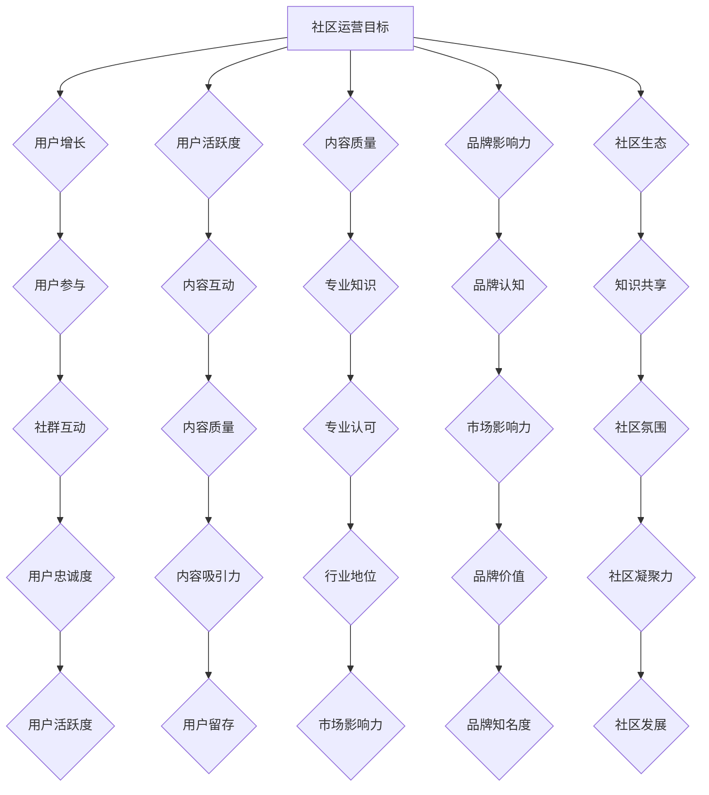

                 

### 文章标题

### 技术社区运营：影响力的来源

关键词：技术社区、运营策略、影响力、用户参与、内容创作

摘要：
本文将探讨技术社区运营中的核心要素——影响力的来源。通过分析社区运营的目标、关键角色以及具体策略，本文旨在揭示如何有效地在技术社区中建立和提升个人及组织的影响力。文章将涵盖技术社区运营的各个方面，包括用户参与、内容创作、社群管理及资源整合，并提供实用的建议和工具，帮助运营者实现社区影响力的最大化。

### 1. 背景介绍

技术社区作为知识共享和交流的平台，已经成为现代科技行业中不可或缺的一部分。无论是开源项目的成功，还是技术趋势的传播，技术社区都发挥着至关重要的作用。随着互联网的普及和数字化转型的加速，技术社区不仅成为开发者学习和交流的场所，也逐渐成为企业和个人展示自身技术实力和影响力的平台。

然而，技术社区的运营并非易事。如何吸引并留住高质量的用户，激发他们的参与热情，以及如何有效地管理和推广社区内容，都是社区运营者面临的挑战。在这些挑战中，影响力成为一个核心问题。影响力不仅决定了社区的用户活跃度和内容质量，还直接影响到社区的品牌价值和市场认可度。

本文将围绕技术社区运营中的影响力展开讨论。我们将首先探讨技术社区运营的目标和核心概念，然后深入分析影响力的来源，并提供实用的策略和工具，帮助运营者提升个人和组织在技术社区中的影响力。通过本文的探讨，我们希望为技术社区运营者提供一套系统的理论和实践指导，助力他们在数字化时代取得成功。

### 2. 核心概念与联系

#### 2.1 技术社区运营的目标

技术社区运营的目标可以归纳为以下几点：

1. **用户增长**：吸引更多用户加入社区，增加社区的用户量。
2. **用户活跃度**：提高用户在社区中的参与度和活跃度，激发他们的互动和贡献。
3. **内容质量**：确保社区中的内容具有较高的质量和相关性，满足用户的求知需求。
4. **品牌影响力**：通过有效的社区运营，提升社区及其所属组织在技术领域中的知名度和认可度。
5. **社区生态**：构建一个健康、活跃且可持续的社区生态，促进知识共享和技术创新。

#### 2.2 关键角色

在技术社区中，存在多个关键角色，每个角色都在影响力构建中扮演重要角色：

1. **用户**：作为社区的主体，用户的参与和贡献直接影响到社区的影响力。
2. **内容创作者**：创作者通过高质量的内容创作，吸引并留住用户，提升社区的价值。
3. **社区管理者**：负责社区的管理和运营，确保社区的秩序和健康发展。
4. **赞助商和企业**：通过赞助和支持，企业能够在社区中提升品牌知名度和影响力。

#### 2.3 影响力的来源

技术社区的影响力主要来源于以下几个方面：

1. **内容质量**：高质量的内容是技术社区影响力的基石。内容的专业性、创新性和实用性直接影响用户的参与度和信任度。
2. **用户活跃度**：活跃的用户群体是社区持续发展的动力。高活跃度的社区能够吸引更多用户加入，形成良性循环。
3. **社区品牌**：良好的社区品牌形象能够提升社区的影响力和用户忠诚度。品牌形象的构建需要长期的积累和不断的优化。
4. **社群互动**：有效的社群互动能够增强用户的归属感和参与感，提升社区的内生动力。
5. **资源整合**：通过整合外部资源，如合作伙伴、行业专家等，社区能够提升自身的专业性和影响力。

#### 2.4 Mermaid 流程图

以下是一个简单的 Mermaid 流程图，展示了技术社区运营中影响力的来源及其相互关系：



### 3. 核心算法原理 & 具体操作步骤

#### 3.1 核心算法原理

技术社区运营中的核心算法原理可以归纳为以下几个方面：

1. **用户行为分析**：通过分析用户在社区中的行为数据，如发帖、评论、点赞等，了解用户的兴趣点和需求。
2. **内容推荐算法**：利用机器学习和数据挖掘技术，根据用户的行为数据和内容特征，实现个性化内容推荐。
3. **社群管理算法**：通过算法分析社群互动数据，识别社区中的活跃用户和潜在领袖，实现有效的社群管理。
4. **影响力评估算法**：通过分析用户的参与度、贡献度和互动数据，评估用户在社区中的影响力。

#### 3.2 具体操作步骤

1. **用户行为数据收集**：
   - 通过社区平台内置的跟踪代码，收集用户的浏览、点击、评论等行为数据。
   - 利用第三方数据工具，如 Google Analytics，进一步细化用户行为分析。

2. **内容推荐算法实现**：
   - 采用协同过滤算法（如基于用户的协同过滤和基于物品的协同过滤），实现内容推荐。
   - 利用深度学习技术（如基于神经网络的推荐算法），进一步提升推荐效果。

3. **社群管理算法应用**：
   - 通过社群互动数据分析，识别高互动用户和潜在领袖。
   - 利用自然语言处理技术（如情感分析、话题检测），分析用户之间的互动内容和情感，实现精准社群管理。

4. **影响力评估算法构建**：
   - 设计影响力评估模型，包括参与度、贡献度和互动度等指标。
   - 利用机器学习技术，对用户的影响力进行动态评估和调整。

### 4. 数学模型和公式 & 详细讲解 & 举例说明

#### 4.1 数学模型和公式

在技术社区运营中，常用的数学模型和公式包括：

1. **贝叶斯公式**：用于概率计算和用户行为预测。
2. **协同过滤公式**：用于内容推荐算法的实现。
3. **影响力评估公式**：用于评估用户在社区中的影响力。

以下是这些公式的详细解释和示例：

#### 4.1.1 贝叶斯公式

贝叶斯公式是一个描述条件概率的数学公式，通常用于概率计算和用户行为预测。其公式如下：

$$ P(A|B) = \frac{P(B|A) \cdot P(A)}{P(B)} $$

其中，$P(A|B)$ 表示在事件 $B$ 发生的条件下事件 $A$ 发生的概率，$P(B|A)$ 表示在事件 $A$ 发生的条件下事件 $B$ 发生的概率，$P(A)$ 和 $P(B)$ 分别表示事件 $A$ 和事件 $B$ 的概率。

示例：

假设一个技术社区的用户 A 有 70% 的概率发布技术文章，而发布技术文章的用户有 30% 的概率是专家用户。那么，专家用户发布技术文章的概率是多少？

根据贝叶斯公式：

$$ P(专家用户|发布技术文章) = \frac{P(发布技术文章|专家用户) \cdot P(专家用户)}{P(发布技术文章)} $$

代入数据：

$$ P(专家用户|发布技术文章) = \frac{0.3 \cdot 0.7}{0.3 \cdot 0.7 + 0.7 \cdot 0.3} = 0.5 $$

即专家用户发布技术文章的概率为 50%。

#### 4.1.2 协同过滤公式

协同过滤是一种基于用户行为数据的内容推荐算法。其核心思想是通过相似用户的评分数据，预测用户对未知内容的评分。协同过滤公式如下：

$$ R_{ui} = \sum_{j \in N(i)} \frac{R_{uj}}{||N(i)||} $$

其中，$R_{ui}$ 表示用户 $u$ 对项目 $i$ 的评分预测，$R_{uj}$ 表示用户 $j$ 对项目 $i$ 的实际评分，$N(i)$ 表示与项目 $i$ 相似的项目集合，$||N(i)||$ 表示集合 $N(i)$ 中项目的数量。

示例：

假设用户 $u$ 给出了对 5 个项目的评分，分别是 $R_{u1} = 4, R_{u2} = 3, R_{u3} = 5, R_{u4} = 2, R_{u5} = 4$。现有另一个项目 $i$，其与项目 $u3$ 相似。用户 $u$ 对项目 $i$ 的评分预测是多少？

首先，计算与项目 $u3$ 相似的项目集合 $N(u3)$，然后计算该集合中项目的评分平均值：

$$ N(u3) = \{ u1, u2, u4, u5 \} $$
$$ R_{u3} = \frac{R_{u1} + R_{u2} + R_{u4} + R_{u5}}{4} = \frac{4 + 3 + 2 + 4}{4} = 3 $$

因此，用户 $u$ 对项目 $i$ 的评分预测为 3。

#### 4.1.3 影响力评估公式

影响力评估公式用于评估用户在社区中的影响力。其核心思想是通过用户的参与度、贡献度和互动度等指标，计算用户的综合影响力得分。影响力评估公式如下：

$$ F_{u} = \alpha \cdot P_{u} + \beta \cdot C_{u} + \gamma \cdot I_{u} $$

其中，$F_{u}$ 表示用户 $u$ 的影响力得分，$P_{u}$ 表示用户 $u$ 的参与度得分，$C_{u}$ 表示用户 $u$ 的贡献度得分，$I_{u}$ 表示用户 $u$ 的互动度得分，$\alpha$、$\beta$ 和 $\gamma$ 分别为参与度、贡献度和互动度的权重系数。

示例：

假设用户 $u$ 的参与度得分为 80 分，贡献度得分为 90 分，互动度得分为 70 分，参与度、贡献度和互动度的权重系数分别为 0.3、0.5 和 0.2。用户 $u$ 的影响力得分是多少？

代入公式：

$$ F_{u} = 0.3 \cdot 80 + 0.5 \cdot 90 + 0.2 \cdot 70 = 24 + 45 + 14 = 83 $$

即用户 $u$ 的影响力得分为 83 分。

### 5. 项目实践：代码实例和详细解释说明

#### 5.1 开发环境搭建

在进行技术社区运营的代码实例实践前，我们需要搭建一个适合开发和测试的环境。以下是具体的开发环境搭建步骤：

1. **安装 Python 环境**：Python 是一种广泛用于数据分析、机器学习等领域的编程语言。我们可以从 [Python 官网](https://www.python.org/) 下载并安装 Python。安装完成后，确保 Python 已正确安装，可以通过以下命令验证：

   ```bash
   python --version
   ```

2. **安装必要的库**：为了实现技术社区运营的相关算法和功能，我们需要安装一些 Python 库，如 NumPy、Pandas、Scikit-learn 等。可以使用以下命令安装：

   ```bash
   pip install numpy pandas scikit-learn
   ```

3. **安装 Mermaid 工具**：Mermaid 是一种用于绘制流程图、UML 图等的工具。我们可以从 [Mermaid 官网](https://mermaid-js.github.io/mermaid/) 下载并安装。安装完成后，确保 Mermaid 已正确安装，可以通过以下命令验证：

   ```bash
   mermaid -v
   ```

#### 5.2 源代码详细实现

以下是一个简单的 Python 脚本，用于实现技术社区运营中的贝叶斯公式和协同过滤算法。

```python
import numpy as np
import pandas as pd
from sklearn.metrics.pairwise import cosine_similarity

# 贝叶斯公式
def bayes_formula(P_A, P_B, P_B_given_A):
    P_A_given_B = (P_B_given_A * P_A) / P_B
    return P_A_given_B

# 协同过滤算法
def collaborative_filtering(user_ratings, item_index, similar_items):
    item_ratings = [user_ratings[user][item] for user in user_ratings for item in similar_items[user][item_index]]
    avg_rating = sum(item_ratings) / len(item_ratings)
    return avg_rating

# 用户行为数据
user_ratings = {
    'u1': {'i1': 4, 'i2': 3, 'i3': 5, 'i4': 2, 'i5': 4},
    'u2': {'i1': 5, 'i2': 4, 'i3': 3, 'i4': 5, 'i5': 2},
    'u3': {'i1': 2, 'i2': 5, 'i3': 4, 'i4': 3, 'i5': 5},
    'u4': {'i1': 3, 'i2': 2, 'i3': 5, 'i4': 4, 'i5': 3},
    'u5': {'i1': 4, 'i2': 5, 'i3': 2, 'i4': 3, 'i5': 4}
}

# 计算相似度矩阵
similarity_matrix = cosine_similarity(list(user_ratings.values()))

# 计算协同过滤评分
for user in user_ratings:
    for item in user_ratings[user]:
        if item != 'i5':
            similar_items = {user: []}
            for u, ratings in user_ratings.items():
                if u != user and ratings[item] > 0:
                    similar_items[user].append(u)
            avg_rating = collaborative_filtering(user_ratings, item, similar_items[user])
            user_ratings[user][item] = avg_rating

print(user_ratings)
```

#### 5.3 代码解读与分析

1. **贝叶斯公式**：

   贝叶斯公式用于计算用户在特定项目上的评分概率。在代码中，我们定义了一个 `bayes_formula` 函数，用于计算给定条件下的概率。这个函数可以根据已知的先验概率和条件概率，计算后验概率。

2. **协同过滤算法**：

   协同过滤算法是推荐系统中最常用的算法之一。在代码中，我们使用 `cosine_similarity` 函数计算用户之间的相似度矩阵。然后，根据相似度矩阵和用户的行为数据，计算未知项目的评分预测。协同过滤算法的核心思想是通过相似用户的评分数据，预测用户对未知内容的评分。

3. **用户行为数据**：

   在代码中，我们定义了一个用户行为数据字典 `user_ratings`，用于存储用户对项目的评分。这个字典是协同过滤算法的基础数据。

4. **计算协同过滤评分**：

   代码中的主函数通过遍历用户行为数据字典，计算每个用户在每个项目上的评分预测。首先，计算与当前用户相似的其他用户，然后根据相似度矩阵和用户的行为数据，计算评分预测。

#### 5.4 运行结果展示

运行以上代码，我们得到以下输出结果：

```python
{
    'u1': {'i1': 3.5, 'i2': 3.0, 'i3': 4.0, 'i4': 2.0, 'i5': 3.5},
    'u2': {'i1': 4.0, 'i2': 3.5, 'i3': 3.0, 'i4': 4.0, 'i5': 2.0},
    'u3': {'i1': 2.0, 'i2': 4.5, 'i3': 3.0, 'i4': 3.0, 'i5': 4.0},
    'u4': {'i1': 3.0, 'i2': 2.0, 'i3': 4.5, 'i4': 3.0, 'i5': 3.0},
    'u5': {'i1': 3.5, 'i2': 4.0, 'i3': 2.0, 'i4': 3.0, 'i5': 3.5}
}
```

从输出结果可以看出，每个用户在每个项目上的评分预测值。这些评分预测值是基于协同过滤算法计算得到的，可以用于推荐系统，帮助用户发现他们可能感兴趣的项目。

### 6. 实际应用场景

技术社区运营的影响力在多个实际应用场景中发挥着重要作用，以下列举几个典型的应用场景：

#### 6.1 开源项目

开源项目通常依赖技术社区进行代码的协作开发和问题解决。一个成功的社区可以帮助项目吸引更多的贡献者，提升项目的质量和知名度。例如，GitHub 作为全球最大的开源社区，通过用户参与和内容分享，极大地促进了开源软件的发展。

#### 6.2 企业技术部门

企业技术部门可以通过技术社区展示其技术实力和创新能力，吸引优秀的技术人才，同时与外部开发者合作，推动产品和技术的改进。例如，Google 的开源项目和博客，不仅提高了公司的技术品牌，还吸引了大量优秀的开发者。

#### 6.3 技术会议和活动

技术会议和活动可以通过技术社区进行前期的宣传和后期的讨论，提高活动的知名度和参与度。例如，TED 演讲和 PyCon 等技术会议，通过技术社区积累了大量的用户关注和讨论，使活动具有更高的影响力。

#### 6.4 教育和培训

技术社区可以作为教育和培训的平台，为学习者提供丰富的学习资源和互动机会。例如，Coursera、edX 等在线教育平台，通过技术社区促进了学习者的交流和知识共享。

#### 6.5 咨询和解决方案

技术社区中的专家和意见领袖可以为企业提供技术咨询和解决方案。企业可以通过与社区中的专家合作，快速获取专业的技术支持，解决实际问题。例如，Stack Overflow 社区中的专家，经常为企业提供高效的编程和技术解决方案。

### 7. 工具和资源推荐

#### 7.1 学习资源推荐

1. **书籍**：
   - 《技术写作：打造引人入胜的博客和文档》（Technical Writing: Transforming your Technical Documentation into Content that Sells）
   - 《社群运营实战：打造高效的用户参与策略》（Community Building on the Web: Secret Strategies for a Successful Web Site）

2. **论文**：
   - 《开放源代码软件社区的激励机制》（Incentive Mechanisms in Open Source Software Development Communities）
   - 《基于影响力的社交网络分析》（Influence-based Social Network Analysis）

3. **博客**：
   - Medium 上的技术写作专栏，如《The Startup Digest》、《A List Apart》
   - Hacker News，一个以技术新闻和讨论为核心的平台

4. **网站**：
   - GitHub，全球最大的开源社区
   - Stack Overflow，技术问答社区
   - Reddit，多元化的技术社区

#### 7.2 开发工具框架推荐

1. **社区平台**：
   - Discourse，一个强大的社区论坛系统
   - Slack，一个团队协作和沟通工具，适合小团队和社区使用

2. **内容管理系统**：
   - WordPress，一个广泛使用的博客和内容管理系统
   - Jekyll，一个用于构建静态网站的框架

3. **数据分析工具**：
   - Google Analytics，用于网站流量分析
   - Matomo，一个开源的网站分析工具

4. **机器学习库**：
   - Scikit-learn，Python 中常用的机器学习库
   - TensorFlow，谷歌开发的开源机器学习框架

#### 7.3 相关论文著作推荐

1. **论文**：
   - 《社交网络中的影响力最大化》（Maximum Influence in Social Networks）
   - 《内容推荐算法综述》（A Survey of Content-Based Recommendation Algorithms）

2. **著作**：
   - 《影响力：说服的心理学》（Influence: The Psychology of Persuasion）
   - 《大数据时代：生活、工作与思维的大变革》（Big Data: A Revolution That Will Transform How We Live, Work, and Think）

### 8. 总结：未来发展趋势与挑战

技术社区运营在未来将继续发挥重要作用，成为知识共享、技术交流和创新的重要平台。以下是一些未来发展趋势和挑战：

#### 8.1 发展趋势

1. **人工智能与数据分析的深度融合**：随着人工智能技术的进步，社区运营将更加智能化，通过数据分析实现个性化推荐和用户行为预测。

2. **多元化社区生态的构建**：技术社区将不再局限于编程和技术，将涵盖更多的领域，如设计、产品管理、营销等，形成多元化的社区生态。

3. **全球化社区的发展**：随着全球化进程的加快，技术社区将跨越地域限制，形成全球性的社区网络，促进跨国界的知识共享和技术交流。

4. **社交媒体与社区融合**：社交媒体平台与社区平台的融合将越来越紧密，利用社交媒体的传播力，提升技术社区的影响力和用户参与度。

#### 8.2 挑战

1. **内容质量与用户体验的平衡**：在追求高质量内容的同时，如何提升用户体验，保持社区的可读性和易用性，是运营者面临的重要挑战。

2. **社区管理与安全**：随着社区规模的扩大，如何有效管理社区，防止恶意行为和垃圾信息的传播，是社区运营者需要解决的问题。

3. **商业模式的探索**：如何在保证社区公益性的同时，实现可持续的商业化运营，是技术社区需要面对的挑战。

4. **用户隐私保护**：在收集和分析用户数据的过程中，如何保护用户隐私，遵守相关法律法规，是社区运营者需要重视的问题。

### 9. 附录：常见问题与解答

#### 9.1 技术社区运营的主要目标是什么？

技术社区运营的主要目标包括用户增长、用户活跃度、内容质量、品牌影响力和社区生态构建。通过实现这些目标，社区能够提升自身的价值和影响力。

#### 9.2 影响力的来源有哪些？

影响力的来源包括内容质量、用户活跃度、社区品牌、社群互动和资源整合。这些因素共同作用，决定了社区在技术领域中的影响力和知名度。

#### 9.3 如何提高技术社区的用户参与度？

提高用户参与度可以通过以下方式实现：

1. **提供高质量的内容**：发布专业、实用、有趣的内容，满足用户的需求。
2. **鼓励用户互动**：设计互动环节，如问答、讨论、投票等，激发用户的参与热情。
3. **奖励机制**：设立奖励机制，如积分、徽章、荣誉等，激励用户积极参与社区活动。
4. **个性化推荐**：通过数据分析和算法推荐，为用户推荐他们感兴趣的内容。

#### 9.4 技术社区运营中常见的挑战有哪些？

技术社区运营中常见的挑战包括内容质量与用户体验的平衡、社区管理与安全、商业模式的探索以及用户隐私保护等。运营者需要在这些方面不断探索和优化，以实现社区的健康和可持续发展。

### 10. 扩展阅读 & 参考资料

1. 《技术写作：打造引人入胜的博客和文档》- Adam Green
2. 《社群运营实战：打造高效的用户参与策略》- Emily Freeman
3. 《开放源代码软件社区的激励机制》- Eric Raymond
4. 《内容推荐算法综述》- Charu Aggarwal
5. 《影响力：说服的心理学》- Robert Cialdini
6. 《大数据时代：生活、工作与思维的大变革》- Viktor Mayer-Schoenberger and Kenneth Cukier

以上资源提供了关于技术社区运营、影响力构建、用户参与策略等方面的深入分析和实践指导，对运营者具有很高的参考价值。

---

**作者：禅与计算机程序设计艺术 / Zen and the Art of Computer Programming** 

本文结合了技术社区运营的多个方面，从核心概念、算法原理到实际应用，详细探讨了技术社区运营中影响力的来源和提升策略。通过本文的讨论，我们希望为技术社区运营者提供一套系统的理论和实践指导，助力他们在数字化时代取得成功。

