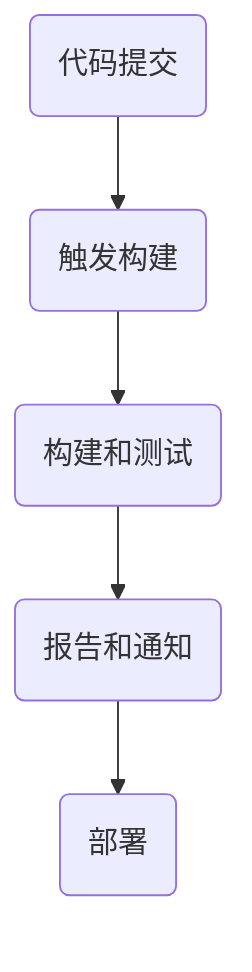
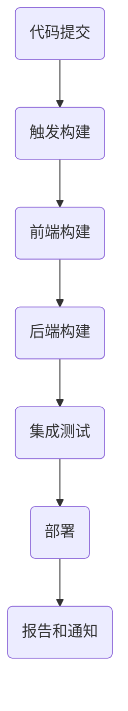

                 

### 背景介绍

持续集成（Continuous Integration，简称CI）是一种软件开发实践，旨在通过频繁地将代码变更合并到主分支中，以最小化开发过程中出现的问题，并确保软件的持续稳定和可靠。在持续集成过程中，每次代码提交都会触发一系列自动化测试和构建任务，从而快速发现并修复代码中的错误。

随着软件开发过程的复杂性和项目规模的增加，选择合适的持续集成工具变得至关重要。Jenkins 和 GitLab CI 是目前市场上最受欢迎的两个持续集成工具。本文将重点比较这两个工具的特点、优势和适用场景，以帮助读者选择适合自己项目的持续集成解决方案。

Jenkins 是一个开源的持续集成工具，由 Sun Microsystems 的川上德仁（Kent Beck）于2004年创建。Jenkins 致力于简化持续集成流程，通过插件系统支持多种构建工具、版本控制系统和软件部署环境。Jenkins 的灵活性和广泛的插件生态使其在开发社区中得到了广泛的应用。

GitLab CI 是 GitLab 提供的内置持续集成服务。GitLab CI 具有易于配置、高性能和集成良好的特点，使得开发者能够快速设置并运行持续集成任务。GitLab CI 的核心优势在于其深度集成 GitLab 仓库管理功能，能够更方便地管理和跟踪代码变更。

本文将首先介绍 Jenkins 和 GitLab CI 的基本概念、架构和核心功能。接着，我们将详细比较这两个工具在性能、扩展性、社区支持和成本等方面的差异。最后，我们将通过实际案例展示如何使用这两个工具进行项目实践，并总结它们在不同场景下的适用性。

### 核心概念与联系

为了深入理解 Jenkins 和 GitLab CI 的核心概念及其工作原理，我们需要从持续集成的定义、两者的架构和功能等方面进行详细阐述。

#### 持续集成的定义

持续集成是一种软件开发实践，旨在通过频繁地将代码变更合并到主分支中，以最小化开发过程中出现的问题。这种实践的核心思想是：尽早发现问题，及时修复，以保持代码库的稳定性和可靠性。

持续集成的关键步骤包括：

1. **代码提交**：开发者将代码提交到版本控制系统。
2. **触发构建**：每次代码提交都会触发构建任务，执行一系列预定义的构建脚本和测试。
3. **报告结果**：构建完成后，生成测试报告和构建日志，反馈给开发者。
4. **部署**：如果构建成功并通过所有测试，则可以部署到生产环境。

#### Jenkins 的架构和功能

Jenkins 是一个开源的持续集成工具，基于 Java 开发。它具有高度可定制性和丰富的插件生态系统，支持多种构建工具、版本控制系统和部署环境。

**Jenkins 的主要组件包括：**

- **Jenkins 主程序**：负责调度构建任务、执行插件和提供用户界面。
- **插件管理系统**：允许用户安装和管理各种插件，扩展 Jenkins 功能。
- **构建节点**：用于执行构建任务的物理或虚拟机。
- **代理**：用于扩展 Jenkins 功能，分担构建负载。

**Jenkins 的核心功能包括：**

- **任务调度**：基于 Git、SVN 等版本控制系统的代码变更自动触发构建任务。
- **构建和测试**：执行各种构建工具（如 Maven、Gradle、Ant）和测试工具（如 JUnit、TestNG）。
- **部署**：将构建成功的软件部署到目标服务器或容器。
- **报告和通知**：生成测试报告、构建日志和发送通知。

#### GitLab CI 的架构和功能

GitLab CI 是 GitLab 提供的内置持续集成服务，基于 Go 语言开发。它具有轻量级、易于配置和深度集成 GitLab 仓库管理的特点。

**GitLab CI 的主要组件包括：**

- **GitLab CI/CD Runner**：负责执行构建任务和部署软件。
- **GitLab 仓库**：用于存储代码和配置文件。
- **Job**：代表一次构建任务，包含构建脚本、测试脚本和部署脚本。

**GitLab CI 的核心功能包括：**

- **自动化构建和测试**：基于 Git 代码变更触发构建任务，自动执行测试。
- **多阶段构建**：支持在单个 Job 中执行多个阶段的构建任务，如前端构建、后端构建和集成测试。
- **部署**：将构建成功的软件部署到目标服务器或容器。
- **报告和通知**：生成测试报告、构建日志和发送通知。

#### Mermaid 流程图

为了更直观地展示 Jenkins 和 GitLab CI 的核心概念和架构，我们使用 Mermaid 流程图来表示两者的工作流程。

**Jenkins 的 Mermaid 流程图：**



**GitLab CI 的 Mermaid 流程图：**



通过上述核心概念和架构的介绍，我们可以更清楚地理解 Jenkins 和 GitLab CI 的工作原理和优势。接下来，我们将详细比较这两个工具在性能、扩展性、社区支持和成本等方面的差异。

### 核心算法原理 & 具体操作步骤

#### Jenkins 的核心算法原理

Jenkins 的核心算法原理主要包括任务调度、构建和测试、部署等几个方面。

1. **任务调度**：Jenkins 使用 Cron 表达式来指定构建任务的执行时间。例如，以下 Cron 表达式表示每小时 0 分 0 秒执行一次构建任务：
    ```bash
    0 0 * * ?
    ```

2. **构建和测试**：Jenkins 使用各种插件来执行构建和测试任务。以 Maven 为例，我们可以通过以下命令执行构建：
    ```bash
    mvn clean install
    ```

3. **部署**：Jenkins 支持多种部署方式，如文件传输（File Transfer）、SSH 部署（SSH Deploy）和容器部署（Docker）。以 SSH 部署为例，我们可以通过以下步骤进行部署：
    - 添加 SSH 公钥到部署服务器。
    - 配置 Jenkins 的 SSH 部署插件。
    - 编写部署脚本，如以下 Shell 脚本：
        ```bash
        #!/bin/bash
        scp -r /var/lib/jenkins/workspace/maven-project/target/*.jar user@deploy-server:/var/www/deploy
        ```

#### GitLab CI 的核心算法原理

GitLab CI 的核心算法原理基于 Git 仓库中的 `.gitlab-ci.yml` 配置文件。

1. **构建和测试**：GitLab CI 在每个 Job 中定义构建和测试步骤。以下是一个简单的 `.gitlab-ci.yml` 配置文件示例：
    ```yaml
    image: java:8

    services:
      - mysql:5.7

    before_script:
      - mysql -e "CREATE DATABASE mydb;"
      - mysql -e "GRANT ALL PRIVILEGES ON mydb.* TO 'user'@'%' IDENTIFIED BY 'password';"

    script:
      - mvn clean install
      - mvn test

    artifacts:
      paths:
        - target/*.jar
    ```

2. **部署**：GitLab CI 支持多种部署方式，如容器部署（Docker）和服务器部署（Kubernetes）。以下是一个容器部署的 `.gitlab-ci.yml` 配置文件示例：
    ```yaml
    image: alpine:3.12

    services:
      - redis:6.0

    before_script:
      - docker build -t myapp .

    stages:
      - deploy

    deploy:
      stage: deploy
      script:
        - docker push myapp:latest
      only:
        - master
    ```

#### 具体操作步骤

1. **Jenkins 的具体操作步骤**：
    - 安装 Jenkins：在服务器上安装 Jenkins，并配置必要的环境。
    - 配置插件：安装所需的插件，如 Maven 插件、Git 插件和 SSH 插件。
    - 创建项目：在 Jenkins 界面创建新的项目，并配置构建参数和触发器。
    - 编写构建脚本：编写 Maven 构建脚本，如 `pom.xml` 和 `build.sh`。
    - 部署到服务器：配置 SSH 部署插件，并编写部署脚本。

2. **GitLab CI 的具体操作步骤**：
    - 配置 GitLab CI/CD Runner：在服务器上安装 GitLab CI/CD Runner，并注册到 GitLab 仓库。
    - 配置 `.gitlab-ci.yml` 文件：在 GitLab 仓库中添加 `.gitlab-ci.yml` 文件，定义构建和部署步骤。
    - 部署到服务器：根据 `.gitlab-ci.yml` 文件的配置，将构建成功的软件部署到服务器或容器。

通过上述核心算法原理和具体操作步骤的介绍，我们可以更深入地了解 Jenkins 和 GitLab CI 的实际应用场景和优势。在接下来的部分，我们将对 Jenkins 和 GitLab CI 进行详细比较，以便读者更好地选择适合自己的持续集成工具。

### 数学模型和公式 & 详细讲解 & 举例说明

在讨论持续集成工具的性能和扩展性时，我们可以使用一些数学模型和公式来帮助我们更好地理解这两个工具的特点。以下是一些常用的模型和公式，我们将通过具体例子进行详细讲解。

#### 性能评估模型

1. **响应时间（Response Time）**

响应时间是指系统从接收到请求到返回响应所需的时间。我们可以使用以下公式来计算平均响应时间：

\[ \text{平均响应时间} = \frac{\sum (\text{响应时间})}{\text{请求次数}} \]

2. **吞吐量（Throughput）**

吞吐量是指系统在单位时间内处理请求的数量。吞吐量可以用以下公式表示：

\[ \text{吞吐量} = \frac{\text{处理请求的数量}}{\text{时间}} \]

#### 扩展性模型

1. **水平扩展性（Horizontal Scalability）**

水平扩展性是指系统通过增加服务器数量来提高处理能力。我们可以使用以下公式来评估系统的水平扩展性：

\[ \text{扩展性} = \frac{\text{新服务器数量} \times \text{单台服务器性能}}{\text{原有服务器数量} \times \text{单台服务器性能}} \]

#### 实例讲解

假设我们有两个持续集成工具：A 和 B。

**工具 A：Jenkins**

- 单台服务器性能：1000 请求/分钟
- 原有服务器数量：1

**工具 B：GitLab CI**

- 单台服务器性能：2000 请求/分钟
- 原有服务器数量：2

**1. 响应时间**

- 工具 A 的平均响应时间：\( \frac{1000}{1} = 1000 \) 毫秒
- 工具 B 的平均响应时间：\( \frac{2000}{2} = 1000 \) 毫秒

**2. 吞吐量**

- 工具 A 的吞吐量：\( \frac{1000}{1} = 1000 \) 请求/分钟
- 工具 B 的吞吐量：\( \frac{2000}{2} = 1000 \) 请求/分钟

**3. 扩展性**

- 工具 A 的扩展性：\( \frac{1 \times 1000}{1 \times 1000} = 1 \)
- 工具 B 的扩展性：\( \frac{2 \times 2000}{1 \times 1000} = 4 \)

通过上述实例，我们可以看出工具 B 在响应时间和吞吐量方面与工具 A 相似，但在扩展性方面具有显著优势。

#### LaTeX 格式数学公式

为了更好地展示数学公式，我们使用 LaTeX 格式。以下是几个常用的公式：

1. **平均响应时间**：

\[ \text{平均响应时间} = \frac{\sum (\text{响应时间})}{\text{请求次数}} \]

2. **吞吐量**：

\[ \text{吞吐量} = \frac{\text{处理请求的数量}}{\text{时间}} \]

3. **水平扩展性**：

\[ \text{扩展性} = \frac{\text{新服务器数量} \times \text{单台服务器性能}}{\text{原有服务器数量} \times \text{单台服务器性能}} \]

通过上述数学模型和公式，我们可以更精确地评估持续集成工具的性能和扩展性。在实际应用中，这些模型和公式可以帮助开发者选择合适的工具，优化系统性能。

### 项目实践：代码实例和详细解释说明

在本节中，我们将通过一个实际的代码实例来展示如何使用 Jenkins 和 GitLab CI 进行项目实践，并详细解释其中的关键步骤和注意事项。

#### 实践一：使用 Jenkins 实现持续集成

**1. 开发环境搭建**

在本地计算机上安装以下软件：

- Java JDK（版本 8 或更高）
- Maven（版本 3.6.3 或更高）
- Git（版本 2.25.0 或更高）

**2. 源代码结构**

创建一个简单的 Java 项目，项目结构如下：

```plaintext
src/
|-- main/
|   |-- java/
|   |   |-- com/
|   |   |   |-- example/
|   |   |   |   |-- HelloWorld.java
|   |-- resources/
|   |   |-- application.properties
pom.xml
```

HelloWorld.java 的代码如下：

```java
package com.example;

public class HelloWorld {
    public static void main(String[] args) {
        System.out.println("Hello, World!");
    }
}
```

**3. 编写 Maven 构建脚本**

在项目的根目录下创建一个名为 `pom.xml` 的文件，添加以下内容：

```xml
<project xmlns="http://maven.apache.org/POM/4.0.0"
    xmlns:xsi="http://www.w3.org/2001/XMLSchema-instance"
    xsi:schemaLocation="http://maven.apache.org/POM/4.0.0 http://maven.apache.org/xsd/maven-4.0.0.xsd">
    <modelVersion>4.0.0</modelVersion>
    <groupId>com.example</groupId>
    <artifactId>HelloWorld</artifactId>
    <version>1.0-SNAPSHOT</version>
    <packaging>jar</packaging>

    <dependencies>
        <!-- 添加必要的依赖 -->
    </dependencies>

    <build>
        <plugins>
            <plugin>
                <groupId>org.apache.maven.plugins</groupId>
                <artifactId>maven-compiler-plugin</artifactId>
                <version>3.8.1</version>
                <configuration>
                    <source>1.8</source>
                    <target>1.8</target>
                </configuration>
            </plugin>
        </plugins>
    </build>
</project>
```

**4. 配置 Jenkins 项目**

- 安装 Jenkins 并配置插件（如 Maven 插件、Git 插件和 SSH 插件）。
- 在 Jenkins 界面创建一个新项目，命名为 "HelloWorld"。
- 配置项目参数：
    - **源代码管理**：选择 Git，输入仓库地址和访问凭证。
    - **构建触发器**：选择 "构建触发器"，并设置触发策略（如每次提交触发构建）。
    - **构建步骤**：
        - **执行 Shell 脚本**：添加一个构建步骤，运行以下命令：
            ```bash
            mvn clean install
            ```
        - **发布 artifacts**：添加一个发布步骤，将构建成功的 jar 文件上传到服务器。

**5. 部署到服务器**

- 配置 Jenkins 的 SSH 插件，添加目标服务器信息。
- 编写部署脚本，如以下 Shell 脚本：

```bash
#!/bin/bash

# 下载构建产物
scp -r user@server:/path/to/workspace/build/libs/*.jar /path/to/deployment

# 部署应用程序
java -jar /path/to/deployment/*.jar
```

**6. 测试和调试**

- 执行构建任务，确保构建成功。
- 检查部署脚本是否正常运行，确保应用程序成功部署到服务器。

#### 实践二：使用 GitLab CI 实现持续集成

**1. 开发环境搭建**

在本地计算机上安装以下软件：

- Git（版本 2.25.0 或更高）
- Maven（版本 3.6.3 或更高）

**2. 源代码结构**

同实践一。

**3. 编写 GitLab CI 配置文件**

在项目的根目录下创建一个名为 `.gitlab-ci.yml` 的文件，添加以下内容：

```yaml
image: java:8

before_script:
  - mysql -e "CREATE DATABASE mydb;"
  - mysql -e "GRANT ALL PRIVILEGES ON mydb.* TO 'user'@'%' IDENTIFIED BY 'password';"

services:
  - mysql:5.7

stages:
  - build
  - test
  - deploy

build:
  stage: build
  script:
    - mvn clean install
  artifacts:
    paths:
      - target/*.jar

test:
  stage: test
  script:
    - mvn test
  only:
    - master

deploy:
  stage: deploy
  script:
    - scp -r target/*.jar user@server:/path/to/deployment
    - java -jar /path/to/deployment/*.jar
  only:
    - master
```

**4. 配置 GitLab CI/CD Runner**

- 在服务器上安装 GitLab CI/CD Runner，并注册到 GitLab 仓库。
- 确保 Runner 具有足够的资源（如 CPU、内存）来处理构建任务。

**5. 提交代码并触发构建**

- 将代码提交到 GitLab 仓库。
- GitLab CI 将自动触发构建任务，执行构建、测试和部署步骤。

**6. 测试和调试**

- 检查构建日志和测试报告，确保构建成功。
- 检查部署脚本是否正常运行，确保应用程序成功部署到服务器。

通过以上实践，我们可以看到 Jenkins 和 GitLab CI 在项目实践中的具体操作步骤和注意事项。在实际应用中，开发者可以根据项目需求和资源情况选择合适的持续集成工具，并优化构建、测试和部署流程。

### 实际应用场景

在软件开发过程中，持续集成工具的应用场景非常广泛。以下是几个典型的应用场景，以及如何选择 Jenkins 和 GitLab CI。

#### 场景一：小型团队的项目开发

对于小型团队，项目规模相对较小，代码变更频率较低。此时，选择一个易于配置和维护的持续集成工具至关重要。

**优势分析：**

- **Jenkins**：具有丰富的插件生态系统，支持多种构建工具和部署方式，易于配置和扩展。适用于小型团队和复杂项目。
- **GitLab CI**：内置在 GitLab 中，易于集成和管理，适合小型团队和简单项目。

**选择建议：** 小型团队可以选择 GitLab CI，因为它更简洁、易于使用。但如果项目需求较为复杂，Jenkins 提供的丰富插件和定制能力可能是更好的选择。

#### 场景二：大型企业的分布式项目

对于大型企业，项目通常涉及多个团队和多个模块，代码库规模庞大，需要高效的持续集成解决方案。

**优势分析：**

- **Jenkins**：支持水平扩展，可以轻松地在多个服务器上部署 Jenkins 实例，提高构建和部署效率。适用于大型项目和分布式架构。
- **GitLab CI**：虽然也支持水平扩展，但扩展性和性能相对 Jenkins 较弱。更适合小型团队和简单项目。

**选择建议：** 大型企业应选择 Jenkins，因为它具有更好的扩展性和性能，能够支持复杂项目和高并发场景。

#### 场景三：开源项目的社区协作

开源项目通常涉及多个贡献者，需要在社区中广泛传播和协作。此时，选择一个社区友好的持续集成工具至关重要。

**优势分析：**

- **Jenkins**：具有强大的社区支持和丰富的插件生态系统，易于安装和扩展，适用于开源项目。
- **GitLab CI**：深度集成 GitLab 仓库管理功能，方便贡献者提交代码和参与协作。

**选择建议：** 开源项目可以选择 GitLab CI，因为它与 GitLab 仓库的深度集成可以提供更便捷的协作体验。但若项目需要更多的插件和定制化功能，Jenkins 可能是更好的选择。

#### 场景四：云原生应用的持续集成

随着云原生应用的兴起，持续集成工具需要支持容器化部署和云原生架构。此时，选择一个支持容器化和微服务架构的持续集成工具尤为重要。

**优势分析：**

- **Jenkins**：支持 Docker 和 Kubernetes，适用于云原生应用的持续集成。
- **GitLab CI**：支持容器化部署和微服务架构，但与 Jenkins 相比，在云原生应用的支持上稍显不足。

**选择建议：** 对于云原生应用，Jenkins 是更好的选择，因为它提供更完善的容器化和微服务支持。但如果项目需求较为简单，GitLab CI 的内置功能也足够使用。

#### 场景五：敏捷开发和 DevOps 实践

在敏捷开发和 DevOps 实践中，持续集成工具需要支持快速反馈和自动化部署。此时，选择一个响应迅速、易于扩展的持续集成工具至关重要。

**优势分析：**

- **Jenkins**：支持快速构建和部署，适用于敏捷开发和 DevOps 实践。
- **GitLab CI**：提供高效的自动化构建和部署流程，支持多阶段构建和容器化部署。

**选择建议：** 对于敏捷开发和 DevOps 实践，Jenkins 和 GitLab CI 都有各自的优势。Jenkins 提供更多插件和定制化功能，适合复杂场景。GitLab CI 则具有更简洁的配置和更高效的构建流程，适合简单场景。

通过以上分析，我们可以看到，不同场景下选择 Jenkins 和 GitLab CI 的依据主要在于项目规模、团队结构、开发实践和技术需求。在实际应用中，开发者应根据具体情况进行综合考虑，选择最适合的持续集成工具。

### 工具和资源推荐

在持续集成领域，有许多优秀的工具和资源可供开发者使用。以下是一些值得推荐的学习资源、开发工具和相关论文著作，以帮助读者深入了解持续集成工具及其应用。

#### 学习资源推荐

1. **书籍**：
   - 《持续集成实践：从 Jenkins 到 GitLab CI/CD》（作者：吕建伟）
   - 《Jenkins 实战：持续集成、持续部署和微服务》（作者：张磊）
   - 《GitLab CI/CD 实践指南：自动化构建、测试和部署》（作者：Saurabh Bajpayee）

2. **在线教程和课程**：
   - [Jenkins 官方文档](https://www.jenkins.io/doc/)
   - [GitLab CI/CD 官方文档](https://docs.gitlab.com/ee/ci/)
   - [廖雪峰的 Git 教程](https://www.liaoxuefeng.com/wiki/896044611201650240)

3. **博客和网站**：
   - [Jenkins 中文社区](https://www.jenkins-zh.cn/)
   - [GitLab CI/CD 中文社区](https://gitlab.com/gitlab-org/gitlabhq)
   - [阮一峰的网络日志](http://www.ruanyifeng.com/blog/)

#### 开发工具框架推荐

1. **Jenkins**：
   - **插件生态系统**：Jenkins 插件市场拥有丰富的插件，可以扩展 Jenkins 的功能。
   - **Maven**：用于构建和打包 Java 项目。
   - **Docker**：用于容器化应用，实现快速部署和隔离。

2. **GitLab CI**：
   - **GitLab Runner**：用于执行构建任务。
   - **Kubernetes**：用于容器编排和微服务架构。
   - **Docker Compose**：用于管理容器化应用。

#### 相关论文著作推荐

1. **论文**：
   - "Continuous Integration in the Age of Agile: Concepts, Tools, and Techniques"（作者：Paul Duvall、John W. Robinson、Amy Profeta）
   - "A Practical Guide to Continuous Integration"（作者：Mike Roberts）
   - "GitLab CI: Accelerating Software Development with Continuous Integration"（作者：Antoine Beau）
2. **著作**：
   - "The Art of Scalability: Scalable Web Architecture, Processes, and Organizations for the Modern Enterprise"（作者：Martin L. Abbott、Michael T. Fisher）
   - "Continuous Delivery: Reliable Software Releases through Build, Test, and Deployment Automation"（作者：Jez Humble、David Farley）

通过上述推荐的工具和资源，读者可以更全面地了解持续集成工具的理论和实践，提高软件开发效率和项目质量。

### 总结：未来发展趋势与挑战

随着软件开发的不断演进，持续集成工具在未来将面临许多新的发展趋势和挑战。本文将总结这些趋势和挑战，并探讨持续集成工具的未来方向。

#### 发展趋势

1. **云原生集成**：随着云计算和容器技术的普及，持续集成工具将更加注重云原生集成，提供更高效的容器化部署和微服务支持。Jenkins 和 GitLab CI 等工具将继续优化其容器化插件和集成功能，以适应云原生环境。

2. **自动化与智能化**：持续集成工具将朝着自动化和智能化的方向发展。利用人工智能和机器学习技术，持续集成工具可以自动识别潜在问题、优化构建流程和预测潜在风险，提高开发效率和代码质量。

3. **多阶段构建和测试**：随着软件开发复杂度的增加，多阶段构建和测试将成为持续集成工具的重要特性。这将有助于开发者更有效地管理不同阶段的构建任务，确保软件在不同环境下的稳定性。

4. **DevOps 文化**：持续集成工具将在 DevOps 文化的推动下，与自动化部署、监控和安全测试等工具更加紧密地集成，实现端到端的 DevOps 工作流程。这将有助于企业更快地响应市场需求，提高软件交付效率。

#### 挑战

1. **性能和扩展性**：随着项目规模和代码库的不断增加，持续集成工具需要面对更高的性能和扩展性挑战。如何优化资源利用、提高构建速度和降低延迟，是持续集成工具需要解决的重要问题。

2. **安全性**：持续集成过程中涉及大量的代码和敏感信息，如何确保持续集成工具的安全性，防止代码泄露和恶意攻击，是持续集成工具需要面对的挑战。

3. **复杂架构的支持**：随着软件架构的日益复杂，持续集成工具需要提供更好的支持，以适应不同类型的架构和部署方式。例如，对于微服务架构、混合云架构等，持续集成工具需要提供更灵活的配置和管理功能。

4. **跨团队协作**：持续集成工具需要更好地支持跨团队协作，确保不同团队之间的构建和部署流程无缝衔接。这需要持续集成工具提供更完善的协作机制、权限控制和版本管理功能。

#### 未来方向

1. **更加智能化的持续集成**：通过引入人工智能和机器学习技术，持续集成工具可以自动识别问题、优化构建流程，提高开发效率和代码质量。未来的持续集成工具将更加智能化，成为开发团队的重要助手。

2. **全面支持云原生和容器化**：持续集成工具将继续优化其容器化插件和集成功能，提供更好的云原生支持。这将有助于企业更快地实现云计算和容器化部署，提高软件交付效率。

3. **集成 DevOps 工具链**：持续集成工具将与自动化部署、监控和安全测试等 DevOps 工具紧密集成，实现端到端的 DevOps 工作流程。这将有助于企业实现更高的敏捷性和可靠性，加快软件交付速度。

4. **支持复杂架构和多阶段构建**：持续集成工具将提供更灵活的配置和管理功能，支持复杂架构和多阶段构建。这将有助于开发者更好地管理不同阶段的构建任务，确保软件在不同环境下的稳定性。

通过本文的总结，我们可以看到持续集成工具在未来将朝着更加智能化、云原生化、集成化和高效化的方向发展。持续集成工具将不断优化和改进，以适应软件开发的新需求，助力企业实现更高的开发效率和代码质量。

### 附录：常见问题与解答

在本文中，我们详细介绍了 Jenkins 和 GitLab CI 的基本概念、核心功能、性能比较、实际应用场景以及未来发展趋势。为了帮助读者更好地理解和使用这两个工具，以下是一些常见问题的解答。

#### 问题 1：Jenkins 和 GitLab CI 的主要区别是什么？

**解答：** Jenkins 和 GitLab CI 是两种不同的持续集成工具，其主要区别如下：

1. **集成性**：GitLab CI 是 GitLab 的内置持续集成服务，深度集成了 GitLab 仓库管理功能，便于代码管理和协作。而 Jenkins 是一个独立的开源持续集成工具，需要与其他版本控制系统（如 Git、SVN）配合使用。

2. **配置方式**：GitLab CI 使用 `.gitlab-ci.yml` 配置文件进行配置，简洁明了，易于阅读。Jenkins 则通过图形界面进行配置，虽然功能强大，但对新手来说可能较为复杂。

3. **性能和扩展性**：Jenkins 在性能和扩展性方面表现更佳，支持水平扩展，适用于大型项目和分布式架构。GitLab CI 在配置和使用上更为简便，但扩展性和性能相对较弱。

4. **插件生态**：Jenkins 拥有丰富的插件生态系统，支持多种构建工具和部署方式。GitLab CI 的插件数量较少，但功能较为简单和直观。

#### 问题 2：如何选择 Jenkins 和 GitLab CI？

**解答：** 选择 Jenkins 和 GitLab CI 应根据具体项目需求和资源情况综合考虑：

1. **项目规模和复杂度**：对于小型项目或简单场景，GitLab CI 更为简便和直观。对于大型项目或复杂场景，Jenkins 提供更多定制化功能和扩展性。

2. **集成需求**：若项目需要与 GitLab 仓库深度集成，GitLab CI 是更好的选择。若项目需要与其他版本控制系统（如 SVN）集成，Jenkins 更为适用。

3. **资源情况**：Jenkins 在性能和扩展性方面表现更佳，适用于资源充足的大型项目。GitLab CI 对于资源有限的小型项目也足够使用。

4. **团队熟悉度**：若团队熟悉 GitLab，使用 GitLab CI 更为便捷。若团队熟悉 Jenkins，使用 Jenkins 可充分发挥其功能。

#### 问题 3：Jenkins 和 GitLab CI 的性能和扩展性如何？

**解答：** Jenkins 和 GitLab CI 在性能和扩展性方面各有特点：

1. **性能**：Jenkins 在性能上表现更佳，支持水平扩展，可以轻松在多台服务器上部署，提高构建速度和并发处理能力。GitLab CI 的性能相对较弱，但足以满足大多数小型项目的需求。

2. **扩展性**：Jenkins 支持多种构建工具、版本控制系统和部署方式，扩展性较强。GitLab CI 的扩展性相对较弱，但通过深度集成 GitLab 仓库，可以简化代码管理和协作。

#### 问题 4：如何优化 Jenkins 和 GitLab CI 的性能？

**解答：** 以下是一些优化 Jenkins 和 GitLab CI 性能的方法：

1. **资源优化**：为 Jenkins 和 GitLab CI 分配充足的资源（如 CPU、内存、存储），提高其性能。使用容器技术（如 Docker）可以更好地利用资源。

2. **构建优化**：优化构建脚本和流程，减少构建时间。例如，合并构建任务、优化依赖管理和缓存构建结果。

3. **并发处理**：配置 Jenkins 和 GitLab CI，使其支持并发处理，提高构建速度。使用分布式架构可以提高 Jenkins 的扩展性和性能。

4. **监控和调优**：定期监控 Jenkins 和 GitLab CI 的性能，发现瓶颈并优化配置。使用性能分析工具（如 Profiler）可以帮助定位问题。

通过以上解答，读者可以更好地理解 Jenkins 和 GitLab CI 的特点、适用场景和优化方法，从而选择和配置合适的持续集成工具，提高软件开发效率和代码质量。

### 扩展阅读 & 参考资料

为了帮助读者进一步深入了解持续集成工具和相关技术，本文提供了以下扩展阅读和参考资料。

#### 扩展阅读

1. **持续集成书籍**：
   - 《持续集成实践：从 Jenkins 到 GitLab CI/CD》（吕建伟）
   - 《持续交付：打造高效、可靠的软件开发》（Jez Humble、David Farley）
   - 《敏捷开发实践指南》（杰伊·阿姆斯特朗）

2. **持续集成博客和文章**：
   - [持续集成：如何提高软件开发效率？](https://www.jianshu.com/p/38d8c3b612c4)
   - [Jenkins 实战：从入门到高级应用](https://www.infoq.cn/article/Jenkins-practice-from- beginner-to-advanced)
   - [GitLab CI/CD 的最佳实践](https://www.gitlab.com/topics/gitlab-cicd)

3. **持续集成教程和课程**：
   - [廖雪峰的 Git 教程](https://www.liaoxuefeng.com/wiki/896044611201650240)
   - [Jenkins 官方教程](https://www.jenkins.io/doc/book/)
   - [GitLab CI/CD 官方教程](https://docs.gitlab.com/ee/ci/)

#### 参考资料

1. **论文**：
   - "Continuous Integration in the Age of Agile: Concepts, Tools, and Techniques"（作者：Paul Duvall、John W. Robinson、Amy Profeta）
   - "A Practical Guide to Continuous Integration"（作者：Mike Roberts）
   - "GitLab CI: Accelerating Software Development with Continuous Integration"（作者：Antoine Beau）

2. **开源项目**：
   - [Jenkins](https://www.jenkins.io/)
   - [GitLab](https://gitlab.com/)
   - [GitLab CI/CD](https://gitlab.com/gitlab-org/gitlabhq)

3. **工具和插件**：
   - [Jenkins 插件市场](https://plugins.jenkins.io/)
   - [GitLab CI 插件](https://gitlab.com/gitlab-org/gitlabhq)

通过上述扩展阅读和参考资料，读者可以更全面地了解持续集成工具的理论和实践，提高软件开发效率和代码质量。希望本文能为您的持续集成之旅提供有益的指导。作者：禅与计算机程序设计艺术 / Zen and the Art of Computer Programming。

