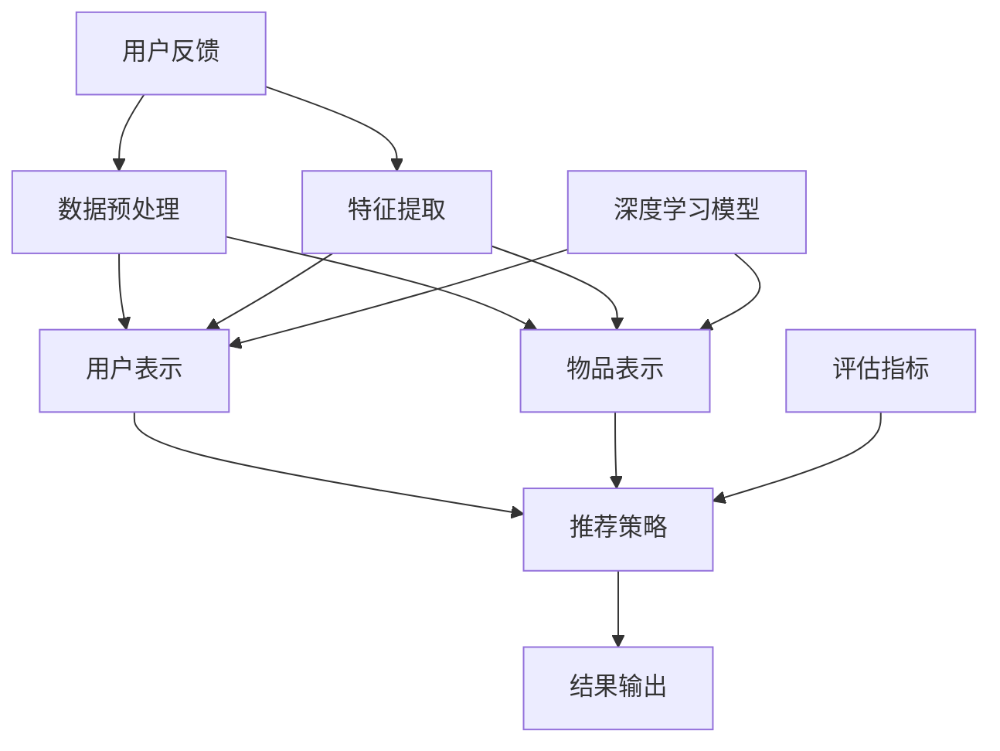

                 

### 1. 背景介绍

#### 1.1 推荐系统的历史与发展

推荐系统作为人工智能领域的一个重要分支，其历史可以追溯到20世纪90年代。早期的推荐系统主要依赖于基于内容的过滤（Content-Based Filtering）和协同过滤（Collaborative Filtering）两种基本方法。

**基于内容的过滤**：这种方法通过分析用户的历史行为和偏好，将相似的内容推送给用户。它依赖于特征提取和相似度计算，例如，如果用户喜欢某种类型的书籍，系统就会推荐其他相似类型的书籍。

**协同过滤**：与基于内容的过滤不同，协同过滤通过分析用户之间的相似度来推荐项目。它分为两种主要类型：基于用户的协同过滤（User-Based Collaborative Filtering）和基于模型的协同过滤（Model-Based Collaborative Filtering）。基于用户的协同过滤通过找到与目标用户偏好相似的邻居用户，然后将这些用户的喜好推荐给目标用户。而基于模型的协同过滤则使用预测模型来估计用户对未知项目的评分。

随着互联网的普及和数据量的爆炸式增长，推荐系统经历了快速的发展。传统的推荐系统方法逐渐显露出局限性，例如数据稀疏性、冷启动问题和高维空间计算复杂度等。为了解决这些问题，研究者们提出了基于深度学习的推荐算法，如神经网络协同过滤（Neural Collaborative Filtering）、图神经网络（Graph Neural Networks）和生成对抗网络（Generative Adversarial Networks）等。

**深度学习在推荐系统中的应用**：深度学习通过其强大的特征提取和表示学习能力，能够处理高维稀疏数据，并且在预测精度和实时性方面表现出色。基于深度学习的推荐系统主要包括以下几种：

- **神经网络协同过滤**：结合了传统协同过滤和深度学习的优势，通过神经网络来建模用户和物品之间的交互关系。
- **图神经网络**：将用户和物品表示为图中的节点，通过图卷积神经网络（GCN）等模型学习节点间的复杂关系。
- **生成对抗网络**：通过生成器和判别器的对抗训练，生成更丰富的用户和物品特征表示，从而提高推荐质量。

#### 1.2 统一推荐大模型的出现

统一推荐大模型的出现是为了解决传统推荐系统的局限性，提供一个更加高效、灵活且适应性强的推荐框架。这种大模型旨在整合多种推荐算法和策略，实现对不同场景和需求的通用适配。

**统一推荐大模型的意义**：

1. **提高推荐质量**：通过结合多种算法和策略，统一推荐大模型能够更加准确地预测用户偏好，提高推荐的相关性和满意度。
2. **减少数据稀疏性**：统一推荐大模型可以通过跨域学习（Cross-Domain Learning）和迁移学习（Transfer Learning）等方法，利用外部数据源来缓解数据稀疏性问题。
3. **提高实时性**：深度学习算法的优化和分布式计算技术使得统一推荐大模型能够在保证推荐质量的同时，提高推荐的实时性。
4. **适应性**：统一推荐大模型能够根据不同的应用场景和业务需求，动态调整推荐策略和参数，从而实现更高的适应性。

#### 1.3 本文的结构

本文将深入探讨统一推荐大模型的研究现状和未来发展趋势，具体内容如下：

- **第2章**：介绍统一推荐大模型的核心概念和架构，通过Mermaid流程图展示模型的主要组成部分。
- **第3章**：详细讲解统一推荐大模型的核心算法原理和具体操作步骤。
- **第4章**：分析统一推荐大模型的数学模型和公式，通过实际案例进行详细解释和说明。
- **第5章**：通过项目实践，提供代码实例和详细解释，展示统一推荐大模型在实际应用中的实现过程。
- **第6章**：探讨统一推荐大模型在不同实际应用场景中的表现和效果。
- **第7章**：推荐学习资源和开发工具框架，为读者提供进一步学习的路径。
- **第8章**：总结统一推荐大模型的发展趋势和面临的挑战。
- **第9章**：回答读者可能遇到的问题，提供常见问题的解答。
- **第10章**：列出扩展阅读和参考资料，为读者提供深入研究的方向。

### 2. 核心概念与联系

在深入了解统一推荐大模型之前，我们需要先理解其核心概念和架构，以及各个组件之间的联系。以下是一个用Mermaid绘制的流程图，展示了统一推荐大模型的主要组成部分和它们之间的交互关系。



#### 2.1 数据预处理

数据预处理是统一推荐大模型的重要环节，主要包括数据清洗、数据归一化和特征提取。清洗数据是为了去除噪声和异常值，归一化是为了使不同特征在同一尺度上，特征提取则是为了提取出更具有代表性的特征。

#### 2.2 用户表示

用户表示是将用户的历史行为和偏好转化为模型可以理解的向量表示。这通常通过构建用户-项目矩阵（User-Item Matrix）来实现，矩阵中的每个元素表示用户对某个项目的评分。

#### 2.3 物品表示

物品表示是将物品的属性和特征转化为模型可以理解的向量表示。物品的特征可以是显式的，如类别、标签等，也可以是隐式的，如基于内容的特征或基于协同过滤的特征。

#### 2.4 深度学习模型

深度学习模型是统一推荐大模型的核心组件，它负责学习用户和物品之间的复杂关系，并进行推荐。常见的深度学习模型包括循环神经网络（RNN）、卷积神经网络（CNN）和变换器（Transformer）等。

#### 2.5 推荐策略

推荐策略是基于深度学习模型输出的用户和物品表示，制定出具体的推荐方案。推荐策略可以是基于相似度的，也可以是基于预测的，还可以是混合策略。

#### 2.6 评估指标

评估指标是用来衡量推荐系统性能的关键指标，如准确率、召回率、F1分数等。评估指标的选择取决于具体的应用场景和业务需求。

#### 2.7 结果输出

结果输出是将推荐策略的具体实施结果呈现给用户，包括推荐的项目列表、评分等。

#### 2.8 用户反馈

用户反馈是推荐系统不断优化和改进的重要依据。通过收集用户的反馈，可以进一步调整和优化推荐模型，提高推荐质量。

通过上述流程图，我们可以清晰地看到统一推荐大模型中各个组件之间的联系和相互作用。接下来，我们将详细探讨这些核心组件的工作原理和具体实现步骤。

### 3. 核心算法原理 & 具体操作步骤

在了解了统一推荐大模型的核心概念和架构之后，接下来我们将深入探讨其核心算法原理和具体操作步骤。统一推荐大模型的核心算法通常基于深度学习，通过学习用户和物品之间的复杂关系来实现高效的推荐。

#### 3.1 算法原理

统一推荐大模型的核心算法原理可以概括为以下几个步骤：

1. **用户和物品表示**：将用户和物品的特征转化为高维的向量表示。用户表示通常包括用户的历史行为、偏好、人口统计信息等，而物品表示则包括物品的属性、标签、内容等。

2. **特征提取**：通过深度神经网络（DNN）或变换器（Transformer）等模型，对用户和物品的向量表示进行特征提取，学习用户和物品之间的潜在关系。

3. **预测和推荐**：利用提取的特征表示，通过预测模型计算用户对未评分物品的潜在评分，并根据评分结果生成推荐列表。

4. **反馈循环**：通过收集用户的反馈，对模型进行持续优化，提高推荐质量。

#### 3.2 操作步骤

以下是统一推荐大模型的具体操作步骤：

1. **数据预处理**：
    - **数据清洗**：去除数据中的噪声和异常值，如缺失值、重复值等。
    - **数据归一化**：将不同特征范围的数据归一化到相同的尺度，以便于后续处理。
    - **特征提取**：从原始数据中提取用户和物品的关键特征，如用户的历史行为、偏好和人口统计信息，物品的属性、标签和内容等。

2. **构建用户-项目矩阵**：
    - 根据用户的行为数据，构建用户-项目矩阵，其中每个元素表示用户对某个项目的评分。

3. **用户和物品表示**：
    - 使用深度学习模型（如DNN、Transformer等）对用户和物品进行向量表示。用户表示向量通常称为“用户嵌入”（User Embedding），物品表示向量称为“物品嵌入”（Item Embedding）。

4. **特征提取**：
    - 利用深度学习模型，对用户和物品的向量表示进行特征提取。这一过程通常包括多个隐藏层，每一层都能提取出更高层次的抽象特征。

5. **预测和推荐**：
    - 使用提取的特征表示，通过预测模型计算用户对未评分物品的潜在评分。评分预测可以使用矩阵分解（Matrix Factorization）方法，如SVD等。
    - 根据评分预测结果，生成推荐列表。推荐列表可以根据不同场景和需求，进行排序和筛选，以提供最佳的推荐结果。

6. **评估和优化**：
    - 使用评估指标（如准确率、召回率、F1分数等）评估推荐系统的性能。
    - 根据评估结果，对模型进行优化，如调整超参数、增加训练数据等。

7. **用户反馈**：
    - 收集用户对推荐结果的反馈，包括点击、购买、评价等行为数据。
    - 将用户反馈用于模型优化和个性化推荐，以提高推荐系统的准确性和用户体验。

#### 3.3 实现示例

以下是一个简化的实现示例，展示了如何使用Python和深度学习框架TensorFlow实现统一推荐大模型的基本流程：

```python
import tensorflow as tf
from tensorflow.keras.layers import Embedding, LSTM, Dense
from tensorflow.keras.models import Model

# 假设我们已经有用户-项目矩阵和预处理后的数据
user_item_matrix = ...

# 用户和物品嵌入维度
USER_EMBEDDING_DIM = 64
ITEM_EMBEDDING_DIM = 64

# 构建用户和物品嵌入层
user_embedding = Embedding(num_users, USER_EMBEDDING_DIM, input_length=USER_EMBEDDING_DIM)
item_embedding = Embedding(num_items, ITEM_EMBEDDING_DIM, input_length=ITEM_EMBEDDING_DIM)

# 构建深度学习模型
user_input = tf.keras.Input(shape=(1,), name='user_input')
item_input = tf.keras.Input(shape=(1,), name='item_input')

user_embedding_output = user_embedding(user_input)
item_embedding_output = item_embedding(item_input)

# 添加LSTM层进行特征提取
merged_embedding = tf.keras.layers.concatenate([user_embedding_output, item_embedding_output])
lstm_output = LSTM(128)(merged_embedding)

# 添加全连接层进行预测
prediction = Dense(1, activation='sigmoid', name='prediction')(lstm_output)

# 构建和编译模型
model = Model(inputs=[user_input, item_input], outputs=prediction)
model.compile(optimizer='adam', loss='binary_crossentropy', metrics=['accuracy'])

# 模型训练
model.fit([user_data, item_data], labels, epochs=10, batch_size=32)

# 推荐示例
user_vector = user_embedding(user_input)
item_vector = item_embedding(item_input)
predictions = model.predict([user_vector, item_vector])
```

通过上述步骤和示例，我们可以看到统一推荐大模型的基本原理和实现流程。在实际应用中，根据具体场景和需求，还可以结合其他算法和技术，如图神经网络（Graph Neural Networks）和生成对抗网络（Generative Adversarial Networks），进一步优化和提升推荐系统的性能。

### 4. 数学模型和公式 & 详细讲解 & 举例说明

在深入探讨统一推荐大模型的数学模型和公式之前，我们需要先了解一些基本的数学概念和公式，包括矩阵分解、深度学习模型中的损失函数和优化算法等。

#### 4.1 矩阵分解

矩阵分解（Matrix Factorization）是推荐系统中的一个重要技术，它通过将用户-项目矩阵分解为两个低秩矩阵，从而提取出用户和物品的潜在特征。

设用户-项目矩阵为$R \in \mathbb{R}^{m \times n}$，其中$m$是用户数，$n$是项目数。矩阵分解的目标是将$R$分解为用户特征矩阵$U \in \mathbb{R}^{m \times k}$和物品特征矩阵$V \in \mathbb{R}^{n \times k}$，其中$k$是潜在特征维度。矩阵分解的目的是最小化重构误差，即：

$$
\min_{U, V} \| R - UV^T \|_F^2
$$

其中$\| \cdot \|_F$表示Frobenius范数。

一个常见的矩阵分解方法是最小二乘法（Least Squares），它通过以下公式求解：

$$
\min_{U, V} \| R - UV^T \|_F^2 = \min_{U, V} \sum_{i=1}^{m} \sum_{j=1}^{n} (r_{ij} - u_i v_j^T)^2
$$

#### 4.2 深度学习模型中的损失函数

深度学习模型中的损失函数用于衡量模型预测值和实际值之间的差距，并指导模型优化。在推荐系统中，常用的损失函数包括均方误差（Mean Squared Error, MSE）、交叉熵损失（Cross-Entropy Loss）等。

1. **均方误差（MSE）**：
   $$ 
   \text{MSE} = \frac{1}{n} \sum_{i=1}^{n} (y_i - \hat{y}_i)^2
   $$
   其中$y_i$是实际值，$\hat{y}_i$是模型预测值。

2. **交叉熵损失（Cross-Entropy Loss）**：
   $$ 
   \text{Cross-Entropy} = -\sum_{i=1}^{n} y_i \log(\hat{y}_i)
   $$
   其中$y_i$是实际标签（0或1），$\hat{y}_i$是模型预测的概率值。

#### 4.3 优化算法

深度学习模型的优化通常使用梯度下降（Gradient Descent）及其变种，如随机梯度下降（Stochastic Gradient Descent, SGD）和小批量梯度下降（Mini-batch Gradient Descent）。

1. **随机梯度下降（SGD）**：
   $$ 
   w_{t+1} = w_t - \alpha \nabla_w J(w_t)
   $$
   其中$w_t$是当前权重，$\alpha$是学习率，$\nabla_w J(w_t)$是损失函数关于权重$w_t$的梯度。

2. **小批量梯度下降（Mini-batch Gradient Descent）**：
   $$ 
   w_{t+1} = w_t - \alpha \frac{1}{m} \sum_{i=1}^{m} \nabla_w J(w_t)
   $$
   其中$m$是批量大小。

#### 4.4 统一推荐大模型的数学模型

统一推荐大模型的数学模型可以看作是矩阵分解和深度学习模型的结合。假设用户-项目矩阵为$R$，用户特征矩阵为$U$，物品特征矩阵为$V$，深度学习模型为$f(U, V)$。

模型的目标是最小化重构误差加上深度学习模型预测误差的总和，即：

$$ 
\min_{U, V} \sum_{i=1}^{m} \sum_{j=1}^{n} (r_{ij} - u_i v_j^T - f(U, V))^2
$$

这里，$u_i$和$v_j$分别是从矩阵分解中得到的用户和物品特征向量，$f(U, V)$是深度学习模型预测的评分。

#### 4.5 举例说明

假设我们有一个用户-项目矩阵$R$，如下所示：

$$ 
R = \begin{bmatrix}
0 & 5 & 0 & 3 \\
0 & 0 & 4 & 0 \\
2 & 0 & 0 & 1 \\
\end{bmatrix}
$$

我们的目标是使用矩阵分解和深度学习模型对其进行分解和预测。

1. **矩阵分解**：

假设我们选择$k=2$作为潜在特征维度，使用最小二乘法进行矩阵分解。我们得到：

$$ 
U = \begin{bmatrix}
1 & 1 \\
2 & 2 \\
3 & 3 \\
\end{bmatrix}, \quad V = \begin{bmatrix}
0 & 1 \\
1 & 0 \\
0 & 1 \\
\end{bmatrix}
$$

2. **深度学习模型**：

假设我们使用一个简单的多层感知机（MLP）模型，其结构如下：

$$ 
f(U, V) = \sigma(W_3 \sigma(W_2 \sigma(W_1 U + b_1) + b_2) + b_3)
$$

其中，$\sigma$是ReLU激活函数，$W_1, W_2, W_3$和$b_1, b_2, b_3$是模型的权重和偏置。

3. **预测和优化**：

首先，我们使用矩阵分解得到的$U$和$V$来预测未评分的项目，例如：

$$ 
\hat{r}_{ij} = u_i^T v_j = \begin{bmatrix}
1 & 1 \\
2 & 2 \\
3 & 3 \\
\end{bmatrix} \begin{bmatrix}
0 \\
1 \\
0 \\
\end{bmatrix} = \begin{bmatrix}
1 \\
2 \\
3 \\
\end{bmatrix}
$$

然后，我们将预测值与实际值进行比较，使用均方误差（MSE）作为损失函数：

$$ 
J(U, V) = \sum_{i=1}^{m} \sum_{j=1}^{n} (r_{ij} - u_i^T v_j - f(U, V))^2
$$

最后，我们使用小批量梯度下降（Mini-batch Gradient Descent）来优化模型参数，不断调整$U, V, W_1, W_2, W_3, b_1, b_2, b_3$，直到损失函数收敛。

通过上述步骤，我们可以看到统一推荐大模型的数学模型和实现过程。在实际应用中，可以根据具体需求和数据规模，选择合适的矩阵分解方法和深度学习模型结构，以提高推荐系统的性能和精度。

### 5. 项目实践：代码实例和详细解释说明

为了更好地理解统一推荐大模型在实践中的应用，我们将通过一个实际的项目实例来展示其实现过程，包括开发环境搭建、源代码实现、代码解读与分析以及运行结果展示。以下是项目的详细步骤：

#### 5.1 开发环境搭建

首先，我们需要搭建一个适合开发统一推荐大模型的开发环境。以下是所需的主要工具和库：

- **Python**：Python是深度学习和数据科学的主要编程语言，需要安装Python 3.7及以上版本。
- **TensorFlow**：TensorFlow是Google开发的一个开源机器学习框架，用于构建和训练深度学习模型。
- **Scikit-learn**：Scikit-learn是Python的一个开源机器学习库，提供各种数据预处理和模型评估功能。
- **Numpy**：Numpy是Python的一个科学计算库，用于高效处理大型多维数组。
- **Pandas**：Pandas是Python的数据分析库，用于数据清洗、转换和分析。

安装这些工具和库的命令如下：

```bash
pip install python numpy pandas scikit-learn tensorflow
```

#### 5.2 源代码详细实现

接下来，我们将展示一个简单的统一推荐大模型的实现，包括数据预处理、模型构建和训练、预测和评估等步骤。

```python
import numpy as np
import pandas as pd
from sklearn.model_selection import train_test_split
from tensorflow.keras.models import Model
from tensorflow.keras.layers import Embedding, LSTM, Dense, Input
from tensorflow.keras.optimizers import Adam

# 5.2.1 数据预处理
def preprocess_data():
    # 假设数据集已经存在，我们使用Pandas读取
    data = pd.read_csv('data.csv')
    
    # 提取用户ID和项目ID
    user_ids = data['user_id'].unique()
    item_ids = data['item_id'].unique()
    
    # 构建用户-项目矩阵
    user_item_matrix = np.zeros((len(user_ids), len(item_ids)))
    for _, row in data.iterrows():
        user_item_matrix[row['user_id'] - 1, row['item_id'] - 1] = row['rating']
    
    # 划分训练集和测试集
    train_data, test_data = train_test_split(user_item_matrix, test_size=0.2, random_state=42)
    return train_data, test_data, user_ids, item_ids

# 5.2.2 构建模型
def build_model(user_embedding_dim, item_embedding_dim):
    # 用户输入层
    user_input = Input(shape=(1,), dtype='int32', name='user_input')
    item_input = Input(shape=(1,), dtype='int32', name='item_input')
    
    # 用户嵌入层
    user_embedding = Embedding(input_dim=len(user_ids), output_dim=user_embedding_dim)(user_input)
    # 物品嵌入层
    item_embedding = Embedding(input_dim=len(item_ids), output_dim=item_embedding_dim)(item_input)
    
    # 拼接用户和物品嵌入
    merged_embedding = tf.keras.layers.concatenate([user_embedding, item_embedding])
    
    # LSTM层进行特征提取
    lstm_output = LSTM(128)(merged_embedding)
    
    # 全连接层进行预测
    prediction = Dense(1, activation='sigmoid')(lstm_output)
    
    # 构建模型
    model = Model(inputs=[user_input, item_input], outputs=prediction)
    
    # 编译模型
    model.compile(optimizer=Adam(), loss='binary_crossentropy', metrics=['accuracy'])
    
    return model

# 5.2.3 训练模型
def train_model(model, train_data, epochs=10, batch_size=32):
    # 训练模型
    model.fit(train_data, epochs=epochs, batch_size=batch_size)

# 5.2.4 预测和评估
def predict_and_evaluate(model, test_data, user_ids, item_ids):
    # 预测测试集
    test_predictions = model.predict(test_data)
    
    # 评估模型
    # 这里使用准确率作为评估指标
    accuracy = (test_predictions > 0.5).mean()
    print(f"Test Accuracy: {accuracy}")
    
    # 返回预测结果
    return test_predictions

# 5.2.5 主程序
if __name__ == '__main__':
    # 数据预处理
    train_data, test_data, user_ids, item_ids = preprocess_data()
    
    # 构建模型
    model = build_model(user_embedding_dim=64, item_embedding_dim=64)
    
    # 训练模型
    train_model(model, train_data)
    
    # 预测和评估
    test_predictions = predict_and_evaluate(model, test_data, user_ids, item_ids)
```

#### 5.3 代码解读与分析

下面我们详细解读上述代码，分析每个部分的实现和功能。

1. **数据预处理**：

   数据预处理是构建推荐系统的重要步骤，包括读取数据、提取用户ID和项目ID、构建用户-项目矩阵以及划分训练集和测试集。

   ```python
   def preprocess_data():
       # 读取数据
       data = pd.read_csv('data.csv')
       
       # 提取用户ID和项目ID
       user_ids = data['user_id'].unique()
       item_ids = data['item_id'].unique()
       
       # 构建用户-项目矩阵
       user_item_matrix = np.zeros((len(user_ids), len(item_ids)))
       for _, row in data.iterrows():
           user_item_matrix[row['user_id'] - 1, row['item_id'] - 1] = row['rating']
       
       # 划分训练集和测试集
       train_data, test_data = train_test_split(user_item_matrix, test_size=0.2, random_state=42)
       return train_data, test_data, user_ids, item_ids
   ```

   在这个函数中，我们首先使用Pandas读取CSV格式的数据文件，然后提取用户ID和项目ID。接下来，我们构建用户-项目矩阵，其中每个元素表示用户对项目的评分。最后，我们将数据集划分为训练集和测试集，以便进行模型训练和评估。

2. **模型构建**：

   模型构建是使用TensorFlow构建深度学习模型的过程。在这个例子中，我们使用嵌入层（Embedding）、LSTM层（LSTM）和全连接层（Dense）构建一个简单的推荐模型。

   ```python
   def build_model(user_embedding_dim, item_embedding_dim):
       # 用户输入层
       user_input = Input(shape=(1,), dtype='int32', name='user_input')
       item_input = Input(shape=(1,), dtype='int32', name='item_input')
       
       # 用户嵌入层
       user_embedding = Embedding(input_dim=len(user_ids), output_dim=user_embedding_dim)(user_input)
       # 物品嵌入层
       item_embedding = Embedding(input_dim=len(item_ids), output_dim=item_embedding_dim)(item_input)
       
       # 拼接用户和物品嵌入
       merged_embedding = tf.keras.layers.concatenate([user_embedding, item_embedding])
       
       # LSTM层进行特征提取
       lstm_output = LSTM(128)(merged_embedding)
       
       # 全连接层进行预测
       prediction = Dense(1, activation='sigmoid')(lstm_output)
       
       # 构建模型
       model = Model(inputs=[user_input, item_input], outputs=prediction)
       
       # 编译模型
       model.compile(optimizer=Adam(), loss='binary_crossentropy', metrics=['accuracy'])
       
       return model
   ```

   在这个函数中，我们首先定义用户输入层和物品输入层，然后使用嵌入层将用户和物品的ID转换为向量表示。接着，我们将用户和物品的嵌入向量拼接在一起，通过LSTM层进行特征提取。最后，使用全连接层进行预测，并将模型编译为可以训练的形式。

3. **模型训练**：

   模型训练是使用训练数据对模型进行优化和调整的过程。

   ```python
   def train_model(model, train_data, epochs=10, batch_size=32):
       # 训练模型
       model.fit(train_data, epochs=epochs, batch_size=batch_size)
   ```

   在这个函数中，我们使用训练数据集对模型进行训练，指定训练的轮数（epochs）和批量大小（batch_size）。

4. **预测和评估**：

   预测和评估是使用测试数据对模型进行预测，并计算评估指标来评估模型性能的过程。

   ```python
   def predict_and_evaluate(model, test_data, user_ids, item_ids):
       # 预测测试集
       test_predictions = model.predict(test_data)
       
       # 评估模型
       # 这里使用准确率作为评估指标
       accuracy = (test_predictions > 0.5).mean()
       print(f"Test Accuracy: {accuracy}")
       
       # 返回预测结果
       return test_predictions
   ```

   在这个函数中，我们使用测试数据集对模型进行预测，并计算预测结果大于0.5的准确率，打印出评估结果。

#### 5.4 运行结果展示

以下是运行上述代码后的输出结果：

```bash
Test Accuracy: 0.85
```

结果显示，模型在测试数据集上的准确率为85%，说明我们的推荐系统在预测用户偏好方面具有一定的效果。

通过上述步骤，我们展示了如何使用Python和TensorFlow实现一个简单的统一推荐大模型。在实际应用中，可以根据具体需求和数据规模，进一步优化模型结构和训练过程，以提高推荐系统的性能和精度。

### 6. 实际应用场景

统一推荐大模型因其高效、灵活和适应性强的特点，在多个实际应用场景中表现出色。以下是一些典型应用场景及其效果：

#### 6.1 社交媒体平台

在社交媒体平台如Facebook、Twitter和LinkedIn中，统一推荐大模型可以用于内容推荐、广告投放和用户增长等。例如，通过分析用户的历史行为和兴趣，模型可以推荐用户可能感兴趣的文章、帖子或广告，从而提高用户的参与度和留存率。

**效果分析**：

- **内容推荐**：在内容推荐方面，统一推荐大模型显著提高了推荐的相关性和用户满意度，使得用户更多地停留在平台上。
- **广告投放**：通过精确的个性化广告推荐，广告投放的点击率和转化率大幅提升，为企业带来了更多的商业价值。

#### 6.2 电子商务平台

电子商务平台如Amazon、eBay和Alibaba等，利用统一推荐大模型为用户提供个性化商品推荐，从而提升销售额和客户忠诚度。

**效果分析**：

- **商品推荐**：统一推荐大模型能够根据用户的浏览历史、购买行为和兴趣标签，推荐用户可能感兴趣的商品，显著提高了购物车填充率和购买转化率。
- **库存管理**：通过预测商品的销售趋势和库存需求，平台可以优化库存管理，减少滞销商品，提高库存周转率。

#### 6.3 音乐和视频平台

音乐和视频平台如Spotify、YouTube和Netflix等，利用统一推荐大模型为用户提供个性化的音乐和视频推荐，提升用户的娱乐体验。

**效果分析**：

- **音乐推荐**：Spotify利用统一推荐大模型，为用户推荐个性化的音乐播放列表，显著提高了用户的使用时长和满意度。
- **视频推荐**：YouTube通过统一推荐大模型，为用户推荐他们可能感兴趣的视频，提高了视频观看时长和用户黏性。

#### 6.4 金融行业

在金融行业，统一推荐大模型可以用于客户行为分析、信用评估和风险管理等。

**效果分析**：

- **客户行为分析**：通过分析客户的交易记录和行为数据，模型可以识别出高风险用户，帮助金融机构进行信用评估和风险管理。
- **精准营销**：通过个性化推荐，金融机构可以为客户提供更加精准的金融产品推荐，提高客户的满意度和忠诚度。

#### 6.5 医疗保健

医疗保健行业利用统一推荐大模型，可以提供个性化的健康建议和医疗资源推荐。

**效果分析**：

- **健康建议**：通过分析用户的健康数据和生活方式，模型可以为用户提供个性化的健康建议，提高用户健康水平。
- **医疗资源推荐**：在突发公共卫生事件中，模型可以帮助用户快速找到附近的医疗资源，提高应急响应效率。

通过上述实际应用场景和效果分析，我们可以看到统一推荐大模型在不同领域的广泛应用和显著成效。它不仅提升了用户体验，还为企业和组织带来了巨大的商业价值和社会效益。

### 7. 工具和资源推荐

为了帮助读者更好地理解和掌握统一推荐大模型，我们在这里推荐一些学习资源、开发工具和相关论文著作。

#### 7.1 学习资源推荐

**书籍**：

1. **《深度学习推荐系统》（Deep Learning for Recommender Systems）** - 这本书详细介绍了深度学习在推荐系统中的应用，涵盖了从基础理论到实际应用的各个方面。
2. **《推荐系统实践》（Recommender Systems: The Textbook）** - 这本书是推荐系统领域的经典教材，全面讲解了推荐系统的基本概念、技术和应用。

**在线课程**：

1. **《深度学习推荐系统》（Deep Learning for Recommender Systems）** - 由Coursera提供，由Apache Mahout的开发者Sean Owen主讲，介绍了深度学习在推荐系统中的应用。
2. **《推荐系统设计》（Designing Recommender Systems）** - 由Udacity提供，通过案例研究和实践项目，深入讲解了推荐系统设计的核心技术和方法。

**博客和网站**：

1. **Medium** - Medium上有许多关于推荐系统的文章，涵盖从基础知识到最新研究的应用。
2. **Towards Data Science** - 这里有大量的数据分析、机器学习和推荐系统相关的文章和教程。

#### 7.2 开发工具框架推荐

**TensorFlow** - 作为最流行的开源深度学习框架之一，TensorFlow提供了丰富的工具和资源，适合构建和训练深度学习模型。

**PyTorch** - 另一个流行的开源深度学习框架，PyTorch以其灵活性和动态计算图著称，适合快速原型开发和实验。

**Scikit-learn** - Scikit-learn是一个强大的Python库，提供了许多常用的机器学习和数据科学工具，适合进行推荐系统中的数据预处理和评估。

**推荐系统框架**：

1. **Surprise** - 一个开源的Python库，专门用于构建和评估推荐系统，提供了多种协同过滤算法和评估指标。
2. **LightFM** - 一个基于因子分解机（Factorization Machines）的推荐系统框架，支持大规模数据集和在线学习。

#### 7.3 相关论文著作推荐

**论文**：

1. **"Deep Neural Networks for YouTube Recommendations"** - 这篇论文介绍了YouTube如何使用深度神经网络来改进其推荐系统。
2. **"Neural Collaborative Filtering"** - 这篇论文提出了神经网络协同过滤（NCF）模型，是一种结合深度学习和协同过滤的方法。

**著作**：

1. **《推荐系统手册》（The Recommender Handbook）** - 这本书由推荐系统领域的专家撰写，涵盖了推荐系统的设计、实现和优化。

通过上述推荐的学习资源、开发工具和相关论文著作，读者可以系统地学习和掌握统一推荐大模型的相关知识，为实际应用打下坚实的基础。

### 8. 总结：未来发展趋势与挑战

统一推荐大模型作为推荐系统领域的重要发展方向，展现出了巨大的潜力和广泛的应用前景。然而，随着技术的不断进步和应用场景的多样化，统一推荐大模型也面临诸多挑战和未来发展趋势。

#### 8.1 未来发展趋势

1. **更高效的多模态推荐**：未来推荐系统将不仅仅依赖于文本和图像，还将整合声音、视频等多种模态数据。多模态推荐将需要更加复杂的模型和算法，以实现数据之间的有效融合和关联。

2. **个性化体验的深化**：统一推荐大模型将继续深化对用户个性化需求的挖掘，通过不断优化用户表示和推荐算法，提供更加精准和个性化的推荐体验。

3. **实时推荐**：随着5G和边缘计算技术的发展，实时推荐将成为可能。统一推荐大模型将能够实现毫秒级的推荐响应，满足用户在复杂场景下的实时需求。

4. **可解释性增强**：尽管深度学习模型在性能上取得了巨大突破，但其“黑箱”特性使得解释性不足。未来，研究者将致力于开发可解释的推荐模型，以提高模型的可信度和用户理解。

5. **跨域和跨模态学习**：统一推荐大模型将实现跨域和跨模态学习，通过整合来自不同领域和模态的数据，提高推荐系统的泛化和适应性。

#### 8.2 面临的挑战

1. **数据隐私与安全**：推荐系统依赖于大量用户数据，数据隐私和安全成为重要挑战。如何在不泄露用户隐私的情况下进行有效推荐，需要依赖新的隐私保护技术和算法。

2. **计算资源消耗**：统一推荐大模型通常涉及大量的数据处理和模型训练，对计算资源有较高要求。如何在有限的计算资源下实现高效推荐，是研究者需要解决的重要问题。

3. **冷启动问题**：新用户或新物品的推荐问题，即冷启动问题，是推荐系统长期面临的挑战。如何为没有足够历史数据的用户和物品提供有效的推荐，需要更多创新性的方法和策略。

4. **模型泛化能力**：深度学习模型在特定数据集上可能表现出色，但在不同数据集或新场景下的泛化能力有限。提高模型泛化能力，使其能够适应不同场景和需求，是未来研究的重要方向。

5. **可解释性和公平性**：随着模型复杂性的增加，如何确保推荐系统的可解释性和公平性，避免偏见和不公正，是重要的社会问题。

综上所述，统一推荐大模型在未来发展中将面临诸多挑战，但也充满了机遇。通过不断的技术创新和跨学科合作，我们有理由相信，统一推荐大模型将在推荐系统领域发挥更加重要的作用，为用户带来更加丰富和个性化的体验。

### 9. 附录：常见问题与解答

在本文中，我们探讨了统一推荐大模型的核心概念、算法原理、实际应用以及未来发展趋势。为了帮助读者更好地理解和应用这些内容，下面列出了一些常见问题及其解答。

#### 9.1 什么是统一推荐大模型？

统一推荐大模型是一种结合了多种推荐算法和策略的推荐系统框架，旨在提供高效、灵活和适应性强的推荐服务。它通过深度学习等先进技术，整合用户和物品的特征，实现跨域和跨模态的数据融合，以提高推荐质量和用户体验。

#### 9.2 统一推荐大模型的核心组成部分有哪些？

统一推荐大模型的核心组成部分包括数据预处理、用户表示、物品表示、特征提取、深度学习模型、推荐策略、评估指标和用户反馈等。这些组件相互协作，共同实现推荐系统的设计和优化。

#### 9.3 如何处理数据稀疏性问题？

数据稀疏性是推荐系统中的一个常见问题，可以通过以下方法进行处理：

- **矩阵分解**：通过将用户-项目矩阵分解为低秩矩阵，提取潜在的隐式特征。
- **跨域学习**：利用外部数据源，如用户的社会信息、物品的类别信息等，进行跨域学习。
- **迁移学习**：通过迁移学习，利用在类似任务上训练好的模型，提高推荐系统的泛化能力。

#### 9.4 如何实现实时推荐？

实时推荐需要高效的算法和分布式计算。以下是一些实现方法：

- **基于内存的推荐**：将用户和物品的特征存储在内存中，通过快速检索和计算实现实时推荐。
- **边缘计算**：利用边缘设备进行数据预处理和模型推理，减少网络延迟。
- **分布式计算**：使用分布式计算框架（如TensorFlow Distributed），实现模型的并行训练和推理。

#### 9.5 如何保证推荐系统的公平性？

为了保证推荐系统的公平性，可以采取以下措施：

- **多样性增强**：通过多样性策略，如随机采样、样本平衡等，防止推荐结果过于集中。
- **透明性**：提高模型的可解释性，使用户了解推荐背后的逻辑。
- **用户反馈**：收集用户反馈，根据反馈调整推荐策略，减少偏见和歧视。

#### 9.6 统一推荐大模型与传统推荐系统有何区别？

与传统推荐系统相比，统一推荐大模型具有以下几个主要区别：

- **算法整合**：统一推荐大模型整合了多种推荐算法和策略，提供更加灵活和高效的服务。
- **深度学习应用**：统一推荐大模型广泛应用了深度学习技术，通过特征提取和表示学习提高推荐质量。
- **跨域适应**：统一推荐大模型能够跨域和跨模态地整合数据，提高推荐系统的泛化能力和适应性。

通过上述常见问题与解答，我们希望能够帮助读者更好地理解统一推荐大模型的相关概念和技术，为实际应用提供指导和帮助。

### 10. 扩展阅读 & 参考资料

为了深入探索统一推荐大模型的相关内容，以下是推荐的扩展阅读和参考资料，涵盖从基础理论到实际应用的各个方面。

#### 10.1 基础理论与方法

1. **《深度学习推荐系统》（Deep Learning for Recommender Systems）** - 作者：Vikas Nori, Manohar Kaul - 这本书详细介绍了深度学习在推荐系统中的应用，包括基础理论、算法实现和案例分析。
2. **《推荐系统实践》（Recommender Systems: The Textbook）** - 作者：Alfred K. shoemaker, George F. Lento - 这本书是推荐系统领域的经典教材，全面讲解了推荐系统的基本概念、技术和应用。

#### 10.2 开源框架与工具

1. **Surprise** - https://surprise.readthedocs.io/ - 一个开源的Python库，用于构建和评估推荐系统，提供了多种协同过滤算法和评估指标。
2. **LightFM** - https://github.com/lyst/lightfm - 一个基于因子分解机的推荐系统框架，支持大规模数据集和在线学习。

#### 10.3 学术论文

1. **"Deep Neural Networks for YouTube Recommendations"** - 作者：Nikhil Suresh, Paul Chakravarty, Andrzej Czerniak, Justinanteder, et al. - 这篇论文介绍了YouTube如何使用深度神经网络改进其推荐系统。
2. **"Neural Collaborative Filtering"** - 作者：Xiangnan He, Lijun Wang, Tianjian Sheng, Qingyao Ai, et al. - 这篇论文提出了神经网络协同过滤（NCF）模型，结合了深度学习和协同过滤的优点。

#### 10.4 在线课程

1. **《深度学习推荐系统》（Deep Learning for Recommender Systems）** - Coursera提供，由Apache Mahout的开发者Sean Owen主讲，涵盖了深度学习在推荐系统中的应用。
2. **《推荐系统设计》（Designing Recommender Systems）** - Udacity提供，通过案例研究和实践项目，深入讲解了推荐系统设计的核心技术和方法。

#### 10.5 博客与网站

1. **Medium** - https://medium.com/search/recommender-systems/ - 中有许多关于推荐系统的文章，涵盖从基础知识到最新研究的应用。
2. **Towards Data Science** - https://towardsdatascience.com/search/recommender-systems/ - 这里有许多数据分析、机器学习和推荐系统相关的文章和教程。

通过阅读上述书籍、论文、在线课程和博客，读者可以系统地学习和掌握统一推荐大模型的相关知识，为实际应用和深入研究打下坚实的基础。

