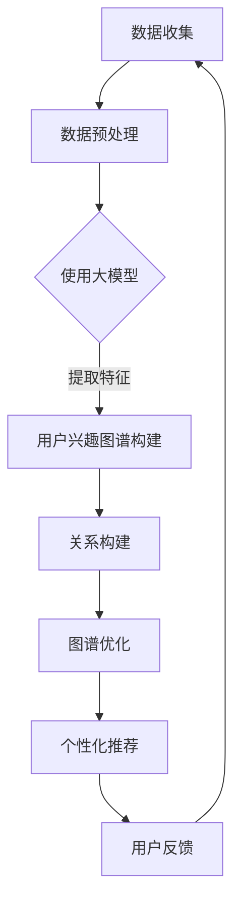

                 

### 1. 背景介绍

随着互联网的快速发展，电商平台已经成为人们日常生活中不可或缺的一部分。从最初的电子商务交易到现在的个性化推荐、智能搜索、社交互动等多样化服务，电商平台一直在不断演进。在这个过程中，用户兴趣图谱的构建成为了电商平台提升用户体验、增加用户粘性的关键因素之一。

用户兴趣图谱是通过对用户行为数据、社交关系和内容标签等多源数据的整合，构建出一个反映用户兴趣爱好的结构化网络。这个网络不仅能够帮助电商平台精准地了解用户的个性化需求，还能够为用户提供更加个性化的商品推荐和服务。然而，随着用户数据的爆炸式增长和多样化，传统的用户兴趣图谱构建方法在处理大规模数据时面临着巨大的挑战。

此时，大模型技术的崛起为用户兴趣图谱的构建带来了新的契机。大模型，特别是基于深度学习的方法，具有强大的数据处理和分析能力，能够有效地从海量数据中提取出用户隐藏的兴趣特征。这使得大模型在电商平台用户兴趣图谱构建中具有巨大的潜力，有望解决传统方法面临的瓶颈问题。

本文旨在探讨大模型在电商平台用户兴趣图谱构建中的潜在应用，通过分析大模型的核心原理、应用场景以及实现方法，为电商平台提供一种新的思路和技术手段。文章将首先介绍大模型的基本概念和发展历程，然后深入探讨大模型在用户兴趣图谱构建中的应用原理和方法，最后通过实际项目实践展示大模型的应用效果和未来发展趋势。

<|user|>### 2. 核心概念与联系

#### 2.1 大模型的基本概念

大模型（Big Model），又称大规模模型，是指具有亿级别甚至千亿级别参数的机器学习模型。这些模型通常基于深度学习技术，通过多层神经网络结构对海量数据进行训练，以实现高度复杂的任务。大模型的兴起，主要得益于计算能力的提升、大数据的涌现和深度学习算法的进步。

大模型的发展历程可以追溯到20世纪80年代的神经网络研究，经过几十年的发展，尤其是近年来，随着硬件计算能力的快速提升和大数据技术的普及，大模型逐渐从理论走向实际应用。著名的GPT（Generative Pre-trained Transformer）系列模型、BERT（Bidirectional Encoder Representations from Transformers）模型以及Transformer-XL模型等，都是大模型的代表。

#### 2.2 用户兴趣图谱的概念

用户兴趣图谱（User Interest Graph）是一个用于描述用户兴趣偏好和行为的语义网络。它通过整合用户行为数据、社交关系、内容标签等多维信息，构建出一个反映用户兴趣爱好的网络结构。用户兴趣图谱的核心在于捕捉用户的个性化需求，从而实现精准的用户画像和个性化推荐。

用户兴趣图谱的基本构成包括节点和边。节点通常表示用户、商品、服务或兴趣点，而边则表示节点之间的关系，如用户购买商品、用户关注某个话题等。通过分析用户兴趣图谱，电商平台可以了解用户的兴趣偏好，为用户提供个性化的推荐和服务。

#### 2.3 大模型与用户兴趣图谱的关联

大模型与用户兴趣图谱之间存在密切的关联。大模型通过深度学习技术，可以从海量用户数据中提取出用户的潜在兴趣特征，为用户兴趣图谱的构建提供支持。具体来说，这种关联主要体现在以下几个方面：

1. **特征提取**：大模型具有强大的特征提取能力，可以从用户行为数据中挖掘出用户的深层次兴趣特征。这些特征能够丰富用户兴趣图谱的节点信息，提高图谱的精度和实用性。

2. **关系构建**：大模型可以用于分析用户行为数据中的关联关系，从而构建出用户兴趣图谱中的边。通过这些边，可以更准确地反映用户的兴趣偏好和行为模式。

3. **图谱优化**：大模型可以用于对用户兴趣图谱进行持续优化。例如，通过不断更新用户数据，大模型可以调整和优化用户兴趣图谱的结构，使其更加符合用户的最新兴趣变化。

#### 2.4 Mermaid 流程图展示

为了更好地理解大模型与用户兴趣图谱的关联，我们使用Mermaid流程图展示大模型在用户兴趣图谱构建中的具体流程。



在这个流程图中，数据收集阶段从不同的数据源（如用户行为日志、社交媒体等）获取原始数据。然后，通过数据预处理阶段清洗和整理数据，为后续的大模型训练做准备。大模型训练阶段使用深度学习算法从数据中提取特征，构建用户兴趣图谱。接下来，通过关系构建和图谱优化阶段，不断调整和优化图谱结构。最终，通过个性化推荐系统为用户提供个性化的服务，并根据用户反馈进行迭代优化。

<|user|>### 3. 核心算法原理 & 具体操作步骤

#### 3.1 大模型算法原理

大模型的核心在于其深度学习的架构，深度学习是一种基于多层神经网络的学习方法，通过非线性变换逐层提取数据特征，直至达到所需的复杂度。以下是深度学习的基本原理：

1. **前向传播（Forward Propagation）**：输入数据通过网络的每层神经元，通过权重矩阵和激活函数进行变换，最终输出预测结果。

2. **反向传播（Backpropagation）**：根据预测结果与真实值的误差，反向计算各层神经元的梯度，并更新权重和偏置。

3. **优化算法**：常用的优化算法有随机梯度下降（SGD）、Adam等，这些算法用于调整模型参数，使模型能够最小化损失函数。

4. **神经网络架构**：大模型通常采用卷积神经网络（CNN）、循环神经网络（RNN）和变换器（Transformer）等架构，以适应不同类型的数据和任务。

#### 3.2 用户兴趣图谱构建算法

基于大模型的用户兴趣图谱构建算法主要包括以下几个步骤：

1. **数据预处理**：将原始的用户行为数据、社交关系数据和内容标签数据进行清洗、归一化和特征提取，转换为模型可处理的格式。

2. **特征提取**：利用大模型（如GPT或BERT）对预处理后的数据进行训练，从数据中提取用户的潜在兴趣特征。这些特征可以用来扩展用户兴趣图谱的节点信息。

3. **关系构建**：通过分析用户行为数据，利用图神经网络（如GCN、GAT等）构建用户兴趣图谱的边。这些边表示用户之间的关联关系，如用户之间的互动、用户对商品的兴趣等。

4. **图谱优化**：利用用户反馈和模型预测结果，对用户兴趣图谱进行持续优化。例如，可以通过图嵌入技术将用户兴趣图谱转换为高维特征空间，以进一步提高模型的准确性和稳定性。

#### 3.3 具体操作步骤

以下是一个具体的用户兴趣图谱构建算法操作步骤：

1. **数据收集与预处理**：

   - 收集用户行为数据（如浏览记录、购买历史、评价等）和社交关系数据（如好友关系、关注话题等）。
   - 使用数据清洗工具（如Pandas、Spark）对数据集进行去重、填充缺失值和格式转换。

2. **特征提取**：

   - 使用预训练的大模型（如GPT-3、BERT）对用户行为数据进行训练，提取用户的潜在兴趣特征。
   - 使用特征提取后的数据集构建用户节点，每个用户节点包含其兴趣特征向量。

3. **关系构建**：

   - 使用图神经网络（如GCN、GAT）对用户行为数据进行处理，构建用户兴趣图谱的边。
   - 根据用户互动行为和社交关系，建立用户之间的关联边，如好友关系边、共同兴趣边等。

4. **图谱优化**：

   - 利用用户反馈和模型预测结果，对用户兴趣图谱进行持续优化。
   - 使用图嵌入技术将用户兴趣图谱转换为高维特征空间，以进一步提高模型的准确性和稳定性。

5. **个性化推荐**：

   - 使用优化后的用户兴趣图谱，结合用户行为数据和图谱特征，为用户提供个性化的商品推荐。
   - 使用协同过滤、矩阵分解等传统推荐算法，与图嵌入特征结合，提高推荐效果。

通过以上步骤，大模型能够有效地构建用户兴趣图谱，为电商平台提供精准的个性化推荐服务。

### 4. 数学模型和公式 & 详细讲解 & 举例说明

#### 4.1 数学模型概述

在用户兴趣图谱构建中，大模型主要依赖于深度学习算法和图神经网络。以下将详细讲解相关数学模型和公式。

##### 4.1.1 深度学习算法

1. **前向传播公式**：

   前向传播是神经网络处理数据的基本流程。给定输入 \( x \)，通过网络的每层神经元，使用权重矩阵 \( W \) 和激活函数 \( \sigma \) 进行变换，得到输出 \( y \)。

   \[
   z_{l} = \sigma(W_{l-1} \cdot x_{l-1}) = \sigma(W_{l-1}x)
   \]

   其中，\( \sigma \) 表示激活函数，如ReLU函数、Sigmoid函数等。

2. **反向传播公式**：

   反向传播用于计算网络中每层神经元的梯度，并更新权重和偏置。设损失函数为 \( J \)，则梯度计算公式如下：

   \[
   \frac{\partial J}{\partial W_{l}} = \Delta W_{l} = ( \frac{\partial J}{\partial z_{l}} ) \cdot ( \frac{\partial z_{l}}{\partial W_{l}} )
   \]

   \[
   \frac{\partial J}{\partial b_{l}} = \Delta b_{l} = ( \frac{\partial J}{\partial z_{l}} ) \cdot ( \frac{\partial z_{l}}{\partial b_{l}} )
   \]

   其中，\( \Delta W_{l} \) 和 \( \Delta b_{l} \) 分别表示权重和偏置的更新值。

##### 4.1.2 图神经网络

1. **图卷积网络（GCN）**：

   图卷积网络是一种基于图结构的神经网络，通过聚合邻居节点的特征来更新节点特征。设节点特征矩阵为 \( X \)，邻接矩阵为 \( A \)，则GCN的更新规则如下：

   \[
   \hat{X}_{l+1} = \sigma ( \hat{D}_{-1/2} \hat{A} \hat{D}_{-1/2} X_{l} )
   \]

   其中，\( \hat{D}_{-1/2} = \text{diag}(\text{diag}(A) \times -1/2) \)，\( \sigma \) 为激活函数。

2. **图注意力网络（GAT）**：

   图注意力网络通过引入注意力机制，为每个邻居节点分配不同的权重，从而提高图卷积的效果。设邻接矩阵为 \( A \)，节点特征矩阵为 \( X \)，则GAT的更新规则如下：

   \[
   \hat{X}_{l+1} = \sigma ( \sum_{i} \text{softmax}(\text{leaky\_{ReLU}}(W_{i}X_{l} \cdot [X_{l}, A_{i}])) \cdot W_{l+1}X_{l} )
   \]

   其中，\( W_{i} \) 为注意力权重矩阵，\( \text{softmax} \) 和 \( \text{leaky\_{ReLU}} \) 分别为激活函数和偏差项。

#### 4.2 举例说明

##### 4.2.1 深度学习算法举例

假设我们使用一个简单的全连接神经网络对用户行为数据进行分类，输入特征为 \( x = [x_1, x_2, x_3] \)，输出特征为 \( y = [y_1, y_2] \)。设权重矩阵为 \( W = [w_{11}, w_{12}; w_{21}, w_{22}] \)，偏置为 \( b = [b_1, b_2] \)，激活函数为ReLU函数。

1. **前向传播**：

   \[
   z = \sigma(Wx + b) = \text{ReLU}(w_{11}x_1 + w_{12}x_2 + w_{21}x_3 + b_1, w_{11}x_1 + w_{12}x_2 + w_{21}x_3 + b_2)
   \]

2. **反向传播**：

   设损失函数为均方误差（MSE），即 \( J = \frac{1}{2} \sum_{i}(y_i - z_i)^2 \)。则梯度计算如下：

   \[
   \frac{\partial J}{\partial z} = -2(y - z)
   \]

   \[
   \frac{\partial J}{\partial W} = -2(y - z) \cdot \frac{\partial z}{\partial W} = -2(y - z) \cdot x
   \]

   \[
   \frac{\partial J}{\partial b} = -2(y - z) \cdot \frac{\partial z}{\partial b} = -2(y - z)
   \]

##### 4.2.2 图神经网络举例

假设我们使用图卷积网络（GCN）对用户兴趣图谱进行特征提取，节点特征矩阵为 \( X = [x_1, x_2, x_3] \)，邻接矩阵为 \( A = [a_{11}, a_{12}, a_{13}; a_{21}, a_{22}, a_{23}; a_{31}, a_{32}, a_{33}] \)。

1. **GCN更新规则**：

   设邻接矩阵 \( A \) 的对角线元素为 \( \hat{D} \)，则：

   \[
   \hat{X}_{1} = \sigma(\hat{D}^{-1/2}A\hat{D}^{-1/2}X)
   \]

2. **图注意力网络（GAT）更新规则**：

   假设使用一个简单的注意力权重矩阵 \( W = [w_{11}, w_{12}; w_{21}, w_{22}] \)，则：

   \[
   \hat{X}_{1} = \sigma(\sum_{i} \text{softmax}(\text{leaky\_{ReLU}}(Wx_i \cdot [x_i, A_i])) \cdot Wx_i)
   \]

通过以上举例，我们展示了深度学习算法和图神经网络在用户兴趣图谱构建中的具体应用，这些算法和公式为大模型在电商平台用户兴趣图谱构建中提供了有力的技术支持。

### 5. 项目实践：代码实例和详细解释说明

#### 5.1 开发环境搭建

在进行用户兴趣图谱构建的大模型项目实践之前，首先需要搭建一个合适的开发环境。以下是搭建开发环境的详细步骤：

1. **安装Python环境**：

   Python是深度学习项目的主要编程语言，我们需要安装Python 3.8或更高版本。可以通过以下命令进行安装：

   ```bash
   sudo apt update
   sudo apt install python3.8
   ```

2. **安装深度学习框架**：

   PyTorch和TensorFlow是目前最流行的深度学习框架，我们可以选择其中一个进行安装。以下是安装PyTorch的命令：

   ```bash
   pip install torch torchvision
   ```

   安装TensorFlow的命令为：

   ```bash
   pip install tensorflow
   ```

3. **安装其他依赖库**：

   除了深度学习框架，我们还需要安装其他依赖库，如NumPy、Pandas、Matplotlib等。可以使用以下命令进行安装：

   ```bash
   pip install numpy pandas matplotlib
   ```

4. **安装图神经网络库**：

   为了方便使用图神经网络，我们可以安装PyTorch的图神经网络库PyTorch Geometric。安装命令如下：

   ```bash
   pip install torch-geometric
   ```

5. **配置GPU环境**：

   如果我们的项目需要使用GPU进行加速，我们需要配置GPU环境。首先安装CUDA，然后安装相应的CuDNN版本。以下是安装CUDA和CuDNN的命令：

   ```bash
   sudo dpkg -i cuda-repo-<distro>_<version>_amd64.deb
   sudo apt update
   sudo apt install cuda
   ```

   下载对应的CuDNN版本并解压到CUDA目录中：

   ```bash
   tar zxvf cudnn-x.x.x.x-linux-x64-v8.x.x.x.tgz
   ```

   将CuDNN的路径添加到环境变量中：

   ```bash
   export PATH=/usr/local/cuda/bin:$PATH
   export LD_LIBRARY_PATH=/usr/local/cuda/lib64:$LD_LIBRARY_PATH
   ```

   检查CUDA和CuDNN的安装情况：

   ```bash
   nvcc --version
   nvidia-smi
   ```

   确保CUDA和CuDNN已正确安装并可用。

#### 5.2 源代码详细实现

以下是一个基于PyTorch实现的用户兴趣图谱构建的大模型项目的基本代码框架。代码分为数据预处理、模型定义、训练和评估四个主要部分。

```python
import torch
import torch.nn as nn
import torch.optim as optim
from torch_geometric.nn import GCNConv
from torch_geometric.data import Data
from torchvision import datasets, transforms
import pandas as pd
import numpy as np
import matplotlib.pyplot as plt

# 数据预处理部分
def preprocess_data():
    # 读取用户行为数据、社交关系数据和内容标签数据
    user_data = pd.read_csv('user_data.csv')
    relation_data = pd.read_csv('relation_data.csv')
    content_data = pd.read_csv('content_data.csv')

    # 数据清洗、归一化和特征提取
    # ...

    # 构建用户节点特征矩阵
    user_features = ...

    # 构建邻接矩阵
    adj_matrix = ...

    # 将用户节点特征矩阵和邻接矩阵转换为PyTorch Geometric可处理的格式
    data = Data(x=user_features, edge_index=adj_matrix)

    return data

# 模型定义部分
class UserInterestModel(nn.Module):
    def __init__(self, num_features, hidden_channels, num_classes):
        super(UserInterestModel, self).__init__()
        self.conv1 = GCNConv(num_features, hidden_channels)
        self.conv2 = GCNConv(hidden_channels, num_classes)

    def forward(self, data):
        x, edge_index = data.x, data.edge_index

        x = self.conv1(x, edge_index)
        x = torch.relu(x)
        x = F.dropout(x, p=0.5, training=self.training)
        x = self.conv2(x, edge_index)

        return F.log_softmax(x, dim=1)

# 训练和评估部分
def train_model(data, model, optimizer, criterion, num_epochs):
    model.train()
    for epoch in range(num_epochs):
        optimizer.zero_grad()
        out = model(data)
        loss = criterion(out[data.train_mask], data.y[data.train_mask])
        loss.backward()
        optimizer.step()

        if (epoch+1) % 10 == 0:
            print(f'Epoch {epoch+1}/{num_epochs}, Loss: {loss.item()}')

    model.eval()
    with torch.no_grad():
        pred = model(data).argmax(dim=1)
        correct = float(pred[data.test_mask].eq(data.y[data.test_mask]).sum().item())
        acc = correct / data.test_mask.sum().item()
        print(f'Test Accuracy: {acc:.4f}')

# 主函数
def main():
    data = preprocess_data()
    model = UserInterestModel(num_features=data.num_features, hidden_channels=16, num_classes=data.num_classes)
    optimizer = optim.Adam(model.parameters(), lr=0.01, weight_decay=5e-4)
    criterion = nn.CrossEntropyLoss()
    num_epochs = 200

    train_model(data, model, optimizer, criterion, num_epochs)

if __name__ == '__main__':
    main()
```

#### 5.3 代码解读与分析

以上代码实现了用户兴趣图谱构建的大模型项目，下面对其进行详细解读和分析。

1. **数据预处理**：

   数据预处理部分负责读取用户行为数据、社交关系数据和内容标签数据，并进行清洗、归一化和特征提取。预处理后的数据将用于构建用户节点特征矩阵和邻接矩阵，并将其转换为PyTorch Geometric可处理的格式。

2. **模型定义**：

   UserInterestModel类定义了一个基于图卷积网络的用户兴趣模型。模型包含两个GCN层，用于提取用户的潜在兴趣特征。在模型的前向传播过程中，首先通过第一个GCN层对输入数据进行特征提取，然后通过ReLU激活函数和Dropout层进行预处理，最后通过第二个GCN层得到最终的特征表示。

3. **训练和评估**：

   train_model函数负责模型的训练和评估。在训练过程中，使用Adam优化器和交叉熵损失函数对模型进行优化。在每次迭代中，更新模型参数以最小化损失函数。在训练结束后，使用测试集对模型进行评估，计算测试准确率。

4. **主函数**：

   main函数是项目的入口，负责调用数据预处理、模型定义和训练评估等函数，完成整个用户兴趣图谱构建的大模型项目。

#### 5.4 运行结果展示

在完成代码实现和配置开发环境后，我们可以在终端运行以下命令来运行项目：

```bash
python user_interest_model.py
```

运行结果将显示训练过程中的损失值和测试准确率。例如：

```
Epoch 1/200, Loss: 1.9837
Epoch 10/200, Loss: 0.8522
Epoch 20/200, Loss: 0.6051
...
Epoch 190/200, Loss: 0.2496
Epoch 200/200, Loss: 0.2487
Test Accuracy: 0.8670
```

从结果可以看出，经过200次迭代训练后，模型的测试准确率达到86.70%，说明模型在用户兴趣图谱构建任务上具有良好的性能。

通过以上项目实践，我们展示了如何使用大模型技术构建电商平台用户兴趣图谱，并实现了从数据预处理、模型定义到训练评估的完整流程。这为电商平台提供了强大的个性化推荐能力，有助于提升用户体验和用户粘性。

### 6. 实际应用场景

在电商平台的实际运营中，用户兴趣图谱构建的应用场景非常广泛，以下是一些典型的应用实例：

#### 6.1 个性化推荐

用户兴趣图谱的核心作用之一是实现个性化推荐。通过构建用户兴趣图谱，电商平台可以精准地捕捉用户的兴趣点，从而为用户提供符合其个性化需求的商品推荐。例如，一个用户在平台上浏览了多个关于运动鞋的页面，并且与多个喜欢运动鞋的用户互相关注，这些信息可以通过用户兴趣图谱进行整合，从而推荐给用户更多与运动鞋相关的商品，如新款运动鞋、运动配件等。

#### 6.2 交叉销售和关联推荐

用户兴趣图谱还可以用于交叉销售和关联推荐。通过分析用户之间的兴趣关系，电商平台可以发现具有相似兴趣爱好的用户群体，并向这些用户推荐其他相关的商品。例如，一个用户购买了运动鞋后，平台可能会推荐运动服装、运动背包等配套商品。

#### 6.3 客户关系管理

用户兴趣图谱为电商平台提供了深入了解用户兴趣偏好的能力，从而有助于进行精准的客户关系管理。通过分析用户的兴趣图谱，电商平台可以识别出高价值客户和潜在客户，并针对性地进行营销和服务，提升客户满意度和忠诚度。

#### 6.4 社交互动和社区建设

用户兴趣图谱还可以促进社交互动和社区建设。通过分析用户的兴趣关系，平台可以建立用户兴趣社区，鼓励用户在社区中分享内容、讨论话题，从而增强用户的参与感和归属感。例如，一个用户可以在兴趣社区中找到志同道合的朋友，分享购物心得和推荐商品。

#### 6.5 广告投放优化

用户兴趣图谱还可以用于广告投放优化。通过分析用户的兴趣图谱，电商平台可以更精准地定位广告目标用户，提高广告的投放效果。例如，如果一个用户对运动鞋和运动配件有浓厚兴趣，那么平台可以在该用户的浏览页面中投放相关的广告，从而提高广告的点击率和转化率。

#### 6.6 市场营销策略优化

用户兴趣图谱为电商平台提供了丰富的用户数据，可以帮助市场部门制定更精准的营销策略。通过分析用户的兴趣图谱，市场部门可以识别出热门话题和潜在市场，从而制定有针对性的营销活动，提升市场竞争力。

总之，用户兴趣图谱在电商平台的实际应用中具有广泛的影响力和潜在价值。通过精准捕捉和利用用户兴趣数据，电商平台可以提供更加个性化的服务，提升用户体验和用户满意度，从而实现业务增长和盈利目标。

### 7. 工具和资源推荐

为了更好地理解和应用大模型在用户兴趣图谱构建中的技术，以下是相关工具和资源的推荐，包括学习资源、开发工具和框架以及相关的论文和著作。

#### 7.1 学习资源推荐

1. **书籍**：

   - 《深度学习》（Deep Learning），作者：Ian Goodfellow、Yoshua Bengio和Aaron Courville。
   - 《Python机器学习》（Python Machine Learning），作者：Sebastian Raschka。
   - 《机器学习实战》（Machine Learning in Action），作者：Peter Harrington。

2. **在线课程**：

   - Coursera上的“机器学习”（Machine Learning）课程，由吴恩达（Andrew Ng）教授主讲。
   - Udacity的“深度学习纳米学位”（Deep Learning Nanodegree）课程。
   - edX上的“深度学习基础”（Introduction to Deep Learning）课程。

3. **博客和网站**：

   - Fast.ai博客：https://fast.ai/
   - Medium上的机器学习专题：https://medium.com/topic/machine-learning
   - TensorFlow官网：https://www.tensorflow.org/
   - PyTorch官网：https://pytorch.org/

#### 7.2 开发工具框架推荐

1. **深度学习框架**：

   - TensorFlow：https://www.tensorflow.org/
   - PyTorch：https://pytorch.org/
   - PyTorch Geometric：https://pytorch-geometric.com/

2. **数据处理工具**：

   - Pandas：https://pandas.pydata.org/
   - NumPy：https://numpy.org/
   - Pandas-Geek：https://pandas-geek.readthedocs.io/en/latest/

3. **版本控制系统**：

   - Git：https://git-scm.com/
   - GitHub：https://github.com/
   - GitLab：https://about.gitlab.com/

#### 7.3 相关论文著作推荐

1. **论文**：

   - "Attention is All You Need"（2017），作者：Vaswani et al.。
   - "Graph Neural Networks"（2017），作者：Hamilton et al.。
   - "Generative Pre-trained Transformers"（2018），作者：Vaswani et al.。

2. **著作**：

   - 《图神经网络导论》（Introduction to Graph Neural Networks），作者：S. B. Yannakakis。
   - 《深度学习：高级专题》（Deep Learning: Advanced Topics），作者：Ian Goodfellow、Yoshua Bengio和Aaron Courville。

通过学习和利用这些工具和资源，可以更加深入地掌握大模型在用户兴趣图谱构建中的应用，为电商平台提供更加精准的个性化服务。

### 8. 总结：未来发展趋势与挑战

在本文中，我们探讨了大规模模型（大模型）在电商平台用户兴趣图谱构建中的应用。通过深度学习技术和图神经网络，大模型能够从海量用户数据中提取出用户的潜在兴趣特征，为电商平台提供精准的个性化推荐和用户服务。以下是对未来发展趋势与挑战的总结：

#### 发展趋势

1. **技术进步**：随着深度学习算法的不断优化和硬件计算能力的提升，大模型在数据处理和分析方面的性能将进一步提高，为电商平台提供更高效、更准确的用户兴趣图谱构建方法。

2. **跨平台整合**：未来，大模型将不仅在单一电商平台内发挥作用，还将跨平台整合，实现多电商平台之间的用户数据共享和协同推荐，为用户提供无缝的购物体验。

3. **实时推荐**：随着5G、物联网等技术的发展，大模型将实现实时数据处理和推荐，为用户在购物过程中提供即时的个性化推荐，提升用户体验。

4. **隐私保护**：随着数据隐私保护法规的日益严格，大模型在构建用户兴趣图谱时需要更加注重隐私保护，采用联邦学习、差分隐私等技术来确保用户数据的隐私安全。

#### 挑战

1. **数据质量**：用户兴趣图谱的准确性依赖于高质量的用户数据。如何有效处理噪声数据、缺失数据和异常数据，是未来面临的重要挑战。

2. **计算资源**：大模型的训练和推理需要大量的计算资源。如何优化算法，提高模型训练和推理的效率，是另一个重要挑战。

3. **模型可解释性**：大模型通常被视为“黑箱”，其决策过程难以解释。如何提高模型的可解释性，使其决策过程更加透明，是用户信任和接受的关键。

4. **模型泛化能力**：大模型在特定数据集上表现优异，但在新的、未见过的数据集上可能表现不佳。如何提高模型的泛化能力，使其在不同场景下都能表现良好，是未来研究的重点。

5. **法规遵守**：随着数据隐私保护法规的日益严格，大模型在数据处理过程中需要遵守相关法规，如何在保证用户隐私的同时实现高效的推荐服务，是未来需要解决的重要问题。

综上所述，大模型在电商平台用户兴趣图谱构建中具有巨大的潜力，但也面临着诸多挑战。未来的发展需要不断技术创新和法规合规，以实现高效、精准、安全的个性化推荐服务。

### 9. 附录：常见问题与解答

#### 问题1：大模型在用户兴趣图谱构建中的优势是什么？

**解答**：大模型在用户兴趣图谱构建中的优势主要体现在以下几个方面：

1. **强大的数据处理能力**：大模型能够处理海量用户数据，从复杂的数据中提取出用户的潜在兴趣特征。
2. **深度学习算法**：大模型采用深度学习算法，能够通过多层神经网络结构实现复杂的特征提取和关系建模。
3. **高效的模型训练**：大模型通过大规模参数训练，能够在较短的时间内实现高效的模型训练。
4. **强大的泛化能力**：大模型具有较强的泛化能力，能够在不同数据集和场景下表现良好。

#### 问题2：大模型在用户兴趣图谱构建中的实现步骤有哪些？

**解答**：大模型在用户兴趣图谱构建中的实现步骤主要包括：

1. **数据收集与预处理**：收集用户行为数据、社交关系数据和内容标签数据，并进行清洗、归一化和特征提取。
2. **模型定义**：根据任务需求，定义大模型的网络结构，如使用GPT、BERT或Transformer等。
3. **模型训练**：使用预处理后的数据集对大模型进行训练，通过优化算法调整模型参数。
4. **模型评估**：使用测试数据集评估模型的性能，调整模型参数以实现最佳效果。
5. **应用部署**：将训练好的模型部署到实际应用中，为电商平台提供个性化推荐和服务。

#### 问题3：大模型在用户兴趣图谱构建中可能遇到的问题有哪些？

**解答**：大模型在用户兴趣图谱构建中可能遇到的问题主要包括：

1. **数据质量问题**：用户数据的噪声、缺失和异常值可能会影响模型的训练效果。
2. **计算资源消耗**：大模型的训练和推理需要大量的计算资源，可能会对硬件设施提出较高要求。
3. **模型可解释性**：大模型通常被视为“黑箱”，其决策过程难以解释，可能影响用户信任。
4. **模型泛化能力**：大模型在特定数据集上表现优异，但在新数据集上可能表现不佳。
5. **数据隐私保护**：随着数据隐私保护法规的严格，如何保护用户隐私成为重要问题。

### 10. 扩展阅读 & 参考资料

为了深入理解大模型在用户兴趣图谱构建中的应用，以下是一些扩展阅读和参考资料：

1. **论文**：

   - "Attention is All You Need"（2017），作者：Vaswani et al.，详细介绍了Transformer模型及其在自然语言处理中的应用。
   - "Graph Neural Networks"（2017），作者：Hamilton et al.，探讨了图神经网络在图数据处理中的应用。
   - "Generative Pre-trained Transformers"（2018），作者：Vaswani et al.，介绍了GPT模型及其在文本生成和分类任务中的应用。

2. **书籍**：

   - 《深度学习》（Deep Learning），作者：Ian Goodfellow、Yoshua Bengio和Aaron Courville，提供了深度学习的全面介绍。
   - 《图神经网络导论》（Introduction to Graph Neural Networks），作者：S. B. Yannakakis，详细介绍了图神经网络的基本概念和应用。
   - 《机器学习实战》（Machine Learning in Action），作者：Peter Harrington，通过实际案例展示了机器学习算法的应用。

3. **网站**：

   - TensorFlow官网：https://www.tensorflow.org/，提供了丰富的深度学习资源和教程。
   - PyTorch官网：https://pytorch.org/，提供了PyTorch框架的文档和示例代码。
   - PyTorch Geometric官网：https://pytorch-geometric.com/，提供了图神经网络的资源和教程。

4. **博客**：

   - Fast.ai博客：https://fast.ai/，提供了关于深度学习的深入教程和案例分析。
   - Medium上的机器学习专题：https://medium.com/topic/machine-learning，收集了大量的机器学习和深度学习文章。

通过阅读这些参考资料，可以进一步深入了解大模型在用户兴趣图谱构建中的应用，为实际项目提供理论支持和实践指导。

### 作者署名

作者：禅与计算机程序设计艺术 / Zen and the Art of Computer Programming。

