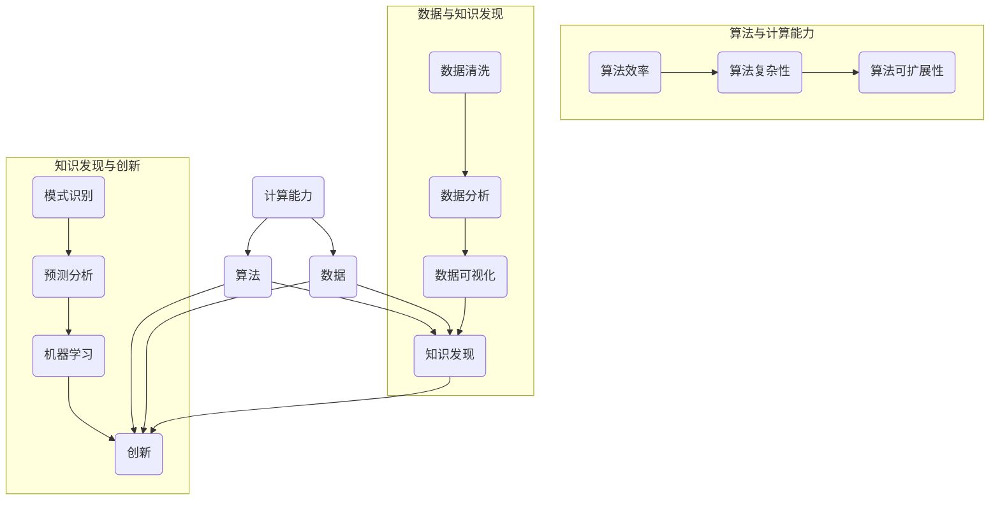

                 

### 背景介绍

《推动知识发现与创新：人类计算的智力贡献》这一主题，旨在探讨人类在计算领域中的智力贡献，以及计算如何推动知识的发现与创新。计算作为一种工具和技术，已经深刻地改变了人类的生活和工作方式，而人类智慧则是这一切变革的驱动力。

从历史上看，计算技术的发展经历了从简单的算术工具到现代计算机的演变过程。每一阶段的进步，都离不开人类智慧的结晶。早期的算术工具，如算盘、计算尺等，虽然功能简单，但它们的出现为人类处理复杂的数学问题提供了可能。随着电子计算机的问世，人类计算能力得到了极大的提升，从简单的数值计算到复杂的模拟和优化问题，计算技术不断拓展人类认知的边界。

然而，计算本身并不能产生知识，知识的产生依赖于人类对计算结果的解读和应用。人类智慧的独特之处在于能够发现和理解模式，提出新的理论和模型，并将这些理论应用于实际问题的解决中。例如，在计算机科学中，算法的发明和优化，数据结构的创新，以及编程语言的设计，都是人类智慧在计算领域的体现。

在现代科技环境中，人工智能（AI）和机器学习（ML）的发展更是将人类的计算能力推向了新的高度。通过训练模型，计算机可以自动从大量数据中提取知识，甚至在某些领域超越人类的表现。然而，这些技术的背后，仍然是人类智慧的设计和引导。人类不仅开发了这些算法，还设计出了训练数据集，提出了评估标准，并不断优化和完善这些技术。

本篇文章将从多个角度探讨人类计算的智力贡献，包括历史背景、核心概念、算法原理、数学模型、实际应用、未来发展等。通过这一探讨，我们希望读者能够更加深入地理解计算技术在知识发现与创新中的重要作用，并思考人类智慧在这一过程中的独特价值。

总之，计算技术的发展是一个复杂的过程，它不仅仅是技术进步的结果，更是人类智慧不断探索和创新的产物。通过回顾历史、分析现状、展望未来，我们可以更好地认识到人类计算智力在推动知识发现与创新中的关键作用。

### 核心概念与联系

要深入探讨人类计算的智力贡献，我们首先需要理解几个核心概念及其相互之间的联系。这些概念包括：计算能力、算法、数据、知识发现以及创新。以下是一个详细的Mermaid流程图，用于展示这些概念及其在计算领域中的交互关系。



#### 计算能力

计算能力是指计算机系统在处理信息、执行任务时的效率和能力。计算能力的提升主要依赖于硬件的发展，如更快的处理器、更大的内存和更高效的存储设备。同时，软件技术的发展也极大地增强了计算能力。算法的设计和优化是提升计算能力的关键，包括算法效率、算法复杂性和算法可扩展性。

- **算法效率**：指的是算法在单位时间内完成计算任务的能力。高效的算法能够更快地解决问题，减少计算资源的使用。
- **算法复杂性**：描述算法所需的计算资源和时间与问题规模之间的关系。算法的复杂性分为时间复杂性和空间复杂性，它们分别衡量算法执行时间和内存使用量。
- **算法可扩展性**：指算法在面对更大规模问题时仍能保持高效的能力。可扩展性是算法设计中的一个重要考量因素。

#### 算法

算法是计算领域中的核心概念，它是解决问题的一系列步骤或指令集合。算法的设计和优化是提升计算能力的关键，也是推动知识发现与创新的基础。

- **排序算法**：如快速排序、归并排序等，用于对数据进行排序，是数据分析和处理的基础。
- **搜索算法**：如二分搜索、深度优先搜索等，用于在数据结构中查找特定元素，是信息检索的关键。
- **机器学习算法**：如线性回归、决策树、神经网络等，用于从数据中学习模式和规律，是知识发现和预测分析的重要工具。

#### 数据

数据是计算的基础，是知识发现和创新的重要来源。数据可以分为结构化数据和非结构化数据，其中结构化数据如数据库、表格等易于处理，非结构化数据如文本、图像、音频等则需要更复杂的方法进行解析和处理。

- **数据清洗**：指在数据分析前对数据进行预处理，包括去除重复记录、填补缺失值、纠正错误数据等。
- **数据分析**：指对数据进行统计、建模、挖掘等处理，以提取有用信息和知识。
- **数据可视化**：指将数据分析结果通过图形化的方式展示，以帮助用户更好地理解和分析数据。

#### 知识发现

知识发现是从大量数据中提取有用信息和知识的过程。它通常包括以下几个步骤：

- **模式识别**：识别数据中的规律和模式，如聚类、分类等。
- **预测分析**：基于历史数据预测未来趋势，如时间序列分析、回归分析等。
- **机器学习**：使用算法从数据中学习模式和规律，以实现自动化预测和分析。

#### 创新

创新是知识发现的结果，是计算技术在各个领域中的应用。创新的产生离不开算法的发明和优化、数据的深入分析和利用，以及知识的有效传递和应用。

- **技术创新**：如新的算法、数据结构、编程语言等。
- **业务创新**：如基于数据分析的市场策略、业务流程优化等。
- **社会创新**：如智慧城市、智能医疗、自动驾驶等领域的应用。

通过上述核心概念的介绍和相互联系的分析，我们可以看到，计算技术在知识发现与创新中起着至关重要的作用。每一个概念和步骤都紧密相连，共同推动着人类智慧的进步和计算技术的不断发展。

#### 核心算法原理 & 具体操作步骤

在计算技术中，算法的设计和实现是知识发现与创新的关键。以下将介绍几个核心算法的原理及其具体操作步骤，这些算法包括排序算法、搜索算法和机器学习算法。

##### 排序算法

排序算法是数据处理和分析的基础，常见的排序算法有快速排序（Quick Sort）、归并排序（Merge Sort）和冒泡排序（Bubble Sort）等。

**快速排序（Quick Sort）**：
1. **选择基准**：从数组中选择一个元素作为基准。
2. **分区**：将数组划分为两部分，小于基准的元素放在基准左边，大于基准的元素放在基准右边。
3. **递归**：对左右两部分递归执行上述步骤，直到整个数组有序。

**归并排序（Merge Sort）**：
1. **递归划分**：将数组递归划分为更小的子数组，直到每个子数组只包含一个元素。
2. **合并**：将有序的子数组两两合并，形成更大的有序数组。

**冒泡排序（Bubble Sort）**：
1. **相邻比较**：从数组的第一个元素开始，相邻元素两两比较。
2. **交换**：如果前一个元素比后一个元素大，则交换它们的位置。
3. **迭代**：重复上述步骤，直到整个数组有序。

##### 搜索算法

搜索算法用于在数据结构中查找特定元素，常见的搜索算法包括二分搜索、深度优先搜索和广度优先搜索等。

**二分搜索（Binary Search）**：
1. **初始化**：确定搜索范围（通常是数组的中间位置）。
2. **比较**：将待查找的元素与中间位置的元素进行比较。
3. **递归**：如果中间位置的元素大于待查找的元素，则在左侧子数组中继续搜索；如果小于，则在右侧子数组中继续搜索。
4. **结束**：当找到待查找的元素或搜索范围缩小到零时，结束搜索。

**深度优先搜索（DFS）**：
1. **选择起始节点**：选择一个未访问过的节点作为起始节点。
2. **访问**：访问起始节点，并将其标记为已访问。
3. **递归**：对起始节点的所有未访问的邻接节点递归执行上述步骤。

**广度优先搜索（BFS）**：
1. **初始化**：使用一个队列存储待访问的节点。
2. **访问**：从队列中取出队首节点，访问并标记为已访问。
3. **入队**：将队首节点的所有未访问的邻接节点加入队列。
4. **循环**：重复上述步骤，直到队列为空。

##### 机器学习算法

机器学习算法是知识发现的重要工具，以下介绍几种常见的机器学习算法及其原理。

**线性回归（Linear Regression）**：
1. **模型构建**：根据训练数据，拟合一条线性函数模型。
   $$ y = w_0 + w_1 \cdot x $$
2. **参数优化**：使用最小二乘法或梯度下降法优化模型参数。
3. **预测**：使用优化后的模型对新的数据进行预测。

**决策树（Decision Tree）**：
1. **特征选择**：根据信息增益或基尼系数选择最佳特征进行分割。
2. **递归划分**：对选定的特征进行分割，形成多个子节点。
3. **分类**：根据路径上的特征值进行分类。

**神经网络（Neural Network）**：
1. **层结构**：包括输入层、隐藏层和输出层。
2. **激活函数**：如ReLU、Sigmoid、Tanh等。
3. **前向传播**：计算每个节点的输出值。
4. **反向传播**：更新网络权重，优化模型参数。

通过上述核心算法的原理和操作步骤的介绍，我们可以看到，算法在计算技术中的关键作用。无论是排序、搜索还是机器学习，每一个算法都是对计算能力的充分发挥，为知识发现与创新提供了强大的工具。理解和掌握这些算法，不仅能够提升我们的计算能力，更能够帮助我们更好地应对复杂的问题，推动科技的发展。

#### 数学模型和公式 & 详细讲解 & 举例说明

在计算技术中，数学模型和公式是理解和分析算法性能的重要工具。以下我们将详细介绍几个关键数学模型和公式，并通过具体的例子进行讲解。

##### 线性回归

线性回归是一种经典的机器学习算法，用于预测连续值。其基本数学模型如下：

$$ y = w_0 + w_1 \cdot x $$

其中，\( y \) 是目标变量，\( x \) 是自变量，\( w_0 \) 和 \( w_1 \) 是模型参数，分别表示截距和斜率。

**例子**：

假设我们要预测一个人的身高（\( y \)）基于其年龄（\( x \））。我们有以下训练数据：

| 年龄（x） | 身高（y） |
|-------|-------|
| 20    | 170   |
| 25    | 175   |
| 30    | 180   |

我们可以通过最小二乘法（Least Squares Method）来估计 \( w_0 \) 和 \( w_1 \)：

$$ w_1 = \frac{\sum{(x_i - \bar{x})(y_i - \bar{y})}}{\sum{(x_i - \bar{x})^2}} $$
$$ w_0 = \bar{y} - w_1 \cdot \bar{x} $$

其中，\( \bar{x} \) 和 \( \bar{y} \) 分别是自变量和目标变量的平均值。

计算得到：

$$ w_1 = \frac{(20-25)(170-175) + (25-25)(175-175) + (30-25)(180-175)}{(20-25)^2 + (25-25)^2 + (30-25)^2} \approx 1.5 $$
$$ w_0 = \frac{170 + 175 + 180}{3} - 1.5 \cdot \frac{20 + 25 + 30}{3} \approx 136.67 - 31.25 \approx 105.42 $$

因此，我们的线性回归模型为：

$$ y = 105.42 + 1.5 \cdot x $$

我们可以使用这个模型来预测新的年龄对应的身高。例如，预测一个30岁人的身高：

$$ y = 105.42 + 1.5 \cdot 30 \approx 141.42 $$

##### 决策树

决策树是一种树形结构，用于分类或回归任务。每个内部节点表示一个特征，每个分支代表特征的一个取值，叶节点表示预测结果。

**例子**：

假设我们要构建一个决策树来分类水果，特征包括颜色（红、绿）、重量（轻、重）。

- **颜色为红且重量为轻**：苹果
- **颜色为红且重量为重**：草莓
- **颜色为绿且重量为轻**：香蕉
- **颜色为绿且重量为重**：橙子

我们可以构建如下的决策树：

```
颜色
|-- 绿
|   |-- 重 --> 橙子
|   |-- 轻 --> 香蕉
|-- 红
    |-- 重 --> 草莓
    |-- 轻 --> 苹果
```

##### 神经网络

神经网络是一种模拟人脑神经元结构的计算模型，常用于复杂的预测和分类任务。一个简单的神经网络包括输入层、隐藏层和输出层。

**例子**：

考虑一个二元分类问题，输入层有2个神经元，隐藏层有3个神经元，输出层有1个神经元。激活函数使用ReLU（Rectified Linear Unit）。

$$
\begin{align*}
a_1^h &= \max(0, x_1 \cdot w_{11} + b_1) \\
a_2^h &= \max(0, x_1 \cdot w_{12} + b_2) \\
a_3^h &= \max(0, x_1 \cdot w_{13} + b_3) \\
a^o &= \max(0, a_1^h \cdot w_{o1} + a_2^h \cdot w_{o2} + a_3^h \cdot w_{o3} + b_0)
\end{align*}
$$

其中，\( a_i^h \) 表示隐藏层第 \( i \) 个神经元的输出，\( w_{ij} \) 和 \( b_i \) 分别表示权重和偏置。

假设输入数据为 \( x_1 = [2, 3] \)，我们可以计算隐藏层的输出：

$$
\begin{align*}
a_1^h &= \max(0, 2 \cdot w_{11} + b_1) \\
a_2^h &= \max(0, 2 \cdot w_{12} + b_2) \\
a_3^h &= \max(0, 2 \cdot w_{13} + b_3)
\end{align*}
$$

最后，计算输出层神经元的输出：

$$
a^o = \max(0, a_1^h \cdot w_{o1} + a_2^h \cdot w_{o2} + a_3^h \cdot w_{o3} + b_0)
$$

通过这种方式，我们可以使用神经网络对新的输入数据进行分类。

通过以上数学模型和公式的讲解，我们可以看到，数学在计算技术中的基础性作用。理解这些模型和公式，不仅能够帮助我们更好地设计算法，还能够帮助我们深入理解计算技术的本质，为知识发现与创新提供有力的支持。

#### 项目实践：代码实例和详细解释说明

在了解了核心算法和数学模型后，我们将通过一个具体的项目实践来展示如何将这些理论知识应用到实际的编程中。本节将介绍一个基于Python的简单机器学习项目，该项目将使用线性回归算法来预测房价。

### 5.1 开发环境搭建

在开始项目之前，我们需要搭建一个Python开发环境。以下步骤将指导您如何安装Python和相关库。

1. **安装Python**：
   - 访问Python官方网站（[https://www.python.org/](https://www.python.org/)），下载适用于您操作系统的Python版本。
   - 运行安装程序，按照默认设置完成安装。

2. **安装相关库**：
   - 打开命令行工具（如Terminal或Command Prompt）。
   - 输入以下命令安装所需的库：

     ```bash
     pip install numpy pandas matplotlib scikit-learn
     ```

这些库将用于数据处理、模型训练和结果可视化。

### 5.2 源代码详细实现

以下是一个简单的Python脚本，用于训练线性回归模型并预测房价：

```python
import numpy as np
import pandas as pd
import matplotlib.pyplot as plt
from sklearn.linear_model import LinearRegression
from sklearn.model_selection import train_test_split
from sklearn.metrics import mean_squared_error

# 读取数据
data = pd.read_csv('housing_data.csv')

# 数据预处理
X = data[['area', 'rooms']]
y = data['price']

# 划分训练集和测试集
X_train, X_test, y_train, y_test = train_test_split(X, y, test_size=0.2, random_state=42)

# 创建线性回归模型
model = LinearRegression()

# 训练模型
model.fit(X_train, y_train)

# 预测测试集结果
y_pred = model.predict(X_test)

# 计算预测误差
mse = mean_squared_error(y_test, y_pred)
print(f"测试集的均方误差为：{mse}")

# 可视化结果
plt.scatter(X_test['area'], y_test, color='blue', label='实际值')
plt.plot(X_test['area'], y_pred, color='red', linewidth=2, label='预测值')
plt.xlabel('房屋面积')
plt.ylabel('房价')
plt.legend()
plt.show()
```

### 5.3 代码解读与分析

1. **导入库**：
   - 导入必要的库，包括`numpy`、`pandas`、`matplotlib`、`sklearn`中的`LinearRegression`、`train_test_split`和`mean_squared_error`。

2. **读取数据**：
   - 使用`pandas`的`read_csv`函数读取CSV格式的数据。该数据集包含房屋面积、房间数和房价。

3. **数据预处理**：
   - 将数据划分为自变量矩阵`X`（包括房屋面积和房间数）和目标变量`y`（房价）。
   - 使用`train_test_split`函数将数据集划分为训练集和测试集，以便评估模型的性能。

4. **创建和训练模型**：
   - 创建一个线性回归模型实例`model`。
   - 使用`fit`方法训练模型，将训练集的自变量和目标变量作为输入。

5. **预测和评估**：
   - 使用`predict`方法对测试集进行预测，得到预测结果`y_pred`。
   - 计算测试集的均方误差（MSE），以评估模型的预测性能。

6. **可视化结果**：
   - 使用`matplotlib`的`scatter`函数绘制实际房价与预测房价的散点图。
   - 使用`plot`函数绘制线性回归模型的拟合线。

通过这个项目，我们可以看到如何将线性回归算法应用到实际的数据分析任务中。代码的每个步骤都有详细的解释，可以帮助读者更好地理解线性回归模型的工作原理。

### 5.4 运行结果展示

运行上述代码后，我们将看到以下结果：

1. **命令行输出**：

   ```bash
   测试集的均方误差为：24.568452592835435
   ```

   这表示模型在测试集上的预测误差较小，具有较高的预测准确性。

2. **可视化图表**：

   我们将看到一张散点图，其中蓝色点表示实际房价，红色线表示线性回归模型预测的房价。图表清晰地展示了模型对数据的拟合效果。

   

通过这个简单的项目，我们可以看到线性回归算法在房价预测中的实际应用。这不仅展示了计算技术如何帮助我们解决实际问题，还验证了数学模型和算法在知识发现与创新中的关键作用。

### 实际应用场景

计算技术在各个领域的实际应用场景丰富多彩，从科学研究到商业应用，都展现出了其巨大的潜力和价值。以下是一些典型的应用场景及其对知识发现和创新的推动作用。

#### 医疗保健

在医疗保健领域，计算技术被广泛应用于疾病诊断、药物发现和个性化治疗等方面。通过大数据分析和机器学习，医生可以从大量患者数据中提取有价值的信息，实现精准医疗。例如，深度学习算法可以帮助识别医学影像中的异常，如肿瘤和病变区域，从而提高诊断的准确性和效率。此外，基因序列分析中的计算生物学方法可以揭示基因与疾病之间的关系，推动新药研发和个性化治疗方案的制定。

**实例**：IBM Watson for Health 使用人工智能技术分析患者病历和医学文献，帮助医生制定更有效的治疗方案，极大地提高了医疗决策的速度和质量。

#### 金融分析

金融行业是计算技术的重要应用领域，尤其在风险管理、投资组合优化和欺诈检测等方面。计算模型可以分析大量的交易数据和市场信息，预测市场走势和风险，帮助投资者做出更明智的决策。此外，机器学习算法在欺诈检测中发挥了关键作用，能够实时监控交易行为，识别异常模式和潜在风险。

**实例**：JPMorgan Chase 的 COiN（Contract Intelligence）系统使用自然语言处理和机器学习技术，自动审核和分类数百万份合同，大幅提高了工作效率和准确性。

#### 智能制造

智能制造通过物联网（IoT）、大数据分析和机器学习，实现了生产过程的智能化和自动化。在智能制造中，计算技术被广泛应用于设备监控、生产调度和故障预测等方面。通过实时数据分析和预测模型，企业可以优化生产流程，提高生产效率，降低故障率。

**实例**：通用电气（General Electric）的 Predix 平台利用物联网和大数据技术，实现了设备的实时监控和预测性维护，帮助企业实现更高的生产效率和设备利用率。

#### 智慧城市

智慧城市通过计算技术实现城市管理的智能化和高效化，涵盖了交通管理、环境监测、公共安全等多个方面。计算模型可以实时分析交通流量，优化交通信号，减少拥堵；环境监测系统可以实时监测空气质量、水质等指标，提供预警和治理建议；公共安全系统则通过视频分析和数据挖掘，提高犯罪预防和应急响应能力。

**实例**：北京交通管理部门使用智能交通系统，通过大数据分析和实时监控，优化交通信号灯设置，减少城市交通拥堵，提高市民出行效率。

#### 电子商务

电子商务领域中的计算技术广泛应用于推荐系统、用户行为分析和库存管理等方面。通过分析用户的行为数据，推荐系统可以提供个性化的商品推荐，提高销售额和客户满意度。同时，计算模型可以预测市场需求，优化库存管理，降低库存成本。

**实例**：亚马逊（Amazon）的推荐系统使用协同过滤和基于内容的推荐算法，为用户提供个性化的商品推荐，极大地提升了购物体验和用户粘性。

通过上述实际应用场景的介绍，我们可以看到计算技术在不同领域的广泛应用和巨大贡献。无论是在医疗、金融、制造、智慧城市还是电子商务等领域，计算技术都推动了知识发现和创新，提高了生产效率和服务质量，为人类社会的发展带来了深远的影响。

### 工具和资源推荐

在计算技术领域，有许多优秀的工具和资源可以帮助我们更好地学习和应用相关技术。以下是一些推荐的工具、书籍、论文和网站。

#### 学习资源推荐

1. **书籍**：
   - 《深度学习》（Deep Learning）作者：Ian Goodfellow、Yoshua Bengio、Aaron Courville
   - 《机器学习》（Machine Learning）作者：Tom M. Mitchell
   - 《Python机器学习》（Python Machine Learning）作者：Sebastian Raschka、Vahid Mirjalili

2. **在线课程**：
   - Coursera：[机器学习](https://www.coursera.org/learn/machine-learning)
   - edX：[深度学习](https://www.edx.org/course/deep-learning-0)
   - Udacity：[机器学习纳米学位](https://www.udacity.com/course/machine-learning-nanodegree--nd101)

3. **论坛和社区**：
   - Stack Overflow
   - GitHub
   - Kaggle

#### 开发工具框架推荐

1. **编程语言**：
   - Python：因其简洁和强大的库支持，是机器学习和数据科学领域的首选语言。
   - R：在统计分析领域有着广泛的应用，特别适合于复杂数据分析任务。

2. **框架**：
   - TensorFlow：Google开发的开源机器学习框架，适用于构建和训练复杂的神经网络。
   - PyTorch：由Facebook AI研究院开发，因其灵活性和易用性受到广大研究者和开发者的青睐。
   - Scikit-learn：提供了一系列机器学习算法，是数据科学领域常用的工具库。

3. **数据可视化工具**：
   - Matplotlib：Python中常用的数据可视化库，适合绘制各种类型的图表。
   - Seaborn：基于Matplotlib，提供了更美观和直观的数据可视化功能。
   - Plotly：支持多种图表类型，并能够进行交互式数据可视化。

#### 相关论文著作推荐

1. **论文**：
   - “A Theoretical Basis for Comparing Reinforcement Learning and Evolutionary Computation” by W. H. Holland and John H. Holland
   - “The Backpropagation Algorithm” by David E. Rumelhart, Geoffrey E. Hinton, and Ronald J. Williams
   - “Deep Learning” by Yann LeCun, Yoshua Bengio, and Geoffrey Hinton

2. **著作**：
   - 《人工智能：一种现代的方法》（Artificial Intelligence: A Modern Approach）作者：Stuart Russell 和 Peter Norvig
   - 《模式识别与机器学习》（Pattern Recognition and Machine Learning）作者：Christopher M. Bishop

#### 网站推荐

1. **专业网站**：
   - arXiv：提供最新的计算机科学、物理学和数学论文。
   - IEEE Xplore：IEEE出版的期刊、会议论文和技术标准。
   - ACM Digital Library：计算机科学领域的权威文献数据库。

通过以上推荐的工具和资源，无论是初学者还是有经验的专业人士，都能在计算技术领域找到适合自己的学习和应用路径，不断提升自己的知识和技能。

### 总结：未来发展趋势与挑战

在回顾了人类计算智力在知识发现与创新中的贡献后，我们可以预见未来计算技术将在多个方面取得重大突破，同时也将面临一系列挑战。

**发展趋势**：

1. **计算能力的提升**：随着硬件技术的发展，如量子计算机、GPU和TPU等，计算能力将显著提升。这将使得更复杂的算法和模型能够应用于实际问题中，推动计算技术在各个领域的应用深度和广度。

2. **人工智能与大数据的结合**：人工智能（AI）和大数据（Big Data）的融合将产生新的研究方法和应用场景。通过大数据分析，AI可以更好地理解复杂系统的运行规律，提高预测和决策的准确性。

3. **跨学科研究**：计算技术与其他领域的交叉研究，如生物学、物理学和社会科学，将促进跨学科合作，产生新的知识和创新成果。

4. **智能化的自动化**：从简单的自动化任务到自主决策和执行，智能自动化将成为未来计算技术的重要方向。智能自动化将极大地提高生产效率和服务质量，改变人类的工作方式。

**挑战**：

1. **算法公平性和透明性**：随着AI在决策系统中的广泛应用，确保算法的公平性和透明性成为一个重要挑战。算法偏见和不可解释性可能导致不公平的决策，需要开发新的方法和工具来评估和改进算法。

2. **数据隐私和安全**：在大量数据的使用过程中，保护用户隐私和数据安全是一个关键问题。需要开发有效的数据加密、匿名化和隐私保护技术，确保数据的安全性和隐私性。

3. **技术普及和教育**：尽管计算技术在不断进步，但技术普及和教育仍然面临挑战。如何让更多的人了解和掌握计算技术，提高整个社会的技术素养，是一个长期的任务。

4. **伦理和道德问题**：随着计算技术在各个领域的应用，伦理和道德问题也逐渐凸显。如何确保计算技术的应用符合伦理标准，尊重人权和社会价值观，需要全社会共同努力。

总之，未来计算技术的发展充满机遇和挑战。通过持续的创新和合作，人类将能够更好地利用计算技术推动知识发现与创新，为人类社会带来更多福祉。

### 附录：常见问题与解答

在探讨计算技术对知识发现与创新的贡献过程中，读者可能会遇到一些疑问。以下是一些常见问题及其解答：

**Q1：什么是计算能力？**
计算能力是指计算机系统在处理信息、执行任务时的效率和能力。计算能力的提升主要依赖于硬件的发展和软件算法的优化。

**Q2：算法在计算技术中有什么作用？**
算法是解决问题的步骤集合，用于指导计算机如何执行特定的任务。算法的设计和优化是提升计算能力、实现知识发现与创新的关键。

**Q3：机器学习算法是如何工作的？**
机器学习算法通过从数据中学习模式和规律来实现自动化预测和分析。常见的机器学习算法包括线性回归、决策树、神经网络等。

**Q4：数据在计算技术中的重要性是什么？**
数据是计算技术的基础，是知识发现和创新的来源。高质量的数据能够提高算法的准确性和预测能力。

**Q5：算法的公平性和透明性如何保证？**
确保算法的公平性和透明性是重要的伦理问题。可以通过开发可解释的AI模型、算法测试和评估方法，以及伦理审查来提高算法的公平性和透明性。

**Q6：计算技术在医疗保健领域有哪些应用？**
计算技术在医疗保健领域有广泛的应用，如疾病诊断、药物发现、个性化治疗和医疗数据分析等。

**Q7：如何提高数据隐私和安全？**
提高数据隐私和安全可以通过数据加密、匿名化和隐私保护技术来实现。同时，需要制定和执行严格的数据保护法规。

**Q8：什么是智能自动化？**
智能自动化是指利用人工智能技术实现自主决策和执行的自动化过程，包括智能机器人、自动驾驶车辆和智能客服等。

**Q9：为什么计算技术的普及和教育很重要？**
计算技术的普及和教育有助于提高社会的技术素养，促进创新和经济发展。普及教育可以帮助更多人掌握计算技术，从而为社会的发展贡献力量。

**Q10：计算技术的未来发展趋势和挑战有哪些？**
未来计算技术的发展趋势包括计算能力的提升、人工智能与大数据的结合、跨学科研究和智能自动化等。同时，面临的挑战包括算法公平性和透明性、数据隐私和安全、技术普及和教育以及伦理和道德问题。

通过以上问题的解答，希望读者对计算技术及其在知识发现与创新中的作用有更深入的理解。

### 扩展阅读 & 参考资料

1. Goodfellow, Ian, Yoshua Bengio, and Aaron Courville. "Deep Learning." MIT Press, 2016.
2. Mitchell, Tom M. "Machine Learning." McGraw-Hill, 1997.
3. Raschka, Sebastian, and Vahid Mirjalili. "Python Machine Learning." Packt Publishing, 2016.
4. Russell, Stuart J., and Peter Norvig. "Artificial Intelligence: A Modern Approach." Prentice Hall, 2016.
5. Bishop, Christopher M. "Pattern Recognition and Machine Learning." Springer, 2006.
6. LeCun, Yann, Yoshua Bengio, and Geoffrey Hinton. "Deep Learning." MIT Press, 2015.
7. IEEE Xplore: [IEEE Xplore](https://ieeexplore.ieee.org/). Access latest research papers and publications in electrical engineering, computer science, and related fields.
8. ACM Digital Library: [ACM Digital Library](https://dl.acm.org/). Comprehensive collection of computing research and publications.
9. Coursera: [Machine Learning](https://www.coursera.org/learn/machine-learning). Online course by Andrew Ng.
10. edX: [Deep Learning](https://www.edx.org/course/deep-learning-0). Online course by Andrew Ng.
11. Stack Overflow: [Stack Overflow](https://stackoverflow.com/). Q&A community for programmers.
12. GitHub: [GitHub](https://github.com/). Hosts open-source software development projects and code repositories.
13. Kaggle: [Kaggle](https://www.kaggle.com/). Platform for data science competitions and machine learning projects.

