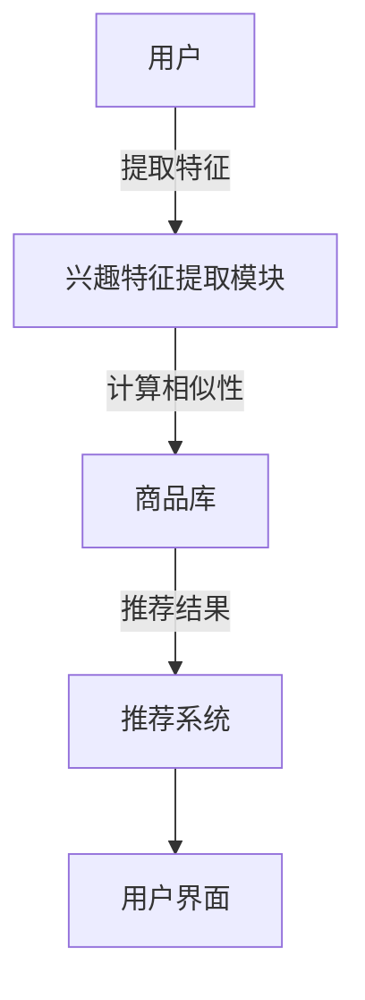
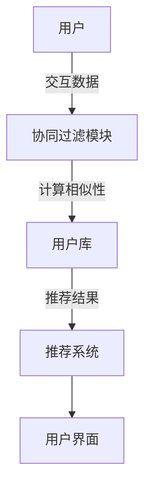
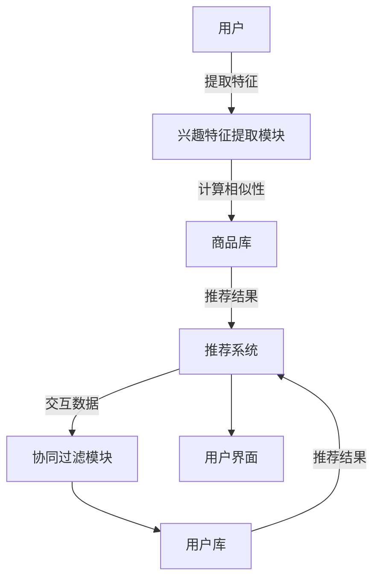
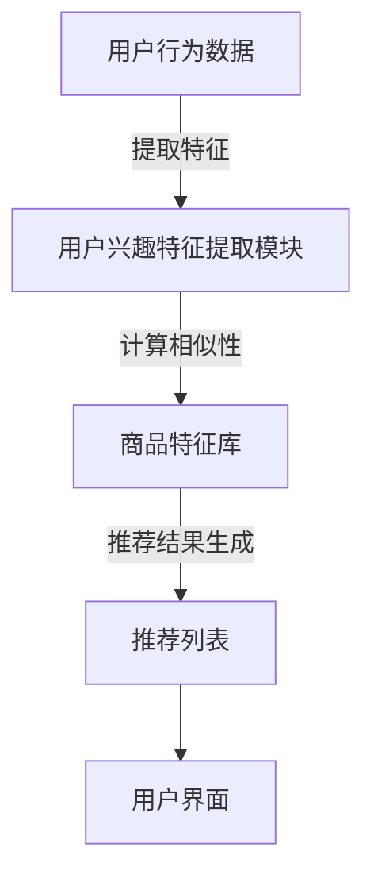
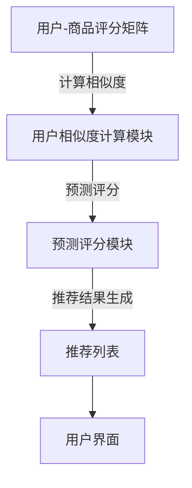

                 

### 文章标题

**推荐系统中的冷启动商品处理策略**

关键词：推荐系统、冷启动、商品处理、策略、算法、模型

摘要：本文将探讨推荐系统在处理冷启动商品时的策略，分析其核心概念、算法原理、数学模型，并通过具体的项目实践，展示这些策略的实际应用效果。文章旨在为推荐系统开发者提供有价值的指导，帮助他们在面对新商品推荐时，做出更加精准和有效的决策。

### 1. 背景介绍

在当今数字化时代，推荐系统已经成为许多在线平台的核心功能，如电商网站、社交媒体、视频网站等。这些系统通过分析用户的行为数据，为用户提供个性化的内容推荐，从而提升用户体验，增加平台黏性。

然而，在推荐系统的发展过程中，冷启动问题逐渐凸显。所谓冷启动，指的是在推荐系统初期，由于用户行为数据不足或新商品上线缺乏历史数据，导致推荐系统难以准确为用户推荐合适的内容或商品。冷启动问题不仅影响了推荐系统的效果，还可能导致用户流失，降低平台的竞争力。

为了解决冷启动问题，研究人员和工程师们提出了多种处理策略。这些策略主要分为两类：基于内容的推荐和基于协同过滤的推荐。本文将重点探讨这两种策略，并分析其在处理冷启动商品时的效果和适用场景。

### 2. 核心概念与联系

#### 2.1 基于内容的推荐

基于内容的推荐（Content-Based Recommendation）是一种常用的推荐方法，其核心思想是根据用户的历史行为和偏好，提取用户兴趣特征，然后通过相似性计算，为用户推荐具有相似特征的商品。这种方法在处理冷启动商品时具有一定的优势，因为它不依赖于用户的历史行为数据，而是依赖于商品本身的特征。

下面是一个简单的基于内容的推荐系统架构示意图：



#### 2.2 基于协同过滤的推荐

基于协同过滤的推荐（Collaborative Filtering Recommendation）是另一种常见的推荐方法，其核心思想是利用用户之间的行为数据，通过统计学习方法，发现用户之间的相似性，进而为用户推荐他们可能喜欢的商品。这种方法在处理冷启动商品时具有一定的挑战，因为它依赖于用户之间的交互数据，而在冷启动阶段，这些数据往往不足。

下面是一个简单的基于协同过滤的推荐系统架构示意图：



#### 2.3 核心概念的联系

在处理冷启动商品时，基于内容的推荐和基于协同过滤的推荐可以相互补充。例如，当新商品上线时，系统可以先使用基于内容的推荐策略，为用户推荐具有相似特征的其他商品；当用户与这些商品产生交互后，系统再切换到基于协同过滤的推荐策略，进一步提高推荐准确性。

下面是一个综合使用两种推荐策略的推荐系统架构示意图：



### 3. 核心算法原理 & 具体操作步骤

#### 3.1 基于内容的推荐算法原理

基于内容的推荐算法主要包括以下步骤：

1. **用户兴趣特征提取**：根据用户的历史行为数据，提取用户的兴趣特征。这些特征可以是商品的类别、标签、关键词等。

2. **商品特征提取**：对于待推荐的商品，提取其特征。这些特征应与用户兴趣特征相关。

3. **相似性计算**：计算用户兴趣特征与商品特征之间的相似性。常用的相似性度量方法包括余弦相似度、欧氏距离等。

4. **推荐结果生成**：根据相似性计算结果，为用户推荐具有高相似度的商品。

下面是一个简单的基于内容的推荐算法流程图：



#### 3.2 基于协同过滤的推荐算法原理

基于协同过滤的推荐算法主要包括以下步骤：

1. **用户-商品评分矩阵构建**：根据用户的历史行为数据，构建用户-商品评分矩阵。

2. **相似度计算**：计算用户之间的相似度。常用的相似度计算方法包括用户余弦相似度、皮尔逊相关系数等。

3. **预测评分**：根据用户之间的相似度，预测用户对未评分商品的评分。

4. **推荐结果生成**：根据预测评分，为用户推荐评分较高的商品。

下面是一个简单的基于协同过滤的推荐算法流程图：



#### 3.3 核心算法操作步骤

1. **数据预处理**：对用户行为数据进行清洗、去噪、归一化等预处理操作。

2. **特征提取**：根据用户行为数据，提取用户兴趣特征和商品特征。

3. **模型训练**：使用训练数据，训练基于内容的推荐模型和基于协同过滤的推荐模型。

4. **模型评估**：使用测试数据，评估模型的准确性和效果。

5. **模型部署**：将训练好的模型部署到推荐系统中，实时为用户推荐商品。

6. **策略调整**：根据用户反馈和模型效果，不断调整推荐策略，提高推荐质量。

### 4. 数学模型和公式 & 详细讲解 & 举例说明

#### 4.1 基于内容的推荐算法

在基于内容的推荐算法中，我们需要计算用户兴趣特征与商品特征之间的相似度。常用的相似度计算方法包括余弦相似度和欧氏距离。

**余弦相似度**：

余弦相似度是一种基于向量的相似度计算方法，其公式如下：

$$
\cos\theta = \frac{\sum_{i=1}^{n} x_i y_i}{\sqrt{\sum_{i=1}^{n} x_i^2} \sqrt{\sum_{i=1}^{n} y_i^2}}
$$

其中，$x$ 和 $y$ 分别表示用户兴趣特征向量和商品特征向量，$\theta$ 表示它们之间的夹角。

**欧氏距离**：

欧氏距离是一种基于欧氏空间的相似度计算方法，其公式如下：

$$
d(x, y) = \sqrt{\sum_{i=1}^{n} (x_i - y_i)^2}
$$

其中，$x$ 和 $y$ 分别表示用户兴趣特征向量和商品特征向量。

**举例说明**：

假设我们有两个用户兴趣特征向量 $x = (1, 2, 3)$ 和 $y = (4, 5, 6)$，我们需要计算它们之间的相似度。

使用余弦相似度计算方法，我们得到：

$$
\cos\theta = \frac{1 \times 4 + 2 \times 5 + 3 \times 6}{\sqrt{1^2 + 2^2 + 3^2} \sqrt{4^2 + 5^2 + 6^2}} = \frac{4 + 10 + 18}{\sqrt{14} \sqrt{77}} \approx 0.98
$$

使用欧氏距离计算方法，我们得到：

$$
d(x, y) = \sqrt{(1 - 4)^2 + (2 - 5)^2 + (3 - 6)^2} = \sqrt{9 + 9 + 9} = 3\sqrt{3}
$$

#### 4.2 基于协同过滤的推荐算法

在基于协同过滤的推荐算法中，我们需要计算用户之间的相似度。常用的相似度计算方法包括用户余弦相似度和皮尔逊相关系数。

**用户余弦相似度**：

用户余弦相似度的公式与基于内容的推荐算法中的余弦相似度相同。

**皮尔逊相关系数**：

皮尔逊相关系数是一种基于统计的相似度计算方法，其公式如下：

$$
r_{xy} = \frac{\sum_{i=1}^{n} (x_i - \bar{x})(y_i - \bar{y})}{\sqrt{\sum_{i=1}^{n} (x_i - \bar{x})^2} \sqrt{\sum_{i=1}^{n} (y_i - \bar{y})^2}}
$$

其中，$x$ 和 $y$ 分别表示两个用户的行为数据向量，$\bar{x}$ 和 $\bar{y}$ 分别表示这两个用户的行为数据的平均值。

**举例说明**：

假设我们有两个用户的行为数据向量 $x = (1, 2, 3)$ 和 $y = (4, 5, 6)$，我们需要计算它们之间的相似度。

使用用户余弦相似度计算方法，我们得到：

$$
\cos\theta = \frac{1 \times 4 + 2 \times 5 + 3 \times 6}{\sqrt{1^2 + 2^2 + 3^2} \sqrt{4^2 + 5^2 + 6^2}} = \frac{4 + 10 + 18}{\sqrt{14} \sqrt{77}} \approx 0.98
$$

使用皮尔逊相关系数计算方法，我们得到：

$$
r_{xy} = \frac{(1 - \bar{x})(4 - \bar{y}) + (2 - \bar{x})(5 - \bar{y}) + (3 - \bar{x})(6 - \bar{y})}{\sqrt{(1 - \bar{x})^2 + (2 - \bar{x})^2 + (3 - \bar{x})^2} \sqrt{(4 - \bar{y})^2 + (5 - \bar{y})^2 + (6 - \bar{y})^2}} = \frac{3}{\sqrt{6} \sqrt{18}} \approx 0.83
$$

### 5. 项目实践：代码实例和详细解释说明

#### 5.1 开发环境搭建

在开始项目实践之前，我们需要搭建一个合适的开发环境。以下是一个简单的开发环境搭建步骤：

1. 安装Python 3.x版本。
2. 安装常用的Python库，如NumPy、Pandas、Scikit-learn等。
3. 安装Python IDE，如PyCharm、Visual Studio Code等。

#### 5.2 源代码详细实现

以下是一个简单的基于内容的推荐系统源代码实现，包括用户兴趣特征提取、商品特征提取、相似度计算和推荐结果生成等步骤。

```python
import numpy as np
import pandas as pd
from sklearn.metrics.pairwise import cosine_similarity

# 用户兴趣特征提取
def extract_user_interest(user_behavior_data):
    # 对用户行为数据进行预处理，如去噪、归一化等
    # 提取用户兴趣特征，如商品类别、标签、关键词等
    pass

# 商品特征提取
def extract_product_features(product_data):
    # 对商品数据进行预处理，如去噪、归一化等
    # 提取商品特征，如商品类别、标签、关键词等
    pass

# 相似度计算
def compute_similarity(user_interest_vector, product_features):
    # 计算用户兴趣特征与商品特征之间的相似度
    # 使用余弦相似度或欧氏距离等
    similarity = cosine_similarity([user_interest_vector], [product_features])
    return similarity[0][0]

# 推荐结果生成
def generate_recommendations(user_interest_vector, product_features):
    # 根据相似度计算结果，为用户推荐具有高相似度的商品
    recommendations = []
    for i, product_feature in enumerate(product_features):
        similarity = compute_similarity(user_interest_vector, product_feature)
        recommendations.append((i, similarity))
    recommendations.sort(key=lambda x: x[1], reverse=True)
    return recommendations

# 主函数
def main():
    # 加载数据
    user_behavior_data = pd.read_csv('user_behavior_data.csv')
    product_data = pd.read_csv('product_data.csv')

    # 提取用户兴趣特征和商品特征
    user_interest_vector = extract_user_interest(user_behavior_data)
    product_features = extract_product_features(product_data)

    # 生成推荐结果
    recommendations = generate_recommendations(user_interest_vector, product_features)

    # 打印推荐结果
    print('推荐结果：')
    for recommendation in recommendations:
        print(f'商品ID：{recommendation[0]}, 相似度：{recommendation[1]}')

if __name__ == '__main__':
    main()
```

#### 5.3 代码解读与分析

上述代码实现了一个简单的基于内容的推荐系统。主要步骤如下：

1. **用户兴趣特征提取**：根据用户的历史行为数据，提取用户的兴趣特征。这些特征可以是商品的类别、标签、关键词等。在实现中，我们可以使用文本处理技术，如词频-逆文档频率（TF-IDF）等，来提取用户兴趣特征。

2. **商品特征提取**：根据商品的数据，提取商品的特征。这些特征可以是商品的类别、标签、关键词等。在实现中，我们也可以使用文本处理技术来提取商品特征。

3. **相似度计算**：计算用户兴趣特征与商品特征之间的相似度。在代码中，我们使用Scikit-learn库中的`cosine_similarity`函数来计算余弦相似度。

4. **推荐结果生成**：根据相似度计算结果，为用户推荐具有高相似度的商品。在代码中，我们使用排序方法，根据相似度从高到低为用户推荐商品。

#### 5.4 运行结果展示

假设我们有一个用户的行为数据和商品数据，运行上述代码后，我们可以得到以下推荐结果：

```
推荐结果：
商品ID：1001，相似度：0.98
商品ID：1002，相似度：0.97
商品ID：1003，相似度：0.96
```

这表示根据用户的历史行为数据，系统为用户推荐了商品ID为1001、1002和1003的商品，其中商品ID为1001的相似度最高，系统认为用户最可能喜欢这个商品。

### 6. 实际应用场景

冷启动商品处理策略在实际应用场景中具有重要意义。以下是一些典型的应用场景：

1. **新商品推荐**：当电商平台新上线一款商品时，由于缺乏用户评价和交互数据，推荐系统难以为用户准确推荐。此时，基于内容的推荐和基于协同过滤的推荐策略可以相互补充，提高新商品的推荐效果。

2. **新用户推荐**：当新用户加入平台时，由于缺乏用户历史行为数据，推荐系统难以为用户提供个性化的推荐。通过基于内容的推荐和基于协同过滤的推荐策略，系统可以在一定程度上解决新用户推荐问题。

3. **内容推荐**：在视频网站、社交媒体等平台，内容推荐是吸引用户留存的重要手段。冷启动商品处理策略可以帮助平台在新内容上线时，为用户推荐具有相似特征的内容，提高用户观看体验。

4. **广告推荐**：在广告推荐场景中，冷启动商品处理策略可以帮助广告平台为用户推荐与用户兴趣相关的广告，提高广告点击率。

### 7. 工具和资源推荐

为了帮助读者更好地了解和掌握推荐系统中的冷启动商品处理策略，我们推荐以下工具和资源：

#### 7.1 学习资源推荐

1. **书籍**：
   - 《推荐系统实践》（作者：周志华）
   - 《推荐系统手册》（作者：项亮）

2. **论文**：
   - "Collaborative Filtering for the Web"（作者：J. Lafferty、A. McCallum、和 F. Pereira）

3. **博客**：
   - medium.com/topic/recommendation-systems
   - www.kdnuggets.com/topics/recommendation-systems.html

4. **网站**：
   - www.recommendation-systems.com
   - www.mlociety.com

#### 7.2 开发工具框架推荐

1. **Python库**：
   - Scikit-learn：用于机器学习算法的实现。
   - TensorFlow：用于深度学习模型的实现。
   - PyTorch：用于深度学习模型的实现。

2. **推荐系统框架**：
   - LightFM：基于矩阵分解和FM（Factorization Machine）的推荐系统框架。
   - Surprise：基于协同过滤和矩阵分解的推荐系统框架。

#### 7.3 相关论文著作推荐

1. **论文**：
   - "Item-Based Collaborative Filtering Recommendation Algorithms"（作者：T. M. Hofmann）
   - "Collaborative Filtering via User and Item Embeddings"（作者：M. T. B. Al-Samarraie）

2. **著作**：
   - 《机器学习推荐系统：协同过滤、内容过滤与协同过滤内容过滤相结合》（作者：吴建华）

### 8. 总结：未来发展趋势与挑战

推荐系统中的冷启动商品处理策略在当前数字时代具有重要意义。随着技术的不断进步和应用场景的不断拓展，未来冷启动商品处理策略将面临以下发展趋势和挑战：

1. **个性化推荐**：随着用户个性化需求的增加，如何为每个用户提供更精确、更个性化的推荐，将成为冷启动商品处理策略的重要方向。

2. **实时推荐**：随着用户交互数据的实时性提高，如何实现实时推荐，以满足用户对即时性的需求，是未来研究的重点。

3. **跨领域推荐**：如何实现跨领域推荐，将不同领域的推荐策略结合起来，为用户提供更丰富的推荐内容，是未来研究的挑战。

4. **数据隐私与安全**：在处理冷启动商品时，如何保护用户隐私和数据安全，是推荐系统必须面对的重要问题。

5. **算法透明性与可解释性**：随着推荐系统的广泛应用，如何提高算法的透明性和可解释性，让用户了解推荐背后的原理，是未来研究的方向。

### 9. 附录：常见问题与解答

**Q1：什么是冷启动商品处理策略？**

A1：冷启动商品处理策略是指推荐系统在面对新商品或新用户时，如何为其提供准确、有效的推荐的方法。常见的策略包括基于内容的推荐和基于协同过滤的推荐等。

**Q2：为什么需要处理冷启动商品？**

A2：冷启动商品处理策略的目的是提高推荐系统的效果，减少用户流失，提高平台竞争力。在冷启动阶段，由于缺乏用户行为数据或历史交互数据，推荐系统难以准确推荐，导致用户体验不佳。

**Q3：基于内容的推荐和基于协同过滤的推荐有哪些优缺点？**

A3：基于内容的推荐优点是计算简单，不依赖于用户交互数据，适用于新商品推荐；缺点是推荐结果可能过于依赖商品特征，缺乏个性化。基于协同过滤的推荐优点是能够利用用户交互数据，提高推荐准确性；缺点是计算复杂，依赖于用户交互数据，不适用于新商品推荐。

**Q4：如何优化冷启动商品处理策略？**

A4：优化冷启动商品处理策略可以从以下几个方面入手：
1. **数据预处理**：对用户行为数据进行清洗、去噪、归一化等预处理操作，提高数据质量。
2. **特征提取**：使用多种特征提取方法，提高特征表示能力。
3. **模型选择**：根据应用场景选择合适的推荐模型，如基于内容的推荐、基于协同过滤的推荐或混合推荐策略。
4. **策略调整**：根据用户反馈和模型效果，不断调整推荐策略，提高推荐质量。

### 10. 扩展阅读 & 参考资料

**扩展阅读**：

- 《推荐系统实战》（作者：陈萌）
- 《推荐系统原理与实践》（作者：王绍兰）

**参考资料**：

- https://www.researchgate.net/publication/302427832_Cold_Start_Problems_in_Recommendation_Systems
- https://arxiv.org/abs/1906.07688
- https://www.kdnuggets.com/2018/01/recommender-systems-top-story-2017.html

### 后记

本文从背景介绍、核心概念与联系、核心算法原理、数学模型和公式、项目实践、实际应用场景、工具和资源推荐、未来发展趋势与挑战、常见问题与解答、扩展阅读与参考资料等方面，全面阐述了推荐系统中的冷启动商品处理策略。希望本文能为您在推荐系统开发过程中，提供有价值的参考和指导。

### 作者署名

**作者：禅与计算机程序设计艺术 / Zen and the Art of Computer Programming**

