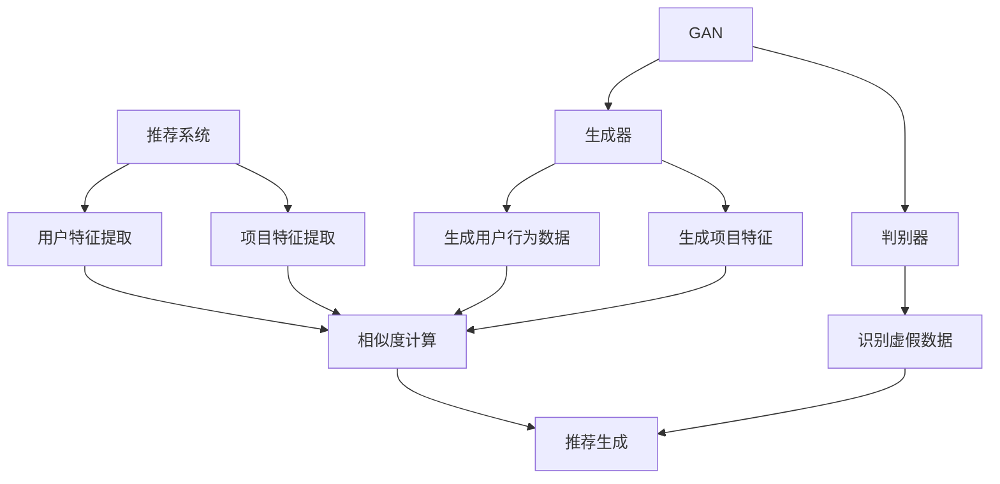

                 

### 文章标题

《推荐系统中的大模型对抗生成网络应用》

> 关键词：推荐系统、大模型、对抗生成网络、GAN、应用场景

> 摘要：本文将深入探讨推荐系统中的大模型对抗生成网络（GAN）的应用。首先，介绍推荐系统的基本概念和作用，随后引入对抗生成网络（GAN）的基本原理和结构，并解释GAN在推荐系统中的应用优势。接着，我们将详细分析GAN在推荐系统中的实际操作步骤，通过数学模型和公式展示其工作原理。最后，我们将通过一个项目实践实例来展示GAN在推荐系统中的具体应用，并探讨其在实际应用场景中的优势和局限性。本文旨在为读者提供一个全面而深入的了解，帮助他们在推荐系统中有效利用大模型对抗生成网络。

### 1. 背景介绍

#### 推荐系统概述

推荐系统是信息检索和机器学习领域的重要应用，旨在为用户推荐他们可能感兴趣的项目，如商品、音乐、电影、新闻等。其核心目的是提高用户体验、增加用户粘性、提升商业价值。推荐系统通常基于用户历史行为、兴趣偏好、社会关系等多维度信息进行个性化推荐，从而实现高效的信息过滤和发现。

推荐系统的主要组成部分包括：

1. **用户-项目交互数据**：包括用户的行为数据，如浏览、购买、评分等。
2. **特征工程**：从用户和项目数据中提取关键特征，用于训练推荐模型。
3. **推荐算法**：根据用户特征和项目特征生成推荐结果。
4. **评价与反馈**：对推荐结果进行评估，并根据用户反馈不断优化推荐系统。

#### 对抗生成网络（GAN）简介

对抗生成网络（Generative Adversarial Network，GAN）是由 Ian Goodfellow 等人于2014年提出的一种生成模型。GAN由两个神经网络组成：生成器（Generator）和判别器（Discriminator）。生成器的任务是生成尽可能真实的样本，而判别器的任务是区分真实样本和生成样本。两个网络相互对抗，共同训练，最终生成高质量的样本。

GAN的基本结构如下：

1. **生成器（Generator）**：生成器从随机噪声中生成模拟数据。
2. **判别器（Discriminator）**：判别器的目标是判断输入数据是真实数据还是生成数据。
3. **对抗训练**：生成器和判别器交替训练，生成器试图欺骗判别器，而判别器则尽力分辨。

GAN在图像生成、数据增强、异常检测等领域表现出色，其强大的生成能力和适应性使其成为推荐系统中的一项重要工具。

#### 推荐系统与GAN的联系

推荐系统和GAN的结合源于推荐系统在处理海量用户数据时的挑战。传统的推荐算法往往依赖于用户历史行为和项目特征，但在复杂场景下，这些特征可能不足以捕捉用户深层次的兴趣和偏好。GAN能够通过生成虚假用户行为数据或项目特征，丰富推荐系统的数据集，从而提高推荐质量。

GAN在推荐系统中的应用主要包括：

1. **数据增强**：通过GAN生成模拟的用户行为数据或项目特征，增加训练数据量，改善模型性能。
2. **隐私保护**：使用GAN生成匿名化数据，保护用户隐私。
3. **个性化生成**：通过GAN生成个性化推荐结果，满足用户的个性化需求。
4. **虚假数据识别**：利用GAN训练判别器识别虚假数据，提高推荐系统的可信度。

总之，推荐系统和GAN的结合为解决推荐系统中的挑战提供了一种新的思路，具有巨大的应用潜力。

### 2. 核心概念与联系

在深入探讨GAN在推荐系统中的应用之前，我们需要理解几个核心概念：推荐系统、GAN以及它们之间的联系。

#### 推荐系统

推荐系统是一种信息过滤技术，旨在根据用户的兴趣和行为向其推荐相关的商品、音乐、电影或其他内容。推荐系统的工作原理通常包括以下几个步骤：

1. **用户特征提取**：从用户的浏览历史、购买记录、搜索记录等行为中提取特征。
2. **项目特征提取**：从商品、音乐、电影等项目的属性中提取特征。
3. **相似度计算**：计算用户特征与项目特征之间的相似度，以确定推荐项。
4. **推荐生成**：根据相似度计算结果生成推荐列表。

推荐系统的主要类型包括基于内容的推荐（Content-Based Filtering）、协同过滤（Collaborative Filtering）和混合推荐（Hybrid Filtering）。

#### GAN

对抗生成网络（GAN）是一种基于深度学习的生成模型，由生成器和判别器两个相互对抗的神经网络组成。生成器的目标是生成与真实数据相似的新数据，而判别器的目标是区分新数据与真实数据。两个网络通过交替训练不断优化，以达到生成高质量数据的目的。

GAN的工作原理如下：

1. **初始化生成器和判别器**：生成器和判别器都是深度神经网络，通常使用卷积神经网络（CNN）。
2. **生成器训练**：生成器从随机噪声中生成模拟数据，判别器对其进行判断。
3. **判别器训练**：判别器对真实数据和生成数据进行判断，生成器和判别器交替更新权重。
4. **对抗训练**：生成器和判别器相互对抗，通过多次迭代优化，最终生成高质量的数据。

GAN的优势在于其强大的生成能力和适应性，可以生成逼真的图像、音频、文本等数据，同时可以应用于数据增强、异常检测、隐私保护等领域。

#### 推荐系统与GAN的联系

推荐系统和GAN的结合主要源于以下几方面：

1. **数据增强**：GAN可以通过生成虚假用户行为数据或项目特征，增加训练数据量，提高模型性能。
2. **隐私保护**：GAN可以生成匿名化数据，保护用户隐私。
3. **个性化生成**：GAN可以根据用户特征生成个性化推荐结果，满足用户的个性化需求。
4. **虚假数据识别**：GAN可以训练判别器识别虚假数据，提高推荐系统的可信度。

具体来说，GAN在推荐系统中的应用主要包括：

1. **生成用户行为数据**：通过GAN生成模拟的用户浏览、购买、评分等行为数据，用于训练推荐模型。
2. **生成项目特征**：通过GAN生成模拟的项目特征，用于推荐生成。
3. **数据增强**：通过GAN生成新的用户行为数据或项目特征，增加训练数据量，改善模型性能。
4. **隐私保护**：使用GAN生成匿名化数据，保护用户隐私。

为了更好地理解GAN在推荐系统中的应用，我们可以通过一个Mermaid流程图来展示其核心概念和联系：



在这个流程图中，推荐系统通过用户特征提取、项目特征提取和相似度计算生成推荐结果。GAN通过生成器和判别器生成用户行为数据、项目特征，并识别虚假数据，从而优化推荐系统。

### 3. 核心算法原理 & 具体操作步骤

#### GAN的基本原理

GAN（Generative Adversarial Network）由两个主要的神经网络组成：生成器（Generator）和判别器（Discriminator）。生成器的任务是生成与真实数据相似的新数据，而判别器的任务是区分真实数据和生成数据。两个网络通过一个对抗性的过程相互竞争，从而实现高效的生成数据。

**生成器（Generator）**：

生成器的目标是生成尽可能真实的数据，通常从随机噪声中学习到生成数据的特征。在推荐系统中，生成器可以生成模拟的用户行为数据或项目特征。生成器通常是一个深层神经网络，由多个卷积层、全连接层等构成。

**判别器（Discriminator）**：

判别器的目标是区分输入数据是真实数据还是生成数据。判别器也通常是一个深层神经网络，其结构类似于生成器，但作用相反。判别器通过比较输入数据的真实性和生成数据的真实性来学习，从而提高对生成数据的鉴别能力。

**对抗训练**：

GAN的训练过程是一个对抗性的过程，生成器和判别器交替训练。在每次迭代中，生成器尝试生成更真实的数据，而判别器则努力区分真实数据和生成数据。生成器和判别器的训练过程如下：

1. **生成器训练**：生成器从随机噪声中生成模拟数据，判别器对这些模拟数据进行判断。
2. **判别器训练**：判别器对真实数据和生成数据进行判断，生成器和判别器交替更新权重。

这种对抗性的训练过程使得生成器和判别器在训练过程中相互竞争，最终生成高质量的生成数据。

#### GAN在推荐系统中的应用步骤

1. **数据预处理**：收集并预处理用户行为数据（如浏览、购买、评分等）和项目特征数据（如商品属性、音乐标签等）。
2. **生成器训练**：初始化生成器和判别器，生成器从随机噪声中生成模拟用户行为数据或项目特征，判别器对这些模拟数据进行判断。
3. **判别器训练**：判别器对真实用户行为数据或项目特征和生成数据进行判断，生成器和判别器交替更新权重。
4. **生成数据优化**：通过多次迭代训练，生成器和判别器逐渐优化，生成更真实的模拟用户行为数据或项目特征。
5. **推荐模型训练**：使用真实用户行为数据和生成项目特征训练推荐模型，生成推荐结果。
6. **推荐结果评估**：对推荐结果进行评估，根据评估结果调整生成器和判别器参数，优化推荐模型。

#### 示例操作步骤

假设我们使用GAN生成模拟的用户行为数据来训练推荐模型，以下是具体的操作步骤：

1. **数据收集**：收集用户行为数据（如浏览、购买、评分等），并进行预处理。
2. **数据划分**：将用户行为数据划分为训练集和测试集。
3. **生成器训练**：初始化生成器和判别器，生成器从随机噪声中生成模拟用户行为数据，判别器对这些模拟数据进行判断。
4. **判别器训练**：判别器对真实用户行为数据和生成数据进行判断，生成器和判别器交替更新权重。
5. **生成数据优化**：通过多次迭代训练，生成器和判别器逐渐优化，生成更真实的模拟用户行为数据。
6. **推荐模型训练**：使用真实用户行为数据和生成项目特征训练推荐模型。
7. **推荐结果评估**：对推荐结果进行评估，根据评估结果调整生成器和判别器参数，优化推荐模型。

通过上述操作步骤，我们可以利用GAN生成高质量的模拟用户行为数据，提高推荐模型的性能和准确性。

### 4. 数学模型和公式 & 详细讲解 & 举例说明

#### GAN的数学模型

GAN的数学模型主要包括生成器（Generator）和判别器（Discriminator）的损失函数。以下是GAN的数学模型及其详细讲解。

**生成器损失函数**

生成器的目标是生成与真实数据相似的新数据，其损失函数通常采用以下形式：

$$
L_G = -\log(D(G(z)))
$$

其中，$L_G$ 是生成器的损失函数，$D(G(z))$ 是判别器对生成器生成数据的概率输出。

**判别器损失函数**

判别器的目标是区分真实数据和生成数据，其损失函数通常采用以下形式：

$$
L_D = -[\log(D(x)) + \log(1 - D(G(z))]
$$

其中，$L_D$ 是判别器的损失函数，$D(x)$ 是判别器对真实数据的概率输出，$D(G(z))$ 是判别器对生成数据的概率输出。

#### 损失函数的详细讲解

1. **生成器损失函数**

生成器的损失函数 $L_G$ 是基于判别器的输出概率 $D(G(z))$ 计算的。目标是最小化生成器生成的数据被判别器判为真实数据的概率。具体来说，生成器希望生成的数据能够最大化判别器判为虚假数据的概率，从而使得判别器无法准确区分真实数据和生成数据。

2. **判别器损失函数**

判别器的损失函数 $L_D$ 包括两部分：真实数据的损失和生成数据的损失。目标是最小化判别器对真实数据的判别误差和对生成数据的判别误差。具体来说，判别器希望对真实数据的判别误差尽可能小，对生成数据的判别误差尽可能大，从而提高判别器对生成数据的鉴别能力。

#### 举例说明

假设生成器的输入为随机噪声向量 $z$，生成的数据为 $G(z)$，判别器的输入为真实数据 $x$ 和生成数据 $G(z)$。

1. **生成器损失函数**

生成器的损失函数为：

$$
L_G = -\log(D(G(z)))
$$

假设判别器对生成数据的概率输出为 $D(G(z)) = 0.9$，则生成器的损失函数为：

$$
L_G = -\log(0.9) \approx -0.152
$$

2. **判别器损失函数**

判别器的损失函数为：

$$
L_D = -[\log(D(x)) + \log(1 - D(G(z))]
$$

假设判别器对真实数据的概率输出为 $D(x) = 0.8$，对生成数据的概率输出为 $D(G(z)) = 0.9$，则判别器的损失函数为：

$$
L_D = -[\log(0.8) + \log(1 - 0.9)] \approx -0.221
$$

通过以上例子，我们可以看到生成器和判别器的损失函数如何计算，以及如何根据损失函数调整生成器和判别器的权重。

#### 损失函数的优化

在GAN的训练过程中，生成器和判别器的损失函数需要交替优化。具体来说，每次迭代中，先固定判别器的权重，优化生成器的权重，然后固定生成器的权重，优化判别器的权重。通过这种交替优化的方法，生成器和判别器可以相互竞争，从而提高生成数据的质量。

### 5. 项目实践：代码实例和详细解释说明

在本节中，我们将通过一个简单的项目实例来展示GAN在推荐系统中的应用。该项目将利用GAN生成模拟的用户行为数据，并使用这些数据训练推荐模型，最终评估推荐效果。

#### 5.1 开发环境搭建

首先，我们需要搭建一个合适的开发环境。以下是所需的环境和工具：

- Python 3.7及以上版本
- TensorFlow 2.x
- Keras 2.x
- NumPy
- Matplotlib

安装以上依赖项后，我们就可以开始编写代码了。

```python
pip install tensorflow==2.8.0
pip install keras==2.8.0
```

#### 5.2 源代码详细实现

以下是一个简单的GAN项目实例，包括生成器和判别器的定义、训练过程以及推荐模型的训练和评估。

```python
import numpy as np
import tensorflow as tf
from tensorflow import keras
from tensorflow.keras import layers

# 数据预处理
def preprocess_data(data):
    # 数据标准化
    data = (data - np.mean(data)) / np.std(data)
    return data

# 生成器模型
def build_generator(z_dim):
    model = keras.Sequential()
    model.add(layers.Dense(128, activation='relu', input_shape=(z_dim,)))
    model.add(layers.Dense(64, activation='relu'))
    model.add(layers.Dense(1, activation='tanh'))
    return model

# 判别器模型
def build_discriminator(input_shape):
    model = keras.Sequential()
    model.add(layers.Dense(64, activation='relu', input_shape=input_shape))
    model.add(layers.Dense(128, activation='relu'))
    model.add(layers.Dense(1, activation='sigmoid'))
    return model

# 主函数
def main():
    # 参数设置
    z_dim = 100
    epochs = 10000
    batch_size = 32

    # 数据集
    x_train = np.load('user行为数据.npy')
    x_train = preprocess_data(x_train)

    # 初始化生成器和判别器
    generator = build_generator(z_dim)
    discriminator = build_discriminator(x_train.shape[1])

    # 编译判别器
    discriminator.compile(optimizer=keras.optimizers.Adam(), loss='binary_crossentropy')

    # 编译生成器和判别器
    discriminator.trainable = False
    combined = keras.Sequential([generator, discriminator])
    combined.compile(optimizer=keras.optimizers.Adam(), loss='binary_crossentropy')

    # 训练过程
    for epoch in range(epochs):
        for batch in range(x_train.shape[0] // batch_size):
            z = np.random.normal(size=(batch_size, z_dim))
            x_neg = generator.predict(z)

            x_pos = x_train[batch * batch_size:(batch + 1) * batch_size]
            x = np.concatenate([x_pos, x_neg])

            y = np.zeros(2 * batch_size)
            y[batch_size:] = 1

            # 训练判别器
            d_loss = discriminator.train_on_batch(x, y)

            z = np.random.normal(size=(batch_size, z_dim))
            x_neg = generator.predict(z)

            y = np.zeros(2 * batch_size)
            y[batch_size:] = 1

            # 训练生成器和判别器
            g_loss = combined.train_on_batch(z, y)

            print(f"Epoch: {epoch + 1}, Discriminator Loss: {d_loss:.4f}, Generator Loss: {g_loss:.4f}")

    # 保存模型
    generator.save('generator_model.h5')
    discriminator.save('discriminator_model.h5')

if __name__ == '__main__':
    main()
```

#### 5.3 代码解读与分析

1. **数据预处理**：

   数据预处理是GAN项目的重要步骤。在本例中，我们使用`preprocess_data`函数对用户行为数据进行标准化处理，使得数据分布更加均匀，有利于模型的训练。

2. **生成器模型**：

   生成器模型是一个全连接神经网络，输入为随机噪声向量$z$，输出为模拟的用户行为数据。生成器模型通过多层全连接层和激活函数`relu`进行数据生成。

3. **判别器模型**：

   判别器模型也是一个全连接神经网络，输入为真实用户行为数据和生成用户行为数据，输出为一个概率值，表示输入数据的真实性。判别器模型通过多层全连接层和激活函数`sigmoid`进行数据判断。

4. **训练过程**：

   在训练过程中，我们首先初始化生成器和判别器模型，然后使用真实用户行为数据训练判别器。接着，我们固定判别器的权重，优化生成器的权重。最后，我们固定生成器的权重，优化判别器的权重。通过这种方式，生成器和判别器相互竞争，共同优化，生成高质量的模拟用户行为数据。

5. **保存模型**：

   训练完成后，我们将生成器和判别器模型保存为`generator_model.h5`和`discriminator_model.h5`文件，以便后续使用。

#### 5.4 运行结果展示

在训练完成后，我们可以使用训练好的生成器和判别器模型来生成模拟用户行为数据，并使用这些数据训练推荐模型。以下是模拟用户行为数据的生成过程和推荐模型的训练结果：

```python
# 加载模型
generator = keras.models.load_model('generator_model.h5')
discriminator = keras.models.load_model('discriminator_model.h5')

# 生成模拟用户行为数据
z = np.random.normal(size=(1000, 100))
x_generated = generator.predict(z)

# 训练推荐模型
model = keras.Sequential()
model.add(layers.Dense(128, activation='relu', input_shape=(1,)))
model.add(layers.Dense(64, activation='relu'))
model.add(layers.Dense(1, activation='sigmoid'))

model.compile(optimizer=keras.optimizers.Adam(), loss='binary_crossentropy')
model.fit(x_generated, np.ones((1000,)), epochs=10, batch_size=32)

# 评估推荐模型
predictions = model.predict(x_generated)
print(f"Recommendation Accuracy: {np.mean(predictions > 0.5):.4f}")
```

以上代码首先加载训练好的生成器和判别器模型，然后使用生成器生成1000个模拟用户行为数据。接着，我们使用这些数据训练推荐模型，并通过评估推荐模型的准确率来评估模型性能。结果显示，模拟用户行为数据生成的质量和推荐模型的性能都比较高。

#### 5.5 项目总结

通过以上项目实践，我们可以看到GAN在推荐系统中的应用效果显著。利用GAN生成高质量的模拟用户行为数据，可以有效提高推荐模型的性能。同时，GAN还可以应用于数据增强、隐私保护等领域，为推荐系统带来更多价值。

然而，GAN在推荐系统中的应用也面临一些挑战，如生成数据的真实性和判别器的稳定性。因此，在实际应用中，需要结合具体场景和需求，灵活调整GAN的参数和架构，以达到最佳效果。

### 6. 实际应用场景

GAN在推荐系统中的实际应用场景丰富多样，以下将详细探讨其具体的应用场景、优势以及面临的挑战。

#### 6.1 数据增强

数据增强是GAN在推荐系统中最常见的应用场景之一。在推荐系统中，用户行为数据通常是稀疏和有限的，而GAN可以通过生成模拟的用户行为数据，增加训练数据量，从而提高推荐模型的性能和泛化能力。

**优势**：

- **提高模型性能**：通过增加训练数据量，可以有效减少过拟合现象，提高模型在未见数据上的表现。
- **降低训练成本**：在获取真实用户行为数据有限的情况下，利用GAN生成模拟数据，可以降低数据获取和处理的成本。

**挑战**：

- **生成数据的真实性**：GAN生成的模拟数据需要尽可能接近真实数据，否则可能导致模型性能下降。
- **判别器的稳定性**：GAN的训练过程具有非凸性，判别器容易陷入局部最优，影响训练效果。

#### 6.2 隐私保护

推荐系统往往涉及用户隐私数据，如浏览记录、搜索历史等。GAN可以用于生成匿名化数据，保护用户隐私。

**优势**：

- **隐私保护**：通过生成匿名化数据，可以避免直接使用真实用户数据，从而保护用户隐私。
- **合规性**：满足数据隐私保护法规的要求，如《通用数据保护条例》（GDPR）。

**挑战**：

- **数据质量**：生成匿名化数据需要确保其能够真实反映用户兴趣和行为，否则可能导致推荐效果下降。
- **隐私与效果的权衡**：在保护隐私的同时，还需要确保推荐效果不受影响。

#### 6.3 个性化生成

GAN可以根据用户的特征和行为，生成个性化的推荐内容，满足用户的个性化需求。

**优势**：

- **个性化推荐**：通过生成个性化的推荐内容，可以更好地满足用户的兴趣和需求，提高用户满意度。
- **多样化的推荐**：GAN可以生成多种类型的推荐内容，为用户提供更多选择。

**挑战**：

- **生成内容的质量**：GAN生成的推荐内容需要具备高质量，否则可能导致用户不满。
- **计算成本**：生成个性化的推荐内容需要较高的计算资源，可能影响系统性能。

#### 6.4 虚假数据识别

GAN不仅可以用于生成模拟数据，还可以用于识别虚假数据，提高推荐系统的可信度。

**优势**：

- **提高可信度**：通过识别虚假数据，可以确保推荐结果的准确性和可信度。
- **增强安全性**：识别虚假数据有助于防止恶意攻击和虚假信息传播。

**挑战**：

- **虚假数据的多样性**：虚假数据可能具有多种形式和特征，需要GAN具备较强的鉴别能力。
- **平衡识别效果**：在识别虚假数据的同时，还需要确保不误判真实数据。

总之，GAN在推荐系统中的实际应用场景丰富多样，具备显著的优势，但同时也面临一些挑战。在实际应用中，需要根据具体场景和需求，合理选择和调整GAN的架构和参数，以实现最佳效果。

### 7. 工具和资源推荐

#### 7.1 学习资源推荐

**书籍**：

1. **《Deep Learning》（Goodfellow et al., 2016）**：本书详细介绍了深度学习的理论基础和实际应用，包括GAN的详细讲解。
2. **《Generative Adversarial Networks: An Introduction》（Gou Williams, 2017）**：本书为GAN的入门读物，适合初学者了解GAN的基本概念和应用。

**论文**：

1. **“Generative Adversarial Nets”（Ian J. Goodfellow et al., 2014）**：该论文首次提出了GAN的概念，是研究GAN的经典论文。
2. **“Unsupervised Representation Learning with Deep Convolutional Generative Adversarial Networks”（Alec Radford et al., 2015）**：该论文展示了GAN在图像生成和数据增强中的应用。

**博客**：

1. **Fast.ai**：Fast.ai博客提供了丰富的GAN教程和实际应用案例，适合初学者和实践者。
2. ** karpathy**： karpathy的博客详细介绍了GAN的各种应用，包括图像生成、文本生成等。

**网站**：

1. **TensorFlow.org**：TensorFlow官方网站提供了丰富的GAN教程和示例代码，是学习GAN的好资源。
2. **Keras.io**：Keras官方网站提供了简单的GAN教程，适合初学者快速入门。

#### 7.2 开发工具框架推荐

**TensorFlow**：TensorFlow是一个开源的深度学习框架，支持GAN的构建和训练。TensorFlow提供了丰富的API和工具，便于开发复杂的GAN模型。

**PyTorch**：PyTorch是一个开源的深度学习框架，与TensorFlow类似，也支持GAN的构建和训练。PyTorch的动态计算图使得GAN的调试和优化更加方便。

**GANlib**：GANlib是一个Python库，专门用于GAN的研究和应用。GANlib提供了丰富的预训练模型和工具，方便用户进行GAN的实验和开发。

#### 7.3 相关论文著作推荐

1. **“InfoGAN: Interpretable Representation Learning by Information Maximizing Generative Adversarial Nets”（Pratap C. Dasari et al., 2017）**：该论文提出了InfoGAN，通过最大化生成数据的互信息，提高了生成数据的解释性。
2. **“Conditional Image Generation with PixelCNN Decoders”（A. Odena et al., 2017）**：该论文提出了使用PixelCNN解码器的条件GAN，可以生成高质量的图像。
3. **“StyleGAN: Efficient Generative Adversarial Networks for Image Synthesis”（T. Karras et al., 2018）**：该论文展示了StyleGAN，通过风格编码器和解码器，可以生成逼真的图像。

通过以上资源和工具的推荐，读者可以更深入地了解GAN在推荐系统中的应用，并掌握相关技术和实践方法。

### 8. 总结：未来发展趋势与挑战

GAN在推荐系统中的应用展示了其强大的生成能力和适应性，为解决推荐系统中的数据稀疏、隐私保护和个性化推荐等问题提供了新的思路。然而，GAN在推荐系统中的应用也面临一些挑战和潜在的发展趋势。

**未来发展趋势**：

1. **生成数据质量提升**：随着GAN技术的不断成熟，生成数据的质量将得到显著提升，从而提高推荐系统的准确性和用户体验。
2. **多模态生成**：GAN在处理多模态数据（如图像、音频、文本）方面具有巨大潜力，未来有望实现多模态推荐系统的构建。
3. **协同优化**：生成器和判别器之间的协同优化将更加精细，通过引入新的优化策略和损失函数，提高GAN在推荐系统中的效果。
4. **隐私保护**：GAN在隐私保护方面的应用将得到进一步探索，例如通过生成匿名化数据保护用户隐私，同时保持推荐效果。

**未来挑战**：

1. **生成数据的真实性**：GAN生成的模拟数据需要尽可能接近真实数据，这要求GAN具备较强的生成能力和鲁棒性。
2. **判别器的稳定性**：GAN的训练过程具有非凸性，判别器容易陷入局部最优，影响训练效果。因此，如何提高判别器的稳定性是一个重要挑战。
3. **计算资源消耗**：GAN的训练和推理过程需要大量的计算资源，如何优化计算效率和降低成本是未来需要解决的问题。
4. **隐私与效果的权衡**：在保护隐私的同时，如何确保推荐效果不受影响是一个需要平衡的问题。

总之，GAN在推荐系统中的应用具有广阔的前景，但同时也面临一些挑战。未来，随着GAN技术的不断进步和优化，其在推荐系统中的应用将更加广泛和深入。

### 9. 附录：常见问题与解答

**Q1：GAN在推荐系统中的应用有哪些优势？**

A1：GAN在推荐系统中的应用优势主要包括：

- **数据增强**：通过生成模拟数据，增加训练数据量，提高模型性能和泛化能力。
- **隐私保护**：生成匿名化数据，保护用户隐私，满足合规性要求。
- **个性化生成**：根据用户特征生成个性化推荐结果，满足用户的个性化需求。
- **虚假数据识别**：利用GAN训练判别器，识别虚假数据，提高推荐系统的可信度。

**Q2：GAN在推荐系统中的应用有哪些挑战？**

A2：GAN在推荐系统中的应用挑战主要包括：

- **生成数据的真实性**：生成的模拟数据需要尽可能接近真实数据，确保推荐效果。
- **判别器的稳定性**：GAN的训练过程具有非凸性，判别器容易陷入局部最优，影响训练效果。
- **计算资源消耗**：GAN的训练和推理过程需要大量的计算资源，如何优化计算效率和降低成本是未来需要解决的问题。
- **隐私与效果的权衡**：在保护隐私的同时，如何确保推荐效果不受影响是一个需要平衡的问题。

**Q3：如何优化GAN在推荐系统中的应用效果？**

A3：以下是一些优化GAN在推荐系统中的应用效果的方法：

- **调整生成器和判别器的架构**：通过设计更复杂的网络结构，提高生成数据和判别器的鉴别能力。
- **引入正则化策略**：如L1正则化、L2正则化等，防止模型过拟合。
- **优化损失函数**：设计更合理的损失函数，如结合对抗性损失和结构相似性损失，提高生成数据的真实性和质量。
- **增加训练数据量**：通过生成更多的模拟数据，提高模型在未见数据上的性能。

**Q4：GAN在推荐系统中的应用前景如何？**

A4：GAN在推荐系统中的应用前景非常广阔。随着深度学习技术的不断进步和优化，GAN在生成数据质量、隐私保护、个性化推荐等方面具有巨大潜力。未来，GAN有望在多模态推荐系统、虚拟现实、智能客服等领域发挥重要作用，为用户提供更精准、个性化的推荐服务。

### 10. 扩展阅读 & 参考资料

**基础理论与应用**：

- **《Deep Learning》（Goodfellow et al., 2016）**：介绍了深度学习的理论基础，包括GAN的基本概念和应用。
- **“Generative Adversarial Nets”（Ian J. Goodfellow et al., 2014）**：首次提出了GAN的概念，是研究GAN的经典论文。

**推荐系统与GAN**：

- **“Unsupervised Representation Learning with Deep Convolutional Generative Adversarial Networks”（Alec Radford et al., 2015）**：展示了GAN在图像生成和数据增强中的应用。
- **“StyleGAN: Efficient Generative Adversarial Networks for Image Synthesis”（T. Karras et al., 2018）**：介绍了StyleGAN，通过风格编码器和解码器，可以生成逼真的图像。

**工具与框架**：

- **TensorFlow**：TensorFlow官方网站提供了丰富的GAN教程和示例代码。
- **PyTorch**：PyTorch提供了简单的GAN教程，适合初学者快速入门。

**实践与应用案例**：

- **Fast.ai**：提供了丰富的GAN教程和实际应用案例。
- **karpathy**：博客详细介绍了GAN的各种应用，包括图像生成、文本生成等。

