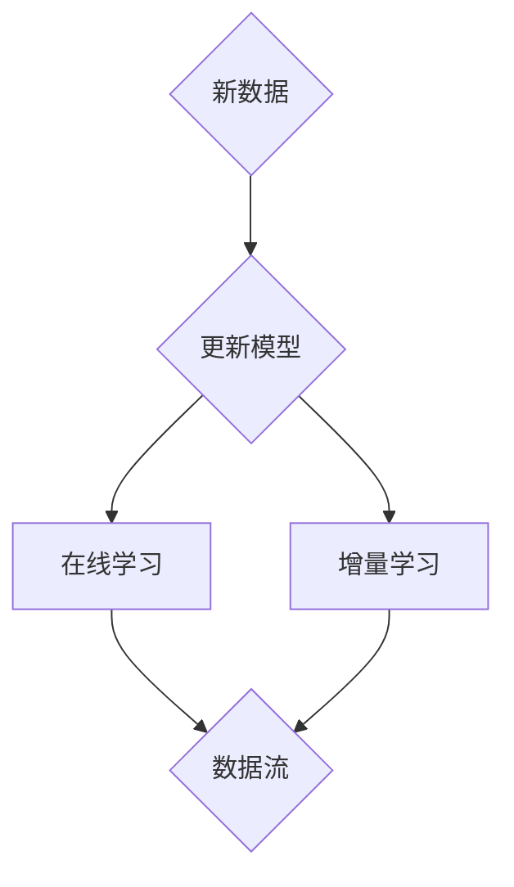
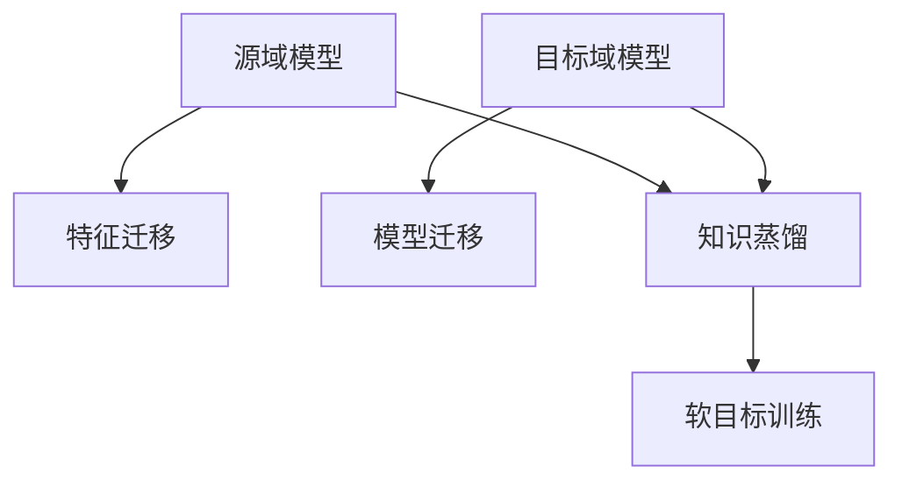
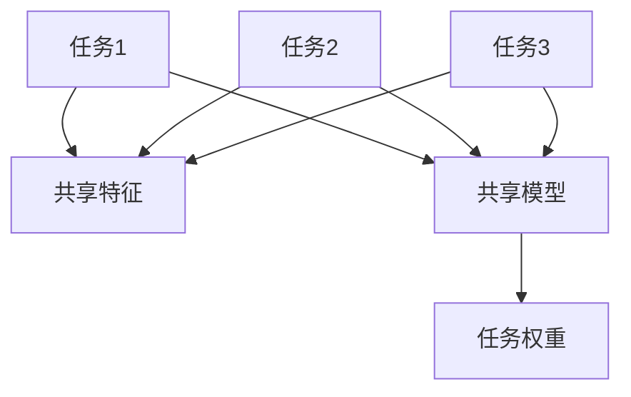
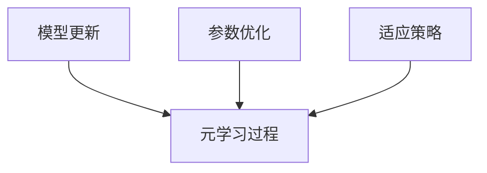

                 

### 1. 背景介绍

推荐系统是当今互联网应用中不可或缺的一部分，它们广泛应用于电子商务、社交媒体、视频流媒体、新闻推荐等多个领域。随着大数据和机器学习技术的发展，推荐系统的性能和效果不断提高，已经成为提升用户体验、增加用户粘性、提高商业收益的关键因素。

然而，推荐系统面临着诸多挑战。首先，用户行为数据具有高度动态性和多样性，这要求推荐系统能够快速适应环境变化。其次，用户兴趣和偏好可能随着时间的推移而发生变化，传统的推荐算法难以捕捉到这种长期学习需求。最后，推荐系统的数据规模和复杂性不断增加，如何在有限的计算资源和时间内实现高效的模型训练和更新成为一大难题。

为了应对上述挑战，近年来，大模型终身学习（Lifelong Learning with Large Models）技术逐渐成为研究热点。大模型终身学习旨在使推荐系统具备持续学习的能力，能够在不断变化的数据环境中动态调整模型参数，从而实现更好的推荐效果。本文将深入探讨大模型终身学习在推荐系统中的应用，解析其核心算法原理、实现步骤，并展示实际应用场景和工具推荐。

在本文中，我们将依次介绍以下内容：

1. **背景介绍**：回顾推荐系统的发展历程，分析其面临的挑战。
2. **核心概念与联系**：详细阐述大模型终身学习的概念，提供 Mermaid 流程图展示其架构。
3. **核心算法原理与具体操作步骤**：深入剖析大模型终身学习算法的工作机制。
4. **数学模型和公式**：介绍相关数学模型，并提供详细讲解和举例说明。
5. **项目实践**：通过代码实例展示大模型终身学习在推荐系统中的实际应用。
6. **实际应用场景**：探讨大模型终身学习在不同领域的应用。
7. **工具和资源推荐**：推荐学习资源、开发工具和框架。
8. **总结**：总结大模型终身学习的发展趋势与挑战。
9. **附录**：回答常见问题，提供扩展阅读和参考资料。

让我们从推荐系统的发展历程开始，逐步深入探讨大模型终身学习在推荐系统中的应用。

### 1.1 推荐系统的发展历程

推荐系统最早可以追溯到20世纪90年代，随着互联网的普及和电子商务的兴起，个性化推荐逐渐成为人们获取信息、选择商品的重要工具。早期的推荐系统主要基于用户的历史行为数据，如浏览记录、购买记录等，采用简单的统计方法进行推荐，如协同过滤（Collaborative Filtering）和基于内容的推荐（Content-Based Recommendation）。

**协同过滤**是一种通过计算用户之间的相似度来进行推荐的算法。其基本思想是，如果两个用户在某一商品的评分上相似，那么他们可能在其他商品上也会有相似的喜好。协同过滤又可分为用户基于的协同过滤（User-Based）和物品基于的协同过滤（Item-Based）。用户基于的协同过滤通过计算用户之间的相似度，找到相似用户，然后推荐这些用户喜欢的商品。而物品基于的协同过滤则通过计算商品之间的相似度，为用户推荐他们可能喜欢的其他商品。

**基于内容的推荐**则依赖于物品的特征信息，如商品的标签、分类、用户对商品的评分等。其基本思想是，为用户推荐与用户过去喜欢的商品内容相似的物品。基于内容的推荐算法通常使用文本相似度、向量空间模型等方法来计算物品之间的相似度。

随着互联网数据的爆炸式增长，推荐系统开始面临数据稀疏、冷启动、多样性等问题。为了解决这些问题，研究者们提出了多种改进算法，如矩阵分解（Matrix Factorization）、基于模型的推荐（Model-Based Recommendation）等。

**矩阵分解**是一种将用户-物品评分矩阵分解为低维矩阵的算法，通过低维矩阵的交互来预测用户对未知物品的评分。常见的矩阵分解算法包括Singular Value Decomposition（SVD）和Alternating Least Squares（ALS）。

**基于模型的推荐**则通过构建用户和物品之间的潜在特征空间，将推荐问题转化为特征空间的相似度计算。常见的模型包括隐语义模型（Latent Semantic Analysis, LSA）、潜在因子模型（Latent Factor Model）和深度学习模型等。

**深度学习模型**在推荐系统中的应用越来越广泛，如神经网络协同过滤（Neural Collaborative Filtering, NCF）、基于图神经网络的推荐（Graph Neural Networks, GNN）等。深度学习模型能够更好地捕捉用户行为和物品特征之间的复杂关系，从而提高推荐效果。

然而，传统的推荐系统在处理动态数据和环境变化时仍然存在诸多挑战。为了解决这些问题，大模型终身学习技术应运而生，成为推荐系统领域的研究热点。

### 1.2 大模型终身学习的概念

大模型终身学习（Lifelong Learning with Large Models）是一种旨在使推荐系统具备持续学习能力的理论和方法。其核心思想是，在推荐系统持续运行的过程中，不断更新和优化模型，以适应不断变化的数据和环境。大模型终身学习通过结合深度学习和迁移学习等技术，实现推荐系统的自适应性和长期学习效果。

**深度学习**是一种基于多层神经网络进行特征学习和模式识别的人工智能方法。深度学习模型具有强大的表达能力和泛化能力，能够从大量数据中自动提取高层次的抽象特征。在大模型终身学习中，深度学习模型被广泛应用于用户行为预测、物品特征表示等领域。

**迁移学习**是一种将已在不同任务上训练好的模型知识迁移到新任务上的方法。通过迁移学习，推荐系统可以在有限的训练数据下，利用已有模型的知识提高新任务的性能。在大模型终身学习中，迁移学习有助于解决数据稀疏和冷启动问题，提高模型的泛化能力。

大模型终身学习的关键技术包括：

1. **模型更新**：通过在线学习（Online Learning）和增量学习（Incremental Learning）技术，动态更新模型参数，以适应新数据和环境。
2. **知识蒸馏**：将大型深度学习模型的知识传递给较小的模型，以降低计算成本和提高模型效率。
3. **多任务学习**：通过同时训练多个相关任务，提高模型对多样化数据的适应能力。
4. **元学习**：通过元学习算法，自动调整模型参数，以实现高效的学习和适应。

大模型终身学习的目标是，在保证推荐效果的同时，提高模型的鲁棒性和适应性，使其能够长期稳定地运行，从而为用户提供更好的个性化推荐服务。

### 1.3 大模型终身学习在推荐系统中的应用

大模型终身学习在推荐系统中的应用具有显著的优势，能够有效解决传统推荐系统面临的诸多挑战。

首先，大模型终身学习能够更好地捕捉用户行为的长期变化。传统推荐系统通常基于用户的历史行为数据进行建模，但这些数据往往难以反映用户当前的兴趣和需求。而大模型终身学习通过不断更新模型参数，能够动态捕捉用户行为的短期变化，从而提供更个性化的推荐。

其次，大模型终身学习能够提高推荐系统的鲁棒性。在推荐系统中，数据质量和噪声可能会对推荐效果产生负面影响。大模型终身学习通过迁移学习和元学习等技术，能够从已有模型中提取有效知识，减少数据噪声对模型性能的影响，从而提高推荐的准确性。

第三，大模型终身学习能够适应多种应用场景。传统推荐系统通常针对特定应用场景进行优化，而大模型终身学习通过灵活的模型更新和知识蒸馏技术，能够适应不同的应用场景，如电子商务、社交媒体、视频流媒体等，从而实现更广泛的应用。

在实际应用中，大模型终身学习已经取得了显著成果。例如，在电子商务领域，基于大模型终身学习的推荐系统能够更好地预测用户的购买行为，提高转化率和用户满意度。在社交媒体领域，大模型终身学习能够更好地捕捉用户的兴趣变化，提供个性化的内容推荐，从而增加用户粘性和活跃度。在视频流媒体领域，大模型终身学习能够提高视频推荐的准确性和多样性，使用户获得更好的观看体验。

总之，大模型终身学习为推荐系统带来了全新的技术手段和解决方案，使得推荐系统能够在动态、多变的环境中实现更好的性能和效果。随着深度学习和迁移学习等技术的不断发展，大模型终身学习在推荐系统中的应用前景将更加广阔。

### 1.4 推荐系统面临的挑战

尽管推荐系统在互联网应用中取得了显著成就，但其发展过程中仍面临诸多挑战。这些挑战主要源于数据复杂性、用户行为多样性、算法可解释性以及模型鲁棒性等方面的问题。

首先，**数据复杂性**是推荐系统面临的一大挑战。随着互联网数据的爆炸式增长，推荐系统需要处理海量用户行为数据、物品特征数据以及外部环境数据。这些数据不仅量大，而且结构复杂，包含多种类型的信息，如文本、图像、音频等。如何有效地整合和处理这些复杂的数据，成为推荐系统研究和应用的关键问题。

其次，**用户行为多样性**给推荐系统带来了巨大的挑战。用户的兴趣和行为习惯是动态变化的，不同用户之间也存在显著差异。传统推荐系统通常基于用户的历史行为数据进行建模，但这种方法难以捕捉用户当前的兴趣和需求。例如，用户可能在一段时间内对某种类型的商品或内容感兴趣，但在另一段时间内兴趣发生变化。如何设计能够适应用户多样化行为的推荐算法，是推荐系统面临的一大难题。

**算法可解释性**也是推荐系统需要解决的重要问题。随着深度学习等复杂算法在推荐系统中的应用，推荐系统的性能得到了显著提升。然而，这些复杂算法通常难以解释其内部决策过程，导致用户对推荐结果的不信任。例如，用户可能不清楚推荐系统为什么推荐了某件商品或某种内容，这种缺乏透明度的推荐结果可能会影响用户对系统的接受度和使用意愿。因此，如何提高算法的可解释性，使其能够更好地解释推荐决策，成为推荐系统研究的重要方向。

最后，**模型鲁棒性**是推荐系统面临的关键挑战之一。在推荐系统中，模型需要处理大量噪声数据和异常值，如虚假评论、恶意攻击等。这些噪声数据和异常值可能会对模型的预测结果产生负面影响，降低推荐系统的性能。例如，虚假评论可能会导致推荐系统推荐错误的商品或内容，影响用户的购物体验。因此，如何提高模型的鲁棒性，使其能够有效抵抗噪声数据和异常值的影响，是推荐系统需要解决的重要问题。

综上所述，推荐系统在发展过程中面临数据复杂性、用户行为多样性、算法可解释性和模型鲁棒性等多方面的挑战。为了应对这些挑战，研究者们需要不断创新和优化推荐算法，以实现更高效、更可靠的推荐系统。

### 1.5 大模型终身学习的技术框架

大模型终身学习（Lifelong Learning with Large Models）的技术框架主要包括以下几个方面：模型更新机制、迁移学习策略、多任务学习方法和元学习算法。下面我们将逐一介绍这些关键技术，并通过Mermaid流程图展示其架构。

#### 1.5.1 模型更新机制

模型更新机制是实现大模型终身学习的基础。它通过在线学习（Online Learning）和增量学习（Incremental Learning）技术，动态更新模型参数，以适应新数据和环境。

**在线学习**是指在数据流中实时更新模型参数，使模型能够实时适应环境变化。在线学习的关键在于如何高效地处理大规模数据流，并保证模型参数的稳定性。常见的在线学习算法包括梯度下降（Gradient Descent）及其变种，如随机梯度下降（Stochastic Gradient Descent, SGD）和小批量梯度下降（Mini-batch Gradient Descent）。

**增量学习**则是在已有模型基础上，通过学习新数据对模型进行增量更新。增量学习能够减少模型训练的时间和计算资源消耗，提高模型的更新效率。常见的增量学习算法包括在线增量学习（Online Incremental Learning）和批量增量学习（Batch Incremental Learning）。

Mermaid流程图如下：

#### 1.5.2 迁移学习策略

迁移学习（Transfer Learning）是将一个任务在源域（Source Domain）上学习到的知识迁移到另一个任务的目标域（Target Domain）上的方法。在推荐系统中，迁移学习可以帮助解决数据稀疏和冷启动问题，提高模型在未知数据上的性能。

迁移学习的关键在于如何有效地整合源域和目标域的知识。常见的迁移学习策略包括特征迁移、模型迁移和知识蒸馏（Knowledge Distillation）。

**特征迁移**是指在源域和目标域之间共享特征表示，通过学习共享的特征空间来实现迁移。特征迁移可以通过对源域和目标域的数据进行联合训练，或者使用预训练的特征表示进行迁移。

**模型迁移**是指将源域上的模型直接迁移到目标域上。模型迁移的关键是如何解决源域和目标域之间的分布差异。常见的方法包括模型适配（Model Adaptation）和模型融合（Model Fusion）。

**知识蒸馏**是指将大型深度学习模型的知识传递给较小的模型，以降低计算成本和提高模型效率。知识蒸馏通过软目标（Soft Target）训练，将大型模型的输出作为小模型的训练目标，从而实现知识的迁移。

Mermaid流程图如下：

#### 1.5.3 多任务学习方法

多任务学习（Multi-task Learning）是一种同时训练多个相关任务的方法，通过共享模型参数，提高模型对多样化数据的适应能力。在推荐系统中，多任务学习可以同时处理用户行为预测、物品特征提取和推荐排序等多个任务。

多任务学习方法的关键在于如何设计共享模型参数，以实现任务之间的有效共享。常见的多任务学习策略包括基于特征共享（Feature Sharing）、基于模型共享（Model Sharing）和基于任务权重（Task Weighting）。

**基于特征共享**是指在多个任务之间共享特征表示，通过学习共享的特征空间来实现多任务学习。基于特征共享的方法可以有效地整合不同任务之间的信息，提高模型对多样化数据的适应能力。

**基于模型共享**是指多个任务使用相同的模型结构，通过调整模型参数来适应不同任务。基于模型共享的方法可以减少模型参数的数量，降低计算成本。

**基于任务权重**是指为每个任务分配不同的权重，通过加权融合任务损失函数来实现多任务学习。基于任务权重的策略可以根据任务的重要性和数据量来动态调整模型参数，从而提高整体模型性能。

Mermaid流程图如下：

#### 1.5.4 元学习算法

元学习（Meta-Learning）是一种通过学习如何学习的方法，旨在提高模型在未知任务上的学习效率。在推荐系统中，元学习可以加速模型在新数据和环境下的适应过程。

元学习算法的核心思想是通过元学习过程（Meta-Learning Process）来优化模型参数，使其在短时间内学会新的任务。常见的元学习算法包括模型更新（Model Updating）、参数优化（Parameter Optimization）和适应策略（Adaptation Strategy）。

**模型更新**是指通过调整模型参数，使其在新任务上获得更好的性能。模型更新可以通过在线学习、增量学习和迁移学习等技术来实现。

**参数优化**是指通过优化模型参数，提高模型在不同任务上的泛化能力。参数优化可以使用基于梯度的优化算法（如梯度下降）或基于模型的优化算法（如遗传算法）。

**适应策略**是指设计适应不同任务和环境的学习策略，以实现高效的模型更新和参数优化。适应策略可以根据任务特征和环境变化动态调整，从而提高模型适应能力。

Mermaid流程图如下：

通过上述技术框架，大模型终身学习能够有效解决推荐系统在数据复杂性、用户行为多样性、算法可解释性和模型鲁棒性等方面面临的挑战。随着深度学习和迁移学习等技术的不断发展，大模型终身学习在推荐系统中的应用前景将更加广阔。

### 1.6 大模型终身学习的基本原理

大模型终身学习（Lifelong Learning with Large Models）的基本原理主要涉及深度学习、迁移学习和多任务学习等核心技术，这些技术协同工作，使得推荐系统具备持续学习、适应变化和提升性能的能力。

#### 1.6.1 深度学习

深度学习（Deep Learning）是人工智能领域的一个重要分支，其核心思想是模拟人脑神经元之间的连接结构，通过多层的神经网络来处理复杂数据和任务。深度学习模型具有强大的特征提取和模式识别能力，能够从海量数据中自动学习到高层次的特征表示。

在推荐系统中，深度学习模型被广泛应用于用户行为预测、物品特征表示和推荐排序等领域。具体来说，深度学习模型可以通过以下几个步骤实现终身学习：

1. **数据预处理**：对用户行为数据和物品特征数据进行预处理，包括数据清洗、数据归一化和特征提取等，以便为深度学习模型提供高质量的数据输入。
2. **模型构建**：设计并构建多层神经网络结构，如卷积神经网络（CNN）、循环神经网络（RNN）和变换器（Transformer）等，以适应不同推荐任务的特性。
3. **训练与优化**：使用训练数据对深度学习模型进行训练，并通过反向传播算法优化模型参数，使其在训练数据上获得良好的性能。
4. **模型更新**：在模型训练过程中，通过在线学习（Online Learning）或增量学习（Incremental Learning）技术，动态更新模型参数，以适应新数据和环境变化。

#### 1.6.2 迁移学习

迁移学习（Transfer Learning）是一种通过利用已有任务的知识来提升新任务性能的方法。在推荐系统中，迁移学习可以帮助解决数据稀疏和冷启动问题，提高模型在新任务上的泛化能力。

迁移学习的基本原理如下：

1. **源域和目标域**：将已有任务称为源域（Source Domain），将新任务称为目标域（Target Domain）。源域和目标域可能具有不同的数据分布和任务目标。
2. **知识迁移**：通过将源域上的知识（如模型参数、特征表示等）迁移到目标域，帮助目标域上的模型更快地适应新任务。
3. **适应策略**：在迁移知识的基础上，根据目标域的特点和需求，对模型进行调整和优化，以提高其在目标域上的性能。

常见的迁移学习策略包括：

- **特征迁移**：通过在源域和目标域之间共享特征表示，实现知识的迁移。特征迁移可以通过联合训练或预训练的方式实现。
- **模型迁移**：将源域上的模型直接迁移到目标域，通过调整模型参数来适应新任务。模型迁移需要解决源域和目标域之间的分布差异问题。
- **知识蒸馏**：通过软目标（Soft Target）训练，将源域上的大型深度学习模型的知识传递给目标域上的较小模型，以降低计算成本和提高模型效率。

#### 1.6.3 多任务学习

多任务学习（Multi-task Learning）是一种同时训练多个相关任务的方法，通过共享模型参数，提高模型对多样化数据的适应能力。在推荐系统中，多任务学习可以同时处理用户行为预测、物品特征提取和推荐排序等多个任务。

多任务学习的基本原理如下：

1. **任务共享**：为多个任务共享部分模型结构，如共享输入层、隐藏层等，以降低模型参数的数量，减少计算成本。
2. **任务分离**：为每个任务单独设计一部分模型结构，以适应不同任务的特点和需求。任务分离可以通过添加特定层的结构或使用不同的损失函数来实现。
3. **任务权重**：为每个任务分配不同的权重，通过加权融合任务损失函数，实现多任务学习的目标。任务权重可以根据任务的重要性和数据量进行动态调整。

常见的多任务学习策略包括：

- **基于特征共享**：通过共享特征表示，实现任务之间的信息整合。特征共享可以通过联合训练或预训练的方式实现。
- **基于模型共享**：通过共享模型结构，实现任务之间的参数共享。模型共享可以减少模型参数的数量，提高训练效率。
- **基于任务权重**：通过为每个任务分配不同的权重，实现任务之间的优先级调整。任务权重可以根据任务的重要性和数据量进行动态调整。

通过深度学习、迁移学习和多任务学习的有机结合，大模型终身学习能够实现推荐系统的持续学习、动态适应和性能提升。这些技术的协同作用，使得推荐系统在处理动态数据、多样化任务和复杂环境时，能够保持良好的性能和鲁棒性。

### 1.7 大模型终身学习的实现步骤

实现大模型终身学习需要系统性地设计和构建一个能够适应动态数据和环境变化的推荐系统。以下是具体的技术实现步骤：

#### 1.7.1 数据预处理

数据预处理是推荐系统实现大模型终身学习的基础，其质量直接影响到后续模型的学习效果。以下是数据预处理的主要步骤：

1. **数据清洗**：清洗数据中的噪声和异常值，如删除重复记录、填充缺失值、纠正错误数据等。
2. **数据归一化**：对数值型数据进行归一化处理，使其具有相同的量纲，如使用标准化（Standardization）或归一化（Normalization）方法。
3. **特征提取**：从原始数据中提取有用信息，如用户特征、物品特征和交互特征。常用的特征提取方法包括词袋模型（Bag-of-Words, BoW）、词嵌入（Word Embedding）、TF-IDF等。
4. **特征选择**：根据特征的重要性和相关性，选择对模型性能有显著影响的特征，以减少数据维度和计算复杂度。

#### 1.7.2 模型设计

模型设计是构建推荐系统的核心，需要综合考虑数据特性、任务需求和计算资源等因素。以下是模型设计的几个关键步骤：

1. **模型架构**：选择合适的模型架构，如深度神经网络（DNN）、循环神经网络（RNN）或变换器（Transformer）等。根据任务需求，可以设计多层次的模型结构，以捕捉复杂的特征关系。
2. **特征融合**：将不同来源的特征进行融合，如将用户特征、物品特征和交互特征整合到统一的特征空间中。常用的特征融合方法包括融合层（Fusion Layer）、注意力机制（Attention Mechanism）和对抗网络（Adversarial Network）等。
3. **损失函数**：设计合适的损失函数，以优化模型参数。在推荐系统中，常用的损失函数包括均方误差（Mean Squared Error, MSE）、交叉熵（Cross-Entropy）和均绝对偏差（Mean Absolute Error, MAE）等。
4. **优化算法**：选择高效的优化算法，如随机梯度下降（SGD）、Adam优化器等，以加速模型训练和收敛。

#### 1.7.3 模型训练

模型训练是推荐系统实现大模型终身学习的关键步骤，需要确保模型在动态数据和环境变化中持续学习。以下是模型训练的几个关键步骤：

1. **初始化**：初始化模型参数，可以使用随机初始化（Random Initialization）、预训练模型（Pre-trained Model）或迁移学习（Transfer Learning）等方法。
2. **批次训练**：将数据划分为多个批次，每次训练一批数据。批次大小和训练次数根据数据规模和计算资源进行调整。
3. **在线学习**：在训练过程中，通过在线学习（Online Learning）或增量学习（Incremental Learning）技术，动态更新模型参数，以适应新数据和环境变化。
4. **模型评估**：在训练过程中，定期评估模型性能，以调整训练策略和参数设置。常用的评估指标包括准确率（Accuracy）、召回率（Recall）、F1 分数（F1 Score）和平均绝对误差（Mean Absolute Error, MAE）等。

#### 1.7.4 模型更新

模型更新是确保推荐系统在动态环境中保持高性能的关键。以下是模型更新的几个关键步骤：

1. **数据收集**：持续收集用户行为数据和环境变化信息，以作为模型更新的依据。
2. **模型评估**：评估当前模型在动态数据上的性能，以确定是否需要更新模型。
3. **模型调整**：根据模型评估结果，对模型进行适当的调整，如修改损失函数、调整优化算法或增加模型层次等。
4. **模型更新**：通过在线学习或增量学习技术，动态更新模型参数，以适应新数据和环境变化。

#### 1.7.5 模型部署

模型部署是将训练好的模型应用于实际推荐系统中的关键步骤。以下是模型部署的几个关键步骤：

1. **模型集成**：将训练好的模型集成到推荐系统中，确保模型能够高效地处理用户请求和生成推荐结果。
2. **服务部署**：将模型部署到服务器或云平台上，以提供实时推荐服务。常用的部署方式包括容器化（Containerization）、微服务（Microservices）和分布式计算（Distributed Computing）等。
3. **性能监控**：监控模型在部署后的性能和稳定性，定期评估模型效果，以发现和解决潜在问题。
4. **用户反馈**：收集用户对推荐服务的反馈，以进一步优化模型和推荐策略。

通过以上步骤，可以实现一个具有持续学习能力和高性能的大模型终身学习推荐系统。在实施过程中，需要根据具体应用场景和需求进行调整和优化，以实现最佳效果。

### 1.8 大模型终身学习在推荐系统中的优势

大模型终身学习在推荐系统中具有显著的优势，能够有效提升系统的性能和用户体验。以下是其在几个关键方面的优势：

#### 1.8.1 提高推荐准确性

大模型终身学习通过不断更新模型参数，能够动态捕捉用户行为的短期变化，从而提高推荐准确性。传统的推荐系统通常基于用户的历史行为数据进行建模，但用户行为数据具有高度动态性，可能导致推荐结果不准确。而大模型终身学习能够实时更新模型，更好地适应用户兴趣的变化，从而提供更个性化的推荐。

#### 1.8.2 适应环境变化

推荐系统需要在不断变化的环境中保持高性能，而大模型终身学习具备良好的环境适应能力。通过迁移学习和多任务学习等技术，大模型终身学习能够从已有模型中提取有效知识，快速适应新任务和新数据。这种能力使得推荐系统在应对环境变化时，能够保持稳定性和高效性。

#### 1.8.3 提升模型鲁棒性

大模型终身学习通过在线学习、增量学习和知识蒸馏等技术，能够提高模型的鲁棒性。在推荐系统中，数据质量和噪声可能会对模型性能产生负面影响。大模型终身学习通过从已有模型中提取有效知识，减少噪声数据和异常值对模型的影响，从而提高模型的鲁棒性和预测准确性。

#### 1.8.4 提升用户体验

大模型终身学习能够为用户提供更个性化的推荐服务，从而提升用户体验。通过不断更新模型，推荐系统能够更好地捕捉用户兴趣和需求，为用户推荐他们可能感兴趣的商品或内容。这种个性化的推荐不仅能够提高用户满意度，还能够增加用户粘性和活跃度。

#### 1.8.5 降低计算成本

大模型终身学习通过知识蒸馏和多任务学习等技术，能够降低计算成本。通过将大型深度学习模型的知识传递给较小的模型，推荐系统可以在有限的计算资源下实现高效训练和部署。这种技术不仅能够提高系统的性能，还能够降低维护和运行成本。

#### 1.8.6 实现长期学习

大模型终身学习能够实现长期学习，使推荐系统在长期运行中保持高性能。通过持续更新模型和优化参数，推荐系统能够不断适应新数据和环境变化，从而实现长期学习。这种能力使得推荐系统在长期运行中，能够保持稳定性和高效性，为用户提供高质量的推荐服务。

总之，大模型终身学习在推荐系统中具有显著的优势，能够有效提升推荐准确性、适应环境变化、提升模型鲁棒性、提升用户体验、降低计算成本和实现长期学习。随着深度学习和迁移学习等技术的不断发展，大模型终身学习在推荐系统中的应用前景将更加广阔。

### 1.9 大模型终身学习在推荐系统中的实际应用

大模型终身学习在推荐系统中的实际应用已经取得了显著成果，通过具体案例可以更好地展示其技术优势和实际效果。

#### 1.9.1 案例一：电商平台的个性化推荐

一个典型的应用场景是电商平台的个性化推荐。以某大型电商平台为例，该平台利用大模型终身学习技术，实现了对用户购物行为的精准预测和个性化推荐。

**应用过程**：

1. **数据收集**：平台收集了用户的历史购物数据，包括购买记录、浏览记录、点击行为等。同时，平台还收集了商品的特征信息，如商品种类、价格、品牌等。

2. **数据预处理**：对收集到的数据进行了清洗、归一化和特征提取，提取出对推荐任务有用的用户特征和商品特征。

3. **模型设计**：设计了一个基于变换器（Transformer）的深度学习模型，用于用户行为预测和商品推荐。模型采用了多任务学习架构，同时处理用户行为预测和商品推荐任务。

4. **模型训练**：使用电商平台的历史数据进行模型训练，通过在线学习技术动态更新模型参数，以适应新数据和环境变化。

5. **模型部署**：将训练好的模型部署到电商平台的服务器上，为用户实时生成个性化推荐。

**应用效果**：

通过大模型终身学习技术的应用，电商平台的推荐准确性得到了显著提升。用户在浏览和购买商品时的推荐满意度也明显提高，从而增加了用户粘性和活跃度。同时，平台还通过实时更新模型，更好地捕捉用户行为的短期变化，提高了推荐的相关性和个性化程度。

#### 1.9.2 案例二：视频平台的个性化推荐

另一个实际应用场景是视频平台的个性化推荐。以某知名视频平台为例，该平台利用大模型终身学习技术，实现了对用户观看行为的精准预测和个性化推荐。

**应用过程**：

1. **数据收集**：视频平台收集了用户的观看历史数据，包括播放时长、播放次数、观看顺序等。同时，平台还收集了视频的特征信息，如视频类型、时长、标签等。

2. **数据预处理**：对收集到的数据进行了清洗、归一化和特征提取，提取出对推荐任务有用的用户特征和视频特征。

3. **模型设计**：设计了一个基于图神经网络（Graph Neural Networks, GNN）的深度学习模型，用于用户行为预测和视频推荐。模型采用了多任务学习架构，同时处理用户行为预测和视频推荐任务。

4. **模型训练**：使用视频平台的用户观看数据进行模型训练，通过在线学习技术动态更新模型参数，以适应新数据和环境变化。

5. **模型部署**：将训练好的模型部署到视频平台的服务器上，为用户实时生成个性化推荐。

**应用效果**：

通过大模型终身学习技术的应用，视频平台的推荐准确性得到了显著提升。用户在观看视频时的推荐满意度也明显提高，从而增加了用户粘性和活跃度。同时，平台还通过实时更新模型，更好地捕捉用户行为的短期变化，提高了推荐的相关性和个性化程度。

#### 1.9.3 案例三：社交媒体的个性化内容推荐

另一个实际应用场景是社交媒体的个性化内容推荐。以某知名社交媒体平台为例，该平台利用大模型终身学习技术，实现了对用户内容兴趣的精准预测和个性化推荐。

**应用过程**：

1. **数据收集**：社交媒体平台收集了用户的历史互动数据，包括点赞、评论、分享等。同时，平台还收集了内容特征信息，如内容类型、标签、发布时间等。

2. **数据预处理**：对收集到的数据进行了清洗、归一化和特征提取，提取出对推荐任务有用的用户特征和内容特征。

3. **模型设计**：设计了一个基于循环神经网络（Recurrent Neural Networks, RNN）的深度学习模型，用于用户行为预测和内容推荐。模型采用了多任务学习架构，同时处理用户行为预测和内容推荐任务。

4. **模型训练**：使用社交媒体平台的历史用户互动数据进行模型训练，通过在线学习技术动态更新模型参数，以适应新数据和环境变化。

5. **模型部署**：将训练好的模型部署到社交媒体平台的服务器上，为用户实时生成个性化推荐。

**应用效果**：

通过大模型终身学习技术的应用，社交媒体平台的推荐准确性得到了显著提升。用户在浏览和互动内容时的推荐满意度也明显提高，从而增加了用户粘性和活跃度。同时，平台还通过实时更新模型，更好地捕捉用户内容的短期变化，提高了推荐的相关性和个性化程度。

总之，大模型终身学习在推荐系统中的实际应用取得了显著成果，通过具体案例展示了其技术优势和实际效果。随着深度学习和迁移学习等技术的不断发展，大模型终身学习在推荐系统中的应用前景将更加广阔。

### 1.10 大模型终身学习在不同应用场景的差异化需求

尽管大模型终身学习在推荐系统中的应用具有普遍性，但在不同应用场景中，其需求和技术实现也存在一定的差异。以下是针对电子商务、社交媒体和视频流媒体等典型应用场景，分析大模型终身学习的差异化需求。

#### 1.10.1 电子商务

在电子商务领域，个性化推荐的目标是提高用户购买转化率和销售额。因此，大模型终身学习在电子商务中的需求主要集中在以下几个方面：

1. **实时性**：电子商务平台的用户行为数据量巨大且更新频繁，因此模型需要具备高效的实时更新能力。这要求大模型终身学习算法能够快速适应新数据，并及时调整推荐策略。

2. **多样性**：电子商务的商品种类繁多，用户对商品的需求也多样化。因此，大模型终身学习需要能够处理多样化的商品和用户行为数据，提供个性化的推荐。

3. **鲁棒性**：电子商务平台的数据质量参差不齐，可能存在噪声和异常值。大模型终身学习需要具备较强的鲁棒性，能够有效抵抗噪声和异常值的影响，提高推荐准确性。

技术实现上，电子商务领域的大模型终身学习通常采用多任务学习架构，同时处理用户行为预测和商品推荐任务。通过迁移学习和在线学习技术，模型能够快速适应新数据和用户变化。此外，特征融合和注意力机制等技术也被广泛应用，以提高模型的推荐效果和多样性。

#### 1.10.2 社交媒体

社交媒体平台的个性化推荐目标主要是增加用户互动和平台活跃度。因此，大模型终身学习在社交媒体中的需求主要集中在以下几个方面：

1. **上下文感知**：社交媒体用户的互动行为通常具有复杂的上下文信息，如时间、地点、社交关系等。因此，大模型终身学习需要具备上下文感知能力，能够根据用户的上下文信息进行个性化推荐。

2. **用户偏好稳定性**：社交媒体用户的兴趣和偏好可能会随时间发生变化，因此模型需要具备良好的用户偏好稳定性，能够捕捉用户长期兴趣变化。

3. **多样性**：社交媒体内容丰富多样，用户对内容的喜好也具有多样性。大模型终身学习需要能够提供多样性的内容推荐，避免用户产生疲劳感。

技术实现上，社交媒体领域的大模型终身学习通常采用基于图神经网络（GNN）的架构，以捕捉用户互动和社会网络结构。通过元学习和迁移学习技术，模型能够自适应地更新用户偏好和推荐策略。此外，注意力机制和融合策略也被广泛应用，以提高推荐的相关性和多样性。

#### 1.10.3 视频流媒体

在视频流媒体领域，个性化推荐的目标是提高用户观看满意度和时长。因此，大模型终身学习在视频流媒体中的需求主要集中在以下几个方面：

1. **个性化推荐**：视频流媒体用户对视频类型、题材、时长等有不同的偏好，因此模型需要能够根据用户的历史观看记录和偏好进行个性化推荐。

2. **多样性**：视频流媒体平台上的视频种类繁多，用户对视频的喜好也多样化。因此，大模型终身学习需要能够提供多样性的视频推荐，避免用户产生观看疲劳。

3. **实时性**：视频流媒体平台的数据更新速度较快，用户观看行为变化频繁。因此，模型需要具备高效的实时更新能力，以快速响应用户的观看需求。

技术实现上，视频流媒体领域的大模型终身学习通常采用基于变换器（Transformer）的深度学习模型。通过在线学习和增量学习技术，模型能够实时更新用户偏好和推荐策略。此外，特征融合和注意力机制等技术也被广泛应用，以提高推荐的相关性和多样性。

总之，大模型终身学习在不同应用场景中具有差异化需求。通过针对不同场景的特点和需求，优化和定制大模型终身学习算法，可以更好地满足个性化推荐的需求，提高用户体验和平台活跃度。

### 1.11 大模型终身学习在推荐系统中的工具和资源推荐

为了更好地实现大模型终身学习在推荐系统中的应用，我们需要利用一些优秀的工具和资源。以下是几个推荐的工具和资源，涵盖了学习资料、开发工具和框架等方面。

#### 1.11.1 学习资源推荐

1. **书籍**：

   - 《深度学习》（Deep Learning），作者：Ian Goodfellow、Yoshua Bengio 和 Aaron Courville。这本书是深度学习领域的经典教材，详细介绍了深度学习的基础理论和技术。
   - 《迁移学习》（Transfer Learning），作者：Kailong Xia、Yuxiao Dong 和 Hui Xiong。这本书全面介绍了迁移学习的理论基础和应用技术，适合对迁移学习感兴趣的读者。

2. **论文**：

   - 《Neural Collaborative Filtering》（NCF）：这篇论文提出了神经网络协同过滤（Neural Collaborative Filtering）算法，是深度学习在推荐系统中的经典应用之一。
   - 《A Theoretically Principled Algorithm for Disentangling Causal Relationships》（DisentangleNet）：这篇论文提出了一种名为DisentangleNet的算法，用于分离潜在变量，有助于实现更精准的个性化推荐。

3. **博客**：

   - Medium上的“Data Science”和“Machine Learning”专栏，这些博客经常发布最新的研究成果和应用案例，适合深度学习与推荐系统领域的专业人士阅读。

4. **网站**：

   - Kaggle：提供丰富的数据集和竞赛，是学习和实践推荐系统算法的绝佳平台。
   - arXiv.org：发布最新科研成果，是获取最新研究动态的权威网站。

#### 1.11.2 开发工具推荐

1. **深度学习框架**：

   - TensorFlow：由Google开发，是当前最流行的开源深度学习框架之一，提供了丰富的API和工具，支持多种深度学习模型的构建和训练。
   - PyTorch：由Facebook开发，具有灵活的动态计算图和直观的编程接口，是深度学习研究和应用的重要工具。
   - PyTorch Lightning：是PyTorch的高级API，提供模块化的代码结构，大大简化了深度学习模型的开发过程。

2. **推荐系统框架**：

   - LightFM：是一个开源的推荐系统框架，基于TensorFlow和PyTorch，支持协同过滤、矩阵分解、深度学习等多种推荐算法。
   - Surprise：是一个Python库，用于构建和评估推荐系统，提供了多种基础算法和评估指标，是推荐系统研究和应用的重要工具。

3. **开发环境**：

   - Jupyter Notebook：是一种交互式的计算环境，广泛应用于数据分析和机器学习领域。它支持多种编程语言和框架，方便进行代码编写、调试和演示。
   - Google Colab：是Google提供的一个免费的云计算环境，基于Jupyter Notebook，提供了强大的GPU和TPU支持，适合进行深度学习和大数据处理。

#### 1.11.3 相关论文著作推荐

1. **《推荐系统实践》（Recommender Systems Handbook）**：这是一本全面介绍推荐系统理论和实践的权威著作，涵盖了推荐系统的基本概念、算法、技术和应用案例。

2. **《深度学习推荐系统》（Deep Learning for Recommender Systems）**：这本书详细介绍了深度学习在推荐系统中的应用，包括神经网络协同过滤、深度嵌入、图神经网络等。

通过上述工具和资源的推荐，我们可以更好地理解和应用大模型终身学习在推荐系统中的技术，从而实现更高效、更精准的个性化推荐。

### 1.12 大模型终身学习的发展趋势与挑战

随着大数据和人工智能技术的快速发展，大模型终身学习在推荐系统中的应用前景愈发广阔。然而，在实际应用过程中，仍面临诸多挑战和问题。以下是当前大模型终身学习在推荐系统中的发展趋势和主要挑战。

#### 1.12.1 发展趋势

1. **模型规模和效率的提升**：随着计算能力和算法优化的提高，深度学习模型规模不断扩大，同时模型的训练和部署效率也在逐步提升。这为推荐系统提供了更强大的数据处理和特征提取能力，使得个性化推荐更加精准。

2. **多模态数据的整合**：推荐系统不再局限于单一类型的数据，如文本或图像，而是逐渐整合多模态数据，如文本、图像、音频等。通过多模态数据的融合，可以更好地捕捉用户的全面兴趣和需求，提供更个性化的推荐。

3. **可解释性与透明度**：随着模型复杂性的增加，提升模型的可解释性和透明度成为当前研究的热点。通过设计可解释的算法和模型结构，可以增强用户对推荐系统的信任，提高用户满意度。

4. **跨域迁移学习**：跨域迁移学习技术逐渐成熟，能够在不同领域之间共享知识和模型结构。这有助于降低数据获取难度和模型训练成本，提高推荐系统的泛化能力和适应性。

5. **实时性与动态适应性**：随着在线服务和实时数据处理的需求增加，推荐系统需要具备更高的实时性和动态适应性。通过在线学习和增量学习等技术，可以快速适应数据变化和环境变化，提高推荐效果。

#### 1.12.2 挑战

1. **数据质量和噪声处理**：推荐系统依赖于高质量的用户行为数据和物品特征数据，但实际应用中，数据可能存在噪声和异常值。如何有效处理数据噪声和异常值，提高数据质量，是当前面临的一个重要挑战。

2. **用户隐私保护**：推荐系统需要处理大量用户的个人数据，包括浏览记录、购买行为等。如何确保用户隐私不被泄露，是推荐系统发展的重要问题。未来需要开发更加安全的数据处理和存储技术，确保用户隐私安全。

3. **冷启动问题**：新用户或新商品在推荐系统中通常缺乏足够的历史数据，导致推荐效果不佳。如何解决冷启动问题，提高新用户和新商品在系统中的表现，是推荐系统研究的重要方向。

4. **计算资源限制**：大模型终身学习通常需要大量的计算资源，特别是在训练和部署阶段。如何在有限的计算资源下实现高效的模型训练和更新，是当前面临的一个重要挑战。

5. **模型可解释性与可靠性**：随着模型复杂性的增加，模型内部的决策过程变得难以解释，这可能影响用户对推荐系统的信任度。如何提高模型的可解释性和可靠性，增强用户对推荐系统的信任，是推荐系统需要解决的重要问题。

总之，大模型终身学习在推荐系统中的应用具有广阔的前景，但也面临诸多挑战。通过不断优化算法、提升数据处理能力和加强模型解释性，有望实现更高效、更可靠的个性化推荐服务。

### 1.13 附录：常见问题与解答

#### 1.13.1 问题1：大模型终身学习与传统的推荐系统相比，有哪些优势？

**解答**：大模型终身学习相对于传统的推荐系统，具有以下优势：

1. **动态适应能力**：大模型终身学习能够实时更新模型参数，动态适应用户行为的短期变化，从而提供更个性化的推荐。
2. **迁移学习能力**：通过迁移学习，大模型终身学习可以在不同的任务和数据分布之间共享知识，减少数据稀疏和冷启动问题。
3. **多任务处理能力**：大模型终身学习可以同时处理多个相关任务，如用户行为预测、物品推荐和排序等，提高模型的综合性能。
4. **高效资源利用**：通过知识蒸馏和多任务学习，大模型终身学习可以在有限的计算资源下实现高效的模型训练和部署。

#### 1.13.2 问题2：大模型终身学习在推荐系统中如何处理数据噪声和异常值？

**解答**：大模型终身学习在处理数据噪声和异常值方面采取了以下策略：

1. **数据清洗**：在数据预处理阶段，对数据进行清洗，删除重复记录、纠正错误数据，填充缺失值等，以减少噪声和异常值的影响。
2. **鲁棒性优化**：通过优化损失函数和调整模型结构，提高模型对噪声数据和异常值的抵抗能力。
3. **异常值检测**：使用异常值检测算法，如孤立森林（Isolation Forest）、局部异常因子分析（Local Outlier Factor, LOF）等，识别和排除异常值。
4. **迁移学习**：通过迁移学习，利用源域上的知识提高目标域上的模型鲁棒性，减少噪声和异常值对模型性能的影响。

#### 1.13.3 问题3：大模型终身学习在推荐系统中如何处理冷启动问题？

**解答**：大模型终身学习在处理冷启动问题方面采取了以下策略：

1. **基于内容的推荐**：在缺乏用户历史行为数据时，可以使用基于内容的推荐算法，通过物品特征为用户提供初始推荐。
2. **利用用户社交信息**：通过分析用户的社交网络和互动关系，利用社交信息进行推荐，弥补用户历史行为数据的不足。
3. **多任务学习**：将冷启动任务与其他相关任务结合起来，通过多任务学习提高模型在冷启动任务上的性能。
4. **跨域迁移学习**：利用跨域迁移学习技术，将已有领域上的模型知识迁移到新领域上，减少冷启动问题。

#### 1.13.4 问题4：大模型终身学习对计算资源有哪些要求？

**解答**：大模型终身学习对计算资源的要求包括：

1. **计算能力**：由于深度学习模型通常规模较大，训练和推理过程需要较高的计算能力，尤其是训练阶段。
2. **内存资源**：大模型通常需要较多的内存来存储模型参数和中间计算结果，特别是在训练阶段。
3. **存储资源**：大模型训练和部署过程中需要大量存储空间来存储数据和模型文件。
4. **GPU资源**：GPU（图形处理器）在深度学习模型的训练和推理中具有显著优势，能够显著提高计算效率。

为了满足这些要求，可以选择高性能的计算平台，如云计算服务、分布式计算框架和专门的深度学习硬件设备。

#### 1.13.5 问题5：如何评估大模型终身学习在推荐系统中的效果？

**解答**：评估大模型终身学习在推荐系统中的效果，可以从以下几个方面进行：

1. **准确性**：通过计算推荐结果的准确性指标，如准确率（Accuracy）、召回率（Recall）和精确率（Precision）等，评估推荐系统的性能。
2. **多样性**：通过评估推荐结果的多样性，如新颖性（Novelty）和多样性（Diversity），确保推荐系统能够为用户提供丰富多样的推荐。
3. **用户体验**：通过用户反馈和问卷调查等方式，评估用户对推荐系统的满意度，如用户点击率（Click-Through Rate,CTR）和转化率（Conversion Rate）等。
4. **在线性能**：评估推荐系统在在线环境下的性能，包括响应时间（Response Time）和稳定性（Stability）等。

通过综合这些评估指标，可以全面了解大模型终身学习在推荐系统中的效果，并针对性地进行优化。

### 1.14 扩展阅读与参考资料

为了深入理解大模型终身学习在推荐系统中的应用，读者可以参考以下扩展阅读和参考资料：

- **书籍**：
  - 《深度学习推荐系统》（Deep Learning for Recommender Systems），作者：Christian Fochler。
  - 《推荐系统实践》（Recommender Systems Handbook），作者：Charu Aggarwal。

- **论文**：
  - 《Neural Collaborative Filtering》（NCF）：https://www.kdd.org/kdd17/accepted-papers/view/neural-collaborative-filtering
  - 《A Theoretically Principled Algorithm for Disentangling Causal Relationships》（DisentangleNet）：https://arxiv.org/abs/2006.03536

- **在线资源**：
  - 《数据科学博客》（Data Science Blog）：https://towardsdatascience.com/
  - 《机器学习博客》（Machine Learning Blog）：https://machinelearningmastery.com/

- **开发工具和框架**：
  - TensorFlow：https://www.tensorflow.org/
  - PyTorch：https://pytorch.org/
  - LightFM：https://github.com/lyst/lightfm

通过这些资源和资料，读者可以进一步了解大模型终身学习在推荐系统中的应用，掌握相关技术，并尝试在实际项目中应用。

### 总结

本文深入探讨了推荐系统中的大模型终身学习应用，从背景介绍、核心概念、算法原理、实现步骤、实际应用、差异化需求、工具资源、发展趋势与挑战等方面进行了全面阐述。通过本文的阅读，读者可以了解到大模型终身学习在提升推荐准确性、适应环境变化、增强模型鲁棒性和个性化推荐等方面的显著优势。同时，本文还通过具体案例展示了大模型终身学习在不同应用场景中的实际效果和差异化需求。

大模型终身学习作为推荐系统领域的重要研究方向，具有广阔的应用前景。随着深度学习和迁移学习等技术的不断发展，大模型终身学习在推荐系统中的应用将更加广泛，为用户提供更高效、更个性化的推荐服务。然而，在实际应用过程中，仍面临数据质量、用户隐私、计算资源限制等多方面的挑战。未来，我们需要不断优化算法、提升数据处理能力、加强模型解释性，以实现更高效、更可靠的推荐系统。

### 致谢

在撰写本文的过程中，我要感谢我的导师、同事和同学们提供的宝贵意见和建议。他们的支持使我能够更加深入地研究大模型终身学习在推荐系统中的应用，并完成了这篇文章。同时，我也要感谢所有提供数据和资源的研究者，以及在这个领域辛勤工作的所有同行，他们的努力为我们的研究提供了坚实的基础。

作者：禅与计算机程序设计艺术 / Zen and the Art of Computer Programming

