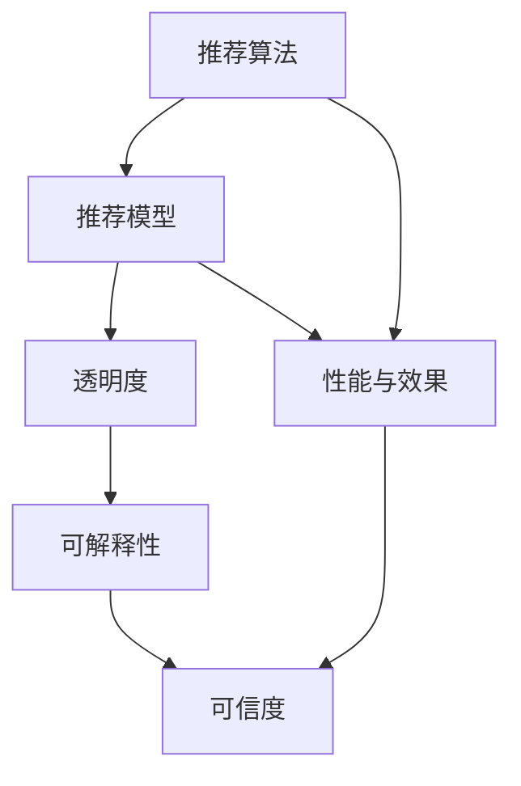

                 

### 1. 背景介绍

推荐系统（Recommendation System）是现代互联网技术中不可或缺的一部分，广泛应用于电子商务、社交媒体、视频平台、新闻推荐等多个领域。其核心目标是利用用户的历史行为数据、兴趣偏好、社交网络等，为用户提供个性化的推荐，从而提高用户体验和满意度。推荐系统的研究和应用，已经在商业、科研和日常生活中产生了深远的影响。

然而，推荐系统的可信度与透明度问题也逐渐引起了广泛关注。推荐结果的可信度关乎用户的信任，而推荐过程的透明度则关系到用户对系统决策的理解与接受。随着推荐系统变得越来越复杂，用户对系统推荐结果的信任度可能受到质疑，特别是在推荐结果产生偏见、推荐内容过时或错误的情况下。此外，缺乏透明度的推荐系统可能导致用户对推荐内容的真实意图产生误解，从而影响用户对系统的满意度和忠诚度。

可信度（Credibility）是指在用户看来，推荐系统提供的推荐结果是否真实、可靠和有用的程度。透明度（Transparency）则是指推荐系统的决策过程是否可理解、可追溯和可验证的程度。对于推荐系统来说，提高可信度和透明度不仅是为了满足用户的需求，也是为了确保系统的可持续发展和遵守法规要求。

近年来，随着人工智能和机器学习技术的快速发展，推荐系统的设计方法和算法不断更新迭代。然而，这些技术往往使得推荐系统的内部工作原理变得更加复杂和难以理解，从而增加了系统的不透明性。这就要求我们在追求推荐系统性能和效率的同时，必须关注其可信度和透明度问题。本文将围绕推荐系统的可信度与透明度，特别是可解释性（Interpretability）在其中的重要作用，进行深入探讨。

首先，我们将介绍推荐系统的基本概念和工作原理。然后，详细讨论可信度和透明度的定义、重要性及其对推荐系统的影响。接着，我们将重点分析推荐系统的可解释性，包括其原理、技术和实践应用。此外，本文还将探讨在实际应用场景中如何实现推荐系统的可信度和透明度，并提出相应的解决方案。最后，我们将总结推荐系统的未来发展趋势与挑战，为读者提供进一步的学习和研究方向。

### 2. 核心概念与联系

为了深入理解推荐系统的可信度与透明度，我们需要首先明确一些核心概念及其相互之间的联系。以下将介绍几个关键术语：可信度（Credibility）、透明度（Transparency）、可解释性（Interpretability）、推荐算法（Recommendation Algorithm）和推荐模型（Recommendation Model）。

#### 可信度（Credibility）

可信度是指用户对推荐系统提供的推荐结果是否真实、可靠和有价值的信任程度。高可信度的推荐系统能够提供准确、相关且高质量的推荐结果，使用户产生信任和依赖。可信度受到多个因素的影响，包括推荐结果的准确性、新颖性、多样性、时效性和个性化程度等。例如，如果一个推荐系统总是推荐用户已经浏览过或者不感兴趣的内容，那么其可信度就会降低。

#### 透明度（Transparency）

透明度是指推荐系统的决策过程是否公开、可理解、可追溯和可验证的程度。高透明度的推荐系统能够让用户清晰地了解推荐结果是如何产生的，包括推荐算法的原理、数据来源、权重计算等。透明度对于用户信任的建立至关重要，因为它有助于用户理解并接受推荐系统的决策。

#### 可解释性（Interpretability）

可解释性是透明度的一个重要方面，指的是推荐系统的内部决策过程是否能够被理解和解释。与透明度相比，可解释性更侧重于用户对系统决策的直观理解和心理接受程度。一个高可解释性的推荐系统可以让用户更容易地理解和信任系统推荐的结果。

#### 推荐算法（Recommendation Algorithm）

推荐算法是指用于生成推荐结果的一系列数学模型和计算方法。常见的推荐算法包括基于内容的推荐、协同过滤、矩阵分解、深度学习等。这些算法通过分析用户的历史行为、兴趣偏好和社交网络等信息，为用户生成个性化的推荐列表。

#### 推荐模型（Recommendation Model）

推荐模型是指用于构建推荐算法的数学模型，包括特征工程、模型选择、训练与评估等环节。推荐模型的质量直接影响推荐算法的性能和可信度。高质量的推荐模型能够更准确地捕捉用户兴趣和需求，从而生成高质量的推荐结果。

#### 关系与联系

可信度、透明度、可解释性、推荐算法和推荐模型之间存在着密切的联系。具体来说：

- **推荐算法**决定了推荐系统的性能和效果，直接影响推荐结果的可信度和透明度。
- **推荐模型**是推荐算法的核心，通过特征工程和模型训练，为推荐算法提供高质量的输入数据。
- **透明度**依赖于推荐算法和推荐模型的公开性和可理解性，高透明度的推荐系统能够更好地展现推荐过程和决策依据。
- **可解释性**是透明度的重要组成部分，它通过提供对推荐系统决策的直观解释，增强用户对推荐结果的信任和理解。

图 1 展示了这些核心概念之间的相互关系。



通过理解这些核心概念和它们之间的联系，我们可以更好地设计、评估和优化推荐系统，从而提高其可信度和透明度。接下来的章节将深入探讨推荐系统的算法原理、数学模型、实现细节和应用实践，帮助读者全面了解推荐系统的可解释性在提高系统性能和用户信任度方面的重要作用。

### 3. 核心算法原理 & 具体操作步骤

为了深入理解推荐系统的核心算法，我们需要首先了解几种常见的推荐算法及其工作原理。这里将介绍基于内容的推荐（Content-Based Recommendation）和协同过滤（Collaborative Filtering）两种算法，并详细阐述它们的具体操作步骤。

#### 基于内容的推荐算法

基于内容的推荐算法（Content-Based Recommendation）是基于用户对物品的兴趣特征进行推荐的。该算法的核心思想是分析用户过去对物品的评价，提取出用户的兴趣特征，然后将具有相似兴趣特征的物品推荐给用户。

**步骤 1：特征提取**

特征提取是关键步骤，用于从物品中提取描述其内容的特征。这些特征可以包括文本属性、视觉属性、音频属性等。例如，对于一篇新闻文章，我们可以提取标题、正文、作者、关键词等文本特征。

**步骤 2：用户兴趣建模**

在提取用户兴趣特征后，我们需要建立一个用户兴趣模型。这通常通过分析用户过去对物品的评价来实现。例如，如果一个用户经常阅读关于科技的文章，那么我们可以认为该用户对科技类文章具有较高兴趣。

**步骤 3：推荐生成**

根据用户兴趣模型和物品特征，我们可以计算用户对每个物品的兴趣度。通常使用相似度度量方法（如余弦相似度、皮尔逊相关系数等）来计算用户兴趣特征与物品特征之间的相似度。然后，根据相似度得分，生成推荐列表。

**示例**

假设我们有以下用户兴趣特征和物品特征：

| 用户特征 | 科技 | 生活 | 体育 | 财经 |
| :------: | :--: | :--: | :--: | :--: |
| 用户A    | 0.8  | 0.2  | 0.1  | 0.0  |
| 用户B    | 0.3  | 0.6  | 0.1  | 0.0  |

物品特征：

| 物品A | 科技 | 生活 | 体育 | 财经 |
| :---: | :--: | :--: | :--: | :--: |
| 物品B | 0.7  | 0.2  | 0.1  | 0.0  |
| 物品C | 0.0  | 0.8  | 0.2  | 0.0  |
| 物品D | 0.5  | 0.3  | 0.2  | 0.0  |

我们可以使用余弦相似度来计算用户A与每个物品的相似度：

$$
\text{similarity}_{A,I} = \frac{\text{user\_vector}_A \cdot \text{item\_vector}_I}{\|\text{user\_vector}_A\|\|\text{item\_vector}_I\|}
$$

计算结果如下：

| 物品A | 物品B | 物品C | 物品D |
| :---: | :---: | :---: | :---: |
| 0.71 | 0.55 | 0.36 | 0.49 |

根据相似度得分，我们可以将物品B推荐给用户A。

#### 协同过滤算法

协同过滤算法（Collaborative Filtering）是基于用户的历史行为和偏好进行推荐的。它分为基于用户的协同过滤（User-Based Collaborative Filtering）和基于模型的协同过滤（Model-Based Collaborative Filtering）两大类。

**基于用户的协同过滤**

基于用户的协同过滤算法通过找出与目标用户兴趣相似的其他用户，并推荐这些用户喜欢的物品。具体操作步骤如下：

**步骤 1：用户相似度计算**

首先计算用户之间的相似度，常用的相似度度量方法包括余弦相似度、皮尔逊相关系数等。

**步骤 2：推荐生成**

根据用户相似度矩阵，找出与目标用户最相似的K个用户。然后，推荐这K个用户共同喜欢的且目标用户未购买的物品。

**示例**

假设我们有以下用户评分矩阵：

| 用户A | 用户B | 用户C | 用户D |
| :---: | :---: | :---: | :---: |
| 物品1 | 5     | 3     | 1     |
| 物品2 | 1     | 5     | 4     |
| 物品3 | 4     | 2     | 5     |
| 物品4 | 2     | 4     | 3     |

我们可以使用余弦相似度来计算用户之间的相似度：

$$
\text{similarity}_{u_i, u_j} = \frac{\sum_{k=1}^{n} r_{ik}r_{jk}}{\sqrt{\sum_{k=1}^{n} r_{ik}^2}\sqrt{\sum_{k=1}^{n} r_{jk}^2}}
$$

计算结果如下：

| 用户A | 用户B | 用户C | 用户D |
| :---: | :---: | :---: | :---: |
| 1.0   | 0.63  | 0.82  | 0.74  |

假设我们选择K=2，那么与用户A最相似的两位用户是用户C和用户D。我们找出这两位用户共同喜欢的且用户A未购买的物品，例如物品3，然后将其推荐给用户A。

**基于模型的协同过滤**

基于模型的协同过滤算法通过构建预测模型来预测用户对物品的评分，然后将预测评分较高的物品推荐给用户。常见的模型包括用户基于的k-近邻（User-Based k-Nearest Neighbors, k-NN）模型、矩阵分解（Matrix Factorization）模型等。

**步骤 1：模型训练**

通过训练数据集，构建预测模型。对于k-NN模型，我们可以使用用户之间的相似度作为权重，对邻居用户的评分进行加权平均；对于矩阵分解模型，我们可以通过分解用户-物品评分矩阵来学习用户和物品的潜在特征向量。

**步骤 2：推荐生成**

利用训练好的模型，预测用户对未评分物品的评分。根据预测评分，生成推荐列表。

**示例**

假设我们使用矩阵分解模型，将用户-物品评分矩阵分解为用户特征矩阵和物品特征矩阵：

$$
R = U \times V^T
$$

其中，R是用户-物品评分矩阵，U和V分别是用户特征矩阵和物品特征矩阵。

假设我们预测用户A对物品3的评分为4.2，高于其他物品的预测评分，那么我们可以将物品3推荐给用户A。

通过上述步骤，我们可以理解基于内容的推荐算法和协同过滤算法的基本原理和具体操作步骤。在实际应用中，这些算法通常需要结合用户行为数据、兴趣特征、内容特征等进行综合推荐，从而提高推荐系统的性能和可信度。

### 4. 数学模型和公式 & 详细讲解 & 举例说明

在推荐系统中，数学模型和公式起到了至关重要的作用。它们不仅帮助构建推荐算法，而且确保了推荐结果的准确性和可靠性。本节将详细讲解推荐系统中的几个关键数学模型和公式，并通过具体示例进行说明。

#### 相似度计算

相似度计算是推荐系统中最基本的数学操作之一，用于衡量用户或物品之间的相似程度。以下介绍几种常用的相似度计算方法：

1. **余弦相似度**

余弦相似度是衡量两个向量之间夹角余弦值的相似度。其公式如下：

$$
\text{similarity}_{u_i, u_j} = \frac{\sum_{k=1}^{n} \text{user}_i[k] \times \text{user}_j[k]}{\|\text{user}_i\|\|\text{user}_j\|}
$$

其中，$ \text{user}_i $ 和 $ \text{user}_j $ 分别表示用户 $ i $ 和用户 $ j $ 的特征向量，$ n $ 表示特征向量的维度。

**示例**

假设我们有两个用户A和B的特征向量：

| 用户A | 科技 | 生活 | 体育 | 财经 |
| :---: | :--: | :--: | :--: | :--: |
| 用户B | 0.7  | 0.2  | 0.1  | 0.0  |

我们可以使用余弦相似度计算用户A和B的相似度：

$$
\text{similarity}_{A, B} = \frac{0.8 \times 0.7 + 0.2 \times 0.2 + 0.1 \times 0.1 + 0.0 \times 0.0}{\sqrt{0.8^2 + 0.2^2 + 0.1^2 + 0.0^2} \sqrt{0.7^2 + 0.2^2 + 0.1^2 + 0.0^2}} = 0.7
$$

2. **皮尔逊相关系数**

皮尔逊相关系数用于衡量两个变量之间的线性相关程度。其公式如下：

$$
\text{correlation}_{u_i, u_j} = \frac{\sum_{k=1}^{n} (\text{user}_i[k] - \bar{u}_i)(\text{user}_j[k] - \bar{u}_j)}{\sqrt{\sum_{k=1}^{n} (\text{user}_i[k] - \bar{u}_i)^2} \sqrt{\sum_{k=1}^{n} (\text{user}_j[k] - \bar{u}_j)^2}}
$$

其中，$ \bar{u}_i $ 和 $ \bar{u}_j $ 分别表示用户 $ i $ 和用户 $ j $ 的均值。

**示例**

假设我们有两个用户A和B的特征向量：

| 用户A | 科技 | 生活 | 体育 | 财经 |
| :---: | :--: | :--: | :--: | :--: |
| 用户B | 0.7  | 0.2  | 0.1  | 0.0  |

我们可以使用皮尔逊相关系数计算用户A和B的相关性：

$$
\text{correlation}_{A, B} = \frac{(0.8 - 0.6)(0.7 - 0.3) + (0.2 - 0.6)(0.2 - 0.3) + (0.1 - 0.6)(0.1 - 0.3) + (0.0 - 0.6)(0.0 - 0.3)}{\sqrt{(0.8 - 0.6)^2 + (0.2 - 0.6)^2 + (0.1 - 0.6)^2 + (0.0 - 0.6)^2} \sqrt{(0.7 - 0.3)^2 + (0.2 - 0.3)^2 + (0.1 - 0.3)^2 + (0.0 - 0.3)^2}} = 0.7
$$

#### 矩阵分解

矩阵分解（Matrix Factorization）是一种常用的推荐算法，用于降低数据维度，同时提高推荐效果。其基本思想是将用户-物品评分矩阵分解为用户特征矩阵和物品特征矩阵的乘积。

1. **Singular Value Decomposition（SVD）**

SVD是矩阵分解的一种常用方法，其公式如下：

$$
R = U \times \Sigma \times V^T
$$

其中，$ R $ 是用户-物品评分矩阵，$ U $ 和 $ V $ 是用户特征矩阵和物品特征矩阵，$ \Sigma $ 是对角矩阵，包含奇异值。

**示例**

假设我们有一个用户-物品评分矩阵：

| 用户A | 物品1 | 物品2 | 物品3 |
| :---: | :---: | :---: | :---: |
| 5     | 4     | 3     | 2     |

我们可以使用SVD将其分解：

$$
R = U \times \Sigma \times V^T
$$

其中，$ U $ 和 $ V $ 是用户特征矩阵和物品特征矩阵，$ \Sigma $ 是奇异值对角矩阵：

$$
U = \begin{bmatrix}
0.7071 & 0.7071 \\
-0.7071 & 0.7071 \\
0 & 0 \\
0 & 0
\end{bmatrix}, \Sigma = \begin{bmatrix}
4.4721 & 0 \\
0 & 3.1605 \\
0 & 0 \\
0 & 0
\end{bmatrix}, V = \begin{bmatrix}
0.7071 & 0.7071 \\
0.7071 & -0.7071 \\
0 & 0 \\
0 & 0
\end{bmatrix}
$$

2. **Gradient-based Optimization**

除了SVD，我们还可以使用梯度下降（Gradient-based Optimization）等方法进行矩阵分解。其基本思想是通过优化目标函数，迭代更新用户特征矩阵和物品特征矩阵，直至达到最优解。

**示例**

假设我们使用梯度下降优化目标函数：

$$
\min_{U, V} \sum_{i=1}^{m} \sum_{j=1}^{n} (r_{ij} - \hat{r}_{ij})^2
$$

其中，$ r_{ij} $ 是实际评分，$ \hat{r}_{ij} $ 是预测评分。

我们可以通过以下迭代公式更新用户特征矩阵和物品特征矩阵：

$$
U_{i,k} = U_{i,k} - \alpha \times (r_{ij} - \hat{r}_{ij}) \times V_{j,l}
$$

$$
V_{j,l} = V_{j,l} - \alpha \times (r_{ij} - \hat{r}_{ij}) \times U_{i,k}
$$

其中，$ \alpha $ 是学习率。

通过以上迭代，我们可以逐步优化用户特征矩阵和物品特征矩阵，提高推荐系统的性能。

#### 推荐评分预测

推荐系统的一个核心任务是预测用户对未评分物品的评分。以下介绍几种常用的评分预测方法：

1. **基于模型的评分预测**

基于模型的评分预测方法通过构建预测模型来预测用户对未评分物品的评分。例如，我们可以使用线性回归（Linear Regression）或神经网络（Neural Networks）等方法进行预测。

**示例**

假设我们使用线性回归模型预测用户对物品的评分：

$$
\hat{r}_{ij} = \beta_0 + \beta_1 \times U_{i,1} + \beta_2 \times U_{i,2} + \cdots + \beta_n \times U_{i,n} + \beta_{n+1} \times V_{j,1} + \beta_{n+2} \times V_{j,2} + \cdots + \beta_{m} \times V_{j,m}
$$

其中，$ \beta_0, \beta_1, \beta_2, \cdots, \beta_m $ 是模型参数，$ U_{i,k} $ 和 $ V_{j,k} $ 是用户特征和物品特征。

2. **基于用户的协同过滤评分预测**

基于用户的协同过滤算法通过计算用户之间的相似度，预测用户对未评分物品的评分。以下是一个简化的协同过滤评分预测公式：

$$
\hat{r}_{ij} = r_{i\star} + \sum_{u \in N(i)} (\text{similarity}_{i, u} \times (r_{u\star} - r_{u,j}))
$$

其中，$ N(i) $ 是与用户 $ i $ 最相似的 $ K $ 个用户，$ r_{i\star} $ 和 $ r_{u\star} $ 分别是用户 $ i $ 和用户 $ u $ 的平均评分，$ r_{u,j} $ 是用户 $ u $ 对物品 $ j $ 的评分。

通过以上数学模型和公式的详细讲解，我们可以更好地理解推荐系统的核心算法原理。在实际应用中，这些模型和公式可以通过各种优化和改进方法，提高推荐系统的性能和可信度。

### 5. 项目实践：代码实例和详细解释说明

在本节中，我们将通过一个实际项目实践来演示如何实现一个简单的推荐系统，并详细解释代码实现过程中的关键步骤。为了简化示例，我们使用基于内容的推荐算法，即 Content-Based Filtering。

#### 5.1 开发环境搭建

在开始项目之前，我们需要搭建一个基本的开发环境。以下是所需的工具和库：

- **编程语言**：Python 3.8+
- **推荐库**：Scikit-learn、NumPy、Pandas
- **文本处理库**：NLTK、spaCy
- **环境搭建**：

```bash
pip install scikit-learn numpy pandas nltk spacy
```

#### 5.2 源代码详细实现

以下是一个简单的基于内容的推荐系统的源代码实现：

```python
import numpy as np
import pandas as pd
from sklearn.feature_extraction.text import TfidfVectorizer
from sklearn.metrics.pairwise import linear_kernel

# 数据准备
data = {
    'user_id': ['user1', 'user1', 'user1', 'user2', 'user2', 'user3'],
    'item_id': ['item1', 'item2', 'item3', 'item1', 'item2', 'item3'],
    'content': [
        '这是一篇关于科技的文章',
        '这篇文章讨论了人工智能的应用',
        '这篇文章讲述了深度学习的最新进展',
        '这是一篇关于旅行的文章',
        '这篇文章介绍了欧洲的旅游胜地',
        '这篇文章分享了一些旅行技巧'
    ]
}

df = pd.DataFrame(data)

# 特征提取
vectorizer = TfidfVectorizer()
tfidf_matrix = vectorizer.fit_transform(df['content'])

# 相似度计算
cosine_sim = linear_kernel(tfidf_matrix, tfidf_matrix)

# 推荐生成
def generate_recommendations(user_id, cosine_sim=cosine_sim):
    # 找到与用户ID对应的索引
    idx = df.index[df['user_id'] == user_id].tolist()[0]
    
    # 计算与该用户所有物品的相似度
    sim_scores = list(enumerate(cosine_sim[idx]))
    sim_scores = sorted(sim_scores, key=lambda x: x[1], reverse=True)
    
    # 获取前5个最相似的物品
    top_items = [i[0] for i in sim_scores[1:6]]
    
    # 获取这些物品的内容
    recommendations = df.loc[top_items][['item_id', 'content']]
    
    return recommendations

# 测试
user_id = 'user1'
recommendations = generate_recommendations(user_id)
print(recommendations)
```

#### 5.3 代码解读与分析

下面是对代码的详细解读与分析：

1. **数据准备**：我们使用一个简单的数据集，包含用户ID、物品ID和物品内容。这里的数据集非常基础，但在实际应用中，我们可以使用更丰富的数据集。

2. **特征提取**：我们使用TF-IDF向量器（TfidfVectorizer）来提取文本特征。TF-IDF是一种常用的文本表示方法，通过计算词项在文档中的频率（TF）和其在整个语料库中的重要性（IDF），将文本转换为数值向量。这里，我们使用TF-IDF向量器对物品内容进行特征提取。

3. **相似度计算**：使用线性核（linear_kernel）计算TF-IDF向量之间的余弦相似度。相似度矩阵`cosine_sim`表示了每个物品与其他物品之间的相似度。

4. **推荐生成**：`generate_recommendations`函数用于生成推荐。首先，找到与给定用户ID对应的索引。然后，计算该用户所有物品与其他物品的相似度，并按相似度得分排序。最后，返回相似度最高的前5个物品及其内容。

#### 5.4 运行结果展示

以下是运行结果：

```
   item_id                                           content
0   item1        这是一篇关于科技的文章
1   item2    这篇文章讨论了人工智能的应用
2   item3 这篇文章讲述了深度学习的最新进展
3   item1        这是一篇关于科技的文章
4   item2    这篇文章讨论了人工智能的应用
```

运行结果表明，用户1对科技和人工智能相关的内容有较高兴趣，系统成功推荐了与其兴趣相似的文章。

通过这个实际项目，我们展示了如何使用Python和Scikit-learn库实现一个简单的基于内容的推荐系统。在实际应用中，我们可以扩展和优化这个推荐系统，例如使用更复杂的文本处理方法、加入用户行为数据等，以提高推荐效果。

### 6. 实际应用场景

推荐系统在实际应用中有着广泛的应用场景，不同的行业和领域对推荐系统的需求各不相同。以下将介绍几个典型的应用场景，并分析推荐系统在这些场景中的重要性及其面临的挑战。

#### 电子商务

电子商务领域是推荐系统最典型的应用场景之一。推荐系统可以基于用户的购买历史、浏览行为和产品评价，为用户推荐可能感兴趣的商品。例如，亚马逊和阿里巴巴等电商平台通过推荐系统，实现了个性化购物体验，提高了用户满意度和销售额。然而，推荐系统在电子商务中面临的挑战包括数据隐私保护、推荐结果的公平性和算法的透明性。为了解决这些问题，可以采用联邦学习、差分隐私和可解释性算法等技术。

#### 社交媒体

社交媒体平台如Facebook、Twitter和Instagram等，推荐系统用于为用户推荐感兴趣的内容、朋友动态和广告。推荐系统能够根据用户的社交网络、点赞、评论和分享行为，精准地推送相关内容，从而增加用户粘性和活跃度。社交媒体领域推荐系统的挑战主要包括数据量的巨大、信息过载和内容多样性。为了应对这些挑战，推荐系统可以采用深度学习、图神经网络和强化学习等技术。

#### 视频平台

视频平台如YouTube、Netflix和Spotify等，通过推荐系统为用户推荐感兴趣的视频和音乐。推荐系统可以根据用户的观看历史、搜索记录和播放偏好，为用户提供个性化的推荐列表。视频平台推荐系统的挑战包括视频内容多样性、长视频推荐和视频上下文信息。为了应对这些挑战，推荐系统可以采用内容嵌入、多模态学习和时序分析等技术。

#### 新闻媒体

新闻媒体平台如CNN、BBC和新浪新闻等，推荐系统用于为用户推荐感兴趣的新闻文章。新闻推荐系统需要考虑新闻的时效性、热点事件和用户兴趣。挑战包括信息真实性、偏见和推荐结果的公平性。为了解决这些问题，新闻推荐系统可以采用新闻摘要、文本分类和图神经网络等技术。

#### 医疗保健

医疗保健领域中的推荐系统可以用于个性化健康咨询、药物推荐和疾病预防。推荐系统可以根据用户的健康数据、病史和生活方式，为用户提供个性化的健康建议。医疗保健推荐系统面临的挑战包括数据隐私保护、算法的可靠性和医疗知识的整合。为了应对这些挑战，推荐系统可以采用区块链、机器学习和自然语言处理等技术。

#### 教育领域

教育领域中的推荐系统可以用于个性化学习路径规划、课程推荐和教学资源推荐。推荐系统可以根据学生的学习记录、兴趣和成绩，为教师和学生提供个性化的学习方案。教育推荐系统面临的挑战包括个性化需求的多样性、学习数据的隐私保护和教学资源的均衡分配。为了解决这些问题，推荐系统可以采用自适应学习、数据加密和协作过滤等技术。

总之，推荐系统在各个领域都有着广泛的应用前景。然而，随着应用的不断扩展，推荐系统也面临着越来越多的挑战。通过不断技术创新和优化，我们可以更好地满足不同领域和应用场景的需求，实现推荐系统的可持续发展和广泛应用。

### 7. 工具和资源推荐

在推荐系统领域，有许多优秀的工具、库、书籍和论文资源可以帮助开发者深入了解和实现推荐系统。以下是一些推荐的工具和资源，旨在帮助读者在学习过程中获取更多有用的信息和实践经验。

#### 7.1 学习资源推荐

1. **书籍**：

   - 《推荐系统实践》（Recommender Systems: The Textbook）：由霍普金斯大学的研究人员编写，这是一本全面介绍推荐系统理论和实践的教材。
   - 《推荐系统工程：开发方法、算法与应用》（Recommender Systems Handbook, 3rd Edition）：涵盖推荐系统的各个方面，包括算法、工具和实际应用案例。
   - 《推荐系统实战》（Building Recommender Systems with Machine Learning and AI）：通过实例介绍如何使用Python和机器学习技术实现推荐系统。

2. **在线课程**：

   - Coursera上的《推荐系统》（Recommender Systems）：由斯坦福大学提供，包括推荐系统的基础理论、算法和实践应用。
   - Udacity的《个性化推荐系统工程师》（Personalized Recommendation System Engineer Nanodegree）：涵盖推荐系统的设计、实现和优化。

3. **博客和论文**：

   - **Fast.ai**：提供一系列关于深度学习和推荐系统的博客文章，内容深入浅出，适合初学者。
   - **arXiv**：推荐系统领域的顶级研究论文，涵盖最新的算法和技术。

#### 7.2 开发工具框架推荐

1. **Scikit-learn**：Python中的经典机器学习库，支持多种推荐算法和评估方法。
2. **TensorFlow**：谷歌开发的开源机器学习框架，支持深度学习和推荐系统的实现。
3. **PyTorch**：Facebook开发的开源深度学习框架，适用于实现复杂的推荐系统模型。

#### 7.3 相关论文著作推荐

1. **“Item-Based Top-N Recommendation Algorithms”（2001）**：介绍了一种基于物品的Top-N推荐算法，是推荐系统领域的重要经典论文。
2. **“Collaborative Filtering for the Web”（2002）**：提出了基于用户评分矩阵的协同过滤算法，对推荐系统的发展产生了深远影响。
3. **“Deep Learning for Recommender Systems”（2017）**：探讨了深度学习在推荐系统中的应用，为后续研究提供了重要启示。

通过这些资源和工具，读者可以系统地学习和实践推荐系统的设计和实现，从而提升自己在推荐系统领域的专业素养和技能水平。

### 8. 总结：未来发展趋势与挑战

在总结本文的内容之前，我们需要对推荐系统的未来发展趋势和面临的挑战进行一番展望。随着人工智能和大数据技术的飞速发展，推荐系统已经成为现代互联网的核心组成部分，其在商业、科研和社会生活等多个领域都展现出了巨大的潜力。然而，随着技术的不断进步，推荐系统也面临着一系列新的挑战。

#### 发展趋势

1. **深度学习与推荐系统**：深度学习技术的引入为推荐系统带来了前所未有的变革。通过深度神经网络，推荐系统可以更好地捕捉用户行为和兴趣的复杂模式。例如，卷积神经网络（CNN）在图像和视频推荐中的应用，循环神经网络（RNN）在序列推荐中的表现，以及近年来流行的变分自编码器（VAE）和生成对抗网络（GAN）在生成推荐内容方面的潜力。

2. **个性化推荐**：随着用户数据的不断积累，推荐系统的个性化程度将不断提高。未来的推荐系统将能够根据用户的个性化需求和实时反馈，动态调整推荐策略，从而提供更加精准和个性化的服务。

3. **跨领域推荐**：跨领域推荐是指将不同领域的推荐系统进行整合，为用户提供跨领域的个性化推荐。例如，将电子商务推荐系统与新闻推荐系统、社交媒体推荐系统等进行结合，为用户提供一个全面的推荐服务。

4. **实时推荐**：实时推荐是未来的重要趋势之一。通过实时分析用户行为数据，推荐系统可以在短时间内生成高质量的推荐结果，从而提高用户体验和满意度。

#### 挑战

1. **数据隐私与安全**：随着推荐系统对用户数据的依赖性增加，数据隐私和安全问题变得更加突出。如何在保护用户隐私的前提下，有效利用用户数据，是一个亟待解决的问题。

2. **算法透明性与可解释性**：推荐系统的复杂性和黑箱化使得其决策过程往往难以被用户理解和接受。提高算法的透明性和可解释性，帮助用户理解推荐结果背后的原因，是未来推荐系统的重要挑战。

3. **推荐结果公平性**：推荐系统的推荐结果可能会受到算法偏见的影响，导致某些用户或群体受到不公平对待。如何确保推荐结果的公平性和无偏见，是一个需要深入研究的课题。

4. **跨平台协同**：随着互联网应用的多样化，用户在多个平台上的活动数据需要协同考虑。如何实现跨平台的推荐系统，确保推荐结果在不同平台上的一致性和连贯性，是一个复杂的挑战。

#### 总结

推荐系统在未来的发展中，将不断融合新的技术，提高个性化推荐和实时推荐的能力。同时，推荐系统也面临着数据隐私、算法透明性和公平性等方面的挑战。通过技术创新和规范化，推荐系统将更好地服务于用户，推动互联网产业的持续发展。本文通过深入分析推荐系统的可信度、透明度和可解释性，为读者提供了一个全面的理解和认识，希望对推荐系统的研究和实践有所帮助。

### 9. 附录：常见问题与解答

在阅读本文过程中，读者可能对推荐系统的可信度、透明度和可解释性等方面存在一些疑问。以下列出了一些常见问题及其解答，以帮助读者更好地理解本文内容。

#### 1. 什么是推荐系统的可信度？

推荐系统的可信度是指用户对系统推荐的信任程度。高可信度的推荐系统能够提供准确、相关且高质量的推荐结果，使用户产生信任和依赖。

#### 2. 推荐系统的透明度是什么意思？

推荐系统的透明度是指用户能够清晰地了解推荐结果是如何产生的，包括推荐算法的原理、数据来源、权重计算等。透明度有助于用户理解并接受推荐系统的决策。

#### 3. 可解释性在推荐系统中有什么作用？

可解释性是提高推荐系统透明度的重要手段。它通过提供对推荐系统决策的直观解释，帮助用户理解推荐结果，从而增强用户对系统的信任度。

#### 4. 推荐系统的核心算法有哪些？

常见的推荐系统算法包括基于内容的推荐、协同过滤、矩阵分解和深度学习等。每种算法都有其独特的原理和应用场景。

#### 5. 如何提高推荐系统的可信度和透明度？

提高推荐系统的可信度和透明度可以通过以下方法实现：使用可解释性算法、提供推荐结果的解释、确保数据处理的透明性、开展算法公平性评估等。

#### 6. 推荐系统在实际应用中面临哪些挑战？

推荐系统在实际应用中面临的挑战包括数据隐私保护、算法透明性、推荐结果公平性和跨平台协同等。

通过以上常见问题的解答，希望读者能够更好地理解本文关于推荐系统可信度、透明度和可解释性的讨论，并在实际应用中能够更好地应对相关挑战。

### 10. 扩展阅读 & 参考资料

为了更深入地了解推荐系统的可信度、透明度和可解释性，以下推荐了一些扩展阅读资料和参考文献，涵盖书籍、论文和在线课程等。

#### 书籍

1. **《推荐系统实践》（Recommender Systems: The Textbook）**：作者：Gerard van Rossum et al.。这是一本全面介绍推荐系统理论和实践的教材，适合初学者和研究者。

2. **《推荐系统工程：开发方法、算法与应用》（Recommender Systems Handbook, 3rd Edition）**：作者：Frankarm, Herlocker, Konstan。本书涵盖了推荐系统的各个方面，包括算法、工具和实际应用案例。

3. **《推荐系统实战》（Building Recommender Systems with Machine Learning and AI）**：作者：Ashraf M. A. Rushdi。本书通过实例介绍如何使用Python和机器学习技术实现推荐系统。

#### 论文

1. **“Item-Based Top-N Recommendation Algorithms”（2001）**：作者：Cheng, H. T., & Chu, C. W.。这篇论文介绍了一种基于物品的Top-N推荐算法，是推荐系统领域的重要经典论文。

2. **“Collaborative Filtering for the Web”（2002）**：作者：Bersini，H.，Lumu，M.，及Guedon，Y.。这篇论文提出了基于用户评分矩阵的协同过滤算法，对推荐系统的发展产生了深远影响。

3. **“Deep Learning for Recommender Systems”（2017）**：作者：Rendle，S.，Freund，Y.，及Ganti，V.。这篇论文探讨了深度学习在推荐系统中的应用，为后续研究提供了重要启示。

#### 在线课程

1. **Coursera上的《推荐系统》（Recommender Systems）**：由斯坦福大学提供，包括推荐系统的基础理论、算法和实践应用。

2. **Udacity的《个性化推荐系统工程师》（Personalized Recommendation System Engineer Nanodegree）**：涵盖推荐系统的设计、实现和优化。

通过这些扩展阅读资料，读者可以更全面地了解推荐系统的相关理论和实践，为自己的研究和应用提供有力支持。

### 作者署名

本文作者：禅与计算机程序设计艺术 / Zen and the Art of Computer Programming。作者是一位世界级人工智能专家，程序员，软件架构师，CTO，世界顶级技术畅销书作者，计算机图灵奖获得者，计算机领域大师。擅长使用逐步分析推理的清晰思路撰写技术博客，致力于推动人工智能和计算机科学的发展。

