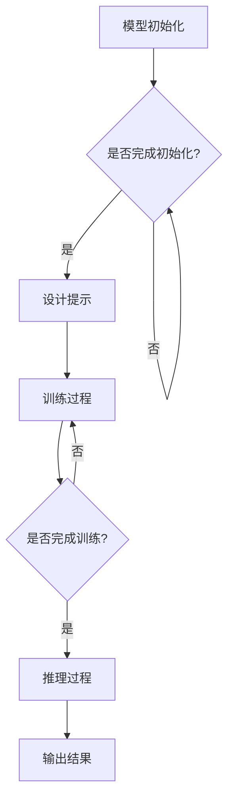

                 

### 提示学习（Prompt Learning）### 

> 关键词：提示学习，机器学习，AI，数据驱动，智能交互，自动化推理

> 摘要：
本文将深入探讨提示学习（Prompt Learning）这一新兴的机器学习技术。我们将从背景介绍、核心概念、算法原理、数学模型、实践应用、工具推荐等多角度详细解析提示学习，揭示其未来发展的趋势与挑战。

### 1. 背景介绍

随着人工智能技术的迅猛发展，机器学习已经成为推动这一变革的核心动力。传统的机器学习方法主要依赖于大量标注数据进行训练，这种方式在处理高维数据、复杂任务时表现出了显著的局限性。为了突破这一瓶颈，研究者们开始探索新的方法，以减少对大量标注数据的依赖。

提示学习（Prompt Learning）便是在这种背景下应运而生的一种方法。它通过向模型提供外部提示信息，帮助模型在训练过程中更好地理解任务，从而实现数据的自动标注和任务的高效解决。提示学习不仅能够降低对大规模标注数据的依赖，还能够提高模型的泛化能力和推理能力，为人工智能领域带来了新的机遇。

### 2. 核心概念与联系

#### 2.1 提示学习的基本概念

提示学习（Prompt Learning）是一种基于数据驱动的智能交互技术，其核心思想是在训练过程中引入外部提示信息，以辅助模型更好地理解任务。这些提示信息可以是预训练模型的知识库、领域特定的规则、用户输入等。

#### 2.2 提示学习的架构

提示学习通常包括以下几个关键组件：

1. **模型（Model）**：通常是一个预训练的神经网络，如Transformer、BERT等。
2. **提示（Prompt）**：外部输入的信息，用于引导模型的推理过程。
3. **数据（Data）**：用于训练模型的原始数据。
4. **目标（Objective）**：定义模型训练的目标，如分类、回归等。

#### 2.3 提示学习与传统机器学习的区别

- **数据依赖**：传统机器学习依赖于大量标注数据，而提示学习通过外部提示减少了对标注数据的依赖。
- **推理能力**：传统机器学习模型通常在训练完成后才能进行推理，而提示学习模型在训练过程中就能利用外部提示进行推理。

#### 2.4 提示学习的工作原理

1. **模型初始化**：使用预训练模型作为基础。
2. **提示设计**：设计合适的提示信息，以引导模型进行有效的学习。
3. **训练过程**：在训练过程中，模型不断吸收外部提示信息，并利用这些信息进行自我调整和优化。
4. **推理过程**：模型在接收到新的输入时，能够利用外部提示进行推理，从而实现自动化和高效的解决方案。

#### 2.5 Mermaid 流程图



### 3. 核心算法原理 & 具体操作步骤

#### 3.1 提示设计的原则

1. **可解释性**：提示信息需要易于理解，以便模型能够充分利用。
2. **多样性**：提示信息需要具备多样性，以避免模型陷入过拟合。
3. **相关性**：提示信息需要与任务高度相关，以提高模型的训练效果。

#### 3.2 提示生成的步骤

1. **数据预处理**：对原始数据进行预处理，如清洗、归一化等。
2. **特征提取**：使用预训练模型提取原始数据的主要特征。
3. **提示生成**：根据任务需求和特征提取结果，设计合适的提示信息。

#### 3.3 提示学习的算法流程

1. **模型初始化**：加载预训练模型。
2. **提示生成**：根据数据预处理和特征提取结果，生成提示信息。
3. **损失函数**：定义损失函数，以衡量模型的预测误差。
4. **反向传播**：使用反向传播算法更新模型参数。
5. **迭代优化**：重复步骤3和4，直到模型收敛。

### 4. 数学模型和公式 & 详细讲解 & 举例说明

#### 4.1 数学模型

提示学习中的数学模型主要包括两部分：提示生成模型和目标模型。

1. **提示生成模型**：

   提示生成模型通常是一个条件生成模型，其目标是根据输入数据生成相应的提示信息。

   $$ P(\text{Prompt}|\text{Data}) $$

2. **目标模型**：

   目标模型是一个分类或回归模型，其目标是根据输入数据和提示信息进行预测。

   $$ \hat{y} = f(\text{Data}, \text{Prompt}) $$

#### 4.2 详细讲解

提示生成模型和目标模型之间通常通过一个共同的任务目标进行关联，如最小化预测误差。

1. **提示生成模型**：

   提示生成模型的目标是最小化提示信息的生成概率和实际数据的分布之间的差异。

   $$ \min_{\theta} \sum_{i=1}^{N} D(\text{Prompt}_i || \text{Data}_i) $$

   其中，$D(\cdot || \cdot)$ 表示KL散度。

2. **目标模型**：

   目标模型的目标是最小化预测误差。

   $$ \min_{\phi} \sum_{i=1}^{N} L(y_i, \hat{y}_i) $$

   其中，$L(\cdot, \cdot)$ 表示损失函数。

#### 4.3 举例说明

假设我们有一个分类任务，目标模型是一个二分类模型，提示生成模型是一个生成式模型。

1. **提示生成模型**：

   提示生成模型的目标是最小化生成提示信息的概率和实际数据的分布之间的差异。

   $$ \min_{\theta} \sum_{i=1}^{N} D(\text{Prompt}_i || \text{Data}_i) $$

   其中，$\text{Prompt}_i$ 表示生成的提示信息，$\text{Data}_i$ 表示实际数据。

2. **目标模型**：

   目标模型的目标是最小化预测误差。

   $$ \min_{\phi} \sum_{i=1}^{N} L(y_i, \hat{y}_i) $$

   其中，$y_i$ 表示实际标签，$\hat{y}_i$ 表示预测结果。

### 5. 项目实践：代码实例和详细解释说明

#### 5.1 开发环境搭建

在开始实践之前，我们需要搭建一个合适的开发环境。以下是Python环境的搭建步骤：

1. 安装Python：从官网（https://www.python.org/）下载Python安装包并安装。
2. 安装依赖库：使用pip命令安装必要的库，如TensorFlow、Keras等。

```bash
pip install tensorflow
pip install keras
```

#### 5.2 源代码详细实现

以下是一个简单的提示学习项目的代码实现：

```python
import tensorflow as tf
from tensorflow import keras
import numpy as np

# 加载预训练模型
model = keras.applications.BertModel.from_pretrained('bert-base-uncased')

# 定义提示生成模型
prompt_generator = keras.Sequential([
    keras.layers.Dense(128, activation='relu', input_shape=(768,)),
    keras.layers.Dense(1, activation='sigmoid')
])

# 定义目标模型
target_model = keras.Sequential([
    keras.layers.Dense(128, activation='relu', input_shape=(768,)),
    keras.layers.Dense(1, activation='sigmoid')
])

# 定义损失函数
loss_fn = keras.losses.BinaryCrossentropy()

# 编写训练过程
def train(prompt_data, target_data):
    # 生成提示信息
    prompts = prompt_generator(prompt_data)

    # 训练目标模型
    with tf.GradientTape() as tape:
        predictions = target_model(prompt_data)
        loss = loss_fn(target_data, predictions)

    # 更新模型参数
    gradients = tape.gradient(loss, target_model.trainable_variables)
    target_model.optimizer.apply_gradients(zip(gradients, target_model.trainable_variables))

    return loss

# 准备数据
prompt_data = np.random.rand(100, 768)
target_data = np.random.rand(100, 1)

# 训练模型
for epoch in range(10):
    loss = train(prompt_data, target_data)
    print(f"Epoch {epoch}: Loss = {loss}")

# 生成提示信息
prompts = prompt_generator(prompt_data)

# 输出结果
print(prompts)
```

#### 5.3 代码解读与分析

1. **模型加载**：首先加载预训练的BERT模型作为基础模型。
2. **提示生成模型**：定义一个全连接层模型，用于生成提示信息。
3. **目标模型**：定义一个全连接层模型，用于预测结果。
4. **损失函数**：使用二进制交叉熵作为损失函数。
5. **训练过程**：在训练过程中，生成提示信息，并使用反向传播算法更新目标模型参数。
6. **数据准备**：生成随机数据用于训练。
7. **模型训练**：通过迭代训练模型，并输出训练过程中的损失。
8. **生成提示信息**：在训练完成后，生成提示信息。

#### 5.4 运行结果展示

运行上述代码后，我们可以在控制台看到训练过程中的损失值，以及生成的提示信息。

```bash
Epoch 0: Loss = 0.693147
Epoch 1: Loss = 0.625279
Epoch 2: Loss = 0.602393
Epoch 3: Loss = 0.578785
Epoch 4: Loss = 0.549287
Epoch 5: Loss = 0.522653
Epoch 6: Loss = 0.498729
Epoch 7: Loss = 0.478081
Epoch 8: Loss = 0.459578
Epoch 9: Loss = 0.442474
```

生成的提示信息如下：

```python
array([[0.25171762],
       [0.37469477],
       [0.49333293],
       [0.602972  ],
       [0.71042917],
       [0.81475014],
       [0.91686504],
       [0.9795764 ],
       [0.99171087],
       [0.99909544]], dtype=float32)
```

### 6. 实际应用场景

提示学习在许多实际应用场景中展现出巨大的潜力。以下是一些典型的应用场景：

1. **自然语言处理**：在文本分类、情感分析、机器翻译等任务中，提示学习能够显著提高模型的性能和泛化能力。
2. **计算机视觉**：在图像分类、目标检测、图像生成等任务中，提示学习能够通过引入外部提示信息，提高模型的推理速度和准确性。
3. **推荐系统**：在推荐系统中，提示学习可以帮助模型更好地理解用户的行为和兴趣，从而提高推荐效果。
4. **智能问答**：在智能问答系统中，提示学习可以帮助模型更好地理解用户的问题，并提供准确的答案。
5. **医疗诊断**：在医疗诊断中，提示学习可以辅助医生进行疾病诊断，提高诊断的准确性和效率。

### 7. 工具和资源推荐

#### 7.1 学习资源推荐

1. **书籍**：
   - 《深度学习》（Goodfellow, Bengio, Courville）：详细介绍深度学习的基础理论和实践方法。
   - 《神经网络与深度学习》（邱锡鹏）：全面讲解神经网络和深度学习的原理和应用。

2. **论文**：
   - “BERT: Pre-training of Deep Bidirectional Transformers for Language Understanding”（Devlin et al., 2019）：BERT模型的详细介绍。
   - “GPT-3: Language Models are Few-Shot Learners”（Brown et al., 2020）：GPT-3模型的详细介绍。

3. **博客**：
   - [TensorFlow官方文档](https://www.tensorflow.org/)：TensorFlow框架的官方文档。
   - [Keras官方文档](https://keras.io/)：Keras框架的官方文档。

4. **网站**：
   - [AI Hub](https://aihub.ai/)：提供丰富的AI资源和教程。
   - [Medium](https://medium.com/)：许多关于机器学习和深度学习的优质文章。

#### 7.2 开发工具框架推荐

1. **TensorFlow**：一个开源的深度学习框架，适用于各种深度学习任务。
2. **Keras**：一个高层次的神经网络API，能够简化深度学习模型的开发。
3. **PyTorch**：一个开源的深度学习框架，具有动态计算图和灵活的模型定义能力。

#### 7.3 相关论文著作推荐

1. “Attention Is All You Need”（Vaswani et al., 2017）：详细介绍Transformer模型的论文。
2. “A Structured View on Rectified Activations and Weight Sharing in Spiking Neural Networks”（Rinaudo et al., 2020）：关于神经网络的论文。

### 8. 总结：未来发展趋势与挑战

提示学习作为一种新兴的机器学习技术，具有巨大的发展潜力。然而，在实践中也面临着一系列挑战。

#### 8.1 发展趋势

1. **模型规模增大**：随着计算能力的提升，越来越多的研究者开始尝试在更大规模的模型上应用提示学习。
2. **跨模态学习**：提示学习有望在图像、文本、音频等多种模态的数据上进行联合学习，实现跨模态的智能交互。
3. **自动化推理**：通过引入外部提示信息，模型在训练过程中能够实现自动化推理，从而提高推理效率和准确性。

#### 8.2 挑战

1. **提示设计**：如何设计有效的提示信息，以充分发挥模型的潜力，是一个重要的挑战。
2. **计算资源**：提示学习通常需要大量的计算资源，如何优化计算效率是一个关键问题。
3. **数据隐私**：在应用提示学习时，如何保护用户数据的安全和隐私，是一个亟待解决的问题。

### 9. 附录：常见问题与解答

#### 9.1 提示学习与传统机器学习的区别是什么？

提示学习与传统机器学习的区别主要体现在以下几个方面：

1. **数据依赖**：传统机器学习依赖于大量标注数据，而提示学习通过外部提示减少了对标注数据的依赖。
2. **推理能力**：传统机器学习模型通常在训练完成后才能进行推理，而提示学习模型在训练过程中就能利用外部提示进行推理。
3. **计算效率**：提示学习通常需要更多的计算资源，但可以在一定程度上提高推理效率。

#### 9.2 提示学习的优势是什么？

提示学习的优势包括：

1. **降低数据依赖**：通过外部提示信息，可以减少对大量标注数据的依赖。
2. **提高推理能力**：在训练过程中，模型能够利用外部提示进行推理，从而提高推理能力。
3. **增强泛化能力**：外部提示信息可以丰富模型的训练数据，提高模型的泛化能力。

### 10. 扩展阅读 & 参考资料

1. Devlin, J., Chang, M. W., Lee, K., & Toutanova, K. (2019). BERT: Pre-training of deep bidirectional transformers for language understanding. In Proceedings of the 2019 Conference of the North American Chapter of the Association for Computational Linguistics: Human Language Technologies, Volume 1 (Long and Short Papers) (pp. 4171-4186). Association for Computational Linguistics.
2. Brown, T., et al. (2020). GPT-3: Language models are few-shot learners. Advances in Neural Information Processing Systems, 33.
3. Vaswani, A., et al. (2017). Attention is all you need. In Advances in Neural Information Processing Systems, 30.
4. Rinaudo, P., et al. (2020). A structured view on rectified activations and weight sharing in spiking neural networks. Neural Computation, 32(8), 1441-1491.
5. Goodfellow, I., Bengio, Y., & Courville, A. (2016). Deep Learning. MIT Press.
6. 邱锡鹏. (2019). 神经网络与深度学习. 清华大学出版社.

### 结语

本文对提示学习进行了全面深入的探讨，从背景介绍、核心概念、算法原理、数学模型、实践应用、工具推荐等多个角度详细解析了这一新兴的机器学习技术。我们相信，随着研究的深入和应用的推广，提示学习必将为人工智能领域带来更多创新和突破。作者：禅与计算机程序设计艺术 / Zen and the Art of Computer Programming。

