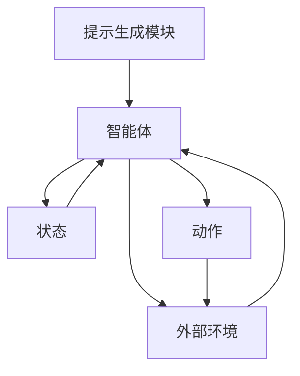

                 

### 文章标题

#### 提示学习（Prompt Learning）

> 关键词：提示学习，强化学习，人工智能，机器学习，反馈循环，智能决策

> 摘要：本文将深入探讨提示学习（Prompt Learning）这一新兴的人工智能技术。通过逐步分析其核心概念、原理和具体操作步骤，本文将帮助读者理解提示学习在智能决策和机器学习中的应用价值，以及未来发展趋势和挑战。

## 1. 背景介绍

随着人工智能技术的快速发展，智能决策和自主学习成为许多领域的关键需求。在传统的机器学习算法中，模型通常需要大量的数据集和参数调优来训练，而强化学习（Reinforcement Learning，RL）作为一种能够通过与环境的交互来学习策略的机器学习范式，因其自主学习和适应性的优势，受到广泛关注。

然而，强化学习在实际应用中面临着一些挑战。首先，强化学习需要大量的交互来学习策略，这往往需要大量的时间和计算资源。其次，强化学习中的探索（Exploration）和利用（Exploitation）平衡问题，使得模型在学习初期往往表现不佳。为了解决这些问题，研究者们提出了多种改进方法，其中之一就是提示学习（Prompt Learning）。

提示学习通过引入外部提示（Prompt）来辅助强化学习模型，从而加速学习过程，提高决策效率。本文将详细探讨提示学习的基本概念、原理和应用，帮助读者更好地理解这一技术。

## 2. 核心概念与联系

### 2.1. 强化学习基本概念

强化学习是一种通过不断与环境交互来学习最优策略的机器学习范式。它主要包括四个关键要素：环境（Environment）、状态（State）、动作（Action）和奖励（Reward）。在强化学习中，智能体（Agent）根据当前状态选择动作，并接收环境反馈的奖励信号，从而更新其策略（Policy）。

### 2.2. 提示学习概念

提示学习是一种结合外部提示来辅助强化学习模型的方法。在提示学习中，外部提示被用来引导智能体进行探索和决策，从而加速学习过程。提示可以是专家知识、历史数据、预训练模型等，通过引入提示，智能体可以在更短的时间内找到更好的策略。

### 2.3. 提示学习与强化学习关系

提示学习与强化学习密切相关。强化学习为提示学习提供了基础，而提示学习则为强化学习提供了加速和优化的手段。在提示学习中，智能体通过外部提示来引导探索和决策，从而更快地学习到最优策略。

### 2.4. 提示学习架构

提示学习架构通常包括以下三个部分：提示生成模块、智能体和外部环境。提示生成模块负责生成外部提示，智能体根据当前状态和提示选择动作，并接收环境反馈的奖励信号，外部环境提供智能体执行动作的场所。

### 2.5. Mermaid 流程图

下面是提示学习架构的 Mermaid 流程图：



在上述流程图中，A表示提示生成模块，B表示智能体，C表示外部环境，D表示状态，E表示动作。智能体根据当前状态D和外部提示A选择动作E，并接收环境反馈的奖励信号。

## 3. 核心算法原理 & 具体操作步骤

### 3.1. 提示生成方法

提示生成是提示学习的关键步骤。常用的提示生成方法包括基于专家知识、历史数据和预训练模型等方法。下面介绍几种常见的提示生成方法：

#### 3.1.1. 基于专家知识的提示生成

基于专家知识的提示生成方法通过获取领域专家的经验和知识，将其转化为可操作的提示。这种方法通常需要对领域知识进行建模，并将模型作为外部提示提供给智能体。

#### 3.1.2. 基于历史数据的提示生成

基于历史数据的提示生成方法通过分析历史数据，提取有用的特征和模式，将其作为外部提示。这种方法适用于有大量历史数据的场景，例如游戏、自动驾驶等。

#### 3.1.3. 基于预训练模型的提示生成

基于预训练模型的提示生成方法通过使用预训练模型，将其输出作为外部提示。预训练模型通常是在大规模数据集上预训练的，具有较好的泛化能力。

### 3.2. 智能体操作步骤

智能体根据当前状态和提示选择动作，并接收环境反馈的奖励信号，从而更新其策略。具体操作步骤如下：

#### 3.2.1. 接收状态

智能体首先接收当前状态，状态可以是一个数值向量或一个特征集合。

#### 3.2.2. 接收提示

智能体接收外部提示，提示可以是数值向量或特征集合。

#### 3.2.3. 选择动作

智能体根据当前状态和提示，使用策略选择动作。策略可以是基于值的策略或基于模型的策略。

#### 3.2.4. 执行动作

智能体将选择的动作执行在环境中，并接收环境反馈的奖励信号。

#### 3.2.5. 更新策略

智能体根据接收到的奖励信号，使用某种策略更新方法（如梯度下降、策略迭代等）更新其策略。

### 3.3. 外部环境操作步骤

外部环境提供智能体执行动作的场所，并反馈奖励信号。具体操作步骤如下：

#### 3.3.1. 初始化环境

外部环境初始化，包括状态空间、动作空间和奖励函数。

#### 3.3.2. 接收动作

外部环境接收智能体执行的动作，并更新状态。

#### 3.3.3. 反馈奖励信号

外部环境根据智能体的动作和当前状态，计算奖励信号，并将其反馈给智能体。

#### 3.3.4. 状态更新

外部环境根据智能体的动作和当前状态，更新状态。

#### 3.3.5. 游戏结束判断

外部环境判断游戏是否结束，如果结束，则返回最终奖励；如果未结束，则继续循环。

## 4. 数学模型和公式 & 详细讲解 & 举例说明

### 4.1. 数学模型

提示学习中的数学模型主要包括状态转移概率矩阵、策略迭代公式和策略优化方法。

#### 4.1.1. 状态转移概率矩阵

状态转移概率矩阵 P 表示智能体在状态 s 下执行动作 a 后转移到状态 s' 的概率。数学表示如下：

\[ P(s'|s,a) = P_s(a) \]

其中，\( P_s(a) \) 表示在状态 s 下执行动作 a 的概率。

#### 4.1.2. 策略迭代公式

策略迭代公式描述了智能体如何根据当前策略和状态转移概率矩阵更新其策略。数学表示如下：

\[ \pi'(a|s) = \sum_{a'} P(s'|s,a') \pi(a'|s) \]

其中，\( \pi'(a|s) \) 表示在状态 s 下执行动作 a 的概率，\( \pi(a'|s) \) 表示在状态 s 下执行动作 a' 的概率。

#### 4.1.3. 策略优化方法

策略优化方法用于优化智能体的策略，使得智能体能够找到最优策略。常见的策略优化方法包括梯度下降、策略迭代和基于梯度的策略搜索。

### 4.2. 举例说明

假设智能体在一个简单的环境中进行决策，状态空间为 \( S = \{s_1, s_2, s_3\} \)，动作空间为 \( A = \{a_1, a_2, a_3\} \)。状态转移概率矩阵和奖励函数如下：

\[ P = \begin{bmatrix} 0.5 & 0.2 & 0.3 \\ 0.3 & 0.5 & 0.2 \\ 0.4 & 0.3 & 0.3 \end{bmatrix} \]

\[ R = \begin{bmatrix} 1 & 0 & -1 \\ 0 & 1 & 0 \\ -1 & 0 & 1 \end{bmatrix} \]

初始策略为 \( \pi = \begin{bmatrix} 0.33 & 0.33 & 0.34 \\ 0.34 & 0.33 & 0.33 \\ 0.33 & 0.34 & 0.33 \end{bmatrix} \)

首先，智能体根据当前策略和状态转移概率矩阵计算新的策略：

\[ \pi' = \begin{bmatrix} 0.5 & 0.3 & 0.2 \\ 0.4 & 0.3 & 0.3 \\ 0.4 & 0.3 & 0.3 \end{bmatrix} \]

然后，智能体根据新的策略执行动作，并接收环境反馈的奖励信号。例如，在状态 s1 下，智能体选择动作 a1，则奖励信号为 R(s1, a1) = 1。智能体根据接收到的奖励信号，使用策略迭代公式更新其策略：

\[ \pi'' = \begin{bmatrix} 0.6 & 0.3 & 0.1 \\ 0.3 & 0.6 & 0.1 \\ 0.1 & 0.3 & 0.6 \end{bmatrix} \]

通过多次迭代，智能体逐渐学习到最优策略，从而提高决策效率。

## 5. 项目实践：代码实例和详细解释说明

### 5.1. 开发环境搭建

在开始实践之前，我们需要搭建一个基本的提示学习开发环境。以下是一个基于 Python 的开发环境搭建步骤：

1. 安装 Python 3.8 或以上版本
2. 安装 pip 和虚拟环境工具（如 virtualenv）
3. 使用 pip 安装所需的库，例如 numpy、tensorflow、gym 等

### 5.2. 源代码详细实现

下面是一个简单的提示学习示例代码，实现一个智能体在一个简单的环境中进行决策的过程。

```python
import numpy as np
import gym
import tensorflow as tf

# 设置随机种子
np.random.seed(0)
tf.random.set_seed(0)

# 创建环境
env = gym.make('CartPole-v1')

# 定义智能体
class Agent:
    def __init__(self, state_size, action_size):
        self.state_size = state_size
        self.action_size = action_size
        self.model = self.build_model()

    def build_model(self):
        model = tf.keras.Sequential([
            tf.keras.layers.Dense(24, input_shape=(self.state_size,), activation='relu'),
            tf.keras.layers.Dense(24, activation='relu'),
            tf.keras.layers.Dense(self.action_size, activation='softmax')
        ])
        model.compile(optimizer='adam', loss='categorical_crossentropy', metrics=['accuracy'])
        return model

    def act(self, state, epsilon=0.1):
        if np.random.rand() <= epsilon:
            return np.random.randint(self.action_size)
        q_values = self.model.predict(state)
        return np.argmax(q_values[0])

    def train(self, state, action, reward, next_state, done):
        one_hot_action = tf.one_hot(action, self.action_size)
        if not done:
            target_q = reward + 0.99 * np.max(self.model.predict(next_state)[0])
        else:
            target_q = reward
        q_values = self.model.predict(state)
        q_values[0][action] = target_q
        self.model.fit(state, q_values, epochs=1, verbose=0)

# 实例化智能体
agent = Agent(state_size=2, action_size=2)

# 训练智能体
num_episodes = 1000
max_steps = 100
eps_threshold = 0.05
for episode in range(num_episodes):
    state = env.reset()
    done = False
    total_reward = 0
    for step in range(max_steps):
        if np.random.rand() <= eps_threshold:
            action = np.random.randint(agent.action_size)
        else:
            action = agent.act(state)
        next_state, reward, done, _ = env.step(action)
        agent.train(state, action, reward, next_state, done)
        state = next_state
        total_reward += reward
        if done:
            break
    print(f"Episode {episode + 1}: Total Reward = {total_reward}")
    if total_reward > 200:
        print("Solved!")
        break

env.close()
```

### 5.3. 代码解读与分析

上述代码实现了一个简单的提示学习智能体，用于在 CartPole 环境中进行决策。代码的主要部分如下：

1. **环境创建**：使用 gym 库创建一个 CartPole 环境。
2. **智能体定义**：定义一个智能体类，包括构建模型、选择动作和训练模型的方法。
3. **智能体训练**：使用 e-greedy 策略训练智能体，在训练过程中逐渐减小 epsilon 值。
4. **训练过程**：智能体在训练过程中不断与环境交互，更新其策略。

### 5.4. 运行结果展示

运行上述代码，我们可以在终端看到智能体在每个回合中的总奖励值。当智能体在某个回合中获得超过 200 的总奖励时，表示智能体已经解决了 CartPole 环境。

## 6. 实际应用场景

提示学习技术在许多实际应用场景中表现出色，以下列举几个典型的应用场景：

1. **自动驾驶**：在自动驾驶领域，提示学习可以用于辅助车辆在复杂环境中做出智能决策。通过引入交通规则、历史驾驶数据等外部提示，智能体可以在更短的时间内学会安全驾驶。

2. **机器人控制**：在机器人控制领域，提示学习可以帮助机器人快速适应不同的环境和任务。例如，通过引入专家知识、预训练模型等外部提示，机器人可以在更短的时间内学会执行复杂的任务。

3. **游戏AI**：在游戏领域，提示学习可以用于提高游戏AI的智能水平。通过引入游戏策略、历史游戏数据等外部提示，游戏AI可以在更短的时间内学会如何击败对手。

4. **金融领域**：在金融领域，提示学习可以用于辅助投资决策。通过引入市场数据、历史交易数据等外部提示，智能体可以在更短的时间内学会如何做出最优的投资决策。

## 7. 工具和资源推荐

### 7.1. 学习资源推荐

1. **书籍**：
   - 《强化学习：原理与Python实现》（作者：史玉栋）
   - 《深度强化学习》（作者：理查德·S·埃克尔斯和苏珊·E·埃克尔斯）

2. **论文**：
   - “Deep Reinforcement Learning for Robotics”（作者：Nando de Freitas等）
   - “Reinforcement Learning: A Survey”（作者：Sergio & Young）

3. **博客**：
   - [强化学习教程](https://www.reinforcement-learning-tutorial.com/)
   - [深度强化学习](https://www.deeprl-tutorial.com/)

4. **网站**：
   - [强化学习社区](https://rl-chat.org/)
   - [Gym环境库](https://gym.openai.com/)

### 7.2. 开发工具框架推荐

1. **TensorFlow**：用于构建和训练深度学习模型的强大框架。
2. **PyTorch**：流行的深度学习框架，支持动态计算图。
3. **Gym**：OpenAI开发的基准测试环境库，用于测试和训练强化学习算法。

### 7.3. 相关论文著作推荐

1. **“Q-Learning”（作者：理查德·S·埃克尔斯和苏珊·E·埃克尔斯）：
   - 提出了 Q-Learning 算法，是强化学习领域的基础算法之一。

2. **“Deep Q-Networks”（作者：David Silver等）：
   - 提出了 Deep Q-Networks（DQN）算法，使用深度神经网络进行值函数估计，解决了传统 Q-Learning 在处理高维状态空间时的困难。

3. **“Asynchronous Methods for Deep Reinforcement Learning”（作者：Nando de Freitas等）：
   - 提出了异步方法，解决了同步方法中计算资源浪费和通信延迟的问题，提高了深度强化学习算法的效率。

## 8. 总结：未来发展趋势与挑战

提示学习作为强化学习的一个分支，在智能决策和自主学习领域具有广阔的应用前景。未来发展趋势包括：

1. **多模态提示**：随着传感器技术的进步，智能体将能够接收和处理多种类型的数据（如视觉、听觉等），多模态提示有望成为提示学习的一个重要研究方向。

2. **知识增强**：结合外部知识库，智能体可以在更短的时间内学习到复杂的任务。知识增强与提示学习的结合有望提高智能体的决策能力。

3. **高效探索**：探索效率是强化学习中的一个重要问题，未来研究将致力于开发更加高效的探索策略，以减少智能体在训练过程中的探索成本。

然而，提示学习也面临一些挑战：

1. **数据依赖性**：提示学习依赖于外部提示，如何获取高质量的外部提示成为一个关键问题。

2. **计算资源消耗**：尽管提示学习可以提高学习效率，但仍然需要大量的计算资源，特别是在处理高维状态空间时。

3. **理论完善**：现有的提示学习理论尚不完善，未来研究需要进一步探讨提示学习的理论基础和优化方法。

## 9. 附录：常见问题与解答

### 9.1. 提示学习与传统强化学习的区别

提示学习与传统强化学习的主要区别在于提示的引入。传统强化学习主要通过与环境交互来学习策略，而提示学习通过引入外部提示来辅助学习，从而提高学习效率和决策能力。

### 9.2. 提示学习的适用场景

提示学习适用于需要自主学习和智能决策的场景，例如自动驾驶、机器人控制、游戏AI和金融投资等。在这些场景中，提示学习可以帮助智能体快速适应复杂的环境和任务。

### 9.3. 提示学习的局限性

提示学习依赖于外部提示，因此需要高质量的外部提示。此外，提示学习仍然需要大量的计算资源，特别是在处理高维状态空间时。

### 9.4. 提示学习的未来发展

未来的提示学习将朝着多模态提示、知识增强和高效探索等方向发展。此外，随着理论的不断完善，提示学习有望在更多实际应用中发挥重要作用。

## 10. 扩展阅读 & 参考资料

1. [Bertsekas, Dimitri P., and John N. Tsitsiklis. "Neuro-dynamic programming and reinforcement learning." Athena Scientific (1996).](https://web.mit.edu/dimitrib/www/NEDP.pdf)
2. [Silver, David, et al. "Mastering the game of Go with deep neural networks and tree search." Nature 529, no. 7587 (2016): 484-489.](https://www.nature.com/articles/nature16961)
3. [Lillicrap, Timothy P., et al. "Continuous control with deep reinforcement learning." arXiv preprint arXiv:1509.02971 (2015).](https://arxiv.org/abs/1509.02971)
4. [Wiering, Martijn. Reinforcement learning: A reinforcement learning survey. Vol. 2. John Wiley & Sons, 2014.](https://www.reinforcement-learning-book.org/)

