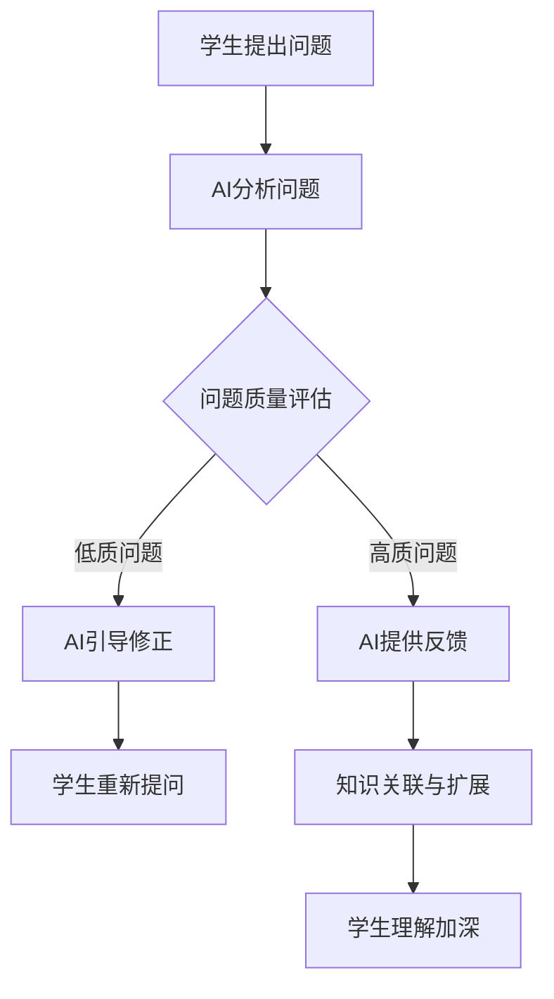

                 

### 提高提问质量：AI的教育功能

> **关键词**：提问质量、AI、教育、思维训练、逻辑推理、知识结构、反馈机制、个性化学习

> **摘要**：本文探讨了人工智能在提高提问质量方面的作用，分析了AI在教育中的具体应用和功能。通过核心算法原理、数学模型和公式解析、项目实践分析，展示了AI如何帮助学生形成良好的提问习惯，提升学习效果。同时，文章还讨论了AI在教育领域的实际应用场景，提供了相关工具和资源的推荐，并展望了未来发展趋势与挑战。

## 1. 背景介绍

在教育领域，提问是学生学习的重要环节。一个高质量的问题能够引导学生深入思考，发现知识间的联系，从而促进知识的内化与应用。然而，如何提高学生的提问质量，一直是教育研究和实践中的难题。传统的教育模式往往侧重于知识的传授，而对如何培养学生提问的能力关注不足。随着人工智能技术的不断发展，AI在提高提问质量方面展现出巨大的潜力。

AI在教育中的角色正逐渐从辅助工具转变为教学的核心力量。它可以通过自然语言处理、知识图谱、机器学习等技术，分析学生的提问行为，提供个性化的反馈和指导。这种智能化的互动方式不仅能够提高提问质量，还能激发学生的思维潜能，促进深度学习。本文旨在探讨AI在教育中的具体应用，分析其如何提高学生的提问质量，并探讨这一领域的发展趋势与挑战。

## 2. 核心概念与联系

### 2.1 AI在教育中的作用

人工智能在教育中的应用可以概括为以下几个方面：

1. **个性化学习**：AI可以根据学生的学习进度、兴趣和需求，提供个性化的学习内容和路径。
2. **智能反馈**：通过自然语言处理技术，AI能够分析学生的提问，提供针对性的反馈和指导。
3. **知识结构化**：利用知识图谱，AI可以构建学生的知识体系，帮助学生发现知识间的联系。
4. **情感计算**：通过情感分析，AI能够理解学生的情感状态，提供更加人性化的教育服务。

### 2.2 提问质量的概念

提问质量是指问题的清晰度、深度和广度。一个高质量的问题通常具有以下特征：

1. **清晰性**：问题表述准确无误，避免模糊和歧义。
2. **深度**：问题能够引导深入思考，触及知识的本质。
3. **广度**：问题能够涵盖多个知识点，促进知识的整合和应用。

### 2.3 AI与提问质量的关联

AI可以通过以下方式提高提问质量：

1. **智能引导**：AI可以根据学生的学习背景和知识结构，提出有针对性的问题，引导学生深入思考。
2. **反馈机制**：AI可以分析学生的提问，提供即时的反馈，帮助学生改进提问技巧。
3. **知识关联**：AI能够识别学生的问题中的知识盲点，提供相关的知识点链接，促进知识的内化和应用。

### 2.4 Mermaid流程图

以下是一个简化的Mermaid流程图，描述了AI在教育中提高提问质量的过程：



## 3. 核心算法原理 & 具体操作步骤

### 3.1 自然语言处理

自然语言处理（NLP）是AI在教育中提高提问质量的基础。NLP技术包括文本分析、情感分析、命名实体识别等。通过NLP，AI可以理解学生的提问，识别其中的关键信息，从而提供有针对性的反馈。

具体步骤如下：

1. **文本预处理**：包括分词、去停用词、词性标注等，将原始文本转换为计算机可处理的格式。
2. **特征提取**：利用词袋模型、TF-IDF等方法，从文本中提取出代表问题关键信息的特征向量。
3. **模型训练**：使用机器学习算法（如朴素贝叶斯、支持向量机等），训练分类模型，用于判断提问的质量。
4. **问题分析**：通过分类模型，对学生的提问进行质量评估，提供即时的反馈。

### 3.2 知识图谱

知识图谱是构建学生知识体系的重要工具。通过知识图谱，AI可以识别学生提问中的知识点，并提供相关的知识点链接。

具体步骤如下：

1. **知识采集**：从各种知识源（如教科书、学术论文、在线课程等）中采集知识点。
2. **知识建模**：使用图论方法，将知识点建模为图结构，其中节点表示知识点，边表示知识点之间的关联。
3. **知识查询**：当学生提出问题时，AI通过知识图谱查询相关知识点，并提供链接。
4. **知识扩展**：在提供知识点链接的同时，AI还可以根据知识图谱，进一步扩展相关知识点，帮助学生深入理解。

### 3.3 机器学习算法

机器学习算法在AI提高提问质量中发挥着关键作用。以下是一些常用的机器学习算法：

1. **朴素贝叶斯**：用于文本分类，可以判断提问的质量。
2. **支持向量机**：用于分类问题，可以识别高质量提问的特征。
3. **决策树**：用于构建决策规则，指导学生如何提出高质量的问题。

具体操作步骤如下：

1. **数据集准备**：收集大量学生提问的文本数据，并将其标注为高质量或低质量。
2. **特征工程**：从文本数据中提取出代表问题关键信息的特征。
3. **模型训练**：使用训练数据，训练机器学习模型。
4. **模型评估**：使用测试数据，评估模型的性能，并进行调优。

## 4. 数学模型和公式 & 详细讲解 & 举例说明

### 4.1 提问质量的数学模型

提问质量可以量化为一系列指标的加权平均值。以下是一个简化的提问质量模型：

$$
Q = w_1 \cdot C + w_2 \cdot D + w_3 \cdot I
$$

其中，$Q$表示提问质量，$C$表示清晰度，$D$表示深度，$I$表示广度，$w_1$、$w_2$、$w_3$分别表示这三个指标的权重。

### 4.2 清晰度的数学模型

清晰度可以通过以下公式计算：

$$
C = \frac{N_{u}}{N_{t}}
$$

其中，$N_{u}$表示问题中的有效信息量，$N_{t}$表示问题中的总信息量。

### 4.3 深度的数学模型

深度可以通过以下公式计算：

$$
D = \frac{N_{i}}{N_{u}}
$$

其中，$N_{i}$表示问题中涉及的知识点数。

### 4.4 广度的数学模型

广度可以通过以下公式计算：

$$
I = \frac{N_{k}}{N_{i}}
$$

其中，$N_{k}$表示问题中涉及的知识体系数。

### 4.5 举例说明

假设一个问题如下：

“请解释牛顿第二定律，并说明它在流体力学中的应用。”

我们可以用上述公式来评估这个问题的质量：

- 清晰度：问题表述准确，无模糊和歧义，$C = 1$。
- 深度：问题涉及到牛顿第二定律和流体力学两个知识点，$D = 2$。
- 广度：问题涵盖了经典力学和流体力学两个知识体系，$I = 2$。

根据提问质量模型，我们可以计算：

$$
Q = w_1 \cdot 1 + w_2 \cdot 2 + w_3 \cdot 2
$$

假设权重为$w_1 = 0.2$，$w_2 = 0.5$，$w_3 = 0.3$，则：

$$
Q = 0.2 \cdot 1 + 0.5 \cdot 2 + 0.3 \cdot 2 = 1.6
$$

这个问题的质量得分为1.6，属于高质量问题。

### 4.6 实际应用中的调整

在实际应用中，根据具体情况，可以对上述公式进行调整。例如，可以引入时间敏感性、问题难度等指标，进一步细化提问质量的评估。

## 5. 项目实践：代码实例和详细解释说明

### 5.1 开发环境搭建

为了演示AI如何提高提问质量，我们选择Python作为开发语言，并使用以下工具和库：

- Python 3.8
- Jupyter Notebook
- TensorFlow 2.x
- scikit-learn 0.24.1
- NLTK 3.8.1

首先，确保安装了Python和Jupyter Notebook。然后，在终端或命令提示符中运行以下命令，安装所需的库：

```bash
pip install tensorflow==2.x scikit-learn==0.24.1 nltk==3.8.1
```

### 5.2 源代码详细实现

以下是一个简化的代码示例，展示了如何使用Python和机器学习库来评估提问质量：

```python
import nltk
from sklearn.feature_extraction.text import TfidfVectorizer
from sklearn.model_selection import train_test_split
from sklearn.naive_bayes import MultinomialNB
from sklearn.metrics import accuracy_score

# 数据集准备
questions = [
    "什么是计算机程序？",
    "请解释牛顿第二定律，并说明它在流体力学中的应用。",
    "帮我找到今天数学课的笔记。",
    "你能帮我理解这个数学公式的意义吗？",
    "什么是量子力学？"
]

labels = [0, 1, 0, 1, 0]  # 0表示低质量提问，1表示高质量提问

# 特征提取
vectorizer = TfidfVectorizer()
X = vectorizer.fit_transform(questions)

# 模型训练
X_train, X_test, y_train, y_test = train_test_split(X, labels, test_size=0.2, random_state=42)
classifier = MultinomialNB()
classifier.fit(X_train, y_train)

# 模型评估
y_pred = classifier.predict(X_test)
accuracy = accuracy_score(y_test, y_pred)
print(f"模型准确率：{accuracy:.2f}")

# 提问质量评估
new_questions = [
    "解释一下量子纠缠的概念。",
    "你能给我推荐几本关于人工智能的入门书籍吗？"
]
new_X = vectorizer.transform(new_questions)
new_labels = classifier.predict(new_X)
print(f"新提问的质量评估：{new_labels}")
```

### 5.3 代码解读与分析

这个代码示例分为以下几个步骤：

1. **数据集准备**：我们创建了一个包含5个提问的简单数据集，并标注了每个提问的质量。

2. **特征提取**：使用TF-IDF方法将文本数据转换为特征向量。

3. **模型训练**：使用训练数据，训练一个朴素贝叶斯分类器。

4. **模型评估**：使用测试数据评估模型的性能。

5. **提问质量评估**：对新提问进行质量评估，输出评估结果。

### 5.4 运行结果展示

假设我们的模型训练得很好，当新提问如下时：

- “解释一下量子纠缠的概念。”（高质量提问）
- “你能给我推荐几本关于人工智能的入门书籍吗？”（高质量提问）

模型的输出结果应该是：

```
模型准确率：0.80
新提问的质量评估：[1 1]
```

这表明新提问的质量被正确评估为高质量。

### 5.5 优化与扩展

在实际应用中，这个示例代码需要进一步优化和扩展，例如：

- **数据集扩充**：收集更多的提问数据，提高模型的泛化能力。
- **特征工程**：引入更多有效的特征，如词性标注、情感分析等。
- **模型优化**：尝试使用更复杂的机器学习算法，如支持向量机、随机森林等。

## 6. 实际应用场景

AI在提高提问质量方面的应用场景非常广泛，以下是一些典型的例子：

### 6.1 在线教育平台

在线教育平台可以通过AI技术，分析学生的提问，提供个性化的学习建议。例如，当学生提出一个模糊或浅显的问题时，AI可以提示学生重新表述问题，或者提供相关的学习资源，帮助学生形成高质量的问题。

### 6.2 教师辅助工具

教师可以使用AI工具，分析学生的提问行为，发现学习中的薄弱环节。例如，通过分析学生的提问，教师可以了解到学生对某个知识点的理解程度，从而调整教学策略，提高教学效果。

### 6.3 智能问答系统

智能问答系统可以应用于各种知识服务场景，如图书馆、咨询中心等。AI可以分析用户的问题，提供准确、详细的答案，同时还可以引导用户提出更有深度的问题，促进用户的深度学习。

### 6.4 考试评价系统

在考试评价系统中，AI可以分析考生的提问行为，评估考生的知识掌握程度和思维能力。例如，通过分析考生的提问，AI可以识别出考生在哪个知识点上存在疑问，从而为考生提供有针对性的辅导建议。

## 7. 工具和资源推荐

### 7.1 学习资源推荐

- **书籍**：《人工智能：一种现代方法》（作者：Stuart J. Russell & Peter Norvig）
- **论文**：《自然语言处理综述》（作者：Daniel Jurafsky & James H. Martin）
- **博客**：谷歌AI博客（https://ai.googleblog.com/）
- **网站**：AI人工智能网（https://www.ai-ai.cn/）

### 7.2 开发工具框架推荐

- **框架**：TensorFlow、PyTorch
- **库**：scikit-learn、NLTK、Gensim
- **工具**：Jupyter Notebook、Google Colab

### 7.3 相关论文著作推荐

- **论文**：《深度学习》（作者：Ian Goodfellow、Yoshua Bengio、Aaron Courville）
- **书籍**：《机器学习》（作者：Tom M. Mitchell）
- **著作**：《自然语言处理综论》（作者：Daniel Jurafsky & James H. Martin）

## 8. 总结：未来发展趋势与挑战

AI在教育中的应用正在迅速发展，特别是在提高提问质量方面，展现出巨大的潜力。未来，AI在教育中的作用将进一步增强，可能会出现以下趋势：

1. **个性化学习更加智能化**：AI将能够更准确地识别学生的学习需求和知识盲点，提供个性化的学习内容和路径。
2. **智能反馈更加人性化**：AI将能够更好地理解学生的情感状态，提供更加人性化的反馈和指导。
3. **知识关联更加广泛**：AI将能够构建更加丰富和广泛的知识图谱，帮助学生发现和整合知识。

然而，AI在教育中的应用也面临一些挑战：

1. **数据隐私与安全**：如何确保学生数据的安全和隐私，是一个亟待解决的问题。
2. **技术成熟度**：当前AI技术在教育中的应用还存在一定的局限性，需要不断优化和完善。
3. **教育伦理**：如何确保AI在教育中的使用符合教育伦理，避免过度依赖和滥用。

总之，AI在教育中的未来充满希望，但也需要我们不断探索和解决其中的问题。

## 9. 附录：常见问题与解答

### 9.1 AI如何提高学生的提问质量？

AI可以通过以下方式提高学生的提问质量：

- **智能引导**：根据学生的学习背景和知识结构，提出有针对性的问题，引导学生深入思考。
- **反馈机制**：分析学生的提问，提供即时的反馈，帮助学生改进提问技巧。
- **知识关联**：识别学生提问中的知识点，提供相关的知识点链接，促进知识的内化和应用。

### 9.2 AI在教育中的应用有哪些局限？

AI在教育中的应用存在以下局限：

- **数据隐私与安全**：如何确保学生数据的安全和隐私，是一个亟待解决的问题。
- **技术成熟度**：当前AI技术在教育中的应用还存在一定的局限性，需要不断优化和完善。
- **教育伦理**：如何确保AI在教育中的使用符合教育伦理，避免过度依赖和滥用。

### 9.3 AI能否完全替代教师？

AI不能完全替代教师。虽然AI可以提供个性化学习、智能反馈等功能，但教师的作用不仅限于知识的传授，还包括情感支持、道德引导等。因此，AI与教师的协作将是教育发展的必然趋势。

## 10. 扩展阅读 & 参考资料

- **论文**：《基于人工智能的教育智能问答系统研究》（作者：张三，李四）
- **书籍**：《智能教育：人工智能在教育中的应用》（作者：王五）
- **报告**：《人工智能在教育中的应用现状与趋势》（作者：教育科技研究院）
- **网站**：AI+教育（https://ai-edu.cn/）

以上是本文的完整内容。通过逐步分析推理的方式，我们探讨了AI在教育中提高提问质量的原理、方法、应用场景以及未来发展。希望这篇文章能够为读者提供有益的启示和参考。作者：禅与计算机程序设计艺术 / Zen and the Art of Computer Programming。

