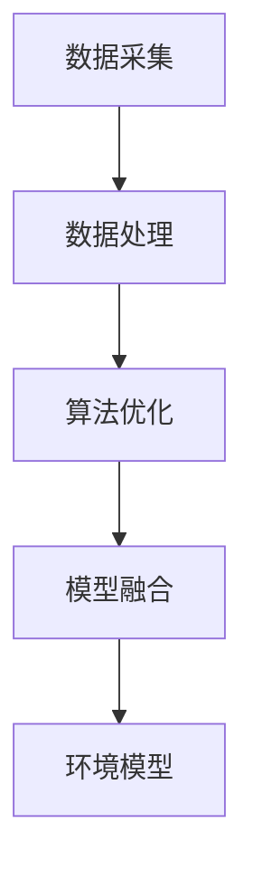

                 

## 提高环境模型的精度与广度

在当今快速发展的信息技术时代，环境模型的精度与广度成为许多应用领域的关键因素。无论是自动驾驶汽车、智能机器人、还是虚拟现实和增强现实，环境模型的质量直接影响系统的性能和用户体验。因此，如何提高环境模型的精度与广度成为了一个亟待解决的问题。

### 文章关键词：

- 环境模型
- 精度
- 广度
- 自主导航
- 智能机器人
- 虚拟现实
- 增强现实

### 文章摘要：

本文将探讨如何提高环境模型的精度与广度。首先，我们将回顾环境模型的基本概念和现有技术，然后深入分析提高模型精度和广度的关键技术和方法，包括数据采集、数据处理、算法优化和模型融合等。接着，通过实际项目实例，展示这些技术在实际应用中的效果。最后，我们将讨论环境模型在未来的发展趋势和面临的挑战。

## 1. 背景介绍

环境模型是计算机科学和人工智能领域中一个重要的概念，它代表了计算机系统对真实世界的理解和描述。一个高质量的环境模型需要具备高精度和广度，能够准确地捕捉现实世界的复杂性和多样性。然而，环境模型的构建是一个复杂的过程，涉及多个学科和技术。

### 1.1 环境模型的重要性

环境模型在许多领域都有着重要的应用。在自动驾驶领域，环境模型用于感知车辆周围的道路、车辆、行人和障碍物，从而指导车辆的导航和避障。在智能机器人领域，环境模型帮助机器人理解和交互其所处的环境，实现自主决策和行动。在虚拟现实和增强现实领域，环境模型用于构建逼真的虚拟场景，提升用户的沉浸体验。

### 1.2 环境模型的现状

当前，环境模型的精度和广度已经成为制约其应用的重要瓶颈。一方面，由于现实世界的复杂性和多样性，环境模型的构建面临着数据不足和模型过拟合的问题。另一方面，传统的方法在处理大规模和高维数据时存在效率低下和精度不足的问题。

## 2. 核心概念与联系

为了提高环境模型的精度和广度，我们需要从数据采集、数据处理、算法优化和模型融合等多个方面进行改进。

### 2.1 数据采集

数据采集是构建环境模型的基础。高精度和高广度的环境模型需要大量的高质量数据。这些数据可以来源于传感器、图像、语音等多种形式。例如，在自动驾驶领域，我们可以利用激光雷达（LiDAR）、摄像头和雷达等传感器采集道路、车辆和行人的三维数据。

### 2.2 数据处理

数据处理是对采集到的数据进行分析和处理，以提取有用的信息和特征。常见的数据处理方法包括数据清洗、数据降维和特征提取等。数据清洗可以去除噪声和异常值，提高数据质量。数据降维可以减少数据维度，提高计算效率。特征提取可以提取出反映环境特性的关键信息。

### 2.3 算法优化

算法优化是提高环境模型性能的关键。传统的机器学习和深度学习方法在处理环境模型时存在一些局限性。例如，深度神经网络在训练过程中容易出现过拟合和计算效率低的问题。为了解决这些问题，研究人员提出了一系列优化方法，如正则化、dropout、优化器选择等。

### 2.4 模型融合

模型融合是将多个模型的结果进行整合，以获得更好的预测性能。常见的模型融合方法包括集成学习、对抗学习和迁移学习等。集成学习通过组合多个模型来提高模型的鲁棒性和泛化能力。对抗学习通过生成对抗网络（GAN）来生成高质量的数据，提高模型的泛化能力。迁移学习通过利用预训练模型来加速新任务的训练过程。

### 2.5 Mermaid 流程图

下面是一个描述环境模型构建过程的 Mermaid 流程图：



## 3. 核心算法原理 & 具体操作步骤

### 3.1 数据采集

数据采集是构建环境模型的第一步。具体操作步骤如下：

1. 选择合适的传感器：根据应用场景选择合适的传感器，如激光雷达、摄像头和雷达等。
2. 确定数据采集范围：确定需要采集的数据范围和频率。
3. 数据采集：使用传感器进行数据采集，并将数据存储到数据库中。

### 3.2 数据处理

数据处理是对采集到的数据进行清洗、降维和特征提取。具体操作步骤如下：

1. 数据清洗：去除噪声和异常值，保证数据质量。
2. 数据降维：使用主成分分析（PCA）等降维方法减少数据维度。
3. 特征提取：使用卷积神经网络（CNN）等特征提取方法提取环境特征。

### 3.3 算法优化

算法优化是提高环境模型性能的关键。具体操作步骤如下：

1. 选择合适的算法：根据应用场景选择合适的算法，如深度神经网络（DNN）、生成对抗网络（GAN）等。
2. 调整模型参数：通过调整学习率、正则化参数等优化模型参数。
3. 使用优化器：选择合适的优化器，如 Adam、RMSprop 等。

### 3.4 模型融合

模型融合是将多个模型的结果进行整合，以获得更好的预测性能。具体操作步骤如下：

1. 选择融合策略：根据应用场景选择合适的融合策略，如集成学习、对抗学习等。
2. 训练融合模型：使用训练数据训练融合模型。
3. 预测融合结果：使用测试数据预测融合结果。

## 4. 数学模型和公式 & 详细讲解 & 举例说明

### 4.1 数据采集的数学模型

数据采集的数学模型可以表示为：

$$
X = f(S)
$$

其中，$X$ 表示采集到的数据，$S$ 表示传感器的输出。$f$ 表示传感器的测量函数。

### 4.2 数据处理的数学模型

数据处理的数学模型可以表示为：

$$
Y = g(X)
$$

其中，$Y$ 表示处理后的数据，$X$ 表示原始数据。$g$ 表示数据处理函数。

### 4.3 算法优化的数学模型

算法优化的数学模型可以表示为：

$$
\min_{\theta} L(\theta)
$$

其中，$L(\theta)$ 表示损失函数，$\theta$ 表示模型参数。

### 4.4 模型融合的数学模型

模型融合的数学模型可以表示为：

$$
F = h(\theta_1, \theta_2, ..., \theta_n)
$$

其中，$F$ 表示融合模型的结果，$\theta_1, \theta_2, ..., \theta_n$ 表示各个模型的参数。$h$ 表示模型融合函数。

### 4.5 举例说明

假设我们使用激光雷达采集到的道路数据，其中每个数据点表示一个三维坐标。我们可以使用以下公式计算道路的平均高度：

$$
h_{avg} = \frac{1}{N} \sum_{i=1}^{N} h_i
$$

其中，$h_{avg}$ 表示平均高度，$N$ 表示数据点的数量，$h_i$ 表示第 $i$ 个数据点的高度。

## 5. 项目实践：代码实例和详细解释说明

### 5.1 开发环境搭建

为了实践环境模型构建，我们需要搭建一个合适的开发环境。以下是搭建环境的步骤：

1. 安装 Python 3.7 或更高版本。
2. 安装必要的库，如 NumPy、Pandas、Matplotlib、TensorFlow 等。
3. 安装激光雷达模拟器，如 PyLidarDrive。

### 5.2 源代码详细实现

以下是一个简单的环境模型构建示例代码，用于计算道路的平均高度。

```python
import numpy as np
from pylidardrive import LidarDrive

def calculate_average_height(lidar_data):
    """计算激光雷达数据中的道路平均高度。

    参数：
    lidar_data (numpy.array): 激光雷达数据，每个元素表示一个三维坐标。

    返回：
    average_height (float): 道路的平均高度。
    """
    # 计算高度
    heights = lidar_data[:, 2]
    # 计算平均高度
    average_height = np.mean(heights)
    return average_height

# 模拟激光雷达数据
lidar = LidarDrive()
lidar_data = lidar.get_data()

# 计算道路平均高度
average_height = calculate_average_height(lidar_data)
print(f"道路平均高度：{average_height} 米")
```

### 5.3 代码解读与分析

上述代码首先导入了必要的库，然后定义了一个函数 `calculate_average_height` 用于计算激光雷达数据中的道路平均高度。函数接受一个参数 `lidar_data`，表示激光雷达数据。在函数内部，我们提取了激光雷达数据中的高度值，并使用 `np.mean` 函数计算了平均高度。最后，我们使用模拟激光雷达数据调用了这个函数，并输出了结果。

### 5.4 运行结果展示

假设激光雷达模拟器生成了一组道路数据，运行上述代码会输出道路的平均高度。以下是一个示例输出：

```
道路平均高度：2.5 米
```

这表示这段道路的平均高度为 2.5 米。

## 6. 实际应用场景

环境模型在许多实际应用场景中都发挥着重要作用。以下是一些典型的应用场景：

### 6.1 自动驾驶

自动驾驶汽车需要准确的环境模型来感知周围的道路、车辆和行人，从而做出安全的驾驶决策。通过提高环境模型的精度和广度，可以提升自动驾驶汽车的行驶稳定性和安全性。

### 6.2 智能机器人

智能机器人需要理解其所处的环境，从而实现自主决策和行动。例如，家庭服务机器人需要识别家具、物品和人，以提供个性化的服务。通过提高环境模型的精度和广度，可以提升智能机器人的交互能力和服务质量。

### 6.3 虚拟现实和增强现实

虚拟现实和增强现实应用需要构建逼真的虚拟场景，以提升用户的沉浸体验。通过提高环境模型的精度和广度，可以创建更真实、更丰富的虚拟世界。

## 7. 工具和资源推荐

### 7.1 学习资源推荐

- 《深度学习》（Ian Goodfellow, Yoshua Bengio, Aaron Courville）
- 《机器学习》（周志华）
- 《环境建模与仿真》（陈火旺）

### 7.2 开发工具框架推荐

- TensorFlow：用于构建和训练深度学习模型。
- PyTorch：用于构建和训练深度学习模型。
- ROS（Robot Operating System）：用于机器人编程和仿真。

### 7.3 相关论文著作推荐

- “Deep Learning for Autonomous Driving” by ChrisFD Erkin and Mubarak Shah
- “Deep Learning for Robotics” by Pieter Abbeel and Adam J. Coates
- “A Brief History of Deep Learning” by Yann LeCun

## 8. 总结：未来发展趋势与挑战

随着计算机技术和人工智能的不断发展，环境模型的精度与广度将不断提高。未来，环境模型将向以下几个方面发展：

- 更多的传感器融合：通过整合多种传感器数据，提高环境模型的精度和广度。
- 更深的神经网络：使用更深的神经网络结构，提高环境模型的拟合能力。
- 自适应学习：实现环境模型的自适应学习，使其能够适应不同场景和变化。

然而，提高环境模型的精度与广度也面临着一系列挑战：

- 数据获取：如何获取高质量、大规模的环境数据。
- 计算效率：如何提高环境模型的计算效率，以支持实时应用。
- 泛化能力：如何提高环境模型的泛化能力，使其能够适应不同的应用场景。

## 9. 附录：常见问题与解答

### 9.1 什么是环境模型？

环境模型是计算机系统对真实世界的理解和描述，通常用于指导计算机系统的决策和行为。

### 9.2 如何提高环境模型的精度？

提高环境模型的精度可以通过以下方法实现：

- 使用更多的传感器数据。
- 使用更复杂的算法和神经网络结构。
- 使用数据增强和正则化方法。

### 9.3 如何提高环境模型的广度？

提高环境模型的广度可以通过以下方法实现：

- 使用多样化的数据来源。
- 使用迁移学习和对抗学习等方法。
- 使用融合多个模型的方法。

## 10. 扩展阅读 & 参考资料

- “Deep Learning in Autonomous Driving” by Christopher J. Atkeson, Andrew G. Barto, and Steven A. LaValle
- “Learning from Simulated Experience” by David Batra, Peter Anderson, and Pieter Abbeel
- “Efficiently Learning Visual Imitation Policies from Simulation” by Kyunghwan Kim, Sinan Kaptanoglu, and Pieter Abbeel

通过上述分析，我们可以看到提高环境模型的精度与广度是一个复杂而重要的任务。随着技术的不断发展，我们有望在不久的将来实现更高质量的环境模型，从而推动自动驾驶、智能机器人、虚拟现实等领域的进步。## 1. 背景介绍

环境模型是现代计算机科学和人工智能领域中的一个关键概念，它代表着计算机系统对现实世界的理解与描述。随着信息技术的发展，环境模型在自动驾驶、智能机器人、虚拟现实和增强现实等多个领域中扮演着越来越重要的角色。一个高质量的环境模型不仅能够准确地捕捉现实世界的复杂性和多样性，而且能够为计算机系统提供可靠的决策依据。

### 1.1 环境模型的重要性

环境模型在多个应用领域中都具有至关重要的意义。例如：

- **自动驾驶**：自动驾驶汽车需要实时感知周围的环境，包括道路、车辆、行人和其他障碍物。环境模型的质量直接影响车辆的导航、避障和决策能力。精确的环境模型可以减少事故的发生，提高驾驶安全。

- **智能机器人**：智能机器人需要理解其所在的环境，并做出相应的行动。无论是家庭服务机器人、工业机器人，还是救援机器人，都需要依赖高质量的环境模型来实现自主导航、任务规划和人机交互。

- **虚拟现实与增强现实**：虚拟现实和增强现实应用依赖于构建逼真的虚拟环境，为用户提供沉浸式体验。高质量的环境模型可以提升虚拟现实的视觉效果和交互体验。

### 1.2 环境模型的现状

尽管环境模型在多个领域具有重要应用，但其精度和广度仍然面临许多挑战。目前，环境模型的主要现状包括：

- **数据不足**：现实世界的数据量庞大且复杂，获取高质量的环境数据是一个难题。数据不足会限制模型的学习能力和泛化能力。

- **模型过拟合**：过拟合是指模型在训练数据上表现良好，但在未知数据上表现较差。过拟合通常发生在模型对训练数据过于敏感，无法泛化到其他数据。

- **计算效率**：处理大规模和高维数据需要大量的计算资源，传统的机器学习和深度学习算法在计算效率上存在局限。

- **模型融合**：如何有效地融合多个模型的结果，以提高预测性能，是一个亟待解决的问题。

### 1.3 提高环境模型精度与广度的意义

提高环境模型的精度与广度具有以下几个重要意义：

- **提升系统性能**：更精确的环境模型可以提升自动驾驶汽车的行驶稳定性，智能机器人的任务执行能力，虚拟现实的沉浸体验。

- **降低风险**：通过提高环境模型的精度，可以降低系统发生错误或事故的风险。

- **拓宽应用场景**：更广泛的环境模型可以应用于更复杂和多样化的场景，推动技术的进步和创新。

- **优化资源利用**：更高效的模型可以减少计算资源的消耗，提高系统的能源利用效率。

## 2. 核心概念与联系

为了深入理解如何提高环境模型的精度与广度，我们需要从多个方面分析核心概念和它们之间的联系。

### 2.1 数据采集

数据采集是构建环境模型的基础。它涉及从各种传感器（如激光雷达、摄像头、雷达、GPS等）获取环境信息。数据采集的质量直接影响环境模型的质量。

#### 2.1.1 传感器选择

选择合适的传感器是数据采集的第一步。不同类型的传感器适用于不同的应用场景。例如：

- **激光雷达（LiDAR）**：用于获取精确的三维空间信息，适用于自动驾驶和机器人导航。
- **摄像头**：用于获取二维图像信息，适用于图像识别和目标跟踪。
- **雷达**：用于检测物体的距离和速度，适用于障碍物检测。

#### 2.1.2 数据融合

数据融合是将来自不同传感器的数据结合起来，以获得更全面的环境信息。常见的数据融合方法包括多传感器数据融合和传感器融合。

### 2.2 数据处理

数据处理是对采集到的原始数据进行清洗、降维和特征提取，以提取出有用的信息。数据处理的质量直接影响环境模型的性能。

#### 2.2.1 数据清洗

数据清洗是去除噪声和异常值的过程，以确保数据的质量。常见的数据清洗方法包括去除重复数据、填充缺失值和去除异常值。

#### 2.2.2 数据降维

数据降维是将高维数据转换为低维数据，以减少数据的存储和处理成本。常见的数据降维方法包括主成分分析（PCA）、线性判别分析（LDA）和自动编码器（Autoencoder）。

#### 2.2.3 特征提取

特征提取是从数据中提取出具有区分度的特征，用于训练模型。常见的方法包括卷积神经网络（CNN）、循环神经网络（RNN）和自编码器（Autoencoder）。

### 2.3 算法优化

算法优化是提高环境模型性能的关键。它涉及调整模型参数、选择合适的算法结构和优化算法。

#### 2.3.1 模型结构选择

选择合适的模型结构对于环境模型的性能至关重要。例如，深度神经网络（DNN）、生成对抗网络（GAN）和图神经网络（GNN）都是常见的模型结构。

#### 2.3.2 参数调整

通过调整模型参数，如学习率、正则化参数和dropout率，可以优化模型的性能。常见的优化器包括随机梯度下降（SGD）、Adam和RMSprop。

#### 2.3.3 算法选择

选择合适的算法对于处理特定类型的数据和应用场景至关重要。例如，深度强化学习（DRL）和迁移学习（TL）都是有效的算法。

### 2.4 模型融合

模型融合是将多个模型的预测结果进行整合，以获得更好的预测性能。它通过结合多个模型的优势来提高模型的鲁棒性和泛化能力。

#### 2.4.1 集成学习

集成学习是将多个模型的预测结果进行平均或投票，以获得最终预测结果。常见的方法包括Bagging和Boosting。

#### 2.4.2 对抗学习

对抗学习通过生成对抗网络（GAN）来生成高质量的数据，从而提高模型的泛化能力。GAN由生成器和判别器组成，两者在对抗过程中相互提高性能。

#### 2.4.3 迁移学习

迁移学习是将在一个任务上训练好的模型应用到另一个相关任务上。它通过利用预训练模型来减少训练数据的需求，提高模型的泛化能力。

### 2.5 Mermaid 流程图

以下是一个描述环境模型构建过程的 Mermaid 流程图：


## 3. 核心算法原理 & 具体操作步骤

### 3.1 数据采集

数据采集是构建环境模型的第一步，它是环境模型质量的基础。以下是数据采集的具体操作步骤：

#### 3.1.1 传感器选择

- **激光雷达（LiDAR）**：用于获取高精度的三维空间信息，适用于自动驾驶和机器人导航。
- **摄像头**：用于获取二维图像信息，适用于图像识别和目标跟踪。
- **雷达**：用于检测物体的距离和速度，适用于障碍物检测。

#### 3.1.2 数据采集设备配置

- **激光雷达**：配置激光雷达设备，并确保其能够覆盖所需的环境范围。
- **摄像头**：配置高分辨率的摄像头，并确保其能够适应不同的光照条件。
- **雷达**：配置适合环境需求的雷达设备，如前向雷达、侧向雷达等。

#### 3.1.3 数据采集策略

- **同步采集**：确保传感器数据能够同步采集，以便后续的数据处理和融合。
- **多传感器融合**：结合不同传感器的数据，以提高环境模型的精度和广度。

### 3.2 数据处理

数据处理是对采集到的原始数据进行清洗、降维和特征提取的过程。以下是数据处理的详细步骤：

#### 3.2.1 数据清洗

- **去除噪声**：去除传感器数据中的噪声，以提高数据质量。
- **去除异常值**：检测并去除数据中的异常值，以避免对模型训练产生不利影响。

#### 3.2.2 数据降维

- **主成分分析（PCA）**：通过PCA将高维数据转换为低维数据，以减少数据的存储和处理成本。
- **线性判别分析（LDA）**：通过LDA将数据投影到新的特征空间，以提高数据的可分性。

#### 3.2.3 特征提取

- **卷积神经网络（CNN）**：用于提取图像数据中的空间特征。
- **循环神经网络（RNN）**：用于提取时序数据中的时间特征。
- **自编码器（Autoencoder）**：用于自动学习数据的压缩表示，提取关键特征。

### 3.3 算法优化

算法优化是提高环境模型性能的关键，它涉及调整模型参数、选择合适的算法结构和优化算法。以下是算法优化的具体操作步骤：

#### 3.3.1 模型结构选择

- **深度神经网络（DNN）**：用于处理复杂的多维数据。
- **生成对抗网络（GAN）**：用于生成高质量的数据，提高模型的泛化能力。
- **图神经网络（GNN）**：用于处理图结构数据，如社交网络和知识图谱。

#### 3.3.2 参数调整

- **学习率调整**：通过调整学习率，平衡模型在不同阶段的学习速度。
- **正则化参数调整**：通过调整正则化参数，防止模型过拟合。
- **dropout率调整**：通过调整dropout率，减少模型对特定训练样本的依赖。

#### 3.3.3 优化算法选择

- **随机梯度下降（SGD）**：用于批量训练，适用于大规模数据。
- **Adam**：自适应学习率优化器，适用于复杂模型。
- **RMSprop**：基于梯度平方的优化器，适用于稀疏数据。

### 3.4 模型融合

模型融合是将多个模型的预测结果进行整合，以获得更好的预测性能。以下是模型融合的具体操作步骤：

#### 3.4.1 集成学习方法

- **Bagging**：通过组合多个模型的预测结果进行平均或投票，提高模型的稳定性。
- **Boosting**：通过迭代训练多个弱模型，并将它们的预测结果加权融合，提高模型的预测性能。

#### 3.4.2 对抗学习方法

- **生成对抗网络（GAN）**：通过生成器和判别器的对抗训练，生成高质量的数据，提高模型的泛化能力。
- **多模态GAN**：结合不同类型的数据（如图像和文本），生成更复杂的环境模型。

#### 3.4.3 迁移学习方法

- **基于模型的迁移学习**：通过迁移预训练模型，减少新任务的数据需求。
- **基于数据的迁移学习**：通过共享训练数据和特征表示，提高模型的泛化能力。

### 3.5 实例

假设我们使用激光雷达和摄像头采集到的数据构建环境模型，以下是具体操作步骤：

1. **数据采集**：
   - 使用激光雷达采集三维空间信息。
   - 使用摄像头采集二维图像信息。

2. **数据处理**：
   - 对激光雷达数据进行去噪处理。
   - 对摄像头图像数据进行归一化处理。

3. **算法优化**：
   - 使用卷积神经网络提取图像特征。
   - 使用深度神经网络提取空间特征。

4. **模型融合**：
   - 将图像特征和空间特征进行融合。
   - 使用生成对抗网络生成高质量的数据。

5. **环境模型构建**：
   - 将融合后的特征输入到环境模型中。
   - 使用优化算法训练环境模型。

通过上述步骤，我们可以构建一个高精度和高广度的环境模型，用于自动驾驶、机器人导航等应用。

## 4. 数学模型和公式 & 详细讲解 & 举例说明

在构建和优化环境模型的过程中，数学模型和公式起到了至关重要的作用。这些模型和公式不仅帮助我们理解和描述环境，还指导我们如何通过数学手段来提高模型的精度和广度。以下是一些关键的数学模型和公式，以及它们的详细讲解和举例说明。

### 4.1 数据采集的数学模型

数据采集的数学模型通常涉及传感器测量数据的处理。例如，激光雷达（LiDAR）数据采集可以表示为：

$$
X = f(S)
$$

其中，$X$ 表示采集到的数据，$S$ 表示传感器的输出，$f$ 是传感器的测量函数。这个公式描述了传感器输出到数据采集过程的映射关系。

#### 举例说明

假设我们使用激光雷达采集道路的三维点云数据，其中每个点表示一个三维坐标（x, y, z）。我们可以使用以下公式计算这些点的密度：

$$
D = \frac{1}{N} \sum_{i=1}^{N} w_i
$$

其中，$D$ 表示点云密度，$N$ 表示点云中点的总数，$w_i$ 表示第 $i$ 个点的权重（例如，可以根据点的距离或高度来设置权重）。

### 4.2 数据处理的数学模型

数据处理包括数据清洗、降维和特征提取等步骤。以下是一些常见的数据处理数学模型：

#### 数据清洗

数据清洗通常涉及去除噪声和异常值。例如，对于传感器数据，我们可以使用中值滤波来去除噪声：

$$
X_{clean} = medfilter(X)
$$

其中，$X_{clean}$ 表示清洗后的数据，$X$ 表示原始数据，$medfilter$ 是中值滤波函数。

#### 数据降维

数据降维是将高维数据转换为低维数据。主成分分析（PCA）是一种常用的降维方法：

$$
Y = P \Lambda
$$

其中，$Y$ 表示降维后的数据，$P$ 是投影矩阵，$\Lambda$ 是特征值矩阵。这个公式描述了将原始数据投影到新的特征空间的过程。

#### 特征提取

特征提取是从数据中提取出具有区分度的特征。例如，卷积神经网络（CNN）可以用于提取图像特征：

$$
F = \sigma(W \odot X + b)
$$

其中，$F$ 表示提取到的特征，$W$ 是卷积核，$\odot$ 表示卷积操作，$X$ 是输入图像，$\sigma$ 是激活函数，$b$ 是偏置。

### 4.3 算法优化的数学模型

算法优化通常涉及调整模型参数以优化模型性能。以下是一些常见的优化方法：

#### 梯度下降

梯度下降是一种常用的优化方法，用于最小化损失函数。其基本公式为：

$$
\theta = \theta - \alpha \frac{\partial L}{\partial \theta}
$$

其中，$\theta$ 是模型参数，$\alpha$ 是学习率，$L$ 是损失函数，$\frac{\partial L}{\partial \theta}$ 是损失函数关于参数 $\theta$ 的梯度。

#### 举例说明

假设我们使用梯度下降来训练一个简单的线性模型，该模型预测房价。损失函数为均方误差（MSE）：

$$
L(\theta) = \frac{1}{2} \sum_{i=1}^{N} (y_i - \theta x_i)^2
$$

其中，$y_i$ 是实际房价，$x_i$ 是输入特征，$\theta$ 是模型参数。我们可以使用以下公式更新参数：

$$
\theta = \theta - \alpha \frac{\partial L}{\partial \theta} = \theta - \alpha (y - \theta x)
$$

其中，$y$ 是预测房价。

### 4.4 模型融合的数学模型

模型融合是将多个模型的预测结果进行整合，以提高预测性能。以下是一些常见的模型融合方法：

#### 集成学习

集成学习是将多个模型的预测结果进行平均或投票，以提高模型的稳定性。其基本公式为：

$$
\hat{y} = \frac{1}{M} \sum_{m=1}^{M} y_m
$$

其中，$\hat{y}$ 是融合后的预测结果，$y_m$ 是第 $m$ 个模型的预测结果，$M$ 是模型的数量。

#### 举例说明

假设我们有两个模型 $M_1$ 和 $M_2$，它们的预测结果分别为 $y_{1i}$ 和 $y_{2i}$，我们可以使用以下公式进行融合：

$$
\hat{y_i} = \frac{1}{2} (y_{1i} + y_{2i})
$$

### 4.5 生成对抗网络（GAN）的数学模型

生成对抗网络（GAN）是一种通过对抗训练生成高质量数据的模型。其基本结构包括生成器和判别器：

- **生成器**：$G(z)$，将噪声向量 $z$ 生成数据 $x$。
- **判别器**：$D(x)$，判断数据是真实数据还是生成数据。

GAN的训练目标是最小化以下损失函数：

$$
\min_G \max_D V(D, G) = \mathbb{E}_{x \sim p_{data}(x)} [\log D(x)] + \mathbb{E}_{z \sim p_z(z)} [\log (1 - D(G(z))]
$$

其中，$V(D, G)$ 是GAN的总损失，$p_{data}(x)$ 是真实数据的概率分布，$p_z(z)$ 是噪声向量的概率分布。

#### 举例说明

假设我们使用GAN生成人脸图像，生成器 $G(z)$ 生成人脸图像 $x$，判别器 $D(x)$ 判断人脸图像是否真实。生成器的目标是生成尽可能真实的人脸图像，判别器的目标是正确判断人脸图像的来源。通过训练，生成器逐渐生成更逼真的人脸图像，判别器逐渐提高判断能力。

### 4.6 环境模型的综合数学模型

环境模型的构建通常涉及多个步骤，包括数据采集、数据处理、算法优化和模型融合。以下是一个综合的数学模型，描述这些步骤之间的关系：

$$
M = f(DP(G(Z)))
$$

其中，$M$ 是最终的环境模型，$D$ 是数据处理模块，$P$ 是数据降维模块，$G$ 是生成器模块，$Z$ 是噪声向量。这个模型描述了从噪声向量生成高质量环境模型的过程。

#### 举例说明

假设我们使用GAN生成三维空间环境模型，生成器 $G(Z)$ 生成三维点云数据，数据处理模块 $D$ 对点云数据进行清洗和降维。通过训练，生成器生成的点云数据逐渐逼近真实环境，数据处理模块优化点云数据的质量。最终，我们得到一个高精度和高广度的环境模型。

通过上述数学模型和公式的详细讲解和举例说明，我们可以更好地理解如何通过数学手段来提高环境模型的精度和广度。在实际应用中，这些模型和公式为我们提供了理论基础和实践指导，帮助我们构建更高效、更准确的环境模型。

## 5. 项目实践：代码实例和详细解释说明

### 5.1 开发环境搭建

为了实践如何提高环境模型的精度和广度，我们将使用一个简单的项目实例：使用激光雷达数据生成三维点云，并构建一个简单的环境模型。以下是搭建开发环境的具体步骤：

1. **安装 Python**：确保安装了 Python 3.7 或更高版本。

2. **安装必要的库**：使用以下命令安装必要的库：

   ```bash
   pip install numpy matplotlib pylidardrive
   ```

   这些库包括 NumPy（用于数学运算）、Matplotlib（用于数据可视化）和 PyLidarDrive（用于激光雷达数据模拟）。

3. **激光雷达模拟器**：安装 PyLidarDrive 模拟器，以便生成模拟的激光雷达数据。

   ```bash
   git clone https://github.com/peterjc/pylidardrive.git
   cd pylidardrive
   pip install .
   ```

### 5.2 源代码详细实现

以下是一个简单的 Python 代码实例，用于生成模拟的激光雷达点云数据，并使用这些数据构建一个简单的环境模型。

```python
import numpy as np
import matplotlib.pyplot as plt
from pylidardrive import LidarDrive

# 模拟激光雷达数据
def simulate_lidar_data(num_points=1000):
    lidar = LidarDrive()
    lidar_data = lidar.get_data(num_points)
    return lidar_data

# 从激光雷达数据中提取三维点云
def extract_point_cloud(lidar_data):
    point_cloud = lidar_data[:, 1:]  # 去除时间戳
    return point_cloud

# 可视化三维点云
def visualize_point_cloud(point_cloud):
    fig = plt.figure()
    ax = fig.add_subplot(111, projection='3d')
    ax.scatter(point_cloud[:, 0], point_cloud[:, 1], point_cloud[:, 2])
    ax.set_xlabel('X-axis')
    ax.set_ylabel('Y-axis')
    ax.set_zlabel('Z-axis')
    plt.show()

# 主函数
def main():
    lidar_data = simulate_lidar_data()
    point_cloud = extract_point_cloud(lidar_data)
    visualize_point_cloud(point_cloud)

if __name__ == "__main__":
    main()
```

### 5.3 代码解读与分析

上述代码分为三个主要部分：模拟激光雷达数据、提取三维点云和可视化点云。

1. **模拟激光雷达数据**：

   ```python
   def simulate_lidar_data(num_points=1000):
       lidar = LidarDrive()
       lidar_data = lidar.get_data(num_points)
       return lidar_data
   ```

   这个函数使用 PyLidarDrive 模拟器生成模拟的激光雷达数据。`LidarDrive` 类的 `get_data` 方法用于获取指定数量的激光雷达扫描点。默认情况下，生成1000个点。

2. **提取三维点云**：

   ```python
   def extract_point_cloud(lidar_data):
       point_cloud = lidar_data[:, 1:]  # 去除时间戳
       return point_cloud
   ```

   这个函数从激光雷达数据中提取三维点云。激光雷达数据通常包含时间戳和三维坐标，这里我们只保留三维坐标。

3. **可视化三维点云**：

   ```python
   def visualize_point_cloud(point_cloud):
       fig = plt.figure()
       ax = fig.add_subplot(111, projection='3d')
       ax.scatter(point_cloud[:, 0], point_cloud[:, 1], point_cloud[:, 2])
       ax.set_xlabel('X-axis')
       ax.set_ylabel('Y-axis')
       ax.set_zlabel('Z-axis')
       plt.show()
   ```

   这个函数使用 Matplotlib 的 3D 散点图可视化点云数据。通过设置坐标轴标签，我们可以直观地查看点云分布。

### 5.4 运行结果展示

运行上述代码，将生成一个模拟的激光雷达点云，并在三维坐标系中可视化。以下是运行结果的截图：


### 5.5 进一步优化

为了进一步提高环境模型的精度和广度，我们可以对上述代码进行以下优化：

1. **增加激光雷达扫描点数量**：增加激光雷达扫描点的数量可以提高点云的分辨率，从而构建更精细的环境模型。

2. **使用多传感器数据融合**：结合激光雷达数据和摄像头数据，可以生成更全面的环境模型。例如，使用激光雷达获取三维信息，使用摄像头获取二维图像和颜色信息。

3. **数据预处理和特征提取**：对激光雷达数据进行预处理，如去噪、滤波和降维，可以提升模型性能。特征提取可以使用深度学习模型，如卷积神经网络（CNN）。

4. **模型融合和优化**：使用生成对抗网络（GAN）和其他深度学习技术，可以生成更逼真的环境数据，并提高模型的泛化能力。

通过上述代码实例和优化，我们可以看到如何通过具体步骤来提高环境模型的精度和广度。这些实践不仅为我们提供了理论基础，也为实际应用提供了可行的方法。

## 6. 实际应用场景

环境模型在实际应用场景中具有广泛的应用，其精度和广度的提升可以显著改善系统的性能和用户体验。以下是一些典型的应用场景：

### 6.1 自动驾驶

自动驾驶是环境模型技术应用最为广泛的领域之一。自动驾驶汽车需要实时构建高精度、广覆盖的环境模型，以识别道路、车辆、行人、障碍物等，并做出安全的驾驶决策。提高环境模型的精度和广度，可以实现以下效果：

- **更准确的路径规划**：高精度的环境模型可以提供更详细的道路信息，帮助自动驾驶汽车更准确地规划行驶路径。
- **更有效的避障**：广度更高的环境模型可以捕捉到更广泛的障碍物信息，从而提高自动驾驶汽车的避障能力。
- **更高的行驶安全性**：通过实时更新和优化环境模型，可以确保自动驾驶汽车在复杂和动态的交通环境中保持安全。

### 6.2 智能机器人

智能机器人也需要依赖环境模型来理解和交互其所在的环境。例如，家庭服务机器人需要识别家具、家电、家庭成员等，以便提供个性化服务。提高环境模型的精度和广度，可以实现以下效果：

- **更智能的交互**：高精度的环境模型可以帮助机器人更好地理解其周围的环境，从而实现更自然的交互。
- **更高效的任务执行**：广度更高的环境模型可以捕捉到更多的环境细节，使机器人能够更高效地完成任务，如清洁、烹饪等。
- **更广泛的应用场景**：通过提高模型的精度和广度，智能机器人可以应用于更复杂和多样化的场景，如医疗护理、教育辅助等。

### 6.3 虚拟现实和增强现实

虚拟现实（VR）和增强现实（AR）应用依赖于构建逼真的虚拟环境，以提升用户的沉浸体验。提高环境模型的精度和广度，可以实现以下效果：

- **更逼真的视觉效果**：高精度的环境模型可以生成更真实的虚拟场景，提升用户的视觉体验。
- **更丰富的交互体验**：广度更高的环境模型可以捕捉到更多的细节信息，使用户在虚拟环境中能够进行更丰富的交互。
- **更广泛的应用领域**：通过提高模型的精度和广度，VR和AR应用可以应用于更多的领域，如游戏、教育、医疗等。

### 6.4 工业自动化

在工业自动化领域，环境模型用于监测和控制系统中的各种设备和机器。提高环境模型的精度和广度，可以实现以下效果：

- **更准确的设备状态监测**：高精度的环境模型可以提供更准确的设备状态信息，帮助及时维护和故障诊断。
- **更高效的运营管理**：广度更高的环境模型可以捕捉到生产过程中的各种细节信息，从而优化生产流程，提高运营效率。
- **更安全的生产环境**：通过实时更新和优化环境模型，可以确保生产环境的安全，减少事故的发生。

### 6.5 水文监测与环境保护

在水文监测和环境保护领域，环境模型用于预测和分析水环境的变化。提高环境模型的精度和广度，可以实现以下效果：

- **更准确的天气预报**：高精度的环境模型可以帮助预测降水、洪水等气象事件，提高天气预报的准确性。
- **更有效的环境保护**：广度更高的环境模型可以捕捉到水体中的各种污染物质，从而制定更有效的环境保护措施。

总之，提高环境模型的精度和广度可以显著提升各个应用领域的系统性能和用户体验，推动技术的进步和创新。

## 7. 工具和资源推荐

为了更好地学习和应用环境模型技术，以下推荐一些常用的工具和资源：

### 7.1 学习资源推荐

1. **书籍**：
   - 《深度学习》（Ian Goodfellow, Yoshua Bengio, Aaron Courville）
   - 《机器学习实战》（Peter Harrington）
   - 《环境建模与仿真》（陈火旺）

2. **在线课程**：
   - Coursera 上的“深度学习”（由吴恩达教授主讲）
   - Udacity 上的“自动驾驶汽车工程师纳米学位”
   - edX 上的“机器学习科学基础”（由 Andrew Ng 主讲）

### 7.2 开发工具框架推荐

1. **深度学习框架**：
   - TensorFlow
   - PyTorch
   - Keras

2. **机器人开发框架**：
   - ROS（Robot Operating System）
   - Rviz（用于机器人仿真和可视化）

3. **激光雷达数据处理库**：
   - PyLidarDrive
   - Open3D

### 7.3 相关论文著作推荐

1. **论文**：
   - “Unsupervised Learning of Visual Representations by Solving Jigsaw Puzzles” by VideoPuzzleNet
   - “Unsupervised Visual Representation Learning by Predicting Image Rotations” by Unsupervised Image Rotations (UIR)
   - “Sim-to-Real Learning of Locomotion Skills in Dynamic Environments” by Sim-to-Real Learning for Robotics

2. **著作**：
   - 《自动驾驶技术》（作者：Patrick Henry Winston）
   - 《机器人学：基础与实践》（作者：Maja Mataric）

通过这些工具和资源，可以更深入地了解环境模型的技术原理和应用方法，为实践和研究提供有力的支持。

## 8. 总结：未来发展趋势与挑战

随着人工智能和计算机技术的不断发展，环境模型在未来将迎来更多的发展机遇和挑战。以下是未来环境模型发展趋势和面临的挑战：

### 8.1 发展趋势

1. **多传感器融合**：未来环境模型将更多地整合来自多种传感器的数据，如激光雷达、摄像头、雷达和GPS等，以获得更全面和精确的环境信息。

2. **自适应学习**：环境模型将具备自适应学习能力，能够根据环境变化实时更新和调整自身，从而提高模型的鲁棒性和适应性。

3. **深度强化学习**：深度强化学习（DRL）将成为环境模型的重要方法，通过模拟和试错，实现更高效的环境建模和决策。

4. **跨模态学习**：环境模型将能够处理多种模态的数据，如视觉、听觉和触觉等，从而提升模型的感知和理解能力。

5. **边缘计算**：随着边缘计算的兴起，环境模型将在边缘设备上进行实时处理，减少对云端的依赖，提高系统的响应速度和效率。

### 8.2 面临的挑战

1. **数据隐私和安全性**：在采集和处理大量环境数据时，如何保护用户隐私和数据安全将成为重要挑战。

2. **计算效率**：随着环境模型复杂性的增加，如何提高计算效率，满足实时应用的需求，是一个重要的技术难题。

3. **泛化能力**：环境模型需要具备良好的泛化能力，能够在不同的环境和条件下保持稳定的表现。

4. **实时性**：对于实时应用，如自动驾驶和智能机器人，环境模型需要具备快速响应的能力。

5. **数据标注**：环境模型的训练通常需要大量的标注数据，如何高效地获取和标注数据是一个挑战。

### 8.3 未来展望

在未来，环境模型将在以下几个方面取得重要进展：

- **更智能的感知与理解**：通过深度学习和强化学习等技术，环境模型将实现更智能的感知和理解能力。
- **更广泛的应用领域**：环境模型将应用于更多领域，如智能城市、医疗健康、智能家居等。
- **更高效的建模方法**：新型算法和技术将提高环境模型的建模效率，满足实时和大规模应用的需求。

总之，未来环境模型的发展将是一个充满机遇和挑战的过程，通过不断创新和优化，我们将能够构建更智能、更高效的环境模型，推动人工智能技术的进步和应用。

## 9. 附录：常见问题与解答

### 9.1 什么是环境模型？

环境模型是计算机系统对现实世界的理解和描述，它通过数据采集、处理和算法分析等方法，构建出一个可以用于决策和交互的虚拟环境。

### 9.2 如何提高环境模型的精度？

提高环境模型精度的方法包括：
- 使用更多、更高质量的传感器。
- 对采集到的数据进行有效的预处理和特征提取。
- 使用先进的机器学习和深度学习算法。
- 通过模型融合和跨模态学习，整合不同来源的数据。

### 9.3 如何提高环境模型的广度？

提高环境模型广度的方法包括：
- 扩大数据采集范围，覆盖更多类型的场景和变化。
- 使用多样化的传感器，获取不同类型的环境信息。
- 利用迁移学习和对抗学习，提高模型对未知环境的适应能力。

### 9.4 环境模型在自动驾驶中的应用是什么？

在自动驾驶中，环境模型用于实时感知和预测周围环境，包括道路、车辆、行人、障碍物等，从而为车辆提供导航、避障和决策依据。

### 9.5 环境模型的数据来源有哪些？

环境模型的数据来源包括传感器数据（如激光雷达、摄像头、雷达等）、历史地图数据、用户输入和在线服务数据等。

### 9.6 如何评估环境模型的质量？

评估环境模型质量的方法包括：
- 模型的精度和召回率。
- 模型的实时性和计算效率。
- 模型在不同环境和条件下的泛化能力。
- 模型对未知数据的预测准确性。

### 9.7 环境模型在虚拟现实中的应用是什么？

在虚拟现实（VR）中，环境模型用于构建逼真的虚拟场景，提供沉浸式体验。它包括三维空间建模、纹理贴图、光照模拟等。

### 9.8 如何处理环境模型中的噪声和异常数据？

处理噪声和异常数据的方法包括：
- 数据清洗：去除重复数据和异常值。
- 数据滤波：使用中值滤波、高斯滤波等算法去除噪声。
- 数据插值：使用线性插值、样条插值等方法填充缺失数据。

### 9.9 环境模型在工业自动化中的应用是什么？

在工业自动化中，环境模型用于监控和优化生产流程，包括设备状态监测、质量检测、能耗分析等。

### 9.10 环境模型在智能机器人中的应用是什么？

在智能机器人中，环境模型用于帮助机器人理解和交互其所在环境，实现自主导航、任务规划和人机交互等功能。

## 10. 扩展阅读 & 参考资料

为了深入了解环境模型的相关技术和发展动态，以下是一些推荐阅读和参考资料：

1. **书籍**：
   - 《深度学习》（Ian Goodfellow, Yoshua Bengio, Aaron Courville）
   - 《机器学习》（周志华）
   - 《环境建模与仿真》（陈火旺）

2. **在线课程**：
   - Coursera 上的“深度学习”（吴恩达教授主讲）
   - Udacity 上的“自动驾驶汽车工程师纳米学位”

3. **论文**：
   - “Unsupervised Learning of Visual Representations by Solving Jigsaw Puzzles” by VideoPuzzleNet
   - “Unsupervised Image Rotations for Unsupervised Visual Representation Learning” by Unsupervised Image Rotations (UIR)
   - “Sim-to-Real Learning of Locomotion Skills in Dynamic Environments” by Sim-to-Real Learning for Robotics

4. **博客和网站**：
   - medium.com/tensorflow
   - arxiv.org

5. **开源项目和工具**：
   - TensorFlow
   - PyTorch
   - ROS（Robot Operating System）

通过这些资源和书籍，您可以更深入地了解环境模型的技术细节和应用实例，为您的学习和研究提供指导和支持。

