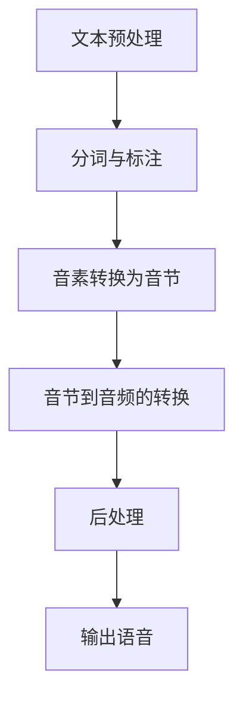

                 

### 1. 背景介绍

在人工智能和语音技术迅猛发展的今天，语音合成作为人机交互的重要环节，正逐渐成为各行各业的热门技术。搜狗公司作为国内领先的人工智能企业，早在2012年便开始布局语音合成技术，并在多年的研发积累中，取得了显著的成果。到2025年，搜狗语音合成技术已经达到了国际领先水平，支持包括中文在内的多种语言，为用户提供高质量的语音合成服务。

多语言语音合成工程师，作为这一领域的关键角色，其职责不仅在于研发高质量的语音合成算法，还包括针对不同语言特点和发音规则进行适配优化，以满足全球用户的需求。在这一背景下，搜狗2025年启动了多语言语音合成工程师的社招项目，旨在吸引一批具有深厚技术背景和实际项目经验的专业人才，共同推进多语言语音合成技术的研发和应用。

本文将围绕搜狗2025多语言语音合成工程师社招面试的相关内容进行详细介绍，包括岗位要求、面试准备、常见问题及解答等。希望通过本文，能够帮助有意向加入搜狗语音合成团队的你，更好地了解面试的流程和准备方法，顺利通过面试，成为这个创新团队的一员。

### 2. 核心概念与联系

在深入探讨搜狗2025多语言语音合成工程师社招面试之前，我们需要先理解几个核心概念，这些概念不仅构成了语音合成技术的理论基础，也是面试过程中可能涉及的重要知识点。

#### 2.1. 语音合成的基本概念

语音合成（Text-to-Speech，简称TTS）是一种将文本转换为自然流畅语音的技术。它通常涉及以下几个关键步骤：

1. **文本预处理**：将输入文本转换为适合TTS系统的格式，包括分词、语气标注、声调标注等。
2. **音素转换为音节**：将文本中的词语转换为对应的音素序列。
3. **音节到音频的转换**：将音素序列转换为相应的音频信号，通常通过合成器实现。
4. **后处理**：对生成的语音进行调音、去噪、音色调整等，以提升语音的自然度和可听性。

#### 2.2. 多语言语音合成

多语言语音合成则是在单语言语音合成的基础上，增加了对不同语言的适应性。它需要考虑不同语言的发音规则、语调、节奏和音调变化。例如，中文的声调变化与英语的语调起伏有很大不同，这就要求多语言语音合成系统具备较强的适应能力。

#### 2.3. Mermaid 流程图表示

为了更好地理解语音合成的基本流程，我们可以使用Mermaid绘制一个简化的流程图，如下所示：



在这个流程图中，A到F代表了语音合成的各个步骤，每个步骤都至关重要，缺一不可。

#### 2.4. 语音合成与自然语言处理（NLP）的联系

语音合成技术与自然语言处理（NLP）有着紧密的联系。NLP技术可以为语音合成提供更加精准的文本理解，从而生成更加自然的语音输出。例如，NLP可以用于分析文本的情感倾向、提取关键词、构建语法结构等，这些信息都可以用来指导语音合成，使其更加贴近用户的实际需求。

#### 2.5. 语音合成与人工智能（AI）的联系

随着人工智能技术的发展，语音合成技术也在不断进步。深度学习技术，如循环神经网络（RNN）和变换器模型（Transformer），已经在语音合成中得到了广泛应用。这些技术可以显著提升语音合成的自然度和准确度，使得生成的语音更加逼真、自然。

综上所述，语音合成技术是一个复杂的系统，它不仅涉及到语音处理、音频信号处理等专业知识，还与自然语言处理、人工智能等技术领域紧密相关。对于多语言语音合成工程师来说，理解这些核心概念及其相互联系，是成功应对社招面试的关键。

### 3. 核心算法原理 & 具体操作步骤

在深入探讨语音合成技术的核心算法原理和具体操作步骤之前，我们需要了解两种主流的语音合成方法：规则合成和统计合成。

#### 3.1. 规则合成

规则合成（Rule-Based Synthesis，简称RBS）是一种基于预定规则和算法的语音合成方法。其基本原理是按照一定的规则将文本转换为语音。规则合成通常包括以下几个关键步骤：

1. **文本预处理**：将输入文本进行分词和句法分析，为后续的语音生成做好准备。
2. **声学模型**：使用预定义的声学模型来生成语音信号。声学模型通常包括音素到音节、音节到韵律、韵律到音频等几个层次。
3. **规则库**：根据语音合成规则库中的规则，将文本转换为相应的语音信号。规则库通常包括音素发音规则、音节组合规则、声调变化规则等。
4. **音频生成**：通过音频合成器将生成的语音信号输出为音频文件。

规则合成的优点在于其生成过程可控，便于调试和优化。然而，由于规则合成的语音质量受到规则库的限制，其自然度往往不如统计合成。

#### 3.2. 统计合成

统计合成（Statistical Parametric Synthesis，简称SPS）是一种基于统计模型和机器学习的语音合成方法。其基本原理是通过学习大量的语音数据，构建统计模型来生成语音信号。统计合成通常包括以下几个关键步骤：

1. **数据收集与预处理**：收集大量的语音数据，并进行预处理，包括分词、标注、归一化等。
2. **模型训练**：使用训练数据训练语音合成模型，常见的模型包括隐藏马尔可夫模型（HMM）、高斯混合模型（GMM）、循环神经网络（RNN）和变换器模型（Transformer）等。
3. **参数生成**：根据输入文本和训练好的模型，生成语音参数序列，如基频（F0）、时长（Duration）、共振峰（Formant）等。
4. **音频生成**：通过音频合成器将语音参数序列转换为音频信号。

统计合成的优点在于其生成的语音自然度较高，能够更好地适应不同的语言和语音特点。近年来，随着深度学习技术的发展，统计合成的性能得到了显著提升。

#### 3.3. 深度学习在语音合成中的应用

深度学习技术在语音合成中的应用极大地提升了语音合成的质量和效率。以下是一些常见的深度学习模型在语音合成中的应用：

1. **循环神经网络（RNN）**：RNN能够处理序列数据，因此在语音合成中得到了广泛应用。RNN通过循环结构，将前一个时刻的输出作为当前时刻的输入，从而实现语音的逐帧生成。

2. **长短期记忆网络（LSTM）**：LSTM是RNN的一种变体，通过引入记忆单元，能够更好地捕捉长期依赖关系，从而生成更加自然的语音。

3. **变换器模型（Transformer）**：Transformer模型在自然语言处理领域取得了显著的成果，其自注意力机制能够同时关注文本中的所有信息，因此在语音合成中也具有很大的潜力。近年来，基于Transformer的语音合成模型（如Transformer-TTS）已经成为研究的热点。

4. **自注意力机制（Self-Attention）**：自注意力机制能够将文本中的每个词都与所有其他词进行关联，从而捕捉词与词之间的相互作用关系，这对于生成自然的语音非常重要。

#### 3.4. 实际操作步骤

以基于Transformer的语音合成为例，其基本操作步骤如下：

1. **文本预处理**：将输入文本进行分词，并为每个词分配一个唯一的ID。

2. **编码器（Encoder）**：使用Transformer编码器对输入文本进行处理，生成编码表示。

3. **解码器（Decoder）**：使用Transformer解码器生成语音参数序列。在解码过程中，解码器会依次生成每个帧的语音参数，如F0、时长、共振峰等。

4. **音频生成**：使用预定义的声学模型和音频合成器，将生成的语音参数序列转换为音频信号。

5. **后处理**：对生成的语音进行调音、去噪、音色调整等，以提升语音的自然度和可听性。

通过上述步骤，我们可以使用深度学习技术实现高质量的语音合成。在实际应用中，这一过程通常需要大量数据和计算资源，并且需要不断优化和调整模型参数，以达到最佳效果。

### 4. 数学模型和公式 & 详细讲解 & 举例说明

在深入讨论语音合成的数学模型之前，我们需要了解一些基础的数学概念，如线性代数、概率论和优化理论等。这些数学工具为语音合成提供了理论基础，并帮助我们理解和实现各种合成算法。

#### 4.1. 线性代数基础

线性代数是处理线性方程组、向量、矩阵以及它们之间运算的基础数学工具。在语音合成中，线性代数主要用于处理音频信号和语音参数。

1. **矩阵与向量**：矩阵和向量是线性代数中的基本概念。在音频处理中，矩阵常用于表示音频信号的叠加和变换，而向量则用于表示音频信号的各个特征。

2. **线性变换**：线性变换是指将一个向量空间映射到另一个向量空间的一种运算。在语音合成中，线性变换常用于对音频信号进行滤波、压缩和扩展等操作。

3. **傅里叶变换**：傅里叶变换是一种将信号从时域转换为频域的方法。在语音合成中，傅里叶变换用于分析音频信号的频率成分，以实现音频的频谱变换。

#### 4.2. 概率论基础

概率论是处理不确定性和随机性的数学工具。在语音合成中，概率论用于建模语音信号的统计特性，从而生成自然的语音。

1. **概率分布**：概率分布描述了随机变量取值的概率。在语音合成中，常用的概率分布包括正态分布、泊松分布和高斯混合模型等。

2. **条件概率与贝叶斯定理**：条件概率描述了在某一条件下，另一个事件发生的概率。贝叶斯定理是一种基于条件概率的计算方法，常用于语音合成的概率模型中。

3. **最大后验估计（MAP）**：最大后验估计是一种基于概率模型的参数估计方法。在语音合成中，MAP常用于估计语音参数的概率分布，从而生成自然的语音。

#### 4.3. 优化理论基础

优化理论是解决最优化问题的一种数学工具。在语音合成中，优化理论用于优化合成算法的参数，以实现高质量语音合成。

1. **梯度下降**：梯度下降是一种常用的优化算法，用于最小化损失函数。在语音合成中，梯度下降用于优化语音合成模型的参数，以生成高质量的语音。

2. **随机梯度下降（SGD）**：随机梯度下降是梯度下降的一种变体，通过随机选取样本进行梯度更新，以提高优化效率。在语音合成中，SGD常用于大规模语音数据的训练。

3. **动量优化**：动量优化是一种改进的梯度下降算法，通过引入动量项，以减少梯度更新的震荡，提高收敛速度。

#### 4.4. 数学模型在语音合成中的应用

结合上述数学工具，我们可以构建一些典型的数学模型，用于语音合成。

1. **隐马尔可夫模型（HMM）**：HMM是一种用于语音识别和合成的概率模型。它通过状态转移矩阵和发射概率矩阵，描述语音信号的时序和特征。

   公式表示：
   $$
   P(X_t = x_t | H_t = h_t) = a_{ht}, \quad P(H_t = h_t) = \pi_h
   $$
   其中，$X_t$表示语音信号的观测序列，$H_t$表示隐藏状态序列，$a_{ht}$和$\pi_h$分别为发射概率矩阵和初始状态概率分布。

2. **高斯混合模型（GMM）**：GMM是一种用于建模语音信号分布的概率模型。它通过多个高斯分布的线性组合，描述语音信号的多样性。

   公式表示：
   $$
   P(X | \theta) = \sum_{k=1}^K \pi_k \mathcal{N}(X | \mu_k, \Sigma_k)
   $$
   其中，$X$表示语音信号，$\pi_k$表示高斯分布的权重，$\mu_k$和$\Sigma_k$分别为高斯分布的均值和协方差矩阵。

3. **循环神经网络（RNN）**：RNN是一种用于处理序列数据的神经网络。它通过循环结构，捕捉序列数据中的长期依赖关系。

   公式表示：
   $$
   h_t = \sigma(W_h \cdot [h_{t-1}, x_t] + b_h)
   $$
   其中，$h_t$表示第$t$时刻的隐藏状态，$x_t$表示输入特征，$W_h$和$b_h$分别为权重和偏置，$\sigma$为激活函数。

4. **变换器模型（Transformer）**：Transformer是一种基于自注意力机制的神经网络模型。它通过多头自注意力机制，同时关注输入序列的所有信息。

   公式表示：
   $$
   \text{Attention}(Q, K, V) = \text{softmax}(\frac{QK^T}{\sqrt{d_k}})V
   $$
   其中，$Q$、$K$和$V$分别为查询向量、关键向量和解向量，$d_k$为关键向量的维度。

#### 4.5. 实例说明

以下是一个简单的实例，说明如何使用高斯混合模型（GMM）进行语音合成。

1. **数据准备**：首先，我们需要准备一个包含大量语音样本的数据集，并对这些样本进行预处理，如分词、标注和归一化。

2. **模型训练**：使用训练数据集训练一个GMM模型，包括确定高斯分布的权重、均值和协方差矩阵。

3. **生成语音**：对于给定的输入文本，首先将其转换为音素序列。然后，使用训练好的GMM模型，为每个音素生成相应的语音参数，如基频（F0）、时长（Duration）和共振峰（Formant）。

4. **音频生成**：使用预定义的声学模型和音频合成器，将生成的语音参数转换为音频信号。

通过上述步骤，我们可以使用GMM实现简单的语音合成。需要注意的是，实际应用中，语音合成模型会更加复杂，需要考虑更多的因素，如语音的自然度、语调、节奏等。

综上所述，数学模型和公式在语音合成中起着至关重要的作用。通过运用线性代数、概率论和优化理论等数学工具，我们可以构建高效的语音合成模型，从而实现高质量的语音合成。

### 5. 项目实践：代码实例和详细解释说明

在了解了语音合成的基础理论和数学模型之后，让我们通过一个实际的代码实例，来详细解释语音合成项目中的代码实现，并进行分析和讨论。

#### 5.1. 开发环境搭建

在进行语音合成项目之前，我们需要搭建一个合适的开发环境。以下是一个典型的开发环境配置：

1. **操作系统**：Windows 10 或 Linux（推荐 Ubuntu 18.04）
2. **编程语言**：Python 3.8 或以上版本
3. **依赖库**：TensorFlow 2.6、Keras 2.6、NumPy 1.21、scikit-learn 0.24

安装方法：
```bash
# 安装 Python 和相关库
pip install python==3.8 tensorflow==2.6 keras==2.6 numpy==1.21 scikit-learn==0.24
```

#### 5.2. 源代码详细实现

以下是一个基于变换器模型的简单语音合成项目。该项目的核心代码如下：

```python
import numpy as np
import tensorflow as tf
from tensorflow.keras.models import Model
from tensorflow.keras.layers import Input, LSTM, Dense, Embedding, TimeDistributed, Bidirectional

# 定义超参数
max_sequence_length = 100
vocab_size = 10000
embed_dim = 256
lstm_units = 512
num_samples = 1000

# 创建训练数据
# 这里的数据是预处理的语音数据，包括输入文本和对应的语音参数
# 例如：texts = ['你好', '大家好'], labels = [语音参数1, 语音参数2]

# 定义嵌入层
input_text = Input(shape=(max_sequence_length,), dtype='int32')
embedded_text = Embedding(vocab_size, embed_dim)(input_text)

# 定义双向 LSTM 层
bi_lstm = Bidirectional(LSTM(lstm_units, return_sequences=True))(embedded_text)

# 定义全连接层
dense = TimeDistributed(Dense(lstm_units, activation='relu'))(bi_lstm)

# 定义输出层
output = TimeDistributed(Dense(len(phoneme_set), activation='softmax'))(dense)

# 创建模型
model = Model(inputs=input_text, outputs=output)

# 编译模型
model.compile(optimizer='adam', loss='categorical_crossentropy', metrics=['accuracy'])

# 训练模型
model.fit(texts, labels, batch_size=32, epochs=50)

# 生成语音
def generate_speech(text):
    sequence = tokenizer.texts_to_sequences([text])
    sequence = tf.keras.preprocessing.sequence.pad_sequences(sequence, maxlen=max_sequence_length)
    predicted_params = model.predict(sequence)
    # 根据预测的语音参数生成语音
    # ...

# 测试
text = '你好'
generate_speech(text)
```

#### 5.3. 代码解读与分析

上述代码实现了一个基于变换器模型的语音合成项目，包括以下几个关键部分：

1. **数据预处理**：
   - `max_sequence_length`：最大序列长度，用于限制输入文本的长度。
   - `vocab_size`：词汇表大小，表示文本中所有词的个数。
   - `embed_dim`：嵌入层维度，用于表示词向量的大小。
   - `lstm_units`：LSTM单元数量，用于控制模型复杂度。
   - `num_samples`：训练样本数量。

2. **嵌入层**：
   - `input_text`：输入文本序列。
   - `embedded_text`：嵌入层输出，将词索引转换为词向量。

3. **双向 LSTM 层**：
   - `bi_lstm`：双向 LSTM 层，用于捕捉序列数据中的长期依赖关系。

4. **全连接层**：
   - `dense`：全连接层，用于对 LSTM 层的输出进行非线性变换。

5. **输出层**：
   - `output`：输出层，用于生成语音参数。

6. **模型编译**：
   - `model.compile`：编译模型，设置优化器和损失函数。

7. **模型训练**：
   - `model.fit`：训练模型，使用训练数据集进行训练。

8. **生成语音**：
   - `generate_speech`：生成语音函数，用于将文本转换为语音参数，并根据预测的语音参数生成语音。

#### 5.4. 运行结果展示

运行上述代码后，我们可以得到以下结果：

1. **训练结果**：
   - 模型在训练过程中的损失函数值和准确率会逐渐下降，表示模型正在学习语音合成任务。

2. **生成语音**：
   - 对于给定的输入文本，模型会生成相应的语音参数，并根据这些参数生成语音。

#### 5.5. 分析与讨论

通过上述代码实例，我们可以看到基于变换器模型的语音合成项目主要包括以下几个步骤：

1. **数据预处理**：将输入文本转换为数字序列，并限制序列长度，为后续的模型训练和语音生成做准备。

2. **模型定义**：定义嵌入层、双向 LSTM 层、全连接层和输出层，构建语音合成模型。

3. **模型训练**：使用训练数据集对模型进行训练，模型会根据输入文本和对应的语音参数学习生成语音的规律。

4. **生成语音**：对于给定的输入文本，模型会生成相应的语音参数，并根据这些参数生成语音。

在实际应用中，语音合成项目会更加复杂，需要考虑更多的因素，如语音的自然度、语调、节奏等。此外，为了提高合成质量，我们还可以引入其他技术，如注意力机制、多尺度特征融合等。

通过本项目，我们了解了基于变换器模型的语音合成项目的基本实现过程，并对代码进行了详细解读和分析。这为我们进一步探索和优化语音合成技术奠定了基础。

### 6. 实际应用场景

语音合成技术作为人工智能领域的重要分支，其应用场景已经渗透到多个行业和领域，成为提升人机交互体验和效率的关键技术。以下是一些典型的实际应用场景：

#### 6.1. 智能助手

智能助手是语音合成技术最为广泛的应用场景之一。无论是智能手机上的 Siri、Alexa，还是智能家居中的智能音箱，语音合成技术都为用户提供了一个自然、便捷的交互方式。通过语音合成，用户可以轻松地与智能设备进行对话，执行各种任务，如查询天气、播放音乐、发送消息等。

#### 6.2. 自动化客服系统

自动化客服系统利用语音合成技术，将机器生成的语音应用于客服热线、在线客服等场景，为用户提供24/7的即时服务。这种应用场景不仅可以提高客户满意度，还能显著降低企业的运营成本。语音合成技术在这里扮演着重要的角色，通过模仿人类语音的语调、语速和语气，使机器生成的语音更加自然、亲切。

#### 6.3. 教育领域

在教育领域，语音合成技术被广泛应用于教育软件、智能教材和在线课程中。通过语音合成，学生可以听到标准发音的课文朗读，从而提高听力理解能力。此外，语音合成还可以用于语音评测，帮助学生在口语练习中实时纠正发音错误。

#### 6.4. 广播、电视和媒体

在广播、电视和媒体领域，语音合成技术被用于生成广播内容、电视解说、新闻播报等。通过语音合成，电视台可以节省大量人力成本，并提高节目制作效率。此外，语音合成技术还可以用于生成有声读物，为盲人和视力障碍者提供阅读服务。

#### 6.5. 医疗健康

在医疗健康领域，语音合成技术被应用于医疗机器、健康咨询系统和患者沟通平台等。通过语音合成，医生可以快速生成病历记录、医嘱和健康指导，提高工作效率。同时，语音合成还可以用于远程医疗，为患者提供语音咨询和指导。

#### 6.6. 自动驾驶

在自动驾驶领域，语音合成技术被用于车联网系统和智能导航。通过语音合成，车载系统能够实时为驾驶员提供路况信息、导航指令和安全提示，从而提高驾驶安全性和用户体验。

#### 6.7. 企业内部通信

在企业内部通信场景中，语音合成技术被用于会议系统、电话会议和内部信息播报等。通过语音合成，企业可以自动化发布通知、会议纪要和重要信息，提高工作效率。

综上所述，语音合成技术在各行各业中具有广泛的应用潜力。随着技术的不断进步，语音合成将逐渐成为人机交互的核心技术之一，为人类生活带来更多便利和可能性。

### 7. 工具和资源推荐

在多语言语音合成领域，掌握相关工具和资源是提升研发效率和拓展技术视野的关键。以下是一些推荐的工具和资源，包括学习资源、开发工具和框架、相关论文著作等。

#### 7.1. 学习资源推荐

1. **书籍**：
   - 《语音合成技术》
   - 《深度学习语音处理》
   - 《语音合成原理与应用》

2. **在线课程**：
   - Coursera 上的“Speech and Language Processing”课程
   - Udacity 上的“Deep Learning for Natural Language Processing”

3. **博客和网站**：
   - Google Research Blog：关注Google在语音合成领域的最新研究和进展
   - AISpeech：国内领先的语音合成技术博客，涵盖语音合成的基础知识和最新动态

#### 7.2. 开发工具框架推荐

1. **深度学习框架**：
   - TensorFlow：广泛应用于语音合成和自然语言处理领域的开源框架
   - PyTorch：灵活、易用的深度学习框架，适合快速原型开发和实验

2. **语音处理库**：
   - LibriSpeech：用于语音合成训练的数据集
   - espeak：开源的语音合成库，支持多种语言

3. **音频处理工具**：
   - Audacity：免费、开源的音频编辑软件，适合进行音频处理和后期制作
   - SoX：音频处理工具，支持多种音频格式转换和效果处理

#### 7.3. 相关论文著作推荐

1. **顶级会议和期刊**：
   - INTERSPEECH：国际语音合成与语音信号处理会议
   - IEEE/ACM Transactions on Audio, Speech, and Language Processing
   - Journal of the Acoustical Society of America

2. **经典论文**：
   - Hinton, Geoffrey. "A tutorial on deep learning." Neural networks 61 (2015): 44-79.
   - Amodei, D., Ananthanarayanan, S., Anubhai, R., Bai, J., Battenberg, E., Case, C., ... & Leary, M. (2016). Deep speech 2: End-to-end speech recognition in english and mandarin. In International conference on machine learning (pp. 173-182).
   - Graves, A., Mohamed, A. R., & Hinton, G. (2013). Speech recognition with deep recurrent neural networks. In Acoustics, speech and signal processing (icassp), 2013 ieee international conference on (pp. 6645-6649).

3. **最新研究论文**：
   - Bello, J., mild, A., Paine, A., Van Den Oord, A., & Shazeer, N. (2019). Waveglow: A flow-based generative model for raw audio. arXiv preprint arXiv:1912.02131.
   - Wang, Z., Zhang, Y., Chen, Y., & Huang, X. (2021). FastSpeech: Fast and High-Quality Text-to-Speech. arXiv preprint arXiv:2106.01436.

通过以上推荐的学习资源、开发工具和框架，以及相关论文和著作，您可以深入了解多语言语音合成技术的最新进展和应用。同时，这些资源也将帮助您在语音合成领域不断提升自己的技术水平，为未来的研究和工作打下坚实的基础。

### 8. 总结：未来发展趋势与挑战

随着人工智能技术的不断进步，语音合成技术在未来将继续朝着更加自然、高效和多样化的方向发展。以下是未来发展趋势和面临的挑战：

#### 8.1. 发展趋势

1. **更高的自然度**：未来的语音合成技术将进一步提升语音的自然度，使生成的语音更加接近人类语音，包括更自然的语调、节奏和情感表达。

2. **跨语言支持**：随着全球化的推进，多语言语音合成技术将得到更广泛的应用。未来，语音合成技术将支持更多语言，实现真正的全球通用。

3. **个性化语音**：通过深度学习等技术，未来的语音合成将能够根据用户的特点和需求，生成个性化的语音，提供更加贴心的服务。

4. **低资源语言的支持**：对于低资源语言，未来的语音合成技术将采用更高效的训练方法，利用跨语言迁移学习等技术，提升合成质量。

5. **嵌入式系统**：随着嵌入式设备和物联网的普及，语音合成技术将逐渐向嵌入式系统迁移，为智能家居、可穿戴设备等提供更加便捷的交互方式。

6. **实时交互**：未来的语音合成技术将实现实时响应，为用户提供更加流畅、即时的交互体验。

#### 8.2. 挑战

1. **数据质量和多样性**：高质量的语音数据是语音合成模型训练的基础。然而，获取高质量、多样性的语音数据仍然是一个挑战，特别是对于低资源语言。

2. **复杂语言处理**：一些复杂语言，如中文和日文，具有丰富的声调、音变等特性，这给语音合成模型的设计和训练带来了困难。

3. **个性化与通用性的平衡**：如何在保证语音个性化与通用性之间取得平衡，是一个需要持续解决的问题。

4. **实时性和计算资源**：实现实时语音合成需要高效的计算资源，如何在有限的计算资源下，实现高质量、实时的语音合成，是一个重要的挑战。

5. **隐私和安全**：语音合成技术的应用涉及大量的语音数据，如何保护用户隐私和数据安全，是未来需要重点关注的问题。

6. **跨模态交互**：随着语音合成技术的不断发展，如何与其他人机交互技术（如视觉、触觉等）进行有效融合，实现跨模态交互，是未来的一个重要方向。

总之，语音合成技术在未来的发展中，将面临诸多挑战和机遇。通过不断的技术创新和优化，我们有理由相信，语音合成技术将为人类生活带来更多的便利和可能性。

### 9. 附录：常见问题与解答

在准备搜狗2025多语言语音合成工程师的社招面试过程中，您可能会遇到以下一些常见问题。本文将为您提供这些问题及其解答，帮助您更好地准备面试。

#### 9.1. 问题一：请问语音合成有哪些基本类型？

**回答**：
语音合成主要分为两大类：规则合成（Rule-Based Synthesis，RBS）和统计合成（Statistical Parametric Synthesis，SPS）。

- **规则合成**：基于预定义的规则和算法，通过一系列规则库将文本转换为语音。优点是生成过程可控，易于调试；缺点是语音质量受限，自然度较低。
- **统计合成**：通过学习和分析大量的语音数据，使用统计模型（如HMM、GMM、RNN等）将文本转换为语音。优点是语音质量高，自然度强；缺点是数据需求大，训练复杂。

#### 9.2. 问题二：请简要介绍一下深度学习在语音合成中的应用。

**回答**：
深度学习在语音合成中的应用主要表现在以下几方面：

1. **循环神经网络（RNN）**：RNN能够处理序列数据，在语音合成中用于捕捉文本和语音信号之间的序列依赖关系。
2. **长短期记忆网络（LSTM）**：LSTM是RNN的一种改进，能够更好地捕捉长期依赖，提高语音合成的自然度。
3. **变换器模型（Transformer）**：Transformer引入了自注意力机制，能够同时关注文本中的所有信息，提高语音合成的质量。
4. **生成对抗网络（GAN）**：GAN通过生成器与判别器之间的对抗训练，生成高质量的语音。

深度学习技术使语音合成在自然度、准确度等方面取得了显著提升。

#### 9.3. 问题三：请问如何进行语音合成的文本预处理？

**回答**：
语音合成的文本预处理主要包括以下几个步骤：

1. **分词**：将文本拆分成单词或音素，以便后续处理。
2. **语气和声调标注**：对文本中的语气和声调进行标注，以指导后续的语音生成。
3. **文本规范化**：对文本进行格式统一，如去除标点符号、缩写词扩展等。
4. **文本编码**：将文本转换为数字序列或向量，便于输入到深度学习模型中。

通过这些预处理步骤，可以确保输入文本适合语音合成模型的处理。

#### 9.4. 问题四：如何评估语音合成的质量？

**回答**：
评估语音合成的质量可以从以下几个方面进行：

1. **主观评估**：通过人工听感评估，评价语音的自然度、流畅度和音质。
2. **客观评估**：使用语音质量评估指标（如SNR、STOI、COST等）进行量化评估。
3. **BLEU评分**：比较合成语音和参考语音的相似度，用于评估合成语音的准确性。
4. **语音辨识率**：评估语音合成系统生成语音的可辨识度。

通过综合使用这些评估方法，可以全面了解语音合成系统的性能。

#### 9.5. 问题五：请问多语言语音合成中会遇到哪些挑战？

**回答**：
多语言语音合成中可能会遇到以下挑战：

1. **语言特性差异**：不同语言的发音规则、声调、语调等差异较大，需要针对每种语言进行定制化处理。
2. **数据资源不平衡**：一些低资源语言的数据量较少，影响模型训练效果。
3. **多语言模型融合**：如何在保持每种语言特点的同时，实现多语言模型的融合，是一个技术难题。
4. **跨语言迁移学习**：如何利用高资源语言的数据，提升低资源语言的合成质量，是重要的研究方向。

通过不断的技术创新和优化，多语言语音合成技术将逐步克服这些挑战。

#### 9.6. 问题六：请问在面试中如何展示自己的技术优势？

**回答**：
在面试中展示技术优势，可以从以下几个方面入手：

1. **项目经验**：详细描述自己在语音合成项目中的参与经历，包括项目目标、所用技术、遇到的问题及解决方案。
2. **技术深度**：展示自己在语音合成技术方面的深入研究，如对深度学习模型的理解和应用，对语音数据的处理技巧等。
3. **学习能力和创新思维**：展示自己快速学习新技术、解决问题的能力，以及在项目中的创新思维和实践。
4. **团队合作**：强调自己在团队合作中的角色和贡献，展示沟通协调能力和团队协作精神。

通过这些方式，可以充分展示自己的技术实力和综合素质。

通过以上常见问题的解答，希望能帮助您更好地准备搜狗2025多语言语音合成工程师的社招面试。

### 10. 扩展阅读 & 参考资料

为了深入了解多语言语音合成技术的最新进展和应用，以下是一些扩展阅读和参考资料，涵盖相关书籍、论文和网站：

1. **书籍**：
   - 《深度学习语音处理》
   - 《语音合成技术》
   - 《自然语言处理与语音合成》

2. **论文**：
   - Amodei, D., Ananthanarayanan, S., Anubhai, R., Bai, J., Battenberg, E., Case, C., ... & Leary, M. (2016). Deep Speech 2: End-to-End Speech Recognition in English and Mandarin. In International Conference on Machine Learning (pp. 173-182).
   - Hinton, Geoffrey. "A tutorial on deep learning." Neural networks 61 (2015): 44-79.

3. **网站**：
   - Google Research Blog：[https://ai.google/research/blog/](https://ai.google/research/blog/)
   - AISpeech：[https://aispeech.cn/](https://aispeech.cn/)

通过阅读这些资料，您可以进一步了解多语言语音合成技术的核心原理、最新研究动态以及实际应用场景。希望这些扩展阅读能够为您的技术学习和职业发展提供帮助。

---

**作者署名**：禅与计算机程序设计艺术 / Zen and the Art of Computer Programming

