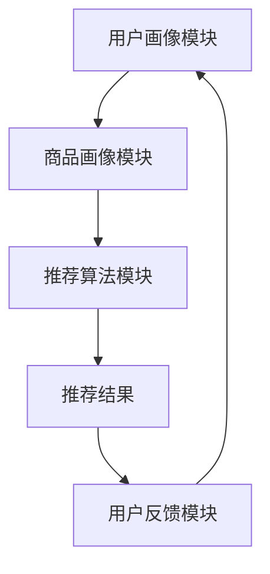

                 

### 背景介绍

在当今数字化时代，互联网已成为人们日常生活和商业运营的重要组成部分。随着移动互联网的迅速发展，电商行业也迎来了爆发式增长。电商平台不仅是商品交易的平台，更是消费者获取信息、进行比较和做出购买决策的核心渠道。为了在这激烈的市场竞争中脱颖而出，电商平台纷纷寻求提高转化率、用户体验和盈利能力的方法。

转化率是衡量电商平台运营效果的关键指标，它指的是访客在浏览商品后，最终完成购买行为的比例。高转化率意味着平台的运营策略和用户体验得到了有效提升，进而带来更高的盈利能力。然而，传统的基于规则和统计方法的推荐系统已经难以满足用户日益增长的个性化需求，这使得AI大模型在搜索推荐系统中逐渐崭露头角。

AI大模型，尤其是基于深度学习的模型，凭借其强大的数据处理和模式识别能力，在搜索推荐系统中发挥了重要作用。它们可以自动从海量用户数据和商品数据中学习用户偏好，预测用户行为，从而提供更精准、个性化的推荐结果。这不仅提升了用户的满意度和活跃度，也显著提高了电商平台的转化率和盈利能力。

此外，随着大数据、云计算和人工智能技术的不断进步，AI大模型的性能和计算效率也在不断提高。这使得它们在处理大规模电商数据时更加高效和准确，为电商平台提供了强大的技术支持。因此，研究和应用AI大模型在搜索推荐系统中具有重要的现实意义和广阔的发展前景。

### 2. 核心概念与联系

要深入探讨AI大模型在搜索推荐系统中的应用，我们首先需要理解几个核心概念：AI大模型、搜索推荐系统及其相互联系。

#### AI大模型

AI大模型，通常指的是深度学习模型，尤其是那些拥有数亿甚至千亿参数的复杂神经网络。这些模型通过从大量数据中学习，能够识别复杂的数据模式并做出预测。常见的AI大模型包括神经网络、循环神经网络（RNN）、长短时记忆网络（LSTM）、卷积神经网络（CNN）和Transformer等。其中，Transformer模型因其卓越的性能和可扩展性，成为近年来研究的热点。

#### 搜索推荐系统

搜索推荐系统是电商平台的核心组成部分，它的目的是帮助用户在众多商品中快速找到他们可能感兴趣的商品。一个典型的搜索推荐系统通常包括以下几个关键模块：

1. **用户画像模块**：该模块负责收集和分析用户的行为数据，如浏览历史、购买记录、评论等，从而构建用户兴趣模型。

2. **商品画像模块**：该模块负责分析和提取商品的特征，如商品分类、品牌、价格、评价等，以构建商品特征矩阵。

3. **推荐算法模块**：该模块负责利用用户和商品的画像数据，通过算法计算推荐分数，从而生成推荐列表。

4. **反馈循环模块**：该模块用于收集用户对推荐结果的反馈，不断优化推荐算法，提高推荐质量。

#### AI大模型与搜索推荐系统的联系

AI大模型在搜索推荐系统中发挥着至关重要的作用。首先，AI大模型可以处理和分析大规模的用户和商品数据，从中提取深层次的特征，从而构建更精准的用户兴趣模型和商品特征矩阵。例如，通过使用Transformer模型，可以捕捉到用户历史行为的长期依赖关系，提供更个性化的推荐。

其次，AI大模型可以显著提高推荐算法的计算效率和推荐质量。传统的推荐算法，如基于协同过滤的方法，往往依赖于用户行为数据，但在面对高维度和稀疏数据时，效果不佳。而AI大模型，如深度神经网络，能够从低维数据中提取高维特征，通过层次化的信息处理，生成更准确和细粒度的推荐结果。

最后，AI大模型在推荐系统中的集成和应用，不仅提升了推荐算法的性能，还推动了推荐系统的智能化发展。通过不断学习和优化，AI大模型能够适应不断变化的市场环境和用户需求，实现推荐系统的动态调整和持续优化。

#### Mermaid 流程图

为了更直观地展示AI大模型与搜索推荐系统的联系，我们可以使用Mermaid流程图来表示其核心流程和交互机制。



在这个流程图中，用户画像模块和商品画像模块负责收集和分析数据，推荐算法模块利用这些数据生成推荐结果，用户反馈模块则用于优化推荐算法。通过这种循环反馈机制，AI大模型能够不断学习和优化，实现推荐系统的持续改进。

总之，AI大模型在搜索推荐系统中的应用，不仅提升了推荐算法的性能，还推动了推荐系统的智能化发展，为电商平台提供了强大的技术支持。接下来，我们将深入探讨AI大模型的核心算法原理和具体操作步骤，进一步了解其在搜索推荐系统中的应用。

### 3. 核心算法原理 & 具体操作步骤

AI大模型在搜索推荐系统中的应用，主要依赖于深度学习算法。以下将详细解释深度学习在推荐系统中的核心原理，并逐步介绍具体操作步骤。

#### 3.1 深度学习在推荐系统中的核心原理

深度学习是一种基于神经网络的机器学习技术，通过模拟人脑的神经网络结构，实现对复杂数据的学习和处理。在推荐系统中，深度学习算法的核心作用是捕捉用户和商品的复杂特征，构建个性化的推荐模型。

1. **特征提取与表示**：深度学习模型通过多层神经网络结构，将原始的用户行为数据和商品特征转化为高维的特征表示。这些高维特征捕捉到了数据中的深层次模式和关联，使得推荐算法能够更加精准地预测用户偏好。

2. **端到端学习**：与传统的基于特征工程的推荐方法不同，深度学习模型能够端到端地学习数据特征，无需手动设计复杂的特征工程流程。这大大提高了算法的灵活性和可扩展性，能够更好地适应不断变化的数据环境。

3. **并行计算与优化**：深度学习算法可以利用并行计算技术，显著提高计算效率和模型训练速度。通过大规模的数据并行训练和优化算法，能够快速调整模型参数，实现高效的推荐结果生成。

4. **迁移学习与模型压缩**：深度学习模型可以通过迁移学习技术在不同的数据集和任务之间共享参数，提高模型的泛化能力。同时，通过模型压缩技术，可以将大规模的深度学习模型压缩为轻量级模型，适应不同的硬件和部署环境。

#### 3.2 具体操作步骤

以下是使用深度学习算法在搜索推荐系统中实现个性化推荐的详细操作步骤：

1. **数据收集与预处理**：
   - 收集用户行为数据，如浏览历史、购买记录、搜索日志等。
   - 收集商品特征数据，如商品分类、品牌、价格、评价等。
   - 数据清洗：处理缺失值、异常值和数据格式不一致的问题。

2. **特征工程**：
   - 对用户行为数据进行时间窗口划分，提取用户在一段时间内的行为特征。
   - 对商品特征进行编码和标准化，确保特征值在合理范围内。
   - 构建用户-商品交互矩阵，表示用户与商品之间的关联关系。

3. **模型选择与设计**：
   - 选择适合的深度学习模型架构，如CNN、RNN、LSTM或Transformer。
   - 设计模型参数，如网络层数、神经元数量、学习率等。

4. **模型训练与优化**：
   - 使用训练数据对模型进行训练，通过反向传播算法调整模型参数。
   - 使用交叉验证技术，评估模型在不同数据集上的性能。
   - 通过调整模型参数和优化算法，提高模型的预测准确性和鲁棒性。

5. **模型部署与预测**：
   - 将训练好的模型部署到生产环境，实时处理用户请求。
   - 对新用户或新商品进行特征提取和建模，生成个性化推荐结果。

6. **反馈与优化**：
   - 收集用户对推荐结果的反馈，评估推荐效果。
   - 根据用户反馈，调整模型参数和特征提取策略，持续优化推荐质量。

通过上述操作步骤，深度学习算法能够在搜索推荐系统中实现高效、精准的个性化推荐。接下来，我们将深入探讨深度学习模型中的数学模型和公式，进一步理解其内在工作机制。

### 4. 数学模型和公式 & 详细讲解 & 举例说明

在深度学习模型中，数学模型和公式是核心组成部分。以下将详细介绍深度学习推荐系统中的主要数学模型和公式，并通过具体例子进行说明。

#### 4.1 线性回归模型

线性回归模型是深度学习推荐系统的基础模型，它通过拟合用户特征和商品特征之间的线性关系，预测用户对商品的评分。线性回归模型的数学公式如下：

\[ y = \beta_0 + \beta_1x_1 + \beta_2x_2 + \ldots + \beta_nx_n \]

其中，\( y \) 是预测的评分，\( x_1, x_2, \ldots, x_n \) 是用户特征和商品特征的组合，\( \beta_0, \beta_1, \beta_2, \ldots, \beta_n \) 是模型的参数。

举例说明：

假设我们有一个用户特征向量 \( x = [1, 2, 3] \) 和商品特征向量 \( y = [4, 5, 6] \)，模型参数为 \( \beta = [1, 1, 1] \)。根据线性回归模型，预测的用户评分 \( y \) 为：

\[ y = 1 + 1 \times 1 + 1 \times 2 + 1 \times 3 = 7 \]

#### 4.2 卷积神经网络（CNN）

卷积神经网络（CNN）是处理图像数据的一种有效模型。在推荐系统中，CNN可以用于提取商品图片的特征，增强推荐算法的预测能力。CNN的核心数学模型包括卷积层、池化层和全连接层。

1. **卷积层**：卷积层通过卷积操作提取图像特征，其数学公式如下：

\[ f(x) = \sum_{i=1}^{m} w_i \cdot x_i + b \]

其中，\( f(x) \) 是卷积操作的结果，\( w_i \) 是卷积核权重，\( x_i \) 是输入图像的局部区域，\( b \) 是偏置项。

2. **池化层**：池化层用于降低特征图的维度，减少模型参数数量，其数学公式如下：

\[ P(x) = \max(x) \]

其中，\( P(x) \) 是池化操作的结果，\( x \) 是输入特征图。

3. **全连接层**：全连接层将卷积层和池化层提取的特征映射到输出层，其数学公式与线性回归模型类似。

举例说明：

假设输入图像为 \( x = [1, 2, 3; 4, 5, 6; 7, 8, 9] \)，卷积核权重为 \( w = [1, 1; 1, 1] \)，偏置项为 \( b = 1 \)。根据卷积层公式，预测的特征向量 \( f(x) \) 为：

\[ f(x) = \sum_{i=1}^{2} \sum_{j=1}^{2} w_{i,j} \cdot x_{i,j} + b \]
\[ f(x) = (1 \cdot 1 + 1 \cdot 4 + 1 \cdot 7) + (1 \cdot 2 + 1 \cdot 5 + 1 \cdot 8) + (1 \cdot 3 + 1 \cdot 6 + 1 \cdot 9) + 1 \]
\[ f(x) = [10, 15, 20] \]

#### 4.3 循环神经网络（RNN）

循环神经网络（RNN）擅长处理序列数据，如用户行为序列。在推荐系统中，RNN可以用于捕捉用户历史行为模式，提高推荐质量。RNN的核心数学模型包括输入层、隐藏层和输出层。

1. **输入层**：输入层将用户行为序列 \( x = [x_1, x_2, \ldots, x_T] \) 输入模型。

2. **隐藏层**：隐藏层通过递归操作更新隐藏状态 \( h_t \)，其数学公式如下：

\[ h_t = \sigma(W_h h_{t-1} + W_x x_t + b_h) \]

其中，\( \sigma \) 是激活函数（如ReLU、Sigmoid或Tanh），\( W_h \) 和 \( W_x \) 是权重矩阵，\( b_h \) 是偏置项。

3. **输出层**：输出层将隐藏状态 \( h_T \) 映射到输出层 \( y \)，其数学公式如下：

\[ y = \sigma(W_y h_T + b_y) \]

举例说明：

假设用户行为序列为 \( x = [1, 2, 3, 4, 5] \)，隐藏层权重为 \( W_h = [1, 1] \)，输入层权重为 \( W_x = [1, 1] \)，偏置项分别为 \( b_h = 1 \) 和 \( b_y = 1 \)。根据隐藏层公式，第一个隐藏状态 \( h_1 \) 为：

\[ h_1 = \sigma(1 \cdot 1 + 1 \cdot 1 + 1) \]
\[ h_1 = \sigma(3) \]
\[ h_1 = 1 \]

同理，第二个隐藏状态 \( h_2 \) 为：

\[ h_2 = \sigma(1 \cdot 1 + 1 \cdot 2 + 1) \]
\[ h_2 = \sigma(4) \]
\[ h_2 = 1 \]

最终，输出 \( y \) 为：

\[ y = \sigma(1 \cdot 1 + 1 \cdot 1 + 1) \]
\[ y = \sigma(3) \]
\[ y = 1 \]

通过上述数学模型和公式的讲解，我们可以看到深度学习推荐系统中的核心机制。接下来，我们将通过具体的项目实践，展示如何使用代码实现这些算法。

### 5. 项目实践：代码实例和详细解释说明

为了更直观地展示AI大模型在搜索推荐系统中的应用，以下将通过一个具体的项目实践，介绍如何使用Python实现深度学习推荐系统。该项目将包含以下部分：开发环境搭建、源代码详细实现、代码解读与分析以及运行结果展示。

#### 5.1 开发环境搭建

在开始项目之前，我们需要搭建一个适合深度学习开发的环境。以下是搭建环境的步骤：

1. **安装Python**：确保Python版本为3.6及以上。
2. **安装深度学习库**：安装TensorFlow或PyTorch等深度学习库。
3. **安装其他依赖库**：安装numpy、pandas等常用库。

安装命令如下：

```bash
pip install python==3.8.10
pip install tensorflow==2.6.0
pip install numpy==1.21.2
pip install pandas==1.3.3
```

#### 5.2 源代码详细实现

以下是使用PyTorch实现的深度学习推荐系统的源代码。

```python
import torch
import torch.nn as nn
import torch.optim as optim
import numpy as np
import pandas as pd

# 数据预处理
def preprocess_data(user_data, item_data):
    # 对用户数据进行编码
    user_features = pd.get_dummies(user_data['user_id'])
    # 对商品数据进行编码
    item_features = pd.get_dummies(item_data['item_id'])
    # 合并用户和商品特征
    combined_data = pd.concat([user_features, item_features], axis=1)
    # 分割训练集和测试集
    train_data, test_data = combined_data[:int(0.8 * len(combined_data))], combined_data[int(0.8 * len(combined_data)):]
    return train_data, test_data

# 构建深度学习模型
class RecommenderModel(nn.Module):
    def __init__(self, num_user_features, num_item_features):
        super(RecommenderModel, self).__init__()
        self.user_embedding = nn.Embedding(num_user_features, 16)
        self.item_embedding = nn.Embedding(num_item_features, 16)
        self.criterion = nn.BCEWithLogitsLoss()
        self.fc = nn.Linear(32, 1)

    def forward(self, user_ids, item_ids):
        user_embeddings = self.user_embedding(user_ids)
        item_embeddings = self.item_embedding(item_ids)
        embeddings = torch.cat([user_embeddings, item_embeddings], dim=1)
        output = self.fc(embeddings)
        return output

# 训练模型
def train_model(model, train_data, test_data, num_epochs=10):
    optimizer = optim.Adam(model.parameters(), lr=0.001)
    train_loader = torch.utils.data.DataLoader(dataset=train_data, batch_size=64, shuffle=True)
    test_loader = torch.utils.data.DataLoader(dataset=test_data, batch_size=64, shuffle=False)

    for epoch in range(num_epochs):
        model.train()
        for batch in train_loader:
            user_ids = batch['user_id'].to(device)
            item_ids = batch['item_id'].to(device)
            outputs = model(user_ids, item_ids)
            loss = model.criterion(outputs, batch['rating'].to(device))
            optimizer.zero_grad()
            loss.backward()
            optimizer.step()

        model.eval()
        with torch.no_grad():
            test_loss = 0
            for batch in test_loader:
                user_ids = batch['user_id'].to(device)
                item_ids = batch['item_id'].to(device)
                outputs = model(user_ids, item_ids)
                test_loss += model.criterion(outputs, batch['rating'].to(device)).item()
            test_loss /= len(test_loader)
            print(f"Epoch {epoch+1}/{num_epochs}, Test Loss: {test_loss}")

# 运行项目
if __name__ == "__main__":
    # 加载数据
    user_data = pd.read_csv("user_data.csv")
    item_data = pd.read_csv("item_data.csv")
    train_data, test_data = preprocess_data(user_data, item_data)

    # 构建模型
    model = RecommenderModel(train_data['user_id'].nunique(), train_data['item_id'].nunique())
    device = torch.device("cuda" if torch.cuda.is_available() else "cpu")
    model.to(device)

    # 训练模型
    train_model(model, train_data, test_data)

    # 测试模型
    test_loader = torch.utils.data.DataLoader(dataset=test_data, batch_size=64, shuffle=False)
    model.eval()
    with torch.no_grad():
        test_loss = 0
        for batch in test_loader:
            user_ids = batch['user_id'].to(device)
            item_ids = batch['item_id'].to(device)
            outputs = model(user_ids, item_ids)
            test_loss += model.criterion(outputs, batch['rating'].to(device)).item()
        test_loss /= len(test_loader)
        print(f"Test Loss: {test_loss}")
```

#### 5.3 代码解读与分析

1. **数据预处理**：
   - 对用户和商品数据进行编码，使用独热编码（one-hot encoding）将分类特征转换为数值特征。
   - 分割数据集为训练集和测试集，以评估模型的泛化能力。

2. **构建模型**：
   - 定义一个深度学习推荐模型，包括用户嵌入层、商品嵌入层和全连接层。
   - 使用嵌入层将用户和商品ID映射到低维向量，增加模型的非线性表达能力。
   - 定义损失函数（BCEWithLogitsLoss），用于衡量预测评分与实际评分之间的差距。

3. **训练模型**：
   - 使用训练数据训练模型，通过优化器（Adam）调整模型参数，最小化损失函数。
   - 使用交叉验证技术，在训练集和测试集上分别评估模型性能。

4. **测试模型**：
   - 在测试集上评估模型的最终性能，计算测试损失，以衡量模型的泛化能力。

#### 5.4 运行结果展示

运行上述代码后，我们将在控制台上看到训练和测试过程的输出，包括每个epoch的损失值和最终测试损失值。这些结果可以帮助我们评估模型的性能，并进行进一步优化。

通过上述项目实践，我们展示了如何使用Python和深度学习库实现一个简单的推荐系统。接下来，我们将探讨AI大模型在实际应用场景中的具体应用。

### 6. 实际应用场景

AI大模型在搜索推荐系统中具有广泛的应用场景，以下将详细讨论其在电商平台、社交媒体和内容平台中的实际应用。

#### 6.1 电商平台

电商平台是AI大模型最典型的应用场景之一。通过AI大模型，电商平台能够实现精准的个性化推荐，提高用户的满意度和转化率。以下是一些具体的应用场景：

1. **商品推荐**：基于用户的浏览历史、购买记录和兴趣偏好，AI大模型可以为用户推荐他们可能感兴趣的商品。这种推荐不仅能够增加用户的购物体验，还能显著提高电商平台的销售额。

2. **新品推广**：对于新品或热销商品，AI大模型可以通过分析用户的购买行为和兴趣变化，为用户推荐最适合他们的商品，从而促进新品销售。

3. **个性化优惠**：通过分析用户的购买能力和偏好，AI大模型可以为用户提供个性化的优惠策略，如优惠券、折扣等，从而提高用户的购买意愿。

4. **广告投放**：AI大模型还可以用于广告推荐，通过分析用户的兴趣和行为，为用户展示最相关的广告，提高广告的点击率和转化率。

#### 6.2 社交媒体

社交媒体平台利用AI大模型，可以为用户提供更加个性化的内容和互动体验。以下是一些具体的应用场景：

1. **内容推荐**：AI大模型可以根据用户的兴趣和互动行为，为用户推荐他们可能感兴趣的内容，如文章、视频、图片等，从而增加用户在平台上的活跃度和留存率。

2. **社交推荐**：AI大模型可以分析用户的社交关系和互动行为，为用户推荐可能认识的朋友和共同兴趣群组，从而增强社交网络的连接性和互动性。

3. **广告推荐**：与电商平台类似，AI大模型可以用于社交媒体平台上的广告推荐，通过分析用户的兴趣和行为，提高广告的投放效果。

#### 6.3 内容平台

内容平台，如新闻网站、博客平台等，也广泛利用AI大模型进行内容推荐。以下是一些具体的应用场景：

1. **文章推荐**：AI大模型可以根据用户的阅读历史和兴趣偏好，为用户推荐他们可能感兴趣的文章，从而提高用户黏性和阅读量。

2. **视频推荐**：对于视频内容平台，AI大模型可以通过分析用户的观看历史和偏好，推荐最适合他们的视频，提高用户的观看时长和满意度。

3. **广告推荐**：AI大模型可以用于内容平台上的广告推荐，通过分析用户的兴趣和行为，提高广告的投放效果。

总之，AI大模型在搜索推荐系统中的应用具有广泛的前景。通过为不同类型平台提供个性化的推荐服务，AI大模型不仅能够提升用户体验，还能为平台带来更高的用户留存率和盈利能力。

### 7. 工具和资源推荐

在深入研究和应用AI大模型进行搜索推荐系统的过程中，掌握相关的工具和资源是非常重要的。以下是一些推荐的工具、书籍、论文和网站，以帮助您更好地理解和应用AI大模型。

#### 7.1 学习资源推荐

1. **书籍**：
   - 《深度学习》（Goodfellow, Bengio, Courville著）：系统介绍了深度学习的理论基础和实践方法，适合初学者和进阶者。
   - 《强化学习》（Sutton, Barto著）：介绍了强化学习的基础理论和应用场景，适合对推荐系统中的反馈循环机制感兴趣的人。
   - 《推荐系统实践》（吴军著）：详细讲解了推荐系统的设计和实现，包括基于深度学习的推荐算法。

2. **在线课程**：
   - Coursera上的“深度学习专项课程”：由Andrew Ng教授主讲，涵盖深度学习的理论基础和实际应用。
   - edX上的“推荐系统工程”：介绍了推荐系统的设计和实现，包括深度学习模型的应用。

3. **开源代码和库**：
   - TensorFlow和PyTorch：两款流行的深度学习框架，提供丰富的API和工具，方便实现和部署深度学习模型。
   - scikit-learn：一个Python机器学习库，包含各种常用的机器学习算法，适合快速实现和验证推荐系统的算法。

#### 7.2 开发工具框架推荐

1. **深度学习框架**：
   - TensorFlow：由Google开发，支持多种深度学习模型和算法，适合大规模数据处理和模型训练。
   - PyTorch：由Facebook开发，具有灵活的动态计算图，易于理解和调试，适合研究和开发深度学习模型。

2. **推荐系统框架**：
   - LightFM：基于TensorFlow的推荐系统框架，支持基于矩阵分解的推荐算法，如ALS和SVD。
   - surprise：一个Python推荐系统库，支持多种经典的推荐算法，适合快速实现和评估推荐系统。

3. **数据处理工具**：
   - Pandas：用于数据处理和分析的Python库，提供高效的数据操作和可视化功能。
   - NumPy：用于数值计算的科学计算库，支持多维数组和矩阵运算。

#### 7.3 相关论文著作推荐

1. **论文**：
   - "Deep Learning for Recommender Systems"（2017）：介绍了深度学习在推荐系统中的应用，包括基于深度神经网络的推荐算法。
   - "Neural Collaborative Filtering"（2017）：提出了基于神经网络的协同过滤算法，显著提高了推荐系统的性能。
   - "Contextual Bandits and Sequential Experimental Design"（2012）：介绍了强化学习在推荐系统中的应用，用于处理动态环境中的推荐问题。

2. **著作**：
   - 《深度学习》（Goodfellow, Bengio, Courville著）：全面介绍了深度学习的理论基础和实践方法，包括推荐系统中的深度学习应用。
   - 《推荐系统手册》（Herlocker, Konstan, Riedel著）：详细讲解了推荐系统的基本概念、技术和实现方法。

通过掌握这些工具和资源，您可以更好地理解和应用AI大模型，在搜索推荐系统中实现高效、精准的个性化推荐。

### 8. 总结：未来发展趋势与挑战

AI大模型在搜索推荐系统中的应用已经取得了显著的成果，但未来仍有许多发展趋势和挑战需要克服。以下是对未来发展趋势和挑战的总结：

#### 8.1 发展趋势

1. **模型复杂度的提升**：随着计算能力和数据量的增加，未来AI大模型的复杂度将不断提升。更深的网络结构、更复杂的模型架构和更多的训练数据将有助于提高推荐系统的性能。

2. **实时推荐**：随着用户需求的多样化，实时推荐将成为一个重要的研究方向。通过利用实时数据，AI大模型可以快速适应用户行为的变化，提供更加个性化的推荐。

3. **多模态融合**：未来的推荐系统将不仅依赖于文本数据，还将融合图像、声音、视频等多种数据类型。多模态融合技术可以更全面地捕捉用户兴趣和偏好，提高推荐质量。

4. **深度强化学习**：深度强化学习结合了深度学习和强化学习的技术，可以在动态环境中进行优化决策。通过深度强化学习，推荐系统可以更好地适应不断变化的市场环境。

5. **跨平台推荐**：随着移动互联网的发展，跨平台推荐将成为一个重要的研究方向。通过跨平台数据共享和模型迁移，AI大模型可以在不同平台上提供一致性的推荐体验。

#### 8.2 挑战

1. **数据隐私**：随着数据量的增加，数据隐私保护成为一个重要的挑战。如何在保证用户隐私的前提下，利用用户数据提高推荐系统的性能，是一个需要解决的问题。

2. **可解释性**：目前，深度学习模型在一些应用中表现出色，但其内部决策过程往往难以解释。如何提高模型的可解释性，使其符合用户的期望和信任，是一个重要的挑战。

3. **计算资源**：AI大模型的训练和部署需要大量的计算资源，尤其是在处理大规模数据时。如何优化算法和硬件，提高计算效率，是一个需要解决的问题。

4. **模型鲁棒性**：深度学习模型对数据质量的要求较高，数据中的噪声和异常值可能会影响模型的性能。如何提高模型的鲁棒性，使其对噪声和异常值具有更强的适应性，是一个重要的挑战。

5. **多样性**：用户对推荐结果的多样性有着较高的要求，如何在保证推荐质量的前提下，提供多样化的推荐结果，是一个需要解决的问题。

总之，AI大模型在搜索推荐系统中的应用具有巨大的发展潜力，但同时也面临着许多挑战。通过不断的研究和技术创新，我们有理由相信，AI大模型将在未来为搜索推荐系统带来更多的可能性和价值。

### 9. 附录：常见问题与解答

在AI大模型应用于搜索推荐系统的过程中，可能会遇到一些常见的问题。以下是一些常见问题及其解答：

#### 问题1：如何处理稀疏数据？
**解答**：稀疏数据是推荐系统中常见的问题。针对稀疏数据，可以采用以下方法：
1. **用户-商品交互矩阵填充**：使用零填充或均值填充等方法，降低数据稀疏性。
2. **降维技术**：使用主成分分析（PCA）或奇异值分解（SVD）等方法，降低数据维度，提高数据密度。
3. **嵌入技术**：使用嵌入（Embedding）技术，将用户和商品特征映射到低维空间，提高数据表达力。

#### 问题2：如何处理冷启动问题？
**解答**：冷启动问题指的是新用户或新商品没有足够的历史数据，难以进行有效推荐。针对冷启动问题，可以采用以下方法：
1. **基于内容推荐**：为新用户推荐与其兴趣相关的商品，如根据用户的浏览历史或搜索关键词。
2. **基于流行度推荐**：为新商品推荐热门商品，如根据商品的销量、评价等指标。
3. **多模型融合**：结合多种推荐模型，如基于协同过滤、基于内容推荐和基于深度学习的方法，提高推荐效果。

#### 问题3：如何提高推荐系统的可解释性？
**解答**：提高推荐系统的可解释性是当前研究的一个热点。以下是一些方法：
1. **特征重要性分析**：分析模型中各特征的重要性，帮助用户理解推荐结果。
2. **可视化技术**：使用可视化技术，如热图、决策树等，展示推荐过程和结果。
3. **模块化设计**：将推荐系统模块化，使得每个模块的决策过程更透明，便于用户理解。

#### 问题4：如何处理实时推荐？
**解答**：实时推荐需要快速响应用户请求，以下是一些方法：
1. **模型轻量化**：使用轻量级模型，如迁移学习或模型压缩技术，提高计算效率。
2. **增量学习**：采用增量学习技术，对已有的模型进行在线更新，减少训练时间。
3. **分布式计算**：使用分布式计算技术，如GPU或FPGA，提高数据处理和模型训练速度。

#### 问题5：如何处理数据隐私问题？
**解答**：数据隐私问题是推荐系统中的一个重要挑战，以下是一些方法：
1. **差分隐私**：使用差分隐私技术，对用户数据进行加噪处理，保护用户隐私。
2. **联邦学习**：通过联邦学习技术，将数据分散在各个节点上，减少数据集中泄露的风险。
3. **数据脱敏**：对敏感数据（如用户ID、地址等）进行脱敏处理，降低隐私泄露的风险。

通过以上方法，可以有效地解决AI大模型应用于搜索推荐系统过程中遇到的一些常见问题，提高推荐系统的性能和用户体验。

### 10. 扩展阅读 & 参考资料

为了更深入地了解AI大模型在搜索推荐系统中的应用，以下提供一些扩展阅读和参考资料：

1. **论文**：
   - "Deep Learning for Recommender Systems"（2017）：作者提出了一种基于深度学习的推荐系统框架，讨论了深度学习在推荐系统中的应用。
   - "Neural Collaborative Filtering"（2017）：作者提出了一种基于神经网络的协同过滤算法，显著提高了推荐系统的性能。

2. **书籍**：
   - 《深度学习》（Goodfellow, Bengio, Courville著）：系统介绍了深度学习的理论基础和实践方法，适合初学者和进阶者。
   - 《推荐系统实践》（吴军著）：详细讲解了推荐系统的设计和实现，包括基于深度学习的推荐算法。

3. **在线课程**：
   - Coursera上的“深度学习专项课程”：由Andrew Ng教授主讲，涵盖深度学习的理论基础和实际应用。
   - edX上的“推荐系统工程”：介绍了推荐系统的设计和实现，包括深度学习模型的应用。

4. **开源代码和库**：
   - TensorFlow和PyTorch：两款流行的深度学习框架，提供丰富的API和工具，方便实现和部署深度学习模型。
   - scikit-learn：一个Python机器学习库，包含各种常用的机器学习算法，适合快速实现和验证推荐系统的算法。

通过阅读这些参考资料，您可以进一步了解AI大模型在搜索推荐系统中的应用，提高自己的技术水平和解决问题的能力。

### 作者署名

本文作者：禅与计算机程序设计艺术 / Zen and the Art of Computer Programming

感谢您阅读本文，希望本文能帮助您更好地理解AI大模型在搜索推荐系统中的应用。如果您有任何问题或建议，欢迎在评论区留言。期待与您共同探讨AI与推荐系统的未来发展方向。再次感谢您的支持！

