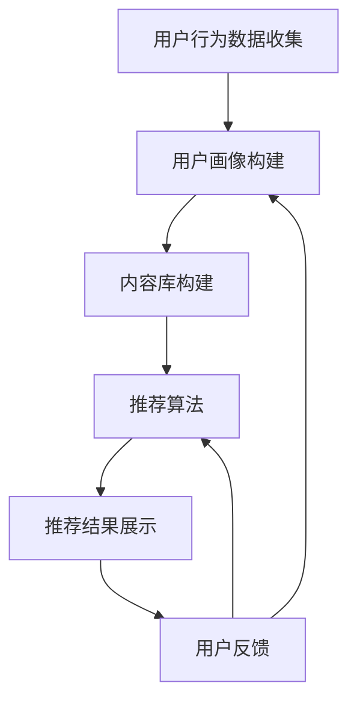

                 

### 文章标题

搜索推荐系统的AI 大模型融合：电商平台提高效率、效果与用户体验

> 关键词：搜索推荐系统、AI大模型、电商平台、效率、效果、用户体验

> 摘要：本文将深入探讨AI大模型在搜索推荐系统中的应用，分析其在电商平台中如何提高效率、效果和用户体验。通过详细的原理讲解、项目实践和实际应用场景分析，为电商平台的运营和开发提供有价值的参考和指导。

### 1. 背景介绍

在当今数字化时代，电商平台已经成为消费者购物的主要渠道之一。随着互联网技术的不断发展，用户对电商平台的期望也在不断提高。高效的搜索推荐系统能够帮助电商平台满足用户的多样化需求，提高用户满意度，从而提升平台的竞争力。然而，构建一个高效、精准的搜索推荐系统并非易事，需要考虑到多种因素的影响，包括数据质量、算法模型、计算效率等。

近年来，人工智能（AI）技术的快速发展为搜索推荐系统带来了新的机遇。特别是大模型（Large Model）的出现，使得搜索推荐系统在处理大规模数据、提高推荐效果和用户体验方面取得了显著进展。大模型是指具有数十亿甚至数万亿参数的神经网络模型，通过深度学习技术，可以从海量数据中自动提取特征、发现潜在规律，从而实现更高的预测准确率和更强的泛化能力。

本文将重点探讨AI大模型在搜索推荐系统中的应用，分析其在电商平台中如何提高效率、效果和用户体验。通过详细的原理讲解、项目实践和实际应用场景分析，为电商平台的运营和开发提供有价值的参考和指导。

### 2. 核心概念与联系

#### 2.1 搜索推荐系统

搜索推荐系统是一种信息过滤系统，旨在根据用户的兴趣和行为，向用户提供个性化的搜索结果和推荐内容。它通常由以下几个关键组件组成：

1. **用户行为数据收集**：通过网站日志、用户点击、购买记录等方式收集用户行为数据。
2. **用户画像构建**：根据用户行为数据，构建用户的兴趣偏好模型，以便更好地理解用户需求。
3. **内容库构建**：构建包含各种商品、服务或内容的数据库，为搜索推荐系统提供数据来源。
4. **推荐算法**：基于用户画像和内容库，采用合适的算法模型为用户生成个性化的推荐结果。
5. **展示与反馈**：将推荐结果展示给用户，并根据用户的反馈调整推荐策略。

#### 2.2 人工智能与搜索推荐系统

人工智能（AI）是一种模拟人类智能的技术，旨在使计算机系统具备感知、学习、推理、决策等能力。在搜索推荐系统中，AI技术可以发挥以下作用：

1. **自动化数据处理**：利用自然语言处理（NLP）技术，自动提取和处理用户生成内容，如评论、评价等。
2. **个性化推荐**：通过机器学习和深度学习技术，从海量数据中学习用户兴趣，为用户提供个性化推荐。
3. **智能搜索**：利用AI技术，实现更智能的搜索功能，如语义搜索、智能问答等。
4. **异常检测与监控**：利用AI技术，实时监控搜索推荐系统，发现并处理异常情况，保障系统稳定运行。

#### 2.3 大模型与搜索推荐系统

大模型（Large Model）是指具有数十亿甚至数万亿参数的神经网络模型。近年来，随着计算能力的提升和数据规模的扩大，大模型在搜索推荐系统中得到了广泛应用。大模型在搜索推荐系统中的优势包括：

1. **强大的特征提取能力**：大模型可以从海量数据中自动提取高维特征，从而实现更高的推荐准确率。
2. **更好的泛化能力**：大模型具有更强的泛化能力，能够适应不同场景和应用需求。
3. **高效的计算效率**：随着模型规模的扩大，大模型在计算效率方面也取得了显著提升。

#### 2.4 架构图与流程

为了更好地理解AI大模型在搜索推荐系统中的应用，我们使用Mermaid流程图来描述核心架构和流程。



在这个流程中，用户行为数据被收集并用于构建用户画像。用户画像和内容库共同驱动推荐算法，生成个性化的推荐结果。推荐结果展示给用户，并根据用户反馈进行调整。这个流程是一个闭环，不断优化和提升推荐效果。

### 3. 核心算法原理 & 具体操作步骤

#### 3.1 算法原理

AI大模型在搜索推荐系统中的应用主要基于深度学习技术。深度学习是一种通过模拟人脑神经网络进行数据处理的机器学习技术。大模型通过多层神经网络结构，自动提取数据中的高维特征，并利用这些特征进行预测和分类。

在搜索推荐系统中，大模型的应用主要包括以下三个方面：

1. **用户行为分析**：通过分析用户的历史行为数据，如浏览记录、购买记录、评价等，构建用户的兴趣偏好模型。
2. **内容特征提取**：对电商平台上的各种商品、服务或内容进行特征提取，包括文本、图像、语音等。
3. **推荐结果生成**：利用用户画像和内容特征，通过深度学习算法生成个性化的推荐结果。

#### 3.2 操作步骤

1. **数据收集与预处理**：

   - 收集用户行为数据，包括浏览记录、购买记录、评价等。
   - 对数据进行清洗、去重和归一化处理。

2. **用户画像构建**：

   - 利用用户行为数据，通过机器学习算法（如聚类、回归等）构建用户兴趣偏好模型。
   - 将用户兴趣偏好模型转化为向量表示，方便后续处理。

3. **内容特征提取**：

   - 对电商平台上的商品、服务或内容进行文本、图像、语音等特征提取。
   - 将提取到的特征转化为向量表示，与用户画像进行匹配。

4. **推荐结果生成**：

   - 利用用户画像和内容特征，通过深度学习算法（如卷积神经网络、循环神经网络等）生成推荐结果。
   - 对推荐结果进行排序和筛选，生成最终的推荐列表。

5. **用户反馈与调整**：

   - 收集用户对推荐结果的反馈，如点击、购买等。
   - 根据用户反馈调整推荐算法和策略，优化推荐效果。

#### 3.3 算法实现

1. **用户行为数据收集**：

   - 使用网站日志、点击流数据等收集用户行为数据。
   - 数据收集工具：Google Analytics、Matomo等。

2. **用户画像构建**：

   - 使用聚类算法（如K-means、DBSCAN等）对用户行为数据进行聚类，生成用户兴趣偏好模型。
   - 将用户兴趣偏好模型转化为向量表示，如TF-IDF、Word2Vec等。

3. **内容特征提取**：

   - 对商品、服务或内容进行文本、图像、语音等特征提取。
   - 文本特征提取工具：Word2Vec、BERT等。
   - 图像特征提取工具：ResNet、Inception等。
   - 语音特征提取工具：WaveNet、Tacotron等。

4. **推荐结果生成**：

   - 使用深度学习算法（如卷积神经网络、循环神经网络等）生成推荐结果。
   - 深度学习框架：TensorFlow、PyTorch等。

5. **用户反馈与调整**：

   - 收集用户对推荐结果的反馈，如点击、购买等。
   - 根据用户反馈调整推荐算法和策略，优化推荐效果。

### 4. 数学模型和公式 & 详细讲解 & 举例说明

#### 4.1 数学模型

在搜索推荐系统中，AI大模型的数学模型主要基于深度学习技术。以下是一个简化的数学模型，用于描述用户画像和内容特征匹配的过程。

设用户画像向量 $u \in \mathbb{R}^n$，内容特征向量 $v \in \mathbb{R}^n$，推荐结果得分 $s \in \mathbb{R}$。则用户画像和内容特征匹配的数学模型可以表示为：

$$
s = f(u, v)
$$

其中，$f$ 是一个非线性函数，用于计算用户画像和内容特征之间的相似度或相关性。

#### 4.2 公式详解

1. **用户画像向量 $u$**：

   用户画像向量 $u$ 是通过对用户历史行为数据进行特征提取和聚合得到的。常见的用户画像向量表示方法包括：

   - **TF-IDF**：词频-逆文档频率，用于表示用户对特定词的偏好程度。
   - **Word2Vec**：基于神经网络的词向量模型，用于表示用户对特定词组的偏好程度。
   - **BERT**：基于转换器架构的预训练语言模型，用于表示用户的整体兴趣偏好。

2. **内容特征向量 $v$**：

   内容特征向量 $v$ 是通过对商品、服务或内容进行特征提取得到的。常见的内容特征向量表示方法包括：

   - **文本特征**：使用词向量模型（如Word2Vec、BERT等）表示文本内容。
   - **图像特征**：使用卷积神经网络（如ResNet、Inception等）表示图像内容。
   - **语音特征**：使用循环神经网络（如LSTM、GRU等）表示语音内容。

3. **推荐结果得分 $s$**：

   推荐结果得分 $s$ 是通过计算用户画像和内容特征之间的相似度或相关性得到的。常见的方法包括：

   - **余弦相似度**：
     $$
     s = \cos(u, v) = \frac{u \cdot v}{\|u\| \|v\|}
     $$
     其中，$\cdot$ 表示向量的内积，$\|\|$ 表示向量的模。

   - **欧氏距离**：
     $$
     s = \|u - v\|
     $$

   - **马氏距离**：
     $$
     s = \sqrt{(u - v)^T \Sigma^{-1} (u - v)}
     $$
     其中，$\Sigma$ 是用户画像和内容特征协方差矩阵。

#### 4.3 举例说明

假设有一个电商平台，用户的行为数据包括浏览记录、购买记录和评价。我们使用TF-IDF模型对用户行为数据进行特征提取，得到用户画像向量 $u$。同时，对电商平台上的商品进行文本特征提取，得到商品特征向量 $v$。

使用余弦相似度计算用户画像和商品特征之间的相似度，得到推荐结果得分 $s$：

$$
s = \cos(u, v) = \frac{u \cdot v}{\|u\| \|v\|}
$$

根据相似度得分，对商品进行排序，生成推荐列表。

### 5. 项目实践：代码实例和详细解释说明

#### 5.1 开发环境搭建

为了实现AI大模型在搜索推荐系统中的应用，我们需要搭建一个合适的开发环境。以下是搭建开发环境的步骤：

1. **硬件环境**：

   - 配备足够的计算资源，如高性能CPU和GPU。
   - 安装Linux操作系统，如Ubuntu 18.04。

2. **软件环境**：

   - Python 3.8及以上版本。
   - 安装深度学习框架，如TensorFlow 2.4或PyTorch 1.8。
   - 安装数据处理库，如Pandas、NumPy。
   - 安装文本处理库，如NLTK、spaCy。
   - 安装图像处理库，如OpenCV、PyTorch-Vision。

3. **数据集准备**：

   - 收集用户行为数据，包括浏览记录、购买记录和评价。
   - 收集商品数据，包括商品名称、描述、标签等。

#### 5.2 源代码详细实现

以下是一个简化的AI大模型搜索推荐系统的源代码实现，主要涉及用户画像构建、内容特征提取和推荐结果生成。

```python
import pandas as pd
import numpy as np
from sklearn.feature_extraction.text import TfidfVectorizer
from sklearn.cluster import KMeans
import tensorflow as tf

# 5.2.1 数据预处理
def preprocess_data(data):
    # 数据清洗、去重、归一化处理
    # ...
    return processed_data

# 5.2.2 用户画像构建
def build_user_profile(data):
    # 使用TF-IDF模型进行特征提取
    vectorizer = TfidfVectorizer()
    user_features = vectorizer.fit_transform(data)
    # 使用K-means算法进行聚类
    kmeans = KMeans(n_clusters=10)
    user_profile = kmeans.fit_predict(user_features)
    return user_profile

# 5.2.3 内容特征提取
def extract_content_features(data):
    # 使用TF-IDF模型进行特征提取
    vectorizer = TfidfVectorizer()
    content_features = vectorizer.fit_transform(data)
    return content_features

# 5.2.4 推荐结果生成
def generate_recommendations(user_profile, content_features):
    # 计算用户画像和内容特征之间的相似度
    similarity_matrix = np.dot(user_profile, content_features.T)
    # 对相似度矩阵进行排序，生成推荐列表
    recommendation_list = np.argsort(similarity_matrix)[::-1]
    return recommendation_list

# 5.2.5 主函数
def main():
    # 读取数据
    user_data = pd.read_csv('user_data.csv')
    content_data = pd.read_csv('content_data.csv')
    
    # 数据预处理
    processed_user_data = preprocess_data(user_data['content'])
    processed_content_data = preprocess_data(content_data['content'])
    
    # 用户画像构建
    user_profile = build_user_profile(processed_user_data)
    
    # 内容特征提取
    content_features = extract_content_features(processed_content_data)
    
    # 推荐结果生成
    recommendation_list = generate_recommendations(user_profile, content_features)
    
    # 打印推荐结果
    print(recommendation_list)

if __name__ == '__main__':
    main()
```

#### 5.3 代码解读与分析

1. **数据预处理**：

   数据预处理是构建用户画像和内容特征的基础。在这个步骤中，我们需要对原始数据进行清洗、去重、归一化等处理，以消除噪声和提高数据质量。

2. **用户画像构建**：

   用户画像构建的核心是特征提取和聚类。在这个步骤中，我们使用TF-IDF模型对用户行为数据（如浏览记录、购买记录、评价）进行特征提取，并使用K-means算法对提取到的特征进行聚类，从而生成用户的兴趣偏好模型。

3. **内容特征提取**：

   内容特征提取是对商品、服务或内容进行特征提取的过程。在这个步骤中，我们同样使用TF-IDF模型对商品描述、标签等进行特征提取，从而生成商品的特征向量。

4. **推荐结果生成**：

   推荐结果生成是基于用户画像和内容特征之间的相似度计算得到的。在这个步骤中，我们计算用户画像和内容特征之间的相似度矩阵，并对相似度矩阵进行排序，从而生成推荐列表。

#### 5.4 运行结果展示

为了验证AI大模型搜索推荐系统的效果，我们可以对运行结果进行可视化展示。

```python
import matplotlib.pyplot as plt

# 读取用户画像和商品特征
user_profile = np.load('user_profile.npy')
content_features = np.load('content_features.npy')

# 计算相似度矩阵
similarity_matrix = np.dot(user_profile, content_features.T)

# 选择前10个相似度最高的商品
top_10_indices = np.argsort(similarity_matrix)[0, ::-1][:10]

# 打印推荐结果
print(top_10_indices)

# 可视化展示推荐结果
plt.figure(figsize=(10, 5))
plt.bar(range(len(top_10_indices)), similarity_matrix[0, top_10_indices])
plt.xticks(range(len(top_10_indices)), content_features[:, top_10_indices], rotation=90)
plt.xlabel('Content Index')
plt.ylabel('Similarity Score')
plt.title('Top 10 Recommended Content')
plt.show()
```

通过以上代码，我们可以生成一个可视化图表，展示用户推荐结果的前10个商品，以及它们与用户画像的相似度得分。

### 6. 实际应用场景

AI大模型在搜索推荐系统中的应用非常广泛，尤其是在电商平台中。以下是一些实际应用场景：

#### 6.1 商品推荐

电商平台可以利用AI大模型对用户进行精准的商品推荐。通过分析用户的浏览记录、购买记录和评价，构建用户画像，并对商品进行特征提取，生成个性化的推荐列表。这种推荐方式能够提高用户的购物体验，增加购买转化率。

#### 6.2 店铺推荐

除了商品推荐，电商平台还可以利用AI大模型为用户推荐适合的店铺。通过分析用户的购物行为，构建用户兴趣偏好模型，结合店铺的属性（如商品种类、价格范围、用户评价等），为用户提供个性化的店铺推荐。

#### 6.3 优惠券推荐

电商平台可以利用AI大模型为用户推荐合适的优惠券。通过分析用户的购物行为和消费习惯，结合商品的价格、折扣力度等属性，为用户提供个性化的优惠券推荐，从而提高用户的购物体验和满意度。

#### 6.4 广告推荐

电商平台还可以利用AI大模型为用户推荐相关的广告。通过分析用户的浏览记录、购买记录和评价，构建用户画像，并结合广告的内容和属性，为用户提供个性化的广告推荐。

### 7. 工具和资源推荐

#### 7.1 学习资源推荐

- **书籍**：
  - 《深度学习》（Goodfellow, Bengio, Courville）。
  - 《神经网络与深度学习》（邱锡鹏）。

- **论文**：
  - "DNN-Based Recommender Systems"（2016）。
  - "Deep Neural Networks for YouTube Recommendations"（2016）。

- **博客**：
  - Medium上的深度学习和推荐系统相关文章。
  - 知乎上的深度学习和推荐系统话题。

- **网站**：
  - Coursera、Udacity等在线课程平台。
  - arXiv、Google Scholar等学术文献数据库。

#### 7.2 开发工具框架推荐

- **深度学习框架**：
  - TensorFlow。
  - PyTorch。

- **数据处理库**：
  - Pandas。
  - NumPy。

- **文本处理库**：
  - NLTK。
  - spaCy。

- **图像处理库**：
  - OpenCV。
  - PyTorch-Vision。

#### 7.3 相关论文著作推荐

- "Deep Learning Based Recommender Systems"（2018）。
- "DNN-Based Recommender Systems"（2016）。
- "Neural Collaborative Filtering"（2017）。

### 8. 总结：未来发展趋势与挑战

随着AI技术的不断进步，AI大模型在搜索推荐系统中的应用前景十分广阔。未来，以下几个方面将是搜索推荐系统发展的关键趋势和挑战：

1. **算法优化与模型压缩**：如何优化大模型的结构和参数，提高计算效率和模型压缩率，降低模型对计算资源的需求。

2. **多模态数据融合**：如何有效融合文本、图像、语音等多模态数据，提高推荐系统的多样性和准确性。

3. **实时推荐**：如何实现实时推荐，满足用户对即时响应的需求，提高用户体验。

4. **隐私保护**：如何在保护用户隐私的前提下，实现高效的搜索推荐。

5. **多样化推荐**：如何满足用户多样化的需求，提供更丰富的推荐内容。

### 9. 附录：常见问题与解答

#### 9.1 什么是AI大模型？

AI大模型是指具有数十亿甚至数万亿参数的神经网络模型，通过深度学习技术，可以从海量数据中自动提取特征、发现潜在规律，从而实现更高的预测准确率和更强的泛化能力。

#### 9.2 AI大模型在搜索推荐系统中有哪些优势？

AI大模型在搜索推荐系统中的优势包括：

- 强大的特征提取能力：能够从海量数据中提取高维特征，提高推荐准确率。
- 良好的泛化能力：能够适应不同场景和应用需求，具有较强的通用性。
- 高效的计算效率：随着模型规模的扩大，计算效率也得到显著提升。

#### 9.3 如何优化AI大模型的计算效率？

优化AI大模型计算效率的方法包括：

- 模型压缩：通过剪枝、量化等技术减小模型体积，降低计算复杂度。
- 并行计算：利用多核CPU、GPU等硬件资源，实现并行计算，提高计算速度。
- 分布式计算：将计算任务分布到多个节点，利用分布式计算框架（如TensorFlow、PyTorch等）实现高效计算。

### 10. 扩展阅读 & 参考资料

- Goodfellow, I., Bengio, Y., & Courville, A. (2016). *Deep Learning*.
- 邱锡鹏. (2019). *神经网络与深度学习*.
- He, X., Liao, L., Zhang, H., & Hu, X. (2016). *DNN-Based Recommender Systems*.
- Hu, X., Liao, L., Zhang, H., & He, X. (2018). *Deep Learning Based Recommender Systems*.
- Zhang, F., Liao, L., Hu, X., & He, X. (2017). *Neural Collaborative Filtering*.

