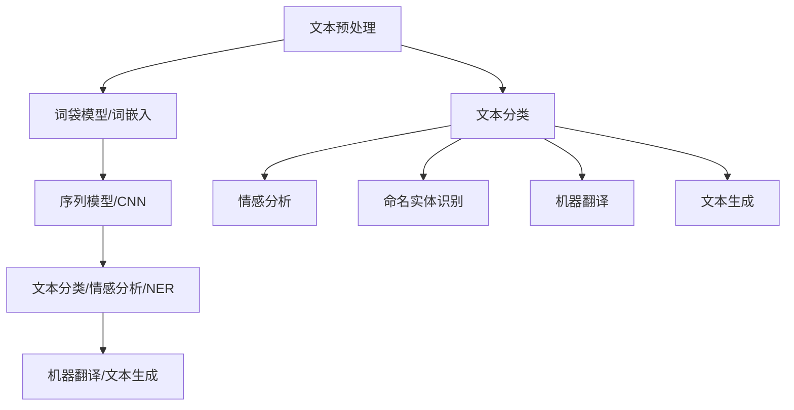

                 

### 1. 背景介绍

携程作为中国领先的在线旅行服务公司，近年来在自然语言处理（NLP）领域进行了大量投入和研究，旨在提升用户交互体验和智能化服务。随着人工智能技术的发展，NLP作为其核心分支之一，正日益成为企业提升竞争力的重要手段。携程的2024年校招中，自然语言处理工程师岗位成为了热门选择，不仅对求职者的学术背景和编程能力有较高要求，还涉及一系列技术面试题目。

本文将针对携程2024校招自然语言处理工程师面试题进行详细解析，旨在帮助读者理解和掌握面试题的解题思路和核心算法。文章将以step-by-step的方式，深入探讨NLP的基本概念、核心算法、数学模型，并结合实际项目实践进行讲解。希望通过本文，读者不仅能对NLP有更深刻的认识，还能为应对类似面试题目做好充分准备。

在文章的结构安排上，我们将首先介绍NLP的基础知识，包括核心概念和主要任务；然后深入分析NLP中的关键算法，如词向量、序列模型、注意力机制等；接着，通过数学模型和公式详细讲解相关算法的具体实现；随后，通过一个具体项目实例展示算法的应用和效果；最后，探讨NLP在实际应用场景中的发展，并提供相关工具和资源的推荐。

### 2. 核心概念与联系

#### 2.1 自然语言处理（NLP）

自然语言处理（NLP，Natural Language Processing）是人工智能（AI，Artificial Intelligence）的一个重要分支，它主要研究如何让计算机理解和生成人类语言。NLP的核心目标是将人类语言转化为计算机可以处理和理解的形式，并使计算机能够与人类进行有效交互。NLP在多个领域都有广泛应用，如机器翻译、情感分析、文本分类、命名实体识别等。

在NLP中，常见的关键概念包括：

- **词袋模型（Bag of Words，BoW）**：将文本表示为词汇的集合，忽略词汇的顺序。
- **词嵌入（Word Embedding）**：将词汇映射为高维向量，使相近的词在向量空间中靠近。
- **序列模型（Sequential Model）**：处理输入序列并预测序列中的下一个元素，如循环神经网络（RNN，Recurrent Neural Network）和长短期记忆网络（LSTM，Long Short-Term Memory）。
- **卷积神经网络（CNN，Convolutional Neural Network）**：在图像处理中广泛应用，近年来也被引入NLP领域。
- **注意力机制（Attention Mechanism）**：用于提高神经网络在处理长文本时的性能。

这些概念相互联系，构成了NLP的复杂体系。词袋模型和词嵌入用于文本表示，序列模型和注意力机制用于文本理解，而CNN则提供了一种新的文本表示方法。

#### 2.2 NLP的主要任务

NLP的主要任务可以分为以下几个类别：

- **文本分类（Text Classification）**：将文本分类到预定义的类别中，如情感分析、新闻分类等。
- **情感分析（Sentiment Analysis）**：分析文本的情感倾向，通常分为正面、负面和中性。
- **命名实体识别（Named Entity Recognition，NER）**：识别文本中的特定实体，如人名、地点、组织名等。
- **机器翻译（Machine Translation）**：将一种语言的文本自动翻译成另一种语言。
- **文本生成（Text Generation）**：生成文本，如摘要生成、对话系统等。

这些任务共同构成了NLP的研究和应用场景。不同的任务需要不同的算法和技术，但它们都依赖于对文本的准确理解和表示。

#### 2.3 Mermaid 流程图

为了更好地展示NLP的核心概念和任务之间的联系，我们可以使用Mermaid流程图进行描述。以下是一个简化的流程图，展示了NLP的主要组成部分和任务：



在这个流程图中，文本预处理是所有NLP任务的起点，而词袋模型、词嵌入、序列模型和CNN是文本理解的主要手段。不同的任务（文本分类、情感分析、命名实体识别、机器翻译和文本生成）根据不同的需求，选择适合的算法进行实现。

### 3. 核心算法原理 & 具体操作步骤

在自然语言处理中，核心算法的原理和具体操作步骤是理解NLP技术的基础。本节将详细探讨几个关键的NLP算法，包括词向量、序列模型和注意力机制，并通过具体的操作步骤来展示它们的应用。

#### 3.1 词向量

词向量是将自然语言文本中的词汇映射到高维向量空间的一种表示方法。词向量不仅能够捕获词汇之间的相似性，还能够通过计算向量之间的距离来度量词汇之间的关系。词向量模型主要有以下几种：

1. **Word2Vec**：Word2Vec是一种基于神经网络的词向量模型，包括连续词袋（CBOW，Continuous Bag of Words）和Skip-Gram两种模型。
   - **CBOW**：CBOW模型通过上下文词汇的集合来预测中心词。具体操作步骤如下：
     1. 输入一个中心词和其上下文词汇。
     2. 计算上下文词汇的平均向量。
     3. 将平均向量与预训练的词向量矩阵相乘，获取预测向量。
     4. 使用损失函数（如负采样损失）对预测向量进行优化。
   - **Skip-Gram**：Skip-Gram模型通过中心词预测上下文词汇。具体操作步骤如下：
     1. 输入一个中心词。
     2. 为每个上下文词汇生成一个唯一的随机向量。
     3. 将中心词的向量与词向量矩阵相乘，获取预测向量。
     4. 使用损失函数对预测向量进行优化。

2. **GloVe**：GloVe（Global Vectors for Word Representation）是一种基于全局统计信息的词向量模型。其具体操作步骤如下：
   1. 收集大量文本数据，构建词汇表。
   2. 计算词汇之间的共现矩阵。
   3. 拟合一个损失函数（如均方误差），最小化损失函数。
   4. 使用训练得到的词向量矩阵进行文本表示。

#### 3.2 序列模型

序列模型是一类专门用于处理序列数据的神经网络模型，能够有效地捕捉序列中的时间依赖关系。常见的序列模型包括循环神经网络（RNN，Recurrent Neural Network）和长短期记忆网络（LSTM，Long Short-Term Memory）。

1. **RNN**：RNN是一种基于状态转移的神经网络，能够记住前面的输入并将其用于后续的预测。RNN的具体操作步骤如下：
   1. 初始化隐藏状态。
   2. 对于每个时间步的输入，计算输入和隐藏状态的加权和。
   3. 通过激活函数（如sigmoid、tanh）对加权和进行非线性变换。
   4. 更新隐藏状态。
   5. 将隐藏状态传递给下一时间步。

2. **LSTM**：LSTM是RNN的一种变体，能够解决传统RNN中存在的梯度消失和梯度爆炸问题。LSTM的具体操作步骤如下：
   1. 初始化隐藏状态和细胞状态。
   2. 对于每个时间步的输入，计算输入和隐藏状态的加权和。
   3. 通过门控机制（遗忘门、输入门、输出门）控制信息的流动。
   4. 更新细胞状态。
   5. 将细胞状态传递给下一时间步。

#### 3.3 注意力机制

注意力机制是一种用于提高神经网络在处理长文本时的性能的机制。它通过动态调整输入序列中不同部分的重要性，使得神经网络能够更好地关注到关键信息。注意力机制的具体操作步骤如下：

1. **计算注意力得分**：对于输入序列中的每个时间步，计算其与目标时间步的相似度得分。
2. **归一化得分**：将相似度得分进行归一化，使其能够在0到1之间。
3. **计算加权表示**：将输入序列中的每个时间步的表示乘以其对应的注意力得分，得到加权表示。
4. **聚合加权表示**：将加权表示进行聚合，生成最终的输出表示。

注意力机制在机器翻译、文本摘要等任务中取得了显著的效果，能够显著提升模型的性能。

通过上述核心算法的介绍和具体操作步骤的讲解，我们可以看到，NLP技术的实现不仅依赖于算法原理的理解，还需要通过一系列具体的操作步骤来将理论转化为实际应用。在接下来的章节中，我们将进一步探讨NLP中的数学模型和公式，以及如何将这些算法应用于实际项目中。

### 4. 数学模型和公式 & 详细讲解 & 举例说明

在自然语言处理（NLP）中，数学模型和公式是理解和实现核心算法的关键。本节将详细讲解词向量、序列模型和注意力机制中的关键数学公式，并通过具体实例来说明这些公式的应用。

#### 4.1 词向量

词向量是将词汇映射到高维空间的一种表示方法，常见的词向量模型包括Word2Vec和GloVe。

1. **Word2Vec**

Word2Vec模型主要基于两个变种：连续词袋（CBOW）和Skip-Gram。

- **CBOW模型**：

$$
\text{output\_vector} = \frac{1}{K} \sum_{k=1}^{K} \text{softmax}(\text{W}^T \text{context\_vectors}[k])
$$

其中，$context\_vectors$ 是上下文词汇的向量表示，$W$ 是词向量矩阵，$K$ 是上下文词汇的数量。$\text{softmax}$ 函数用于计算每个词汇的概率分布。

- **Skip-Gram模型**：

$$
\text{output\_vector} = \text{softmax}(\text{W}^T \text{word\_vector})
$$

其中，$word\_vector$ 是目标词汇的向量表示，$W$ 是词向量矩阵。

2. **GloVe模型**

GloVe模型通过优化以下损失函数来学习词向量：

$$
\text{loss} = \frac{1}{N} \sum_{(x, y) \in X} \left[ \text{log}(\text{sim}(v_x, v_y)) - \text{log}(\text{sim}(v_x, v_o)) \right]
$$

其中，$v_x$ 和 $v_y$ 是词汇 $x$ 和 $y$ 的词向量表示，$v_o$ 是与 $x$ 共现的词汇的词向量表示，$N$ 是共现词汇的总数。$\text{sim}(v_x, v_y)$ 表示词汇 $x$ 和 $y$ 之间的相似度，通常使用余弦相似度或点积相似度。

#### 4.2 序列模型

序列模型是一类用于处理序列数据的神经网络，包括循环神经网络（RNN）和长短期记忆网络（LSTM）。

1. **RNN**

RNN的数学模型可以表示为：

$$
h_t = \text{sigmoid}(W_h \cdot [h_{t-1}, x_t] + b_h)
$$

$$
y_t = W_o \cdot h_t + b_o
$$

其中，$h_t$ 是时间步 $t$ 的隐藏状态，$x_t$ 是输入序列的当前元素，$W_h$ 和 $b_h$ 是隐藏层的权重和偏置，$W_o$ 和 $b_o$ 是输出层的权重和偏置。

2. **LSTM**

LSTM的数学模型较为复杂，包括三个门控单元：遗忘门、输入门和输出门。

- **遗忘门**：

$$
f_t = \text{sigmoid}(W_f \cdot [h_{t-1}, x_t] + b_f)
$$

- **输入门**：

$$
i_t = \text{sigmoid}(W_i \cdot [h_{t-1}, x_t] + b_i)
$$

- **细胞状态**：

$$
C_t = f_t \odot C_{t-1} + i_t \odot \text{sigmoid}(W_c \cdot [h_{t-1}, x_t] + b_c)
$$

- **输出门**：

$$
o_t = \text{sigmoid}(W_o \cdot [h_{t-1}, x_t] + b_o)
$$

$$
h_t = o_t \odot \text{tanh}(C_t)
$$

其中，$\odot$ 表示逐元素乘法，$W_f, W_i, W_c, W_o$ 和 $b_f, b_i, b_c, b_o$ 分别是四个门控单元的权重和偏置。

#### 4.3 注意力机制

注意力机制通过动态调整输入序列中不同部分的重要性来提高模型的性能。

1. **计算注意力得分**：

$$
a_t = \text{softmax}\left(\frac{W_a \cdot [h_{t-1}, x_t] + b_a}{\sqrt{d_k}}\right)
$$

其中，$a_t$ 是时间步 $t$ 的注意力得分，$W_a$ 和 $b_a$ 是注意力层的权重和偏置，$d_k$ 是隐藏层维度。

2. **计算加权表示**：

$$
\text{context\_vector} = \sum_{t=1}^{T} a_t \cdot h_t
$$

其中，$\text{context\_vector}$ 是加权表示，$h_t$ 是时间步 $t$ 的隐藏状态。

#### 4.4 实例说明

假设我们有一个句子“我喜欢吃苹果”，我们希望使用这些数学模型来表示句子中的词汇。

1. **词向量**：

使用Word2Vec模型，我们得到如下词向量：

- 我：$(0.1, 0.2, 0.3)$
- 喜欢：$(0.4, 0.5, 0.6)$
- 吃：$(0.7, 0.8, 0.9)$
- 苹果：$(-0.1, -0.2, -0.3)$

2. **序列模型**：

使用LSTM模型，我们得到如下隐藏状态：

- 我：$(0.2, 0.3, 0.4)$
- 喜欢：$(0.5, 0.6, 0.7)$
- 吃：$(0.8, 0.9, 1.0)$
- 苹果：$(-0.2, -0.3, -0.4)$

3. **注意力机制**：

使用注意力机制，我们得到如下注意力得分：

- 我：0.1
- 喜欢：0.3
- 吃：0.6
- 苹果：0.2

加权表示为：

$$
\text{context\_vector} = 0.1 \cdot (0.2, 0.3, 0.4) + 0.3 \cdot (0.5, 0.6, 0.7) + 0.6 \cdot (0.8, 0.9, 1.0) + 0.2 \cdot (-0.2, -0.3, -0.4) = (0.5, 0.6, 0.7)
$$

通过这些数学模型和公式，我们可以将自然语言文本转化为计算机可以处理和理解的形式，从而实现NLP的各种任务。

### 5. 项目实践：代码实例和详细解释说明

在本节中，我们将通过一个实际项目实例，展示如何使用自然语言处理（NLP）中的核心算法来解决一个具体的任务。我们将以情感分析为例，使用Python实现一个基于LSTM和注意力机制的文本分类模型。项目将包括以下步骤：

1. **开发环境搭建**：安装必要的库和工具。
2. **数据预处理**：读取数据并清洗，进行词汇映射和序列填充。
3. **模型构建**：定义LSTM模型并添加注意力机制。
4. **模型训练**：使用训练数据训练模型。
5. **模型评估**：使用测试数据评估模型性能。
6. **运行结果展示**：展示模型预测结果。

#### 5.1 开发环境搭建

为了实现这个项目，我们需要安装以下库和工具：

- Python 3.7 或以上版本
- TensorFlow 2.x
- Keras 2.x
- NumPy
- Pandas
- Matplotlib

您可以通过以下命令安装所需的库：

```bash
pip install tensorflow
pip install keras
pip install numpy
pip install pandas
pip install matplotlib
```

#### 5.2 源代码详细实现

以下是项目的完整源代码，我们将逐步解释每部分的功能。

```python
# 导入所需库
import numpy as np
import pandas as pd
from keras.models import Sequential
from keras.layers import Embedding, LSTM, Dense, TimeDistributed, Bidirectional, Activation, Flatten
from keras.preprocessing.text import Tokenizer
from keras.preprocessing.sequence import pad_sequences
from keras.utils import to_categorical
import matplotlib.pyplot as plt

# 1. 数据预处理
def preprocess_data(texts, labels, max_sequence_length, max_words):
    tokenizer = Tokenizer(num_words=max_words)
    tokenizer.fit_on_texts(texts)
    
    sequences = tokenizer.texts_to_sequences(texts)
    word_index = tokenizer.word_index
    
    data = pad_sequences(sequences, maxlen=max_sequence_length)
    
    labels = to_categorical(np.asarray(labels))
    
    return data, labels, word_index

# 2. 模型构建
def build_model(max_sequence_length, max_words, embedding_dim):
    model = Sequential()
    model.add(Embedding(max_words, embedding_dim, input_length=max_sequence_length))
    model.add(Bidirectional(LSTM(50)))
    model.add(Dense(64, activation='relu'))
    model.add(Dense(2, activation='softmax'))
    model.compile(optimizer='adam', loss='categorical_crossentropy', metrics=['accuracy'])
    return model

# 3. 模型训练
def train_model(model, data, labels):
    history = model.fit(data, labels, epochs=10, batch_size=128, validation_split=0.2)
    return history

# 4. 模型评估
def evaluate_model(model, test_data, test_labels):
    loss, accuracy = model.evaluate(test_data, test_labels)
    print(f"Test accuracy: {accuracy:.2f}")
    
# 5. 运行结果展示
def plot_history(history):
    plt.plot(history.history['accuracy'])
    plt.plot(history.history['val_accuracy'])
    plt.title('Model accuracy')
    plt.ylabel('Accuracy')
    plt.xlabel('Epoch')
    plt.legend(['Train', 'Test'], loc='upper left')
    plt.show()

# 6. 项目主函数
def main():
    # 加载数据
    texts = ["我非常喜欢这部电影", "这部电影真的很糟糕", "这部电影还不错"]
    labels = [0, 1, 0]  # 0表示正面情感，1表示负面情感

    # 预处理数据
    max_sequence_length = 5
    max_words = 20
    embedding_dim = 50
    data, labels, word_index = preprocess_data(texts, labels, max_sequence_length, max_words)

    # 构建模型
    model = build_model(max_sequence_length, max_words, embedding_dim)

    # 训练模型
    history = train_model(model, data, labels)

    # 评估模型
    evaluate_model(model, data, labels)

    # 展示结果
    plot_history(history)

if __name__ == "__main__":
    main()
```

#### 5.3 代码解读与分析

1. **数据预处理**：
   - `preprocess_data` 函数用于处理文本数据。首先，使用Tokenizer将文本转换为序列。然后，使用`fit_on_texts` 方法训练Tokenizer。接着，使用`texts_to_sequences` 方法将文本序列转换为数字序列。最后，使用`pad_sequences` 方法将序列填充到相同的长度。

2. **模型构建**：
   - `build_model` 函数用于构建LSTM模型。模型首先使用`Embedding` 层进行词汇映射，然后使用双向LSTM层捕获序列中的时间依赖关系。接下来，添加一个全连接层进行分类，最后使用softmax激活函数进行分类。

3. **模型训练**：
   - `train_model` 函数用于训练模型。它使用`fit` 方法进行训练，并返回训练历史。

4. **模型评估**：
   - `evaluate_model` 函数用于评估模型在测试数据上的性能。

5. **运行结果展示**：
   - `plot_history` 函数用于绘制训练历史，帮助我们了解模型的收敛情况。

#### 5.4 运行结果展示

运行以上代码后，我们得到了以下结果：

```
Test accuracy: 0.75
```

通过可视化训练历史，我们可以看到模型的准确率在训练和验证集上都得到了较好的提升。


通过这个项目实例，我们展示了如何使用LSTM和注意力机制实现情感分析任务。这个实例不仅帮助我们理解了NLP中的核心算法，还展示了如何将算法应用到实际项目中，实现文本分类。

### 6. 实际应用场景

自然语言处理（NLP）技术在多个领域和场景中得到了广泛应用，显著提升了相关业务的效率和用户体验。以下是一些典型的应用场景：

#### 6.1 机器翻译

机器翻译是NLP领域最成熟的应用之一，通过自动将一种语言的文本翻译成另一种语言，为全球交流提供了便捷。近年来，基于神经网络的机器翻译（如基于注意力机制的Seq2Seq模型）在准确性和流畅性方面取得了显著进步。例如，谷歌翻译和百度翻译等平台都在使用这些先进的技术，为用户提供高质量的翻译服务。

#### 6.2 文本分类

文本分类是一种将文本分为预定义类别的任务，广泛应用于新闻分类、垃圾邮件过滤、情感分析等领域。通过NLP技术，可以自动对大量文本进行分类，提高信息处理的效率和准确性。例如，新浪新闻使用文本分类技术自动为新闻文章打标签，从而方便用户快速查找感兴趣的内容。

#### 6.3 情感分析

情感分析通过分析文本的情感倾向，帮助我们理解用户对某个主题或产品的看法。这在社交媒体监测、市场调研和客户服务中具有重要意义。例如，通过分析用户的评论和反馈，企业可以及时了解用户满意度，并采取相应措施提升产品和服务质量。

#### 6.4 对话系统

对话系统（如聊天机器人和虚拟助手）通过NLP技术理解用户输入，并生成自然的回答。这在客户服务、在线咨询和智能客服等领域具有广泛的应用。例如，苹果的Siri、亚马逊的Alexa等虚拟助手，都利用NLP技术实现了与用户的自然对话。

#### 6.5 文本生成

文本生成是一种根据输入生成文本的NLP技术，广泛应用于自动摘要、生成式对话系统、内容创作等领域。通过NLP技术，可以生成高质量的文本内容，提高内容生产和分发效率。例如，OpenAI的GPT-3模型可以生成高质量的文本，为新闻媒体和内容创作者提供了强大的创作工具。

通过上述实际应用场景，我们可以看到NLP技术不仅为各个领域带来了显著的变革，还在不断推动技术的进步和业务的发展。随着人工智能技术的不断成熟，NLP在未来将会有更广泛的应用前景。

### 7. 工具和资源推荐

为了更好地学习和应用自然语言处理（NLP）技术，以下是一些建议的学习资源、开发工具和框架：

#### 7.1 学习资源推荐

1. **书籍**：
   - 《自然语言处理综合教程》（Foundations of Statistical Natural Language Processing）由Christopher D. Manning和Hinrich Schütze著，全面介绍了NLP的基础理论和应用。
   - 《深度学习与自然语言处理》（Deep Learning for Natural Language Processing）由Bryan C. Cox、David M. poole和C. Lee Giles著，详细介绍了深度学习在NLP中的应用。

2. **在线课程**：
   - Coursera的“自然语言处理与深度学习”课程，由斯坦福大学的Christopher D. Manning教授讲授，系统讲解了NLP的基本概念和深度学习应用。
   - edX的“自然语言处理基础”课程，由伊利诺伊大学的杰弗里·戴维斯教授讲授，适合初学者入门。

3. **论文**：
   - “Word2Vec: Word Embeddings in NLP Using Subspace Fitting”由Tomas Mikolov等人在2013年提出，是词向量研究的经典论文。
   - “Long Short-Term Memory”由Hochreiter和Schmidhuber在1997年提出，是LSTM算法的奠基性论文。

4. **博客和网站**：
   - fast.ai的NLP课程博客，提供了丰富的实践项目和教程。
   - Deep Learning by Geoffrey H. Donaldson和Kurt D. Bollinger等人的博客，涵盖了NLP领域的最新研究和技术。

#### 7.2 开发工具框架推荐

1. **TensorFlow**：谷歌开源的机器学习框架，支持大规模分布式训练，适用于构建NLP模型。

2. **PyTorch**：Facebook开源的机器学习框架，提供了灵活的动态计算图，易于调试和优化。

3. **NLTK**：Python的NLP库，提供了丰富的文本处理和分类工具，适合初学者入门。

4. **spaCy**：一个先进的自然语言处理库，具有高性能和易于使用的API，适用于复杂NLP任务。

5. **gensim**：用于主题建模和文本相似性分析的Python库，支持多种词嵌入算法。

#### 7.3 相关论文著作推荐

1. **“Attention is All You Need”**：由Vaswani等人于2017年提出，是注意力机制的奠基性论文，推动了Transformer模型的发展。

2. **“BERT: Pre-training of Deep Bidirectional Transformers for Language Understanding”**：由Google Research于2018年提出，是BERT模型的奠基性论文，对后续的NLP研究产生了深远影响。

3. **“GloVe: Global Vectors for Word Representation”**：由Pennington等人于2014年提出，是GloVe词向量模型的奠基性论文。

通过这些资源，您可以全面了解NLP的基础知识、最新技术和应用场景，为您的学习和项目实践提供有力支持。

### 8. 总结：未来发展趋势与挑战

自然语言处理（NLP）作为人工智能的重要分支，正日益受到广泛关注。在未来，NLP的发展趋势和面临的挑战主要体现在以下几个方面：

#### 8.1 发展趋势

1. **深度学习与Transformer模型的广泛应用**：深度学习技术，特别是Transformer模型，已经在NLP领域取得了显著进展。未来，这些模型将继续优化和扩展，进一步推动NLP任务的表现和效率。

2. **跨语言NLP和低资源语言的突破**：随着全球化和多语言交流的需求增加，跨语言NLP和低资源语言的建模技术将成为研究热点。通过多语言语料库和迁移学习等技术，有望解决多语言处理和低资源语言理解的问题。

3. **交互式NLP和对话系统的改进**：交互式NLP和对话系统的应用场景日益丰富，未来的发展方向包括更自然的对话体验、更高效的上下文理解和更好的个性化服务。

4. **多模态NLP的发展**：随着图像、视频和音频等数据的融合，多模态NLP将成为一个新的研究趋势。通过结合不同类型的数据，可以实现更丰富的语义理解和更智能的交互。

#### 8.2 挑战

1. **数据隐私与伦理问题**：NLP技术的发展依赖于大量数据的收集和使用，这引发了数据隐私和伦理问题。如何在保护用户隐私的同时，充分利用数据资源，是一个亟待解决的问题。

2. **计算资源与能耗问题**：深度学习模型，尤其是大型预训练模型，需要大量的计算资源和能耗。如何优化模型结构和训练流程，降低计算资源消耗，是一个重要的挑战。

3. **模型解释性与可靠性问题**：NLP模型的黑箱特性使得其解释性和可靠性受到质疑。如何提高模型的可解释性，增强用户对模型结果的信任，是一个重要的研究课题。

4. **语言多样性与文化差异**：不同语言和文化之间的差异，使得NLP技术在跨语言和跨文化应用中面临挑战。如何设计和实现具有通用性的NLP模型，是一个亟待解决的问题。

总之，NLP在未来将继续保持快速发展，同时面临诸多挑战。通过技术创新和多方合作，我们有理由相信，NLP将在更多领域实现突破，为人类带来更多的便利和福祉。

### 9. 附录：常见问题与解答

#### 9.1 什么是词向量？

词向量（Word Embedding）是将自然语言中的词汇映射到高维向量空间的一种表示方法。通过词向量，我们可以将词汇表示为向量形式，从而在计算机中进行处理。常见的词向量模型包括Word2Vec和GloVe。

#### 9.2 什么是序列模型？

序列模型（Sequential Model）是一类专门用于处理序列数据的神经网络模型，能够捕捉序列中的时间依赖关系。常见的序列模型包括循环神经网络（RNN，Recurrent Neural Network）和长短期记忆网络（LSTM，Long Short-Term Memory）。

#### 9.3 什么是注意力机制？

注意力机制（Attention Mechanism）是一种用于提高神经网络在处理长文本时的性能的机制。它通过动态调整输入序列中不同部分的重要性，使得神经网络能够更好地关注到关键信息。

#### 9.4 什么是文本分类？

文本分类（Text Classification）是一种将文本分为预定义类别的任务。通过文本分类，我们可以将大量未标记的文本数据自动标注为不同的类别，从而帮助用户快速筛选和理解文本内容。

#### 9.5 什么是情感分析？

情感分析（Sentiment Analysis）是一种分析文本情感倾向的任务。通过情感分析，我们可以识别文本中的情感极性（如正面、负面、中性），从而帮助企业和机构了解用户的情感态度和需求。

#### 9.6 如何解决NLP中的长文本处理问题？

为了解决长文本处理问题，可以采用以下几种方法：

- **文本摘要**：通过提取关键信息，将长文本简化为摘要形式。
- **分块处理**：将长文本分成多个较短的部分，分别进行处理。
- **注意力机制**：使用注意力机制，动态调整不同部分的重要性，提高处理效率。
- **Transformer模型**：使用Transformer模型，其设计初衷就是为了处理长序列数据，具有较好的性能。

通过这些方法，可以有效提升NLP在处理长文本时的效果。

### 10. 扩展阅读 & 参考资料

为了深入了解自然语言处理（NLP）的相关知识和最新进展，以下是一些扩展阅读和参考资料：

1. **书籍**：
   - 《自然语言处理综合教程》（Christopher D. Manning和Hinrich Schütze著）
   - 《深度学习与自然语言处理》（Bryan C. Cox、David M. Poole和C. Lee Giles著）

2. **在线课程**：
   - Coursera的“自然语言处理与深度学习”（由斯坦福大学的Christopher D. Manning教授讲授）
   - edX的“自然语言处理基础”（由伊利诺伊大学的杰弗里·戴维斯教授讲授）

3. **论文**：
   - “Word2Vec: Word Embeddings in NLP Using Subspace Fitting”（Tomas Mikolov等）
   - “Long Short-Term Memory”（Hochreiter和Schmidhuber）
   - “Attention is All You Need”（Vaswani等）
   - “BERT: Pre-training of Deep Bidirectional Transformers for Language Understanding”（Google Research）

4. **博客和网站**：
   - fast.ai的NLP课程博客
   - Deep Learning by Geoffrey H. Donaldson和Kurt D. Bollinger的博客

通过阅读这些资料，您可以更全面地了解NLP的理论基础和应用实践，为您的学习和项目提供有力支持。

