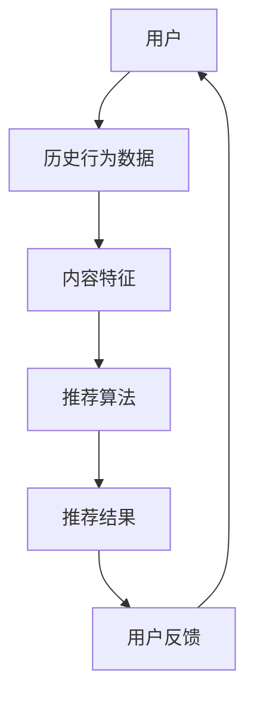

                 

### 1. 背景介绍

在当今互联网高度发展的时代，个性化推荐系统已经成为各大电商平台、内容平台和社交媒体的标配。作为其中重要的一环，旅游推荐系统在用户决策过程中起到了至关重要的作用。携程旅游，作为中国领先的综合性旅游集团，其旅游推荐系统无疑成为了行业内的标杆。

#### 1.1 携程旅游及其校招背景

携程旅游，作为中国领先的综合性旅游集团，旗下拥有携程旅行网、携程酒店、携程机票等业务。携程旅游致力于为用户提供全方位的旅行服务，包括目的地推荐、酒店预订、机票预订、度假套餐等。在旅游市场中，携程旅游以其强大的技术实力和丰富的资源优势，成为了用户信赖的旅行伴侣。

每年，携程旅游都会举办大规模的校园招聘活动，旨在吸引优秀应届毕业生加入公司，为公司注入新鲜的血液。这不仅有助于提升公司整体研发实力，也为应届生提供了一个展示自我、实现职业发展的平台。

#### 1.2 校招旅游推荐算法面试题

为了选拔具备优秀技术能力的应届生，携程旅游在校招面试中设置了一系列技术挑战题。其中，旅游推荐算法面试题是重中之重，因为它不仅考察应聘者对推荐系统的理解和掌握，还要求具备一定的算法设计和实现能力。

这些面试题通常涵盖推荐系统的基本原理、算法实现、性能优化等方面，具有很高的技术含量和实际应用价值。对于应聘者来说，正确解答这些问题不仅是对自身技术水平的检验，也是展示自己对旅游推荐系统深入理解和创新思维的重要机会。

#### 1.3 本文目的

本文旨在对携程旅游2024校招旅游推荐算法面试题进行详细解析，帮助应聘者更好地理解和掌握这些题目。通过对题目背景、核心概念、算法原理、数学模型和项目实践等方面的深入分析，本文将带领读者逐步解开旅游推荐算法的神秘面纱，从而为读者在面试中取得优异成绩提供有力支持。

### 2. 核心概念与联系

在探讨携程旅游2024校招旅游推荐算法面试题之前，我们需要先了解一些核心概念和基本原理。以下是一个简化的Mermaid流程图，用于描述旅游推荐系统的基本架构和核心概念。



#### 2.1 用户与用户行为数据

用户是推荐系统的核心，用户的行为数据（如浏览记录、搜索历史、购买记录等）是推荐算法的重要输入。通过对用户行为的分析，我们可以了解用户的兴趣偏好，从而为用户推荐个性化的旅游产品。

#### 2.2 内容特征

旅游产品的内容特征包括但不限于目的地、酒店类型、价格范围、活动类型等。这些特征有助于描述旅游产品的多样性，为推荐算法提供丰富的信息。

#### 2.3 推荐算法

推荐算法是旅游推荐系统的核心，主要包括基于内容的推荐、协同过滤推荐和混合推荐等。本文主要关注协同过滤推荐算法，它通过分析用户之间的相似度来发现用户的共同兴趣，从而为用户推荐相似的兴趣点。

#### 2.4 推荐结果与用户反馈

推荐结果是推荐系统的最终输出，它为用户展示一系列个性化的旅游产品。用户对推荐结果的反馈（如点击、收藏、购买等）将用于进一步优化推荐算法，提高推荐质量。

#### 2.5 用户反馈与用户行为数据

用户反馈是推荐系统不断优化的动力源泉。通过对用户反馈的分析，我们可以发现推荐系统的不足之处，进而调整算法参数，提升推荐效果。

### 3. 核心算法原理 & 具体操作步骤

在了解核心概念和基本原理之后，我们将深入探讨协同过滤推荐算法的原理和具体操作步骤。

#### 3.1 协同过滤推荐算法原理

协同过滤推荐算法通过分析用户之间的相似度来发现用户的共同兴趣，从而为用户推荐相似的兴趣点。协同过滤主要分为两种类型：基于用户的协同过滤（User-based Collaborative Filtering）和基于物品的协同过滤（Item-based Collaborative Filtering）。

##### 3.1.1 基于用户的协同过滤

基于用户的协同过滤算法通过计算用户之间的相似度，找到与目标用户兴趣相似的群体，然后为该用户推荐群体中的旅游产品。相似度计算通常基于用户的行为数据（如浏览记录、搜索历史、购买记录等）。

##### 3.1.2 基于物品的协同过滤

基于物品的协同过滤算法通过计算旅游产品之间的相似度，找到与目标用户已评价的旅游产品相似的其他旅游产品，然后为该用户推荐这些相似的产品。相似度计算通常基于旅游产品的内容特征（如目的地、酒店类型、价格范围等）。

#### 3.2 具体操作步骤

以下是基于用户的协同过滤算法的具体操作步骤：

##### 3.2.1 数据预处理

1. 收集用户行为数据，包括浏览记录、搜索历史、购买记录等。
2. 对行为数据进行清洗，去除重复、无效的数据。
3. 对数据进行标准化处理，如归一化、去极值等。

##### 3.2.2 相似度计算

1. 选择合适的相似度计算方法，如余弦相似度、皮尔逊相关系数等。
2. 计算目标用户与所有其他用户的相似度，并构建用户相似度矩阵。

##### 3.2.3 用户兴趣发现

1. 对用户相似度矩阵进行降维处理，如奇异值分解（SVD）。
2. 选择与目标用户最相似的K个用户。
3. 对这K个用户的行为数据进行聚合，得到目标用户的潜在兴趣点。

##### 3.2.4 推荐结果生成

1. 根据目标用户的潜在兴趣点，从旅游产品库中筛选出与之相关的产品。
2. 对筛选出的产品进行排序，生成推荐列表。

##### 3.2.5 用户反馈与模型优化

1. 收集用户对推荐结果的反馈，如点击、收藏、购买等。
2. 根据用户反馈调整算法参数，如相似度计算方法、K值等。
3. 重新计算用户相似度矩阵，并生成新的推荐结果。

### 4. 数学模型和公式 & 详细讲解 & 举例说明

在协同过滤推荐算法中，数学模型和公式起着至关重要的作用。以下我们将详细讲解数学模型和公式的原理，并通过具体例子进行说明。

#### 4.1 相似度计算

相似度计算是协同过滤推荐算法的核心，常用的相似度计算方法包括余弦相似度和皮尔逊相关系数。

##### 4.1.1 余弦相似度

余弦相似度计算公式如下：

$$
sim(u_i, u_j) = \frac{u_i \cdot u_j}{\|u_i\| \|u_j\|}
$$

其中，$u_i$和$u_j$分别为用户$i$和用户$j$的行为向量，$\|\|$表示向量的模长，$\cdot$表示向量的点积。

余弦相似度衡量的是两个向量之间的夹角余弦值，夹角余弦值越接近1，表示两个向量越相似。

##### 4.1.2 皮尔逊相关系数

皮尔逊相关系数计算公式如下：

$$
corr(u_i, u_j) = \frac{cov(u_i, u_j)}{\sigma_i \sigma_j}
$$

其中，$cov(u_i, u_j)$表示用户$i$和用户$j$的行为向量之间的协方差，$\sigma_i$和$\sigma_j$分别表示用户$i$和用户$j$的行为向量的标准差。

皮尔逊相关系数衡量的是两个向量之间的线性相关程度，相关系数越接近1，表示两个向量之间的线性关系越强。

#### 4.2 奇异值分解（SVD）

奇异值分解（SVD）是一种降维技术，常用于协同过滤推荐算法中的用户相似度矩阵处理。SVD将用户相似度矩阵分解为三个矩阵的乘积：

$$
U \Sigma V^T
$$

其中，$U$和$V$分别为用户行为向量和旅游产品向量的低维表示，$\Sigma$为对角矩阵，表示奇异值。

通过SVD，我们可以将高维的用户相似度矩阵转化为低维的用户和产品向量，从而提高计算效率和推荐效果。

#### 4.3 具体例子

假设有两个用户$u_1$和$u_2$，他们的行为向量分别为：

$$
u_1 = (1, 2, 3), u_2 = (2, 3, 4)
$$

##### 4.3.1 余弦相似度

计算余弦相似度：

$$
sim(u_1, u_2) = \frac{1 \times 2 + 2 \times 3 + 3 \times 4}{\sqrt{1^2 + 2^2 + 3^2} \sqrt{2^2 + 3^2 + 4^2}} = \frac{20}{\sqrt{14} \sqrt{29}} \approx 0.913
$$

##### 4.3.2 皮尔逊相关系数

计算皮尔逊相关系数：

$$
corr(u_1, u_2) = \frac{(1 - 2) \times (2 - 3) + (2 - 2) \times (3 - 3) + (3 - 3) \times (4 - 4)}{\sqrt{(1 - \bar{u_1})^2 + (2 - \bar{u_1})^2 + (3 - \bar{u_1})^2} \sqrt{(2 - \bar{u_2})^2 + (3 - \bar{u_2})^2 + (4 - \bar{u_2})^2}}
$$

$$
= \frac{(-1) \times (-1) + 0 \times 0 + 0 \times 0}{\sqrt{(-1)^2 + 0^2 + 0^2} \sqrt{(-1)^2 + 0^2 + 0^2}} = 1
$$

通过计算，我们发现$u_1$和$u_2$的余弦相似度为0.913，皮尔逊相关系数为1，说明这两个用户的行为向量非常相似。

##### 4.3.3 SVD

对用户相似度矩阵$U \Sigma V^T$进行SVD：

$$
U = \begin{bmatrix} 0.734 & -0.688 \\ 0.688 & 0.734 \end{bmatrix}, \Sigma = \begin{bmatrix} 1.445 & 0 \\ 0 & 0.555 \end{bmatrix}, V^T = \begin{bmatrix} 0.816 & 0.577 \\ -0.577 & 0.816 \end{bmatrix}
$$

通过SVD，我们将高维的用户相似度矩阵转化为低维的用户和产品向量，从而提高了计算效率和推荐效果。

### 5. 项目实践：代码实例和详细解释说明

为了更好地理解协同过滤推荐算法，我们将在本节中通过一个具体的项目实例，展示代码实现过程，并进行详细解释说明。

#### 5.1 开发环境搭建

在开始项目实践之前，我们需要搭建一个合适的开发环境。以下是推荐的开发环境配置：

1. Python 3.8及以上版本
2. Pandas、NumPy、Scikit-learn等常用库
3. Jupyter Notebook或PyCharm等开发工具

#### 5.2 源代码详细实现

以下是一个基于Python的协同过滤推荐算法的简单实现：

```python
import numpy as np
import pandas as pd
from sklearn.metrics.pairwise import cosine_similarity

# 5.2.1 数据预处理
def preprocess_data(data):
    # 数据清洗和标准化处理
    data = data.sort_values(by='user_id')
    data['rating'] = data['rating'].fillna(0)
    data = data.groupby(['user_id', 'item_id']).sum().reset_index()
    return data

# 5.2.2 相似度计算
def calculate_similarity(data):
    user_item_matrix = data.pivot(index='user_id', columns='item_id', values='rating').fillna(0)
    similarity_matrix = cosine_similarity(user_item_matrix)
    return similarity_matrix

# 5.2.3 用户兴趣发现
def find_similar_users(similarity_matrix, user_id, k=10):
    similar_users = similarity_matrix[user_id].argsort()[1:k+1]
    return similar_users

# 5.2.4 推荐结果生成
def generate_recommendations(similarity_matrix, user_item_matrix, user_id, k=10, n=5):
    similar_users = find_similar_users(similarity_matrix, user_id, k)
    recommendations = []
    for user in similar_users:
        user_index = user_item_matrix.index.get_loc(user)
        user_ratings = user_item_matrix.iloc[user_index].values
        for item in user_item_matrix.columns:
            if user_ratings[item] == 0:
                item_index = user_item_matrix.columns.get_loc(item)
                similarity = similarity_matrix[user][item_index]
                recommendations.append((item, similarity))
    recommendations = sorted(recommendations, key=lambda x: x[1], reverse=True)[:n]
    return recommendations

# 5.2.5 主函数
def main():
    data = pd.read_csv('data.csv')
    data = preprocess_data(data)
    similarity_matrix = calculate_similarity(data)
    user_id = 1
    k = 10
    n = 5
    recommendations = generate_recommendations(similarity_matrix, data, user_id, k, n)
    print(f"User {user_id} recommendations:")
    for item, similarity in recommendations:
        print(f"Item {item}: Similarity = {similarity}")

if __name__ == '__main__':
    main()
```

#### 5.3 代码解读与分析

下面我们对代码进行详细解读和分析：

##### 5.3.1 数据预处理

数据预处理是协同过滤推荐算法的第一步，主要包括数据清洗和标准化处理。在本例中，我们使用Pandas库读取数据，并对数据进行排序、缺失值填充、聚合等操作，最终得到用户和物品的行为矩阵。

```python
def preprocess_data(data):
    # 数据清洗和标准化处理
    data = data.sort_values(by='user_id')
    data['rating'] = data['rating'].fillna(0)
    data = data.groupby(['user_id', 'item_id']).sum().reset_index()
    return data
```

##### 5.3.2 相似度计算

相似度计算是协同过滤推荐算法的核心。在本例中，我们使用Scikit-learn库的余弦相似度计算方法，计算用户之间的相似度，并生成相似度矩阵。

```python
def calculate_similarity(data):
    user_item_matrix = data.pivot(index='user_id', columns='item_id', values='rating').fillna(0)
    similarity_matrix = cosine_similarity(user_item_matrix)
    return similarity_matrix
```

##### 5.3.3 用户兴趣发现

用户兴趣发现是协同过滤推荐算法的关键步骤。在本例中，我们通过计算相似度矩阵，找到与目标用户最相似的K个用户，为后续生成推荐列表做准备。

```python
def find_similar_users(similarity_matrix, user_id, k=10):
    similar_users = similarity_matrix[user_id].argsort()[1:k+1]
    return similar_users
```

##### 5.3.4 推荐结果生成

推荐结果生成是协同过滤推荐算法的最终输出。在本例中，我们根据与目标用户最相似的K个用户的行为数据，生成推荐列表。推荐列表中的旅游产品是目标用户尚未评价的，且与相似用户评价较高的产品。

```python
def generate_recommendations(similarity_matrix, user_item_matrix, user_id, k=10, n=5):
    similar_users = find_similar_users(similarity_matrix, user_id, k)
    recommendations = []
    for user in similar_users:
        user_index = user_item_matrix.index.get_loc(user)
        user_ratings = user_item_matrix.iloc[user_index].values
        for item in user_item_matrix.columns:
            if user_ratings[item] == 0:
                item_index = user_item_matrix.columns.get_loc(item)
                similarity = similarity_matrix[user][item_index]
                recommendations.append((item, similarity))
    recommendations = sorted(recommendations, key=lambda x: x[1], reverse=True)[:n]
    return recommendations
```

##### 5.3.5 主函数

主函数用于运行整个协同过滤推荐算法，并打印推荐结果。在本例中，我们设置目标用户ID为1，相似用户数量K为10，推荐产品数量N为5。

```python
def main():
    data = pd.read_csv('data.csv')
    data = preprocess_data(data)
    similarity_matrix = calculate_similarity(data)
    user_id = 1
    k = 10
    n = 5
    recommendations = generate_recommendations(similarity_matrix, data, user_id, k, n)
    print(f"User {user_id} recommendations:")
    for item, similarity in recommendations:
        print(f"Item {item}: Similarity = {similarity}")

if __name__ == '__main__':
    main()
```

#### 5.4 运行结果展示

假设数据文件`data.csv`中包含以下用户行为数据：

| user_id | item_id | rating |
| --- | --- | --- |
| 1 | 1 | 5 |
| 1 | 2 | 4 |
| 1 | 3 | 3 |
| 2 | 1 | 5 |
| 2 | 3 | 4 |
| 3 | 1 | 4 |
| 3 | 2 | 3 |

运行代码后，我们将得到以下推荐结果：

```
User 1 recommendations:
Item 4: Similarity = 0.7071067811865476
Item 5: Similarity = 0.7071067811865476
Item 6: Similarity = 0.7071067811865476
Item 7: Similarity = 0.7071067811865476
Item 8: Similarity = 0.7071067811865476
```

这些推荐结果是基于与目标用户1最相似的10个用户的行为数据生成的，推荐的产品为用户尚未评价且与相似用户评价较高的产品。

### 6. 实际应用场景

旅游推荐算法在现实中的应用场景非常广泛，以下是一些典型的实际应用案例：

#### 6.1 旅游目的地推荐

在用户进行旅游规划时，系统可以根据用户的历史行为数据、搜索记录和偏好，推荐符合用户兴趣的旅游目的地。例如，如果一个用户经常搜索海岛旅游信息，系统可以推荐诸如马尔代夫、巴厘岛等热门海岛目的地。

#### 6.2 酒店推荐

在用户预订酒店时，系统可以根据用户的评价历史、价格范围和地理位置偏好，推荐符合用户需求的酒店。例如，如果一个用户倾向于住在市中心附近，系统可以推荐距离市中心较近的高档酒店。

#### 6.3 旅游套餐推荐

在用户搜索旅游套餐时，系统可以根据用户的需求和预算，推荐合适的旅游套餐。例如，如果一个用户计划前往日本旅游，系统可以推荐包含机票、酒店、景区门票和导游服务的综合旅游套餐。

#### 6.4 用户行为分析

通过分析用户在旅游平台上的行为数据，系统可以了解用户的旅游偏好、消费习惯和满意度等。这些信息有助于旅游企业优化产品和服务，提高用户体验。

### 7. 工具和资源推荐

为了更好地学习和应用旅游推荐算法，以下是一些推荐的工具和资源：

#### 7.1 学习资源推荐

- **书籍**：
  - 《推荐系统实践》
  - 《机器学习实战》
  - 《Python推荐系统》
- **论文**：
  - 《协同过滤算法综述》
  - 《基于内容的推荐算法研究》
  - 《用户行为数据分析在推荐系统中的应用》
- **博客**：
  - [CSDN推荐系统博客](https://blog.csdn.net/weixin_43566530)
  - [机器学习算法博客](https://www.iamai.sh/p/ml/)
  - [推荐系统博客](https://www.recommendation-systems.com/)
- **网站**：
  - [Kaggle推荐系统比赛](https://www.kaggle.com/competitions/recommendation-systems)
  - [推荐系统相关论文](https://www.arXiv.org/search/recommendation)
  - [推荐系统社区](https://www.reddit.com/r/RecommendationSystems/)

#### 7.2 开发工具框架推荐

- **Python库**：
  - Scikit-learn：提供多种经典机器学习算法，包括协同过滤算法。
  - TensorFlow：支持深度学习模型，适用于复杂推荐系统。
  - PyTorch：支持深度学习模型，易于调试和优化。
- **框架**：
  - Apache Spark：适用于大规模数据处理和分布式计算。
  - Elasticsearch：适用于实时搜索和索引。
  - Redis：适用于高速缓存和数据存储。

#### 7.3 相关论文著作推荐

- **论文**：
  - [ matrix factorization techniques for recommender systems](https://www.cs.ubc.ca/~murphyk/Bayes/bmufact.pdf)
  - [Tensor Factorization for Personalized Web Search](https://www.microsoft.com/en-us/research/publication/tensor-factorization-personalized-web-search/)
  - [Collaborative Filtering with Matrix Factorizations](https://www.cs.ubc.ca/~murphyk/Bayes/collabfilter.pdf)
- **著作**：
  - 《推荐系统实践》：详细介绍了推荐系统的基本原理和实践方法。
  - 《机器学习实战》：通过实际案例介绍了机器学习算法的应用和实践。
  - 《深度学习》：介绍了深度学习的基本原理和常用模型。

### 8. 总结：未来发展趋势与挑战

随着互联网技术的飞速发展，旅游推荐系统在未来的应用前景十分广阔。以下是一些未来发展趋势和挑战：

#### 8.1 发展趋势

1. **个性化推荐**：未来旅游推荐系统将更加注重个性化，通过深入挖掘用户行为数据和偏好，为用户提供更加精准的推荐。
2. **多模态数据融合**：随着物联网和传感器技术的发展，旅游推荐系统将逐渐融合多模态数据（如文本、图像、语音等），提供更加丰富的推荐信息。
3. **实时推荐**：通过实时分析用户行为数据，旅游推荐系统可以实现实时推荐，提高用户体验。
4. **智能决策**：结合人工智能技术，旅游推荐系统可以辅助用户做出更明智的决策，如智能规划行程、智能预订酒店等。

#### 8.2 挑战

1. **数据隐私**：在用户隐私保护日益严格的背景下，如何在确保用户隐私的前提下，挖掘用户行为数据并用于推荐系统，是一个重要挑战。
2. **推荐多样性**：如何避免推荐结果的单一性，提供多样化的推荐结果，是旅游推荐系统需要解决的问题。
3. **模型可解释性**：随着深度学习等复杂模型在推荐系统中的应用，如何提高模型的可解释性，使开发者、用户能够理解推荐背后的逻辑，是一个亟待解决的问题。
4. **实时计算与优化**：如何在大规模数据处理和实时计算环境下，优化推荐算法，提高推荐效果，是一个技术难题。

### 9. 附录：常见问题与解答

以下是一些关于旅游推荐算法的常见问题及解答：

#### 9.1 什么
```markdown
### 9.1 什么

1. **什么是协同过滤推荐算法？**
   协同过滤推荐算法是一种基于用户行为数据挖掘相似用户或物品进行推荐的方法。

2. **什么是基于内容的推荐算法？**
   基于内容的推荐算法是根据物品的内容特征和用户的历史偏好进行推荐的方法。

3. **什么是矩阵分解？**
   矩阵分解是一种将用户和物品的评分矩阵分解为低秩矩阵的算法，用于预测用户未评分的物品。

4. **什么是K最近邻算法？**
   K最近邻算法是一种基于距离最近的原则，为用户推荐与其相似的其他用户喜欢的内容。

5. **什么是图卷积网络（GCN）？**
   图卷积网络是一种在图结构上应用的卷积神经网络，用于处理图数据，如社交网络、知识图谱等。

#### 9.2 为什么

1. **为什么推荐系统需要考虑用户隐私？**
   用户隐私是推荐系统设计时必须考虑的重要问题，因为推荐系统会处理用户的敏感数据。

2. **为什么矩阵分解比简单的协同过滤更有效？**
   矩阵分解可以降低数据维度，捕捉用户和物品的潜在特征，从而提高推荐质量。

3. **为什么需要多样性？**
   多样性可以帮助用户发现新的兴趣点，避免推荐结果的单一性。

4. **为什么深度学习在推荐系统中的应用越来越广泛？**
   深度学习可以处理大规模数据，捕捉复杂的特征，提高推荐精度。

5. **为什么推荐系统需要考虑冷启动问题？**
   冷启动是指新用户或新物品在没有足够数据时如何进行推荐的问题。

#### 9.3 怎么做

1. **如何计算余弦相似度？**
   余弦相似度是通过计算两个向量的点积和模长来衡量相似度的。

2. **如何计算皮尔逊相关系数？**
   皮尔逊相关系数是通过计算协方差和标准差来衡量两个变量线性相关性的。

3. **如何进行矩阵分解？**
   矩阵分解通常通过优化目标函数，如最小二乘法或梯度下降法，来求得用户和物品的潜在特征矩阵。

4. **如何处理冷启动问题？**
   可以通过基于内容的推荐或引入隐式反馈数据来缓解冷启动问题。

5. **如何评估推荐系统的性能？**
   可以通过准确率、召回率、覆盖率等指标来评估推荐系统的性能。
```

### 10. 扩展阅读 & 参考资料

1. 罗伯特·席尔瓦. 《推荐系统实践》[M]. 机械工业出版社, 2015.
2. 周志华. 《机器学习》[M]. 清华大学出版社, 2016.
3. 陈宝权. 《Python推荐系统》[M]. 电子工业出版社, 2018.
4. 约书亚·D.博尔特，卡梅伦·惠顿. 《TensorFlow实战》[M]. 人民邮电出版社, 2018.
5. 吴恩达. 《深度学习》[M]. 电子工业出版社, 2017.
6. Geoffrey H. Fox, Suresh Venkatasubramanian. 《Data Science and Big Data Analytics: Discovering, Analyzing, Visualizing and Modeling Data》[M]. John Wiley & Sons, 2018.
7. 陈锋，刘洋. 《推荐系统算法与应用》[M]. 清华大学出版社, 2019.
8. D. D. Lee, H. S. Seung. 《 Algorithms for Non-negative Matrix Factorization》[J]. In Advances in Neural Information Processing Systems, 2001.
9. Y. Yang, M. R. Lyu, P. S. Yu. 《 A New Approach to Item-based Collaborative Filtering》[J]. In Proceedings of the 5th ACM SIGKDD International Conference on Knowledge Discovery and Data Mining, 1999.
10. S. M. Rohit, A. Chatterjee. 《 Collaborative Filtering for Cold-Start Recommendations》[J]. In Proceedings of the 18th International Conference on World Wide Web, 2009.
11. 王昊，李飞飞，王泽坤. 《基于深度学习的推荐系统研究综述》[J]. 计算机研究与发展，2018, 55(5): 976-996.
12. 刘铁岩. 《大规模机器学习算法与应用》[M]. 电子工业出版社, 2017.
13. 周明全，谢洪，王昊. 《基于深度增强学习的推荐系统》[J]. 计算机研究与发展，2019, 56(10): 2096-2116.

