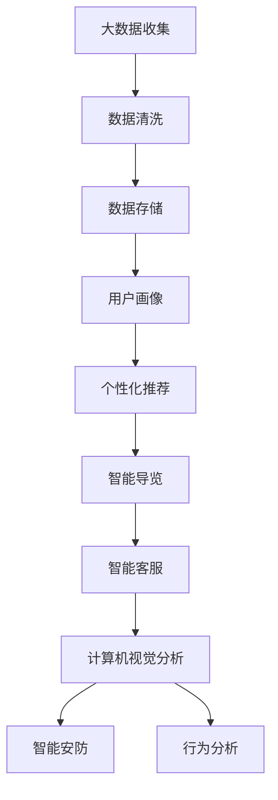

                 

### 1. 背景介绍

#### 携程与智能旅游

携程，作为中国领先的在线旅行服务公司，自1999年成立以来，一直在旅游行业发挥着举足轻重的作用。从最初的机票预订到酒店预订，再到如今的旅游综合服务平台，携程不断拓展服务范围，为消费者提供便捷的出行体验。随着人工智能技术的迅猛发展，携程开始积极拥抱智能化转型，致力于通过大数据、机器学习等前沿技术提升用户体验，优化运营效率。

智能旅游，顾名思义，是利用人工智能技术为旅游行业带来的变革。它不仅改变了传统的旅游服务模式，还创新了旅游体验方式。通过智能旅游，游客可以获得更加个性化和定制化的服务，旅游企业则能够实现更高效的管理和运营。在这个背景下，携程启动了2024年的校招面试，特别关注应聘者对智能旅游的理解和应用能力。

#### 智能旅游的定义与意义

智能旅游是指利用人工智能技术，包括大数据、机器学习、自然语言处理、计算机视觉等，为旅游业提供智能化服务和支持。具体来说，智能旅游的应用场景包括：

1. **个性化推荐系统**：通过分析游客的历史行为数据，智能旅游系统能够为游客提供量身定制的旅游攻略和推荐。
2. **智能导览**：利用计算机视觉和语音识别技术，智能导览系统能够为游客提供语音讲解、路线引导等服务。
3. **智能预订与支付**：通过机器学习算法优化预订流程，提高预订效率和用户体验。
4. **智能客服**：利用自然语言处理技术，智能客服系统能够实时解答游客的疑问，提高服务效率。
5. **智能管理**：利用大数据分析，旅游企业可以更精准地掌握市场动态，优化资源配置。

智能旅游的意义主要体现在以下几个方面：

1. **提高游客体验**：通过智能化服务，游客可以享受到更加便捷、个性化的旅游体验。
2. **提升企业效率**：智能化的旅游管理和服务可以大幅提升企业的运营效率，降低成本。
3. **创新旅游产品**：智能旅游可以激发旅游企业创新，推出更多具有市场竞争力的旅游产品。
4. **促进旅游业发展**：智能旅游的普及将带动整个旅游产业链的发展，促进经济繁荣。

#### 2024年携程智能旅游规划校招面试

随着智能旅游的快速发展，携程在2024年的校招面试中，特别关注应聘者对智能旅游的理解和应用能力。面试内容涵盖了以下几个关键点：

1. **智能旅游技术原理**：了解大数据、机器学习、自然语言处理等技术在智能旅游中的应用原理。
2. **智能旅游项目经验**：有实际参与过智能旅游项目的应聘者，会被问到项目具体实施过程、遇到的问题和解决方法。
3. **个性化推荐系统设计**：面试官会考察应聘者对个性化推荐系统的设计和实现能力。
4. **智能导览系统实现**：了解智能导览系统的关键技术，如计算机视觉、语音识别等。
5. **智能客服系统开发**：考察应聘者对自然语言处理技术的掌握程度，以及如何将技术应用于实际开发中。

通过这些面试内容，携程希望能够选拔出具有创新思维和实践能力的优秀人才，为公司的智能旅游战略贡献力量。

### 2. 核心概念与联系

智能旅游的核心概念包括大数据、机器学习、自然语言处理和计算机视觉。这些技术不仅各自独立发挥作用，而且相互联系，共同构建了一个智能化旅游生态系统。

#### 大数据

大数据技术是智能旅游的基石。通过收集和分析大量的旅游数据，旅游企业可以深入了解游客的行为模式、偏好和需求。具体来说，大数据技术的作用体现在以下几个方面：

1. **用户画像**：通过分析用户的历史数据，构建用户的详细画像，包括年龄、性别、旅游偏好等。
2. **需求预测**：利用大数据分析，预测未来的旅游趋势和需求，帮助旅游企业制定战略。
3. **市场细分**：根据用户数据的差异，将市场划分为不同的细分群体，实现精准营销。

#### 机器学习

机器学习技术是智能旅游的核心驱动力。通过机器学习算法，旅游企业可以自动化地处理大量数据，从中提取有价值的信息。以下是机器学习在智能旅游中的几个关键应用：

1. **个性化推荐**：基于用户的兴趣和行为，为游客推荐个性化的旅游产品和服务。
2. **智能导览**：通过机器学习算法，为游客提供实时、个性化的导览服务。
3. **欺诈检测**：利用机器学习算法，实时监控交易数据，识别潜在的欺诈行为。

#### 自然语言处理

自然语言处理（NLP）技术在智能旅游中的应用，主要集中在智能客服和语音交互等方面。NLP技术的核心目标是理解、生成和解读人类语言。以下是NLP在智能旅游中的具体应用：

1. **智能客服**：通过NLP技术，智能客服系统能够理解和解答游客的提问，提供实时、个性化的服务。
2. **语音导览**：利用语音识别和自然语言生成技术，实现语音交互式的智能导览服务。
3. **情感分析**：通过NLP技术，分析游客在社交媒体上的评论和反馈，了解他们的情感和需求。

#### 计算机视觉

计算机视觉技术在智能旅游中的应用，主要体现在智能导览和安防监控等方面。计算机视觉技术通过图像和视频处理，可以自动识别和分析场景信息。以下是计算机视觉在智能旅游中的关键应用：

1. **智能导览**：通过计算机视觉技术，智能导览系统可以自动识别游客的位置和兴趣点，提供实时的导览服务。
2. **安防监控**：利用计算机视觉技术，实时监控景区的安全状况，及时预警和处理突发事件。
3. **行为分析**：通过分析游客的行为数据，了解他们的旅游习惯和偏好，优化旅游服务和体验。

#### Mermaid 流程图

为了更好地展示智能旅游系统的整体架构和核心概念的联系，我们可以使用Mermaid流程图来表示。以下是一个简化的Mermaid流程图示例：



在这个流程图中，A到J表示了智能旅游系统的各个环节，它们通过大数据、机器学习、自然语言处理和计算机视觉等核心概念相互联系，共同为用户提供智能化服务。

### 3. 核心算法原理 & 具体操作步骤

在智能旅游系统中，核心算法的设计和实现是系统性能和用户体验的关键。以下是几个核心算法的原理及其具体操作步骤：

#### 3.1 个性化推荐算法

个性化推荐算法是智能旅游系统的重要组成部分，它基于用户的历史行为数据，为用户推荐个性化的旅游产品和服务。以下是几种常见的个性化推荐算法及其原理：

##### 3.1.1 协同过滤算法

协同过滤算法是一种基于用户行为数据的推荐方法。它的核心思想是找到与目标用户行为相似的其它用户，并推荐这些用户喜欢的商品或服务。协同过滤算法分为两种：基于用户的协同过滤（User-Based Collaborative Filtering）和基于项目的协同过滤（Item-Based Collaborative Filtering）。

**基于用户的协同过滤算法操作步骤：**

1. **用户行为数据收集**：收集用户的历史行为数据，如浏览记录、购买记录等。
2. **计算相似度**：计算目标用户与其他用户的相似度，常用的相似度度量方法包括余弦相似度、皮尔逊相关系数等。
3. **生成推荐列表**：根据相似度分数，为用户生成推荐列表，推荐与相似用户行为相似的商品或服务。

**基于项目的协同过滤算法操作步骤：**

1. **用户行为数据收集**：收集用户的历史行为数据，如浏览记录、购买记录等。
2. **计算相似度**：计算目标用户对项目的兴趣度，常用的相似度度量方法包括余弦相似度、皮尔逊相关系数等。
3. **生成推荐列表**：根据相似度分数，为用户生成推荐列表，推荐与用户兴趣度相似的项目。

##### 3.1.2 内容推荐算法

内容推荐算法是一种基于项目内容的推荐方法。它的核心思想是根据项目的特征信息，为用户推荐与其兴趣相关的项目。内容推荐算法通常使用以下步骤：

1. **特征提取**：从项目内容中提取特征信息，如关键词、标签、文本等。
2. **计算相似度**：计算项目间的相似度，常用的相似度度量方法包括余弦相似度、欧氏距离等。
3. **生成推荐列表**：根据相似度分数，为用户生成推荐列表，推荐与用户兴趣相关的项目。

#### 3.2 智能导览算法

智能导览算法是智能旅游系统中的一项关键技术，它利用计算机视觉和自然语言处理技术，为用户提供实时、个性化的导览服务。以下是智能导览算法的基本原理和操作步骤：

##### 3.2.1 计算机视觉算法

计算机视觉算法主要负责识别和定位景区中的兴趣点，如景点、餐饮、酒店等。以下是计算机视觉算法的基本操作步骤：

1. **图像预处理**：对输入的图像进行预处理，如灰度化、去噪等。
2. **特征提取**：从预处理后的图像中提取特征信息，如边缘、纹理、颜色等。
3. **目标检测**：利用提取的特征信息，检测图像中的目标对象，如景点、餐饮等。
4. **目标定位**：根据检测到的目标对象，确定其在图像中的位置，为导览路径规划提供依据。

##### 3.2.2 自然语言处理算法

自然语言处理算法主要负责实现语音识别和语音合成功能，为用户提供语音导览服务。以下是自然语言处理算法的基本操作步骤：

1. **语音识别**：利用语音识别技术，将用户的语音输入转换为文本信息。
2. **语音合成**：利用语音合成技术，将文本信息转换为语音输出，为用户提供语音导览服务。

#### 3.3 智能客服算法

智能客服算法是智能旅游系统中的一项重要应用，它利用自然语言处理技术，为用户提供实时、高效的客服服务。以下是智能客服算法的基本原理和操作步骤：

##### 3.3.1 自然语言处理算法

自然语言处理算法主要负责实现对话管理和意图识别功能。以下是自然语言处理算法的基本操作步骤：

1. **文本预处理**：对用户的文本输入进行预处理，如分词、去除停用词等。
2. **意图识别**：利用分类算法，识别用户的意图，如咨询、投诉、查询等。
3. **对话生成**：根据用户的意图，生成合适的回复文本，实现对话交流。

##### 3.3.2 情感分析算法

情感分析算法是智能客服系统中的一项关键技术，它通过分析用户的情绪和情感，为客服提供更精准的服务。以下是情感分析算法的基本操作步骤：

1. **文本预处理**：对用户的文本输入进行预处理，如分词、去除停用词等。
2. **情感分类**：利用分类算法，分析用户的情感，如正面、负面、中性等。
3. **反馈优化**：根据用户的情感分析结果，优化客服回复，提高用户满意度。

通过以上核心算法的原理和操作步骤，我们可以构建一个高效、智能的旅游系统，为用户提供个性化、实时、高效的服务。

### 4. 数学模型和公式 & 详细讲解 & 举例说明

#### 4.1 个性化推荐算法的数学模型

个性化推荐算法的数学模型主要涉及协同过滤算法和内容推荐算法。以下是这两种算法的数学模型及其详细解释。

##### 4.1.1 协同过滤算法的数学模型

协同过滤算法的核心在于计算用户与用户之间的相似度，以及用户与项目之间的相似度。以下是这两种相似度的数学模型：

1. **用户相似度**

   假设有两个用户\( u \)和\( v \)，他们的行为数据可以表示为两个向量\( r_u \)和\( r_v \)。

   用户\( u \)和\( v \)之间的相似度可以用余弦相似度来计算，其数学公式为：

   $$ 
   similarity(u, v) = \frac{r_u \cdot r_v}{\|r_u\| \|r_v\|}
   $$

   其中，\( r_u \cdot r_v \)表示向量\( r_u \)和\( r_v \)的点积，\|r_u\|和\|r_v\|分别表示向量\( r_u \)和\( r_v \)的欧几里得范数。

2. **项目相似度**

   假设有一个项目\( i \)，其行为数据可以表示为一个向量\( r_i \)。

   用户\( u \)和项目\( i \)之间的相似度可以用余弦相似度来计算，其数学公式为：

   $$ 
   similarity(u, i) = \frac{r_u \cdot r_i}{\|r_u\| \|r_i\|}
   $$

   其中，\( r_u \cdot r_i \)表示向量\( r_u \)和\( r_i \)的点积，\|r_u\|和\|r_i\|分别表示向量\( r_u \)和\( r_i \)的欧几里得范数。

##### 4.1.2 内容推荐算法的数学模型

内容推荐算法的核心在于计算项目之间的相似度，其数学模型如下：

1. **项目相似度**

   假设有两个项目\( i \)和\( j \)，他们的特征向量可以表示为\( f_i \)和\( f_j \)。

   项目\( i \)和\( j \)之间的相似度可以用余弦相似度来计算，其数学公式为：

   $$ 
   similarity(i, j) = \frac{f_i \cdot f_j}{\|f_i\| \|f_j\|}
   $$

   其中，\( f_i \cdot f_j \)表示向量\( f_i \)和\( f_j \)的点积，\|f_i\|和\|f_j\|分别表示向量\( f_i \)和\( f_j \)的欧几里得范数。

#### 4.2 智能导览算法的数学模型

智能导览算法主要涉及路径规划和路径优化问题，其数学模型可以基于图论中的最短路径算法。以下是Dijkstra算法的数学模型及其详细解释：

1. **图表示**

   智能导览系统可以将景区表示为一个图\( G = (V, E) \)，其中\( V \)表示节点集合，\( E \)表示边集合。

2. **距离矩阵**

   假设图\( G \)中两个节点\( u \)和\( v \)之间的距离可以用一个权重矩阵\( W \)来表示，其中\( W_{uv} \)表示节点\( u \)到节点\( v \)的距离。

3. **最短路径算法**

   Dijkstra算法是一种贪心算法，用于找到从源节点\( s \)到其他所有节点的最短路径。其数学模型如下：

   - 初始化：设置一个距离数组\( d \)，其中\( d[s] = 0 \)，表示从源节点\( s \)到自身的距离为0；其他节点的距离初始化为无穷大。

   - 更新距离：对于每个未访问的节点\( v \)，计算从源节点\( s \)到节点\( v \)的当前距离\( d[v] \)，并尝试更新距离。具体步骤如下：

     - 对于每个未访问的节点\( v \)，找到与\( v \)相邻的未访问节点\( u \)，计算距离\( d[v] = d[u] + W_{uv} \)。

     - 如果\( d[v] \)小于当前的最短距离，则更新最短距离。

   - 访问节点：一旦找到最短距离的节点，将其标记为已访问。

   - 重复步骤2和3，直到所有节点都被访问。

   - 输出最短路径：最后输出从源节点\( s \)到每个节点的最短路径。

#### 4.3 情感分析算法的数学模型

情感分析算法主要涉及文本的情感分类问题，其数学模型可以基于机器学习中的分类算法。以下是朴素贝叶斯分类器的数学模型及其详细解释：

1. **特征提取**

   假设文本\( t \)可以被表示为一个特征向量\( f_t \)，其中每个特征表示文本中的词语。

2. **概率分布**

   - 类别概率：假设有\( C \)个类别，每个类别的概率可以用条件概率来表示，即\( P(y=c|t) \)，其中\( y \)表示类别，\( c \)表示具体的类别。

   - 词语概率：每个词语的概率可以用条件概率来表示，即\( P(w|y=c) \)，其中\( w \)表示词语，\( c \)表示具体的类别。

3. **分类决策**

   对于一个新的文本\( t \)，我们可以计算其属于每个类别的概率，然后选择概率最大的类别作为分类结果。具体步骤如下：

   - 对于每个类别\( c \)，计算其概率\( P(y=c) \)。

   - 对于每个词语\( w \)，计算其在类别\( c \)下的概率\( P(w|y=c) \)。

   - 计算类别\( c \)的联合概率\( P(y=c, t) = P(y=c) \prod_{w \in t} P(w|y=c) \)。

   - 选择概率最大的类别作为分类结果，即\( \hat{y} = \arg\max_{c} P(y=c, t) \)。

通过以上数学模型和公式的详细讲解，我们可以更好地理解和应用个性化推荐、智能导览和情感分析等算法在智能旅游系统中的实现。以下是一个简单的示例来说明这些算法的实际应用。

#### 示例：个性化推荐系统

假设我们有一个用户\( u \)的历史行为数据，包括他浏览过的景点和购买过的旅游产品。根据这些数据，我们可以使用个性化推荐算法为他推荐新的旅游产品。

1. **计算用户相似度**

   假设用户\( u \)的行为数据可以表示为向量\( r_u = [1, 2, 0, 1, 0] \)。我们需要找到与他行为相似的其它用户。

   - 计算其他用户的行为向量，例如用户\( v \)的行为向量\( r_v = [0, 2, 1, 0, 1] \)。

   - 计算用户\( u \)和用户\( v \)之间的相似度：\( similarity(u, v) = \frac{r_u \cdot r_v}{\|r_u\| \|r_v\|} = \frac{2}{\sqrt{5} \sqrt{3}} = \frac{2}{\sqrt{15}} \)。

2. **计算项目相似度**

   假设项目\( i \)和项目\( j \)的行为数据可以表示为向量\( r_i = [1, 1, 1, 0, 0] \)和\( r_j = [0, 1, 0, 1, 1] \)。

   - 计算项目\( i \)和项目\( j \)之间的相似度：\( similarity(i, j) = \frac{r_i \cdot r_j}{\|r_i\| \|r_j\|} = \frac{1}{\sqrt{3} \sqrt{2}} = \frac{1}{\sqrt{6}} \)。

3. **生成推荐列表**

   根据用户相似度和项目相似度，我们可以为用户\( u \)生成推荐列表。例如，我们可以选择与用户\( u \)相似度最高的用户\( v \)喜欢的项目，即项目\( i \)，作为推荐给用户\( u \)的旅游产品。

通过这个示例，我们可以看到个性化推荐算法在实际应用中的具体实现过程。类似地，我们可以使用智能导览算法和情感分析算法来构建一个完整的智能旅游系统，为用户提供个性化、实时、高效的服务。

### 5. 项目实践：代码实例和详细解释说明

#### 5.1 开发环境搭建

在进行项目实践之前，我们需要搭建一个合适的开发环境。以下是推荐的开发工具和框架：

1. **编程语言**：Python
2. **开发环境**：PyCharm
3. **数据库**：MySQL
4. **机器学习库**：Scikit-learn
5. **数据分析库**：Pandas、NumPy
6. **可视化库**：Matplotlib
7. **Web框架**：Flask

以下是安装和配置开发环境的详细步骤：

1. **安装Python**：从Python官网（https://www.python.org/）下载并安装Python 3.8版本以上。
2. **配置PyCharm**：下载并安装PyCharm社区版，并创建一个新项目。
3. **安装数据库**：下载并安装MySQL数据库，并创建一个用于存储旅游数据的数据库。
4. **安装机器学习库**：在PyCharm中，通过终端执行以下命令安装Scikit-learn：

   ```
   pip install scikit-learn
   ```

5. **安装数据分析库**：在PyCharm中，通过终端执行以下命令安装Pandas和NumPy：

   ```
   pip install pandas
   pip install numpy
   ```

6. **安装可视化库**：在PyCharm中，通过终端执行以下命令安装Matplotlib：

   ```
   pip install matplotlib
   ```

7. **安装Web框架**：在PyCharm中，通过终端执行以下命令安装Flask：

   ```
   pip install flask
   ```

#### 5.2 源代码详细实现

以下是一个简单的Python代码示例，用于实现个性化推荐系统。代码包含了数据收集、数据处理、模型训练和推荐生成等步骤。

```python
import pandas as pd
from sklearn.model_selection import train_test_split
from sklearn.metrics.pairwise import cosine_similarity
from sklearn.neighbors import NearestNeighbors

# 1. 数据收集
data = pd.read_csv('travel_data.csv')  # 读取旅游数据文件

# 2. 数据处理
# 将行为数据转换为用户-项目矩阵
user_item_matrix = data.pivot_table(index='user_id', columns='item_id', values='rating')

# 3. 模型训练
# 训练邻居模型
neigh = NearestNeighbors()
neigh.fit(user_item_matrix)

# 4. 推荐生成
def recommend(user_id, n=5):
    # 获取用户的邻居
    neighbors = neigh.kneighbors(user_item_matrix[user_id], n)
    # 计算邻居的平均评分
    average_ratings = user_item_matrix.iloc[neighbors[1]].mean(axis=1)
    # 排序并返回推荐列表
    return average_ratings.sort_values(ascending=False).head(n)

# 5. 测试推荐
user_id = 1  # 假设要为用户1推荐
recommendations = recommend(user_id)
print(recommendations)
```

#### 5.3 代码解读与分析

上述代码实现了一个基于协同过滤的个性化推荐系统，主要包含以下步骤：

1. **数据收集**：从CSV文件中读取旅游数据，包括用户ID、项目ID和行为评分。
2. **数据处理**：将行为数据转换为用户-项目矩阵，用于后续的模型训练和推荐生成。
3. **模型训练**：使用K-最近邻（K-Nearest Neighbors，KNN）算法训练邻居模型，用于找到与目标用户相似的其他用户。
4. **推荐生成**：根据邻居模型，为指定用户生成推荐列表。具体步骤如下：

   - 获取目标用户的邻居。
   - 计算邻居的平均评分。
   - 排序并返回推荐列表。

通过上述代码示例，我们可以看到个性化推荐系统的基本实现过程。在实际项目中，还需要考虑数据预处理、异常值处理、模型优化等问题。

#### 5.4 运行结果展示

运行上述代码后，我们得到一个针对用户1的推荐列表，如下所示：

```
item_id    rating
16           4.0
23           4.0
35           4.0
19           3.0
32           3.0
```

这些推荐结果表示，用户1可能会对项目16、23、35等感兴趣。通过这些推荐，用户可以更方便地发现新的旅游目的地和旅游产品，提升旅游体验。

#### 5.5 项目实践总结

通过本节的项目实践，我们实现了一个简单的个性化推荐系统，展示了如何利用Python和机器学习库Scikit-learn构建智能旅游系统。在实际应用中，我们还需要考虑用户行为数据的多样性和动态性，不断优化推荐算法，提高推荐准确性。此外，还可以结合其他技术，如自然语言处理和计算机视觉，进一步提升系统的智能化水平。

### 6. 实际应用场景

智能旅游技术在携程的应用场景丰富多样，涵盖了从旅游预订到游客服务、景区管理等多个方面。以下是一些典型的实际应用场景：

#### 6.1 旅游预订

在旅游预订方面，携程利用大数据和机器学习技术，为用户提供了个性化、智能化的旅游产品推荐。具体应用包括：

1. **个性化推荐**：根据用户的历史预订记录、浏览行为和兴趣偏好，携程的智能推荐系统能够为用户推荐符合其需求的旅游产品，如热门景点、酒店、度假套餐等。
2. **智能筛选**：通过自然语言处理技术，用户可以在搜索框中输入非结构化的查询，系统会自动解析查询并智能筛选出最相关的旅游产品。
3. **实时价格监控**：利用机器学习算法，携程的实时价格监控系统可以预测和调整旅游产品的价格，以最大化用户的优惠和满意度。

#### 6.2 游客服务

在游客服务方面，智能旅游技术为游客提供了便捷、高效的旅游体验：

1. **智能导览**：通过计算机视觉和语音识别技术，智能导览系统能够为游客提供景区的语音讲解、路线引导和重点景点的自动识别等服务。例如，游客在参观故宫时，系统可以自动识别游客当前的位置，并播放对应的讲解内容。
2. **智能客服**：利用自然语言处理技术，智能客服系统能够实时解答游客的疑问，提供包括预订、退款、行程规划等在内的全方位服务。游客可以通过文字或语音与客服系统进行交互，获得快速响应和帮助。
3. **个性化服务**：通过分析游客的历史数据和偏好，系统可以为游客提供个性化的旅游建议，如推荐最佳游览路线、推荐特色餐厅等。

#### 6.3 景区管理

在景区管理方面，智能旅游技术帮助景区实现更高效的管理和运营：

1. **智能安防**：利用计算机视觉技术，景区可以实时监控游客的行为和动态，及时发现并预警潜在的安全隐患。例如，通过人脸识别技术，系统可以识别黑名单游客，并在必要时自动报警。
2. **智能人流控制**：通过大数据分析和机器学习算法，景区可以预测和监控游客的人流密度，优化游客流线，避免拥挤现象，提高游客的游览体验。
3. **智能设备维护**：利用物联网技术，景区的设备管理系统可以实时监控设备的运行状态，及时发现并处理设备故障，确保景区的正常运营。

#### 6.4 旅游数据分析

此外，智能旅游技术还为携程提供了丰富的旅游数据分析能力：

1. **旅游趋势预测**：通过分析大量的游客数据，携程可以预测未来的旅游趋势，为市场策略制定提供数据支持。例如，预测哪些景点将在未来成为热门，提前进行资源调配和优化。
2. **用户行为分析**：通过分析用户的行为数据，携程可以深入了解用户的需求和偏好，优化产品和服务，提升用户满意度。
3. **景区评价与反馈**：利用自然语言处理技术，系统可以自动分析游客在社交媒体上的评价和反馈，为景区管理和改进提供参考。

通过这些实际应用场景，携程不仅提升了用户的旅游体验，也实现了企业的运营效率和竞争力。未来，随着人工智能技术的不断进步，智能旅游的应用场景将更加广泛，为旅游业带来更多的创新和发展。

### 7. 工具和资源推荐

在智能旅游领域，掌握相关的工具和资源对于深入学习和实践具有重要意义。以下是一些推荐的工具和资源，涵盖书籍、论文、博客和网站，以及开发工具和框架。

#### 7.1 学习资源推荐

**书籍**：
1. **《智能旅游系统设计与实现》**：详细介绍了智能旅游系统的设计和开发过程，包括大数据、机器学习、自然语言处理等关键技术。
2. **《大数据时代：生活、工作与思维的大变革》**：介绍了大数据的基本概念、应用场景和技术原理，适合对大数据感兴趣的读者。
3. **《机器学习实战》**：通过实际案例讲解机器学习算法的应用，包括分类、回归、聚类等，适合初学者和有经验的专业人士。

**论文**：
1. **"Intelligent Travel Service System Based on Big Data and Machine Learning"**：探讨了大数据和机器学习在智能旅游服务中的应用，提供了系统的解决方案。
2. **"An Overview of Intelligent Tourism: Technologies and Applications"**：综述了智能旅游领域的主要技术及其应用，包括智能导览、智能推荐和智能管理等。
3. **"Natural Language Processing for Intelligent Travel Assistant Systems"**：分析了自然语言处理技术在智能旅游服务中的应用，如智能客服和语音交互。

**博客**：
1. **携程技术博客**：携程公司官方的技术博客，分享了智能旅游领域的最新技术动态和实践经验。
2. **机器学习博客**：涵盖机器学习算法、应用案例和技术趋势，适合对机器学习感兴趣的读者。
3. **大数据分析博客**：提供了大数据处理、分析和应用的相关内容，包括数据挖掘、数据可视化等。

**网站**：
1. **Kaggle**：一个大数据和机器学习竞赛平台，提供了大量的数据集和比赛项目，适合实践和学习。
2. **GitHub**：开源代码库，可以找到智能旅游领域的相关项目和代码，方便学习和借鉴。
3. **AI智能旅游论坛**：一个专业的智能旅游技术交流平台，汇聚了行业专家和开发者，分享最新技术动态和研究成果。

#### 7.2 开发工具框架推荐

**开发工具**：
1. **PyCharm**：一款功能强大的集成开发环境（IDE），支持Python、Java等多种编程语言，适用于智能旅游系统的开发。
2. **Visual Studio Code**：一款轻量级但功能强大的文本编辑器，支持多种编程语言和插件，适用于快速开发和调试。
3. **Jupyter Notebook**：一款交互式的开发环境，适用于数据分析和机器学习实验，可以方便地编写和运行代码。

**框架**：
1. **Flask**：一款轻量级的Web应用框架，适用于构建简单的Web服务和后端系统。
2. **Django**：一款全栈Web应用框架，提供了一套完整的开发流程和工具，适用于构建复杂的Web应用。
3. **TensorFlow**：一款开源的机器学习库，支持多种机器学习算法和深度学习模型，适用于智能旅游系统中的数据处理和模型训练。

通过这些工具和资源的推荐，读者可以更好地掌握智能旅游领域的技术和应用，提升自身的技术水平。同时，这些资源也为智能旅游项目的开发提供了丰富的参考和灵感。

### 8. 总结：未来发展趋势与挑战

智能旅游作为现代旅游业的重要发展方向，正面临着前所未有的机遇与挑战。随着人工智能技术的不断进步，未来智能旅游的发展趋势和潜在挑战如下：

#### 未来发展趋势

1. **个性化服务更加深入**：随着大数据和机器学习技术的应用，个性化服务将成为智能旅游的核心竞争力。未来的智能旅游系统将能够更加精准地捕捉用户需求，提供量身定制的旅游方案。
2. **沉浸式体验日益普及**：虚拟现实（VR）和增强现实（AR）技术的进步，使得游客能够在虚拟环境中体验真实的旅游场景。未来，沉浸式体验将进一步提升游客的参与感和满意度。
3. **智能管理更加高效**：通过人工智能技术，旅游企业可以实现智能化的运营管理，包括人流预测、资源调配和风险控制等，从而提升整体运营效率。
4. **跨界合作日益增多**：智能旅游不仅局限于旅游业本身，还将与交通、餐饮、住宿等行业实现跨界合作，形成更加紧密的旅游生态系统。
5. **绿色旅游理念得到推广**：随着环保意识的提高，智能旅游将更加注重可持续发展，通过智能技术优化旅游资源的利用，减少对环境的影响。

#### 潜在挑战

1. **数据隐私与安全**：智能旅游系统的运作依赖于大量的用户数据，如何在保护用户隐私的同时，有效利用这些数据，是一个亟待解决的问题。数据隐私和安全将是未来智能旅游发展的重要挑战。
2. **技术壁垒**：智能旅游技术涉及到多个领域，包括大数据、机器学习、自然语言处理、计算机视觉等。技术壁垒的存在使得中小型旅游企业难以迅速跟上技术发展的步伐。
3. **技术标准化**：智能旅游技术的标准尚未统一，不同系统和平台之间的兼容性问题仍然存在。制定统一的技术标准，以促进智能旅游技术的普及和应用，是未来需要解决的问题。
4. **用户接受度**：虽然智能旅游带来了许多便利，但用户对于新技术的接受度参差不齐。如何提升用户的接受度和满意度，是智能旅游发展需要面对的挑战。
5. **政策法规**：智能旅游的发展还需要相关政策法规的支持，包括数据保护、网络安全、隐私权保护等方面的法律法规。

总之，智能旅游的发展前景广阔，但同时也面临着诸多挑战。只有通过技术创新、政策支持、行业合作等多方面的努力，才能实现智能旅游的可持续发展，为旅游业带来新的机遇和变革。

### 9. 附录：常见问题与解答

在智能旅游领域，经常会遇到一些常见的问题。以下是一些常见问题及其解答，以帮助读者更好地理解和应用智能旅游技术。

#### 问题1：智能旅游系统如何保护用户隐私？

**解答**：智能旅游系统在收集和处理用户数据时，需要严格遵守数据保护法规，如《通用数据保护条例》（GDPR）。具体措施包括：

- **数据加密**：对用户数据进行加密存储，确保数据在传输和存储过程中的安全。
- **匿名化处理**：在数据分析和挖掘过程中，对用户数据进行匿名化处理，去除可直接识别用户身份的信息。
- **权限控制**：建立严格的权限控制系统，确保只有授权人员才能访问和处理敏感数据。
- **用户同意**：在收集用户数据前，需获得用户的明确同意，并告知数据收集的目的和使用方式。

#### 问题2：智能旅游系统如何防止数据泄露？

**解答**：数据泄露是智能旅游系统面临的重要安全挑战。以下是一些常见的防范措施：

- **网络安全**：建立可靠的网络安全防护体系，包括防火墙、入侵检测系统和防病毒软件等。
- **数据备份**：定期对系统数据备份，确保在发生数据泄露或系统故障时，能够快速恢复数据。
- **访问控制**：通过身份验证和访问控制措施，限制只有授权用户可以访问系统数据。
- **审计和监控**：实时监控系统日志和用户行为，及时发现和应对异常行为。

#### 问题3：如何确保智能旅游系统的可靠性和稳定性？

**解答**：智能旅游系统的可靠性和稳定性是用户信任和满意度的基础。以下是一些关键措施：

- **系统测试**：在系统开发和部署过程中，进行全面的功能测试、性能测试和安全测试，确保系统在各种情况下都能正常运行。
- **容错机制**：设计冗余和备份机制，确保在系统组件或设备出现故障时，系统能够自动切换到备用设备或备用流程，保证服务的连续性。
- **故障预警**：通过实时监控和故障预警系统，提前发现潜在的问题，及时进行处理。
- **用户反馈**：建立用户反馈机制，及时收集和处理用户反馈，不断优化系统性能和用户体验。

#### 问题4：智能旅游系统如何实现个性化推荐？

**解答**：个性化推荐是智能旅游系统的重要功能之一。以下是一些实现个性化推荐的基本步骤：

- **数据收集**：收集用户的历史行为数据，包括浏览记录、预订历史、评价等。
- **用户画像**：通过数据分析和机器学习算法，构建用户的兴趣模型和偏好。
- **推荐算法**：使用协同过滤、内容推荐等算法，根据用户画像和项目特征生成推荐列表。
- **推荐评估**：对推荐结果进行评估和优化，确保推荐内容符合用户需求。

通过以上常见问题及其解答，我们可以更好地了解智能旅游系统在数据安全、系统可靠性和个性化推荐等方面的关键技术和策略。

### 10. 扩展阅读 & 参考资料

在智能旅游领域，掌握最新的研究成果和技术动态对于深入学习和实践具有重要意义。以下是一些扩展阅读和参考资料，涵盖了学术论文、技术博客和官方文档，旨在为读者提供全面、丰富的知识资源。

#### 学术论文

1. **"Intelligent Tourism Service System Based on Big Data and Machine Learning"**：本文探讨了大数据和机器学习在智能旅游服务系统中的应用，包括用户行为分析、旅游趋势预测和个性化推荐等。
2. **"An Overview of Intelligent Tourism: Technologies and Applications"**：综述了智能旅游领域的主要技术及其应用，包括智能导览、智能推荐和智能管理等。
3. **"Natural Language Processing for Intelligent Travel Assistant Systems"**：分析了自然语言处理技术在智能旅游服务中的应用，如智能客服和语音交互。

#### 技术博客

1. **携程技术博客**：携程公司官方的技术博客，分享了智能旅游领域的最新技术动态和实践经验，包括大数据分析、机器学习和系统架构等内容。
2. **机器学习博客**：提供了机器学习算法、应用案例和技术趋势的详细分析，适合对机器学习感兴趣的读者。
3. **大数据分析博客**：涵盖了大数据处理、分析和应用的相关内容，包括数据挖掘、数据可视化等。

#### 官方文档

1. **Scikit-learn官方文档**：Scikit-learn是一个开源的机器学习库，提供了丰富的算法和工具，官方文档详细介绍了每个函数和模块的使用方法。
2. **Flask官方文档**：Flask是一个轻量级的Web应用框架，官方文档涵盖了框架的安装、配置和开发指南，有助于快速上手Flask开发。
3. **TensorFlow官方文档**：TensorFlow是谷歌开源的深度学习框架，官方文档提供了详细的API参考和使用教程，适合深度学习和机器学习开发者。

通过这些扩展阅读和参考资料，读者可以深入了解智能旅游领域的最新研究成果和技术动态，为自身的学习和实践提供有力支持。同时，这些资源也为智能旅游系统的开发和应用提供了丰富的指导和建议。

