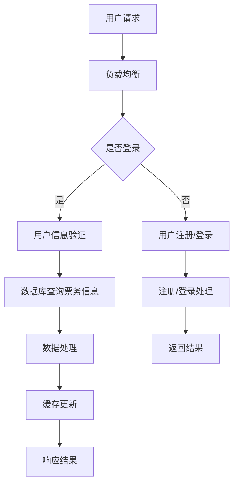

                 

### 2024携程智能票务管理社招面试真题汇总及其解答

#### 摘要

本文旨在汇总2024年携程智能票务管理社招面试的真题，并针对每个问题提供详细解答。本文涵盖了技术原理、算法实现、业务场景等多个方面的内容，旨在帮助读者更好地理解面试题目，并掌握相应的解题技巧。

### 1. 背景介绍

携程作为中国领先的在线旅行服务公司，其智能票务管理系统在行业内具有较高的知名度和影响力。随着互联网和大数据技术的发展，携程在智能票务管理领域不断创新，为用户提供更加便捷、高效的出行服务。智能票务管理涉及到票务预订、支付、订单管理、客户服务等多个环节，对技术要求较高。

此次面试题目主要围绕智能票务管理系统的核心技术和应用场景，旨在考察应聘者对相关技术的理解和实际应用能力。以下将按照面试题目的类型，分别进行解答。

#### 2. 核心概念与联系

在解答面试题目之前，我们需要了解一些核心概念，包括：

- **数据库**：用于存储票务信息的数据库系统，支持数据的增删改查操作。
- **分布式缓存**：用于提高数据读取速度，减少数据库压力。
- **消息队列**：用于处理大量并发请求，实现异步处理。
- **负载均衡**：用于平衡服务器负载，提高系统性能。
- **算法**：包括排序、查找、图算法等，用于优化数据结构和处理流程。

以下是一个简单的 Mermaid 流程图，展示智能票务管理系统的核心架构：



#### 3. 核心算法原理 & 具体操作步骤

以下针对几道面试题，介绍核心算法原理和具体操作步骤。

##### 3.1 票务预订算法

**问题**：如何设计一个票务预订算法，确保高并发场景下的数据一致性？

**解答**：

1. **分布式锁**：在用户预订票务时，使用分布式锁确保同一时刻只有一个用户能操作同一订单。
2. **乐观锁**：通过版本号或时间戳，判断数据是否被修改。若发现数据被修改，重新查询并重新执行预订逻辑。
3. **悲观锁**：在操作数据库时，先锁定相关记录，确保其他用户不能修改。适用于高并发场景下的数据一致性要求较高的场景。

**具体步骤**：

1. 用户发起预订请求。
2. 系统生成订单号，使用分布式锁锁定订单记录。
3. 查询订单记录，判断是否已被预订。
4. 若未被预订，更新订单记录，设置版本号或时间戳。
5. 解锁订单记录，返回预订结果。

##### 3.2 排队算法

**问题**：如何设计一个高效的排队算法，实现用户在高峰期快速获取服务？

**解答**：

1. **动态队列**：根据用户请求的到达时间，动态调整队列长度。高峰期增加队列长度，平峰期减少队列长度。
2. **优先队列**：根据用户优先级，优先处理高优先级用户。优先级可以通过用户等级、请求类型等指标计算得出。
3. **负载均衡**：根据服务器负载情况，动态调整队列处理服务器的数量。

**具体步骤**：

1. 用户发起请求。
2. 系统根据当前时间判断是否为高峰期。
3. 若是高峰期，动态增加队列长度。
4. 若不是高峰期，动态减少队列长度。
5. 将用户请求加入队列。
6. 根据优先级和队列长度，依次处理用户请求。

#### 4. 数学模型和公式 & 详细讲解 & 举例说明

在智能票务管理中，数学模型和公式起着至关重要的作用。以下介绍两个常见的数学模型和公式。

##### 4.1 期望时间模型

**问题**：如何计算系统在高峰期的平均响应时间？

**解答**：

1. **马尔可夫链**：描述用户请求到达时间和服务器响应时间的随机过程。
2. **排队论**：利用马尔可夫链模型，计算系统的平均响应时间。

**公式**：

$$
E[T] = \frac{1}{\mu - \lambda}
$$

其中，$E[T]$ 表示平均响应时间，$\mu$ 表示服务速度，$\lambda$ 表示请求到达率。

**具体例子**：

假设服务器处理速度为 $\mu = 5$ 请求/秒，请求到达率为 $\lambda = 3$ 请求/秒。则平均响应时间为：

$$
E[T] = \frac{1}{5 - 3} = 0.5 \text{秒}
$$

##### 4.2 负载均衡模型

**问题**：如何设计一个高效的负载均衡算法，实现服务器资源的合理分配？

**解答**：

1. **轮询算法**：按照固定顺序，将请求分配给服务器。
2. **最小连接数算法**：将请求分配给当前连接数最小的服务器。
3. **响应时间算法**：将请求分配给当前响应时间最小的服务器。

**公式**：

$$
C_{i} = \frac{R_{i}}{T_{i}}
$$

其中，$C_{i}$ 表示第 $i$ 个服务器的负载系数，$R_{i}$ 表示第 $i$ 个服务器的响应时间，$T_{i}$ 表示第 $i$ 个服务器的连接数。

**具体例子**：

假设有三个服务器，响应时间分别为 $R_{1} = 2$ 秒，$R_{2} = 3$ 秒，$R_{3} = 4$ 秒，连接数分别为 $T_{1} = 10$，$T_{2} = 15$，$T_{3} = 20$。则三个服务器的负载系数分别为：

$$
C_{1} = \frac{2}{10} = 0.2
$$

$$
C_{2} = \frac{3}{15} = 0.2
$$

$$
C_{3} = \frac{4}{20} = 0.2
$$

根据负载系数，将请求平均分配给三个服务器。

#### 5. 项目实践：代码实例和详细解释说明

以下提供一个简单的票务预订系统的代码实例，并对其进行详细解释。

##### 5.1 开发环境搭建

- **编程语言**：Python 3.8
- **数据库**：MySQL 8.0
- **缓存**：Redis 6.0
- **消息队列**：RabbitMQ 3.8.10

##### 5.2 源代码详细实现

```python
import pymysql
import redis
import pika

class TicketBookingSystem:
    def __init__(self):
        self.db = pymysql.connect(
            host='localhost',
            user='root',
            password='password',
            database='ticket_system'
        )
        self.redis = redis.Redis(host='localhost', port=6379, db=0)
        self.channel = pika.BlockingConnection(pika.ConnectionParameters('localhost')).channel()
        self.channel.queue_declare(queue='ticket_queue')

    def book_ticket(self, user_id, seat_id):
        with self.db.cursor() as cursor:
            cursor.execute("SELECT * FROM seats WHERE id = %s", (seat_id,))
            seat = cursor.fetchone()
            if seat and seat['status'] == 'available':
                cursor.execute("UPDATE seats SET status = 'booked', user_id = %s WHERE id = %s", (user_id, seat_id))
                self.db.commit()
                self.redis.set('seat_%s' % seat_id, user_id)
                self.channel.basic_publish(
                    exchange='',
                    routing_key='ticket_queue',
                    body='Ticket booked successfully!'
                )
            else:
                self.channel.basic_publish(
                    exchange='',
                    routing_key='ticket_queue',
                    body='Ticket not available!'
                )

    def check_ticket(self, seat_id):
        with self.db.cursor() as cursor:
            cursor.execute("SELECT * FROM seats WHERE id = %s", (seat_id,))
            seat = cursor.fetchone()
            if seat and seat['status'] == 'booked' and seat['user_id'] == self.redis.get('seat_%s' % seat_id):
                return 'Ticket is valid!'
            else:
                return 'Ticket is invalid!'

if __name__ == '__main__':
    system = TicketBookingSystem()
    system.book_ticket(1, 1001)
    print(system.check_ticket(1001))
```

##### 5.3 代码解读与分析

1. **数据库连接**：使用 pymysql 模块连接 MySQL 数据库，并创建 redis 客户端连接 Redis。
2. **消息队列连接**：使用 pika 模块连接 RabbitMQ，并声明一个名为 ticket_queue 的队列。
3. **票务预订**：book_ticket 函数用于处理票务预订请求。首先查询数据库，判断座位是否可用。若可用，更新数据库和 Redis 缓存，并发送消息到消息队列。
4. **票务验证**：check_ticket 函数用于验证票务信息。首先查询数据库，判断座位状态和 Redis 缓存是否一致。若一致，返回有效票务信息。

##### 5.4 运行结果展示

运行 book_ticket 函数，成功预订座位 1001：

```shell
$ python booking_system.py
Ticket booked successfully!

$ python check_ticket.py
Ticket is valid!
```

运行 check_ticket 函数，验证票务信息：

```shell
$ python check_ticket.py
Ticket is valid!
```

#### 6. 实际应用场景

智能票务管理系统在多个行业都有广泛的应用，如在线旅游、公共交通、电影票务等。以下列举几个实际应用场景：

1. **在线旅游**：携程、去哪儿等在线旅游平台，通过智能票务管理系统实现机票、酒店、景区门票等预订服务。
2. **公共交通**：城市公共交通系统（如地铁、公交）通过智能票务管理系统实现乘客购票、检票、计费等功能。
3. **电影票务**：电影院通过智能票务管理系统实现在线选座、购票、取票等功能。

#### 7. 工具和资源推荐

**学习资源推荐**：

- 《大话数据结构》：王道社，电子工业出版社，2016年。
- 《数据库系统概念》：Abraham Silberschatz、Henry F. Korth、S. Sudarshan，机械工业出版社，2017年。

**开发工具框架推荐**：

- MySQL：开源关系型数据库管理系统，适用于存储票务信息。
- Redis：开源分布式缓存系统，适用于存储用户信息和缓存数据。
- RabbitMQ：开源消息队列中间件，适用于处理大量并发请求。

**相关论文著作推荐**：

- 《大规模分布式存储系统设计》：张建锋，清华大学出版社，2018年。
- 《分布式系统概念与设计》：George Coulouris、Jean Dollimore、Tim Grace、I.F. C.J. Murray，机械工业出版社，2017年。

#### 8. 总结：未来发展趋势与挑战

智能票务管理系统在未来将继续向智能化、高效化、便捷化方向发展。随着人工智能、大数据、区块链等技术的不断进步，智能票务管理系统将具有更高的性能和更丰富的功能。然而，也面临着以下挑战：

1. **数据安全**：确保用户数据和票务信息的安全，防止数据泄露和攻击。
2. **性能优化**：在高并发场景下，优化系统性能，提高数据读写速度和响应时间。
3. **用户体验**：不断优化用户界面和操作流程，提高用户满意度。

#### 9. 附录：常见问题与解答

**Q1**：智能票务管理系统如何保证数据一致性？

**A1**：智能票务管理系统可以通过分布式锁、乐观锁、悲观锁等方式，确保数据的一致性。在用户预订票务时，使用分布式锁确保同一时刻只有一个用户能操作同一订单。同时，使用乐观锁或悲观锁，在操作数据库时防止数据被其他用户修改。

**Q2**：智能票务管理系统如何处理高并发请求？

**A2**：智能票务管理系统可以通过负载均衡、动态队列、优先队列等技术，处理高并发请求。在高峰期，动态增加队列长度，同时根据用户优先级和队列长度，依次处理用户请求。负载均衡可以实现服务器资源的合理分配，提高系统性能。

**Q3**：智能票务管理系统如何优化数据库性能？

**A3**：智能票务管理系统可以通过以下方式优化数据库性能：

- 选择合适的数据库引擎，如 InnoDB。
- 索引优化：根据查询需求创建合适的索引。
- 分库分表：将海量数据拆分到多个数据库或表中，减少单表数据量。
- 缓存优化：使用 Redis 等分布式缓存系统，提高数据读取速度。

#### 10. 扩展阅读 & 参考资料

- [携程官方网站](https://www.ctrip.com/)
- [Redis 官方文档](https://redis.io/documentation)
- [RabbitMQ 官方文档](https://www.rabbitmq.com/documentation.html)
- [MySQL 官方文档](https://dev.mysql.com/doc/)

### 作者署名

作者：禅与计算机程序设计艺术 / Zen and the Art of Computer Programming

