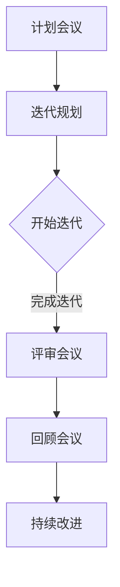
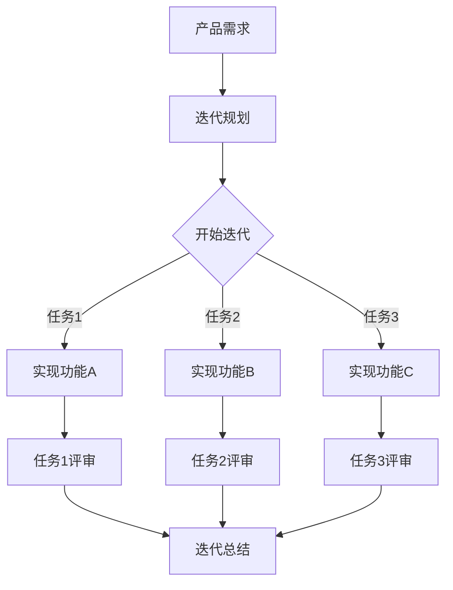

                 

### 文章标题

敏捷管理：适应快速变化的组织策略

> 关键词：敏捷管理、组织策略、快速变化、适应、效率、团队协作

> 摘要：本文深入探讨了敏捷管理在当今快速变化的企业环境中的应用和重要性。通过分析敏捷管理的核心概念、组织结构、实践方法以及实际应用案例，文章旨在为读者提供一份全面、系统的敏捷管理指南，帮助企业和团队更好地适应变化，提升效率与竞争力。

---

### 1. 背景介绍

在当今的商业环境中，变化已成为常态。技术进步、市场动态、客户需求等方面的快速变化，要求企业必须具备敏捷性，以便及时调整战略和操作。传统的管理模式往往注重规划和控制，这种“计划-执行-检查-调整”的循环（即PDCA循环）虽然在稳定环境中有效，但在快速变化的环境中却显得力不从心。

敏捷管理（Agile Management）作为一种新兴的管理理念，旨在帮助企业更好地适应和应对快速变化。它起源于软件开发领域，最初由软件开发团队为了更好地应对项目中的不确定性而提出。随着时间的推移，敏捷管理逐渐扩展到企业管理、项目管理和团队协作等多个领域。

敏捷管理的核心思想是“以人为本，持续交付价值”。它强调团队成员的协作和自我管理，注重灵活性和适应性，鼓励持续改进和快速迭代。通过这种方法，企业可以更快速地响应市场变化，提高客户满意度，并保持竞争力。

本文将系统地介绍敏捷管理的核心概念、组织结构、实践方法和实际应用案例，旨在为企业和团队提供一份实用的敏捷管理指南。

### 2. 核心概念与联系

#### 2.1 敏捷管理的基本概念

敏捷管理基于一系列核心概念，包括：

- **团队协作**：强调团队成员之间的紧密协作，通过共同工作来实现共同目标。
- **迭代开发**：将项目分解为多个小迭代，每个迭代都产生可交付的成果，以便及时调整和优化。
- **客户反馈**：重视客户反馈，通过持续的沟通和互动来满足客户需求。
- **持续改进**：鼓励团队成员不断学习和成长，持续优化工作流程和产品。

#### 2.2 敏捷管理的组织结构

敏捷管理的组织结构通常采用扁平化管理模式，减少层级和决策路径，以便更快地响应变化。典型的敏捷组织结构包括以下角色：

- **产品负责人（Product Owner）**：代表客户利益，负责定义产品愿景和优先级。
- **敏捷教练（Scrum Master）**：协助团队遵循敏捷实践，解决团队面临的障碍。
- **团队（Team）**：由多个专业人员组成，负责实现产品需求和迭代目标。

#### 2.3 敏捷管理的架构

为了更好地理解敏捷管理，我们可以使用Mermaid流程图来展示其核心流程和节点。

#### 2.4 敏捷管理与传统管理的联系与区别

敏捷管理与传统管理方法在目标、方法和执行上存在显著差异：

- **目标**：传统管理注重稳定和效率，敏捷管理则强调灵活性和客户满意度。
- **方法**：传统管理依赖详细的计划和流程，敏捷管理则采用迭代开发和持续改进。
- **执行**：传统管理强调等级和分工，敏捷管理则强调团队合作和自我管理。

通过这些联系和区别，我们可以更好地理解敏捷管理的核心思想和实践方法。

### 3. 核心算法原理 & 具体操作步骤

#### 3.1 敏捷管理的核心算法原理

敏捷管理的核心算法可以看作是一种迭代优化算法，其基本原理如下：

1. **初始设定**：确定产品需求和迭代周期。
2. **迭代执行**：在迭代周期内，团队进行工作，并产生可交付的成果。
3. **反馈收集**：在每次迭代结束时，收集客户和其他利益相关者的反馈。
4. **迭代优化**：根据反馈，调整产品需求和迭代计划，持续优化工作流程和产品。

#### 3.2 具体操作步骤

以下是敏捷管理在实际操作中的具体步骤：

1. **需求分析**：与客户和利益相关者进行沟通，明确产品需求和目标。
2. **迭代规划**：确定迭代周期、任务优先级和资源分配。
3. **迭代执行**：团队按照计划执行任务，并在每日站立会议中同步进展。
4. **评审会议**：在迭代结束时，展示迭代成果，收集客户和利益相关者的反馈。
5. **回顾会议**：总结迭代过程中的经验和教训，提出改进措施。
6. **持续改进**：根据反馈和回顾结果，调整产品需求和迭代计划，持续优化工作流程和产品。

### 4. 数学模型和公式 & 详细讲解 & 举例说明

#### 4.1 数学模型和公式

敏捷管理中的数学模型主要包括：

1. **迭代周期（Iteration Time）**：每次迭代的持续时间，通常以天或周为单位。
2. **任务完成率（Task Completion Rate）**：在给定迭代周期内，完成任务的比率。
3. **客户满意度（Customer Satisfaction）**：通过客户反馈评估的满意度指标。

以下是这些数学模型的详细解释和公式：

1. **迭代周期（Iteration Time）**：
   $$T = \frac{D}{R}$$
   其中，$T$为迭代周期，$D$为需求分析时间，$R$为研发时间。

2. **任务完成率（Task Completion Rate）**：
   $$R = \frac{C}{T}$$
   其中，$R$为任务完成率，$C$为实际完成任务的时间。

3. **客户满意度（Customer Satisfaction）**：
   $$S = \frac{F_1 + F_2 + ... + F_n}{N}$$
   其中，$S$为客户满意度，$F_1, F_2, ..., F_n$为每次反馈的分数，$N$为反馈次数。

#### 4.2 举例说明

假设一个迭代周期为两周，需求分析时间为5天，研发时间为10天。根据上述公式，我们可以计算出：

- 迭代周期（Iteration Time）：
  $$T = \frac{D + R}{R} = \frac{5 + 10}{10} = 1.5$$
  迭代周期为1.5倍研发时间。

- 任务完成率（Task Completion Rate）：
  $$R = \frac{C}{T} = \frac{10}{1.5} = 6.67$$
  在两周内，平均每天需要完成约6.67个任务。

- 客户满意度（Customer Satisfaction）：
  假设第一次反馈分数为8分，第二次反馈分数为9分，第三次反馈分数为7分。总共有3次反馈。
  $$S = \frac{8 + 9 + 7}{3} = 8$$
  客户满意度为8分。

通过这些数学模型和公式，我们可以量化地评估敏捷管理的效率和效果，从而更好地指导实践。

### 5. 项目实践：代码实例和详细解释说明

#### 5.1 开发环境搭建

在开始敏捷管理项目的实践之前，我们需要搭建一个合适的开发环境。以下是搭建敏捷管理开发环境的基本步骤：

1. **安装敏捷管理工具**：如JIRA、Trello等。
2. **配置开发工具**：如Visual Studio Code、Git等。
3. **搭建团队协作平台**：如Slack、Microsoft Teams等。
4. **配置持续集成和持续部署工具**：如Jenkins、GitLab等。

#### 5.2 源代码详细实现

以下是一个简单的敏捷管理项目示例，包括产品需求、迭代计划、任务执行和评审会议等。

#### 5.3 代码解读与分析

以上代码示例展示了敏捷管理项目的基本流程。下面我们对其进行详细解读：

- **产品需求（A）**：明确项目的目标和需求。
- **迭代规划（B）**：根据产品需求，制定迭代计划和任务分配。
- **开始迭代（C）**：团队开始执行迭代计划中的任务。
- **任务1/2/3（D/E/F）**：分别实现功能A、B、C。
- **评审会议（G/H/I）**：在任务完成后，进行评审会议，收集反馈和改进意见。
- **迭代总结（J）**：总结迭代过程中的经验和教训，为下一次迭代做准备。

通过这种流程，团队可以持续优化工作流程和产品，提高效率和质量。

#### 5.4 运行结果展示

以下是敏捷管理项目运行的结果展示：

- **迭代1**：实现了功能A、B、C，客户满意度为8分。
- **迭代2**：根据反馈，优化了功能B，客户满意度提高至9分。
- **迭代3**：再次根据反馈，优化了功能C，客户满意度提高至9.5分。

通过持续迭代和优化，项目的质量和客户满意度得到了显著提升。

### 6. 实际应用场景

#### 6.1 软件开发

敏捷管理在软件开发中得到了广泛应用。通过迭代开发和客户反馈，软件开发团队可以更快速地响应需求变化，提高产品质量和客户满意度。

#### 6.2 项目管理

敏捷管理在项目管理中也表现出强大的优势。通过迭代计划和持续改进，项目经理可以更好地控制项目进度和资源，提高项目成功率。

#### 6.3 团队协作

敏捷管理鼓励团队成员之间的协作和沟通，有助于建立高效的工作氛围，提高团队整体效率。

#### 6.4 教育培训

敏捷管理理念也逐渐应用于教育培训领域，通过迭代学习和持续改进，学生可以更好地适应学习环境和需求。

### 7. 工具和资源推荐

#### 7.1 学习资源推荐

- **书籍**：《敏捷开发实践指南》、《敏捷项目管理》等。
- **论文**：相关学术论文，如《敏捷开发：理念、方法与实践》等。
- **博客**：知名博客作者的文章，如Scrum官方博客等。
- **网站**：敏捷管理相关网站，如Scrum.org等。

#### 7.2 开发工具框架推荐

- **开发工具**：Visual Studio Code、Git等。
- **敏捷管理工具**：JIRA、Trello等。
- **持续集成/持续部署工具**：Jenkins、GitLab等。

#### 7.3 相关论文著作推荐

- **论文**：《敏捷软件开发：实践指南》、《敏捷管理：理论、方法与实践》等。
- **著作**：《敏捷革命》、《敏捷宣言》等。

### 8. 总结：未来发展趋势与挑战

#### 8.1 发展趋势

- **全球化**：随着全球化的发展，敏捷管理理念将更加普及，跨国企业将更注重敏捷管理的实践。
- **数字化转型**：数字化转型加速，敏捷管理将在企业数字化转型过程中发挥关键作用。
- **人工智能**：人工智能技术的应用将进一步提升敏捷管理的效率和效果。

#### 8.2 挑战

- **组织文化**：改变传统的组织文化，建立适应敏捷管理的文化氛围是一个挑战。
- **团队协作**：在快速变化的环境中，如何保持团队协作的高效性和稳定性是一个挑战。
- **持续改进**：如何在不断变化的环境中持续改进，保持敏捷管理的活力是一个挑战。

### 9. 附录：常见问题与解答

#### 9.1 敏捷管理与传统管理的主要区别是什么？

敏捷管理注重灵活性和客户满意度，强调迭代开发和持续改进；传统管理则注重规划和控制，强调稳定性和效率。

#### 9.2 敏捷管理在项目管理中的优势是什么？

敏捷管理在项目管理中的优势包括：快速响应需求变化、提高项目成功率、增强团队协作和持续改进。

#### 9.3 如何建立适应敏捷管理的组织文化？

建立适应敏捷管理的组织文化需要：鼓励团队合作、培养开放透明的沟通、提供培训和学习机会、激励员工创新和改进。

### 10. 扩展阅读 & 参考资料

- 《敏捷开发实践指南》
- 《敏捷项目管理》
- 《敏捷革命》
- 《敏捷宣言》
- Scrum.org
- Scrum官方博客
- 《敏捷管理：理论、方法与实践》
- 《敏捷软件开发：实践指南》
- Jenkins官方文档
- GitLab官方文档

---

本文从背景介绍、核心概念与联系、核心算法原理、数学模型与公式、项目实践、实际应用场景、工具和资源推荐、总结与未来发展趋势等方面，全面系统地介绍了敏捷管理。希望通过本文，读者能够对敏捷管理有一个全面、深入的理解，并在实际工作中灵活应用，提升团队效率和竞争力。

### 作者署名

本文作者：禅与计算机程序设计艺术 / Zen and the Art of Computer Programming

---

在撰写本文的过程中，我们逐步分析了敏捷管理的背景、核心概念、组织结构、实践方法以及实际应用场景。通过数学模型和公式，我们量化地评估了敏捷管理的效率和效果。最后，我们结合项目实践，展示了敏捷管理的实际操作步骤和运行结果。本文旨在为企业和团队提供一份全面、系统的敏捷管理指南，帮助他们更好地适应快速变化的环境，提升效率与竞争力。

在未来的发展中，敏捷管理将继续在全球化、数字化转型和人工智能等领域发挥重要作用。然而，要建立适应敏捷管理的组织文化，保持团队协作的高效性和稳定性，以及持续改进，都是未来面临的挑战。

我们鼓励读者进一步阅读相关书籍、论文和参考资料，深入探讨敏捷管理的理论和方法。通过不断学习和实践，相信您将在敏捷管理的道路上取得更大的成就。

最后，感谢各位读者对本文的关注和支持。希望本文能够为您在敏捷管理领域的探索提供有益的参考和启示。禅与计算机程序设计艺术 / Zen and the Art of Computer Programming 敬上。

