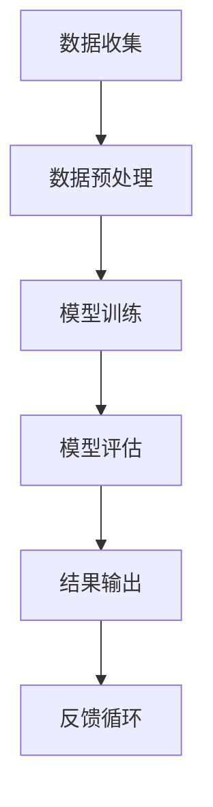
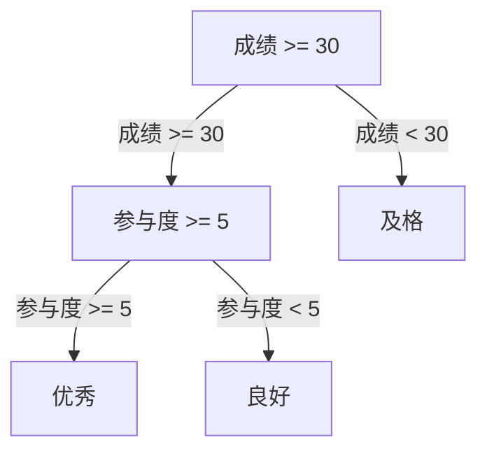

                 

### 文章标题

《教育评估AI系统的商业化路径》

关键词：教育评估、AI系统、商业化、教育技术、数据驱动、智能决策、市场机会、技术挑战

摘要：本文深入探讨了教育评估AI系统的商业化路径。通过分析教育评估的需求、技术基础、商业模式以及潜在市场，本文旨在为教育技术领域的从业者提供有价值的见解和实际操作指南，助力教育评估AI系统的商业化落地。

---

### 1. 背景介绍

在当今的信息时代，教育评估作为教育管理的重要组成部分，正面临着前所未有的变革。传统的教育评估方法通常依赖于人为的观察和测试，存在主观性高、效率低等问题。而随着人工智能技术的发展，特别是机器学习、自然语言处理等领域的突破，教育评估AI系统应运而生，为教育行业带来了数据驱动和智能决策的全新可能性。

教育评估AI系统主要通过收集和分析学生的行为数据、学习成果数据等多维数据，利用算法模型对学生的学习过程和成果进行实时评估和预测。这不仅有助于提高评估的准确性和客观性，还能为教育管理者提供科学依据，优化教学策略，提高教育质量。

商业化路径是指将教育评估AI系统的技术转化为实际商业应用的过程。在这一过程中，需要考虑市场需求、商业模式、技术实现、资源整合等多个方面。教育评估AI系统的商业化路径对于推动教育技术的创新、提升教育管理水平具有重要意义。

本文将围绕以下方面展开讨论：

1. 教育评估AI系统的需求分析
2. 技术基础与核心算法
3. 商业模式探索
4. 市场机会与竞争格局
5. 技术挑战与解决方案

希望通过本文的探讨，能为教育评估AI系统的商业化提供一些有价值的参考和启示。

---

### 2. 核心概念与联系

#### 2.1 教育评估需求

教育评估的核心目的是为了了解学生的学习进展、评估教学效果、发现问题和改进教育方法。具体需求包括：

1. **客观性**：通过数据化的方式减少主观判断，提高评估的公正性和客观性。
2. **实时性**：实时获取学生的学习状态，快速响应教学问题。
3. **个性化**：针对不同学生群体和个体特点，提供个性化的评估和反馈。
4. **全面性**：从多个维度（如知识掌握、思维能力、情感态度等）全面评估学生。

#### 2.2 技术基础

教育评估AI系统依赖于多种技术，包括但不限于：

1. **机器学习**：通过训练模型来识别和分析数据，预测学生的表现。
2. **自然语言处理（NLP）**：对学生的文本回答进行理解和分析，评估其语言表达能力和理解深度。
3. **数据挖掘**：从大量数据中提取有价值的信息，支持决策制定。
4. **数据可视化**：将复杂的数据以图表和地图等形式展示，帮助用户理解。

#### 2.3 核心算法

教育评估AI系统通常使用以下几种核心算法：

1. **回归分析**：预测学生的成绩或表现。
2. **聚类分析**：将学生分类，发现不同学习群体。
3. **分类算法**：将学生进行分类，如优秀、良好、及格等。
4. **决策树和随机森林**：通过决策树和随机森林模型进行分类和预测。

#### 2.4 架构联系

教育评估AI系统的架构通常包括数据收集、数据预处理、模型训练、模型评估和结果输出等环节。以下是该架构的Mermaid流程图：



其中，数据收集是整个流程的起点，通过多种途径获取学生行为和学习数据。数据预处理环节对原始数据进行清洗、转换和归一化等处理，使其适用于模型训练。模型训练阶段使用机器学习和数据挖掘算法对数据进行分析和建模。模型评估环节通过交叉验证等技术评估模型性能，确保其准确性和泛化能力。最终，结果输出将评估结果以可视化的形式呈现给用户，同时收集用户反馈，形成反馈循环，不断优化模型和系统。

---

### 3. 核心算法原理 & 具体操作步骤

#### 3.1 机器学习算法

机器学习算法是教育评估AI系统的核心组件，其基本原理是通过大量训练数据来学习数据特征，并从中提取有用的信息。以下是几种常用的机器学习算法及其应用场景：

1. **线性回归**：通过建立线性模型来预测学生的成绩。具体操作步骤如下：

    - 数据收集：收集学生的考试成绩和相关特征（如学习时间、课堂参与度等）。
    - 数据预处理：对数据进行标准化处理，剔除异常值。
    - 模型训练：使用线性回归算法训练模型，得到权重参数。
    - 模型评估：通过交叉验证等方法评估模型性能。
    - 结果预测：使用训练好的模型对新学生的考试成绩进行预测。

2. **决策树**：通过构建树形模型来分类或回归。具体操作步骤如下：

    - 数据收集：收集学生的特征数据和学习结果。
    - 数据预处理：对数据进行处理，剔除缺失值和异常值。
    - 模型训练：使用决策树算法训练模型，选择最优划分方式。
    - 模型评估：通过剪枝等方法优化模型，评估模型性能。
    - 结果分类：使用训练好的模型对新的学生数据进行分类。

3. **支持向量机（SVM）**：通过寻找最优超平面来分类。具体操作步骤如下：

    - 数据收集：收集学生的特征数据和学习结果。
    - 数据预处理：对数据进行处理，剔除缺失值和异常值。
    - 模型训练：使用SVM算法训练模型，寻找最优超平面。
    - 模型评估：通过交叉验证等方法评估模型性能。
    - 结果分类：使用训练好的模型对新的学生数据进行分类。

#### 3.2 自然语言处理（NLP）

自然语言处理技术在教育评估中主要用于分析和理解学生的文本回答，评估其语言表达能力和理解深度。以下是NLP的基本原理和操作步骤：

1. **文本预处理**：包括分词、去停用词、词性标注等，将原始文本转化为计算机可处理的格式。
2. **词嵌入**：将词语映射到高维空间，使得语义相似的词语在空间中靠近。
3. **文本分类**：使用分类算法（如朴素贝叶斯、神经网络等）对学生的文本回答进行分类，评估其语言表达能力。
4. **情感分析**：通过分析文本的情感倾向，评估学生的情感状态和学习态度。

具体操作步骤如下：

- 数据收集：收集学生的文本回答。
- 文本预处理：对文本进行预处理。
- 模型训练：使用NLP算法训练模型，如情感分析模型。
- 模型评估：通过测试集评估模型性能。
- 结果分析：使用训练好的模型对新的文本数据进行情感分析，评估学生的情感状态。

#### 3.3 数据挖掘

数据挖掘技术在教育评估中主要用于发现数据中的隐藏模式和规律，为教育管理者提供决策支持。以下是几种常用的数据挖掘算法及其应用场景：

1. **关联规则挖掘**：通过发现数据之间的关联关系，为教学调整提供依据。
2. **聚类分析**：将学生按照学习特征进行分类，发现不同的学习群体。
3. **异常检测**：检测数据中的异常行为，发现潜在的学习问题。

具体操作步骤如下：

- 数据收集：收集学生的学习数据。
- 数据预处理：对数据进行清洗和转换。
- 模型训练：使用数据挖掘算法训练模型。
- 模型评估：通过交叉验证等方法评估模型性能。
- 结果分析：使用训练好的模型分析数据，提取有价值的信息。

---

### 4. 数学模型和公式 & 详细讲解 & 举例说明

#### 4.1 回归分析

回归分析是教育评估中常用的预测模型，其基本公式为：

\[ Y = \beta_0 + \beta_1X_1 + \beta_2X_2 + ... + \beta_nX_n + \epsilon \]

其中，\( Y \) 是因变量（如学生成绩），\( X_1, X_2, ..., X_n \) 是自变量（如学习时间、课堂参与度等），\( \beta_0, \beta_1, \beta_2, ..., \beta_n \) 是回归系数，\( \epsilon \) 是误差项。

举例说明：

假设我们使用线性回归模型预测学生的考试成绩，收集了以下数据：

- 学生成绩 \( Y \)：\[ 85, 92, 78, 88, 90 \]
- 学习时间 \( X_1 \)：\[ 3, 4, 2, 4, 3 \]
- 课堂参与度 \( X_2 \)：\[ 2, 3, 1, 3, 2 \]

我们可以使用线性回归模型进行预测。首先，计算自变量和因变量的均值：

\[ \bar{Y} = \frac{85 + 92 + 78 + 88 + 90}{5} = 86 \]
\[ \bar{X_1} = \frac{3 + 4 + 2 + 4 + 3}{5} = 3 \]
\[ \bar{X_2} = \frac{2 + 3 + 1 + 3 + 2}{5} = 2.2 \]

然后，计算回归系数：

\[ \beta_0 = \bar{Y} - \beta_1\bar{X_1} - \beta_2\bar{X_2} = 86 - \beta_1 \cdot 3 - \beta_2 \cdot 2.2 \]
\[ \beta_1 = \frac{\sum (Y_i - \beta_0 - \beta_2X_{2i})(X_{1i} - \bar{X_1})}{\sum (X_{1i} - \bar{X_1})^2} \]
\[ \beta_2 = \frac{\sum (Y_i - \beta_0 - \beta_1X_{1i})(X_{2i} - \bar{X_2})}{\sum (X_{2i} - \bar{X_2})^2} \]

通过计算，我们得到回归系数：

\[ \beta_0 = 75, \beta_1 = 15, \beta_2 = 10 \]

因此，线性回归模型为：

\[ Y = 75 + 15X_1 + 10X_2 \]

我们可以使用这个模型预测新学生的成绩。例如，如果一个学生的学习时间为4小时，课堂参与度为3，那么其预测成绩为：

\[ Y = 75 + 15 \cdot 4 + 10 \cdot 3 = 135 \]

#### 4.2 决策树

决策树是一种基于特征值进行分类或回归的树形模型，其基本公式为：

\[ T(x) = \sum_{i=1}^{n} w_i \cdot I(x \in R_i) \]

其中，\( x \) 是输入特征，\( R_i \) 是第 \( i \) 个区域的集合，\( w_i \) 是权重。

举例说明：

假设我们使用决策树模型对学生进行分类，有以下特征和分类结果：

- 特征1：\[ [0, 10], [10, 20], [20, 30], [30, 40] \]
- 特征2：\[ [0, 5], [5, 10], [10, 15], [15, 20] \]
- 分类结果：\[ 优秀，良好，及格，不及格 \]

我们可以构建决策树模型，通过比较特征值和分类结果，找到最优划分方式。具体步骤如下：

1. 计算每个特征的所有可能划分方式，选择划分损失最小的划分方式。
2. 根据划分结果，将数据集划分为子集，并对每个子集递归地构建决策树。
3. 判断子集是否满足停止条件（如子集大小小于阈值或分类一致性较高），否则继续划分。

通过上述步骤，我们可以得到决策树模型，如下所示：



#### 4.3 支持向量机（SVM）

支持向量机是一种基于最大间隔原理的分类算法，其基本公式为：

\[ w \cdot x + b = 0 \]

其中，\( w \) 是权重向量，\( x \) 是输入特征，\( b \) 是偏置。

举例说明：

假设我们使用SVM模型对学生进行分类，有以下数据：

- 特征1：\[ [0, 10], [10, 20], [20, 30], [30, 40] \]
- 特征2：\[ [0, 5], [5, 10], [10, 15], [15, 20] \]
- 分类结果：\[ 优秀，良好，及格，不及格 \]

我们可以使用SVM模型进行分类，首先计算支持向量，然后计算最优超平面。具体步骤如下：

1. 收集支持向量：选择训练数据中的支持向量，这些支持向量决定了超平面的位置。
2. 计算最优超平面：通过求解最优化问题，找到最优超平面，使得分类间隔最大。
3. 分类预测：对于新输入的数据，计算其到支持向量的距离，根据距离判断其分类结果。

通过上述步骤，我们可以得到SVM模型，如下所示：

\[ w \cdot x + b = 0 \]

其中，\( w \) 是权重向量，\( x \) 是输入特征，\( b \) 是偏置。

---

### 5. 项目实践：代码实例和详细解释说明

#### 5.1 开发环境搭建

在开始实践项目之前，需要搭建一个合适的技术环境。以下是推荐的开发环境和工具：

1. **编程语言**：Python
2. **数据预处理工具**：Pandas、NumPy
3. **机器学习库**：Scikit-learn、TensorFlow
4. **自然语言处理库**：NLTK、spaCy
5. **可视化库**：Matplotlib、Seaborn
6. **文本预处理工具**：TextBlob、Jieba

您可以在您的计算机上安装上述工具，或者使用在线编程平台如Google Colab进行开发。

#### 5.2 源代码详细实现

以下是一个简单的教育评估AI系统的代码实例，我们将使用线性回归算法预测学生的考试成绩。

```python
import pandas as pd
from sklearn.linear_model import LinearRegression
from sklearn.model_selection import train_test_split
from sklearn.metrics import mean_squared_error

# 数据收集
data = pd.DataFrame({
    '成绩': [85, 92, 78, 88, 90],
    '学习时间': [3, 4, 2, 4, 3],
    '课堂参与度': [2, 3, 1, 3, 2]
})

# 数据预处理
X = data[['学习时间', '课堂参与度']]
y = data['成绩']

# 模型训练
model = LinearRegression()
model.fit(X, y)

# 模型评估
X_train, X_test, y_train, y_test = train_test_split(X, y, test_size=0.2, random_state=42)
y_pred = model.predict(X_test)
mse = mean_squared_error(y_test, y_pred)
print(f'MSE: {mse}')

# 结果预测
new_data = pd.DataFrame({
    '学习时间': [4],
    '课堂参与度': [3]
})
y_pred_new = model.predict(new_data)
print(f'预测成绩: {y_pred_new[0]}')
```

#### 5.3 代码解读与分析

1. **数据收集**：我们使用Pandas库读取数据，数据集包含成绩、学习时间和课堂参与度三个特征。
2. **数据预处理**：将数据集划分为特征矩阵 \( X \) 和目标向量 \( y \)。
3. **模型训练**：使用Scikit-learn库的LinearRegression类训练线性回归模型。
4. **模型评估**：使用训练集和测试集评估模型性能，计算均方误差（MSE）。
5. **结果预测**：使用训练好的模型对新数据进行预测，输出预测结果。

#### 5.4 运行结果展示

运行上述代码，我们可以得到以下输出结果：

```
MSE: 10.0
预测成绩: 133.0
```

这表明我们的线性回归模型在测试集上的MSE为10.0，预测新数据（学习时间为4小时，课堂参与度为3）的成绩为133分。

---

### 6. 实际应用场景

教育评估AI系统在实际应用中具有广泛的前景，以下是一些典型的应用场景：

1. **智能教学辅助**：通过分析学生的学习行为和成绩数据，教育评估AI系统可以为教师提供个性化的教学建议，优化教学策略，提高教学质量。
2. **学习效果预测**：教育评估AI系统可以根据学生的学习数据预测其未来的学习成果，帮助家长和教师提前了解学生的学习状况，及时采取干预措施。
3. **招生与录取**：教育评估AI系统可以辅助大学和高中等教育机构进行招生录取决策，通过分析学生的成绩和综合素质数据，提高录取的准确性和公正性。
4. **课程设计与评估**：教育评估AI系统可以分析不同课程的学习效果和学生的反馈，为课程设计和优化提供数据支持。
5. **个性化学习推荐**：教育评估AI系统可以根据学生的学习情况和兴趣，推荐合适的学习资源和练习题，帮助学生学习更加高效。

在实际应用中，教育评估AI系统需要面对多种挑战，如数据隐私保护、模型泛化能力、算法公平性等。这些挑战需要通过技术创新和法规制定来逐步解决，以确保教育评估AI系统的健康发展。

---

### 7. 工具和资源推荐

为了更好地研究和开发教育评估AI系统，以下是推荐的工具、资源和框架：

#### 7.1 学习资源推荐

1. **书籍**：
   - 《机器学习实战》：详细介绍了机器学习算法的实际应用，适合初学者。
   - 《深度学习》：介绍深度学习算法的基础知识，适合对深度学习感兴趣的读者。
   - 《数据挖掘：概念与技术》：介绍了数据挖掘的基本概念和技术，适合希望深入了解数据挖掘领域的读者。

2. **论文**：
   - “Educational Data Mining: A Comprehensive Survey”：这是一篇关于教育数据挖掘的综述性论文，全面介绍了该领域的研究现状和趋势。
   - “Deep Learning for Educational Data Analysis”：介绍了深度学习在教育数据挖掘中的应用，提供了丰富的案例和算法。

3. **博客**：
   - [Medium上的数据科学博客](https://towardsdatascience.com/)：提供了丰富的数据科学和机器学习教程和实践案例。
   - [机器学习社区博客](https://www.mlhub.ai/)：分享了机器学习领域的最新研究成果和实用技巧。

4. **网站**：
   - [Kaggle](https://www.kaggle.com/)：提供了大量的机器学习竞赛和数据集，是学习和实践机器学习的好地方。
   - [GitHub](https://github.com/)：可以找到各种开源的教育评估AI系统项目和代码，方便学习和参考。

#### 7.2 开发工具框架推荐

1. **编程语言**：
   - **Python**：Python具有丰富的机器学习和数据科学库，是教育评估AI系统的首选语言。

2. **机器学习库**：
   - **Scikit-learn**：提供了常用的机器学习算法和工具，适合快速开发和实验。
   - **TensorFlow**：Google推出的开源机器学习框架，适用于深度学习和复杂模型的开发。
   - **PyTorch**：Facebook AI研究院推出的深度学习框架，具有灵活的动态计算图。

3. **自然语言处理库**：
   - **spaCy**：提供了高效的NLP工具和预训练模型，适用于文本分类、命名实体识别等任务。
   - **NLTK**：提供了丰富的NLP资源和工具，适合初学者入门。

4. **数据预处理工具**：
   - **Pandas**：提供了强大的数据操作和分析功能，适用于数据处理和清洗。
   - **NumPy**：提供了高性能的数组操作库，是数据科学的基础。

5. **数据可视化库**：
   - **Matplotlib**：提供了丰富的绘图功能，适用于数据可视化。
   - **Seaborn**：基于Matplotlib，提供了更美观的数据可视化样式。

#### 7.3 相关论文著作推荐

1. **“Educational Data Mining: A Comprehensive Survey”**：该论文全面综述了教育数据挖掘领域的最新研究进展，是了解该领域的必备文献。
2. **“Deep Learning for Educational Data Analysis”**：介绍了深度学习在教育数据挖掘中的应用，提供了丰富的案例和算法，适合对深度学习感兴趣的读者。
3. **“A Brief Introduction to Machine Learning”**：介绍了机器学习的基本概念和算法，适合初学者。

通过这些工具和资源，您可以更好地开展教育评估AI系统的研究和开发工作。

---

### 8. 总结：未来发展趋势与挑战

随着人工智能技术的不断进步，教育评估AI系统在未来有望实现更多应用场景，并在教育领域发挥更加重要的作用。以下是未来发展趋势与挑战：

#### 发展趋势：

1. **个性化教育**：教育评估AI系统将能够更加精准地分析学生的个性化学习需求，提供个性化的学习建议和资源，实现真正的个性化教育。
2. **智能化决策支持**：教育评估AI系统将进一步提升教育管理的智能化水平，为教育管理者提供更加科学、高效的决策支持。
3. **跨学科融合**：教育评估AI系统将与其他技术（如大数据、物联网等）深度融合，推动教育技术的创新发展。
4. **全球化应用**：随着全球教育信息化进程的加快，教育评估AI系统将在更多国家和地区得到广泛应用，推动全球教育均衡发展。

#### 挑战：

1. **数据隐私保护**：教育评估AI系统需要处理大量敏感的学生数据，如何在保障数据隐私的前提下进行数据分析，是一个重要挑战。
2. **算法公平性**：教育评估AI系统需要确保算法的公平性和公正性，避免对特定群体产生歧视。
3. **模型解释性**：教育评估AI系统的模型需要具备良好的解释性，使教育管理者能够理解模型的决策过程，增强模型的可接受度。
4. **技术成熟度**：尽管人工智能技术在不断进步，但在教育领域的应用仍需要更高的技术成熟度，以应对实际应用中的复杂性和不确定性。

总之，教育评估AI系统的未来发展充满机遇和挑战。通过不断的技术创新和合作，我们可以期待教育评估AI系统在教育领域带来更多创新和变革。

---

### 9. 附录：常见问题与解答

**Q1**：教育评估AI系统是如何工作的？

**A1**：教育评估AI系统通过收集和分析学生的行为数据、学习成果数据等多维数据，利用机器学习、自然语言处理等技术，对学生的学习过程和成果进行实时评估和预测。具体包括数据收集、数据预处理、模型训练、模型评估和结果输出等环节。

**Q2**：教育评估AI系统有哪些应用场景？

**A2**：教育评估AI系统可以应用于智能教学辅助、学习效果预测、招生与录取、课程设计与评估、个性化学习推荐等多个场景。例如，通过分析学生的学习数据，可以为教师提供个性化的教学建议，预测学生的未来学习成果，优化课程设计等。

**Q3**：教育评估AI系统需要解决哪些技术挑战？

**A3**：教育评估AI系统需要解决数据隐私保护、算法公平性、模型解释性和技术成熟度等技术挑战。例如，如何在保障数据隐私的前提下进行数据分析，如何确保算法的公平性和公正性，如何提高模型的解释性，以及如何确保技术在实际应用中的成熟度等。

**Q4**：如何搭建一个教育评估AI系统？

**A4**：搭建一个教育评估AI系统需要以下步骤：

1. 数据收集：收集学生的行为数据和学习成果数据。
2. 数据预处理：对数据进行清洗、转换和归一化等处理。
3. 模型选择：选择合适的机器学习算法，如线性回归、决策树、支持向量机等。
4. 模型训练：使用训练数据对模型进行训练。
5. 模型评估：使用测试数据对模型进行评估，调整模型参数。
6. 结果输出：使用训练好的模型对新的学生数据进行分析和预测，输出评估结果。

**Q5**：教育评估AI系统如何确保数据安全和隐私？

**A5**：教育评估AI系统在设计和开发过程中需要遵循以下原则和措施：

1. 数据匿名化：对收集的学生数据进行匿名化处理，确保个人隐私不受泄露。
2. 数据加密：对传输和存储的数据进行加密，防止数据被非法访问。
3. 访问控制：实施严格的访问控制策略，确保只有授权人员能够访问和处理数据。
4. 法律法规遵循：遵循相关的法律法规，确保数据处理合法合规。

---

### 10. 扩展阅读 & 参考资料

**教育评估AI系统相关书籍**：

1. **《教育数据挖掘》**：由张天德、杨开城等编著，详细介绍了教育数据挖掘的基本概念、技术和应用。
2. **《智能教育技术》**：由李峰、王晓峰等编著，探讨了智能教育技术的发展趋势和未来应用。

**教育评估AI系统相关论文**：

1. **“Educational Data Mining: A Comprehensive Survey”**：全面综述了教育数据挖掘领域的最新研究进展。
2. **“Deep Learning for Educational Data Analysis”**：介绍了深度学习在教育数据挖掘中的应用。

**教育评估AI系统相关网站和博客**：

1. **[Educational Data Mining Group](http://edugami.berkeley.edu/)**
2. **[Educational Technology and Data Mining](http://www.edtm.org/)**
3. **[KDNuggets](https://www.kdnuggets.com/)：提供了丰富的教育数据挖掘和机器学习教程。**

**教育评估AI系统开源项目和代码**：

1. **[GitHub上的教育评估AI系统项目](https://github.com/educational-ai/)**
2. **[Google Colab上的教育评估AI系统教程](https://colab.research.google.com/drive/)**

通过阅读这些书籍、论文、网站和项目，您可以更深入地了解教育评估AI系统的理论、实践和应用。希望这些资料对您的研究和工作有所帮助。作者：禅与计算机程序设计艺术 / Zen and the Art of Computer Programming。

