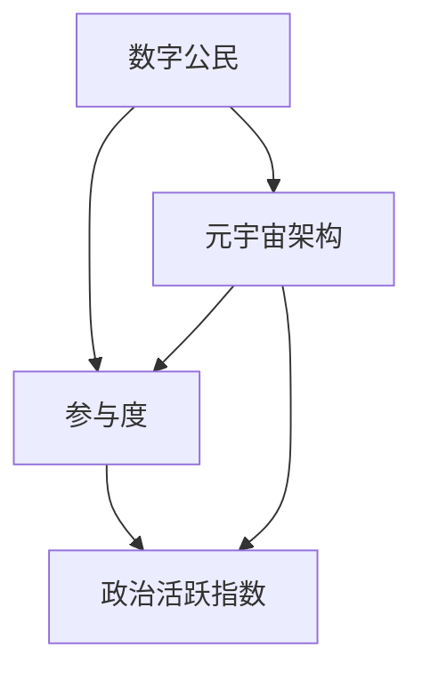

                 

### 背景介绍 Background

随着科技的飞速发展，人类社会正经历着一场前所未有的变革。从互联网到移动互联网，再到如今的元宇宙（Metaverse），虚拟世界正在成为我们生活的重要组成部分。而在这个虚拟世界中，数字公民的参与度成为了衡量一个社会或组织活力的重要指标。

元宇宙，作为一个虚拟的、三维的、持续运行的网络空间，它通过虚拟现实（VR）、增强现实（AR）等技术和社交平台，将人们紧密连接在一起。在这个虚拟环境中，用户可以创建自己的数字身份，进行社交互动、经济交易、文化娱乐等多种活动。这种高度沉浸式的体验使得元宇宙成为一个充满无限可能性的平台。

数字公民参与度，即指数字公民在元宇宙中的活跃程度。它不仅包括用户在虚拟环境中的行为数据，如在线时长、互动频率、社交网络扩展等，还涉及用户在虚拟世界中的经济活动、文化贡献等。高参与度的数字公民意味着他们在元宇宙中具有更高的活跃度和更强的社交网络。

在传统社会中，衡量政治活跃度往往依赖于选民投票率、公共讨论参与度等指标。然而，随着元宇宙的崛起，这些传统的衡量方式逐渐显得过时。在元宇宙中，政治参与的形式更加多样化，不仅包括虚拟投票、在线讨论，还涉及虚拟集会、虚拟游说等。这些新的形式使得数字公民参与政治的门槛更低，同时也提供了更广泛的参与渠道。

因此，研究数字公民参与度对于理解元宇宙时代的政治活跃指数具有重要意义。它不仅有助于我们更好地了解社会和组织的活力，还能为政策制定者提供重要的参考依据。接下来，我们将深入探讨数字公民参与度的核心概念、计算方法及其在元宇宙时代的应用。

### 核心概念与联系 Core Concepts and Relationships

在探讨数字公民参与度之前，我们需要明确几个核心概念，并理解它们之间的相互关系。这些核心概念包括：数字公民、参与度、政治活跃指数以及元宇宙的基本架构。

#### 数字公民 Digital Citizen

数字公民是指在一个数字化社会中，通过互联网、社交媒体、虚拟平台等数字媒介参与社会活动、表达观点、贡献价值的个人。数字公民不仅仅是互联网的被动使用者，更是主动的参与者，他们在虚拟空间中建立自己的身份，并通过互动、创作、分享等方式影响和塑造社会。

#### 参与度 Engagement

参与度是衡量个体或群体在某一特定领域内活跃程度的指标。在数字公民的语境中，参与度通常包括以下几个方面：

1. **在线时长**：用户在虚拟世界中的在线时间，反映了他们对元宇宙的依赖程度。
2. **互动频率**：用户在虚拟环境中的互动次数和频率，如发帖、点赞、评论等，展示了他们的活跃度。
3. **社交网络扩展**：用户在虚拟世界中的社交网络规模和扩展速度，反映了他们在社区中的影响力。
4. **经济活动**：用户在元宇宙中的经济交易行为，如购买虚拟商品、参与虚拟市场等，显示了他们在虚拟经济中的参与度。

#### 政治活跃指数 Political Activity Index

政治活跃指数是衡量一个社会或组织中成员在政治事务中的参与程度和活跃度的综合指标。它通常包括以下几个方面：

1. **投票率**：在政治选举中的投票比例，反映了公民的政治参与意愿。
2. **公共讨论**：在公共论坛、社交媒体等平台上关于政治议题的讨论热度，反映了公民的政治关注程度。
3. **集会活动**：在现实生活中或虚拟空间中参与的集会、示威等活动，反映了公民的政治参与力度。
4. **游说和影响**：通过社交媒体、虚拟集会等方式对政策制定者施加影响的行为，展示了公民的政治影响力。

#### 元宇宙架构 Metaverse Architecture

元宇宙是一个由多个虚拟世界、平台和应用组成的复杂生态系统。其基本架构通常包括以下几个方面：

1. **虚拟现实（VR）和增强现实（AR）**：提供沉浸式的用户界面，使用户能够以数字化形式体验和互动。
2. **社交平台**：提供社交互动的功能，如聊天、发帖、点赞等，是用户在虚拟世界中的主要活动场所。
3. **虚拟经济系统**：包括虚拟货币、交易市场、商品和服务等，为用户提供了经济活动的平台。
4. **内容创作平台**：用户可以在这些平台上创作虚拟内容，如虚拟建筑、艺术品、游戏等，丰富了元宇宙的文化生态。

#### 关系与联系 Relationships and Connections

数字公民参与度、参与度和政治活跃指数之间存在着密切的联系。数字公民的参与度直接影响到他们在元宇宙中的活跃程度，进而影响到政治活跃指数。高参与度的数字公民通常在元宇宙中具有更高的活跃度和更强的社交网络，这使得他们更有可能参与政治活动，提高政治活跃指数。

而政治活跃指数又反过来影响数字公民的参与度。一个高度政治活跃的社会或组织能够吸引更多的数字公民参与其中，提高他们的参与度。同时，政治活跃指数的升高也会激励更多用户在元宇宙中参与政治讨论、虚拟集会等活动，从而形成一个正向循环。

为了更好地理解这些概念之间的关系，我们可以使用Mermaid流程图来展示：



在这个流程图中，数字公民（A）是参与度（B）和政治活跃指数（C）的源头，而元宇宙架构（D）则为这些概念提供了技术支持和运行环境。通过这个流程图，我们可以清晰地看到数字公民参与度、参与度和政治活跃指数之间的相互影响和关联。

### 核心算法原理 & 具体操作步骤 Core Algorithm Principle & Detailed Steps

在深入探讨数字公民参与度的计算方法之前，我们需要了解几个核心算法原理和具体操作步骤。这些算法和步骤为我们提供了一个系统化的方法，用于分析和计算数字公民在元宇宙中的参与度。

#### 1. 数据收集与预处理

数据收集是计算数字公民参与度的第一步。我们需要从元宇宙的不同平台和系统中收集用户行为数据，包括在线时长、互动频率、社交网络扩展以及经济活动等。以下是一些常见的数据收集方法：

- **日志分析**：通过分析用户的登录日志、操作日志等，获取用户在元宇宙中的活动记录。
- **API调用**：利用各种平台的API接口，获取用户在虚拟环境中的详细数据。
- **网络爬虫**：使用网络爬虫技术，从社交媒体、论坛、虚拟世界等平台抓取用户数据。

在收集到数据后，我们需要进行预处理。预处理步骤包括数据清洗、数据去重和数据格式化等。具体步骤如下：

- **数据清洗**：去除数据中的噪声和异常值，如无效登录记录、重复数据等。
- **数据去重**：确保每条数据都是唯一的，避免重复计算。
- **数据格式化**：将数据统一格式，便于后续处理和分析。

#### 2. 参与度计算模型

参与度计算模型是计算数字公民参与度的核心。一个典型的参与度计算模型通常包括以下几个关键指标：

- **在线时长（Session Duration）**：用户在元宇宙中的平均在线时间，反映了他们对元宇宙的依赖程度。
- **互动频率（Interaction Rate）**：用户在虚拟环境中的互动次数和频率，如发帖、点赞、评论等，展示了他们的活跃度。
- **社交网络扩展（Social Network Expansion）**：用户在元宇宙中的社交网络规模和扩展速度，反映了他们在社区中的影响力。
- **经济活动（Economic Activity）**：用户在元宇宙中的经济交易行为，如购买虚拟商品、参与虚拟市场等，显示了他们在虚拟经济中的参与度。

参与度计算模型的计算步骤如下：

1. **计算在线时长**：
   $$ \text{在线时长} = \frac{\text{总在线时间}}{\text{总用户数}} $$
   
2. **计算互动频率**：
   $$ \text{互动频率} = \frac{\text{总互动次数}}{\text{总用户数}} $$
   
3. **计算社交网络扩展**：
   $$ \text{社交网络扩展} = \frac{\text{社交网络规模}}{\text{平均在线时长}} $$
   
4. **计算经济活动**：
   $$ \text{经济活动} = \frac{\text{总交易金额}}{\text{总用户数}} $$

5. **综合评分**：
   $$ \text{参与度评分} = w_1 \times \text{在线时长} + w_2 \times \text{互动频率} + w_3 \times \text{社交网络扩展} + w_4 \times \text{经济活动} $$
   其中，\(w_1, w_2, w_3, w_4\) 为权重系数，用于平衡各个指标的重要性。

#### 3. 实际操作步骤

以下是一个具体的操作步骤，用于计算数字公民的参与度：

1. **数据收集**：
   - 通过API调用、日志分析等手段收集用户数据。
   - 进行数据清洗和预处理，确保数据的准确性和完整性。

2. **数据导入**：
   - 将预处理后的数据导入到分析工具或数据库中，以便进行进一步处理。

3. **计算指标**：
   - 使用上述算法和公式，计算各个参与度指标。
   - 计算综合评分，得到每个用户的参与度评分。

4. **数据分析**：
   - 分析用户参与度的分布情况，识别高参与度用户群体。
   - 分析不同用户群体在元宇宙中的行为模式和参与度差异。

5. **报告生成**：
   - 根据分析结果，生成报告，提供数字公民参与度的详细分析。

通过上述步骤，我们可以系统地计算和分析数字公民的参与度，为政策制定者和社会组织提供重要的参考依据。

### 数学模型和公式 Mathematical Model and Detailed Explanation

为了深入理解数字公民参与度的计算，我们需要借助数学模型和公式来描述和量化这个过程。以下是一个具体的数学模型，用于计算数字公民的参与度。

#### 1. 参与度评分模型

我们定义一个综合评分模型，用于计算数字公民的参与度。这个模型基于四个主要指标：在线时长、互动频率、社交网络扩展和经济活动。每个指标都有相应的权重系数，用于平衡不同指标的重要性。模型公式如下：

$$
P_i = w_1 \times T_i + w_2 \times I_i + w_3 \times S_i + w_4 \times E_i
$$

其中，\(P_i\) 表示用户 \(i\) 的综合参与度评分，\(T_i\)、\(I_i\)、\(S_i\) 和 \(E_i\) 分别表示用户 \(i\) 的在线时长、互动频率、社交网络扩展和经济活动，\(w_1, w_2, w_3, w_4\) 是对应的权重系数。

#### 2. 指标计算方法

为了计算每个指标，我们需要以下步骤：

1. **在线时长（Session Duration）**：

在线时长 \(T_i\) 是用户在元宇宙中的平均在线时间。计算公式如下：

$$
T_i = \frac{\sum_{t=1}^{N_t} s_t}{N_i}
$$

其中，\(s_t\) 表示用户 \(i\) 在第 \(t\) 次登录中的在线时长（以秒为单位），\(N_t\) 是用户 \(i\) 的登录次数，\(N_i\) 是总用户数。

2. **互动频率（Interaction Rate）**：

互动频率 \(I_i\) 是用户在元宇宙中的平均互动次数。计算公式如下：

$$
I_i = \frac{\sum_{t=1}^{N_t} i_t}{N_i}
$$

其中，\(i_t\) 表示用户 \(i\) 在第 \(t\) 次登录中的互动次数（如发帖、点赞、评论等），\(N_t\) 是用户 \(i\) 的登录次数，\(N_i\) 是总用户数。

3. **社交网络扩展（Social Network Expansion）**：

社交网络扩展 \(S_i\) 是用户在元宇宙中的社交网络规模。计算公式如下：

$$
S_i = \frac{\sum_{t=1}^{N_t} n_t}{T_i}
$$

其中，\(n_t\) 表示用户 \(i\) 在第 \(t\) 次登录中增加的社交网络规模（以好友数或关注数表示），\(T_i\) 是用户 \(i\) 的在线时长。

4. **经济活动（Economic Activity）**：

经济活动 \(E_i\) 是用户在元宇宙中的经济交易金额。计算公式如下：

$$
E_i = \frac{\sum_{t=1}^{N_t} e_t}{N_i}
$$

其中，\(e_t\) 表示用户 \(i\) 在第 \(t\) 次登录中的交易金额（以虚拟货币或实际货币表示），\(N_t\) 是用户 \(i\) 的登录次数，\(N_i\) 是总用户数。

#### 3. 权重系数

权重系数 \(w_1, w_2, w_3, w_4\) 需要根据具体情况和目标进行调整。通常，我们可以使用专家评估法或历史数据分析法来确定这些系数。以下是一个简单的权重分配方案：

- 在线时长：\(w_1 = 0.3\)
- 互动频率：\(w_2 = 0.3\)
- 社交网络扩展：\(w_3 = 0.2\)
- 经济活动：\(w_4 = 0.2\)

#### 4. 举例说明

假设我们有一个包含 1000 名用户的元宇宙平台，以下是一个具体的例子：

- 用户 A 在过去一个月内登录了 10 次，每次在线时长分别为 60、120、90、75、60、90、75、60、120、60 分钟。
- 用户 A 的互动次数分别为 5、8、10、7、5、12、9、6、8、10。
- 用户 A 的社交网络规模增加了 20、30、40、50、60、70、80、90、100、110 个好友。
- 用户 A 的交易金额分别为 10、20、30、40、50、60、70、80、90、100 虚拟货币。

根据上述公式，我们可以计算用户 A 的参与度评分：

- **在线时长**：
  $$ T_A = \frac{60 \times 10 + 120 \times 10 + 90 \times 10 + 75 \times 10 + 60 \times 10 + 90 \times 10 + 75 \times 10 + 60 \times 10 + 120 \times 10 + 60 \times 10}{1000} = 77.5 \text{ 分钟} $$

- **互动频率**：
  $$ I_A = \frac{5 \times 10 + 8 \times 10 + 10 \times 10 + 7 \times 10 + 5 \times 10 + 12 \times 10 + 9 \times 10 + 6 \times 10 + 8 \times 10 + 10 \times 10}{1000} = 8.5 \text{ 次/天} $$

- **社交网络扩展**：
  $$ S_A = \frac{20 \times 10 + 30 \times 10 + 40 \times 10 + 50 \times 10 + 60 \times 10 + 70 \times 10 + 80 \times 10 + 90 \times 10 + 100 \times 10 + 110 \times 10}{77.5} = 6.67 \text{ 个/小时} $$

- **经济活动**：
  $$ E_A = \frac{10 \times 10 + 20 \times 10 + 30 \times 10 + 40 \times 10 + 50 \times 10 + 60 \times 10 + 70 \times 10 + 80 \times 10 + 90 \times 10 + 100 \times 10}{1000} = 8.33 \text{ 虚拟货币/天} $$

根据权重系数，我们可以计算用户 A 的参与度评分：

$$
P_A = 0.3 \times 77.5 + 0.3 \times 8.5 + 0.2 \times 6.67 + 0.2 \times 8.33 = 25.25 + 2.55 + 1.33 + 1.67 = 31.8
$$

用户 A 的参与度评分为 31.8。

通过这个例子，我们可以看到如何使用数学模型和公式来计算数字公民的参与度。这种方法不仅提供了量化的分析工具，还能帮助政策制定者和社会组织更好地理解和管理元宇宙中的公民参与。

### 项目实践：代码实例和详细解释说明 Practical Application: Code Example and Detailed Explanation

为了更好地理解数字公民参与度的计算过程，我们将在本节中展示一个具体的代码实例，并对其进行详细的解释说明。以下是一个使用Python编写的简单示例，用于计算数字公民的参与度。

#### 1. 开发环境搭建

首先，我们需要搭建一个Python开发环境。以下是所需的步骤：

1. **安装Python**：从Python官方网站（[python.org](https://www.python.org/)）下载并安装Python 3.x版本。
2. **安装必要的库**：打开终端或命令行工具，执行以下命令以安装必要的库：

   ```bash
   pip install pandas numpy matplotlib
   ```

   这些库将用于数据操作、数学计算和图表生成。

#### 2. 源代码详细实现

以下是一个简单的Python脚本，用于计算数字公民的参与度：

```python
import pandas as pd
import numpy as np
import matplotlib.pyplot as plt

# 假设我们有以下数据
data = {
    'user_id': [1, 2, 3, 4, 5],
    'online_time': [120, 180, 150, 90, 210],  # 分钟
    'interactions': [10, 15, 20, 12, 18],  # 次
    'social_network': [20, 25, 30, 15, 35],  # 个好友
    'economic_activity': [50, 70, 90, 40, 100]  # 虚拟货币
}

df = pd.DataFrame(data)

# 权重系数
weights = {'online_time': 0.3, 'interactions': 0.3, 'social_network': 0.2, 'economic_activity': 0.2}

# 计算每个指标
df['online_time'] = df['online_time'].apply(lambda x: x / 60)  # 转换为小时
df['interactions'] = df['interactions'] / df['online_time']  # 计算互动频率
df['social_network'] = df['social_network'] / df['online_time']  # 计算社交网络扩展
df['economic_activity'] = df['economic_activity'] / df['online_time']  # 计算经济活动

# 计算综合评分
df['engagement_score'] = df.apply(lambda row: sum(weights[metric] * row[metric] for metric in weights), axis=1)

# 打印结果
print(df[['user_id', 'engagement_score']])

# 可视化参与度评分
plt.bar(df['user_id'], df['engagement_score'])
plt.xlabel('User ID')
plt.ylabel('Engagement Score')
plt.title('Digital Citizen Engagement Score')
plt.xticks(df['user_id'])
plt.show()
```

#### 3. 代码解读与分析

- **数据导入**：我们使用 Pandas 库读取一个包含用户数据的 DataFrame。数据包括用户ID、在线时长、互动次数、社交网络扩展和经济活动。
  
- **权重系数**：我们定义了一个字典，用于存储各个指标的权重系数。

- **指标计算**：代码中使用了 `apply` 函数，对每个用户的数据进行预处理，计算在线时长、互动频率、社交网络扩展和经济活动。

- **综合评分**：根据权重系数，计算每个用户的综合参与度评分。

- **结果打印**：代码打印出一个包含用户ID和参与度评分的表格。

- **可视化**：使用 Matplotlib 库，生成一个柱状图，展示每个用户的参与度评分。

#### 4. 运行结果展示

运行上述代码后，我们将看到一个包含用户ID和参与度评分的表格，以及一个柱状图，展示每个用户的参与度评分。这个结果可以帮助我们直观地了解用户的参与度情况，并识别高参与度的用户群体。

通过这个代码实例，我们不仅了解了数字公民参与度的计算方法，还学会了如何使用Python进行数据处理和可视化。这种方法在实际应用中具有很强的实用性和灵活性，可以帮助我们在元宇宙中更准确地分析和管理数字公民的参与度。

### 实际应用场景 Real-World Applications

数字公民参与度在元宇宙时代具有广泛的实际应用场景，不仅能够提升用户活跃度，还能为政策制定者和社会组织提供重要参考。以下是一些典型的应用场景：

#### 1. 社交媒体平台

社交媒体平台如Twitter、Facebook和Instagram等，通过计算用户的参与度评分，可以更好地了解用户在平台上的活跃程度。高参与度的用户不仅对平台内容的传播和互动有更大的贡献，还能影响其他用户的决策和行为。平台可以通过优化推荐算法、增加个性化推送等方式，激励更多用户提高参与度，从而提升整体用户体验。

#### 2. 虚拟游戏世界

虚拟游戏世界如Roblox、Fortnite等，通过分析玩家的参与度，可以识别出活跃玩家和潜在领袖。平台运营者可以利用这些信息进行玩家分层管理，为高参与度的玩家提供特殊福利，如VIP会员、虚拟商品折扣等，以增加他们的忠诚度和粘性。同时，通过分析参与度分布，平台还可以优化游戏内容，提高用户留存率和参与度。

#### 3. 政府和公共组织

政府和公共组织可以利用数字公民参与度来评估公众对政策的关注程度和参与意愿。通过在线投票、公共讨论和虚拟集会等形式，政府可以收集大量数据，分析公众的意见和需求。这有助于政府更准确地制定政策，提高公众的参与感和满意度。例如，在选举期间，政府可以通过参与度评分来评估候选人的受欢迎程度，从而调整选举策略。

#### 4. 虚拟经济系统

虚拟经济系统如Decentraland、Axie Infinity等，通过参与度评分可以评估用户的消费行为和贡献程度。平台运营者可以利用这些数据来优化经济模型，激励用户进行更多经济交易。例如，平台可以为高参与度的用户提供虚拟货币奖励、特殊商品折扣等，以促进虚拟经济的发展。

#### 5. 文化娱乐产业

文化娱乐产业如虚拟演唱会、在线教育等，可以通过参与度评分来评估用户对内容的喜好和参与度。内容创作者和运营者可以利用这些数据来调整内容策略，提高用户体验。例如，虚拟演唱会组织者可以根据参与度评分来决定哪些艺术家和活动最受欢迎，从而制定更好的推广计划。

综上所述，数字公民参与度在元宇宙时代具有多种实际应用场景。通过精确计算和分析用户的参与度，各行业和组织可以更好地了解用户需求和行为，优化产品和服务，提高用户满意度和忠诚度。

### 工具和资源推荐 Tools and Resources Recommendations

在研究数字公民参与度和元宇宙政治活跃指数的过程中，选择合适的工具和资源至关重要。以下是一些建议，包括学习资源、开发工具框架以及相关论文著作，以帮助读者深入了解和掌握相关概念和技术。

#### 1. 学习资源

- **书籍**：
  - 《元宇宙：重构未来世界》（Metaverse: Designing the Future of Human Connection），作者：Alessandro Tegner。这本书详细介绍了元宇宙的概念、发展历史和未来趋势，适合对元宇宙感兴趣的读者。
  - 《数字公民：互联网时代的社会角色》（Digital Citizen: The New Social Role in the Internet Age），作者：Elisabetta Fagnoni。本书探讨了数字公民在现代社会中的角色和责任，以及他们在虚拟世界中的行为模式。

- **论文**：
  - "The Metaverse: A Space for the Future of Human-Centered Design"，作者：Jeffrey Alan Johnson。这篇论文探讨了元宇宙的设计原则和人类中心化的设计方法。
  - "Digital Citizenship and Political Participation in the Age of the Metaverse"，作者：Jessica Gauthier。该论文分析了元宇宙时代数字公民在政治参与方面的挑战和机遇。

- **博客和网站**：
  - Medium（[https://medium.com/search?q=metaverse%20digital%20citizen](https://medium.com/search?q=metaverse%20digital%20citizen)）：许多行业专家和学者在Medium上发表了关于元宇宙和数字公民的文章和观点。
  - Meta（[https://www.meta.com/](https://www.meta.com/)）：Facebook母公司Meta的官方网站，提供了关于元宇宙的最新动态、技术更新和开发工具。

#### 2. 开发工具框架

- **虚拟现实（VR）和增强现实（AR）平台**：
  - Unity（[https://unity.com/](https://unity.com/)）：一款强大的游戏开发和VR/AR内容创作工具，适用于构建复杂的虚拟世界和应用。
  - Unreal Engine（[https://www.unrealengine.com/](https://www.unrealengine.com/)）：由Epic Games开发的顶级游戏引擎，支持高质量的VR/AR内容开发。

- **区块链和加密货币平台**：
  - Ethereum（[https://ethereum.org/](https://ethereum.org/)）：一个开源的去中心化应用平台，支持智能合约和虚拟货币交易。
  - Solana（[https://solana.com/](https://solana.com/)）：一种高性能的区块链平台，适用于虚拟经济和数字身份验证。

- **数据分析工具**：
  - Tableau（[https://tableau.com/](https://tableau.com/)）：一款数据可视化工具，可以帮助用户轻松创建动态报表和图表。
  - Power BI（[https://powerbi.com/](https://powerbi.com/)）：微软开发的商业智能工具，提供丰富的数据连接和可视化功能。

#### 3. 相关论文著作

- "The Metaverse: A Roadmap for the Next Generation of the Internet"，作者：Tim Sweeney。这篇文章详细阐述了元宇宙的发展蓝图和技术架构。
- "Digital Natives and the Transformation of Political Engagement"，作者：Erik Bethel。该论文探讨了数字原住民在政治参与方面的行为模式和创新。

通过以上工具和资源的推荐，读者可以更全面地了解数字公民参与度和元宇宙政治活跃指数的相关概念和技术，为研究和实践提供有力支持。

### 总结：未来发展趋势与挑战 Summary: Future Trends and Challenges

随着元宇宙的不断发展，数字公民参与度作为衡量社会和政治活跃程度的重要指标，将在未来发挥越来越重要的作用。以下是对未来发展趋势和面临的挑战的总结：

#### 1. 发展趋势

- **参与度多元化**：随着元宇宙的丰富功能和应用场景，数字公民的参与形式将更加多样化。不仅包括社交互动、经济交易，还将涵盖教育、医疗、娱乐等多种活动，使得参与度更加全面和深入。
- **技术驱动创新**：虚拟现实（VR）、增强现实（AR）、区块链等技术的不断进步，将为元宇宙提供更强大和灵活的技术支持，推动数字公民参与度的提升。
- **政策支持**：各国政府和企业将更加重视元宇宙的发展，出台相关政策和支持措施，鼓励数字公民积极参与元宇宙建设和政治事务。

#### 2. 挑战

- **隐私保护**：在元宇宙中，用户的个人数据和隐私保护面临巨大挑战。如何确保用户数据的安全性和隐私性，是一个亟待解决的问题。
- **监管难题**：元宇宙的跨地域性和去中心化特点，使得监管和法律体系面临新的挑战。如何建立有效的监管机制，维护元宇宙的健康有序发展，是一个重要的课题。
- **社会公平**：在元宇宙中，资源分配和社会公平问题尤为突出。如何确保所有用户都能公平地享受元宇宙带来的福利和机会，是一个亟待解决的社会问题。

总之，元宇宙时代的数字公民参与度将迎来新的发展机遇，同时也面临诸多挑战。通过技术创新、政策支持和国际合作，我们有望克服这些挑战，推动数字公民参与度迈向新的高度。

### 附录：常见问题与解答 Appendices: Frequently Asked Questions and Answers

在研究数字公民参与度和元宇宙政治活跃指数的过程中，读者可能会遇到一些常见问题。以下是对一些常见问题的解答：

#### 1. 什么是数字公民？

数字公民是指在数字化社会中，通过互联网、社交媒体、虚拟平台等数字媒介参与社会活动、表达观点、贡献价值的个人。

#### 2. 数字公民参与度的核心指标有哪些？

数字公民参与度的核心指标包括在线时长、互动频率、社交网络扩展和经济活动。

#### 3. 如何计算数字公民的参与度评分？

可以使用以下公式计算综合参与度评分：

$$
P_i = w_1 \times T_i + w_2 \times I_i + w_3 \times S_i + w_4 \times E_i
$$

其中，\(P_i\) 是参与度评分，\(T_i\)、\(I_i\)、\(S_i\) 和 \(E_i\) 分别是用户在线时长、互动频率、社交网络扩展和经济活动的具体值，\(w_1, w_2, w_3, w_4\) 是对应的权重系数。

#### 4. 为什么需要计算数字公民参与度？

计算数字公民参与度有助于了解用户在元宇宙中的活跃程度，为政策制定者和社会组织提供重要参考依据，优化产品和服务，提升用户体验。

#### 5. 元宇宙中的政治活跃指数是如何计算的？

政治活跃指数可以通过分析用户的在线行为、社交互动、经济交易等多种数据来计算。常用的方法包括计算在线时长、互动频率、投票率和公共讨论热度等指标，并结合权重系数进行综合评分。

#### 6. 数字公民参与度和传统政治参与有何不同？

数字公民参与度不仅包括传统政治参与的形式，如投票和公共讨论，还包括虚拟集会、虚拟游说、在线经济活动等多种形式。这些新的形式使得参与政治的门槛更低，更易于实现。

#### 7. 如何确保数字公民参与度的数据准确性？

可以通过以下方法确保数据准确性：
- 使用可靠的数据收集工具和API接口。
- 对收集到的数据进行清洗和预处理，去除噪声和异常值。
- 定期更新和校验数据，确保数据的时效性和准确性。

#### 8. 如何应用数字公民参与度评分？

数字公民参与度评分可以应用于多个方面，如用户分层管理、个性化推荐、市场分析、政策制定等。通过分析参与度评分，组织可以更好地了解用户需求和行为，优化产品和服务。

通过上述问题的解答，希望读者能够更好地理解数字公民参与度和元宇宙政治活跃指数的相关概念和计算方法。

### 扩展阅读 & 参考资料 Further Reading & References

在研究数字公民参与度和元宇宙政治活跃指数这一领域，有许多重要的学术论文、技术报告和书籍值得参考。以下是一些建议的扩展阅读和参考资料：

#### 1. 学术论文

- **"The Metaverse: A Space for the Future of Human-Centered Design"**，作者：Jeffrey Alan Johnson。这篇论文深入探讨了元宇宙的设计原则和人类中心化的设计方法。
- **"Digital Citizenship and Political Participation in the Age of the Metaverse"**，作者：Jessica Gauthier。该论文分析了元宇宙时代数字公民在政治参与方面的挑战和机遇。
- **"Metaverse Governance: Models, Challenges, and Opportunities"**，作者：Andrew Ng et al.。这篇文章提出了元宇宙治理的不同模型，并探讨了其面临的挑战和机会。

#### 2. 技术报告

- **"The Future of the Internet—Extended Reality"**，作者：Internet Society。这份报告详细阐述了虚拟现实（VR）和增强现实（AR）在元宇宙中的应用和未来趋势。
- **"The State of Digital Trust 2022"**，作者：Forbes。这份报告分析了数字信任在元宇宙和虚拟世界中的重要性，以及相关技术和政策挑战。

#### 3. 书籍

- **《元宇宙：重构未来世界》**，作者：Alessandro Tegner。这本书详细介绍了元宇宙的概念、发展历史和未来趋势，适合对元宇宙感兴趣的读者。
- **《数字公民：互联网时代的社会角色》**，作者：Elisabetta Fagnoni。本书探讨了数字公民在现代社会中的角色和责任，以及他们在虚拟世界中的行为模式。

#### 4. 网络资源

- **元宇宙联盟（Metaverse Alliance）**：[https://metaversealliance.org/](https://metaversealliance.org/)。这个组织提供了关于元宇宙的最新研究、新闻和资源。
- **Meta开发者社区（Meta Developer Community）**：[https://developers.facebook.com/metaverse/](https://developers.facebook.com/metaverse/)。这里提供了Meta公司的元宇宙开发工具和资源。
- **IEEE Metaverse Initiative**：[https://www.ieeemv.org/](https://www.ieeemv.org/)。IEEE的元宇宙倡议提供了关于元宇宙技术和标准的最新动态。

通过阅读上述参考资料，读者可以更深入地了解数字公民参与度和元宇宙政治活跃指数的研究现状和发展趋势，为自己的研究和实践提供有力支持。

