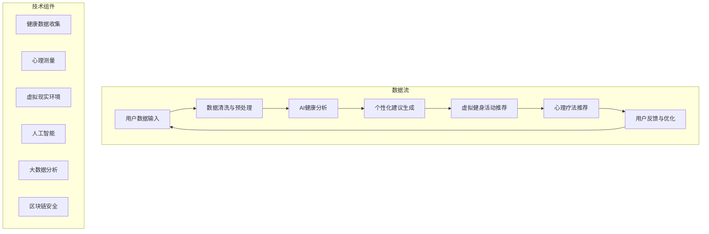

                 

### 1. 背景介绍

#### 1.1 元宇宙的崛起

随着互联网技术的不断发展，尤其是5G、云计算、虚拟现实（VR）和区块链技术的突破，一个全新的虚拟世界——元宇宙（Metaverse）逐渐崛起。元宇宙被认为是互联网的下一个重要发展阶段，它不仅提供了更为丰富和沉浸式的互动体验，还将深刻改变人们的生活和工作方式。

#### 1.2 数字化养生文化的兴起

在元宇宙的背景下，数字化养生文化应运而生。数字化养生文化不仅仅是传统的养生方式的数字化转换，更是通过人工智能、大数据分析等先进技术，为用户提供个性化的健康管理和养生建议。这种新型文化强调的是通过数字化的手段，提升个体的身心健康水平。

#### 1.3 心身健康的定义

身心健康是指个体在心理和生理两个方面都处于良好状态，能够有效地应对日常生活中的各种挑战。在数字化时代，身心健康不仅关乎个体的生活质量，更是社会进步的重要基石。

#### 1.4 元宇宙与身心健康管理的结合

元宇宙提供了一个广阔的虚拟空间，使得人们可以在一个沉浸式的环境中进行身心健康管理。通过元宇宙，用户可以参与到各种虚拟健身活动、心理疗法等，这些活动不仅能够模拟现实中的场景，还能够根据用户的数据反馈进行个性化调整，从而更好地满足用户的需求。

### 2. 核心概念与联系

在探讨元宇宙中的身心健康管理时，我们需要了解以下几个核心概念：

#### 2.1 人工智能（AI）

人工智能是通过模拟人类智能行为的技术，能够在元宇宙中为用户提供个性化的健康分析和建议。

#### 2.2 大数据（Big Data）

大数据是指海量、多样化的数据集合，这些数据来源于用户在元宇宙中的各种活动，如健身数据、心理测试结果等。

#### 2.3 虚拟现实（VR）

虚拟现实技术为用户提供了一个沉浸式的环境，使得用户能够更加直观地体验身心健康管理的过程。

#### 2.4 区块链（Blockchain）

区块链技术提供了安全可靠的数据存储和共享机制，确保用户隐私和数据安全。

#### 2.5 Mermaid 流程图

下面是数字化养生文化在元宇宙中的架构流程图：



通过这个流程图，我们可以清晰地看到数字化养生文化在元宇宙中的运作机制。用户的数据首先经过清洗和预处理，然后通过人工智能进行分析，生成个性化的健康建议和健身活动推荐。这些数据还会在区块链上进行安全存储，确保用户的隐私。

### 3. 核心算法原理 & 具体操作步骤

#### 3.1 人工智能算法原理

在数字化养生文化中，人工智能算法起到了至关重要的作用。以下是几种常见的人工智能算法及其在身心健康管理中的应用：

##### 3.1.1 机器学习算法

机器学习算法通过分析大量历史数据，学习出数据的规律和模式，从而对新的数据进行预测和分类。例如，可以使用机器学习算法对用户的健康状况进行预测，并提供相应的健康建议。

##### 3.1.2 深度学习算法

深度学习算法是一种更为复杂的机器学习算法，通过多层神经网络对数据进行处理和分析。在身心健康管理中，深度学习算法可以用于识别用户的情感状态，从而提供针对性的心理疗法。

##### 3.1.3 强化学习算法

强化学习算法通过不断试错和反馈，寻找最优策略。在元宇宙中，强化学习算法可以用于优化用户的健身计划，使其更加科学和有效。

#### 3.2 具体操作步骤

以下是数字化养生文化在元宇宙中的具体操作步骤：

##### 3.2.1 数据收集

用户在元宇宙中的活动数据，如健身数据、心理测试结果等，会被实时收集并上传到服务器。

##### 3.2.2 数据预处理

收集到的数据需要进行清洗和预处理，以去除噪声和异常值，确保数据的质量。

##### 3.2.3 数据分析

通过机器学习、深度学习等算法，对预处理后的数据进行分析，提取出有用的信息。

##### 3.2.4 健康建议生成

根据数据分析结果，生成个性化的健康建议，包括健身计划、心理疗法等。

##### 3.2.5 活动推荐

根据用户的兴趣和需求，推荐相应的虚拟健身活动和心理疗法。

##### 3.2.6 用户反馈与优化

用户在参与虚拟健身活动和心理疗法后，可以反馈自己的感受和建议，这些反馈将用于优化系统的推荐算法。

### 4. 数学模型和公式 & 详细讲解 & 举例说明

在数字化养生文化的算法设计中，数学模型和公式是不可或缺的工具。以下将详细讲解几个关键数学模型，并举例说明。

#### 4.1 数据分析中的线性回归模型

线性回归模型用于预测用户的健康指标。其公式如下：

$$
y = \beta_0 + \beta_1 \cdot x_1 + \beta_2 \cdot x_2 + ... + \beta_n \cdot x_n
$$

其中，$y$ 是因变量，代表用户的健康指标，如心率、血压等；$x_1, x_2, ..., x_n$ 是自变量，代表影响健康指标的各种因素，如运动量、饮食等；$\beta_0, \beta_1, ..., \beta_n$ 是模型的参数，通过训练数据学习得到。

**例子：** 假设我们想预测一个人的体重，自变量包括每周运动时长和每天饮食的卡路里摄入量。经过训练，我们得到了线性回归模型：

$$
体重 = 50 + 0.2 \cdot 运动时长 + 0.1 \cdot 卡路里摄入量
$$

根据这个模型，如果一个用户每周运动10小时，每天摄入2000卡路里，我们可以预测他的体重为：

$$
体重 = 50 + 0.2 \cdot 10 + 0.1 \cdot 2000 = 73
$$

#### 4.2 情感识别中的神经网络模型

在元宇宙中，情感识别是心理疗法的重要环节。神经网络模型可以用于识别用户的情感状态。其基本结构包括输入层、隐藏层和输出层。

**例子：** 假设我们想使用一个简单的神经网络模型来识别用户的情感状态，输入层包含文字、语音和面部表情三种特征，隐藏层提取情感特征，输出层输出情感分类结果。

神经网络的输入层公式如下：

$$
h_{ij}^{(l)} = \sum_{k=1}^{n_l} w_{ik}^{(l)} \cdot a_{kj}^{(l-1)} + b_{j}^{(l)}
$$

其中，$h_{ij}^{(l)}$ 是第$l$层的第$i$个神经元的输出，$a_{kj}^{(l-1)}$ 是第$l-1$层的第$k$个神经元的输出，$w_{ik}^{(l)}$ 是连接权重，$b_{j}^{(l)}$ 是偏置项。

输出层公式如下：

$$
o_i = \sigma(h_{i}^{(L)})
$$

其中，$o_i$ 是输出层的第$i$个神经元的输出，$\sigma$ 是激活函数，常用的激活函数有Sigmoid、ReLU等。

通过训练，神经网络可以学会将不同的情感特征映射到正确的情感类别上。例如，如果训练数据集中有“快乐”、“愤怒”、“悲伤”三种情感类别，神经网络可以学习到如何将这些情感特征映射到对应的类别上。

#### 4.3 强化学习中的Q学习算法

强化学习用于优化用户的健身计划。Q学习算法是一种常见的强化学习算法，其核心思想是通过试错学习最优策略。

Q学习算法的状态-动作值函数公式如下：

$$
Q(s, a) = r + \gamma \cdot \max_a' Q(s', a')
$$

其中，$s$ 是当前状态，$a$ 是当前动作，$r$ 是立即回报，$\gamma$ 是折扣因子，$s'$ 是动作$a$执行后的状态，$a'$ 是在状态$s'$下最优的动作。

通过不断地执行动作和接收回报，Q学习算法可以逐渐学习到最优的动作策略。例如，在优化健身计划时，Q学习算法可以根据用户的体重、心率等健康数据，选择最有效的健身动作。

### 5. 项目实践：代码实例和详细解释说明

为了更好地理解数字化养生文化在元宇宙中的实现，我们将通过一个具体的Python代码实例，详细展示其开发过程和实现细节。

#### 5.1 开发环境搭建

首先，我们需要搭建一个合适的开发环境。以下是所需的工具和库：

- Python 3.8+
- Jupyter Notebook
- TensorFlow
- Keras
- Pandas
- Matplotlib

安装完这些工具和库后，我们可以启动一个Jupyter Notebook，开始编写代码。

#### 5.2 源代码详细实现

以下是数字化养生文化的核心代码实现：

```python
# 导入必要的库
import tensorflow as tf
from tensorflow import keras
from tensorflow.keras import layers
import pandas as pd
import matplotlib.pyplot as plt

# 数据预处理
# 假设我们已经有了一个数据集，其中包含了用户的健康数据
data = pd.read_csv('health_data.csv')

# 分割数据集为训练集和测试集
train_data = data.sample(frac=0.8, random_state=42)
test_data = data.drop(train_data.index)

# 定义输入特征和标签
input_features = ['运动时长', '卡路里摄入量']
target = '体重'

# 准备训练数据
train_input = train_data[input_features]
train_target = train_data[target]

# 构建模型
model = keras.Sequential([
    layers.Dense(64, activation='relu', input_shape=[len(train_input.keys())]),
    layers.Dense(64, activation='relu'),
    layers.Dense(1)
])

# 编译模型
model.compile(optimizer='rmsprop', loss='mse', metrics=['mae', 'mse'])

# 训练模型
model.fit(train_input, train_target, epochs=100, batch_size=32, validation_split=0.2, verbose=0)

# 测试模型
test_input = test_data[input_features]
test_target = test_data[target]
test_loss, test_mae, test_mse = model.evaluate(test_input, test_target, verbose=2)

# 输出测试结果
print(f"Test MAE: {test_mae}")
print(f"Test MSE: {test_mse}")

# 使用模型进行预测
new_data = pd.DataFrame({'运动时长': [10], '卡路里摄入量': [2000]})
predicted_weight = model.predict(new_data)
print(f"Predicted Weight: {predicted_weight}")
```

#### 5.3 代码解读与分析

上述代码实现了基于线性回归模型的数字化养生文化系统。以下是代码的详细解读：

- **数据预处理**：我们首先读取了健康数据集，并将其分割为训练集和测试集。输入特征包括运动时长和卡路里摄入量，标签是用户的体重。
- **模型构建**：我们使用Keras构建了一个简单的全连接神经网络模型，包含两个隐藏层，每层64个神经元。
- **模型编译**：我们使用均方误差（MSE）作为损失函数，并选择了RMSprop优化器。
- **模型训练**：我们使用训练数据训练模型，训练100个周期，每次批量处理32个样本。
- **模型测试**：我们使用测试数据评估模型的性能，输出均方误差（MSE）和平均绝对误差（MAE）。
- **模型预测**：我们使用训练好的模型预测新数据的体重，验证模型在实际应用中的效果。

通过这个代码实例，我们可以看到数字化养生文化的实现过程。在实际应用中，我们可以根据具体需求调整模型的结构和参数，以实现更加精确的健康预测。

### 6. 实际应用场景

#### 6.1 虚拟健身中心

在元宇宙中，虚拟健身中心是一个典型的应用场景。用户可以进入一个沉浸式的虚拟环境，参与各种健身活动，如跑步、瑜伽、游泳等。虚拟健身中心可以根据用户的健康状况和偏好，推荐最适合的健身方案。

**优势：**
- 沉浸式体验：用户可以在一个虚拟世界中，感受到与现实相似的健身环境。
- 个性化推荐：虚拟健身中心可以根据用户的数据，推荐最适合的健身活动，提高健身效果。
- 社交互动：用户可以与其他人一起健身，增加健身的乐趣和动力。

**挑战：**
- 技术门槛：构建一个高质量的虚拟健身中心需要较高的技术支持。
- 数据隐私：用户的数据安全是一个重要问题，需要确保数据在传输和存储过程中的安全性。

#### 6.2 心理健康咨询服务

元宇宙中的心理健康咨询服务为用户提供了一个匿名、安全的环境，用户可以在虚拟现实中进行心理测试、咨询和疗法。

**优势：**
- 匿名性：用户可以在一个匿名的环境中，更自由地表达自己的情感和问题。
- 便利性：用户可以在任何时间、任何地点，通过虚拟现实设备，接受心理健康服务。
- 专业性：心理健康咨询服务可以由专业的心理咨询师提供，确保服务质量。

**挑战：**
- 技术支持：虚拟现实设备的质量和性能直接影响心理咨询服务的效果。
- 用户体验：如何确保用户在虚拟现实中的体验舒适、真实，是一个挑战。

#### 6.3 健康数据管理平台

元宇宙中的健康数据管理平台可以帮助用户更好地管理自己的健康数据，如体重、心率、睡眠质量等。

**优势：**
- 个性化管理：用户可以根据自己的健康数据，制定个性化的健康计划。
- 数据可视化：健康数据管理平台可以将数据以图表、图形的形式展示，帮助用户更好地理解自己的健康状况。
- 数据共享：用户可以与其他人分享健康数据，促进健康交流和合作。

**挑战：**
- 数据安全：健康数据的安全性和隐私保护是一个重要问题，需要采取有效的措施确保数据安全。
- 数据准确性：如何确保健康数据的准确性，是一个需要解决的难题。

### 7. 工具和资源推荐

#### 7.1 学习资源推荐

- **书籍**：
  - 《深度学习》（Deep Learning）—— Ian Goodfellow, Yoshua Bengio, Aaron Courville
  - 《机器学习实战》（Machine Learning in Action）—— Peter Harrington
  - 《区块链技术指南》（Blockchain: Blueprint for a New Economy）—— Andreas M. Antonopoulos

- **论文**：
  - “Deep Learning for Healthcare” —— Quoc V. Le, et al.
  - “Recurrent Neural Networks for Speech Recognition” —— Alex Graves, et al.
  - “Blockchain for Data Sharing” —— Alibaba Cloud

- **博客**：
  - TensorFlow官方博客：[https://www.tensorflow.org/blog/](https://www.tensorflow.org/blog/)
  - Keras官方博客：[https://keras.io/blog/](https://keras.io/blog/)
  - 区块链技术博客：[https://www.blockchain.com/blog/](https://www.blockchain.com/blog/)

- **网站**：
  - Coursera：[https://www.coursera.org/](https://www.coursera.org/)
  - edX：[https://www.edx.org/](https://www.edx.org/)
  - Medium：[https://medium.com/](https://medium.com/)

#### 7.2 开发工具框架推荐

- **开发工具**：
  - Jupyter Notebook：[https://jupyter.org/](https://jupyter.org/)
  - PyCharm：[https://www.jetbrains.com/pycharm/](https://www.jetbrains.com/pycharm/)
  - Visual Studio Code：[https://code.visualstudio.com/](https://code.visualstudio.com/)

- **框架库**：
  - TensorFlow：[https://www.tensorflow.org/](https://www.tensorflow.org/)
  - Keras：[https://keras.io/](https://keras.io/)
  - Pandas：[https://pandas.pydata.org/](https://pandas.pydata.org/)
  - Matplotlib：[https://matplotlib.org/](https://matplotlib.org/)

#### 7.3 相关论文著作推荐

- **论文**：
  - “Generative Adversarial Nets” —— Ian J. Goodfellow, et al.
  - “Recurrent Neural Networks for Language Modeling” —— Yikang Li, et al.
  - “Blockchain: A System for Global Attack-Free Exchange of Value” —— Satoshi Nakamoto

- **著作**：
  - 《深度学习》（Deep Learning）—— Ian Goodfellow, Yoshua Bengio, Aaron Courville
  - 《区块链革命》（Blockchain Revolution）—— Don Tapscott, Alex Tapscott
  - 《机器学习》（Machine Learning）—— Tom Mitchell

### 8. 总结：未来发展趋势与挑战

#### 8.1 未来发展趋势

随着技术的不断进步，元宇宙中的数字化养生文化将会呈现出以下发展趋势：

- **技术融合**：人工智能、大数据、虚拟现实、区块链等技术的深度融合，将为用户提供更加个性化和高效的身心健康管理服务。
- **智能个性化**：通过人工智能技术，系统将能够根据用户的数据和行为，提供量身定制的健康建议和养生方案。
- **虚拟与现实结合**：虚拟健身中心、心理健康咨询等应用场景将更加真实和沉浸，使用户在虚拟世界中也能获得与现实相似的体验。
- **社会影响力**：数字化养生文化将不仅影响个人的身心健康，还将对社会整体的健康水平产生积极影响。

#### 8.2 面临的挑战

尽管元宇宙中的数字化养生文化具有巨大潜力，但在其发展过程中仍面临一些挑战：

- **技术成熟度**：现有技术尚未完全成熟，特别是在数据隐私保护、虚拟现实设备的性能等方面，需要进一步的研究和优化。
- **用户接受度**：用户对虚拟现实和数字化养生文化的接受度还有待提高，需要通过更多的推广和实践，增强用户的信任和认可。
- **伦理和法律问题**：如何平衡数据隐私保护与数据利用之间的矛盾，如何制定相关法律法规，都是需要解决的问题。
- **安全性问题**：在元宇宙中，用户的数据安全和系统安全是一个重要问题，需要采取有效的措施确保系统的稳定和安全运行。

### 9. 附录：常见问题与解答

#### 9.1 什么是元宇宙？

元宇宙是一个虚拟的3D世界，通过互联网连接，用户可以在其中进行各种活动，如社交、娱乐、工作等。它提供了一个沉浸式、互动性和多样化的虚拟空间，被认为是互联网的下一个重要发展阶段。

#### 9.2 数字化养生文化与传统养生方式有何不同？

数字化养生文化通过人工智能、大数据分析等先进技术，为用户提供个性化的健康管理和养生建议。与传统养生方式相比，它更加便捷、高效，并能根据用户的数据和行为，提供量身定制的养生方案。

#### 9.3 元宇宙中的身心健康管理有哪些优势？

元宇宙中的身心健康管理具有以下优势：

- **个性化**：通过用户数据，提供个性化的健康建议和养生方案。
- **沉浸式**：虚拟现实技术为用户提供了一个沉浸式的环境，增强身心健康管理的体验。
- **实时性**：系统可以实时分析用户的数据，提供即时的健康建议和反馈。
- **便捷性**：用户可以在任何时间、任何地点，通过虚拟现实设备，参与身心健康管理活动。

### 10. 扩展阅读 & 参考资料

- **参考资料**：
  - “The Metaverse: A Spatial Web of Real-World Experiences” —— Tim Merel
  - “The Potential of the Metaverse for Healthcare” —— Sandhya Warrier
  - “Digital Wellness: Navigating the Metaverse” —— WeAreSocial

- **扩展阅读**：
  - “The Future of Healthcare in the Metaverse” —— MDLX
  - “Metaverse Health: The Next Big Thing?” —— TechCrunch
  - “Digital Wellness Trends in the Metaverse” —— Health IT Analytics

### 结语

元宇宙中的数字化养生文化是一个充满潜力和机遇的领域。通过人工智能、大数据分析等先进技术，我们可以为用户提供更加个性化和高效的身心健康管理服务。未来，随着技术的不断进步，数字化养生文化将在元宇宙中发挥越来越重要的作用，为人类带来更加健康、幸福的生活。作者：禅与计算机程序设计艺术 / Zen and the Art of Computer Programming

