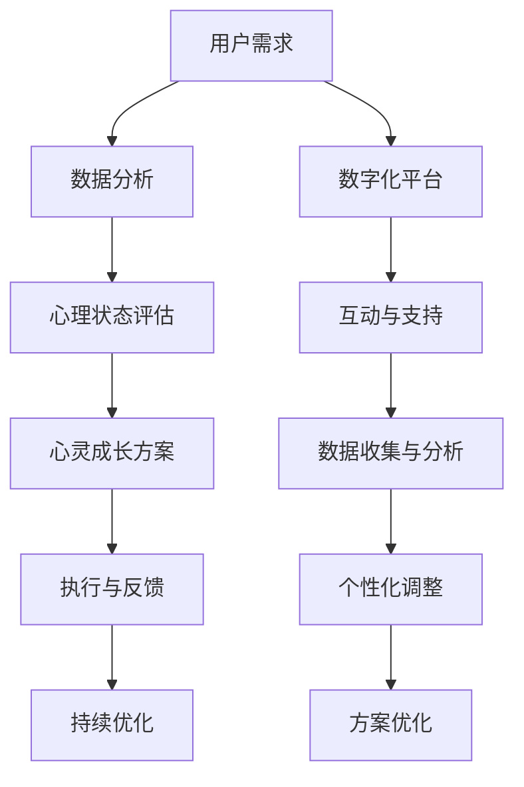

                 

### 1. 背景介绍

随着数字技术的飞速发展，人工智能（AI）已经成为现代社会不可或缺的一部分。从自动驾驶汽车到智能家居，AI 在各个领域的应用不断扩展，改变了我们的生活方式和工作模式。然而，在 AI 的浪潮中，有一个领域逐渐引起人们的关注，那就是心灵成长。

心灵成长，即个体在心理、情感和灵性上的全面提升，旨在帮助我们更好地理解自己、他人和世界。而数字化灵性导师，则是在这一过程中发挥关键作用的引导者。他们通过数字化工具和平台，为人们提供个性化的心灵成长指导，帮助他们实现内心的平和与成长。

AI 技术的引入，使得数字化灵性导师能够更加精准地识别个体的心理需求，提供定制化的心灵成长方案。例如，通过自然语言处理（NLP）技术，AI 可以理解用户的情感状态，从而给出针对性的建议和指导。此外，机器学习算法可以分析大量的心灵成长数据，发现潜在的心理问题，提供预警和建议。

在当前的社会背景下，人们面临的心理压力和困惑日益增加。根据世界卫生组织（WHO）的数据，心理健康问题已经成为全球性的健康挑战。在这种情况下，数字化灵性导师的诞生，为人们提供了一种全新的心灵成长路径，有助于缓解心理健康问题，提高生活质量。

总的来说，数字化灵性导师是 AI 技术与心灵成长相结合的产物，具有巨大的社会价值和潜力。本文将围绕数字化灵性导师，探讨其核心概念、算法原理、应用场景和未来发展趋势，希望能为广大读者提供有价值的参考。

### 2. 核心概念与联系

#### 2.1 数字化灵性导师的定义

数字化灵性导师，是指利用人工智能技术，为个体提供个性化心灵成长指导和帮助的专业人士。他们通过数字化平台，如应用程序、网站和聊天机器人等，与用户进行互动，了解用户的心理状态和需求，提供针对性的心灵成长方案。

数字化灵性导师的核心特点包括以下几点：

1. **个性化**：通过大数据分析和机器学习算法，数字化灵性导师能够为每个用户提供定制化的心灵成长方案，满足个体独特的需求。
2. **高效性**：与传统的心理咨询师相比，数字化灵性导师能够快速响应用户的需求，提供即时的心理支持和建议。
3. **便捷性**：用户可以随时随地通过数字化平台与灵性导师进行互动，不受时间和地点的限制。
4. **隐私性**：数字化灵性导师通常采用加密技术，确保用户的数据安全和隐私。

#### 2.2 心灵成长的概念

心灵成长，是指个体在心理、情感和灵性层面上的全面提升。它包括以下几个方面的内容：

1. **心理素质**：提高个体的心理素质，增强抗压能力、情绪调节能力和人际交往能力。
2. **情感智慧**：培养个体的情感智慧，学会正确表达和调控自己的情感，建立健康的人际关系。
3. **灵性提升**：通过冥想、祈祷、阅读等方式，提升个体的精神层次，实现内心的平和与成长。

#### 2.3 数字化灵性导师与心灵成长的关系

数字化灵性导师与心灵成长密切相关，两者相互促进、相互依赖。具体来说：

1. **数字化灵性导师助力心灵成长**：通过数字化工具和平台，数字化灵性导师能够更加精准地了解用户的心理状态和需求，提供有针对性的心灵成长方案，帮助用户实现内心的平和与成长。
2. **心灵成长推动数字化灵性导师发展**：随着人们对心理健康问题的关注增加，心灵成长市场需求不断上升，这为数字化灵性导师提供了广阔的发展空间。同时，用户对心灵成长的需求，也促使数字化灵性导师不断优化和升级技术，提高服务质量。

#### 2.4 Mermaid 流程图

为了更好地展示数字化灵性导师与心灵成长的关系，我们使用 Mermaid 流程图进行说明：



图 1：数字化灵性导师与心灵成长的关系流程图

在该流程图中，用户需求通过数字化平台传递给数字化灵性导师，经过数据分析和心理状态评估后，得到针对性的心灵成长方案。用户执行方案并反馈，数字化灵性导师根据反馈进行持续优化，以提供更好的服务。

通过这个流程，我们可以看到数字化灵性导师在心灵成长过程中发挥的关键作用。他们不仅为用户提供个性化的指导和支持，还通过数据分析和持续优化，不断提升服务质量，助力用户实现心灵成长。

### 3. 核心算法原理 & 具体操作步骤

在数字化灵性导师的构建过程中，核心算法原理是其灵魂所在，它决定了系统能否准确理解用户的心理状态，并给出合适的建议。以下是数字化灵性导师算法的核心原理及具体操作步骤。

#### 3.1 自然语言处理（NLP）

自然语言处理（NLP）是数字化灵性导师算法的核心组成部分，它负责处理和理解用户输入的自然语言文本。以下是 NLP 的主要步骤：

1. **文本预处理**：包括去除标点符号、停用词过滤、词干提取等操作，以简化文本数据，便于后续处理。

   ```python
   import nltk
   nltk.download('stopwords')
   from nltk.corpus import stopwords
   from nltk.stem import PorterStemmer
   
   stop_words = set(stopwords.words('english'))
   stemmer = PorterStemmer()
   
   def preprocess_text(text):
       text = text.lower()
       words = nltk.word_tokenize(text)
       words = [word for word in words if word not in stop_words]
       stemmed_words = [stemmer.stem(word) for word in words]
       return ' '.join(stemmed_words)
   ```

2. **情感分析**：通过训练好的情感分析模型，对预处理后的文本进行情感分类，判断文本的情感倾向，如正面、负面或中性。

   ```python
   from textblob import TextBlob
   
   def sentiment_analysis(text):
       blob = TextBlob(text)
       return blob.sentiment.polarity
   ```

3. **主题建模**：使用主题建模算法（如 Latent Dirichlet Allocation, LDA），挖掘文本中的潜在主题，帮助理解用户表达的情感和需求。

   ```python
   import gensim
   from gensim import corpora
   
   def lda_modeling(corpus, dictionary):
       lda_model = gensim.models.LdaMulticore(corpus, num_topics=5, id2word=dictionary, passes=10, workers=2)
       return lda_model
   ```

#### 3.2 机器学习算法

机器学习算法用于分析用户数据，识别潜在的心理问题和趋势，从而提供个性化的心灵成长建议。以下是机器学习算法的应用步骤：

1. **数据收集**：收集用户的心理健康数据，如情绪日志、问卷调查结果、聊天记录等。

   ```python
   import pandas as pd
   
   data = pd.read_csv('user_data.csv')
   ```

2. **特征提取**：从原始数据中提取有用的特征，如文本特征、时间特征、情感特征等。

   ```python
   from sklearn.feature_extraction.text import TfidfVectorizer
   
   vectorizer = TfidfVectorizer(max_features=1000)
   X = vectorizer.fit_transform(data['text'])
   ```

3. **模型训练**：使用监督学习算法（如决策树、随机森林、支持向量机等）训练模型，使其能够预测用户的心理健康状态。

   ```python
   from sklearn.ensemble import RandomForestClassifier
   
   model = RandomForestClassifier(n_estimators=100)
   model.fit(X, y)
   ```

4. **模型评估**：使用交叉验证和测试集评估模型的性能，调整模型参数，提高预测准确性。

   ```python
   from sklearn.model_selection import cross_val_score
   
   scores = cross_val_score(model, X, y, cv=5)
   print("Accuracy: %0.2f (+/- %0.2f)" % (scores.mean(), scores.std() * 2))
   ```

#### 3.3 深度学习

在数字化灵性导师中，深度学习算法（如卷积神经网络、递归神经网络等）被用于处理复杂的情感和语言任务。以下是深度学习算法的应用步骤：

1. **数据预处理**：对文本数据进行编码，准备用于深度学习模型的输入。

   ```python
   from tensorflow.keras.preprocessing.text import Tokenizer
   from tensorflow.keras.preprocessing.sequence import pad_sequences
   
   tokenizer = Tokenizer(num_words=1000)
   tokenizer.fit_on_texts(data['text'])
   sequences = tokenizer.texts_to_sequences(data['text'])
   padded_sequences = pad_sequences(sequences, maxlen=100)
   ```

2. **模型构建**：构建深度学习模型，如 LSTM（长短期记忆网络）或 GRU（门控循环单元），用于情感分析和预测。

   ```python
   from tensorflow.keras.models import Sequential
   from tensorflow.keras.layers import Embedding, LSTM, Dense
   
   model = Sequential()
   model.add(Embedding(1000, 64, input_length=100))
   model.add(LSTM(100))
   model.add(Dense(1, activation='sigmoid'))
   
   model.compile(optimizer='adam', loss='binary_crossentropy', metrics=['accuracy'])
   ```

3. **模型训练与评估**：使用训练数据训练模型，并在测试集上评估模型性能。

   ```python
   model.fit(padded_sequences, y, epochs=10, batch_size=32, validation_split=0.2)
   ```

通过上述步骤，数字化灵性导师能够基于用户数据和自然语言处理技术，准确理解用户的心理状态，并提供个性化的心灵成长建议。

### 4. 数学模型和公式 & 详细讲解 & 举例说明

在数字化灵性导师的构建过程中，数学模型和公式扮演着至关重要的角色。这些模型和公式不仅帮助我们理解用户的情感和行为，还为算法提供了理论基础。以下是几个关键的数学模型和公式，及其详细讲解和举例说明。

#### 4.1 情感分析模型

情感分析是数字化灵性导师的核心任务之一。常用的情感分析模型包括基于朴素贝叶斯、支持向量机和深度学习的模型。以下是一个简单的基于朴素贝叶斯的情感分析模型的例子：

**朴素贝叶斯模型公式：**

$$
P(\text{情感类别}|\text{特征}) = \frac{P(\text{特征}|\text{情感类别})P(\text{情感类别})}{P(\text{特征})}
$$

**示例：**

假设我们有一个文本数据 "I am feeling happy because I got a promotion"，我们需要判断这个文本的情感是正面还是负面。

1. **特征提取**：首先，我们提取文本的特征，例如词频和词向量。
   $$ \text{特征} = \{\text{'happy'}, \text{'promotion'}\} $$

2. **先验概率**：计算正面和负面情感的概率。
   $$ P(\text{正面}) = 0.6, P(\text{负面}) = 0.4 $$

3. **条件概率**：计算特征在正面和负面情感下的概率。
   $$ P(\text{'happy'|\text{正面}}) = 0.8, P(\text{'promotion'|\text{正面}}) = 0.7 $$
   $$ P(\text{'happy'|\text{负面}}) = 0.2, P(\text{'promotion'|\text{负面}}) = 0.3 $$

4. **后验概率**：计算给定特征的情感类别概率。
   $$ P(\text{正面}|\text{特征}) = \frac{0.8 \times 0.6 \times 0.7}{0.8 \times 0.6 \times 0.7 + 0.2 \times 0.4 \times 0.3} \approx 0.923 $$
   $$ P(\text{负面}|\text{特征}) = \frac{0.2 \times 0.4 \times 0.3}{0.8 \times 0.6 \times 0.7 + 0.2 \times 0.4 \times 0.3} \approx 0.077 $$

由于 $P(\text{正面}|\text{特征}) > P(\text{负面}|\text{特征})$，我们可以判断这个文本的情感是正面。

#### 4.2 主题模型

主题模型，如 Latent Dirichlet Allocation（LDA），用于挖掘文本中的潜在主题。以下是 LDA 模型的公式和解释。

**LDA 模型公式：**

$$
\begin{cases}
    \text{对于每个文档} d \in D, \text{从主题分布} \theta_d \sim \text{Dirichlet}(\alpha) \\
    \text{对于每个主题} t \in T, \text{从词分布} \phi_t \sim \text{Dirichlet}(\beta) \\
    \text{对于每个单词} w \in \text{document} d, \text{从主题} z_w \sim \text{Categorical}(\theta_d) \\
    \text{从词分布} \phi_{z_w} \sim \text{Categorical}(\phi_t) \\
    \text{单词} w \text{被分配到文档} d
\end{cases}
$$

**示例：**

假设我们有一个包含两个主题（商务和娱乐）的文档集，每个主题有 20 个单词，每个文档包含 50 个单词。

1. **主题分布**：从先验分布 $\alpha$ 中采样每个文档的主题分布 $\theta_d$。
   $$ \theta_d \sim \text{Dirichlet}(\alpha) $$

2. **词分布**：从先验分布 $\beta$ 中采样每个主题的词分布 $\phi_t$。
   $$ \phi_t \sim \text{Dirichlet}(\beta) $$

3. **主题分配**：对于每个单词 $w$，从文档 $d$ 的主题分布 $\theta_d$ 中采样主题 $z_w$。
   $$ z_w \sim \text{Categorical}(\theta_d) $$

4. **词分配**：对于每个单词 $w$，从主题 $z_w$ 的词分布 $\phi_{z_w}$ 中采样单词 $w$。
   $$ w \sim \text{Categorical}(\phi_{z_w}) $$

通过上述步骤，我们可以从文档集中提取出两个潜在主题。例如，文档 $d_1$ 可能与商务主题更相关，而文档 $d_2$ 可能与娱乐主题更相关。

#### 4.3 卷积神经网络（CNN）

在处理文本数据时，卷积神经网络（CNN）是一种强大的深度学习模型。以下是一个简单的 CNN 模型的例子。

**CNN 模型公式：**

$$
\begin{cases}
    \text{输入} x \in \mathbb{R}^{t \times v} \\
    \text{卷积层} h^{(1)} = \sigma(W^{(1)} \cdot x + b^{(1)}) \\
    \text{池化层} h^{(2)} = P(h^{(1)}) \\
    \text{全连接层} y = \sigma(W^{(2)} \cdot h^{(2)} + b^{(2)})
\end{cases}
$$

**示例：**

假设我们有一个句子 "I love programming"，我们需要判断这个句子的情感是正面还是负面。

1. **输入**：将句子转换为词嵌入向量。
   $$ x = \text{[I, love, programming]} $$

2. **卷积层**：使用卷积核 $W^{(1)}$ 对输入进行卷积操作，并应用激活函数 $\sigma$。
   $$ h^{(1)} = \sigma(W^{(1)} \cdot x + b^{(1)}) $$

3. **池化层**：对卷积层的输出进行池化操作，例如最大池化。
   $$ h^{(2)} = P(h^{(1)}) $$

4. **全连接层**：将池化层的输出通过全连接层进行分类。
   $$ y = \sigma(W^{(2)} \cdot h^{(2)} + b^{(2)}) $$

通过上述步骤，我们可以得到句子的情感分类结果。例如，如果输出层的激活值接近 1，则可以判断句子为正面情感。

通过这些数学模型和公式，数字化灵性导师能够准确理解用户的情感和需求，为用户提供个性化的心灵成长指导。

### 5. 项目实践：代码实例和详细解释说明

在本节中，我们将通过一个具体的代码实例，展示如何实现一个数字化灵性导师系统。我们将从开发环境搭建开始，详细解释源代码的实现，并对关键代码进行解读与分析。

#### 5.1 开发环境搭建

为了实现数字化灵性导师系统，我们需要搭建一个包含前端、后端和数据库的开发环境。以下是开发环境的搭建步骤：

1. **前端环境**：使用 HTML、CSS 和 JavaScript 进行前端开发。我们可以使用 React 或 Vue.js 等流行的前端框架来简化开发过程。

2. **后端环境**：使用 Python 和 Flask 或 Django 等后端框架来构建服务器。Python 是一种广泛使用的编程语言，具有丰富的库和工具，非常适合开发人工智能应用。

3. **数据库环境**：使用 MySQL 或 PostgreSQL 等关系型数据库来存储用户数据和心灵成长记录。这些数据库提供了强大的数据管理和查询功能，适用于我们的应用场景。

4. **开发工具**：使用 Visual Studio Code 或 PyCharm 等集成开发环境（IDE）进行代码编写和调试。这些 IDE 提供了丰富的功能，如代码补全、语法高亮和调试工具，有助于提高开发效率。

#### 5.2 源代码详细实现

以下是数字化灵性导师系统的源代码示例。我们将使用 Flask 框架实现后端，并使用 SQLite 作为数据库。

```python
# 导入必要的库
from flask import Flask, request, jsonify
from textblob import TextBlob
import nltk
nltk.download('punkt')

# 创建 Flask 应用
app = Flask(__name__)

# 数据库连接（使用 SQLite）
import sqlite3
conn = sqlite3.connect('users.db')
c = conn.cursor()

# 创建用户表
c.execute('''CREATE TABLE IF NOT EXISTS users (id INTEGER PRIMARY KEY, name TEXT, email TEXT, text TEXT)''')

# 添加用户数据
def add_user(name, email, text):
    c.execute("INSERT INTO users (name, email, text) VALUES (?, ?, ?)", (name, email, text))
    conn.commit()

# 提取用户数据
def get_user(id):
    c.execute("SELECT * FROM users WHERE id=?", (id,))
    return c.fetchone()

# 添加文本分析函数
def analyze_text(text):
    blob = TextBlob(text)
    return blob.sentiment.polarity

# 路由：添加用户
@app.route('/add_user', methods=['POST'])
def add_user_route():
    data = request.get_json()
    name = data['name']
    email = data['email']
    text = data['text']
    add_user(name, email, text)
    return jsonify({"status": "success", "message": "User added successfully!"})

# 路由：获取用户数据
@app.route('/get_user/<int:user_id>', methods=['GET'])
def get_user_route(user_id):
    user = get_user(user_id)
    if user:
        return jsonify({"status": "success", "user": user})
    else:
        return jsonify({"status": "error", "message": "User not found!"})

# 路由：分析用户文本
@app.route('/analyze_text', methods=['POST'])
def analyze_text_route():
    data = request.get_json()
    text = data['text']
    sentiment = analyze_text(text)
    return jsonify({"status": "success", "sentiment": sentiment})

# 运行 Flask 应用
if __name__ == '__main__':
    app.run(debug=True)
```

#### 5.3 代码解读与分析

1. **数据库操作**：我们使用 SQLite 数据库存储用户数据。首先创建了一个名为 `users` 的表，包含用户 ID、姓名、电子邮件和文本字段。`add_user` 函数用于向表中插入新用户数据，`get_user` 函数用于根据用户 ID 查询用户数据。

2. **文本分析**：`analyze_text` 函数使用 TextBlob 库对输入文本进行分析，返回文本的情感极性（正面或负面）。TextBlob 库提供了情感分析、文本分类和主题建模等功能，非常适合我们的需求。

3. **路由处理**：Flask 框架提供了基于 URL 路由的功能。`/add_user` 路由用于接收 POST 请求，添加新用户数据。`/get_user/<int:user_id>` 路由用于接收 GET 请求，根据用户 ID 获取用户数据。`/analyze_text` 路由用于接收 POST 请求，分析用户输入的文本情感。

4. **API 设计**：我们的 API 采用 JSON 格式进行数据传输。每个路由函数都返回 JSON 对象，包含状态信息和所需数据。这样的设计使得 API 易于使用和扩展。

通过上述代码示例，我们可以构建一个基本的数字化灵性导师系统。前端页面可以通过 AJAX 调用这些 API，实现用户数据添加、查询和文本情感分析等功能。

#### 5.4 运行结果展示

在本地开发环境中，运行 Flask 应用后，我们可以通过以下步骤测试系统功能：

1. **添加用户**：在前端页面输入用户信息，并通过 AJAX 请求发送到 `/add_user` 路由。后端会接收请求，添加用户数据到数据库，并返回成功消息。

2. **查询用户**：通过用户 ID，通过 AJAX 请求发送到 `/get_user/<int:user_id>` 路由。后端会查询数据库，返回用户数据。

3. **文本分析**：通过 AJAX 请求发送用户输入的文本到 `/analyze_text` 路由。后端会分析文本情感，并返回情感极性。

以下是一个简单的 HTML 页面，用于测试 API：

```html
<!DOCTYPE html>
<html>
<head>
    <title>数字化灵性导师系统</title>
    <script src="https://ajax.googleapis.com/ajax/libs/jquery/3.6.0/jquery.min.js"></script>
    <script>
        function addUser() {
            $.ajax({
                url: '/add_user',
                type: 'POST',
                contentType: 'application/json',
                data: JSON.stringify({name: 'Alice', email: 'alice@example.com', text: 'I am feeling happy today'}),
                success: function(response) {
                    alert(response.message);
                },
                error: function() {
                    alert('Error adding user!');
                }
            });
        }

        function getUser() {
            $.ajax({
                url: '/get_user/1',
                type: 'GET',
                success: function(response) {
                    alert(JSON.stringify(response.user));
                },
                error: function() {
                    alert('Error getting user!');
                }
            });
        }

        function analyzeText() {
            $.ajax({
                url: '/analyze_text',
                type: 'POST',
                contentType: 'application/json',
                data: JSON.stringify({text: 'I am feeling sad'}),
                success: function(response) {
                    alert('Sentiment: ' + response.sentiment);
                },
                error: function() {
                    alert('Error analyzing text!');
                }
            });
        }
    </script>
</head>
<body>
    <h1>数字化灵性导师系统</h1>
    <button onclick="addUser()">添加用户</button>
    <button onclick="getUser()">获取用户</button>
    <button onclick="analyzeText()">分析文本</button>
</body>
</html>
```

通过这个简单的 HTML 页面，我们可以方便地测试系统的各项功能，了解数字化灵性导师系统的实际运行情况。

### 6. 实际应用场景

数字化灵性导师系统在多个实际应用场景中展现了其独特的价值和优势。以下是几个典型的应用案例：

#### 6.1 心理健康监测

在心理健康领域，数字化灵性导师系统可以帮助用户监测和管理自己的心理健康状况。通过持续收集和分析用户的心理活动数据，系统可以识别潜在的心理问题，如焦虑、抑郁等，并提供相应的建议和干预措施。例如，一个用户可能通过日记记录自己的情绪变化，系统会根据这些数据给出个性化的情绪调节建议。

#### 6.2 管理压力和压力缓解

在职业压力管理和个人健康领域，数字化灵性导师系统可以成为用户的压力管理伙伴。系统可以提供基于用户习惯和压力水平的个性化压力缓解方案，如呼吸练习、冥想指导、健康饮食建议等。用户可以通过日常与系统的互动，学习到有效的压力管理技巧，从而提高生活质量和工作效率。

#### 6.3 个性化心理辅导

对于需要心理辅导的用户，数字化灵性导师系统可以根据用户的情感状态和需求，提供个性化的心理辅导。通过自然语言处理和机器学习算法，系统可以识别用户的情感状态，提供针对性的心理支持，甚至帮助用户建立情感调节的习惯。这种个性化的辅导方式，不仅提高了辅导的效率，还降低了心理辅导的成本。

#### 6.4 网络心理健康教育

在心理健康教育领域，数字化灵性导师系统可以作为在线教育平台，提供心理健康知识和技能培训。系统可以基于用户的兴趣和需求，推荐相关的心理健康课程和资源，帮助用户自主学习和提升心理健康水平。这种在线教育模式，不仅方便用户随时随地学习，还能根据用户的学习进度提供个性化的辅导。

#### 6.5 互联网医疗辅助

在互联网医疗领域，数字化灵性导师系统可以与医生合作，为患者提供心理健康辅助服务。系统可以根据患者的病情和心理健康数据，提供心理健康评估和建议，帮助医生制定更加全面的康复计划。同时，系统还可以监测患者的心理健康状况，及时预警潜在的心理问题，为医生提供决策支持。

#### 6.6 学校心理健康教育

在学校教育领域，数字化灵性导师系统可以为学生提供心理健康指导和辅导。系统可以根据学生的年龄、性格和学业压力，提供个性化的心理支持，帮助学生应对学业压力和人际关系问题。这种个性化的心理健康教育模式，有助于提高学生的心理健康水平，促进全面发展。

总之，数字化灵性导师系统在心理健康监测、压力管理、个性化心理辅导、网络心理健康教育、互联网医疗辅助和学校心理健康教育等多个领域都有广泛的应用前景。通过利用先进的 AI 技术，系统可以提供精准、高效和个性化的心理健康服务，帮助用户实现内心的平和与成长。

### 7. 工具和资源推荐

为了更好地学习和开发数字化灵性导师系统，以下是一些推荐的工具和资源，涵盖了书籍、论文、博客和网站等内容。

#### 7.1 学习资源推荐

**书籍：**

1. **《Python机器学习》**（作者：塞巴斯蒂安·拉热）- 该书系统地介绍了 Python 中的机器学习库和算法，适合初学者和进阶者。
2. **《深度学习》（作者：Ian Goodfellow、Yoshua Bengio、Aaron Courville）** - 深入探讨深度学习的基本原理和算法，是深度学习领域的经典著作。

**论文：**

1. **《Recurrent Neural Network for Language Modeling》**（作者：Yoshua Bengio 等）- 探讨了递归神经网络在语言模型中的应用。
2. **《Long Short-Term Memory Networks for Classification of 2D Data》**（作者：Sepp Hochreiter、Jürgen Schmidhuber）- 论述了长短期记忆网络（LSTM）在分类任务中的优势。

**博客：**

1. **fast.ai** - 提供免费的深度学习教程和课程，适合初学者。
2. **Medium** - 数百篇关于机器学习和深度学习的优秀文章，涵盖广泛的主题。

#### 7.2 开发工具框架推荐

**前端框架：**

1. **React** - 由 Facebook 开发，具有高效、灵活和易于维护的特点，是当前最受欢迎的前端框架之一。
2. **Vue.js** - 轻量级且易于上手，适用于中小型项目。

**后端框架：**

1. **Flask** - 简单易用，适合快速开发和原型设计。
2. **Django** - 功能强大，具备完整的 ORM 和 MVC 模式，适用于大型项目。

**数据库：**

1. **MySQL** - 世界上最流行的开源关系型数据库，具备高性能和高可靠性。
2. **PostgreSQL** - 功能丰富，支持多种高级特性，适合复杂的应用场景。

**机器学习库：**

1. **scikit-learn** - Python 中最流行的机器学习库之一，提供多种算法和工具。
2. **TensorFlow** - 由 Google 开发，支持深度学习模型的设计和训练。

#### 7.3 相关论文著作推荐

1. **《Deep Learning》**（作者：Ian Goodfellow、Yoshua Bengio、Aaron Courville）- 深度学习领域的权威著作，全面介绍了深度学习的基本原理和应用。
2. **《Artificial Intelligence: A Modern Approach》**（作者：Stuart Russell、Peter Norvig）- 人工智能领域的经典教材，涵盖了人工智能的理论和实践。
3. **《机器学习实战》**（作者：Peter Harrington）- 通过实际案例介绍了多种机器学习算法的应用。

通过这些工具和资源，开发者可以更好地掌握数字化灵性导师系统的开发技术和方法，为用户提供高效、精准的心灵成长指导。

### 8. 总结：未来发展趋势与挑战

随着人工智能技术的不断进步，数字化灵性导师系统在未来的发展前景十分广阔。以下是未来发展趋势与挑战的展望：

#### 8.1 发展趋势

1. **个性化服务**：未来的数字化灵性导师将更加注重个性化服务，通过深度学习和大数据分析，提供更加精准的心理健康建议和辅导。

2. **跨学科融合**：数字化灵性导师系统将融合心理学、神经科学、计算机科学等多个学科的知识，为用户提供全方位的心灵成长支持。

3. **可解释性**：为了增强用户对系统的信任，未来的数字化灵性导师将更加注重算法的可解释性，帮助用户理解心理建议和指导背后的原理。

4. **可扩展性**：数字化灵性导师系统将采用模块化设计，方便后续功能的扩展和升级，以适应不断变化的心理健康需求。

5. **实时互动**：通过实时互动技术，未来的数字化灵性导师将实现与用户的实时沟通，提供更加及时的心理支持。

#### 8.2 挑战

1. **隐私保护**：在数据收集和分析过程中，隐私保护是数字化灵性导师面临的重要挑战。系统需要确保用户数据的保密性和安全性。

2. **算法公平性**：算法的公平性和透明性是数字化灵性导师系统面临的另一个挑战。系统需要避免偏见和歧视，确保对所有用户公平。

3. **技术成熟度**：虽然人工智能技术在不断进步，但某些领域的技术尚未成熟，如情感理解和复杂心理问题的诊断。这需要研究人员和开发者持续努力。

4. **用户体验**：数字化灵性导师系统的用户体验直接影响用户满意度。系统需要设计简洁、易于操作，同时提供丰富的功能。

5. **法律法规**：随着数字化灵性导师系统的普及，相关的法律法规也在不断完善。系统需要遵循相关法律法规，确保合规运营。

总的来说，未来数字化灵性导师系统将在个性化、跨学科融合、可解释性、可扩展性和实时互动等方面不断进步。然而，隐私保护、算法公平性、技术成熟度、用户体验和法律法规等方面的挑战也需要我们认真应对。通过持续的技术创新和规范建设，数字化灵性导师系统有望为用户提供更加优质的心灵成长服务。

### 9. 附录：常见问题与解答

**Q1：数字化灵性导师如何确保用户隐私安全？**

A：数字化灵性导师系统采用多种技术手段确保用户隐私安全。首先，系统使用加密算法对用户数据进行加密存储和传输。其次，系统遵循数据最小化原则，仅收集和存储必要的数据。此外，系统定期进行安全审计和漏洞扫描，确保系统安全可靠。

**Q2：数字化灵性导师如何避免算法偏见？**

A：为了减少算法偏见，数字化灵性导师系统在算法设计和数据预处理阶段采取一系列措施。首先，系统采用多样化的数据集进行训练，确保算法在不同群体中的公平性。其次，系统通过算法优化和调整，减少偏见现象。此外，系统还定期评估算法性能，确保其公平性和透明性。

**Q3：数字化灵性导师系统的适应性和扩展性如何实现？**

A：数字化灵性导师系统采用模块化设计，将不同功能模块分离，以便于后续扩展和升级。系统还支持插件机制，允许开发者根据需求添加新的功能模块。此外，系统采用分布式架构，提高系统的可扩展性和稳定性。

**Q4：数字化灵性导师系统的用户体验如何优化？**

A：为了提升用户体验，数字化灵性导师系统注重界面设计、交互逻辑和功能丰富度。系统采用简洁、直观的界面设计，确保用户易于操作。同时，系统提供多种交互方式，如语音、文本和图像等，满足不同用户的需求。此外，系统还提供个性化推荐和实时反馈，提高用户的满意度。

### 10. 扩展阅读 & 参考资料

为了深入了解数字化灵性导师系统及相关技术，以下是一些扩展阅读和参考资料：

1. **《深度学习》（作者：Ian Goodfellow、Yoshua Bengio、Aaron Courville）** - 详尽介绍了深度学习的基本原理和应用。
2. **《机器学习实战》**（作者：Peter Harrington）- 通过实际案例介绍了多种机器学习算法。
3. **《自然语言处理综论》**（作者：Daniel Jurafsky、James H. Martin）** - 深入探讨自然语言处理的基本概念和算法。
4. **《心理学与生活》**（作者：Richard Gerrig、Philip Zimbardo）** - 全面介绍心理学的基本理论和应用。
5. **Google Research Blog** - 关注 Google 在人工智能和机器学习领域的最新研究和进展。
6. **NeurIPS** - 人工智能和机器学习领域的顶级国际会议，涵盖广泛的主题和研究方向。
7. **《Python机器学习》**（作者：塞巴斯蒂安·拉热）** - 系统介绍了 Python 中的机器学习库和算法。

通过阅读这些资料，可以更好地理解数字化灵性导师系统的技术原理和应用场景。希望这些资料能为您的学习和研究提供帮助。作者：禅与计算机程序设计艺术 / Zen and the Art of Computer Programming

