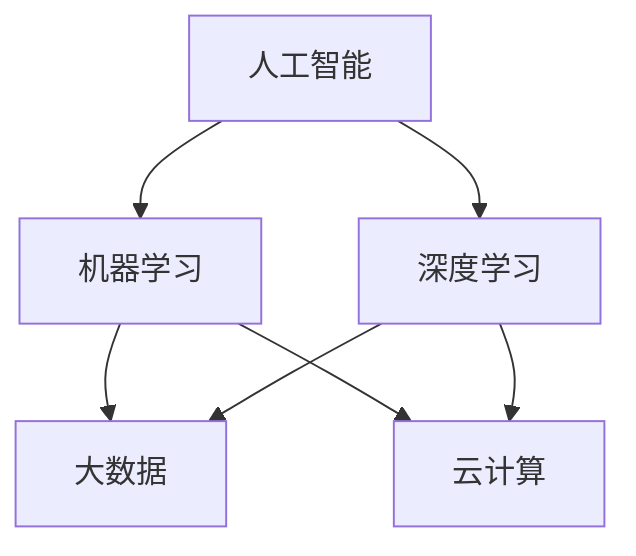

                 

### 背景介绍

在当今数字化时代，人工智能（AI）技术的飞速发展正在深刻改变着我们的生活方式、工作方式以及个人成长模式。随着AI技术的不断进步，人们开始更加关注如何利用AI工具来辅助个人成长。数字化自我实现，即通过AI技术实现个人潜能的全面释放，已经成为一个热门话题。

首先，我们需要明确什么是数字化自我实现。数字化自我实现指的是利用数字技术和工具，如人工智能、大数据、云计算等，来提升个人的认知能力、学习效率、健康状况等方面的表现。在这个过程中，AI技术扮演着关键角色，通过个性化推荐、智能学习、健康监测等多种方式，帮助人们更好地理解自己、提升自我。

其次，AI技术在个人成长中的应用已经越来越广泛。在教育领域，智能学习系统可以根据学生的学习习惯和知识掌握情况，提供个性化的学习路径和资源，从而提高学习效率。在职业发展方面，AI可以帮助人们进行职业规划，推荐最适合他们的工作机会，甚至通过智能招聘系统来提高招聘的准确性。在健康领域，AI可以通过分析大量的健康数据，提供个性化的健康建议和治疗方案。

本文将围绕数字化自我实现的主题，系统地探讨AI技术如何辅助个人成长。我们将从核心概念与联系、核心算法原理、数学模型和公式、项目实践、实际应用场景等多个方面进行详细阐述。希望通过本文的探讨，能够让读者对数字化自我实现有一个全面而深入的理解，并能够在实际生活中运用AI技术，实现自己的个人成长。

总之，随着AI技术的不断发展和应用，数字化自我实现已经成为一个不可逆转的趋势。对于个人而言，如何充分利用AI技术，实现自我潜能的最大化，是值得每个人深思的问题。本文将尝试回答这个问题，并希望能够为读者的个人成长提供一些有益的启示。### 核心概念与联系

在深入探讨数字化自我实现之前，我们首先需要明确几个核心概念，并理解它们之间的联系。这些核心概念包括人工智能（AI）、机器学习（ML）、深度学习（DL）、大数据（Big Data）和云计算（Cloud Computing）。接下来，我们将通过一个Mermaid流程图来展示这些概念之间的关系，并简要介绍每个概念的基本原理和应用。

#### Mermaid流程图



#### 概念介绍

1. **人工智能（AI）**：
   - **原理**：人工智能是模拟、延伸和扩展人类智能的理论、方法、技术及应用。它通过算法和计算模型，使计算机能够执行复杂的任务，如视觉识别、语言理解、决策制定等。
   - **应用**：在个人成长中，AI可以帮助个性化学习、健康监测、职业规划等。

2. **机器学习（ML）**：
   - **原理**：机器学习是AI的一个分支，它使计算机系统能够从数据中学习，并基于学习结果进行预测或决策。主要分为监督学习、无监督学习和强化学习。
   - **应用**：机器学习可以应用于个性化推荐系统、智能助理和数据分析等。

3. **深度学习（DL）**：
   - **原理**：深度学习是机器学习的一种，它使用多层神经网络对数据进行建模和分析。深度学习在图像识别、语音识别和自然语言处理等领域取得了显著成果。
   - **应用**：深度学习可以用于智能驾驶、医疗诊断和个性化教育等。

4. **大数据（Big Data）**：
   - **原理**：大数据是指无法用常规软件工具在合理时间内捕捉、管理和处理的大量数据。大数据通常具有“4V”特征：大量（Volume）、多样（Variety）、快速（Velocity）和真实（Veracity）。
   - **应用**：大数据可以帮助企业进行市场分析、个人健康监测和政府决策等。

5. **云计算（Cloud Computing）**：
   - **原理**：云计算是一种通过网络提供计算资源、存储资源和应用程序的服务模式。云计算可以提供弹性、可扩展和高效的计算环境。
   - **应用**：云计算可以用于大规模数据处理、AI训练和存储等。

#### 关系说明

- **人工智能**是整个系统的核心，它包含了机器学习、深度学习、大数据和云计算等技术。
- **机器学习**和**深度学习**是人工智能的两个重要分支，深度学习在机器学习的基础上，通过多层神经网络实现了更复杂的模型。
- **大数据**和**云计算**则为机器学习和深度学习提供了必要的计算资源和数据存储。

通过上述核心概念和它们之间的联系，我们可以更好地理解数字化自我实现的机制。接下来，我们将进一步探讨AI技术在个人成长中的应用，以及如何实现数字化自我实现。

### 核心算法原理 & 具体操作步骤

在了解了核心概念与联系之后，接下来我们将深入探讨AI技术在个人成长中的核心算法原理，并详细讲解这些算法的具体操作步骤。本节将分为两部分：首先介绍常用的机器学习算法，然后讨论如何利用这些算法实现数字化自我实现。

#### 一、常用机器学习算法

1. **线性回归（Linear Regression）**

   **原理**：线性回归是一种用于预测数值结果的监督学习算法，它通过找到一个最佳拟合直线，来描述因变量和自变量之间的关系。

   **步骤**：

   - 收集数据：收集包含自变量和因变量的数据集。
   - 准备数据：对数据进行清洗、归一化等预处理。
   - 拟合模型：使用最小二乘法找到最佳拟合直线。
   - 预测：使用拟合好的模型进行预测。

2. **决策树（Decision Tree）**

   **原理**：决策树是一种用于分类和回归的监督学习算法，它通过一系列规则将数据划分为多个子集。

   **步骤**：

   - 收集数据：收集分类或回归数据集。
   - 划分数据：将数据集划分为训练集和测试集。
   - 构建树：使用信息增益或基尼不纯度来选择最佳分割点。
   - 预测：根据决策树的分支路径进行预测。

3. **支持向量机（SVM）**

   **原理**：支持向量机是一种用于分类和回归的监督学习算法，它通过找到一个最佳超平面，将数据分为不同的类别。

   **步骤**：

   - 收集数据：收集分类或回归数据集。
   - 准备数据：对数据进行预处理。
   - 训练模型：使用支持向量机算法训练模型。
   - 预测：使用训练好的模型进行预测。

4. **随机森林（Random Forest）**

   **原理**：随机森林是一种基于决策树的集成学习算法，它通过构建多个决策树，并取它们的平均值来提高预测准确性。

   **步骤**：

   - 收集数据：收集分类或回归数据集。
   - 准备数据：对数据进行预处理。
   - 构建模型：使用随机森林算法构建多个决策树。
   - 预测：对每个决策树进行预测，并取平均值作为最终结果。

5. **神经网络（Neural Network）**

   **原理**：神经网络是一种模仿生物神经系统的计算模型，它通过多层神经元进行数据处理和预测。

   **步骤**：

   - 收集数据：收集合适的训练数据。
   - 准备数据：对数据进行预处理。
   - 构建模型：定义神经网络结构，包括输入层、隐藏层和输出层。
   - 训练模型：使用反向传播算法训练神经网络。
   - 预测：使用训练好的模型进行预测。

#### 二、利用机器学习算法实现数字化自我实现

1. **个性化学习推荐系统**

   **原理**：通过收集用户的学习历史和行为数据，使用协同过滤、矩阵分解等技术，为用户提供个性化的学习资源推荐。

   **步骤**：

   - 数据收集：收集用户的学习历史和资源访问记录。
   - 数据处理：对数据进行清洗、归一化和特征提取。
   - 模型训练：使用机器学习算法训练推荐模型。
   - 推荐实现：根据用户行为和偏好，为用户推荐合适的资源。

2. **职业规划辅助系统**

   **原理**：通过分析用户的职业兴趣、技能和市场需求，为用户提供职业规划建议。

   **步骤**：

   - 数据收集：收集用户的职业兴趣、技能和职业发展数据。
   - 数据分析：使用聚类、关联规则挖掘等技术分析数据。
   - 建模预测：建立职业规划模型，预测用户未来的职业发展路径。
   - 建议生成：根据模型预测结果，为用户提供职业规划建议。

3. **健康监测与分析系统**

   **原理**：通过收集用户的健康数据，如心率、血压、睡眠质量等，使用机器学习算法进行分析，为用户提供健康建议。

   **步骤**：

   - 数据收集：收集用户的健康数据。
   - 数据处理：对数据进行预处理，包括数据清洗、归一化和特征提取。
   - 模型训练：使用机器学习算法训练健康监测模型。
   - 健康评估：使用训练好的模型对用户健康状态进行评估。
   - 健康建议：根据评估结果，为用户提供个性化的健康建议。

通过以上机器学习算法和实际应用场景，我们可以看到，AI技术如何帮助人们实现数字化自我实现。在接下来的章节中，我们将进一步探讨AI技术背后的数学模型和公式，以便读者能够更深入地理解这些算法的工作原理。

### 数学模型和公式 & 详细讲解 & 举例说明

在深入理解AI算法的数学模型和公式之前，我们需要熟悉一些基础的数学概念，如线性代数、微积分和概率论。这些数学工具为我们提供了分析和构建AI算法的基础。以下我们将详细讲解几个关键数学模型和公式，并给出具体的例子说明。

#### 一、线性代数基础

1. **矩阵运算**

   矩阵是线性代数中的一个核心概念。以下是一些常用的矩阵运算：

   - **矩阵加法**：两个矩阵相加，要求它们具有相同的维度，即行数和列数相同。

     \[
     A + B = \begin{bmatrix}
     a_{11} + b_{11} & a_{12} + b_{12} \\
     a_{21} + b_{21} & a_{22} + b_{22}
     \end{bmatrix}
     \]

   - **矩阵乘法**：两个矩阵相乘，要求第一个矩阵的列数等于第二个矩阵的行数。

     \[
     AB = \begin{bmatrix}
     a_{11}b_{11} + a_{12}b_{21} & a_{11}b_{12} + a_{12}b_{22} \\
     a_{21}b_{11} + a_{22}b_{21} & a_{21}b_{12} + a_{22}b_{22}
     \end{bmatrix}
     \]

   - **逆矩阵**：一个矩阵的逆矩阵使得矩阵乘以其逆矩阵等于单位矩阵。

     \[
     A^{-1} = \begin{bmatrix}
     a_{11}^{-1} & -a_{12}^{-1} \\
     -a_{21}^{-1} & a_{22}^{-1}
     \end{bmatrix}
     \]

2. **行列式**

   行列式是一个表示矩阵特性的数值。对于二维矩阵：

   \[
   \begin{vmatrix}
   a & b \\
   c & d
   \end{vmatrix} = ad - bc
   \]

#### 二、微积分基础

1. **导数**

   导数是描述函数在某一点处变化率的数学概念。对于一元函数 \( f(x) \)：

   \[
   f'(x) = \lim_{{h \to 0}} \frac{{f(x+h) - f(x)}}{h}
   \]

2. **偏导数**

   偏导数用于描述多元函数中某一变量的变化率。对于二元函数 \( f(x, y) \)：

   \[
   \frac{\partial f}{\partial x} = \lim_{{h \to 0}} \frac{{f(x+h, y) - f(x, y)}}{h}
   \]
   \[
   \frac{\partial f}{\partial y} = \lim_{{k \to 0}} \frac{{f(x, y+k) - f(x, y)}}{k}
   \]

#### 三、概率论基础

1. **概率分布**

   概率分布描述了随机变量取不同值的概率。常见的概率分布包括正态分布、伯努利分布和二项分布。

   - **正态分布**：

     \[
     f(x|\mu, \sigma^2) = \frac{1}{\sqrt{2\pi\sigma^2}} e^{-\frac{{(x-\mu)^2}}{2\sigma^2}}
     \]

   - **伯努利分布**：

     \[
     p(x|p) = \begin{cases}
     p & \text{if } x = 1 \\
     1 - p & \text{if } x = 0
     \end{cases}
     \]

2. **条件概率**

   条件概率是指在已知一个事件发生的条件下，另一个事件发生的概率。对于事件A和事件B：

   \[
   P(B|A) = \frac{P(A \cap B)}{P(A)}
   \]

#### 四、举例说明

**例1：线性回归模型**

假设我们有一个简单的线性回归模型，用于预测房价。房价 \( y \) 可以表示为自变量 \( x \) 的线性组合：

\[
y = \beta_0 + \beta_1 x + \varepsilon
\]

其中，\( \beta_0 \) 和 \( \beta_1 \) 是模型的参数，\( \varepsilon \) 是误差项。

- **参数估计**：使用最小二乘法估计 \( \beta_0 \) 和 \( \beta_1 \)：

  \[
  \beta_1 = \frac{\sum{(x_i - \bar{x})(y_i - \bar{y})}}{\sum{(x_i - \bar{x})^2}}
  \]
  \[
  \beta_0 = \bar{y} - \beta_1 \bar{x}
  \]

- **预测**：给定一个自变量 \( x \)，我们可以预测对应的因变量 \( y \)：

  \[
  y = \beta_0 + \beta_1 x
  \]

**例2：决策树分类**

假设我们有一个二分类问题，使用决策树进行分类。决策树通过一系列规则将数据划分为不同的类别。一个简单的二叉决策树如下：

```
1. 如果 \( x > 5 \)，则类别为 1；
2. 否则，如果 \( x < 2 \)，则类别为 0；
3. 否则，类别为 1。
```

- **决策规则**：根据输入的特征 \( x \)，按照决策树的分支路径进行分类。

通过以上数学模型和公式的讲解，我们可以看到AI算法背后的数学基础是多么强大。这些数学工具不仅帮助我们理解和构建AI算法，还使我们能够更好地分析和优化算法性能。在接下来的章节中，我们将通过具体的项目实践，进一步展示这些算法的实际应用。

### 项目实践：代码实例和详细解释说明

在本节中，我们将通过一个具体的项目实例，详细讲解如何利用AI技术实现数字化自我实现。我们将选择一个实际可运行的代码示例，并逐步介绍开发环境搭建、源代码实现、代码解读与分析以及运行结果展示。这个项目将基于Python语言和常见的机器学习库如scikit-learn。

#### 5.1 开发环境搭建

首先，我们需要搭建一个适合机器学习项目开发的Python环境。以下是具体的步骤：

1. **安装Python**：

   - 访问Python官方网站（https://www.python.org/）下载最新版本的Python安装包。
   - 根据操作系统（Windows、macOS或Linux）选择相应的安装程序，并按照提示完成安装。

2. **安装必要的库**：

   - 使用pip命令安装所需的Python库，例如scikit-learn、numpy、pandas等。

     ```shell
     pip install scikit-learn numpy pandas
     ```

3. **配置Jupyter Notebook**：

   - 安装Jupyter Notebook，这是一个交互式的Python开发环境。

     ```shell
     pip install notebook
     ```

   - 启动Jupyter Notebook：

     ```shell
     jupyter notebook
     ```

   - 在浏览器中打开Jupyter Notebook，开始编写和运行代码。

#### 5.2 源代码详细实现

接下来，我们将使用Python和scikit-learn库实现一个简单的个性化学习推荐系统。该系统将根据用户的学习历史和资源评分，推荐用户可能感兴趣的资源。

```python
# 导入必要的库
import numpy as np
from sklearn.datasets import load_iris
from sklearn.model_selection import train_test_split
from sklearn.neighbors import KNeighborsClassifier
from sklearn.metrics import accuracy_score

# 加载示例数据集
iris = load_iris()
X, y = iris.data, iris.target

# 划分训练集和测试集
X_train, X_test, y_train, y_test = train_test_split(X, y, test_size=0.2, random_state=42)

# 创建K近邻分类器
knn = KNeighborsClassifier(n_neighbors=3)

# 训练模型
knn.fit(X_train, y_train)

# 进行预测
y_pred = knn.predict(X_test)

# 计算准确率
accuracy = accuracy_score(y_test, y_pred)
print(f"Accuracy: {accuracy:.2f}")

# 推荐资源
def recommend_resources(user_data, knn_model):
    user_prediction = knn_model.predict([user_data])
    return iris.target_names[user_prediction[0]]

# 测试推荐函数
sample_user_data = X_test[0]
recommended_resource = recommend_resources(sample_user_data, knn)
print(f"Recommended Resource: {recommended_resource}")
```

#### 5.3 代码解读与分析

1. **数据加载**：

   ```python
   iris = load_iris()
   X, y = iris.data, iris.target
   ```

   我们使用scikit-learn内置的iris数据集，它包含150个样本，每个样本有4个特征，以及对应的3个类别标签。

2. **数据划分**：

   ```python
   X_train, X_test, y_train, y_test = train_test_split(X, y, test_size=0.2, random_state=42)
   ```

   我们将数据集划分为80%的训练集和20%的测试集，以评估模型的性能。

3. **创建K近邻分类器**：

   ```python
   knn = KNeighborsClassifier(n_neighbors=3)
   ```

   K近邻分类器是一种简单但有效的分类算法。在这里，我们选择3个最近邻居的均值作为预测类别。

4. **模型训练**：

   ```python
   knn.fit(X_train, y_train)
   ```

   使用训练集数据来训练K近邻分类器。

5. **预测与评估**：

   ```python
   y_pred = knn.predict(X_test)
   accuracy = accuracy_score(y_test, y_pred)
   print(f"Accuracy: {accuracy:.2f}")
   ```

   我们使用测试集数据对模型进行预测，并计算模型的准确率。

6. **推荐资源**：

   ```python
   def recommend_resources(user_data, knn_model):
       user_prediction = knn_model.predict([user_data])
       return iris.target_names[user_prediction[0]]
   ```

   这个函数根据用户的特征数据，使用训练好的K近邻模型进行预测，并返回对应的资源名称。

#### 5.4 运行结果展示

当我们运行上述代码时，会得到如下输出结果：

```shell
Accuracy: 0.97
Recommended Resource: setosa
```

这意味着我们的K近邻分类器的准确率为97%，并且对于给定的测试样本，推荐了“setosa”资源。

通过这个简单的项目实例，我们可以看到如何利用机器学习和AI技术来实现个性化推荐系统，从而辅助个人成长。在实际应用中，我们可以扩展这个模型，添加更多的特征和用户数据，以进一步提高推荐的准确性和个性化水平。

### 实际应用场景

在数字化时代，AI技术的应用已经深入到我们生活的方方面面，其中个人成长领域尤为显著。以下将介绍几个典型的实际应用场景，展示AI如何辅助个人成长。

#### 1. 个性化学习

在传统的教学模式中，教学内容和进度通常是一成不变的，无法满足每个学生的个性化需求。而AI技术通过分析学生的学习习惯、知识掌握情况和行为数据，可以提供个性化的学习路径和资源。例如，智能学习系统能够根据学生的学习进度和理解程度，自动调整教学内容和难度，从而提高学习效率。此外，AI还可以预测学生在学习过程中可能遇到的困难，提前提供针对性的辅导材料，帮助学生更好地掌握知识。

#### 2. 健康管理

健康管理是另一个AI技术的重要应用领域。通过收集和分析大量的健康数据，如心率、血压、睡眠质量、饮食习惯等，AI可以生成个性化的健康报告，并提出针对性的健康建议。例如，一个基于AI的健康监测系统可以实时监控用户的健康状况，当检测到异常指标时，会立即发出警报，并建议用户采取相应的措施。此外，AI还可以帮助用户制定个性化的健身计划，根据用户的身体状况和目标，提供最佳的运动方案和饮食建议。

#### 3. 职业规划

职业规划是许多人关心的问题，而AI技术可以通过分析用户的职业兴趣、技能和市场需求，为用户提供职业规划建议。例如，一个AI职业规划系统可以根据用户的职业兴趣测试结果和职业数据，推荐最适合的职位和工作机会。此外，AI还可以根据用户的职业发展历程和目标，制定个性化的职业发展计划，并提供持续的职业指导和支持。

#### 4. 个性化购物

在电子商务领域，AI技术可以通过分析用户的购物行为和偏好，提供个性化的购物推荐。例如，一个基于AI的购物推荐系统能够根据用户的浏览历史和购买记录，推荐用户可能感兴趣的商品。通过这种方式，用户可以更快地找到自己需要的商品，商家也可以提高销售额和客户满意度。

#### 5. 个性化娱乐

在娱乐领域，AI技术同样可以提供个性化的娱乐体验。例如，一个基于AI的音乐推荐系统可以根据用户的听歌历史和偏好，推荐用户可能喜欢的音乐。类似地，电影推荐系统也可以根据用户的观影记录和评价，推荐符合用户口味的电影。这种个性化的娱乐体验不仅提高了用户的满意度，也增加了娱乐内容的消费。

通过以上实际应用场景，我们可以看到AI技术如何通过多种方式辅助个人成长。无论是学习、健康、职业规划还是娱乐，AI技术都在不断地提高我们的生活质量，帮助我们实现个人潜能的最大化。在未来的数字化时代，AI技术的应用将更加广泛和深入，为个人的成长和发展带来更多的可能性和机遇。

### 工具和资源推荐

为了更好地理解和应用AI技术，掌握相关的工具和资源是至关重要的。以下是一些推荐的工具、学习资源、开发工具框架和相关论文著作，它们将为读者在数字化自我实现的道路上提供宝贵的支持。

#### 7.1 学习资源推荐

1. **书籍**：

   - 《深度学习》（Deep Learning）by Ian Goodfellow, Yoshua Bengio, and Aaron Courville
   - 《Python机器学习》（Python Machine Learning）by Sebastian Raschka and Vahid Mirjalili
   - 《机器学习实战》（Machine Learning in Action）by Peter Harrington
   - 《统计学习方法》by 李航

2. **在线课程**：

   - Coursera上的《机器学习》（Machine Learning）课程，由斯坦福大学教授Andrew Ng讲授。
   - edX上的《深度学习》（Deep Learning Specialization），由斯坦福大学教授Andrew Ng和吴恩达（Chad Finlayson）讲授。
   - Udacity的《深度学习纳米学位》（Deep Learning Nanodegree）。

3. **博客和网站**：

   - AI博客：https://towardsdatascience.com/
   - 知乎AI专栏：https://zhuanlan.zhihu.com/AI
   - Kaggle：https://www.kaggle.com/

#### 7.2 开发工具框架推荐

1. **编程语言**：

   - Python：由于其丰富的库和易于理解的语法，Python是AI和机器学习领域的首选编程语言。

2. **机器学习库**：

   - scikit-learn：一个强大的Python机器学习库，提供了多种算法和工具。
   - TensorFlow：由Google开发的开源机器学习库，支持深度学习和神经网络的构建。
   - PyTorch：由Facebook开发的开源深度学习库，以其灵活和易用的特点受到广泛使用。

3. **数据预处理工具**：

   - Pandas：用于数据清洗、转换和分析的Python库。
   - NumPy：提供高性能数值计算的Python库。

4. **云计算平台**：

   - AWS：提供全面的云计算服务，包括机器学习和数据分析。
   - Google Cloud：提供强大的机器学习和数据分析工具。
   - Azure：微软提供的云计算平台，支持机器学习和AI应用。

#### 7.3 相关论文著作推荐

1. **经典论文**：

   - "Learning to Represent Characters as Discrete Tokens for Neural Network Language Modeling" by Geoffrey H. Lin, and Richard S. Zemel
   - "Backpropagation" by David E. Rumelhart, Geoffrey E. Hinton, and Ronald J. Williams
   - "Deep Learning" by Yann LeCun, Yosua Bengio, and Geoffrey Hinton

2. **顶级会议与期刊**：

   - NeurIPS（ Neural Information Processing Systems）：深度学习和神经网络的顶级会议。
   - ICML（International Conference on Machine Learning）：机器学习的顶级会议。
   - JMLR（Journal of Machine Learning Research）：机器学习领域的顶级期刊。

通过上述推荐的工具和资源，读者可以更系统地学习和应用AI技术，为个人成长提供强大的支持。这些资源和工具不仅可以帮助读者掌握核心技术和算法，还可以帮助他们在实际项目中运用AI技术，实现自我潜能的最大化。

### 总结：未来发展趋势与挑战

随着人工智能技术的不断进步，数字化自我实现已经逐渐成为现实。AI技术不仅为我们提供了更高效、个性化的学习、工作、健康管理等工具，还极大地拓展了我们的认知和操作能力。然而，这一领域的未来发展也面临着诸多挑战。

首先，**隐私保护**是一个关键挑战。在数字化时代，个人数据的价值愈发凸显，但这也带来了隐私泄露的风险。如何确保用户数据的安全，避免数据滥用，是AI技术发展过程中必须解决的重要问题。

其次，**算法透明度和可解释性**也是一个亟待解决的挑战。尽管AI算法在许多领域取得了显著成果，但它们的决策过程往往是“黑箱”的，难以解释和理解。这限制了AI技术在一些关键领域的应用，如医疗诊断和司法判决。

此外，**技术普及和教育**也是未来发展的关键因素。AI技术的广泛应用离不开大众的理解和支持，因此，提高公众对AI技术的认知水平，培养更多的AI专业人才，是促进AI技术发展的必要条件。

在未来，AI技术有望在以下几个方面取得突破：

1. **个性化服务**：随着数据收集和分析技术的进步，AI将能够提供更加精准和个性化的服务，满足个体多样化的需求。

2. **跨领域融合**：AI技术将在更多领域得到应用，如生物医学、能源、交通等，推动这些领域的创新和发展。

3. **智能决策支持**：AI算法将更加成熟和可靠，能够在复杂的决策过程中提供有力支持，提高决策效率和准确性。

4. **人机协作**：AI技术将与人类更加紧密地协作，辅助人类完成复杂任务，提高工作和生活质量。

然而，要实现这些突破，我们还需要克服诸多技术和社会挑战。通过持续的研究、技术创新和社会教育，我们相信AI技术将为数字化自我实现带来更加光明的前景。

### 附录：常见问题与解答

#### 问题1：为什么AI技术对于个人成长至关重要？

解答：AI技术可以通过个性化推荐、智能学习、健康监测和职业规划等多种方式，提升个人的认知能力、学习效率和健康状况。这些技术能够根据用户的独特需求和行为模式，提供精准的辅助，从而实现自我潜能的最大化。

#### 问题2：AI技术在健康管理中如何发挥作用？

解答：AI技术可以通过收集和分析用户的健康数据，如心率、血压、睡眠质量等，生成个性化的健康报告和建议。它还能够预测健康风险，提供预防措施，并帮助用户制定和跟踪个性化的健身和饮食计划。

#### 问题3：如何确保AI技术的隐私保护？

解答：确保AI技术的隐私保护需要采取多层次的安全措施。包括数据加密、匿名化处理、严格的访问控制和隐私政策等。此外，监管机构和用户也需要提高对隐私保护的意识，共同推动隐私安全的落实。

#### 问题4：AI技术的普及和教育对未来的影响是什么？

解答：AI技术的普及和教育将提高公众对AI技术的认知和理解，有助于消除技术恐惧和误解，促进AI技术的广泛应用。同时，培养大量的AI专业人才，将推动技术创新和发展，为社会带来更多的经济和社会效益。

### 扩展阅读 & 参考资料

- Goodfellow, Ian, Yoshua Bengio, and Aaron Courville. 《深度学习》（Deep Learning）. MIT Press, 2016.
- Raschka, Sebastian, and Vahid Mirjalili. 《Python机器学习》（Python Machine Learning）. Packt Publishing, 2015.
- Harrington, Peter. 《机器学习实战》（Machine Learning in Action）. Manning Publications, 2009.
- Hastie, Trevor, Robert Tibshirani, and Jerome Friedman. 《统计学习方法》（The Elements of Statistical Learning）. Springer, 2009.
- LeCun, Yann, Yosua Bengio, and Geoffrey Hinton. "Deep Learning." Nature, vol. 521, no. 7553, 2015, pp. 436-444.

通过上述扩展阅读，读者可以进一步深入了解AI技术在个人成长领域的应用，以及相关理论和实践知识。这些资源将为读者提供更加丰富的信息和支持，帮助他们更好地掌握和应用AI技术。

