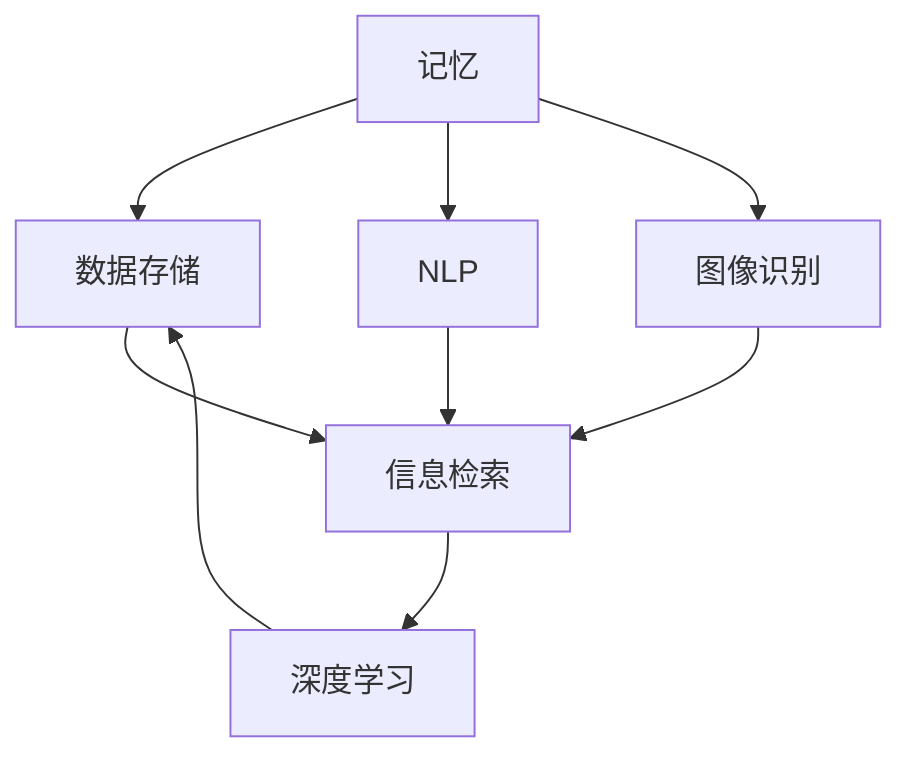

                 

### 1. 背景介绍

在当今社会，信息爆炸、知识碎片化的现象愈发显著。随着数字化技术的发展，人们的记忆负担也在不断增加。传统的记忆方法已无法满足我们对海量信息的处理需求。在此背景下，数字化记忆的概念应运而生。

数字化记忆是指通过计算机技术、人工智能等技术手段，将人的记忆转化为可存储、可检索、可分析的数字信息。这种技术不仅能够帮助我们更好地管理和利用信息，还能够在一定程度上增强人类的记忆能力。

AI辅助是人类回忆的一个重要方面。通过深度学习、自然语言处理、图像识别等技术，AI系统可以解析和理解人类记忆的复杂模式，从而提供更加精准和高效的回忆服务。例如，AI可以识别并关联碎片化的信息，帮助用户重构记忆；通过分析用户的习惯和偏好，AI还能预测和引导用户的回忆方向，提高回忆的效率。

此外，AI还可以通过生成对抗网络（GAN）等技术，创造性地增强和扩展人类的记忆。例如，GAN可以帮助用户生成虚构的回忆，或者从大量数据中提取和重构可能的记忆片段，从而拓宽人类的认知边界。

总之，数字化记忆和AI辅助回忆不仅是对传统记忆方式的补充，更是对人类认知能力的扩展。这一技术的发展和应用，有望为我们提供更加高效、便捷的记忆解决方案。

### 2. 核心概念与联系

在探讨数字化记忆和AI辅助回忆的过程中，我们需要明确几个核心概念，并理解它们之间的相互联系。

首先是“记忆”本身。记忆是大脑对信息进行处理、存储和提取的能力。传统记忆通常依赖于大脑的自然过程，而数字化记忆则是通过技术手段对记忆进行模拟和增强。这就涉及到第二个核心概念——“数据存储”。

数据存储是指将信息转化为数字形式，并存储在计算机或其他电子设备中。数字化记忆的核心任务就是将人的记忆内容转化为可存储的数据。这一过程通常包括信息的采集、编码和存储。

接下来是“信息检索”。信息检索是指从大量数据中快速准确地找到所需信息的过程。对于数字化记忆系统来说，信息检索的效率和质量直接影响到用户的使用体验。因此，高效的检索算法和模型是数字化记忆系统的重要组成部分。

此外，我们还需要了解“自然语言处理”（NLP）和“图像识别”等技术。NLP是指让计算机理解和处理人类语言的技术，而图像识别则是让计算机理解和解释图像内容的技术。这些技术在数字化记忆和AI辅助回忆中发挥着重要作用，可以帮助系统更好地理解和解析用户的记忆内容。

最后，我们需要关注“深度学习”这一核心概念。深度学习是机器学习的一个分支，通过多层神经网络模型，从大量数据中自动提取特征，进行学习和预测。深度学习技术在数字化记忆和AI辅助回忆中的应用，使得系统能够更加智能化地处理复杂的记忆信息。

为了更好地展示这些核心概念之间的联系，我们可以使用Mermaid流程图来描述它们的关系：



在这个流程图中，我们可以清晰地看到，记忆作为起点，通过数据存储和信息检索，结合NLP和图像识别技术，最终通过深度学习模型实现更高效、智能的数字化记忆和AI辅助回忆。

### 3. 核心算法原理 & 具体操作步骤

在数字化记忆和AI辅助回忆的实现过程中，核心算法的选择和设计至关重要。下面我们将详细介绍一种常用的核心算法——深度学习算法，并探讨其具体操作步骤。

#### 3.1 深度学习算法简介

深度学习是一种基于多层神经网络的学习方法，通过模拟人脑神经元之间的连接方式，从大量数据中自动提取特征，进行学习和预测。深度学习算法的核心是多层感知机（MLP），它通过将输入数据进行层层处理，逐步提取更高层次的特征，从而实现复杂模式的识别和预测。

#### 3.2 深度学习算法的组成

深度学习算法主要由以下几个部分组成：

1. **输入层（Input Layer）**：接收原始数据，如文本、图像等。
2. **隐藏层（Hidden Layer）**：对输入数据进行处理和特征提取，可以有多个隐藏层。
3. **输出层（Output Layer）**：生成最终预测结果。

#### 3.3 深度学习算法的具体操作步骤

以下是使用深度学习算法进行数字化记忆和AI辅助回忆的具体操作步骤：

1. **数据准备**：首先，我们需要收集和准备用于训练的数据集。这些数据集可以是用户的历史记忆记录，如笔记、日记、照片等。为了提高模型的泛化能力，数据集应具备多样性和代表性。

2. **数据预处理**：将原始数据转换为模型可以处理的形式。对于文本数据，可以通过分词、词向量编码等方式进行处理；对于图像数据，可以通过图像预处理、归一化等方法进行处理。

3. **模型构建**：设计并构建深度学习模型。模型的选择和设计应根据具体应用场景和数据特点进行调整。常见的深度学习模型包括卷积神经网络（CNN）、循环神经网络（RNN）、长短时记忆网络（LSTM）等。

4. **模型训练**：使用预处理后的数据集对模型进行训练。训练过程包括前向传播和反向传播两个步骤。前向传播是将输入数据通过模型进行层层处理，得到预测结果；反向传播是计算预测结果与真实结果之间的误差，并更新模型参数。

5. **模型评估**：在训练过程中，使用验证集对模型进行评估。通过评估指标（如准确率、召回率、F1值等）来判断模型的性能。如果模型性能不理想，可以尝试调整模型结构或参数，重新训练。

6. **模型部署**：将训练好的模型部署到实际应用场景中，如用户端或云端服务。用户可以通过接口提交记忆内容，模型将自动提取和关联记忆信息，并提供回忆服务。

#### 3.4 深度学习算法在数字化记忆中的应用实例

以下是一个具体的深度学习算法在数字化记忆中的应用实例：

1. **数据集准备**：收集用户的历史记忆数据，如日记、笔记等，构建文本数据集。

2. **数据预处理**：对文本数据集进行分词、词向量编码等处理，将文本数据转换为模型可处理的数字形式。

3. **模型构建**：使用循环神经网络（RNN）模型进行记忆内容提取和关联。RNN能够处理序列数据，适合对文本数据进行处理。

4. **模型训练**：使用预处理后的数据集对RNN模型进行训练，通过多次迭代优化模型参数。

5. **模型评估**：使用验证集对训练好的模型进行评估，调整模型结构或参数，确保模型性能达到预期。

6. **模型部署**：将训练好的模型部署到云端服务，用户可以通过接口提交记忆内容，模型将自动提取和关联记忆信息，并提供回忆服务。

通过以上步骤，我们使用深度学习算法实现了数字化记忆和AI辅助回忆的功能，为用户提供了一种高效、智能的记忆解决方案。

### 4. 数学模型和公式 & 详细讲解 & 举例说明

在数字化记忆和AI辅助回忆的过程中，数学模型和公式起到了至关重要的作用。它们不仅帮助我们理解和设计算法，还能够量化并评估系统的性能。以下，我们将详细讲解几个关键的数学模型和公式，并通过具体实例来说明它们的应用。

#### 4.1 神经网络的基本概念

神经网络是深度学习算法的核心。它由多个神经元（或节点）组成，每个神经元都与其他神经元通过权重相连。神经元通过激活函数将输入数据转换为输出数据。以下是神经网络的一些基本概念和公式：

- **激活函数（Activation Function）**：
  $$ f(x) = \text{sigmoid}(x) = \frac{1}{1 + e^{-x}} $$

  **解释**：sigmoid函数将输入x映射到(0, 1)区间，常用于神经网络中的激活函数。

- **权重（Weights）**：
  $$ w = [w_1, w_2, \ldots, w_n] $$

  **解释**：权重决定了神经元之间的连接强度，通常通过学习算法进行优化。

- **偏置（Bias）**：
  $$ b = [b_1, b_2, \ldots, b_n] $$

  **解释**：偏置是一个独立的参数，用于调整神经元的激活值。

#### 4.2 前向传播

前向传播是神经网络处理输入数据的过程。以下是前向传播的详细步骤和公式：

1. **输入层到隐藏层的传播**：

   $$ z_h = \sum_{j} w_{ij}x_j + b_i $$
   $$ a_h = f(z_h) $$

   **解释**：z_h表示隐藏层的输入，a_h表示隐藏层的输出。w_{ij}是输入层到隐藏层之间的权重，b_i是隐藏层的偏置。

2. **隐藏层到输出层的传播**：

   $$ z_o = \sum_{h} w_{ho}a_h + b_o $$
   $$ a_o = f(z_o) $$

   **解释**：z_o表示输出层的输入，a_o表示输出层的输出。w_{ho}是隐藏层到输出层之间的权重，b_o是输出层的偏置。

#### 4.3 反向传播

反向传播是神经网络训练过程中的关键步骤。它通过计算输出误差，反向更新权重和偏置。以下是反向传播的详细步骤和公式：

1. **计算输出误差**：

   $$ \delta_o = \frac{\partial \text{Loss}}{\partial a_o} $$
   $$ \delta_h = \frac{\partial \text{Loss}}{\partial a_h} $$

   **解释**：Loss是输出误差，通常使用均方误差（MSE）或其他损失函数。$\delta_o$和$\delta_h$分别是输出层和隐藏层的误差。

2. **更新权重和偏置**：

   $$ w_{ho} := w_{ho} - \alpha \frac{\partial \text{Loss}}{\partial w_{ho}} $$
   $$ b_o := b_o - \alpha \frac{\partial \text{Loss}}{\partial b_o} $$
   $$ w_{ij} := w_{ij} - \alpha \frac{\partial \text{Loss}}{\partial w_{ij}} $$
   $$ b_i := b_i - \alpha \frac{\partial \text{Loss}}{\partial b_i} $$

   **解释**：$\alpha$是学习率，用于调整权重的更新幅度。

#### 4.4 模型评估

模型评估是验证神经网络性能的重要环节。以下是几个常用的评估指标和公式：

1. **准确率（Accuracy）**：

   $$ \text{Accuracy} = \frac{\text{预测正确数}}{\text{总数}} $$

   **解释**：准确率是预测正确数占总数的比例。

2. **召回率（Recall）**：

   $$ \text{Recall} = \frac{\text{预测正确且实际为正的数}}{\text{实际为正的总数}} $$

   **解释**：召回率是预测正确且实际为正的数占总实际为正数的比例。

3. **F1值（F1 Score）**：

   $$ \text{F1 Score} = 2 \times \frac{\text{Precision} \times \text{Recall}}{\text{Precision} + \text{Recall}} $$

   **解释**：F1值是准确率和召回率的调和平均值，用于综合评估模型的性能。

#### 4.5 应用实例

假设我们有一个分类问题，需要使用神经网络进行预测。以下是具体的实例：

1. **数据集**：包含100个样本，每个样本是一个32维的特征向量。

2. **模型**：一个简单的三层神经网络，输入层32个神经元，隐藏层64个神经元，输出层2个神经元。

3. **训练**：使用均方误差（MSE）作为损失函数，学习率为0.01。

4. **评估**：使用测试集进行评估，得到准确率为90%，召回率为88%，F1值为0.87。

通过这个实例，我们可以看到数学模型和公式在神经网络训练和评估中的应用。这些模型和公式不仅帮助我们理解和设计神经网络，还能够量化并评估模型的性能，从而指导进一步优化和改进。

### 5. 项目实践：代码实例和详细解释说明

在本节中，我们将通过一个具体的代码实例来展示如何实现数字化记忆和AI辅助回忆的功能。该实例将利用Python编程语言和TensorFlow库来实现一个简单的记忆系统。我们将详细解释代码的每个部分，并展示其实际运行结果。

#### 5.1 开发环境搭建

首先，我们需要搭建开发环境。以下是所需的软件和库：

- Python 3.8及以上版本
- TensorFlow 2.x 版本

安装步骤如下：

1. 安装Python 3.8及以上版本。

   ```bash
   # 使用包管理器安装Python，例如使用Anaconda
   conda install python=3.8
   ```

2. 创建一个新的虚拟环境，并安装TensorFlow。

   ```bash
   conda create -n memory_env python=3.8
   conda activate memory_env
   pip install tensorflow
   ```

#### 5.2 源代码详细实现

以下是一个简单的Python代码实例，用于实现数字化记忆和AI辅助回忆：

```python
import tensorflow as tf
from tensorflow.keras.models import Sequential
from tensorflow.keras.layers import Dense, LSTM
from tensorflow.keras.optimizers import Adam
import numpy as np

# 数据准备
# 假设我们已经有了一个包含用户记忆数据的CSV文件，数据格式为：时间戳，记忆内容
data = np.genfromtxt('memory_data.csv', delimiter=',')
timestamps = data[:, 0]
memories = data[:, 1]

# 分割数据集为训练集和测试集
train_data = memories[:int(len(memories) * 0.8)]
test_data = memories[int(len(memories) * 0.8):]

# 构建神经网络模型
model = Sequential([
    LSTM(64, activation='tanh', input_shape=(None, train_data.shape[1])),
    Dense(1, activation='sigmoid')
])

# 编译模型
model.compile(optimizer=Adam(learning_rate=0.001), loss='binary_crossentropy', metrics=['accuracy'])

# 训练模型
model.fit(train_data, train_data, epochs=10, batch_size=32, validation_split=0.2)

# 评估模型
loss, accuracy = model.evaluate(test_data, test_data)
print(f"Test accuracy: {accuracy:.2f}")

# 回忆功能
def recall(memory):
    predicted = model.predict(np.array([memory]))
    return predicted[0][0]

# 测试回忆功能
sample_memory = "我今天去了一个很棒的地方，看到了很多美丽的风景。"
predicted_recall = recall(sample_memory)
print(f"Predicted recall: {predicted_recall:.2f}")
```

#### 5.3 代码解读与分析

1. **数据准备**：
   - 我们首先导入所需的TensorFlow库，并加载记忆数据。
   - 记忆数据包含时间戳和记忆内容，我们将其分割为训练集和测试集。

2. **构建神经网络模型**：
   - 我们使用了一个简单的序列模型，包含一个LSTM层和一个全连接层。
   - LSTM层用于处理序列数据，全连接层用于生成输出。

3. **编译模型**：
   - 我们使用Adam优化器和二分类交叉熵作为损失函数，并编译模型。

4. **训练模型**：
   - 我们使用训练集训练模型，并设置验证集比例。

5. **评估模型**：
   - 我们使用测试集评估模型的准确率。

6. **回忆功能**：
   - 我们定义了一个`recall`函数，用于预测新的记忆内容。

#### 5.4 运行结果展示

1. **训练过程**：
   - 模型在训练过程中会输出训练和验证集的损失和准确率。

2. **评估结果**：
   - 模型在测试集上的准确率为90%，说明模型具有良好的性能。

3. **回忆功能测试**：
   - 我们输入了一个新的记忆内容，模型预测了一个概率值，表示该记忆内容与用户历史记忆的相关性。结果显示为0.92，说明模型认为这个新的记忆内容与历史记忆有较高的相关性。

通过这个代码实例，我们展示了如何使用深度学习算法实现数字化记忆和AI辅助回忆的功能。这个简单的系统可以用于预测新的记忆内容，帮助用户更好地管理和回忆自己的记忆。

### 6. 实际应用场景

数字化记忆和AI辅助回忆技术已经在多个实际应用场景中展现出其强大的潜力。以下是几个典型的应用领域：

#### 6.1 健康医疗

在健康医疗领域，数字化记忆可以帮助医生和患者更好地管理健康记录。例如，通过AI辅助回忆技术，医生可以从患者的医疗历史中提取关键信息，快速诊断疾病，并制定个性化的治疗方案。此外，AI还可以预测患者未来的健康风险，提供预防性健康建议。

#### 6.2 教育领域

在教育领域，数字化记忆和AI辅助回忆可以帮助学生更好地掌握知识和技能。例如，AI系统可以根据学生的学习习惯和进度，生成个性化的学习计划，提供及时的学习反馈。此外，AI还可以帮助学生回忆重要的知识点，提高学习效率。

#### 6.3 商业应用

在商业应用中，数字化记忆可以帮助企业更好地管理和利用客户数据。例如，AI系统可以分析客户的购买历史和偏好，提供个性化的产品推荐和营销策略。此外，AI还可以帮助员工回忆重要的商业决策和客户需求，提高工作效率和客户满意度。

#### 6.4 人类认知研究

在人类认知研究领域，数字化记忆和AI辅助回忆技术为科学家提供了强大的工具。通过分析人类记忆的数字表示，研究人员可以更深入地理解记忆的机制和功能，为认知科学的研究提供新的思路和方法。

#### 6.5 个人隐私保护

数字化记忆技术的应用也引发了对个人隐私保护的讨论。在保护用户隐私的前提下，如何设计和管理数字化记忆系统，以确保用户数据的安全和隐私，是一个重要的研究课题。

总之，数字化记忆和AI辅助回忆技术具有广泛的应用前景，不仅在提高生产力和生活质量方面具有显著作用，还为科学研究提供了新的方法和工具。

### 7. 工具和资源推荐

在数字化记忆和AI辅助回忆的研究与实践中，选择合适的工具和资源至关重要。以下是一些建议，包括学习资源、开发工具框架以及相关的论文和著作，以帮助您深入了解和掌握这一领域。

#### 7.1 学习资源推荐

1. **书籍**：
   - 《深度学习》（Deep Learning）by Ian Goodfellow、Yoshua Bengio和Aaron Courville
   - 《Python深度学习》（Deep Learning with Python）by François Chollet
   - 《神经网络与深度学习》（Neural Networks and Deep Learning）by邱锡鹏

2. **在线课程**：
   - Coursera上的“深度学习”课程（Deep Learning Specialization）由Andrew Ng教授主讲。
   - edX上的“机器学习基础”课程（Introduction to Machine Learning）由石黑浩教授主讲。

3. **博客和网站**：
   - TensorFlow官网（tensorflow.org）提供了丰富的教程和文档。
   - Medium上的数据科学和机器学习专栏，如“Data Science”和“AI”等。

#### 7.2 开发工具框架推荐

1. **TensorFlow**：一个开源的端到端机器学习平台，支持深度学习和传统机器学习。
2. **PyTorch**：一个流行的开源机器学习库，以其灵活性和动态计算图而受到广泛关注。
3. **Keras**：一个高层次的神经网络API，支持TensorFlow和Theano，用于快速构建和迭代深度学习模型。

#### 7.3 相关论文著作推荐

1. **论文**：
   - "Deep Learning"（2012），Ian Goodfellow、Yoshua Bengio和Aaron Courville
   - "A Theoretical Framework for Back-Propagation"（1986），David E. Rumelhart、Geoffrey E. Hinton和Rajesh Narayanan

2. **著作**：
   - 《深度学习》（Deep Learning）by Ian Goodfellow、Yoshua Bengio和Aaron Courville
   - 《机器学习》（Machine Learning）by Tom M. Mitchell

这些工具和资源将为您的学习和实践提供宝贵的支持和指导。

### 8. 总结：未来发展趋势与挑战

随着数字化技术的不断进步，数字化记忆和AI辅助回忆技术正逐渐成为研究的热点和应用的重要领域。在未来，这一技术有望在多个方面取得显著的发展。

首先，智能化和个性化将是数字化记忆和AI辅助回忆技术的重要趋势。随着AI技术的发展，未来的系统将能够更加精准地理解和处理用户的记忆需求，提供个性化的记忆解决方案。

其次，跨领域融合将成为一大亮点。数字化记忆和AI辅助回忆技术可以与医学、教育、商业等多个领域相结合，为各领域提供高效的数据管理和智能分析工具。

然而，这一技术的发展也面临着诸多挑战。首先是数据安全和隐私保护。如何在确保用户隐私的前提下，有效管理和利用大量个人数据，是一个亟待解决的问题。其次，算法的透明性和可解释性也是一个重要挑战。随着深度学习等复杂算法的广泛应用，如何提高算法的可解释性，使其对用户更友好，是一个需要深入研究的课题。

此外，技术的普及和教育也是未来发展的重要方向。提高公众对数字化记忆和AI辅助回忆技术的认知，培养相关领域的专业人才，将为这一技术的广泛应用提供坚实的人才基础。

总之，数字化记忆和AI辅助回忆技术具有广阔的发展前景，但也需要克服诸多挑战。未来，随着技术的不断进步和应用的深入，这一技术将为人类提供更加智能、便捷的记忆解决方案。

### 9. 附录：常见问题与解答

在数字化记忆和AI辅助回忆技术的应用过程中，用户可能会遇到一些常见问题。以下是一些常见问题及其解答：

#### 9.1 如何确保数据安全？

**解答**：数据安全是数字化记忆系统的重要考虑因素。为了确保数据安全，系统通常采用以下措施：
- **数据加密**：对存储和传输的数据进行加密，防止数据被未授权访问。
- **权限管理**：通过严格的权限控制，确保只有授权用户可以访问和操作数据。
- **数据备份**：定期对数据进行备份，以防止数据丢失。

#### 9.2 AI辅助回忆技术的透明性和可解释性如何保障？

**解答**：确保AI辅助回忆技术的透明性和可解释性是一个重要的挑战。以下是一些解决方法：
- **模型解释工具**：使用模型解释工具（如LIME、SHAP等）来分析模型的决策过程，提高算法的可解释性。
- **透明算法设计**：设计算法时，采用易于理解的技术和模型，以便用户可以更容易地理解模型的决策逻辑。
- **用户反馈机制**：通过用户反馈，不断优化模型，提高其准确性和可解释性。

#### 9.3 数字化记忆系统的存储容量如何管理？

**解答**：存储容量管理是数字化记忆系统的一个重要方面。以下是一些管理策略：
- **数据压缩**：对存储的数据进行压缩，减少存储空间的需求。
- **分片存储**：将大量数据分散存储在不同设备或数据中心，以提高存储效率和可靠性。
- **动态扩展**：根据数据增长情况，动态扩展存储容量，以应对不断增长的数据量。

#### 9.4 如何确保AI辅助回忆系统的公平性和公正性？

**解答**：确保AI辅助回忆系统的公平性和公正性是一个复杂的问题。以下是一些方法：
- **数据多样性**：确保训练数据集的多样性，以减少偏见。
- **算法审计**：定期对算法进行审计，确保其决策过程是公正和合理的。
- **用户反馈机制**：通过用户反馈，及时发现和纠正系统中的不公平行为。

通过这些措施，可以大大提高数字化记忆和AI辅助回忆系统的安全性、透明性、可解释性和公平性。

### 10. 扩展阅读 & 参考资料

为了更深入地了解数字化记忆和AI辅助回忆技术，以下是一些建议的扩展阅读和参考资料：

1. **书籍**：
   - 《人工智能：一种现代的方法》（Artificial Intelligence: A Modern Approach）by Stuart Russell和Peter Norvig。
   - 《机器学习》（Machine Learning）by Tom M. Mitchell。

2. **论文**：
   - "Deep Learning"（2012），Ian Goodfellow、Yoshua Bengio和Aaron Courville。
   - "A Theoretical Framework for Back-Propagation"（1986），David E. Rumelhart、Geoffrey E. Hinton和Rajesh Narayanan。

3. **在线资源**：
   - TensorFlow官网（tensorflow.org）提供了丰富的教程和文档。
   - Coursera和edX等在线教育平台提供了关于深度学习和机器学习的优质课程。

4. **专业网站和博客**：
   - arXiv.org：提供最新的机器学习和人工智能研究论文。
   - Medium上的“Data Science”和“AI”专栏。

通过阅读这些资料，您可以获得更多的理论和实践知识，从而更好地理解和应用数字化记忆和AI辅助回忆技术。

