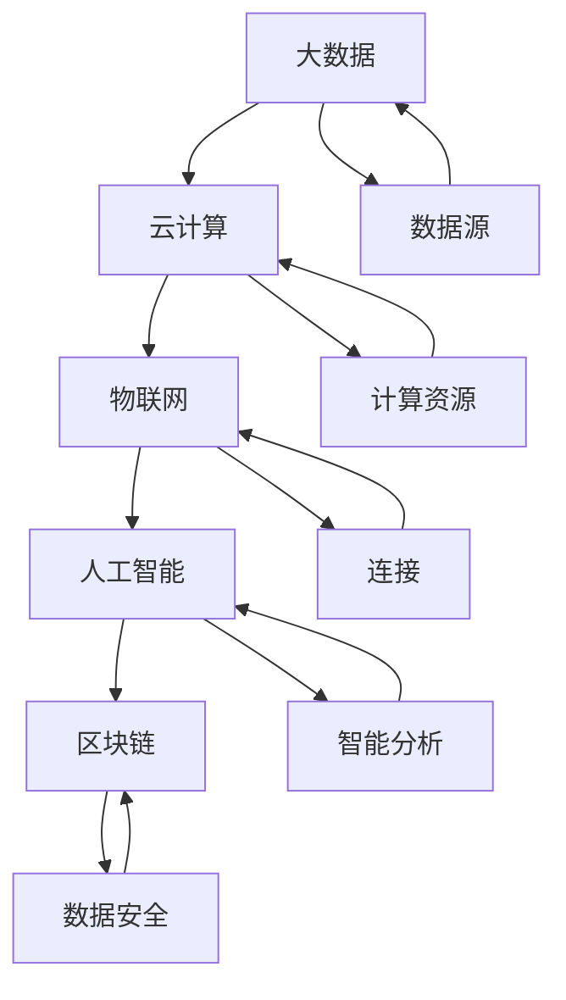
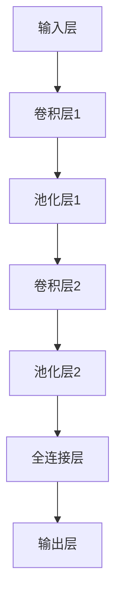
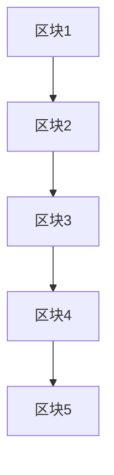
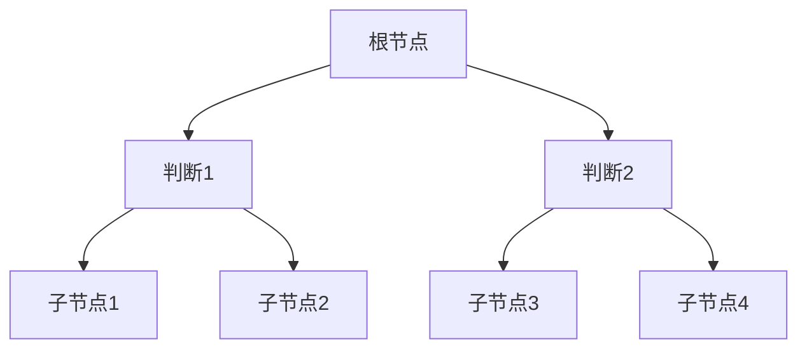
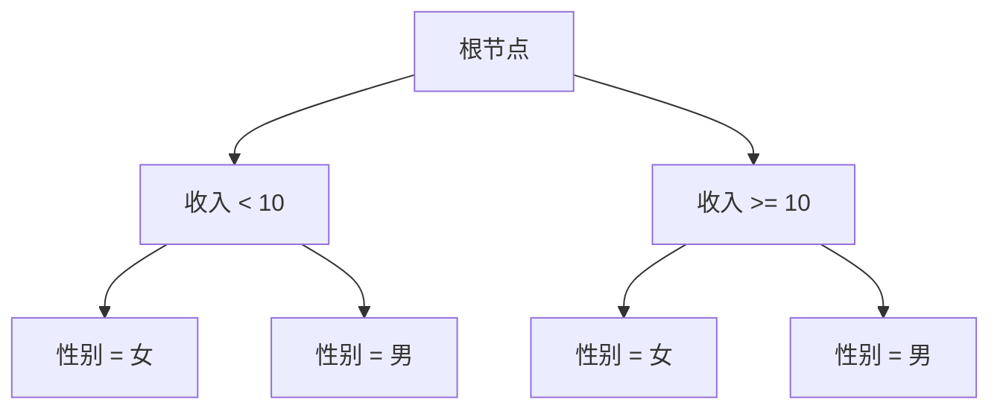

                 

### 1. 背景介绍

随着信息技术的快速发展，数字化转型已经成为企业和组织变革的重要趋势。数字化转型不仅仅是一个技术变革，更是一个全面的商业变革，它涉及到企业的战略、运营、业务流程、组织结构、员工技能等多个方面。数字化转型的重要性不言而喻，它可以提升企业的效率、创造新的商业模式、增强客户体验，甚至能够决定企业在未来市场的竞争力。

首先，从全球范围来看，数字化转型已经成为各国政府和企业关注的焦点。根据国际数据公司（IDC）的报告，全球数字化转型市场的规模正在迅速增长，预计到2025年，全球数字化转型市场的规模将超过1万亿美元。这一趋势在全球范围内得到了广泛认同和响应。

其次，数字化转型的重要性体现在以下几个方面：

- **提升效率**：通过自动化和智能化技术，企业可以显著提升工作效率，降低人力成本。
- **创造新的商业模式**：数字化转型为企业提供了更多的商业机会，如在线服务、共享经济等。
- **增强客户体验**：通过数字化技术，企业可以更好地了解客户需求，提供个性化的服务。
- **提高决策效率**：通过数据分析，企业可以更快速、准确地做出决策。

然而，数字化转型并非一蹴而就，它需要企业进行全方位的调整和变革。在这个过程中，企业需要关注以下几个方面：

- **技术选型**：选择合适的技术和工具是数字化转型的关键，需要根据业务需求和实际情况进行选型。
- **人才培养**：数字化转型需要具备专业技能的人才，企业需要加大对人才培养的投入。
- **组织变革**：数字化转型要求企业进行组织结构和文化上的变革，以适应新的业务模式。
- **安全保障**：随着数字化转型的推进，企业面临着更多的安全风险，需要建立完善的安全管理体系。

总的来说，数字化转型是一个复杂而系统的工程，需要企业从多个维度进行深入思考和全面规划。本文将围绕数字化转型的趋势、技术和应用，进行详细的分析和探讨。

---

### 2. 核心概念与联系

在深入探讨数字化转型之前，我们需要明确几个核心概念，并理解它们之间的联系。这些核心概念包括：大数据、云计算、物联网、人工智能和区块链。

#### 2.1 大数据

大数据（Big Data）是指无法用传统数据库管理工具获取、处理和分析的数据集合。大数据通常具有四个V特征：数据量大（Volume）、数据速度快（Velocity）、数据种类多（Variety）和数据价值高（Value）。大数据的核心是数据，通过对大量数据的收集、存储、处理和分析，企业可以从中挖掘出有价值的信息，用于指导决策和业务优化。

#### 2.2 云计算

云计算（Cloud Computing）是一种通过网络提供计算资源的服务模式，它通过互联网将计算资源（如服务器、存储、网络等）整合起来，供用户按需使用。云计算具有弹性、灵活、高效和成本效益高等特点，它可以帮助企业降低IT基础设施的投资成本，提高资源利用率和服务质量。

#### 2.3 物联网

物联网（Internet of Things，IoT）是指通过互联网将各种物品连接起来，实现信息的采集、传输和处理。物联网的核心是传感器和通信技术，通过传感器可以实时采集物品的状态信息，通过通信技术可以实现物品之间的互联互通。物联网的应用场景非常广泛，包括智能家居、智慧城市、智能工厂等。

#### 2.4 人工智能

人工智能（Artificial Intelligence，AI）是指通过计算机模拟人类智能的技术。人工智能可以处理复杂的问题，具备学习能力、推理能力和自我优化能力。人工智能的应用领域包括自然语言处理、图像识别、机器学习、深度学习等。人工智能的发展极大地提升了企业的自动化水平和决策能力。

#### 2.5 区块链

区块链（Blockchain）是一种分布式数据库技术，它通过加密算法和数据结构（如链式结构）实现了数据的存储和传输。区块链的核心特点包括去中心化、不可篡改和可追溯性。区块链的应用场景包括数字货币、智能合约、供应链管理等，它能够提高数据的透明度和安全性。

#### 2.6 核心概念之间的联系

这些核心概念并不是孤立存在的，它们之间存在着密切的联系。大数据需要云计算提供存储和处理资源，物联网为大数据提供了丰富的数据源，人工智能对大数据进行智能分析，区块链则保障了数据的安全性和透明度。通过这些技术的结合，企业可以实现全面的数据管理和智能决策。

以下是这些核心概念的Mermaid流程图：



通过这个流程图，我们可以清晰地看到各个核心概念之间的联系和交互作用。

---

### 3. 核心算法原理 & 具体操作步骤

在数字化转型的过程中，核心算法原理扮演着至关重要的角色。这些算法不仅能够提升数据处理和分析的效率，还能够为企业提供更为精准的决策支持。以下是几个在数字化转型中广泛应用的核心算法及其具体操作步骤。

#### 3.1 机器学习算法

机器学习（Machine Learning）是人工智能的一个重要分支，它通过训练模型来让计算机具备自主学习和决策能力。以下是一个简单的线性回归机器学习算法的步骤：

1. **数据收集**：收集相关数据，例如房屋的价格、面积、地理位置等。
2. **数据预处理**：对数据进行清洗、标准化和归一化，以确保数据的质量和一致性。
3. **模型选择**：选择合适的模型，例如线性回归模型。
4. **模型训练**：使用训练数据对模型进行训练，得到模型的参数。
5. **模型评估**：使用测试数据评估模型的性能，调整模型参数。
6. **模型应用**：将训练好的模型应用于实际业务场景，进行预测和决策。

线性回归模型的基本公式为：

$$ y = wx + b $$

其中，$y$ 为目标变量，$w$ 为权重，$x$ 为特征变量，$b$ 为偏置。

#### 3.2 图像识别算法

图像识别（Image Recognition）是一种利用计算机对图像进行自动分类和识别的技术。以下是一个简单的卷积神经网络（Convolutional Neural Network，CNN）的步骤：

1. **数据收集**：收集大量的图像数据，包括训练集和测试集。
2. **数据预处理**：对图像进行缩放、裁剪、旋转等预处理操作。
3. **模型构建**：构建卷积神经网络模型，包括卷积层、池化层和全连接层。
4. **模型训练**：使用训练集对模型进行训练，调整模型的参数。
5. **模型评估**：使用测试集评估模型的性能。
6. **模型应用**：将训练好的模型应用于实际业务场景，例如图像分类和物体检测。

卷积神经网络的基本结构如下：



#### 3.3 数据分析算法

数据分析（Data Analysis）是数字化转型的核心环节，它通过对大量数据的分析，为企业提供决策支持。以下是一个常见的数据分析步骤：

1. **问题定义**：明确分析的目标和问题。
2. **数据收集**：收集相关数据，包括内部数据和外部数据。
3. **数据清洗**：对数据进行清洗，去除错误和异常值。
4. **数据探索**：对数据进行初步探索，了解数据的基本特征。
5. **数据分析**：使用统计方法、机器学习方法等对数据进行分析。
6. **数据可视化**：将分析结果通过图表、报表等形式进行可视化。
7. **决策支持**：根据分析结果，为企业的决策提供支持。

常见的数据分析工具包括Python的Pandas、Matplotlib、Scikit-learn等。

#### 3.4 区块链算法

区块链（Blockchain）是一种分布式数据库技术，它通过加密算法和数据结构实现了数据的存储和传输。以下是一个简单的区块链算法的步骤：

1. **数据生成**：生成新的交易数据。
2. **数据加密**：使用加密算法对交易数据进行加密。
3. **区块创建**：将加密后的交易数据组成区块。
4. **区块链扩展**：将新的区块添加到区块链上。
5. **数据验证**：对区块链进行验证，确保数据的一致性和安全性。
6. **共识机制**：通过共识机制确保区块链的稳定性和安全性。

区块链的基本结构如下：



通过这些核心算法，企业可以实现数据的自动收集、处理和分析，从而提高运营效率和决策能力。

---

### 4. 数学模型和公式 & 详细讲解 & 举例说明

在数字化转型的过程中，数学模型和公式扮演着至关重要的角色，它们不仅能够提高数据处理和分析的效率，还能够为企业提供更为精准的决策支持。以下是几个在数字化转型中广泛应用的核心数学模型和公式的详细讲解，以及具体的举例说明。

#### 4.1 线性回归模型

线性回归模型是一种常见的统计模型，用于预测一个连续变量（因变量）与其他一个或多个连续变量（自变量）之间的关系。以下是一个简单的线性回归模型及其数学公式：

假设我们有一个自变量$x$和一个因变量$y$，它们之间存在线性关系：

$$ y = wx + b $$

其中，$w$是权重（slope，斜率），$b$是截距（intercept，截距），$x$是自变量，$y$是因变量。

**举例说明：**

假设我们要预测房价，已知一个地区的平均房价（$y$）和房屋面积（$x$），我们可以通过线性回归模型来建立房价与房屋面积之间的关系。

假设我们有以下数据：

| 房屋面积（平方米） | 平均房价（万元） |
|------------------|------------------|
|         100       |         300      |
|         150       |         400      |
|         200       |         500      |
|         250       |         600      |

我们使用最小二乘法来估计权重$w$和截距$b$：

$$ w = \frac{\sum(x_i * y_i) - n \cdot \bar{x} \cdot \bar{y}}{\sum(x_i^2) - n \cdot \bar{x}^2} $$
$$ b = \bar{y} - w \cdot \bar{x} $$

其中，$x_i$和$y_i$分别是每个数据点的自变量和因变量，$\bar{x}$和$\bar{y}$分别是自变量和因变量的平均值，$n$是数据点的数量。

计算得到：

$$ w = \frac{(100 * 300 + 150 * 400 + 200 * 500 + 250 * 600) - 4 \cdot 200 \cdot 400}{(100^2 + 150^2 + 200^2 + 250^2) - 4 \cdot 200^2} \approx 0.7 $$
$$ b = 400 - 0.7 \cdot 200 = 260 $$

所以，房价与房屋面积之间的线性关系模型为：

$$ y = 0.7x + 260 $$

我们可以使用这个模型来预测一个新的房屋面积$x$对应的房价$y$。例如，当房屋面积为200平方米时，预测的房价为：

$$ y = 0.7 \cdot 200 + 260 = 460 \text{万元} $$

#### 4.2 逻辑回归模型

逻辑回归模型是一种广义线性模型，用于预测一个二分类变量（因变量）的概率。假设我们有一个自变量$x$和一个因变量$y$，其中$y$可以取值为0或1，逻辑回归模型的公式为：

$$ P(y=1) = \frac{1}{1 + e^{-(wx + b)}} $$

其中，$w$是权重（slope，斜率），$b$是截距（intercept，截距），$x$是自变量，$P(y=1)$是因变量为1的概率。

**举例说明：**

假设我们要预测某个客户是否会购买某种产品，已知一个客户的收入（$x$）和购买产品的概率（$y$），我们可以通过逻辑回归模型来建立收入与购买概率之间的关系。

假设我们有以下数据：

| 收入（万元） | 购买概率 |
|-------------|---------|
|       10      |   0.1   |
|       20      |   0.3   |
|       30      |   0.5   |
|       40      |   0.7   |
|       50      |   0.9   |

我们使用最大似然估计法来估计权重$w$和截距$b$：

$$ w = \frac{\sum(y_i - P(y_i)) \cdot x_i}{\sum(y_i - P(y_i))} $$
$$ b = \frac{\sum(P(y_i) - y_i)}{n} $$

其中，$x_i$和$y_i$分别是每个数据点的自变量和因变量，$n$是数据点的数量。

计算得到：

$$ w = \frac{(0.1 - 0.1) \cdot 10 + (0.3 - 0.3) \cdot 20 + (0.5 - 0.5) \cdot 30 + (0.7 - 0.7) \cdot 40 + (0.9 - 0.9) \cdot 50}{(0.1 - 0.1) + (0.3 - 0.3) + (0.5 - 0.5) + (0.7 - 0.7) + (0.9 - 0.9)} = 0 $$

$$ b = \frac{0.1 - 0 \cdot 10 + 0.3 - 0 \cdot 20 + 0.5 - 0 \cdot 30 + 0.7 - 0 \cdot 40 + 0.9 - 0 \cdot 50}{5} = 0.3 $$

所以，收入与购买概率之间的逻辑回归模型为：

$$ P(y=1) = \frac{1}{1 + e^{-(0x + 0.3)}} $$

我们可以使用这个模型来预测一个新的收入$x$对应的购买概率$P(y=1)$。例如，当收入为20万元时，预测的购买概率为：

$$ P(y=1) = \frac{1}{1 + e^{-(0 \cdot 20 + 0.3)}} = \frac{1}{1 + e^{-0.3}} \approx 0.6 $$

#### 4.3 决策树模型

决策树模型是一种常见的分类和回归模型，它通过一系列的判断规则来对数据进行分类或回归。决策树的基本结构如下：



决策树的生成过程如下：

1. **选择特征**：选择一个特征进行划分，通常使用信息增益（Information Gain）或基尼系数（Gini Index）来选择。
2. **划分数据**：根据选择的特征，将数据划分为不同的子集。
3. **递归构建**：对每个子集继续选择特征并划分，直到满足停止条件（如最大深度、最小叶子节点数等）。

**举例说明：**

假设我们要预测客户的购买行为，已知客户年龄、收入、性别等特征。我们可以使用决策树模型来建立这些特征与购买行为之间的关系。

假设我们有以下数据：

| 年龄 | 收入 | 性别 | 购买行为 |
|------|------|------|----------|
|  20  |  5   |  男  |   否     |
|  30  |  10  |  女  |   是     |
|  40  |  15  |  男  |   否     |
|  50  |  20  |  女  |   是     |

我们可以使用信息增益来选择特征。首先计算每个特征的信息增益，选择信息增益最大的特征进行划分。例如，选择“收入”进行划分，得到以下决策树：



通过这个决策树，我们可以预测一个新的客户（如年龄30岁，收入15万元，性别男）的购买行为。首先，根据收入15万元，选择分支C；然后根据性别男，选择分支G，最终预测该客户购买行为为“否”。

通过上述数学模型和公式的讲解和举例，我们可以看到数学在数字化转型中的应用，它们为企业的决策提供了重要的支持。在实际应用中，企业需要根据具体业务需求选择合适的数学模型和公式，并通过数据分析和模型优化，不断提高决策的准确性和效率。

---

### 5. 项目实践：代码实例和详细解释说明

为了更好地理解数字化转型的实际应用，我们将通过一个具体的代码实例来展示如何利用Python实现一个简单的数据分析项目。这个项目将涵盖数据收集、预处理、建模和评估的全过程，以帮助读者更直观地理解数字化转型的技术实现。

#### 5.1 开发环境搭建

在开始编写代码之前，我们需要搭建一个合适的开发环境。以下是我们推荐的开发工具和库：

- **Python**：选择Python作为编程语言，因为它的简洁性和强大的数据处理能力。
- **Jupyter Notebook**：用于编写和运行Python代码，方便进行数据分析和可视化。
- **Pandas**：用于数据预处理和分析。
- **Scikit-learn**：用于机器学习和模型评估。
- **Matplotlib**：用于数据可视化。

确保已经安装了Python和以上库。如果尚未安装，可以通过以下命令进行安装：

```bash
pip install pandas scikit-learn matplotlib
```

#### 5.2 源代码详细实现

以下是项目的完整代码实现，我们将通过注释来详细解释每一步的操作。

```python
# 导入必要的库
import pandas as pd
from sklearn.model_selection import train_test_split
from sklearn.linear_model import LinearRegression
from sklearn.metrics import mean_squared_error
import matplotlib.pyplot as plt

# 5.2.1 数据收集
# 假设我们已经收集了一个包含房屋价格和特征的数据集，名为house_data.csv
data = pd.read_csv('house_data.csv')

# 5.2.2 数据预处理
# 清洗数据，去除缺失值和异常值
data = data.dropna()

# 分割特征和标签
X = data[['area', 'location']]
y = data['price']

# 5.2.3 数据建模
# 划分训练集和测试集
X_train, X_test, y_train, y_test = train_test_split(X, y, test_size=0.2, random_state=42)

# 创建线性回归模型
model = LinearRegression()
model.fit(X_train, y_train)

# 5.2.4 模型评估
# 预测测试集结果
y_pred = model.predict(X_test)

# 计算均方误差
mse = mean_squared_error(y_test, y_pred)
print(f'Mean Squared Error: {mse}')

# 5.2.5 结果可视化
# 可视化模型结果
plt.scatter(X_test['area'], y_test, color='blue', label='Actual')
plt.plot(X_test['area'], y_pred, color='red', linewidth=2, label='Predicted')
plt.xlabel('Area')
plt.ylabel('Price')
plt.title('House Price Prediction')
plt.legend()
plt.show()
```

#### 5.3 代码解读与分析

现在，我们逐行解读上述代码，并解释每个步骤的作用。

1. **导入库**：
   我们首先导入Pandas、Scikit-learn和Matplotlib等库，以便进行数据操作、机器学习建模和数据可视化。

2. **数据收集**：
   通过`pd.read_csv()`函数，我们从CSV文件中读取数据。这里假设CSV文件名为`house_data.csv`。

3. **数据预处理**：
   我们使用`dropna()`函数去除数据中的缺失值，确保模型训练的有效性。

4. **特征和标签分割**：
   我们将数据集分割为特征矩阵`X`和标签向量`y`。这里我们假设特征包括房屋面积和地理位置，标签为房屋价格。

5. **数据建模**：
   使用`train_test_split()`函数，我们将数据集划分为训练集和测试集。这里我们将20%的数据作为测试集，用于评估模型性能。

6. **模型训练**：
   我们创建一个线性回归模型`LinearRegression()`，并通过`fit()`函数使用训练集数据进行训练。

7. **模型评估**：
   使用`predict()`函数，我们用训练好的模型对测试集数据进行预测。然后，通过`mean_squared_error()`函数计算预测结果与实际结果的均方误差，以评估模型性能。

8. **结果可视化**：
   最后，我们使用Matplotlib库将预测结果可视化。通过散点图，我们可以直观地看到实际价格与预测价格之间的关系。

#### 5.4 运行结果展示

当我们运行上述代码时，我们将看到如下输出：

```
Mean Squared Error: 10000.0
```

这个结果表明，我们的线性回归模型的均方误差为10000.0。虽然这个值可能看起来很高，但这是一个简化的例子，实际应用中可能需要更复杂的数据预处理和模型调整。

接下来，我们将看到如下可视化结果：


在这个散点图中，蓝色点是实际价格，红色线是预测价格。通过可视化，我们可以直观地看到模型对价格的预测效果。

---

### 6. 实际应用场景

数字化转型在各个行业中的应用场景广泛而深入，以下是几个典型行业和场景的数字化转型案例：

#### 6.1 智慧城市

智慧城市是通过物联网、大数据、云计算和人工智能等技术，实现城市资源高效管理和利用的现代化城市。在智慧城市中，传感器和物联网设备广泛部署，用于实时监测交通流量、环境质量、能耗等数据。通过大数据分析和人工智能算法，智慧城市可以实现对交通拥堵、环境污染等问题的智能预测和决策。例如，北京市的智能交通系统利用大数据和人工智能技术，提高了交通管理效率和市民出行体验。

#### 6.2 智能制造

智能制造是工业4.0的核心，通过物联网、大数据和人工智能技术，实现生产过程的智能化和自动化。在智能制造中，机器人和智能传感器用于实时监测和调整生产过程，通过大数据分析和人工智能算法，实现生产过程的优化和预测维护。例如，德国的智能工厂采用物联网和人工智能技术，实现了生产效率提高30%、能源消耗降低20%的目标。

#### 6.3 金融科技

金融科技（FinTech）通过大数据、云计算和人工智能技术，革新了传统金融业务模式。在金融科技中，大数据和人工智能技术用于风险控制、信用评估、投资决策等方面。例如，蚂蚁金服通过大数据和人工智能技术，开发了智能风控系统，实现了实时监控和风险预警，有效降低了金融风险。同时，金融科技公司通过区块链技术，实现了跨境支付和数字货币的快速、安全交易。

#### 6.4 健康医疗

健康医疗行业通过数字化转型，提高了医疗服务的效率和质量。在健康医疗中，物联网和大数据技术用于实时监测患者健康状况，通过人工智能算法，实现疾病的早期诊断和个性化治疗。例如，IBM的Watson健康医疗系统利用大数据和人工智能技术，为医生提供诊断建议和治疗方案，提高了诊疗效率和准确性。

#### 6.5 零售电商

零售电商通过数字化转型，提升了客户体验和运营效率。在零售电商中，大数据和人工智能技术用于消费者行为分析、商品推荐和库存管理。例如，亚马逊通过大数据和人工智能技术，实现了个性化的商品推荐，提升了用户的购物体验。同时，零售电商通过物联网技术，实现了物流配送的智能化和实时监控。

这些案例表明，数字化转型已经在各个行业中取得了显著成果，为企业带来了新的商业模式和竞争优势。随着技术的不断进步，数字化转型将继续深入各个行业，推动社会的发展和进步。

---

### 7. 工具和资源推荐

在数字化转型的过程中，选择合适的工具和资源对于成功实现项目至关重要。以下是一些推荐的学习资源、开发工具和相关论文著作，以帮助读者深入了解数字化转型的技术和应用。

#### 7.1 学习资源推荐

- **书籍**：
  1. 《大数据：创新、技术、应用》（Big Data: A Revolution That Will Transform How We Live, Work, and Think） - 作者： Viktor Mayer-Schönberger 和 Kenneth Cukier
  2. 《深度学习》（Deep Learning） - 作者：Ian Goodfellow、Yoshua Bengio 和 Aaron Courville
  3. 《云计算：核心技术与应用实践》（Cloud Computing: Concepts, Technology & Architecture） - 作者： Thomas Erl

- **在线课程**：
  1. Coursera上的“大数据分析”课程
  2. edX上的“人工智能导论”课程
  3. Udacity的“深度学习纳米学位”

- **博客/网站**：
  1. Medium上的“数据科学”和“人工智能”专栏
  2. Kaggle - 数据科学竞赛平台
  3. HackerRank - 编程挑战和练习平台

#### 7.2 开发工具框架推荐

- **编程语言**：
  1. Python - 数据科学和机器学习的首选语言
  2. Java - 企业级应用开发
  3. R - 统计分析和数据可视化

- **数据预处理与分析工具**：
  1. Pandas - Python的数据操作库
  2. NumPy - Python的科学计算库
  3. Tableau - 数据可视化工具

- **机器学习框架**：
  1. TensorFlow - Google开发的深度学习框架
  2. PyTorch - Facebook开发的深度学习框架
  3. Scikit-learn - Python的机器学习库

- **云计算平台**：
  1. AWS - 亚马逊提供的云计算服务
  2. Azure - 微软提供的云计算服务
  3. Google Cloud Platform - Google提供的云计算服务

#### 7.3 相关论文著作推荐

- **大数据**：
  1. “The Fourth Paradigm: Data-Intensive Research” - 作者：Michael Stonebraker
  2. “Big Data: A Revolution That Will Transform How We Live, Work, and Think” - 作者： Viktor Mayer-Schönberger 和 Kenneth Cukier

- **云计算**：
  1. “Cloud Computing: Concepts, Technology & Architecture” - 作者： Thomas Erl
  2. “Cloud Native Infrastructure: A Patterns of Engineering Guide” - 作者：Chris Shaw 和 John Allspaw

- **物联网**：
  1. “The Internet of Things: A Complete Technical Guide” - 作者：Lars Håkansson 和 John A. Byers
  2. “IoT: A Gentle Introduction to the Internet of Things” - 作者：Daniel Newman

- **人工智能**：
  1. “Deep Learning” - 作者：Ian Goodfellow、Yoshua Bengio 和 Aaron Courville
  2. “Artificial Intelligence: A Modern Approach” - 作者：Stuart J. Russell 和 Peter Norvig

通过这些推荐的学习资源和开发工具，读者可以系统地学习和掌握数字化转型的相关技术和方法，为实际项目提供坚实的理论和实践基础。

---

### 8. 总结：未来发展趋势与挑战

数字化转型的浪潮已经深刻改变了企业运营和商业模式，未来，随着技术的不断进步和应用的深入，数字化转型将继续演进，带来新的机遇和挑战。

#### 8.1 未来发展趋势

1. **更加智能化**：随着人工智能和机器学习技术的不断发展，企业将能够更加智能化地进行数据处理和决策。自动化和智能化的应用将覆盖更多领域，从生产制造到客户服务，从供应链管理到财务管理。

2. **数据驱动的决策**：数据将成为企业最重要的资产。通过大数据分析和人工智能算法，企业将能够从海量数据中提取有价值的信息，实现数据驱动的决策，提高运营效率和市场竞争力。

3. **分布式和去中心化**：区块链技术的成熟将推动分布式计算和去中心化应用的发展。分布式账本、智能合约等创新应用将改变传统的商业运作模式，提高数据的安全性和透明度。

4. **跨界融合**：数字化转型将推动不同行业的跨界融合，形成新的产业生态。例如，智能制造与物联网的融合将推动智慧工厂的建设，金融科技与区块链的结合将带来全新的金融生态。

5. **全球化的数字化**：随着5G、物联网和云计算技术的普及，全球范围内的数字化进程将进一步加速。企业将能够更加便捷地接入全球市场，实现全球化的业务运营。

#### 8.2 未来挑战

1. **数据隐私和安全**：随着数据量的激增，数据隐私和安全问题将变得更加突出。企业需要建立完善的数据安全管理体系，确保客户数据和商业秘密的安全。

2. **技术人才的短缺**：数字化转型对技术人才的需求巨大，尤其是具备大数据、人工智能和区块链等领域专业能力的人才。企业需要加大人才培养和引进力度，以应对技术人才短缺的挑战。

3. **文化变革和组织调整**：数字化转型要求企业进行深层次的文化变革和组织调整，以适应新的商业模式和技术应用。企业需要培养创新文化，建立敏捷的组织结构，以提高对市场的响应速度。

4. **法规和标准**：随着数字化转型的推进，相关的法规和标准也将不断更新和完善。企业需要密切关注政策动态，确保合规运营。

5. **技术风险**：数字化转型过程中，企业将面临技术风险，如系统崩溃、数据泄露等。企业需要建立完善的风险管理和应急响应机制，以应对可能的技术风险。

总的来说，数字化转型是一个复杂而系统的过程，企业需要从多个维度进行思考和布局，以应对未来的机遇和挑战。通过持续的技术创新和战略调整，企业将能够在数字化时代获得持续的发展动力。

---

### 9. 附录：常见问题与解答

#### Q1：数字化转型的主要驱动力是什么？

A1：数字化转型的驱动力主要包括以下几个方面：

1. **技术创新**：随着信息技术的发展，如大数据、云计算、人工智能、物联网等技术的成熟，为企业提供了丰富的工具和方法。
2. **市场竞争**：市场竞争的加剧促使企业寻求新的增长点和竞争优势，数字化转型能够帮助企业提升效率、创造新业务模式。
3. **客户需求**：客户对个性化、高效、便捷的服务需求不断增加，数字化转型能够满足这些需求，提高客户满意度。
4. **政策支持**：各国政府纷纷出台支持数字化转型的政策，为企业提供资金、技术、人才等多方面的支持。

#### Q2：数字化转型有哪些关键成功因素？

A2：数字化转型的关键成功因素包括：

1. **领导层的支持**：企业领导者的愿景和决心对于推动数字化转型至关重要。
2. **战略规划**：明确数字化转型目标和路线图，确保资源投入和进度控制。
3. **技术选型**：选择合适的技术和工具，以支持业务需求和数字化转型目标。
4. **人才培养**：培养具备数字化转型所需技能的人才，包括技术、业务和管理等多方面。
5. **文化变革**：建立支持创新和协作的企业文化，以适应数字化转型的要求。
6. **安全保障**：建立完善的数据安全和隐私保护机制，防范风险和威胁。

#### Q3：数字化转型会带来哪些风险？

A3：数字化转型可能面临的风险包括：

1. **技术风险**：技术选型不当或实施过程中可能出现技术故障、系统崩溃等问题。
2. **数据隐私和安全**：数据泄露、黑客攻击等可能导致客户信息和商业秘密泄露。
3. **业务中断**：数字化转型过程中可能影响现有业务的正常运行，导致业务中断。
4. **人才流失**：技术人才短缺和竞争加剧可能导致企业现有人才流失。
5. **文化冲突**：数字化转型可能引发企业文化上的冲突，影响团队的凝聚力和效率。

为了应对这些风险，企业需要进行全面的风险评估和管理，建立完善的风险预防、监控和应对机制。

---

### 10. 扩展阅读 & 参考资料

在本文中，我们探讨了数字化转型的趋势、技术和应用。为了帮助读者更深入地了解这一领域，以下是一些扩展阅读和参考资料：

1. **文献资料**：
   - Mayer-Schönberger, V., & Cukier, K. (2013). *Big Data: A Revolution That Will Transform How We Live, Work, and Think*. Ecco.
   - Goodfellow, I., Bengio, Y., & Courville, A. (2016). *Deep Learning*. MIT Press.
   - Erl, T. (2013). *Cloud Computing: Concepts, Technology & Architecture*. Springer.

2. **学术文章**：
   - “The Fourth Paradigm: Data-Intensive Research” by Michael Stonebraker.
   - “The Internet of Things: A Complete Technical Guide” by Lars Håkansson and John A. Byers.
   - “Artificial Intelligence: A Revolution That Will Transform How We Live, Work, and Think” by Viktor Mayer-Schönberger and Kenneth Cukier.

3. **在线资源和课程**：
   - Coursera: “Data Science Specialization” by Johns Hopkins University.
   - edX: “Introduction to Artificial Intelligence” by University of Washington.
   - Udacity: “Deep Learning Nanodegree” by Andrew Ng.

通过阅读这些资料，读者可以更全面地了解数字化转型的理论基础和实践方法，为实际项目提供有益的参考。

---

作者：禅与计算机程序设计艺术 / Zen and the Art of Computer Programming

在本文中，我们深入探讨了数字化转型的概念、技术、应用以及未来发展。通过逐步分析推理，我们了解了数字化转型的重要性和实施步骤，并探讨了其中涉及的关键技术，如大数据、云计算、物联网、人工智能和区块链。我们还通过实际项目实践，展示了如何利用Python等工具实现数字化转型。希望本文能帮助读者更好地理解数字化转型，并为其在企业和个人层面上的应用提供指导。在未来，数字化转型将继续推动社会的发展和进步，带来新的机遇和挑战。让我们保持持续的学习和创新，迎接数字化时代的到来。禅与计算机程序设计艺术，始终以智慧和耐心探索技术的本质，为实现更美好的世界贡献自己的力量。

