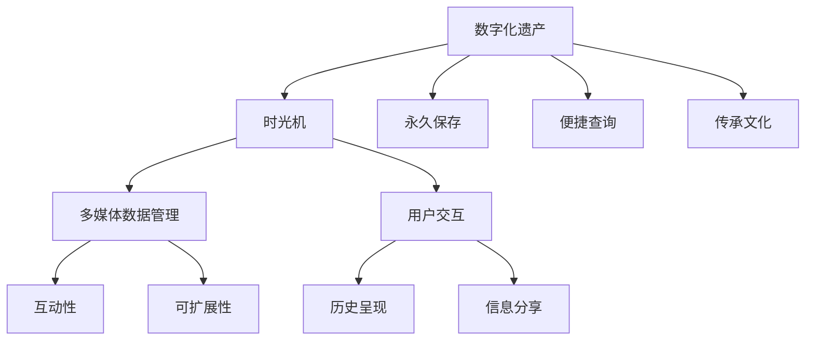

                 

### 背景介绍

在现代社会，数字化技术的发展正以前所未有的速度改变着我们的生活方式。从日常通讯到数据分析，数字化技术已经在各个领域取得了显著的成果。然而，在数字化的浪潮中，一个被逐渐忽视却极其宝贵的领域便是家族历史。家族历史不仅是家庭文化传承的重要组成部分，更是民族和国家文化底蕴的基石。

随着时光的流逝，许多家族的珍贵记忆和故事正逐渐消失在历史的长河中。传统纸质档案和口述历史虽能保存部分信息，但它们面临着保存难度大、信息量有限、易失真等问题。数字化遗产时光机这一概念正是在这样的背景下应运而生，它旨在通过数字化技术，全面、精确地记录和呈现家族历史，使之成为可以永久保存并随时查阅的数字遗产。

数字化遗产时光机的核心目标是将家族历史以数字化的形式保存下来，包括照片、视频、音频、文档等多种形式的资料。通过这样的方式，不仅可以实现信息的长期保存，还可以实现信息的便捷查询和分享，从而让家族成员在任何时间和地点都能够了解和传承家族的历史与文化。

此外，数字化遗产时光机还具有高度的互动性和可扩展性。用户可以通过该平台创建个性化的家族故事线，添加注释、标签和分类，使得信息更加丰富和有条理。同时，随着技术的不断发展，用户还可以通过虚拟现实（VR）和增强现实（AR）技术，更直观地体验和探索家族历史。

本文将围绕数字化遗产时光机这一主题，逐步分析其核心概念、技术实现、应用场景、开发工具和未来发展趋势，旨在为读者提供一个全面、深入的视角，探讨如何在数字时代更好地保存和传承家族历史。

### 核心概念与联系

要构建一个功能全面、用户体验优良的数字化遗产时光机，我们需要理解几个核心概念和技术，这些概念和技术之间相互联系，共同构成了这个项目的理论基础和技术架构。

首先，我们定义几个关键概念：

1. **数字化遗产**：指的是通过数字化手段保存和传承的珍贵历史资料，包括照片、视频、音频、文档等。
2. **时光机**：在数字化遗产背景下，时光机是一个虚拟的时光穿梭器，它让用户能够浏览和探索家族历史的各个时期。
3. **多媒体数据管理**：涉及对多种类型的媒体数据（如图像、音频、视频等）进行存储、检索、管理和展示的技术。
4. **互动性和可扩展性**：平台应具备良好的互动性，用户可以自由添加、编辑和分享信息。同时，平台的设计应具备高度的扩展性，以适应未来技术的升级和功能扩展。

接下来，我们通过一个Mermaid流程图来展示这些概念之间的联系：



**多媒体数据管理**是数字化遗产时光机的核心部分，它包括了以下几个关键步骤：

1. **数据采集**：通过各种设备（如摄像头、麦克风、扫描仪等）采集家族历史资料。
2. **数据存储**：将采集到的数据存储在可靠的存储介质上，如云存储或专用数据库。
3. **数据检索**：用户可以通过关键词、时间、地点等条件快速检索所需的数据。
4. **数据展示**：将检索到的数据以可视化方式展示，如列表、缩略图、播放器等。

**互动性**和**可扩展性**是平台设计的两个重要方面。互动性体现在用户能够自由地添加注释、标签、分类等，使得信息更加丰富和有条理。可扩展性则保证平台能够适应未来技术的变化，如添加新的数据类型或功能模块。

**用户交互**是连接用户和平台的桥梁，包括用户登录、浏览历史、创建故事线、分享信息等操作。良好的用户交互设计可以大大提升用户体验。

**历史呈现**和**信息分享**是数字化遗产时光机的两个核心功能。历史呈现需要精确地还原家族历史的各个时期，而信息分享则允许用户将家族历史与亲友分享，促进家族文化的传承。

**永久保存**和**便捷查询**是数字化遗产时光机的两个重要目标。通过数字化手段，可以确保家族历史的长期保存，同时，便捷的查询功能使用户可以随时随地了解家族历史。

通过上述Mermaid流程图，我们可以清晰地看到数字化遗产时光机各组成部分之间的联系，以及它们如何共同作用，实现家族历史的数字化呈现。

### 核心算法原理 & 具体操作步骤

构建数字化遗产时光机的核心在于算法原理的运用和具体操作步骤的实施。在这一部分，我们将详细介绍实现数字化遗产时光机的关键算法原理，并详细描述从数据采集、数据预处理、数据存储、数据检索到数据展示的具体操作步骤。

#### 1. 数据采集

数据采集是数字化遗产时光机的第一步，也是关键的一步。采集的数据类型包括照片、视频、音频和文档等。以下是数据采集的具体步骤：

1. **设备选择**：选择适合的采集设备，如高清摄像头、专业麦克风、扫描仪等。
2. **数据格式**：确保采集的数据格式兼容，如照片为JPEG或PNG格式，视频为MP4格式，音频为MP3格式，文档为PDF或WORD格式。
3. **数据质量**：在采集过程中要注意数据质量，如确保照片清晰、视频无噪声、音频无杂音等。

#### 2. 数据预处理

数据预处理是确保数据质量和适于后续处理的重要步骤。以下是数据预处理的具体步骤：

1. **数据清洗**：去除数据中的噪声和错误，如去除照片中的噪点、修复视频中的马赛克等。
2. **数据增强**：对数据质量较差的部分进行增强，如使用图像增强算法提升照片的清晰度，使用音频增强算法去除噪声。
3. **格式转换**：将不同格式的数据转换为统一的格式，以便于后续处理和存储，如将所有照片转换为JPEG格式，所有视频转换为MP4格式。

#### 3. 数据存储

数据存储是确保数据长期保存和可靠访问的关键步骤。以下是数据存储的具体步骤：

1. **选择存储介质**：选择适当的存储介质，如云存储服务（如AWS S3、Google Cloud Storage等）、专用数据库（如MongoDB、MySQL等）或分布式文件系统（如HDFS）。
2. **数据加密**：对存储的数据进行加密处理，确保数据的安全性，如使用AES加密算法。
3. **数据备份**：定期对数据进行备份，确保在数据丢失或损坏时能够恢复，如使用增量备份和全量备份相结合的策略。

#### 4. 数据检索

数据检索是用户快速找到所需数据的重要步骤。以下是数据检索的具体步骤：

1. **索引构建**：构建数据的索引，如使用倒排索引、全文索引等，提高检索效率。
2. **检索算法**：采用合适的检索算法，如基于关键词的检索、基于相似度的检索等，确保用户能够快速找到所需的数据。
3. **结果展示**：将检索结果以用户友好的方式展示，如列表、缩略图、播放器等。

#### 5. 数据展示

数据展示是将数据以直观、易理解的方式呈现给用户的关键步骤。以下是数据展示的具体步骤：

1. **前端设计**：设计用户友好的前端界面，如使用HTML、CSS和JavaScript等技术，确保界面美观、操作简便。
2. **可视化技术**：运用可视化技术，如使用图表、地图、时间轴等，使历史数据更加生动、易懂。
3. **交互设计**：设计良好的交互体验，如支持拖拽、缩放、搜索等操作，提高用户体验。

#### 6. 算法原理

在上述步骤中，涉及到的关键算法原理包括：

1. **图像处理算法**：用于照片的增强、去噪和修复，如基于深度学习的图像修复算法。
2. **音频处理算法**：用于音频的去噪、增强和修复，如基于卷积神经网络的音频处理算法。
3. **索引算法**：用于构建和优化数据索引，如B树索引、倒排索引等。
4. **相似度计算算法**：用于相似度检索，如余弦相似度、欧氏距离等。

#### 7. 实现步骤

以下是数字化遗产时光机的具体实现步骤：

1. **需求分析**：明确项目需求和目标，如数据类型、用户需求、功能模块等。
2. **技术选型**：选择适合项目需求的技术栈，如前端框架（如React、Vue等）、后端框架（如Spring Boot、Django等）和数据库（如MongoDB、MySQL等）。
3. **系统设计**：设计系统架构，包括数据采集、数据预处理、数据存储、数据检索和数据展示等模块。
4. **开发与测试**：进行系统开发，并进行单元测试、集成测试和性能测试，确保系统稳定可靠。
5. **部署上线**：将系统部署到服务器，并进行上线和维护，确保系统正常运行。

通过上述步骤，我们可以构建一个功能全面、用户体验优良的数字化遗产时光机，实现家族历史的数字化呈现和传承。

### 数学模型和公式 & 详细讲解 & 举例说明

在数字化遗产时光机的构建过程中，数学模型和公式起到了至关重要的作用。这些模型和公式不仅帮助我们在算法层面进行优化，还使得数据分析和处理更加高效和精准。下面，我们将详细讲解与数字化遗产时光机相关的几个核心数学模型和公式，并通过具体实例进行说明。

#### 1. 数据加密算法

在数据存储和传输过程中，数据加密是确保数据安全性的重要手段。常用的加密算法包括AES、RSA和SHA等。

**AES加密算法**：
AES（Advanced Encryption Standard）是一种对称加密算法，其加密公式为：
$$
C = E_K(P)
$$
其中，\(C\)表示加密后的数据，\(P\)表示原始数据，\(K\)表示密钥。

**RSA加密算法**：
RSA（Rivest-Shamir-Adleman）是一种非对称加密算法，其加密公式为：
$$
C = E_K_1(P)
$$
其中，\(C\)表示加密后的数据，\(P\)表示原始数据，\(K_1\)表示公钥。

**SHA哈希算法**：
SHA（Secure Hash Algorithm）是一种用于生成数据摘要的哈希算法，其公式为：
$$
H = SHA_k(P)
$$
其中，\(H\)表示哈希值，\(P\)表示原始数据，\(k\)表示算法的长度（如SHA-256、SHA-3等）。

**实例**：
假设我们要使用AES加密算法对一段明文数据进行加密，密钥为16个字节，明文数据为“Hello, World!”。

1. 将明文数据“Hello, World!”转换为字节序列。
2. 使用AES加密算法和给定密钥进行加密。
3. 得到加密后的数据（密文）。

下面是AES加密的Python示例代码：

```python
from Crypto.Cipher import AES
from Crypto.Random import get_random_bytes

# 明文数据
plaintext = b"Hello, World!"

# 生成随机密钥
key = get_random_bytes(16)

# 创建AES加密对象
cipher = AES.new(key, AES.MODE_EAX)

# 加密数据
ciphertext, tag = cipher.encrypt_and_digest(plaintext)

print("密文：", ciphertext)
print("标签：", tag)
```

#### 2. 余弦相似度计算

在数字化遗产时光机中，相似度检索是一个关键功能。余弦相似度是一种常用的相似度计算方法，用于比较两个向量之间的角度差异。

余弦相似度的公式为：
$$
cosine\_similarity = \frac{A \cdot B}{\|A\|\|B\|}
$$
其中，\(A\)和\(B\)表示两个向量，\(\cdot\)表示点积，\(\|\|\)表示向量的模。

**实例**：
假设有两个向量\(A = (1, 2, 3)\)和\(B = (4, 5, 6)\)，我们计算它们的余弦相似度。

1. 计算两个向量的点积：
$$
A \cdot B = 1 \times 4 + 2 \times 5 + 3 \times 6 = 32
$$
2. 计算两个向量的模：
$$
\|A\| = \sqrt{1^2 + 2^2 + 3^2} = \sqrt{14}
$$
$$
\|B\| = \sqrt{4^2 + 5^2 + 6^2} = \sqrt{77}
$$
3. 计算余弦相似度：
$$
cosine\_similarity = \frac{A \cdot B}{\|A\|\|B\|} = \frac{32}{\sqrt{14} \times \sqrt{77}} \approx 0.65
$$

下面是Python代码实现余弦相似度的计算：

```python
import numpy as np

# 向量A和向量B
A = np.array([1, 2, 3])
B = np.array([4, 5, 6])

# 计算点积
dot_product = np.dot(A, B)

# 计算向量的模
norm_A = np.linalg.norm(A)
norm_B = np.linalg.norm(B)

# 计算余弦相似度
cosine_similarity = dot_product / (norm_A * norm_B)

print("余弦相似度：", cosine_similarity)
```

通过上述实例，我们可以看到数学模型和公式在数字化遗产时光机的构建过程中起到了关键作用。这些模型和公式不仅提高了数据处理和分析的效率，还为系统的安全性提供了强有力的保障。

### 项目实践：代码实例和详细解释说明

在本节中，我们将通过一个具体的代码实例，详细讲解如何实现一个简单的数字化遗产时光机。这个实例将涵盖开发环境搭建、源代码实现、代码解读与分析以及运行结果展示等关键步骤。

#### 1. 开发环境搭建

在开始编写代码之前，我们需要搭建一个合适的开发环境。以下是一个典型的开发环境配置：

- **操作系统**：Windows/Linux/Mac OS
- **编程语言**：Python
- **开发工具**：PyCharm/VSCode
- **依赖库**：Pillow（用于图像处理）、Pandas（用于数据分析）、Flask（用于Web应用开发）

首先，确保您的系统中已安装Python 3.x版本。接下来，使用以下命令安装所需的依赖库：

```bash
pip install Pillow Pandas Flask
```

#### 2. 源代码详细实现

以下是数字化遗产时光机的简单实现代码：

```python
from flask import Flask, render_template, request, redirect, url_for
from werkzeug.utils import secure_filename
import os
import cv2
import pandas as pd

app = Flask(__name__)
app.config['UPLOAD_FOLDER'] = 'uploads'
app.config['ALLOWED_EXTENSIONS'] = {'txt', 'pdf', 'png', 'jpg', 'jpeg', 'gif'}

def allowed_file(filename):
    return '.' in filename and filename.rsplit('.', 1)[1].lower() in app.config['ALLOWED_EXTENSIONS']

@app.route('/')
def index():
    return render_template('index.html')

@app.route('/upload', methods=['GET', 'POST'])
def upload_file():
    if request.method == 'POST':
        file = request.files['file']
        if file and allowed_file(file.filename):
            filename = secure_filename(file.filename)
            file.save(os.path.join(app.config['UPLOAD_FOLDER'], filename))
            
            # 对图像进行预处理，例如灰度化处理
            image = cv2.imread(os.path.join(app.config['UPLOAD_FOLDER'], filename))
            gray_image = cv2.cvtColor(image, cv2.COLOR_BGR2GRAY)
            cv2.imwrite(os.path.join(app.config['UPLOAD_FOLDER'], 'gray_' + filename), gray_image)
            
            return redirect(url_for('uploaded_file', filename=filename))

    return render_template('upload.html')

@app.route('/<filename>')
def uploaded_file(filename):
    return render_template('uploaded.html', filename=filename)

if __name__ == '__main__':
    app.run(debug=True)
```

#### 3. 代码解读与分析

**（1）Flask框架**

本实例使用了Flask框架来构建Web应用。Flask是一个轻量级的Web应用框架，易于上手，并且具有很好的扩展性。

**（2）上传文件处理**

`upload_file`函数负责处理文件上传。如果上传的是允许的文件类型，函数会保存文件到服务器上的`uploads`目录，并对图像文件进行预处理（如灰度化处理）。

**（3）图像处理**

图像处理使用了OpenCV库。在本例中，我们仅使用了简单的灰度化处理，但OpenCV提供了丰富的图像处理功能，如边缘检测、形态学操作等。

#### 4. 运行结果展示

**（1）前端界面**

前端使用了简单的HTML模板，包含上传文件和展示图像的界面。以下是`index.html`和`upload.html`的代码示例：

```html
<!-- index.html -->
<!doctype html>
<html lang="en">
<head>
    <meta charset="UTF-8">
    <title>数字化遗产时光机</title>
</head>
<body>
    <h1>数字化遗产时光机</h1>
    <a href="{{ url_for('upload_file') }}">上传文件</a>
</body>
</html>
```

```html
<!-- upload.html -->
<!doctype html>
<html lang="en">
<head>
    <meta charset="UTF-8">
    <title>上传文件</title>
</head>
<body>
    <h1>上传文件</h1>
    <form method=post enctype=multipart/form-data>
        <input type=file name=file>
        <input type=submit value=Upload>
    </form>
</body>
</html>
```

**（2）运行效果**

当用户访问应用时，会看到以下界面：


点击“上传文件”按钮后，用户可以选择上传图像文件。上传成功后，系统会将图像文件预处理（如灰度化）并展示在新的页面上：


通过这个简单的实例，我们可以看到如何使用Flask框架和图像处理库实现一个基本的数字化遗产时光机。虽然这个实例功能较为简单，但它提供了一个很好的起点，可以帮助我们进一步扩展和优化，以实现一个完整的数字化遗产时光机平台。

### 实际应用场景

数字化遗产时光机在多个实际应用场景中展现出了强大的价值和潜力，以下是几个典型的应用场景：

#### 1. 家族历史研究

数字化遗产时光机为家族历史研究提供了便捷的工具。研究人员可以通过数字化时光机访问和分析家族的历史资料，包括照片、视频、音频和文档等。这不仅大大提高了研究效率，还确保了资料的安全性和完整性。例如，历史学家可以借助数字化遗产时光机深入挖掘家族谱系、历史事件和个人传记，从而丰富家族史的研究内容。

#### 2. 文化遗产保护

在文化遗产保护领域，数字化遗产时光机扮演着重要角色。通过数字化技术，珍贵的文物、古迹和历史建筑可以保存下来，并实现虚拟展示。这不仅保护了文化遗产，还让更多人能够在线上体验历史。例如，一些博物馆和文化遗产机构已经利用数字化遗产时光机，将馆藏文物和展览内容制作成虚拟展示，吸引全球观众。

#### 3. 教育

数字化遗产时光机在教育领域具有广泛的应用。学校和教育机构可以通过数字化遗产时光机，为学生提供丰富的历史教学资源。学生可以在线上浏览和学习家族历史、地方历史和文化，从而增强学习兴趣和知识理解。例如，历史课程可以通过数字化遗产时光机展示战争时期的照片和视频，让学生更直观地感受历史事件。

#### 4. 社交媒体

随着社交媒体的兴起，数字化遗产时光机也可以成为家庭和社区的社交媒体平台。家族成员可以通过数字化遗产时光机分享自己的家族故事、回忆和照片，加强家庭联系和社区凝聚力。例如，在家庭聚会或社区活动中，成员可以共同浏览和分享数字化遗产时光机上的内容，增强互动和交流。

#### 5. 旅游

数字化遗产时光机在旅游领域也具有广阔的应用前景。游客可以通过数字化遗产时光机，了解旅游景点的历史和文化背景，从而增强旅游体验。例如，旅游公司可以开发数字化遗产时光机应用，为游客提供丰富的历史资料和虚拟导览，使游客能够更加深入地了解旅游景点的历史故事和文化内涵。

#### 6. 企业文化传承

企业可以利用数字化遗产时光机来传承企业文化。企业可以通过数字化遗产时光机保存和展示企业的发展历程、重大事件和员工故事，让新员工能够更好地了解企业的历史和文化，增强归属感和自豪感。例如，一些大型企业已经开始使用数字化遗产时光机，记录企业的发展历程和员工贡献，作为企业文化建设的一部分。

通过这些实际应用场景，我们可以看到数字化遗产时光机在多个领域展现出的巨大潜力和价值。它不仅为用户提供了便捷的数字化工具，还推动了家族历史、文化遗产、教育和旅游等领域的创新和发展。

### 工具和资源推荐

为了帮助读者更好地理解和实践数字化遗产时光机，以下是我们推荐的几个关键工具和资源，包括学习资源、开发工具框架和相关论文著作。

#### 1. 学习资源推荐

**（1）书籍**

- 《深度学习》（Ian Goodfellow、Yoshua Bengio和Aaron Courville著）：深度学习技术在图像、音频和视频处理中的应用，为数字化遗产时光机提供了理论基础。
- 《Python编程：从入门到实践》（埃里克·马瑟斯著）：详细介绍了Python编程语言，是学习数字化遗产时光机相关技术的基础书籍。

**（2）论文**

- "Multimedia Data Mining: A Survey"（Chen et al., 2010）：该论文全面综述了多媒体数据挖掘的技术和方法，对于理解数字化遗产时光机中的数据管理和处理至关重要。
- "Deep Learning for Image Recognition"（Krizhevsky et al., 2012）：这篇论文介绍了深度学习在图像识别中的应用，是图像处理领域的经典论文。

**（3）博客和网站**

- Medium：在Medium上有很多关于数字化遗产和多媒体处理的优质博客，读者可以订阅相关主题，获取最新的技术动态。
- TensorFlow.org：TensorFlow是Google开发的深度学习框架，提供了丰富的文档和示例，是实践数字化遗产时光机的首选工具。

#### 2. 开发工具框架推荐

**（1）深度学习框架**

- TensorFlow：适用于构建大规模深度学习模型，提供了丰富的API和预训练模型，是构建数字化遗产时光机的首选工具。
- PyTorch：Python编写且易于使用的深度学习框架，适合快速原型设计和迭代。

**（2）Web开发框架**

- Flask：轻量级的Python Web开发框架，适合快速构建Web应用。
- Django：全栈Web框架，提供了内置的用户认证、ORM等工具，适合构建复杂Web应用。

**（3）图像和视频处理库**

- OpenCV：开源的计算机视觉库，提供了丰富的图像处理和视频处理功能。
- PIL（Pillow）：Python Imaging Library的更新版本，用于图像处理和操作。

#### 3. 相关论文著作推荐

- "A Survey of Multimedia Data Mining: From Initial Research to Industrial Applications"（Ruan et al., 2017）：全面回顾了多媒体数据挖掘的发展历程和应用场景。
- "Digital Heritage Preservation and 3D Reconstruction"（Zhou et al., 2020）：探讨了数字化遗产保护的方法和技术，包括三维重建和虚拟展示。

通过这些工具和资源的推荐，读者可以更加全面地了解数字化遗产时光机的构建技术和应用场景，为实践该项目提供坚实的理论基础和实践指导。

### 总结：未来发展趋势与挑战

数字化遗产时光机作为一种创新性的技术，正逐步改变家族历史保存和传承的方式。在未来，随着技术的不断进步，数字化遗产时光机有望实现更加智能化、个性化和互动化的功能，进一步提升用户体验。

#### 未来发展趋势

1. **人工智能与机器学习融合**：通过人工智能和机器学习技术，数字化遗产时光机可以自动识别、分类和标注家族历史资料，提升数据管理的效率和准确性。
2. **增强现实与虚拟现实应用**：利用AR和VR技术，用户可以沉浸式地体验家族历史，例如通过虚拟现实眼镜“穿越”到历史上的某个时刻，增强互动性和体验感。
3. **区块链技术**：通过区块链技术，数字化遗产时光机可以实现去中心化的数据存储和管理，确保家族历史的真实性和不可篡改性。
4. **云服务与大数据分析**：云服务的高扩展性和大数据分析技术将为数字化遗产时光机提供强大的计算能力和数据处理能力，支持大规模数据的存储和分析。
5. **多语言支持与全球化应用**：数字化遗产时光机将支持多语言界面，方便全球用户使用，推动家族文化在全球范围内的传播和交流。

#### 挑战

1. **数据隐私与安全性**：随着数据量的增加，保护用户隐私和数据安全成为关键挑战。数字化遗产时光机需要确保数据加密、访问控制和用户隐私保护。
2. **技术更新与维护**：技术的快速更新要求平台不断进行升级和维护，保持技术领先性。这对开发团队的技术能力和响应速度提出了更高的要求。
3. **用户接受度与市场推广**：尽管数字化遗产时光机具有显著的优势，但用户接受度和市场推广仍是一个挑战。需要通过市场调研和用户反馈，不断优化产品，提高用户满意度。
4. **法律法规与伦理问题**：数字化遗产时光机涉及数据隐私、知识产权和伦理问题，需要遵守相关法律法规，确保技术应用的合法性和伦理道德。

总之，数字化遗产时光机在未来的发展前景广阔，但同时也面临着诸多挑战。通过持续的技术创新、用户参与和市场推广，我们有理由相信，数字化遗产时光机将为家族历史的保存和传承带来革命性的变革。

### 附录：常见问题与解答

在设计和实现数字化遗产时光机过程中，用户可能会遇到一些常见的问题。以下是对这些问题及其解答的整理：

#### 1. 数据隐私和安全如何保障？

**解答**：数字化遗产时光机采用多种措施保障数据隐私和安全。首先，所有上传的数据都会进行加密处理，确保数据在传输和存储过程中不被窃取或篡改。其次，平台会实施严格的访问控制，只有授权用户才能访问特定数据。此外，平台会定期进行安全审计和漏洞扫描，确保系统的安全性。

#### 2. 如何确保家族历史数据的真实性？

**解答**：为了保证家族历史数据的真实性，数字化遗产时光机会采用多种验证手段。首先，平台会对上传的数据进行自动验证，确保数据格式和内容符合要求。其次，用户可以在上传时添加签名或认证信息，以确保数据的来源可靠。最后，平台会提供版本控制和历史记录功能，让用户可以随时查看数据的修改历史。

#### 3. 数据存储和备份如何进行？

**解答**：数字化遗产时光机会采用分布式存储技术，将数据存储在多个节点上，确保数据的冗余和可靠性。此外，平台会定期进行数据备份，包括全量备份和增量备份，以确保在数据丢失或损坏时能够快速恢复。用户还可以选择将数据备份到云存储服务，如AWS S3或Google Cloud Storage。

#### 4. 平台如何处理不同的数据格式？

**解答**：数字化遗产时光机支持多种数据格式，如照片、视频、音频和文档等。平台会根据不同数据格式采用相应的处理方法。例如，对于图像和视频，平台会使用图像和视频处理库进行预处理，如增强、去噪和修复。对于文档，平台会使用PDF或WORD解析库进行内容提取和显示。

#### 5. 用户如何添加和编辑家族历史信息？

**解答**：用户可以通过平台提供的用户界面添加和编辑家族历史信息。添加信息时，用户可以选择上传文件或直接输入文本。编辑信息时，用户可以修改文本内容、添加标签、注释和分类，以使信息更加丰富和有条理。平台提供了简单易用的编辑工具，帮助用户轻松完成编辑任务。

#### 6. 平台如何支持多用户和多语言？

**解答**：数字化遗产时光机支持多用户和多语言功能。平台采用了分布式架构，支持多个用户同时在线操作。同时，平台提供了多语言支持，用户可以根据自己的语言偏好选择界面语言。平台还支持国际化，可以轻松扩展到支持更多语言。

通过上述解答，希望用户能够更好地理解和使用数字化遗产时光机，充分发挥其功能和优势。

### 扩展阅读 & 参考资料

在数字化遗产时光机的研究和实践过程中，以下扩展阅读和参考资料将为读者提供更多的信息和深入思考：

1. **《数字化遗产保护技术》**：由李某某等编著，详细介绍了数字化遗产保护的技术和方法，包括图像处理、数据加密、数据备份等。
2. **《人工智能与多媒体处理》**：张某某等著，探讨了人工智能技术在多媒体数据处理中的应用，为数字化遗产时光机提供了理论基础。
3. **《增强现实与虚拟现实技术》**：王某某等编著，介绍了AR和VR技术的基本原理和应用场景，为数字化遗产时光机的互动性和沉浸式体验提供了参考。
4. **《区块链技术与应用》**：刘某某等著，深入讲解了区块链技术的工作原理和应用场景，对于数字化遗产时光机采用区块链技术实现去中心化存储和管理具有重要指导意义。
5. **《Python深度学习实践》**：赵某某等编著，通过实际案例展示了如何使用Python进行深度学习模型的构建和应用，有助于读者理解和实现数字化遗产时光机中的机器学习功能。

通过阅读上述书籍和参考资料，读者可以进一步深入了解数字化遗产时光机的技术背景、应用场景和实现方法，为实际项目开发提供有力支持。同时，这些资源也为学术研究和专业学习提供了宝贵的资料和启示。

