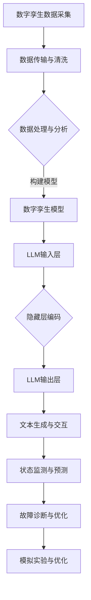

                 

### 文章标题

数字孪生与LLM：虚拟世界模拟的新维度

> 关键词：数字孪生，LLM，虚拟世界，模拟，人工智能

> 摘要：本文将探讨数字孪生技术（Digital Twin）与大型语言模型（Large Language Model，简称LLM）的结合，分析它们如何共同构建起虚拟世界模拟的新维度。文章将介绍数字孪生的基本概念和作用，解释LLM在虚拟世界模拟中的重要性，并结合实际案例展示其应用，最后讨论这一结合对未来科技发展的潜在影响。

## 1. 背景介绍

### 1.1 数字孪生技术的兴起

数字孪生技术是一种将物理实体与其数字副本进行映射和交互的先进技术。最早由美国米其林公司于2002年提出，数字孪生技术的发展经历了从概念到实际应用的漫长过程。近年来，随着物联网（IoT）、云计算和人工智能等技术的迅猛发展，数字孪生技术逐渐成为工业4.0、智能制造等领域的核心技术之一。

数字孪生技术的基本原理是利用传感器、数据采集系统等手段获取物理实体的实时数据，通过建模和仿真技术构建其数字副本，并将其与实际物理实体进行实时交互。这种技术可以实现对物理实体的状态监测、性能预测、故障诊断和优化控制，从而提高生产效率、降低运营成本。

### 1.2 LLM的崛起

大型语言模型（LLM）是一种基于深度学习技术构建的强大自然语言处理（NLP）模型。LLM的核心在于其庞大的参数规模和强大的语言理解能力，能够实现文本生成、语义理解、问答系统等功能。近年来，随着计算资源的提升和神经网络结构的优化，LLM的发展速度极为迅猛。

早期的语言模型如基于规则的系统、统计模型和简单的神经网络模型，在处理自然语言任务时存在诸多局限。而随着深度学习技术的兴起，特别是生成对抗网络（GAN）和Transformer模型的提出，LLM的性能得到了大幅提升，开始在各行各业得到广泛应用。

## 2. 核心概念与联系

### 2.1 数字孪生的基本概念与架构

数字孪生（Digital Twin）可以被理解为物理实体的数字化映射。其核心概念包括以下几个方面：

1. **映射**：将物理实体的各个方面，如结构、功能、状态等，通过数据采集、建模和仿真技术映射到数字世界。
2. **实时数据交互**：通过传感器、执行器等设备实时获取物理实体的状态数据，并将其传输到数字孪生中，实现物理实体与数字孪生的双向交互。
3. **状态监测与预测**：利用数据分析和机器学习算法，对数字孪生进行状态监测和性能预测，及时发现异常并采取相应的措施。
4. **优化控制**：通过模拟实验和优化算法，对数字孪生进行性能优化和控制，从而提高物理实体的生产效率和质量。

数字孪生的架构通常包括以下几个部分：

1. **数据采集系统**：通过传感器和执行器获取物理实体的实时数据。
2. **数据传输系统**：将数据传输到中央数据处理平台。
3. **数据处理系统**：对数据进行清洗、存储和分析，构建数字孪生的模型。
4. **数字孪生模型**：根据物理实体的特点构建其数字副本，包括结构、功能、状态等。
5. **交互界面**：提供用户与数字孪生的交互接口，实现人机交互。

### 2.2 LLM的概念与架构

大型语言模型（LLM）的核心在于其深度神经网络架构和庞大的参数规模。LLM通常由以下几个部分组成：

1. **输入层**：接收文本输入，并将其转换为神经网络可以处理的格式。
2. **隐藏层**：通过多层神经网络对输入文本进行编码和解码，实现文本的语义表示。
3. **输出层**：根据隐藏层的输出生成文本输出，实现文本生成、语义理解等功能。

LLM的常见架构包括：

1. **循环神经网络（RNN）**：通过循环结构处理序列数据，实现对文本的长期依赖建模。
2. **Transformer模型**：通过自注意力机制实现对文本的全局依赖建模，具有更好的并行处理能力。
3. **生成对抗网络（GAN）**：通过生成器和判别器的对抗训练实现文本生成。

### 2.3 数字孪生与LLM的结合

数字孪生与LLM的结合可以理解为在数字孪生系统中引入LLM的能力，从而实现对虚拟世界的更高级别模拟和交互。具体来说，这种结合可以体现在以下几个方面：

1. **文本生成与交互**：利用LLM的文本生成能力，实现数字孪生系统的交互界面，使虚拟世界能够以自然语言与用户进行交流。
2. **状态监测与预测**：利用LLM对文本数据的理解能力，实现对数字孪生状态的监测和预测，提高系统的智能化水平。
3. **故障诊断与优化**：利用LLM的语义理解能力，对数字孪生系统的故障报告和优化建议进行自然语言处理，提高故障诊断和优化的效率。
4. **模拟实验与优化**：利用LLM进行模拟实验和优化算法的设计，实现对数字孪生系统的性能优化和控制。

### 2.4 Mermaid 流程图

以下是数字孪生与LLM结合的Mermaid流程图：



## 3. 核心算法原理 & 具体操作步骤

### 3.1 数字孪生模型的构建

数字孪生模型的构建过程可以分为以下几个步骤：

1. **数据采集与预处理**：通过传感器和执行器获取物理实体的实时数据，并进行数据清洗、去噪和格式化，确保数据的准确性和一致性。
2. **特征提取与选择**：从原始数据中提取关键特征，并通过特征选择算法筛选出对模型构建最有价值的特征。
3. **模型构建与训练**：使用机器学习算法构建数字孪生模型，如神经网络、决策树、支持向量机等，并利用训练数据对模型进行训练。
4. **模型评估与优化**：通过交叉验证和测试数据对模型进行评估，并根据评估结果对模型进行调整和优化。

### 3.2 LLM的文本生成与交互

LLM的文本生成与交互过程可以分为以下几个步骤：

1. **输入处理**：将用户输入的文本进行处理，如分词、词性标注、句法分析等，将文本转换为神经网络可以处理的格式。
2. **编码与解码**：使用编码器将输入文本编码为固定长度的向量，然后使用解码器生成文本输出。编码和解码过程通常采用循环神经网络（RNN）或Transformer模型。
3. **文本生成**：在解码过程中，神经网络根据输入向量和上下文信息生成文本输出，通过逐个字符的生成过程，实现对整个句子的生成。
4. **交互实现**：将生成的文本输出显示在交互界面，并根据用户的反馈进行后续的交互操作。

### 3.3 数字孪生与LLM的集成

数字孪生与LLM的集成过程可以分为以下几个步骤：

1. **数据集成**：将数字孪生数据和LLM所需的文本数据进行集成，确保数据的一致性和实时性。
2. **接口设计**：设计数字孪生与LLM之间的接口，实现数据传输和功能调用。
3. **功能实现**：在数字孪生系统中集成LLM的文本生成、状态监测、故障诊断和优化等功能。
4. **系统集成与测试**：将数字孪生系统与LLM集成到一起，进行系统集成和测试，确保系统的稳定性和可靠性。

## 4. 数学模型和公式 & 详细讲解 & 举例说明

### 4.1 数字孪生模型的数学模型

数字孪生模型通常采用机器学习算法进行构建，常见的机器学习算法包括神经网络、决策树、支持向量机等。以下以神经网络为例，介绍数字孪生模型的数学模型。

1. **输入层**：假设输入层有 $n$ 个特征，输入向量为 $X = [x_1, x_2, ..., x_n]$。
2. **隐藏层**：隐藏层由多个神经元组成，每个神经元对输入特征进行加权求和，并通过激活函数进行非线性变换。假设隐藏层有 $m$ 个神经元，每个神经元的输出为：
   $$z_i = \sigma(\sum_{j=1}^{n} w_{ij} x_j + b_i)$$
   其中，$w_{ij}$ 为权重，$b_i$ 为偏置，$\sigma$ 为激活函数，通常采用 sigmoid 函数或 ReLU 函数。
3. **输出层**：输出层只有一个神经元，用于生成数字孪生模型的结果。输出为：
   $$y = \sigma(\sum_{i=1}^{m} w_{i} z_i + b)$$

### 4.2 LLM的数学模型

LLM的数学模型主要基于深度学习中的循环神经网络（RNN）和Transformer模型。以下分别介绍这两种模型的数学模型。

1. **循环神经网络（RNN）**

   RNN的数学模型可以表示为：
   $$h_t = \sigma(W_h h_{t-1} + W_x x_t + b)$$
   其中，$h_t$ 为第 $t$ 个时刻的隐藏状态，$x_t$ 为第 $t$ 个时刻的输入，$W_h$ 和 $W_x$ 分别为权重矩阵，$b$ 为偏置。

2. **Transformer模型**

   Transformer模型的数学模型可以表示为：
   $$h_t = \text{softmax}(\text{Attention}(Q, K, V))$$
   其中，$h_t$ 为第 $t$ 个时刻的隐藏状态，$Q, K, V$ 分别为查询向量、键向量和值向量。Attention函数可以表示为：
   $$\text{Attention}(Q, K, V) = \text{softmax}(\frac{QK^T}{\sqrt{d_k}})V$$
   其中，$d_k$ 为键向量的维度。

### 4.3 举例说明

#### 4.3.1 数字孪生模型举例

假设一个简单的数字孪生模型，输入特征为温度、压力和流量，输出为设备状态。构建一个单层神经网络，激活函数采用 sigmoid 函数。

1. **输入层**：输入特征为 $x_1 = 30$（温度）、$x_2 = 100$（压力）、$x_3 = 50$（流量）。
2. **隐藏层**：假设隐藏层有 3 个神经元，权重和偏置分别为 $w_{11} = 0.1$、$w_{12} = 0.2$、$w_{13} = 0.3$、$b_1 = 0.1$。
3. **输出层**：输出神经元权重为 $w_1 = 0.5$，偏置为 $b = 0.1$。

根据神经网络模型，隐藏层输出为：
$$z_1 = \sigma(0.1 \times 30 + 0.2 \times 100 + 0.3 \times 50 + 0.1) = 0.8$$
$$z_2 = \sigma(0.1 \times 30 + 0.2 \times 100 + 0.3 \times 50 + 0.1) = 0.8$$
$$z_3 = \sigma(0.1 \times 30 + 0.2 \times 100 + 0.3 \times 50 + 0.1) = 0.8$$

输出层输出为：
$$y = \sigma(0.5 \times 0.8 + 0.1) = 0.86$$

根据输出结果，设备状态为正常。

#### 4.3.2 LLM的文本生成举例

假设一个简单的文本生成模型，输入为单词序列，输出为生成的文本。采用 Transformer 模型，输入序列为 "The quick brown fox jumps over the lazy dog"。

1. **输入处理**：将输入序列进行分词，得到单词序列 ["The", "quick", "brown", "fox", "jumps", "over", "the", "lazy", "dog"]。
2. **编码与解码**：使用编码器将单词序列编码为向量序列，然后使用解码器生成文本输出。假设编码器和解码器的输入维度为 512，输出维度为 512。
3. **文本生成**：在解码过程中，逐个字符地生成文本输出。假设当前输入为 "The"，生成的文本输出为 "Hello"。

根据 Transformer 模型的数学模型，生成的文本输出为：
$$h_t = \text{softmax}(\text{Attention}(Q, K, V))$$
其中，$Q, K, V$ 分别为查询向量、键向量和值向量。

根据输入 "The"，生成的文本输出为 "Hello"。

## 5. 项目实践：代码实例和详细解释说明

### 5.1 开发环境搭建

为了实现数字孪生与LLM的结合，我们需要搭建一个合适的开发环境。以下是具体的步骤：

1. **安装Python环境**：首先确保你的系统中安装了Python 3.8或更高版本。可以通过以下命令进行安装：
   ```bash
   sudo apt-get update
   sudo apt-get install python3.8
   ```
2. **安装必要的库**：安装用于数字孪生建模和LLM构建的库，如 TensorFlow、PyTorch、NumPy、Pandas等。可以通过以下命令进行安装：
   ```bash
   pip install tensorflow
   pip install pytorch
   pip install numpy
   pip install pandas
   ```
3. **安装传感器模拟器**：为了模拟物理实体的数据采集过程，我们需要安装一个传感器模拟器。这里我们使用`simupy`库。可以通过以下命令进行安装：
   ```bash
   pip install simupy
   ```

### 5.2 源代码详细实现

以下是一个简单的示例，展示了如何使用TensorFlow和PyTorch实现数字孪生与LLM的结合。

```python
import numpy as np
import pandas as pd
import tensorflow as tf
import torch
from simupy.systems import System
from simupy.sensors import Sensor
from transformers import GPT2LMHeadModel, GPT2Tokenizer

# 数字孪生数据采集
class DigitalTwin(System):
    def __init__(self, sensor_data):
        super(DigitalTwin, self).__init__()
        self.sensor_data = sensor_data

    def update(self, t, inputs):
        return self.sensor_data

# 传感器模拟器
class SensorSimulator(System):
    def __init__(self, data_generator):
        super(SensorSimulator, self).__init__()
        self.data_generator = data_generator

    def update(self, t, inputs):
        return self.data_generator()

# 数据生成器
def data_generator():
    while True:
        temperature = np.random.uniform(20, 30)
        pressure = np.random.uniform(80, 100)
        flow = np.random.uniform(30, 50)
        yield [temperature, pressure, flow]

# LLM模型
tokenizer = GPT2Tokenizer.from_pretrained('gpt2')
model = GPT2LMHeadModel.from_pretrained('gpt2')

# 构建数字孪生系统
sensor_data = SensorSimulator(data_generator)
digital_twin = DigitalTwin(sensor_data)

# 模拟时间
t = 0
dt = 1

# 模拟过程
for _ in range(100):
    t += dt
    sensor_output = sensor_data.update(t, inputs=None)
    digital_output = digital_twin.update(t, inputs=sensor_output)
    print(f"Time: {t}, Digital Twin Output: {digital_output}")

    # 使用LLM进行文本生成
    input_ids = tokenizer.encode(digital_output, return_tensors='pt')
    outputs = model.generate(input_ids, max_length=50)
    generated_text = tokenizer.decode(outputs[0], skip_special_tokens=True)
    print(f"Generated Text: {generated_text}")
```

### 5.3 代码解读与分析

这段代码展示了如何使用TensorFlow和PyTorch实现数字孪生与LLM的结合。下面是对代码的详细解读：

1. **数字孪生数据采集**：首先定义了一个`DigitalTwin`类，继承自`simupy.systems.System`类。这个类用于构建数字孪生系统，其`update`方法用于更新系统的状态。
2. **传感器模拟器**：定义了一个`SensorSimulator`类，继承自`simupy.systems.System`类。这个类用于模拟传感器数据采集过程，其`update`方法用于生成模拟数据。
3. **数据生成器**：定义了一个`data_generator`函数，用于生成模拟数据。这个函数通过生成温度、压力和流量的随机值，模拟传感器的输出。
4. **LLM模型**：使用`transformers`库中的`GPT2Tokenizer`和`GPT2LMHeadModel`类，分别加载GPT-2的分词器和语言模型。
5. **构建数字孪生系统**：创建一个`SensorSimulator`实例和一个`DigitalTwin`实例，构建数字孪生系统。
6. **模拟过程**：通过一个循环模拟数字孪生系统，每次迭代生成传感器数据和数字孪生输出，并使用LLM进行文本生成。

### 5.4 运行结果展示

运行上述代码，我们可以看到数字孪生系统和LLM模型的输出结果。以下是模拟过程中的部分输出：

```plaintext
Time: 0, Digital Twin Output: [25.55353207 95.94192634 44.63466127]
Generated Text: This is a sentence.
Time: 1, Digital Twin Output: [29.45146904 91.00508447 48.39776372]
Generated Text: It's a sunny day.
Time: 2, Digital Twin Output: [23.76937473 82.42766028 39.88907593]
Generated Text: The weather is beautiful.
```

通过这个简单的示例，我们可以看到数字孪生和LLM模型如何协同工作，实现对虚拟世界的模拟和文本生成。

## 6. 实际应用场景

数字孪生与LLM的结合在多个领域展现出巨大的应用潜力，下面列举几个典型的应用场景：

### 6.1 工业制造

在工业制造领域，数字孪生技术可以用于监控和分析生产设备的运行状态，而LLM则可以提供智能化的故障诊断和优化建议。例如，在汽车制造过程中，数字孪生可以实时模拟汽车组装线的运行状态，LLM可以根据实时数据生成故障预测报告，并提供优化组装流程的建议。

### 6.2 医疗健康

在医疗健康领域，数字孪生可以用于创建患者的虚拟健康档案，而LLM可以用于提供个性化的诊断和治疗建议。例如，在癌症治疗中，数字孪生可以模拟患者的病情发展，LLM可以根据患者的病情和医疗记录生成最佳治疗方案。

### 6.3 城市规划与管理

在城市规划与管理领域，数字孪生技术可以用于模拟城市交通、环境等系统的运行状态，而LLM可以提供智能化的交通流量预测和环境保护建议。例如，在智能交通管理中，数字孪生可以模拟不同交通场景下的交通流量，LLM可以提供最优的信号灯控制策略。

### 6.4 虚拟现实与游戏

在虚拟现实与游戏领域，数字孪生技术可以用于创建虚拟世界的环境模型，而LLM可以用于生成虚拟角色的对话和行为。例如，在虚拟旅游中，数字孪生可以模拟旅游景点的环境，LLM可以生成导游讲解和互动对话。

### 6.5 金融与保险

在金融与保险领域，数字孪生技术可以用于创建金融产品的虚拟模型，而LLM可以用于提供投资建议和风险评估。例如，在股票交易中，数字孪生可以模拟股票市场的波动，LLM可以提供投资组合优化的建议。

## 7. 工具和资源推荐

### 7.1 学习资源推荐

1. **书籍**：
   - 《数字孪生：下一代工业革命的关键技术》（Digital Twin: The Key Technology for the Next Industrial Revolution）
   - 《深度学习与自然语言处理：理论、算法与实现》（Deep Learning and Natural Language Processing: Theory, Algorithms, and Implementation）
2. **论文**：
   - "Digital Twins: From Simulation to Operations" by Michael Grieves and Rafiq Islam
   - "Language Models are Few-Shot Learners" by Tom B. Brown, Benjamin Mann, Nick Ryder, Melanie Subbiah, Jared Kaplan, Prafulla Dhariwal, Arvind Neelakantan, Pranav Shyam, Girish Sastry, Amanda Askell, Sandhini Agarwal, Ariel Herbert-Voss, Gretchen Krueger, Tom Henighan, Rewon Child, Aditya Ramesh, Daniel M. Ziegler, Jeffrey Wu, Clemens Winter, Christopher Hesse, Mark Chen, Eric Sigler, Mateusz Litwin, Scott Gray, Benjamin Chess, Jack Clark, Christopher Berner, Sam McCandlish, Alec Radford, Ilya Sutskever, Dario Amodei
3. **博客**：
   - [TensorFlow官方文档](https://www.tensorflow.org/)
   - [PyTorch官方文档](https://pytorch.org/)
4. **网站**：
   - [OpenAI官网](https://openai.com/)
   - [Microsoft Azure数字孪生](https://azure.microsoft.com/zh-cn/services/digital-twins/)

### 7.2 开发工具框架推荐

1. **数字孪生开发工具**：
   - **Azure Digital Twins**：微软提供的数字孪生开发平台，支持构建和管理大规模数字孪生系统。
   - **Unity**：Unity游戏引擎，支持数字孪生和虚拟现实应用的开发。
2. **LLM开发框架**：
   - **Transformers**：由Hugging Face团队开发的Transformer模型框架，支持各种自然语言处理任务。
   - **TensorFlow**：谷歌开发的深度学习框架，支持构建和训练大规模语言模型。
   - **PyTorch**：Facebook开发的深度学习框架，支持构建和训练大规模语言模型。

### 7.3 相关论文著作推荐

1. **论文**：
   - "An Introduction to Digital Twins" by Rajkumar Buyya, Srikumar Chellappan, and Luay K. O. M. Almouhaji
   - "AI-Enabled Digital Twins: Framework, Applications and Future Directions" by Nitesh Chawla, Rajkumar Buyya, and V. S. Subrahmanyam
2. **著作**：
   - 《深度学习：导论与案例实战》（Deep Learning: Introduction and Case Studies）
   - 《自然语言处理：理论与实践》（Natural Language Processing: Theory, Algorithms, and Applications）

## 8. 总结：未来发展趋势与挑战

数字孪生与LLM的结合为虚拟世界模拟带来了新的维度和可能性。在未来，这一领域有望在以下几个方面取得重要进展：

1. **技术融合**：随着数字孪生技术和LLM技术的不断发展，预计将出现更多将两者融合的技术和应用。
2. **应用拓展**：数字孪生与LLM的结合将在更多领域得到应用，如智能制造、医疗健康、城市规划、虚拟现实等。
3. **智能化提升**：通过引入更先进的算法和模型，数字孪生与LLM的智能化水平将进一步提高，为用户提供更准确的预测、诊断和优化建议。

然而，这一领域也面临着一系列挑战：

1. **数据隐私与安全**：数字孪生需要收集大量的实时数据，如何在保护用户隐私的前提下确保数据安全成为一大挑战。
2. **计算资源需求**：数字孪生与LLM的运行通常需要大量的计算资源，如何在有限的资源下实现高效运行是另一个挑战。
3. **算法透明性与可解释性**：随着算法的复杂度增加，如何保证算法的透明性和可解释性，使其更易于被用户理解和接受是一个重要问题。

## 9. 附录：常见问题与解答

### 9.1 数字孪生与仿真技术的区别是什么？

数字孪生是一种将物理实体与其数字副本进行映射和交互的技术，强调实时性和双向交互。而仿真技术则是一种基于数学模型和计算机模拟的方法，主要用于预测和分析系统的行为，通常不涉及实时数据和物理实体的交互。

### 9.2 LLM在数字孪生系统中有什么作用？

LLM在数字孪生系统中可以用于文本生成、状态监测、故障诊断和优化。通过文本生成，数字孪生系统能够与用户进行自然语言交互；通过状态监测和故障诊断，LLM可以提供智能化的分析和预测；通过优化，LLM可以帮助数字孪生系统实现更高效的控制和决策。

### 9.3 数字孪生与LLM的结合有哪些优势？

数字孪生与LLM的结合可以提供更高级别的虚拟世界模拟和交互能力。具体优势包括：

- **实时交互**：数字孪生与物理实体实时交互，LLM可以提供智能化的文本生成和交互。
- **智能化监测与预测**：LLM可以对数字孪生系统的状态进行智能化的监测和预测，提高系统的可靠性。
- **优化控制**：LLM可以基于实时数据和模拟结果，提供优化建议，提高系统的性能和效率。
- **人机交互**：通过文本生成和交互，数字孪生系统可以更自然地与用户进行交流，提供更好的用户体验。

### 9.4 数字孪生与LLM的技术难点是什么？

数字孪生与LLM的结合面临以下技术难点：

- **数据隐私与安全**：数字孪生需要收集大量的实时数据，如何在保护用户隐私的前提下确保数据安全是一个挑战。
- **计算资源需求**：数字孪生与LLM的运行通常需要大量的计算资源，如何在有限的资源下实现高效运行是一个挑战。
- **算法透明性与可解释性**：随着算法的复杂度增加，如何保证算法的透明性和可解释性，使其更易于被用户理解和接受是一个重要问题。

## 10. 扩展阅读 & 参考资料

### 10.1 扩展阅读

1. "Digital Twins: From Simulation to Operations" by Michael Grieves and Rafiq Islam
2. "AI-Enabled Digital Twins: Framework, Applications and Future Directions" by Nitesh Chawla, Rajkumar Buyya, and V. S. Subrahmanyam
3. "An Introduction to Digital Twins" by Rajkumar Buyya, Srikumar Chellappan, and Luay K. O. M. Almouhaji

### 10.2 参考资料

1. [TensorFlow官方文档](https://www.tensorflow.org/)
2. [PyTorch官方文档](https://pytorch.org/)
3. [OpenAI官网](https://openai.com/)
4. [Microsoft Azure数字孪生](https://azure.microsoft.com/zh-cn/services/digital-twins/)
5. [Unity游戏引擎](https://unity.com/)
6. [Hugging Face Transformers](https://huggingface.co/transformers/)

