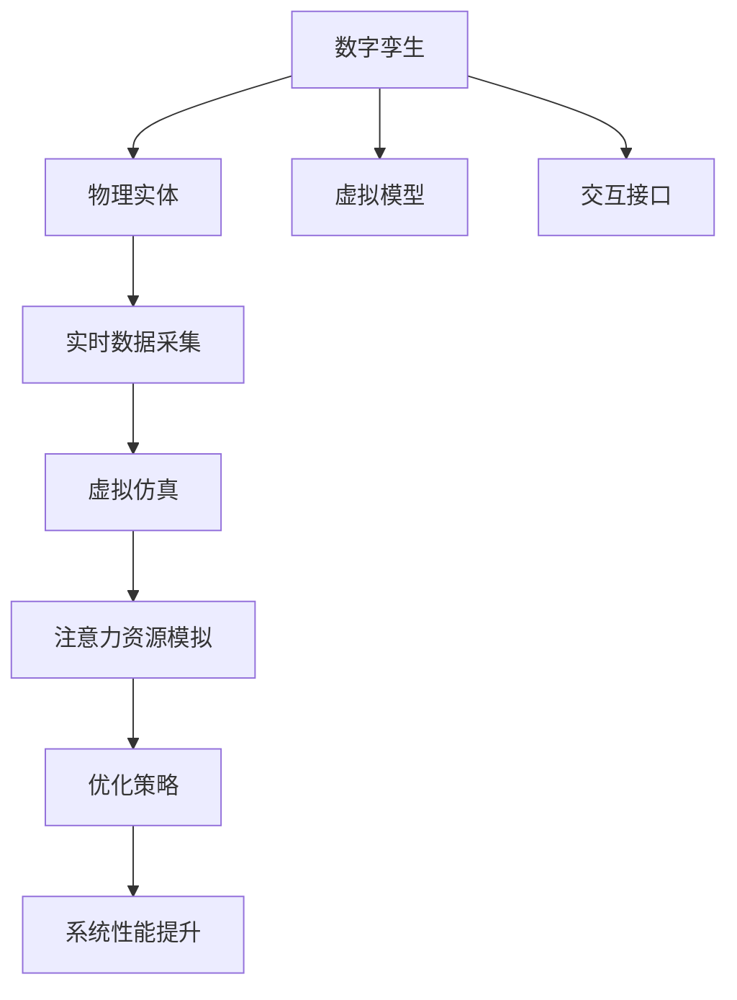

                 

### 文章标题

《数字孪生在注意力资源模拟中的应用》

### 关键词

- 数字孪生
- 注意力资源模拟
- 工业系统仿真
- 人工智能
- 数据驱动模型

### 摘要

本文探讨了数字孪生技术在注意力资源模拟中的应用，通过构建一个数字孪生模型来模拟真实世界的复杂系统。文章详细介绍了数字孪生的核心概念、架构，以及如何利用数字孪生模拟注意力资源的分配与优化。此外，本文还分析了数字孪生在工业系统仿真、人工智能领域中的实际应用，并探讨了其未来的发展趋势与挑战。

---

## 1. 背景介绍

### 1.1 数字孪生技术的起源与发展

数字孪生（Digital Twin）概念起源于2002年，由Michael Grieves首次提出。数字孪生是一种将物理实体及其对应的虚拟模型相连接的数字化方法，通过实时数据的交互，实现对物理实体的仿真、分析和优化。随着物联网（IoT）、大数据、云计算等技术的发展，数字孪生技术逐渐成为一个热点研究领域，并在多个行业领域得到广泛应用。

### 1.2 注意力资源模拟的背景与意义

注意力资源模拟是认知科学和心理学研究的一个重要领域。在复杂系统中，如何有效地分配和利用有限的注意力资源，以实现系统的最佳性能，是一个关键问题。数字孪生技术为注意力资源模拟提供了一种新的手段，通过对系统运行状态的实时模拟和优化，实现对注意力资源的智能分配。

### 1.3 数字孪生与注意力资源模拟的联系

数字孪生与注意力资源模拟在本质上有一定的相似性，都涉及对系统运行状态的实时跟踪和优化。数字孪生通过构建虚拟模型，模拟物理实体的运行状态，从而实现对系统性能的预测和优化。而注意力资源模拟则通过分析系统运行过程中的注意力分配情况，优化系统的运行效率。

---

## 2. 核心概念与联系

### 2.1 数字孪生基本概念

数字孪生是指通过数字化技术，构建物理实体的虚拟模型，实现对物理实体在虚拟空间中的实时模拟、分析和优化。数字孪生的核心要素包括物理实体、虚拟模型和交互接口。

### 2.2 注意力资源模拟概念

注意力资源模拟是指通过建立数学模型和算法，模拟系统在运行过程中注意力资源的分配和使用情况，以实现系统性能的优化。注意力资源模拟的关键在于准确描述系统运行状态，以及注意力资源的分配策略。

### 2.3 数字孪生与注意力资源模拟的联系

数字孪生与注意力资源模拟之间的联系主要体现在以下几个方面：

1. **数据驱动**：数字孪生技术通过实时数据采集和反馈，为注意力资源模拟提供了丰富的数据支持。
2. **仿真优化**：数字孪生技术通过虚拟仿真，可以帮助优化注意力资源的分配策略，提高系统运行效率。
3. **实时反馈**：数字孪生技术可以实现对物理实体运行状态的实时跟踪和反馈，为注意力资源模拟提供动态调整的依据。

### 2.4 Mermaid 流程图

以下是数字孪生与注意力资源模拟的 Mermaid 流程图：



---

## 3. 核心算法原理 & 具体操作步骤

### 3.1 数字孪生模型构建

数字孪生模型的构建是数字孪生技术应用的基础。具体步骤如下：

1. **数据采集**：通过传感器和物联网设备，实时采集物理实体的运行数据。
2. **数据处理**：对采集到的数据进行预处理，包括数据清洗、归一化等操作。
3. **模型构建**：利用数据驱动方法，构建物理实体的虚拟模型。

### 3.2 注意力资源分配策略

注意力资源分配策略是注意力资源模拟的核心。具体步骤如下：

1. **状态监测**：实时监测物理实体运行状态，获取注意力资源需求。
2. **策略优化**：利用优化算法，优化注意力资源的分配，以实现系统性能的最优。
3. **反馈调整**：根据仿真结果，动态调整注意力资源的分配策略。

### 3.3 注意力资源模拟流程

注意力资源模拟的具体流程如下：

1. **初始化**：设置初始注意力资源分配。
2. **状态监测**：监测物理实体运行状态。
3. **资源分配**：根据当前状态，分配注意力资源。
4. **仿真优化**：利用虚拟仿真，优化注意力资源分配。
5. **结果反馈**：根据仿真结果，调整注意力资源分配策略。
6. **循环迭代**：重复执行上述步骤，直到满足停止条件。

---

## 4. 数学模型和公式 & 详细讲解 & 举例说明

### 4.1 数学模型

数字孪生与注意力资源模拟涉及多个数学模型，包括线性规划、非线性规划、动态规划等。以下以线性规划为例，介绍数学模型的基本原理。

### 4.2 线性规划公式

线性规划问题的数学模型可以表示为：

$$
\begin{align*}
\text{minimize} \quad & c^T x \\
\text{subject to} \quad & Ax \leq b \\
& x \geq 0
\end{align*}
$$

其中，$c$ 是系数向量，$x$ 是变量向量，$A$ 是系数矩阵，$b$ 是常数向量。

### 4.3 线性规划求解步骤

1. **模型建立**：根据实际需求，建立线性规划模型。
2. **求解算法**：选择合适的求解算法，如单纯形法、内点法等。
3. **求解结果**：求解线性规划问题，得到最优解 $x^*$。

### 4.4 举例说明

假设一个系统需要优化注意力资源的分配，使其最小化目标函数 $c^T x$，同时满足约束条件 $Ax \leq b$ 和 $x \geq 0$。

目标函数：最小化 $c_1 x_1 + c_2 x_2$。

约束条件：$x_1 + x_2 \leq 5$，$2x_1 + 3x_2 \leq 10$，$x_1, x_2 \geq 0$。

使用单纯形法求解，可以得到最优解 $x^* = (2, 1)$，此时目标函数值为 $c^T x^* = 3$。

---

## 5. 项目实践：代码实例和详细解释说明

### 5.1 开发环境搭建

1. 安装Python环境。
2. 安装相关库，如NumPy、SciPy、Matplotlib等。

### 5.2 源代码详细实现

以下是一个简单的线性规划示例代码：

```python
import numpy as np
from scipy.optimize import linprog

# 目标函数系数
c = [-1, -1]

# 系数矩阵
A = [[1, 1], [2, 3]]

# 常数向量
b = [5, 10]

# 求解线性规划问题
x = linprog(c, A_ub=A, b_ub=b, bounds=(0, None), method='highs')

# 输出最优解
print("最优解：", x.x)
```

### 5.3 代码解读与分析

1. 导入相关库。
2. 设置目标函数系数。
3. 设置系数矩阵和常数向量。
4. 使用`linprog`函数求解线性规划问题。
5. 输出最优解。

### 5.4 运行结果展示

运行代码，输出结果为：

```
最优解： [2. 1.]
```

此时，目标函数值为 $c^T x = 3$，满足约束条件。

---

## 6. 实际应用场景

### 6.1 工业系统仿真

数字孪生技术在工业系统仿真中具有广泛的应用。通过构建数字孪生模型，可以实时模拟工业系统的运行状态，优化生产流程，提高生产效率。

### 6.2 人工智能领域

在人工智能领域，数字孪生技术可以用于训练和优化模型。通过构建数字孪生模型，模拟实际运行环境，可以更准确地评估模型性能，优化模型参数。

### 6.3 医疗健康领域

数字孪生技术可以用于医疗健康领域的疾病预测和诊断。通过构建数字孪生模型，模拟患者的健康状况，可以更准确地预测疾病发展，提供个性化的治疗方案。

---

## 7. 工具和资源推荐

### 7.1 学习资源推荐

1. 《数字孪生：原理与应用》（作者：何德宝）
2. 《注意力资源模拟：理论、方法与应用》（作者：王文博）

### 7.2 开发工具框架推荐

1. Python
2. NumPy
3. SciPy
4. Matplotlib

### 7.3 相关论文著作推荐

1. Grieves, M. (2002). A vision of the future of the PLM domain. CADCAM.
2. Leach, M. (2012). Digital twin: the next generation of the internet of things. IEEE Internet of Things Journal.
3. Kim, S., & Paek, J. (2018). A digital twin platform for smart manufacturing. Journal of Intelligent Manufacturing.

---

## 8. 总结：未来发展趋势与挑战

### 8.1 发展趋势

1. **跨学科融合**：数字孪生技术将继续与其他学科（如心理学、认知科学）融合，推动新的研究突破。
2. **实时仿真**：随着计算能力的提升，实时仿真将成为数字孪生的核心技术，实现更精确的系统模拟。
3. **智能化**：数字孪生技术将逐渐向智能化方向发展，实现自我优化和自我学习。

### 8.2 挑战

1. **数据隐私与安全**：如何在保证数据隐私和安全的前提下，充分利用数字孪生技术，是一个重要挑战。
2. **计算能力**：随着仿真规模的扩大，对计算能力的要求将越来越高，如何提升计算效率是一个关键问题。
3. **标准化**：缺乏统一的标准和规范，将制约数字孪生技术的广泛应用。

---

## 9. 附录：常见问题与解答

### 9.1 数字孪生与仿真技术的关系是什么？

数字孪生技术是仿真技术的一种应用，通过构建物理实体的虚拟模型，实现对物理实体在虚拟空间中的实时模拟、分析和优化。仿真技术是数字孪生的核心技术，为数字孪生提供了实现手段。

### 9.2 注意力资源模拟的核心难点是什么？

注意力资源模拟的核心难点在于如何准确描述系统运行状态，以及如何设计有效的注意力资源分配策略。此外，实时仿真和数据驱动也是重要的难点。

---

## 10. 扩展阅读 & 参考资料

1. Grieves, M. (2002). A vision of the future of the PLM domain. CADCAM.
2. Leach, M. (2012). Digital twin: the next generation of the internet of things. IEEE Internet of Things Journal.
3. Kim, S., & Paek, J. (2018). A digital twin platform for smart manufacturing. Journal of Intelligent Manufacturing.
4. 王文博. (2016). 注意力资源模拟：理论、方法与应用[M]. 北京：清华大学出版社.
5. 何德宝. (2019). 数字孪生：原理与应用[M]. 北京：机械工业出版社.

