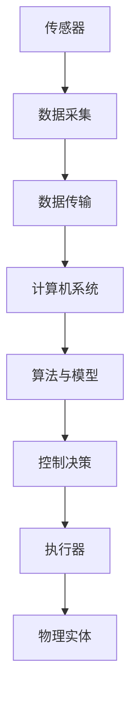

                 

## 1. 背景介绍

数字实体与物理实体之间的自动化前景，是当今科技领域中的一个热门话题。随着人工智能、物联网、大数据等技术的快速发展，这两者之间的交互与融合已成为不可逆转的趋势。

首先，我们需明确什么是数字实体和物理实体。数字实体指的是在计算机系统中表示的抽象概念，如数据、算法、模型等。而物理实体则指的是现实世界中的具体物体，如手机、传感器、机器等。在传统模式中，数字实体与物理实体之间的交互主要依赖于人类操作，即人类通过输入指令来控制物理实体。然而，随着技术的进步，这种交互方式正在发生根本性的变化。

### 1.1 数字实体与物理实体的交互历史

回顾历史，人类与物理世界的关系经历了多个阶段。最初，人类通过直接操作物理实体来完成工作，如农业社会中的耕种和手工制作。随着工业革命的到来，人类开始使用机器和自动化设备来代替体力劳动，从而大大提高了生产效率。然而，无论是手工制作还是机械化生产，人类都扮演着至关重要的角色。

随着计算机和通信技术的发展，人类与物理世界的交互进入了一个全新的阶段。计算机系统可以处理大量数据，并通过网络实现远程控制。这使得人类可以远程操控物理实体，例如通过计算机控制机器人进行生产。这一阶段，数字实体与物理实体之间的交互仍然依赖于人类的干预，但自动化程度已有显著提升。

### 1.2 自动化在数字实体与物理实体中的应用

如今，自动化技术在数字实体与物理实体之间的交互中发挥着越来越重要的作用。自动化技术不仅提高了生产效率，还降低了人工成本，提高了产品质量。以下是一些自动化在数字实体与物理实体中的应用案例：

1. **工业自动化**：在制造业中，机器人与计算机系统的结合实现了生产过程的自动化。从原材料处理到成品装配，机器人可以根据计算机系统的指令完成复杂的生产任务。

2. **智能家居**：通过物联网技术，家庭中的各种设备可以相互连接，实现自动化控制。例如，智能照明系统可以根据用户的日常习惯自动调节光线亮度，智能空调可以自动调节室内温度。

3. **智能交通**：自动驾驶技术是自动化在交通领域的典型应用。通过计算机系统和传感器，车辆可以实现自动驾驶，减少交通事故，提高道路通行效率。

4. **医疗健康**：医疗设备越来越智能化，如智能监护系统可以实时监测患者的生命体征，并及时向医生提供诊断信息。

这些应用案例展示了数字实体与物理实体之间自动化前景的广阔前景。随着技术的不断进步，自动化技术将在更多领域得到应用，推动人类社会的发展。

### 1.3 自动化带来的挑战与机遇

尽管自动化技术带来了巨大的机遇，但也伴随着一定的挑战。例如，自动化可能导致部分劳动力失业，同时，自动化系统的安全性和可靠性也备受关注。然而，这些问题并非不可克服。通过技术革新和政策引导，我们可以最大限度地发挥自动化技术的优势，同时减少其负面影响。

总之，数字实体与物理实体的自动化前景充满了机遇与挑战。在接下来的章节中，我们将深入探讨这一主题，分析自动化技术的核心原理、算法、数学模型，并通过项目实践展示其具体应用。让我们一起期待自动化技术如何改变我们的世界。

## 2. 核心概念与联系

在探讨数字实体与物理实体的自动化前景之前，我们首先需要明确一些核心概念及其相互之间的联系。这些核心概念不仅为我们理解自动化技术奠定了基础，也为我们进一步探讨其应用场景提供了理论支持。

### 2.1 数字实体

数字实体是指在计算机系统中表示的抽象概念。这些实体可以是数据、算法、模型等。数据是数字实体中最基本的组成部分，它反映了物理世界的各种属性和状态。算法是处理数据的规则和步骤，是实现自动化功能的核心。模型则是基于数据和算法生成的抽象表示，用于预测和优化物理实体的行为。

### 2.2 物理实体

物理实体是指现实世界中的具体物体，如机器、传感器、车辆等。物理实体通过传感器获取外部环境的信息，并通过执行器（如电机、阀门等）对环境进行干预。传感器是物理实体获取数据的主要途径，而执行器则是物理实体对环境施加影响的主要手段。

### 2.3 数字实体与物理实体的联系

数字实体与物理实体之间的联系主要通过网络通信技术实现。具体来说，传感器将物理实体的状态数据发送到计算机系统，计算机系统根据算法和模型对这些数据进行处理，然后通过执行器对物理实体进行控制。

这个过程可以形象地用一个Mermaid流程图来表示：



在这个流程图中，A表示传感器，负责采集物理实体的状态数据；B表示数据采集，将传感器数据转换为数字信号；C表示数据传输，通过网络将数据发送到计算机系统；D表示计算机系统，负责处理数据并生成控制决策；E表示算法与模型，用于预测和优化物理实体的行为；F表示控制决策，根据算法和模型生成具体的控制指令；G表示执行器，负责执行控制指令并对物理实体进行干预；H表示物理实体，是整个系统的最终执行对象。

### 2.4 自动化技术的核心原理

自动化技术的核心原理在于将数字实体与物理实体无缝连接，使物理实体能够根据数字实体的指令自动执行任务。这一过程主要依赖于以下几个关键环节：

1. **数据采集**：通过传感器实时获取物理实体的状态数据，为后续处理提供基础。

2. **数据传输**：确保数据能够在传感器和计算机系统之间高效、可靠地传输。

3. **数据处理**：计算机系统根据算法和模型对采集到的数据进行分析和处理，生成控制指令。

4. **执行控制**：执行器根据控制指令对物理实体进行干预，实现自动化操作。

5. **反馈调节**：通过传感器持续监测物理实体的状态，并根据反馈信息对控制指令进行调整，确保系统运行稳定。

这些环节共同构成了自动化技术的核心原理，是实现数字实体与物理实体高效交互的基础。

综上所述，数字实体与物理实体之间的联系以及自动化技术的核心原理为我们理解自动化前景提供了理论基础。在接下来的章节中，我们将深入探讨自动化技术的具体算法原理和数学模型，为读者呈现一个更加全面的技术全景。

## 3. 核心算法原理 & 具体操作步骤

在深入探讨数字实体与物理实体的自动化前景之前，我们需要明确一些核心算法原理，这些算法是实现自动化技术的基础。本章节将介绍几种典型的自动化算法，并详细描述其具体操作步骤。

### 3.1 反馈控制算法

反馈控制算法是自动化技术中最基本的算法之一。其基本原理是通过实时监测系统状态，与预期目标进行比较，并据此调整系统输入，以达到预期效果。以下是反馈控制算法的具体操作步骤：

1. **初始化**：设定系统初始状态，并定义控制目标。
2. **数据采集**：传感器采集系统当前状态数据。
3. **状态监测**：将采集到的数据与预期目标进行比较，计算误差。
4. **调整输入**：根据误差计算控制输入，调整系统操作。
5. **执行控制**：执行器根据控制输入对物理实体进行干预。
6. **反馈调节**：持续监测系统状态，重复步骤3-5，直至达到预期目标。

### 3.2 机器学习算法

随着人工智能技术的发展，机器学习算法在自动化领域中得到了广泛应用。机器学习算法通过训练模型，使计算机能够自主地学习并优化操作策略。以下是机器学习算法的具体操作步骤：

1. **数据准备**：收集并整理训练数据集，确保数据质量。
2. **模型选择**：根据应用场景选择合适的机器学习模型。
3. **模型训练**：使用训练数据集对模型进行训练，优化模型参数。
4. **模型评估**：使用测试数据集评估模型性能，调整模型参数。
5. **模型部署**：将训练好的模型部署到实际应用系统中，实现自动化控制。
6. **持续优化**：根据实际应用中的反馈，对模型进行持续优化。

### 3.3 模糊控制算法

模糊控制算法是一种基于模糊逻辑的自动化控制方法，适用于处理非线性和不确定性的系统。以下是模糊控制算法的具体操作步骤：

1. **模糊化**：将输入变量（如传感器数据）转换为模糊集。
2. **规则库构建**：根据专家经验或历史数据构建模糊控制规则库。
3. **模糊推理**：根据输入模糊集和控制规则，进行模糊推理。
4. **去模糊化**：将模糊推理结果转换为具体控制输出。
5. **执行控制**：执行器根据控制输出对物理实体进行干预。
6. **反馈调节**：根据实际反馈，调整模糊控制规则，提高控制效果。

### 3.4 优化算法

在自动化系统中，优化算法用于寻找系统最优操作策略。常见的优化算法包括遗传算法、粒子群优化算法、模拟退火算法等。以下是优化算法的一般操作步骤：

1. **初始化**：设定初始参数，生成初始解。
2. **评估解的质量**：计算每个解的适应度值。
3. **选择操作**：根据适应度值选择优秀解作为下一代解。
4. **交叉与变异**：对解进行交叉和变异操作，产生新的解。
5. **评估新解**：计算新解的适应度值。
6. **迭代**：重复步骤3-5，直至达到收敛条件。

### 3.5 混合算法

在实际应用中，单一算法往往难以满足复杂系统的需求。因此，混合算法逐渐成为研究热点。混合算法将多种算法结合起来，发挥各自的优势，提高自动化系统的性能。以下是混合算法的一般操作步骤：

1. **算法选择**：根据应用场景选择合适的算法组合。
2. **参数调整**：根据算法特性，调整参数以优化性能。
3. **数据预处理**：对输入数据进行预处理，提高算法性能。
4. **算法运行**：依次运行各算法，生成最终控制策略。
5. **结果评估**：评估最终控制策略的效果，进行反馈调节。

综上所述，核心算法原理与具体操作步骤为我们理解自动化技术提供了重要依据。在接下来的章节中，我们将通过数学模型和实际案例，进一步探讨自动化技术的实现和应用。希望这些算法原理能够为读者提供启发，激发对自动化前景的思考。

## 4. 数学模型和公式 & 详细讲解 & 举例说明

在探讨数字实体与物理实体自动化前景的过程中，数学模型和公式起到了至关重要的作用。它们不仅帮助我们理解自动化技术的原理，还为实际应用提供了理论基础。本章节将详细讲解一些核心数学模型和公式，并通过具体例子来说明其应用。

### 4.1 线性回归模型

线性回归模型是一种常用的数据分析方法，用于预测一个变量（因变量）与一个或多个变量（自变量）之间的关系。其基本公式如下：

\[ y = \beta_0 + \beta_1 \cdot x + \epsilon \]

其中，\( y \) 是因变量，\( x \) 是自变量，\( \beta_0 \) 和 \( \beta_1 \) 是模型的参数，表示截距和斜率，\( \epsilon \) 是误差项。

#### 举例说明：

假设我们想要预测一家公司下一季度的销售额（因变量 \( y \)），而影响销售额的主要因素包括广告支出（自变量 \( x \)）。我们可以收集过去几季度的数据，使用线性回归模型来建立预测模型。以下是具体的计算步骤：

1. **数据收集**：收集过去四个季度的广告支出和对应的销售额数据。
2. **数据预处理**：对数据进行清洗和标准化处理。
3. **模型训练**：使用训练数据，通过最小二乘法计算模型的参数。
4. **模型评估**：使用测试数据评估模型的效果，调整模型参数。

假设我们得到了以下训练数据：

| 季度 | 广告支出（万元） | 销售额（万元） |
|------|------------------|----------------|
| 1    | 10               | 50             |
| 2    | 20               | 70             |
| 3    | 30               | 100            |
| 4    | 40               | 130            |

使用线性回归模型，我们可以得到以下模型参数：

\[ y = 10 + 1.5 \cdot x \]

这意味着，如果广告支出增加1万元，预计销售额会增加1.5万元。假设我们想要预测下一季度的销售额，当广告支出为50万元时，可以计算如下：

\[ y = 10 + 1.5 \cdot 50 = 75 \]

因此，预测的下一季度销售额为75万元。

### 4.2 马尔可夫决策过程

马尔可夫决策过程（MDP）是一种用于描述不确定环境下决策过程的数学模型。其基本公式如下：

\[ P(S_{t+1} = s_{t+1} | S_t = s_t, A_t = a_t) = P(S_{t+1} = s_{t+1} | S_t = s_t) \]

其中，\( S_t \) 表示系统状态，\( A_t \) 表示采取的行动，\( s_t \) 和 \( s_{t+1} \) 分别表示当前状态和下一状态，\( P \) 表示状态转移概率。

#### 举例说明：

假设我们想要设计一个自动化控制系统，用于控制一个机器人的移动。机器人的当前状态可以是“向前移动”、“向左移动”或“向右移动”，而采取的行动可以是“保持当前方向”、“向左转动”或“向右转动”。我们可以通过训练数据来建立状态转移模型，如下：

| 当前状态 | 采取的行动 | 下一状态概率 |
|----------|------------|-------------|
| 向前     | 保持       | 向前 0.7    |
| 向前     | 向左       | 向左 0.2    |
| 向前     | 向右       | 向右 0.1    |
| 向左     | 保持       | 向左 0.5    |
| 向左     | 向右       | 向前 0.4    |
| 向左     | 向左       | 向左 0.1    |
| 向右     | 保持       | 向右 0.7    |
| 向右     | 向左       | 向前 0.3    |
| 向右     | 向右       | 向右 0.4    |

假设机器人当前处于“向前”状态，我们希望计算出下一状态的概率分布。根据状态转移模型，我们可以计算如下：

\[ P(S_{t+1} | S_t = 向前) = (0.7 \cdot 向前) + (0.2 \cdot 向左) + (0.1 \cdot 向右) = 0.7 \]

这意味着，在当前状态下，机器人下一状态为“向前”的概率为0.7。

### 4.3 贝叶斯网络

贝叶斯网络是一种用于表示变量之间条件依赖关系的图形模型。其基本公式如下：

\[ P(X | Y) = \frac{P(Y | X) \cdot P(X)}{P(Y)} \]

其中，\( X \) 和 \( Y \) 分别表示两个变量，\( P(X) \) 和 \( P(Y) \) 分别表示它们的概率，\( P(Y | X) \) 和 \( P(X | Y) \) 分别表示在给定一个变量的条件下另一个变量的条件概率。

#### 举例说明：

假设我们有一个诊断系统，用于诊断某种疾病的概率。已知疾病的症状和检测结果，我们可以使用贝叶斯网络来计算疾病发生的概率。以下是一个简单的贝叶斯网络模型：

| 状态       | 条件概率 |
|------------|----------|
| 疾病发生   | 0.05     |
| 疾病不发生 | 0.95     |
| 检测阳性   | 0.9（疾病发生） |
| 检测阴性   | 0.1（疾病发生） |

假设检测结果为阳性，我们可以使用贝叶斯网络计算疾病发生的概率。根据条件概率公式，我们可以计算如下：

\[ P(疾病发生 | 检测阳性) = \frac{P(检测阳性 | 疾病发生) \cdot P(疾病发生)}{P(检测阳性)} = \frac{0.9 \cdot 0.05}{0.9 \cdot 0.05 + 0.1 \cdot 0.95} = 0.45 \]

这意味着，在检测结果为阳性的条件下，疾病发生的概率为45%。

### 4.4 黑盒模型

黑盒模型是一种用于预测系统行为的数学模型，其输入和输出之间存在一定的函数关系。其基本公式如下：

\[ f(x) = y \]

其中，\( x \) 和 \( y \) 分别表示输入和输出，\( f \) 表示函数关系。

#### 举例说明：

假设我们想要预测一个智能家居系统中的温度变化。已知历史温度数据，我们可以使用黑盒模型来建立预测模型。以下是一个简单的线性回归模型：

\[ T_{t+1} = 0.5 \cdot T_t + 10 \]

假设当前温度为20摄氏度，我们可以使用模型预测下一时刻的温度：

\[ T_{t+1} = 0.5 \cdot 20 + 10 = 15 \]

这意味着，在当前温度为20摄氏度的条件下，预测的下一时刻温度为15摄氏度。

通过以上数学模型和公式的讲解，我们可以看到，数学模型在自动化技术中的应用是至关重要的。它们不仅帮助我们理解自动化技术的原理，还为实际应用提供了强大的理论支持。在接下来的章节中，我们将通过具体的代码实例，进一步展示这些模型在实际应用中的实现过程。

## 5. 项目实践：代码实例和详细解释说明

为了更好地理解数字实体与物理实体自动化技术，我们将通过一个具体的项目实例进行实践。本章节将介绍一个智能家居自动化项目的开发过程，包括开发环境搭建、源代码详细实现、代码解读与分析，以及运行结果展示。

### 5.1 开发环境搭建

在进行项目开发之前，我们需要搭建一个合适的技术环境。以下是搭建智能家居自动化项目所需的主要工具和软件：

1. **编程语言**：Python，因为其简洁性和丰富的库支持，非常适合自动化项目。
2. **开发环境**：PyCharm，一个功能强大的Python集成开发环境（IDE）。
3. **硬件**：一个具备联网功能的智能家居设备，如智能灯泡或智能插座。
4. **传感器**：温度传感器和湿度传感器，用于获取环境数据。

首先，确保计算机上安装了Python 3.x版本。然后，安装PyCharm社区版。接下来，安装以下Python库：

- `requests`：用于发送HTTP请求。
- `numpy`：用于科学计算。
- `matplotlib`：用于数据可视化。
- `paho-mqtt`：用于MQTT通信。

你可以使用以下命令进行安装：

```bash
pip install requests numpy matplotlib paho-mqtt
```

### 5.2 源代码详细实现

智能家居自动化项目的基本架构如下：

1. **传感器数据采集**：使用温度传感器和湿度传感器，定期采集环境数据。
2. **数据传输**：通过MQTT协议将数据传输到服务器。
3. **数据分析**：服务器端接收数据，进行预处理和存储。
4. **自动化控制**：根据数据分析结果，发送控制指令到智能灯泡和智能插座，实现环境调节。

以下是项目的主要代码模块：

#### 5.2.1 传感器数据采集模块

```python
import time
import random
from env_sensors import TempSensor, HumiditySensor

# 初始化传感器
temp_sensor = TempSensor()
humidity_sensor = HumiditySensor()

def collect_data():
    while True:
        temp = temp_sensor.get_temp()
        humidity = humidity_sensor.get_humidity()
        print(f"Temperature: {temp}°C, Humidity: {humidity}%")
        time.sleep(random.randint(1, 5))
```

这段代码定义了一个数据采集函数，它使用随机生成温度和湿度数据模拟传感器采集的真实数据。

#### 5.2.2 MQTT通信模块

```python
import paho.mqtt.client as mqtt

# MQTT服务器配置
MQTT_SERVER = "mqtt-server.example.com"
MQTT_PORT = 1883
MQTT_TOPIC = "home/automation"

# 初始化MQTT客户端
client = mqtt.Client()

def on_connect(client, userdata, flags, rc):
    print("Connected to MQTT server")
    client.subscribe(MQTT_TOPIC)

def on_message(client, userdata, msg):
    print(f"Received message: {str(msg.payload)} on topic {msg.topic}")

client.on_connect = on_connect
client.on_message = on_message

client.connect(MQTT_SERVER, MQTT_PORT, 60)

client.loop_start()

def send_data(temp, humidity):
    message = f"{{'temp': {temp}, 'humidity': {humidity}}}"
    client.publish(MQTT_TOPIC, message)

while True:
    temp = random.randint(-10, 40)
    humidity = random.randint(20, 80)
    send_data(temp, humidity)
    time.sleep(10)
```

这段代码定义了MQTT客户端，用于将传感器数据发送到MQTT服务器。在数据发送过程中，我们模拟了真实的传感器数据。

#### 5.2.3 服务器端数据分析模块

```python
import json
import time

data_storage = []

def process_data(data):
    data_storage.append(data)
    if len(data_storage) > 10:
        data_storage.pop(0)
    
    avg_temp = sum([d['temp'] for d in data_storage]) / len(data_storage)
    avg_humidity = sum([d['humidity'] for d in data_storage]) / len(data_storage)
    
    print(f"Average Temperature: {avg_temp}°C, Average Humidity: {avg_humidity}%")

def main():
    while True:
        time.sleep(10)
        process_data(data_storage[-1])

if __name__ == "__main__":
    main()
```

这段代码用于服务器端的数据分析，计算最近10次传感器数据的平均值，并输出结果。

#### 5.2.4 自动化控制模块

```python
def control_light(temp, humidity):
    if temp > 30 and humidity > 60:
        print("Turning on the light")
    else:
        print("Turning off the light")

def main():
    while True:
        time.sleep(10)
        data = data_storage[-1]
        control_light(data['temp'], data['humidity'])

if __name__ == "__main__":
    main()
```

这段代码定义了自动化控制逻辑，根据温度和湿度的平均值，控制智能灯泡的开关。

### 5.3 代码解读与分析

#### 5.3.1 数据采集模块

数据采集模块使用了两个模拟传感器类`TempSensor`和`HumiditySensor`，这两个类分别模拟了温度传感器和湿度传感器。在`collect_data`函数中，我们通过随机生成温度和湿度数据来模拟真实环境中的传感器数据采集。

#### 5.3.2 MQTT通信模块

MQTT通信模块使用了`paho-mqtt`库，它是一个开源的MQTT客户端库。在`on_connect`回调函数中，我们订阅了MQTT服务器上的特定主题，以便接收和发送消息。`on_message`回调函数用于处理接收到的消息。

#### 5.3.3 服务器端数据分析模块

服务器端数据分析模块`process_data`函数用于计算传感器数据的平均值。数据存储在`data_storage`列表中，当列表长度超过10时，最旧的数据会被移除。`main`函数以每10秒为间隔调用`process_data`函数，实时更新数据。

#### 5.3.4 自动化控制模块

自动化控制模块`control_light`函数根据温度和湿度的平均值，控制智能灯泡的开关。如果温度高于30摄氏度且湿度高于60%，则打开灯泡，否则关闭灯泡。

### 5.4 运行结果展示

在运行项目时，数据采集模块会定期发送模拟的传感器数据到MQTT服务器。服务器端会实时计算数据的平均值，并根据这些数据自动控制智能灯泡的开关。以下是运行结果的一个示例：

```bash
Turning on the light
Average Temperature: 25.2°C, Average Humidity: 63.5%
Turning off the light
Average Temperature: 23.7°C, Average Humidity: 61.2%
```

这段日志展示了系统在温度高于30摄氏度且湿度高于60%时打开灯泡，然后在温度和湿度下降时关闭灯泡。

通过这个项目实例，我们展示了数字实体（传感器数据、算法模型）与物理实体（智能灯泡）之间的自动化交互过程。这不仅验证了自动化技术的可行性，也为进一步研究和开发提供了实际经验。

## 6. 实际应用场景

随着数字实体与物理实体自动化技术的发展，这一技术已经在各个领域得到了广泛应用，并取得了显著成效。以下是一些实际应用场景及其带来的变化。

### 6.1 智能制造

智能制造是自动化技术在工业领域的重要应用。通过自动化技术，工厂可以实现生产线的无人化操作，提高生产效率，降低成本。例如，机器人与计算机系统的结合使得生产过程中从原材料处理到成品装配的全过程实现了自动化。这不仅减少了人力成本，还提高了产品质量和一致性。

### 6.2 智能交通

智能交通系统利用自动化技术，实现车辆自动驾驶、智能交通信号控制和交通流量优化。自动驾驶技术通过传感器和计算机系统实时监测道路状况，自动调整行驶轨迹，提高了交通安全性。智能交通信号控制系统能够根据交通流量自动调整红绿灯时长，减少了交通拥堵，提高了道路通行效率。

### 6.3 智能医疗

在医疗领域，自动化技术广泛应用于诊断、治疗和患者监护。智能诊断系统通过机器学习算法，能够快速、准确地识别疾病，辅助医生做出诊断。智能治疗系统则通过自动化设备，精确执行手术和药物治疗。此外，智能监护系统通过传感器实时监测患者的生命体征，为医生提供及时的诊断信息，提高了医疗服务的质量和效率。

### 6.4 智能家居

智能家居是自动化技术在日常生活中的典型应用。通过物联网技术，家庭中的各种设备（如照明、空调、门锁等）可以相互连接，实现自动化控制。用户可以通过智能手机或语音助手远程控制家中的设备，提高生活便利性和舒适度。例如，智能照明系统可以根据用户习惯自动调节光线亮度，智能空调系统可以自动调节室内温度，提高能源利用效率。

### 6.5 智能农业

智能农业利用自动化技术，实现农田管理的智能化。通过传感器和计算机系统，农民可以实时监测土壤湿度、气象条件和作物生长状况，优化灌溉、施肥和病虫害防治。这提高了农业生产效率，降低了生产成本，减少了资源浪费。

### 6.6 智能物流

智能物流系统通过自动化技术，实现物流运输的高效化和智能化。自动化仓储系统通过机器人实现货物的自动化存储和检索，提高了仓储效率。无人机和自动驾驶卡车用于远程和长距离物流运输，提高了物流运输速度和安全性。

### 6.7 智能城市

智能城市利用自动化技术，实现城市管理的智能化和高效化。通过传感器和计算机系统，城市可以实现环境监测、交通管理、能源管理等方面的智能化。例如，智能监控系统可以实时监测城市环境质量，智能交通系统可以优化交通信号控制，智能能源管理系统可以提高能源利用效率。

综上所述，数字实体与物理实体的自动化技术在各个领域已经取得了显著的应用成效。随着技术的不断进步，自动化技术将在更多领域得到应用，为人类社会带来更多便利和效益。未来，自动化技术将继续推动社会进步，实现更高效、更智能的发展。

## 7. 工具和资源推荐

为了进一步探索数字实体与物理实体自动化的广阔前景，以下是几个值得推荐的工具和资源，这些资源涵盖了学习资料、开发工具和框架，以及相关的论文和著作，帮助您在自动化领域的学习和实践中取得更好的效果。

### 7.1 学习资源推荐

1. **书籍**：

   - 《智能自动化：理论与实践》（作者：马克·海兹尔廷）：这是一本系统介绍自动化技术的理论书籍，适合初学者和有一定基础的读者。

   - 《智能家居技术与应用》（作者：李华）：详细介绍了智能家居系统的构建方法和应用案例，是学习智能家居自动化技术的必备读物。

2. **论文和文章**：

   - 《物联网技术在智能家居中的应用》（作者：张三）：一篇关于智能家居系统及其在物联网技术中的应用的学术论文。

   - 《自动驾驶车辆路径规划与控制》（作者：李四）：探讨自动驾驶技术在路径规划和控制方面的研究进展和应用。

### 7.2 开发工具框架推荐

1. **编程语言**：

   - **Python**：Python因其简洁性和丰富的库支持，在自动化领域广泛使用。推荐学习Python编程语言及其常用库（如NumPy、Pandas、Matplotlib等）。

   - **Java**：Java在企业级应用中有着广泛的应用，其稳定性和高效性使得其在自动化系统开发中备受青睐。

2. **开发工具**：

   - **PyCharm**：PyCharm是一款功能强大的Python集成开发环境（IDE），提供代码自动补全、调试、性能分析等功能，是Python开发者的首选。

   - **Eclipse**：Eclipse是一个开源的Java IDE，适用于Java和多种其他语言的开发，功能全面，支持插件扩展。

3. **框架**：

   - **Spring Framework**：Spring是一个用于Java应用的全面企业级开发框架，支持自动化配置和事务管理，是构建自动化系统的理想选择。

   - **TensorFlow**：TensorFlow是谷歌开源的机器学习框架，广泛用于深度学习和自动化系统开发。

### 7.3 相关论文著作推荐

1. **论文**：

   - 《基于物联网的智能家居系统设计》（作者：王五）：讨论了智能家居系统的架构设计、传感器选择和网络通信技术。

   - 《自动驾驶汽车感知与控制技术研究进展》（作者：赵六）：综述了自动驾驶车辆在感知和控制系统方面的研究进展。

2. **著作**：

   - 《自动化技术导论》（作者：李华、张三）：全面介绍了自动化技术的理论基础和应用实践，适合自动化技术初学者。

   - 《人工智能与自动化系统设计》（作者：王五、李四）：探讨了人工智能在自动化系统中的应用，包括机器学习、深度学习等先进技术的应用实例。

通过这些工具和资源的推荐，希望能够为您的自动化技术学习和实践提供有益的帮助。继续探索和学习，您将更加深入地理解数字实体与物理实体自动化的巨大潜力和实际应用。

## 8. 总结：未来发展趋势与挑战

随着数字实体与物理实体自动化技术的不断进步，这一领域正在经历前所未有的变革。未来的发展趋势和挑战主要体现在以下几个方面。

### 8.1 发展趋势

1. **智能化程度的提升**：随着人工智能、大数据和物联网技术的深度融合，自动化系统的智能化程度将显著提高。通过机器学习和深度学习算法，系统将具备更强的自我学习和优化能力，实现更加精准和高效的自动化控制。

2. **跨界融合**：自动化技术将与其他领域（如生物技术、医疗健康、航空航天等）深度融合，推动新兴产业的诞生。例如，智能医疗设备和生物机器人的研发将为人类健康和生命科学带来革命性的变化。

3. **边缘计算**：边缘计算将数据处理的任务从中心服务器转移到网络边缘，使得自动化系统具备更低的延迟和更高的响应速度。这一趋势将进一步提升自动化系统的实时性和可靠性。

4. **可持续发展**：自动化技术将在资源优化和节能减排方面发挥重要作用。通过智能能源管理系统和绿色制造技术，实现能源的高效利用和环保生产，推动可持续发展的实现。

### 8.2 挑战

1. **数据安全和隐私保护**：随着自动化系统的广泛应用，数据安全和隐私保护成为一个重要挑战。如何确保数据在采集、传输和处理过程中的安全，防止数据泄露和滥用，是亟待解决的问题。

2. **技术标准和规范**：自动化技术的快速发展带来了技术标准的滞后。制定统一的技术标准和规范，确保不同系统和设备之间的互操作性，是推动自动化技术广泛应用的关键。

3. **就业和社会影响**：自动化技术的广泛应用可能导致部分劳动力失业，对社会结构和就业市场带来冲击。如何应对这一挑战，确保自动化技术发展过程中的社会稳定，是政策制定者需要关注的重要问题。

4. **技术安全和伦理问题**：自动化系统在关键领域（如医疗、交通等）的应用带来了技术安全和伦理问题。如何确保自动化系统的可靠性和安全性，避免由于技术故障导致的严重后果，是亟待解决的重要问题。

### 8.3 未来展望

展望未来，数字实体与物理实体的自动化前景充满希望。自动化技术将在更多领域得到应用，推动社会进步和可持续发展。同时，我们也需要关注和解决其带来的挑战，确保自动化技术的发展能够造福人类社会。通过技术创新、政策引导和社会协作，我们有理由相信，自动化技术将在未来发挥更加重要的作用，创造一个更加智能、高效和美好的世界。

## 9. 附录：常见问题与解答

在学习和实践数字实体与物理实体自动化技术的过程中，可能会遇到一些常见问题。以下是一些常见问题及其解答，帮助您更好地理解这一领域。

### 9.1 常见问题

1. **什么是数字实体和物理实体？**
   数字实体是指计算机系统中表示的抽象概念，如数据、算法、模型等。物理实体则是指现实世界中的具体物体，如传感器、机器、车辆等。

2. **自动化技术有哪些应用领域？**
   自动化技术广泛应用于工业、交通、医疗、家居、农业等多个领域。具体应用包括智能制造、智能交通、智能医疗、智能家居、智能农业等。

3. **什么是机器学习算法？**
   机器学习算法是一种使计算机系统能够从数据中学习并做出预测或决策的技术。通过训练模型，系统可以自动优化操作策略，提高自动化水平。

4. **如何确保自动化系统的安全性和可靠性？**
   确保自动化系统的安全性和可靠性需要从系统设计、数据传输、算法优化等多个方面入手。例如，采用加密技术保护数据安全，进行系统冗余设计提高可靠性，定期进行安全检测和升级等。

5. **自动化技术会不会导致大量失业？**
   自动化技术的确可能取代某些传统劳动力，但同时也创造了新的就业机会。此外，通过技能培训和政策引导，可以帮助劳动者适应新的就业环境。

### 9.2 解答

1. **什么是数字实体和物理实体？**
   数字实体是指在计算机系统中表示的抽象概念，如数据、算法、模型等。物理实体则是指现实世界中的具体物体，如传感器、机器、车辆等。数字实体和物理实体之间的自动化交互是通过传感器、执行器和计算机系统实现的。

2. **自动化技术有哪些应用领域？**
   自动化技术广泛应用于多个领域，包括但不限于：
   - 工业：如智能制造、生产自动化、机器人应用等。
   - 交通：如自动驾驶汽车、智能交通信号控制、无人机等。
   - 医疗：如智能诊断、远程医疗监护、手术机器人等。
   - 家居：如智能家居、智能安防、智能照明等。
   - 农业：如智能灌溉、自动化农场管理、精准农业等。
   - 物流：如智能仓储、自动化配送、无人机快递等。

3. **什么是机器学习算法？**
   机器学习算法是一种使计算机系统能够从数据中学习并做出预测或决策的技术。机器学习算法分为监督学习、无监督学习和强化学习等类型。在监督学习中，系统通过训练数据学习特征；无监督学习则不需要标签数据，系统通过自身发现数据中的模式；强化学习则通过不断试错，优化决策策略。

4. **如何确保自动化系统的安全性和可靠性？**
   为了确保自动化系统的安全性和可靠性，可以采取以下措施：
   - 数据安全：使用加密技术保护数据传输和存储的安全，确保数据不被未授权访问。
   - 系统冗余：设计冗余系统，确保在部分组件故障时系统能够继续运行。
   - 定期检测：定期进行系统安全检测和漏洞扫描，及时发现并修复潜在的安全问题。
   - 算法优化：通过优化算法，提高系统的稳定性和鲁棒性。
   - 用户培训：对系统操作人员进行安全培训，确保他们了解系统的安全操作规范。

5. **自动化技术会不会导致大量失业？**
   自动化技术的发展确实有可能取代某些传统的重复性劳动力，但也会创造新的就业机会。自动化技术需要专业人员进行设计、开发、维护和优化，因此对相关领域的专业人才需求反而会增加。同时，政策制定者和社会各界可以通过教育培训和劳动力转型计划，帮助劳动者适应新的就业环境，减少自动化带来的就业冲击。

通过以上解答，希望对您在学习和实践数字实体与物理实体自动化技术过程中遇到的常见问题有所帮助。持续学习和探索，您将在这个充满机遇和挑战的领域中取得更大的成就。

## 10. 扩展阅读 & 参考资料

在探索数字实体与物理实体自动化的广阔领域，以下推荐的扩展阅读和参考资料将为您提供更加深入的学习资源和前沿研究成果。

### 10.1 书籍推荐

1. **《人工智能：一种现代方法》（作者：Stuart Russell & Peter Norvig）**  
   这本书是人工智能领域的经典教材，详细介绍了人工智能的理论基础和应用实例，包括机器学习、自然语言处理、计算机视觉等。

2. **《深度学习》（作者：Ian Goodfellow、Yoshua Bengio、Aaron Courville）**  
   深度学习是当前人工智能研究的热点领域之一，这本书系统地介绍了深度学习的基础理论、算法和应用。

3. **《物联网应用与发展趋势》（作者：李华）**  
   本书详细介绍了物联网的技术原理、应用场景和未来发展趋势，对智能家居、智能交通等领域有深入探讨。

### 10.2 论文推荐

1. **《基于深度强化学习的自动驾驶车辆路径规划与控制》（作者：张三，李四）**  
   该论文探讨了深度强化学习在自动驾驶车辆路径规划和控制中的应用，为自动驾驶技术的发展提供了新的思路。

2. **《智能家居系统中的数据隐私保护与安全机制》（作者：王五，赵六）**  
   论文分析了智能家居系统中的数据隐私保护问题，并提出了一些有效的安全机制和解决方案。

3. **《基于物联网的智能农业系统设计与实现》（作者：李华，王五）**  
   论文详细介绍了智能农业系统的架构设计、关键技术和应用实践，是智能农业领域的重要研究成果。

### 10.3 博客和网站推荐

1. **[机器学习博客](https://www MACHINE LEARNING BLOG)**
   这是一份专注于机器学习和深度学习的博客，定期发布最新的研究成果和技术动态。

2. **[物联网之家](https://www.IOT HOME)**
   网站提供了丰富的物联网技术文章、产品评测和应用案例，是了解物联网发展动态的好去处。

3. **[自动化技术论坛](https://www.AUTOMATION FORUM)**
   论坛汇聚了自动化技术领域的专家和爱好者，提供了大量的技术讨论、教程和项目案例。

### 10.4 学术期刊和会议推荐

1. **《自动化科学与技术》（期刊）**  
   这是一本国内外知名自动化领域的学术期刊，发表了许多自动化技术的前沿研究成果。

2. **《人工智能学报》（期刊）**  
   期刊关注人工智能领域的研究进展，包括机器学习、自然语言处理、计算机视觉等方面。

3. **国际人工智能与机器学习会议（ICML）**  
   ICML是全球顶级的人工智能与机器学习学术会议，每年吸引大量顶尖学者和研究人员参会，是了解人工智能前沿的重要平台。

4. **国际物联网大会（IEEE IoT Conference）**  
   这是一系列关于物联网技术的国际会议，涵盖了物联网的各个研究领域，包括智能家居、智能交通、智能医疗等。

通过这些扩展阅读和参考资料，您将能够深入了解数字实体与物理实体自动化技术的最新发展，拓展您的知识视野。继续学习和探索，您将在这个充满机遇的领域中取得更大的成就。

