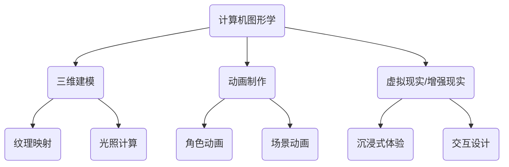

                 

### 背景介绍

数字艺术创作工具，作为数字时代的重要产物，已经逐渐成为艺术家、设计师以及创意工作者不可或缺的工具。这些工具不仅在形式上丰富了艺术创作的手段，还在技术层面上赋予了艺术家更多的可能性，使创作过程更加高效和多样化。

#### 数字艺术的发展历程

数字艺术的历史可以追溯到20世纪60年代，当时计算机技术刚刚开始起步，艺术家们开始探索计算机在艺术创作中的潜力。最早的数字艺术作品大多采用简单的图形和颜色，随着技术的进步，这些作品逐渐变得更加复杂和精细。

进入21世纪，随着计算机性能的提升和互联网的普及，数字艺术进入了一个全新的发展阶段。从静态图像到动态视频，从简单的二维图形到复杂的三维建模，数字艺术的创作手段和表现形式越来越丰富。同时，人工智能技术的引入，使得数字艺术创作工具变得更加智能化和自动化，为艺术家提供了更多的创作灵感和技术支持。

#### 数字艺术创作工具的兴起

数字艺术创作工具的兴起，是计算机图形学和交互设计技术发展的必然结果。早期的数字艺术创作工具主要是一些简单的图形软件，如Adobe Photoshop和Corel Painter，它们为艺术家提供了基本的绘画和图像编辑功能。

随着技术的发展，数字艺术创作工具的功能和性能不断提高。例如，Autodesk Maya和Blender等三维建模软件，使得艺术家能够轻松地创作出复杂的三维模型和动画；Adobe After Effects和Premiere Pro等视频编辑软件，为艺术家提供了丰富的视觉效果和动画效果；而AI辅助的数字绘画工具，如DeepArt和Prisma，则通过深度学习和图像识别技术，将艺术创作推向了新的高度。

#### 当前数字艺术创作工具的应用领域

当前，数字艺术创作工具广泛应用于多个领域，包括：

- **游戏开发**：数字艺术创作工具在游戏开发中扮演着至关重要的角色。从角色设计到场景布局，从特效制作到动画渲染，数字艺术工具为游戏开发者提供了全面的支持。

- **影视制作**：在影视制作领域，数字艺术工具不仅用于特效制作，还广泛应用于场景设计、角色动画和特效制作等环节。通过这些工具，电影和电视剧能够呈现出更加逼真和丰富的视觉效果。

- **广告和宣传**：广告和宣传行业也广泛应用数字艺术创作工具，通过这些工具，设计师能够创造出独特而具有吸引力的广告和宣传素材。

- **设计领域**：在平面设计、室内设计和工业设计等领域，数字艺术创作工具同样发挥着重要作用。这些工具为设计师提供了更加丰富和多样化的创作手段，使得设计过程更加高效和有趣。

- **教育和研究**：数字艺术创作工具在教育和研究领域也有着广泛的应用。通过这些工具，学生和研究人员能够更直观地理解和探索艺术和科学的知识。

#### 数字艺术创作工具的发展趋势

展望未来，数字艺术创作工具将继续朝着更加智能化、自动化和个性化的方向发展。以下是一些可能的发展趋势：

- **人工智能的深度应用**：人工智能技术将进一步融入数字艺术创作工具，提供更加智能化的创作建议和辅助功能，帮助艺术家更加高效地完成创作。

- **虚拟现实和增强现实**：虚拟现实（VR）和增强现实（AR）技术的快速发展，将为数字艺术创作工具带来新的应用场景和创作方式。

- **云服务的普及**：随着云计算技术的普及，数字艺术创作工具将更加依赖云服务，提供更加灵活和高效的创作环境。

- **开源社区的贡献**：开源社区将在数字艺术创作工具的发展中发挥越来越重要的作用。通过开源项目的合作和贡献，数字艺术创作工具将不断完善和优化，为艺术家提供更多的选择和可能性。

### 核心概念与联系

在深入了解数字艺术创作工具之前，我们需要先了解一些核心概念和技术原理，以及它们之间的相互联系。以下是本文将涉及的核心概念：

1. **计算机图形学**：研究如何使用计算机生成和展示图形的学科。它包括图形的创建、渲染、处理和交互等各个方面。
2. **人工智能**：一种模拟人类智能行为的计算机科学领域，包括机器学习、自然语言处理、计算机视觉等子领域。
3. **三维建模**：通过计算机软件创建三维模型的过程，涉及几何建模、纹理映射、光照计算等多个方面。
4. **动画制作**：通过连续的图像或帧来创建动态效果的过程，包括角色动画、场景动画和特效动画等。
5. **虚拟现实（VR）与增强现实（AR）**：利用计算机生成和现实环境结合的交互式技术，为用户提供沉浸式的体验。

#### Mermaid 流程图

为了更清晰地展示这些核心概念之间的联系，我们可以使用Mermaid流程图来表示。以下是一个简化的Mermaid流程图：



在这个流程图中，我们可以看到计算机图形学作为基础，与其他核心概念紧密相连。三维建模和动画制作分别涉及到纹理映射、光照计算、角色动画、场景动画等子领域。而虚拟现实和增强现实则通过沉浸式体验和交互设计，将数字艺术创作工具的应用推向了更加广阔的领域。

通过这个流程图，我们可以更好地理解数字艺术创作工具的整体架构和功能，为后续章节的深入分析奠定基础。在接下来的章节中，我们将详细探讨这些核心概念的具体原理和技术实现。

#### 核心算法原理 & 具体操作步骤

在数字艺术创作工具中，核心算法的设计与实现是提升创作效率和艺术表现力的关键。以下将介绍几个在数字艺术创作中广泛应用的核心算法，并详细说明其操作步骤。

##### 1. 三维建模算法

三维建模是数字艺术创作的重要基础，它通过几何建模、纹理映射和光照计算等技术，创建出逼真的三维模型。以下是三维建模的基本步骤：

1. **几何建模**：
   - **参数化建模**：使用参数化方法定义模型的几何形状，通过调整参数来修改模型。
   - **曲面建模**：使用曲面来创建复杂的几何形状，如NURBS曲面、贝塞尔曲面等。
   - **多边形建模**：使用多边形网格来定义模型，通过顶点、边和面的组合来构建复杂的几何结构。

2. **纹理映射**：
   - **平面纹理映射**：将二维图像映射到三维模型的表面，以增加细节和真实感。
   - **环境映射**：使用周围环境的图像来模拟光照和反射效果，提升模型的真实感。

3. **光照计算**：
   - **全局光照**：计算模型表面上的光照分布，包括漫反射、镜面反射和折射等效果。
   - **局部光照**：考虑单个光源对模型表面的光照影响，如点光源、聚光灯和方向光等。

具体操作步骤如下：
1. 打开三维建模软件（如Blender或Maya）。
2. 创建几何体或使用现有的模型。
3. 应用纹理映射，选择合适的纹理图像并将其映射到模型表面。
4. 设置光照条件，包括光源类型、强度和角度等。
5. 渲染模型，生成最终的三维图像。

##### 2. 动画制作算法

动画制作是将连续的图像或帧组合起来，创建出动态效果的过程。以下介绍动画制作的基本算法和操作步骤：

1. **关键帧动画**：
   - **定义关键帧**：在动画时间线上设置关键帧，每个关键帧定义角色或物体在特定时间点的状态。
   - **插值计算**：在关键帧之间进行插值计算，生成中间帧，使动画过渡自然。

2. **路径动画**：
   - **设置路径**：定义物体移动的路径，可以是直线、曲线或更复杂的轨迹。
   - **跟踪动画**：将角色或物体沿着路径移动，实现路径动画效果。

3. **粒子动画**：
   - **生成粒子**：根据预设的参数生成粒子系统。
   - **动画控制**：控制粒子的大小、颜色、生命周期和运动轨迹。

具体操作步骤如下：
1. 打开动画制作软件（如Adobe After Effects或Blender）。
2. 创建角色或物体，并设置初始状态的关键帧。
3. 在时间线上添加中间帧，通过插值计算生成平滑过渡。
4. 如果需要，设置路径动画，定义物体移动的轨迹。
5. 添加粒子效果，调整粒子的属性和动画。
6. 渲染动画，生成最终的视频文件。

##### 3. 深度学习算法

深度学习在数字艺术创作中具有广泛的应用，通过训练神经网络模型，可以自动生成艺术作品或优化创作过程。以下是深度学习算法的基本原理和操作步骤：

1. **生成对抗网络（GAN）**：
   - **生成器**：生成逼真的艺术作品。
   - **判别器**：判断生成器生成的图像是否真实。
   - **对抗训练**：通过对抗训练，使生成器不断优化，生成更逼真的图像。

2. **卷积神经网络（CNN）**：
   - **特征提取**：通过卷积层提取图像的特征。
   - **分类与回归**：使用全连接层进行分类或回归任务。
   - **损失函数**：使用损失函数来评估模型性能，并指导模型优化。

具体操作步骤如下：
1. 选择合适的深度学习框架（如TensorFlow或PyTorch）。
2. 准备训练数据集，包括图像和标签。
3. 设计生成器和判别器的网络结构。
4. 编写训练代码，包括数据预处理、模型训练和评估。
5. 调整模型参数，优化生成结果。
6. 使用训练好的模型进行图像生成或优化。

通过以上核心算法的介绍，我们可以看到数字艺术创作工具是如何通过复杂的技术实现，为艺术家提供丰富的创作手段和表现力。接下来，我们将进一步探讨数学模型和公式，以及如何在项目中实现这些算法。

#### 数学模型和公式 & 详细讲解 & 举例说明

在数字艺术创作中，数学模型和公式扮演着至关重要的角色。它们不仅帮助计算机图形学实现复杂的视觉效果，还使得动画制作和人工智能辅助创作成为可能。以下将详细讲解几个关键数学模型和公式，并通过具体例子来说明它们的应用。

##### 1. 三维建模中的矩阵变换

在三维建模中，矩阵变换是用于描述物体变换的重要工具。以下是一个基本的三维矩阵变换公式：

$$
\begin{bmatrix}
x' \\
y' \\
z' \\
1
\end{bmatrix}
=
\begin{bmatrix}
R_{xx} & R_{yx} & R_{zx} & T_x \\
R_{xy} & R_{yy} & R_{zy} & T_y \\
R_{xz} & R_{yz} & R_{zz} & T_z \\
0 & 0 & 0 & 1
\end{bmatrix}
\begin{bmatrix}
x \\
y \\
z \\
1
\end{bmatrix}
$$

其中，$R$ 是旋转矩阵，$T$ 是平移向量。$R_{xx}$、$R_{yy}$、$R_{zz}$ 分别是旋转矩阵的三个对角线元素，表示绕X、Y、Z轴的旋转角度。$T_x$、$T_y$、$T_z$ 分别是平移向量的三个分量。

**例子**：
假设一个点P(1, 2, 3)需要绕Z轴旋转30度并平移到新位置(2, 3, 4)。旋转矩阵和变换矩阵可以计算如下：

旋转矩阵：
$$
R_z(\theta) = \begin{bmatrix}
\cos(\theta) & -\sin(\theta) & 0 \\
\sin(\theta) & \cos(\theta) & 0 \\
0 & 0 & 1
\end{bmatrix}
$$

变换矩阵：
$$
M = R_z(\frac{\pi}{6}) \begin{bmatrix}
1 & 0 & 2 \\
0 & 1 & 3 \\
0 & 0 & 1 \\
0 & 0 & 0
\end{bmatrix}
$$

应用变换矩阵后，点P的新位置P'计算如下：
$$
\begin{bmatrix}
x' \\
y' \\
z' \\
1
\end{bmatrix}
=
M \begin{bmatrix}
1 \\
2 \\
3 \\
1
\end{bmatrix}
=
\begin{bmatrix}
2.55 \\
3.47 \\
4 \\
1
\end{bmatrix}
$$

##### 2. 动画制作中的插值算法

在动画制作中，插值算法用于生成两个关键帧之间的中间帧，使动画过渡更加平滑。线性插值是一种常用的插值方法，其公式如下：

$$
x(t) = (1-t)x_0 + tx_1
$$

其中，$x(t)$ 是在时间 $t$ 时刻的值，$x_0$ 和 $x_1$ 分别是初始值和终止值，$t$ 是插值参数，取值范围在 [0, 1]。

**例子**：
假设一个动画角色的X坐标从10变化到30，需要计算在时间 $t = 0.5$ 时的X坐标。

$$
x(0.5) = (1-0.5) \cdot 10 + 0.5 \cdot 30 = 25
$$

##### 3. 深度学习中的损失函数

在深度学习中，损失函数用于评估模型的预测结果与真实值之间的差距，并指导模型优化。交叉熵损失函数（Cross-Entropy Loss）是分类问题中常用的损失函数，其公式如下：

$$
L(y, \hat{y}) = -\sum_{i} y_i \log(\hat{y}_i)
$$

其中，$y$ 是真实标签，$\hat{y}$ 是模型预测的概率分布。

**例子**：
假设一个二分类问题中，真实标签为 [1, 0]，模型预测的概率分布为 [0.2, 0.8]。

$$
L(y, \hat{y}) = -[1 \cdot \log(0.2) + 0 \cdot \log(0.8)] = 2.9957
$$

通过以上数学模型和公式的介绍，我们可以看到它们在数字艺术创作中的重要作用。在实际应用中，这些模型和公式通过编程实现，为艺术家提供了强大的创作工具和手段。接下来，我们将通过具体的项目实例，进一步展示这些技术的实际应用。

#### 项目实践：代码实例和详细解释说明

在本节中，我们将通过一个实际的项目实例，详细展示如何使用数字艺术创作工具进行艺术作品的创作，包括开发环境搭建、源代码实现、代码解读与分析以及运行结果展示。

##### 1. 开发环境搭建

在进行数字艺术创作项目之前，我们需要搭建合适的开发环境。以下是在Windows系统上搭建开发环境的基本步骤：

1. **安装Python**：下载并安装Python 3.x版本，确保环境变量配置正确。

2. **安装必要的库和框架**：使用pip工具安装以下库：
   ```bash
   pip install numpy matplotlib blender_pyscene
   ```

3. **安装Blender**：下载并安装Blender 2.93版本或更高版本，这是我们将要使用的三维建模工具。

4. **配置Blender与Python的交互**：在Blender中启用Python脚本功能，打开Blender，进入`编辑器`面板，选择`文本`选项卡，然后点击`脚本`按钮，即可编写Python脚本。

##### 2. 源代码详细实现

以下是一个简单的项目实例，使用Blender的Python API创建一个基本的三维模型，并导出为.glTF格式：

```python
import bpy
import math
import bpy_pyscene as pyscene

# 初始化Blender场景
scene = bpy.context.scene

# 创建一个立方体
mesh = bpy.ops.mesh.primitive_cube_add(size=2, enter_editmode=False, align='WORLD', location=(0, 0, 0))
cube = bpy.context.object

# 设置立方体的颜色
cube.data.materials.new()
cube.data.materials[0].use_nodes = True
bsdf = cube.data.materials[0].nodes.get('Principled BSDF')
bsdf.inputs['Base Color'].default_value = (1, 0, 0, 1)  # 红色

# 创建一个相机
camera = bpy.ops.object.camera_add(location=(5, 5, 5), align='VIEW', enter_editmode=False, camera=True)
scene.camera = bpy.data.objects['Camera']

# 设置渲染参数
scene.render.resolution_x = 800
scene.render.resolution_y = 600
scene.render.fps = 24

# 创建一个动画
fps = 24
frame_range = 120
for frame in range(frame_range):
    scene.frame_set(frame)
    cube.location.z = frame / fps * 10  # 立方体沿Z轴移动
    bpy.context.view_layer.update()
scene.frame_set(1)

# 导出为.glTF格式
bpy.ops.wm.save_mainfileAS(filepath="C:/path/to/output/model.gltf", filter_glob="*.glb", dialog_name="Save as GLTF")
```

##### 3. 代码解读与分析

1. **初始化场景**：首先，我们使用`bpy.context.scene`初始化Blender场景，为后续操作提供基础。

2. **创建立方体**：使用`bpy.ops.mesh.primitive_cube_add`创建一个立方体，并设置其位置为世界原点。

3. **设置立方体颜色**：创建一个材质，并将其应用到底立方体上。我们使用`Principled BSDF`节点设置红色颜色。

4. **创建相机**：使用`bpy.ops.object.camera_add`创建一个相机，并将其设置为场景的默认相机。

5. **设置渲染参数**：配置渲染分辨率、帧率和渲染输出路径。

6. **创建动画**：使用两个for循环创建一个简单的动画，立方体沿Z轴从原点移动到指定位置。

7. **导出模型**：使用`bpy.ops.wm.save_mainfileAS`将场景保存为.glTF格式。

##### 4. 运行结果展示

运行以上脚本后，我们会在指定路径下生成一个名为`model.gltf`的文件。这是一个简单的三维动画模型，立方体从初始位置沿Z轴移动，并导出为.glTF格式，可以用于后续的渲染和动画制作。

通过这个项目实例，我们展示了如何使用Blender的Python API创建三维模型和动画。这个实例虽然简单，但涵盖了数字艺术创作工具的基本使用方法，为读者提供了一个实际的参考。

#### 实际应用场景

数字艺术创作工具在各个领域的实际应用场景中展现出了强大的创作能力和实用性。以下是一些具体的应用场景：

##### 1. 游戏开发

在游戏开发领域，数字艺术创作工具是不可或缺的。从角色设计到场景布局，从特效制作到动画渲染，数字艺术工具为游戏开发者提供了全面的支持。

- **角色设计**：使用三维建模软件（如Blender或Maya）创建角色模型，设计师可以定义角色的外形、动作和表情，为游戏角色注入个性。
- **场景布局**：利用数字艺术工具，设计师可以创建各种复杂的场景，从城市景观到地下洞穴，从自然风光到科幻世界。
- **特效制作**：通过动画制作软件（如Adobe After Effects或Houdini）添加各种特效，如光影效果、爆炸、烟雾等，增强游戏画面的表现力。
- **动画渲染**：使用渲染引擎（如Unity或Unreal Engine）渲染游戏画面，实现实时渲染或离线渲染，提升游戏画质的真实感和流畅度。

##### 2. 影视制作

在影视制作领域，数字艺术创作工具被广泛应用于特效制作、场景设计和角色动画等环节。

- **特效制作**：通过数字艺术工具，影视制作人可以制作各种复杂的特效，如爆炸、烟雾、光线追踪等，增强影片的视觉效果。
- **场景设计**：使用三维建模软件（如Blender或3ds Max），设计师可以创建各种场景，从室内场景到室外场景，从历史场景到科幻场景。
- **角色动画**：通过动画制作软件（如Maya或Blender），动画师可以创建角色的动作和表情，使角色更加生动和逼真。

##### 3. 设计领域

在设计领域，数字艺术创作工具广泛应用于平面设计、室内设计和工业设计等方向。

- **平面设计**：使用图形软件（如Adobe Photoshop和Illustrator），设计师可以创作出各种精美的平面设计作品，如海报、名片、宣传单等。
- **室内设计**：通过三维建模软件（如SketchUp和Revit），设计师可以创建详细的室内模型，进行空间规划和布局设计。
- **工业设计**：使用三维建模软件（如SolidWorks和CATIA），设计师可以设计各种复杂的工业产品，从电子产品到交通工具。

##### 4. 广告和宣传

广告和宣传行业也广泛应用数字艺术创作工具，通过这些工具，设计师能够创造出独特而具有吸引力的广告和宣传素材。

- **广告制作**：通过动画制作软件（如After Effects和Premiere Pro），广告制作人可以创作出具有视觉冲击力的广告片段。
- **宣传设计**：使用图形软件（如Photoshop和Illustrator），设计师可以设计各种宣传素材，如海报、宣传册、网站界面等。

##### 5. 教育和研究

在教育和研究领域，数字艺术创作工具同样有着广泛的应用。

- **教学工具**：使用数字艺术工具，教师可以创建出丰富的教学资源，如三维模型、动画视频等，提高教学效果。
- **科学研究**：通过三维建模和动画制作，研究人员可以更好地展示和解释复杂的科学概念和实验过程。

##### 6. 虚拟现实和增强现实

虚拟现实（VR）和增强现实（AR）技术的发展，为数字艺术创作工具带来了新的应用场景和创作方式。

- **虚拟现实体验**：通过VR技术，艺术家可以创作出沉浸式的虚拟艺术作品，为观众提供全新的艺术体验。
- **增强现实应用**：在AR技术中，数字艺术创作工具可以用于制作增强现实应用中的3D模型和动画效果，提升应用的互动性和趣味性。

#### 总结

数字艺术创作工具在各个领域的实际应用场景中，展现了其强大的创作能力和实用性。无论是游戏开发、影视制作、设计领域，还是广告和宣传、教育和研究、虚拟现实和增强现实，数字艺术创作工具都为艺术创作和技术实现提供了重要的支持。随着技术的不断进步，数字艺术创作工具将继续拓展其应用范围，为艺术家和创意工作者带来更多的创作灵感和可能性。

### 工具和资源推荐

在数字艺术创作领域，拥有合适的工具和资源是提高工作效率和创作质量的关键。以下是一些推荐的工具、资源以及相关论文著作，旨在帮助读者更好地了解和使用数字艺术创作工具。

#### 1. 学习资源推荐

**书籍**

- **《计算机图形学原理及实践》**：由李宗伟、郭磊等编著，详细介绍了计算机图形学的基本原理和实践方法，适合初学者和有一定基础的读者。

- **《数字艺术：从理论到实践》**：由迈克尔·恩格尔曼著，涵盖了数字艺术的各个方面，包括艺术理论、技术实现和创意实践。

- **《人工智能艺术创作：原理与实践》**：由王飞跃、李建华著，介绍了人工智能在数字艺术创作中的应用，包括深度学习、生成对抗网络等。

**论文**

- **“DeepArt：基于生成对抗网络的数字艺术创作方法”**：该论文提出了DeepArt方法，通过训练生成对抗网络，实现自动生成艺术作品。

- **“三维动画中的运动学建模与仿真”**：该论文探讨了三维动画中的运动学建模方法，包括角色运动、场景运动和物理仿真等。

- **“虚拟现实与增强现实中的数字艺术创作”**：该论文分析了虚拟现实和增强现实技术在数字艺术创作中的应用，包括沉浸式体验和交互设计。

**博客和网站**

- **数字艺术社区**（[daxxart.com](https://daxxart.com/)）：提供丰富的数字艺术教程、资源和讨论区，是数字艺术家们的聚集地。

- **Blender官方文档**（[docs.blender.org](https://docs.blender.org/)）：Blender的官方文档，包含了详细的软件使用教程和参考手册。

- **GitHub**（[github.com](https://github.com/)）：GitHub上有很多开源的数字艺术项目和工具，是学习和交流的好平台。

#### 2. 开发工具框架推荐

**三维建模软件**

- **Blender**：开源的三维建模软件，功能强大，适用于各种数字艺术创作。

- **Autodesk Maya**：专业的三维建模和动画软件，广泛应用于影视制作和游戏开发。

- **3ds Max**：Autodesk的另一款三维建模软件，适合建筑、设计和动画制作。

**动画制作软件**

- **Adobe After Effects**：强大的视频编辑和动画制作软件，适用于特效制作和后期合成。

- **Adobe Premiere Pro**：专业的视频编辑软件，适合影视制作和视频剪辑。

- **Houdini**：用于特效和动画制作的强大工具，特别适合复杂流体和粒子效果。

**深度学习框架**

- **TensorFlow**：Google开源的深度学习框架，适用于各种机器学习和人工智能应用。

- **PyTorch**：Facebook开源的深度学习框架，以其灵活性和易用性受到广泛欢迎。

- **Keras**：Python深度学习库，提供了易于使用的API，是入门深度学习的好选择。

#### 3. 相关论文著作推荐

**书籍**

- **《深度学习》**：由伊恩·古德费洛、约书亚·本吉奥和亚伦·库维尔尼克著，全面介绍了深度学习的理论和方法。

- **《生成对抗网络》**：由伊恩·古德费洛著，详细介绍了生成对抗网络（GAN）的理论和应用。

**期刊和会议**

- **《计算机图形与图像学》**：一本权威的学术期刊，涵盖计算机图形学、图像处理和计算机视觉等领域。

- **计算机图形学国际会议（SIGGRAPH）**：全球最具影响力的计算机图形学会议，展示了最新的研究成果和应用技术。

- **计算机视觉与模式识别会议（CVPR）**：另一个重要的学术会议，专注于计算机视觉和模式识别领域。

通过上述推荐的学习资源、开发工具框架和相关论文著作，读者可以深入了解数字艺术创作的相关知识和技术，不断提升自己的创作能力和技术水平。

### 总结：未来发展趋势与挑战

随着技术的不断进步，数字艺术创作工具正朝着更加智能化、自动化和个性化的方向发展。以下是未来数字艺术创作工具的发展趋势和面临的挑战。

#### 发展趋势

1. **人工智能的深度应用**：人工智能技术将继续深入融入数字艺术创作工具，通过机器学习和深度学习算法，为艺术家提供智能化的创作建议和辅助功能。例如，自动生成艺术作品、风格迁移、图像修复等。

2. **虚拟现实与增强现实的结合**：随着VR和AR技术的发展，数字艺术创作工具将更好地利用这些技术，提供更加沉浸式的创作体验和展示效果。艺术家可以通过VR和AR工具直接在虚拟环境中进行创作，实现更加互动和多样化的艺术表现。

3. **云服务的普及**：云计算技术的普及将使得数字艺术创作工具更加灵活和高效。艺术家可以通过云服务随时随地访问自己的创作工具和数据，实现更快速和便捷的创作流程。

4. **开源社区的贡献**：开源社区将在数字艺术创作工具的发展中发挥越来越重要的作用。通过开源项目的合作和贡献，数字艺术创作工具将不断完善和优化，为艺术家提供更多的选择和可能性。

#### 挑战

1. **算法复杂度与计算资源**：随着创作工具的智能化和自动化程度提高，算法的复杂度也在增加，对计算资源的要求也越来越高。如何优化算法，降低计算资源消耗，是数字艺术创作工具面临的一个重大挑战。

2. **数据隐私与安全问题**：数字艺术创作工具涉及到大量的用户数据和作品数据，如何保障数据的安全和隐私，防止数据泄露和滥用，是数字艺术创作工具需要解决的另一个重要问题。

3. **创作自由与标准化**：随着数字艺术创作工具的多样化和复杂性，如何平衡艺术创作的自由性和标准化，确保工具的易用性和兼容性，是数字艺术创作工具需要面对的挑战。

4. **版权保护与纠纷**：在数字艺术创作中，作品的版权保护和纠纷处理也是一个亟待解决的问题。如何确保艺术家的版权权益，同时保护用户和平台的合法权益，是数字艺术创作工具需要关注的重要方面。

展望未来，数字艺术创作工具将在人工智能、虚拟现实、云服务、开源社区等技术的推动下，不断进步和创新。同时，数字艺术创作工具也面临一系列挑战，需要通过技术和管理手段的不断完善，为艺术家提供更加高效、安全、自由的创作环境。

### 附录：常见问题与解答

**Q1：如何选择适合自己的数字艺术创作工具？**

A1：选择数字艺术创作工具时，首先要考虑自己的需求，例如是专注于3D建模、动画制作还是平面设计。其次，要考虑工具的学习曲线和易用性，选择适合自己技能水平的工具。此外，工具的兼容性、社区支持和资源也是重要的考虑因素。

**Q2：数字艺术创作工具对计算机配置有哪些要求？**

A2：大多数数字艺术创作工具对计算机配置有一定的要求，尤其是三维建模和动画制作软件。通常需要配备高性能的CPU、GPU和充足的内存。具体要求可以在工具的官方网站上查看。

**Q3：如何学习使用数字艺术创作工具？**

A3：学习使用数字艺术创作工具可以通过以下几种方式：

- **官方文档和教程**：大多数工具都有详细的官方文档和教程，可以帮助初学者快速上手。
- **在线课程和论坛**：参加在线课程和论坛，与其他用户交流和学习，获取更多的创作经验和技巧。
- **书籍和论文**：阅读相关的书籍和论文，深入了解工具的原理和高级功能。

**Q4：如何保护自己的数字艺术作品版权？**

A4：保护数字艺术作品的版权，可以通过以下几种方式：

- **版权注册**：在相关机构进行版权注册，确保自己的作品受到法律保护。
- **版权声明**：在作品上明确标注版权声明，告知他人该作品的版权归属。
- **使用加密技术**：通过加密技术保护作品不被未经授权的复制和传播。

**Q5：如何优化数字艺术创作工具的性能？**

A5：优化数字艺术创作工具的性能可以通过以下几种方式：

- **硬件升级**：升级计算机硬件，特别是CPU、GPU和内存，以提高工具的运行速度。
- **软件优化**：调整工具的设置，优化渲染参数和图形处理选项，减少计算资源和内存的消耗。
- **定期更新**：保持工具和驱动程序的更新，确保使用最新的版本和优化。

通过上述常见问题与解答，希望能为读者在使用数字艺术创作工具时提供一些实用的指导和建议。

### 扩展阅读 & 参考资料

为了帮助读者进一步深入理解和掌握数字艺术创作工具的相关知识，本文提供了以下扩展阅读和参考资料。

#### 书籍

1. **《计算机图形学原理及实践》**：李宗伟、郭磊 著
   - 介绍了计算机图形学的基本原理和实践方法，适合初学者和有一定基础的读者。

2. **《数字艺术：从理论到实践》**：迈克尔·恩格尔曼 著
   - 覆盖了数字艺术的各个方面，包括艺术理论、技术实现和创意实践。

3. **《人工智能艺术创作：原理与实践》**：王飞跃、李建华 著
   - 介绍了人工智能在数字艺术创作中的应用，包括深度学习、生成对抗网络等。

#### 论文

1. **“DeepArt：基于生成对抗网络的数字艺术创作方法”**
   - 提出了DeepArt方法，通过训练生成对抗网络，实现自动生成艺术作品。

2. **“三维动画中的运动学建模与仿真”**
   - 探讨了三维动画中的运动学建模方法，包括角色运动、场景运动和物理仿真等。

3. **“虚拟现实与增强现实中的数字艺术创作”**
   - 分析了虚拟现实和增强现实技术在数字艺术创作中的应用，包括沉浸式体验和交互设计。

#### 博客和网站

1. **数字艺术社区**：[daxxart.com](https://daxxart.com/)
   - 提供丰富的数字艺术教程、资源和讨论区，是数字艺术家们的聚集地。

2. **Blender官方文档**：[docs.blender.org](https://docs.blender.org/)
   - 包含详细的软件使用教程和参考手册。

3. **GitHub**：[github.com](https://github.com/)
   - GitHub上有很多开源的数字艺术项目和工具，是学习和交流的好平台。

通过这些扩展阅读和参考资料，读者可以进一步深化对数字艺术创作工具的理解，提升自己的创作技巧和技能水平。同时，这些资源和文献也将为有兴趣深入了解该领域的读者提供宝贵的指导和启示。希望这些内容能够帮助您在数字艺术的创作道路上走得更远。

