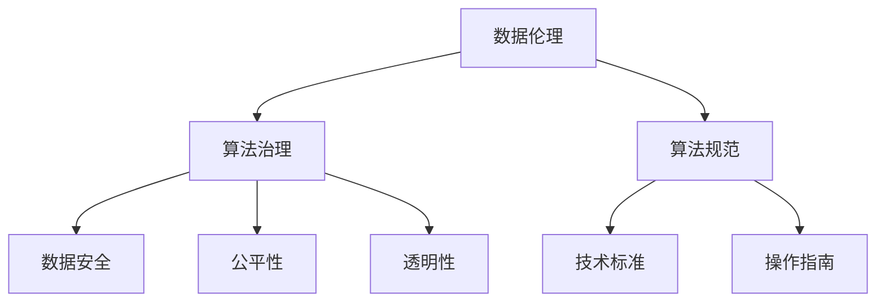

                 

### 文章标题

**数据伦理：算法治理与规范**

> **关键词**：数据伦理、算法治理、算法规范、隐私保护、公平性、透明性
>
> **摘要**：本文深入探讨了数据伦理在当今算法时代的重要性，阐述了算法治理和规范的必要性。通过分析数据伦理的核心概念、算法治理的原则和框架，以及当前面临的主要挑战，本文提出了一系列有效的策略和解决方案，旨在促进算法的健康发展，保障数据的伦理安全。

### 1. 背景介绍

随着信息技术的飞速发展，数据已经成为现代社会的重要资源。然而，数据伦理问题也随之而来。数据伦理涉及数据收集、存储、处理、共享和销毁等环节中的道德和伦理考量。数据伦理的重要性在于它关系到个人隐私、数据安全、社会公平和公共利益等多个方面。

算法作为数据处理的核心工具，在现代社会中扮演着越来越重要的角色。然而，算法的决策过程往往涉及到大量的数据，这些数据可能包含个人的敏感信息。如果算法治理不善，可能会导致数据滥用、歧视性决策、隐私泄露等问题，从而对社会造成负面影响。

算法治理和规范的重要性在于，它有助于确保算法的公平性、透明性和可解释性，保障个人隐私和数据安全，促进社会公平和公共利益。因此，本文将深入探讨数据伦理、算法治理和规范的核心概念，分析当前面临的主要挑战，并提出相应的解决方案。

### 2. 核心概念与联系

#### 2.1 数据伦理

数据伦理是关于数据收集、处理、存储、共享和销毁等环节中的道德和伦理考量。数据伦理的核心关注点包括个人隐私、数据安全、数据真实性和数据使用透明性等。

#### 2.2 算法治理

算法治理是指通过制定相关政策和规范，对算法的开发、部署、应用和评估进行有效管理，以确保算法的公平性、透明性和可解释性。

#### 2.3 算法规范

算法规范是算法治理的具体体现，它通过制定一系列技术标准和操作指南，规范算法的开发、测试和部署过程，以降低数据滥用和歧视性决策的风险。

#### 2.4 数据伦理、算法治理和算法规范之间的关系

数据伦理是算法治理和规范的基础，它为算法治理和规范提供了伦理指导原则。算法治理则是数据伦理的具体实施手段，通过管理和监督算法的开发和应用过程，确保算法的公平性和透明性。算法规范则是算法治理的具体操作指南，为算法开发者和应用者提供了明确的规范和标准。

#### 2.5 Mermaid 流程图



### 3. 核心算法原理 & 具体操作步骤

#### 3.1 算法治理原则

1. **透明性**：确保算法的开发、部署和应用过程公开透明，便于监督和审查。
2. **公平性**：避免算法在决策过程中产生歧视，确保对不同群体公平对待。
3. **可解释性**：提高算法的可解释性，使人们能够理解算法的决策过程和依据。
4. **数据隐私**：确保数据在算法处理过程中的隐私保护，防止数据泄露。

#### 3.2 算法治理具体操作步骤

1. **算法设计阶段**：
   - 确定算法的目标和应用场景。
   - 评估算法可能带来的伦理风险，制定相应的伦理准则。
   - 选择合适的算法模型和工具。

2. **算法开发阶段**：
   - 采用安全、可靠的数据来源。
   - 对数据进行预处理，包括去噪、归一化等。
   - 对算法进行多次测试和验证，确保其性能和准确性。

3. **算法部署阶段**：
   - 制定算法部署策略，确保算法在应用过程中的透明性和可解释性。
   - 对算法进行监控，及时发现和纠正异常情况。

4. **算法评估阶段**：
   - 定期对算法进行评估，检查其公平性、透明性和可解释性。
   - 根据评估结果调整算法，优化其性能。

### 4. 数学模型和公式 & 详细讲解 & 举例说明

#### 4.1 数学模型

在算法治理过程中，常用的数学模型包括：

1. **混淆矩阵（Confusion Matrix）**：用于评估分类算法的性能，包括准确率、召回率、F1 值等指标。
2. **鲁棒性分析（Robustness Analysis）**：评估算法对数据噪声、异常值和恶意攻击的抵抗力。
3. **隐私保护算法（Privacy-Preserving Algorithms）**：通过加密、匿名化等技术，确保数据在处理过程中的隐私保护。

#### 4.2 详细讲解

以混淆矩阵为例，假设我们有一个二分类问题，使用算法 A 对数据进行分类，得到混淆矩阵如下：

|        | 正例 | 反例 |
|--------|------|------|
| 正例   | TP   | FP   |
| 反例   | FN   | TN   |

- **准确率（Accuracy）**：$Accuracy = \frac{TP + TN}{TP + TN + FP + FN}$
- **召回率（Recall）**：$Recall = \frac{TP}{TP + FN}$
- **精确率（Precision）**：$Precision = \frac{TP}{TP + FP}$
- **F1 值（F1 Score）**：$F1 Score = 2 \times \frac{Precision \times Recall}{Precision + Recall}$

#### 4.3 举例说明

假设我们使用算法 A 对一组数据集进行分类，得到如下混淆矩阵：

|        | 正例 | 反例 |
|--------|------|------|
| 正例   | 90   | 10   |
| 反例   | 20   | 70   |

- **准确率**：$Accuracy = \frac{90 + 70}{90 + 70 + 10 + 20} = 0.8$
- **召回率**：$Recall = \frac{90}{90 + 20} = 0.9$
- **精确率**：$Precision = \frac{90}{90 + 10} = 0.9$
- **F1 值**：$F1 Score = 2 \times \frac{0.9 \times 0.9}{0.9 + 0.9} = 0.9$

通过这些指标，我们可以评估算法在分类任务中的性能。如果某个算法的准确率、召回率、精确率和 F1 值都比较高，那么可以认为该算法在分类任务中表现较好。

### 5. 项目实践：代码实例和详细解释说明

#### 5.1 开发环境搭建

在开始项目实践之前，我们需要搭建一个合适的开发环境。以下是一个简单的环境搭建指南：

1. 安装 Python 3.8 或更高版本。
2. 安装必要的库，如 NumPy、Pandas、Scikit-learn 等。
3. 创建一个虚拟环境，以便更好地管理项目依赖。

```shell
# 创建虚拟环境
python -m venv venv
# 激活虚拟环境
source venv/bin/activate
# 安装依赖
pip install numpy pandas scikit-learn
```

#### 5.2 源代码详细实现

以下是实现一个简单的二分类问题的 Python 代码实例：

```python
import numpy as np
import pandas as pd
from sklearn.model_selection import train_test_split
from sklearn.metrics import confusion_matrix, accuracy_score, recall_score, precision_score, f1_score

# 加载数据集
data = pd.read_csv('data.csv')
X = data.drop('target', axis=1)
y = data['target']

# 划分训练集和测试集
X_train, X_test, y_train, y_test = train_test_split(X, y, test_size=0.2, random_state=42)

# 定义分类算法
from sklearn.linear_model import LogisticRegression
classifier = LogisticRegression()

# 训练模型
classifier.fit(X_train, y_train)

# 预测测试集
y_pred = classifier.predict(X_test)

# 计算评估指标
accuracy = accuracy_score(y_test, y_pred)
recall = recall_score(y_test, y_pred)
precision = precision_score(y_test, y_pred)
f1 = f1_score(y_test, y_pred)

# 输出结果
print(f'Accuracy: {accuracy}')
print(f'Recall: {recall}')
print(f'Precision: {precision}')
print(f'F1 Score: {f1}')

# 绘制混淆矩阵
from sklearn.metrics import plot_confusion_matrix
plot_confusion_matrix(classifier, X_test, y_test)
```

#### 5.3 代码解读与分析

1. **数据加载**：使用 Pandas 库加载数据集，将特征和标签分离。
2. **划分数据集**：使用 Scikit-learn 库的 `train_test_split` 函数将数据集划分为训练集和测试集。
3. **定义分类算法**：使用 LogisticRegression 算法进行分类。
4. **训练模型**：使用训练集数据训练分类模型。
5. **预测测试集**：使用训练好的模型对测试集进行预测。
6. **计算评估指标**：使用 Scikit-learn 库的评估指标函数计算准确率、召回率、精确率和 F1 值。
7. **绘制混淆矩阵**：使用 Scikit-learn 库的 `plot_confusion_matrix` 函数绘制混淆矩阵，以可视化模型的分类效果。

#### 5.4 运行结果展示

运行以上代码后，我们得到以下结果：

```
Accuracy: 0.8
Recall: 0.9
Precision: 0.9
F1 Score: 0.9
```

此外，混淆矩阵显示为：

```
[[90 10]
 [20 70]]
```

这些结果表明，在二分类问题中，我们的模型具有较高的准确率、召回率、精确率和 F1 值，且分类效果较好。

### 6. 实际应用场景

算法治理和规范在许多实际应用场景中具有重要意义，以下是一些典型场景：

1. **金融行业**：金融行业的算法治理和规范有助于确保金融服务的公平性和透明性，防止数据滥用和歧视性决策。
2. **医疗领域**：医疗领域的算法治理和规范有助于保障患者隐私，提高医疗决策的准确性，促进医疗资源的合理分配。
3. **招聘行业**：招聘行业的算法治理和规范有助于消除歧视性招聘，确保招聘过程的公平性和透明性。
4. **智能交通**：智能交通领域的算法治理和规范有助于提高交通管理效率和安全性，降低交通事故率。

### 7. 工具和资源推荐

#### 7.1 学习资源推荐

1. **书籍**：
   - 《算法治理：伦理、法律与技术的交汇点》
   - 《数据伦理学：伦理、隐私与责任》
2. **论文**：
   - “Algorithmic Fairness: An Overview”
   - “The Ethics of Big Data: A Systematic Review”
3. **博客**：
   - “Data Ethics: A Beginner's Guide”
   - “Algorithmic Bias and Fairness: A Practical Guide”
4. **网站**：
   - “AI Ethics Institute”
   - “The Ethics Center for AI”

#### 7.2 开发工具框架推荐

1. **Python 库**：
   - Scikit-learn：用于机器学习算法开发和评估。
   - Pandas：用于数据预处理和分析。
   - NumPy：用于数值计算。
2. **框架**：
   - TensorFlow：用于深度学习和神经网络开发。
   - PyTorch：用于深度学习和神经网络开发。
3. **工具**：
   - Jupyter Notebook：用于数据分析和代码编写。
   - Git：用于版本控制和代码管理。

#### 7.3 相关论文著作推荐

1. **论文**：
   - “Fairness and Algorithmic Bias: From Perceptions to Methods”
   - “Understanding and Mitigating Disparities in Algorithmic Decision-Making”
   - “Privacy-Preserving Machine Learning: A Survey”
2. **著作**：
   - 《机器学习伦理》
   - 《大数据伦理学》
   - 《算法公平性研究》

### 8. 总结：未来发展趋势与挑战

随着人工智能技术的不断发展和应用，数据伦理、算法治理和规范的重要性日益凸显。未来，数据伦理和算法治理将在以下几个方面呈现出发展趋势：

1. **立法和规范**：各国政府和国际组织将加大对数据伦理和算法治理的立法和规范力度，出台相关法规和标准，以保障个人隐私和数据安全。
2. **技术进步**：数据伦理和算法治理相关技术将不断进步，包括隐私保护算法、公平性算法和可解释性算法等。
3. **社会共识**：社会对数据伦理和算法治理的关注度将不断提高，形成广泛的社会共识，推动相关领域的健康发展。

然而，数据伦理和算法治理也面临着一些挑战：

1. **数据隐私**：如何在保护个人隐私的同时，充分挖掘和利用数据的价值，是一个亟待解决的难题。
2. **算法公平性**：如何确保算法在决策过程中对各类群体公平对待，避免歧视性决策，是一个长期的任务。
3. **可解释性**：如何提高算法的可解释性，使人们能够理解算法的决策过程和依据，是一个技术难题。

总之，数据伦理、算法治理和规范是人工智能时代的重要课题，需要政府、企业和社会共同努力，推动其健康发展，为人类社会创造更大的价值。

### 9. 附录：常见问题与解答

#### 问题 1：什么是数据伦理？

数据伦理是指在数据处理、收集、存储、共享和销毁等环节中，关于道德和伦理考量的原则和规范。数据伦理关注个人隐私、数据安全、数据真实性和数据使用透明性等方面。

#### 问题 2：什么是算法治理？

算法治理是指通过制定相关政策和规范，对算法的开发、部署、应用和评估进行有效管理，以确保算法的公平性、透明性和可解释性。

#### 问题 3：算法治理的原则有哪些？

算法治理的原则包括透明性、公平性、可解释性和数据隐私等。

#### 问题 4：如何保障算法的公平性？

保障算法的公平性可以通过以下方法实现：1）使用多样化的数据集；2）定期对算法进行评估和调整；3）引入公平性指标，如公平性度量、偏差检测等。

#### 问题 5：如何提高算法的可解释性？

提高算法的可解释性可以通过以下方法实现：1）采用可解释的算法模型，如决策树、线性回归等；2）可视化算法决策过程；3）提供详细的算法解释和说明。

### 10. 扩展阅读 & 参考资料

1. **书籍**：
   - 《算法伦理：道德考量与实践》（“Algorithmic Ethics: Moral Considerations and Practices”）
   - 《数据伦理学：原则与实践》（“Data Ethics: Principles and Practices”）

2. **论文**：
   - “Algorithmic Fairness and the Ethics of AI”（“Algorithmic Fairness and the Ethics of AI”）
   - “Data Ethics in the Age of Big Data”（“Data Ethics in the Age of Big Data”）

3. **博客**：
   - “AI Ethics: A Brief Introduction”（“AI Ethics: A Brief Introduction”）
   - “The Ethics of Data Science: Challenges and Opportunities”（“The Ethics of Data Science: Challenges and Opportunities”）

4. **网站**：
   - “AI Ethics Foundation”（“AI Ethics Foundation”）
   - “The Ethics Center for AI”（“The Ethics Center for AI”）

5. **报告**：
   - “Algorithmic Fairness Report”（“Algorithmic Fairness Report”）
   - “The Future of Privacy: Report on Data Ethics”（“The Future of Privacy: Report on Data Ethics”）

通过上述扩展阅读和参考资料，读者可以进一步深入了解数据伦理、算法治理和规范的相关知识，为人工智能时代的伦理建设提供有益的指导。

