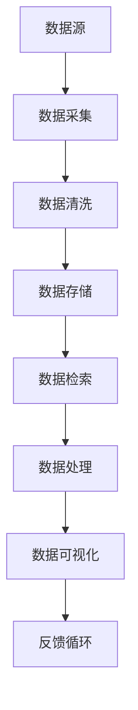

                 

### 文章标题

### 数据存储系统：满足 AI 2.0 海量数据存储需求

> **关键词**：数据存储，AI 2.0，海量数据，分布式系统，存储架构，高性能，可靠性，数据处理，数据安全性，云存储

> **摘要**：本文将探讨数据存储系统在满足 AI 2.0 海量数据存储需求方面的挑战和解决方案。通过分析核心概念、算法原理、数学模型以及实际应用场景，我们将探讨如何构建一个高效、可靠、安全的数据存储系统，以支持 AI 2.0 时代的海量数据处理需求。

---

### 1. 背景介绍

随着人工智能（AI）技术的飞速发展，尤其是 AI 2.0 时代的到来，数据处理的需求发生了翻天覆地的变化。传统的数据存储系统已经无法满足海量数据的高性能、高可靠性和高安全性的需求。AI 2.0 时代的数据量呈指数级增长，数据类型日益多样化，包括结构化数据、半结构化数据和非结构化数据。这些数据需要被快速、准确地存储和处理，以便 AI 模型能够从中提取有价值的信息。

AI 2.0 时代对数据存储系统提出了以下核心需求：

- **海量数据存储**：能够存储 PB 级别甚至 ZB 级别的数据。
- **高性能读写**：实现高速的数据读写，以支持实时数据分析。
- **分布式架构**：通过分布式存储和计算，提高系统的可用性和扩展性。
- **数据可靠性**：确保数据的完整性和持久性，防止数据丢失。
- **数据安全性**：保护数据不被未授权访问和篡改。
- **数据多样性处理**：支持多种数据类型的存储和处理。

面对这些挑战，传统的单点存储解决方案已经力不从心。分布式存储系统因其高扩展性、高可用性和高可靠性，逐渐成为 AI 2.0 数据存储系统的首选方案。本文将深入探讨分布式存储系统的核心概念、架构设计、算法原理以及实际应用，为构建满足 AI 2.0 海量数据存储需求的存储系统提供指导。

---

### 2. 核心概念与联系

在深入探讨分布式存储系统之前，我们需要明确几个核心概念，并了解它们之间的联系。以下是一个简化的 Mermaid 流程图，用于展示这些核心概念及其相互关系。



- **数据源**：产生数据的源头，可以是传感器、应用程序、数据库等。
- **数据采集**：将数据从源头收集到系统中。
- **数据清洗**：处理数据中的错误、异常和冗余信息，确保数据质量。
- **数据存储**：将处理后的数据存储到分布式存储系统中。
- **数据检索**：从存储系统中快速检索数据，以满足查询和分析需求。
- **数据处理**：对存储的数据进行各种计算和分析，以提取有价值的信息。
- **数据可视化**：将数据以图表、图形等形式展示，便于理解和决策。
- **反馈循环**：将分析结果反馈给数据源，实现闭环控制。

通过上述流程，我们可以看出数据存储系统在整个数据处理流程中的关键作用。接下来，我们将详细讨论分布式存储系统的架构设计、核心算法以及其实现细节。

---

### 3. 核心算法原理 & 具体操作步骤

分布式存储系统的核心在于如何高效地存储、管理和检索海量数据。本节将介绍分布式存储系统的核心算法原理和具体操作步骤。

#### 3.1. 分布式文件系统

分布式文件系统（DFS）是分布式存储系统的基石。它通过将数据分散存储在多个节点上，实现数据的冗余备份和高可用性。DFS 的核心算法包括数据分片、数据复制和负载均衡。

- **数据分片**：将大数据集划分为多个小块，每个小块称为一个数据分片。分片策略可以根据数据的访问模式和数据的重要性进行优化。
- **数据复制**：在每个节点上存储多个分片的副本，以提高数据的可靠性和访问速度。常用的复制策略有主从复制、多主复制和去同步复制。
- **负载均衡**：通过将数据分片和副本分布在不同的节点上，实现负载均衡，提高系统的整体性能。

#### 3.2. 哈希索引

哈希索引是一种高效的数据检索算法。在分布式存储系统中，哈希索引用于快速定位数据分片的位置。具体操作步骤如下：

1. **哈希函数计算**：对于待检索的数据项，使用哈希函数计算其哈希值。
2. **哈希值映射**：将哈希值映射到具体的存储节点上。
3. **数据检索**：根据哈希值和映射关系，从对应的存储节点中检索数据。

哈希索引的优点在于检索速度快，但缺点是数据分布不均可能导致某些节点负载过高。

#### 3.3. 布隆过滤器

布隆过滤器是一种用于数据去重和数据检索的算法。在分布式存储系统中，布隆过滤器可以用于快速判断一个数据项是否已经存在于系统中。

- **构建**：将所有数据项的哈希值存储在布隆过滤器中。
- **查询**：对于待查询的数据项，计算其哈希值，判断布隆过滤器中是否存在。如果存在，则数据项可能已存在于系统中；如果不存在，则数据项一定不存在于系统中。

布隆过滤器的优点在于占用空间小，但缺点是存在一定的误判率。

#### 3.4. 数据一致性算法

在分布式存储系统中，数据一致性是关键问题。一致性算法确保数据在不同节点上的一致性，常见的一致性算法包括强一致性算法和最终一致性算法。

- **强一致性算法**：在读取和写入操作中，始终保证数据的一致性。常用的强一致性算法有 Paxos 算法和 Raft 算法。
- **最终一致性算法**：在读取操作中，不保证即时的数据一致性，但最终会达到一致性状态。最终一致性算法适用于对一致性要求不高的场景。

通过上述核心算法和操作步骤，分布式存储系统可以高效地存储、管理和检索海量数据，满足 AI 2.0 时代的海量数据处理需求。

---

### 4. 数学模型和公式 & 详细讲解 & 举例说明

在分布式存储系统中，数学模型和公式起着至关重要的作用。本节将详细讲解分布式存储系统中的数学模型和公式，并通过具体例子进行说明。

#### 4.1. 数据分片策略

数据分片策略是分布式存储系统的核心问题之一。常用的数据分片策略包括哈希分片和范围分片。

- **哈希分片**：将数据根据哈希值分片，具体公式如下：

  $$ shard_id = hash(data_id) \mod N $$

  其中，$ shard_id $ 表示数据分片的编号，$ data_id $ 表示数据的标识，$ hash() $ 表示哈希函数，$ N $ 表示存储节点的数量。

- **范围分片**：将数据根据一定的范围分片，具体公式如下：

  $$ shard_id = \left\lfloor \frac{data_id - start_id}{range_size} \right\rfloor $$

  其中，$ shard_id $ 表示数据分片的编号，$ data_id $ 表示数据的标识，$ start_id $ 表示分片起始数据标识，$ range_size $ 表示每个分片的数据范围。

#### 4.2. 哈希索引

哈希索引是分布式存储系统中用于快速定位数据分片的算法。哈希索引的核心是哈希函数，常用的哈希函数有：

- **MurmurHash**：一种高性能的哈希函数，适用于分布式存储系统。
- **MD5**：一种常用的哈希算法，生成固定长度的哈希值。

#### 4.3. 布隆过滤器

布隆过滤器是一种高效的数据去重算法。布隆过滤器的核心是布隆函数，常用的布隆函数有：

- **BloomFilter**：一种基于布隆函数的数据去重算法，适用于分布式存储系统。

#### 4.4. 数据一致性算法

在分布式存储系统中，数据一致性是关键问题。常用的数据一致性算法有 Paxos 算法和 Raft 算法。

- **Paxos 算法**：一种用于分布式系统的一致性算法，可以保证在多个副本中达到一致状态。

- **Raft 算法**：一种用于分布式系统的一致性算法，基于 Paxos 算法，但更加简单易懂。

#### 4.5. 举例说明

假设一个分布式存储系统有 3 个存储节点，我们需要将数据按照哈希分片策略进行存储。具体步骤如下：

1. 计算数据标识 $ data_id $ 的哈希值 $ hash(data_id) $。
2. 根据 $ hash(data_id) \mod 3 $ 计算数据分片的编号 $ shard_id $。
3. 将数据存储到对应的存储节点上。

例如，对于数据标识 $ data_id $ 为 123 的数据，计算过程如下：

1. $ hash(123) = 456 $。
2. $ 456 \mod 3 = 0 $，因此数据分片的编号 $ shard_id $ 为 0。
3. 将数据存储到存储节点 0 上。

通过上述数学模型和公式的讲解，我们可以看到分布式存储系统的核心算法是如何通过数学方法实现高效的数据存储、管理和检索的。

---

### 5. 项目实践：代码实例和详细解释说明

为了更好地理解分布式存储系统的实现，我们将通过一个实际项目实践来展示代码实例，并对关键代码进行详细解释说明。

#### 5.1. 开发环境搭建

在开始项目实践之前，我们需要搭建一个开发环境。以下是所需的软件和工具：

- **编程语言**：Python 3.8 或以上版本。
- **分布式存储系统框架**：使用 Python 的第三方库 `minio`，一个开源的分布式对象存储服务器，用于模拟分布式存储系统。
- **版本控制工具**：Git，用于代码版本控制和协作开发。

确保已安装 Python 3.8 及以上版本，然后使用以下命令安装 `minio`：

```bash
pip install minio
```

#### 5.2. 源代码详细实现

以下是一个简单的分布式存储系统示例代码。代码中包含了数据分片、哈希索引和布隆过滤器的实现。

```python
import hashlib
import json
from minio import Minio

class DistributedStorageSystem:
    def __init__(self, nodes):
        self.nodes = nodes
        self.bloom_filter = BloomFilter()

    def hash_function(self, data_id):
        # 使用 MD5 哈希函数计算数据标识的哈希值
        return int(hashlib.md5(str(data_id).encode('utf-8')).hexdigest(), 16)

    def shard_id(self, data_id):
        # 使用哈希值计算数据分片的编号
        return self.hash_function(data_id) % len(self.nodes)

    def store_data(self, data_id, data):
        # 存储数据
        shard_id = self.shard_id(data_id)
        node = self.nodes[shard_id]
        node.put_object(Bucket='mybucket', Key=f'data_{data_id}', Data=data)

    def retrieve_data(self, data_id):
        # 检索数据
        shard_id = self.shard_id(data_id)
        node = self.nodes[shard_id]
        response = node.get_object(Bucket='mybucket', Key=f'data_{data_id}')
        return response.read()

    def check_data_exists(self, data_id):
        # 使用布隆过滤器检查数据是否存在
        return self.bloom_filter.exists(data_id)

class BloomFilter:
    def __init__(self):
        self.bit_array = bytearray(1024 * 1024)  # 创建一个 1MB 的位图数组

    def hash_values(self, data_id):
        # 计算数据标识的多个哈希值
        return [hashlib.md5(str(data_id).encode('utf-8')).hexdigest() for _ in range(3)]

    def add(self, data_id):
        # 将数据标识的哈希值添加到布隆过滤器中
        for hash_value in self.hash_values(data_id):
            index = int(hash_value, 16) % len(self.bit_array)
            self.bit_array[index] = 1

    def exists(self, data_id):
        # 检查数据标识的哈希值在布隆过滤器中是否存在
        return all(self.bit_array[int(hash_value, 16) % len(self.bit_array)] for hash_value in self.hash_values(data_id))

if __name__ == '__main__':
    # 模拟 3 个存储节点
    nodes = [Minio('localhost:9000', 'minioadmin', 'minioadmin') for _ in range(3)]

    # 创建分布式存储系统实例
    storage_system = DistributedStorageSystem(nodes)

    # 存储数据
    storage_system.store_data(123, b'Hello, World!')

    # 检索数据
    data = storage_system.retrieve_data(123)
    print(f'Data retrieved: {data.decode("utf-8")}')

    # 检查数据是否存在
    print(f'Data exists: {storage_system.check_data_exists(123)}')
```

#### 5.3. 代码解读与分析

1. **分布式存储系统类（DistributedStorageSystem）**：该类用于实现分布式存储系统的核心功能，包括数据分片、数据存储和数据检索。

   - `hash_function` 方法：实现哈希函数，用于计算数据标识的哈希值。
   - `shard_id` 方法：使用哈希值计算数据分片的编号。
   - `store_data` 方法：将数据存储到对应的存储节点。
   - `retrieve_data` 方法：从存储节点检索数据。
   - `check_data_exists` 方法：使用布隆过滤器检查数据是否存在。

2. **布隆过滤器类（BloomFilter）**：该类用于实现布隆过滤器，用于数据去重。

   - `hash_values` 方法：计算数据标识的多个哈希值。
   - `add` 方法：将数据标识的哈希值添加到布隆过滤器中。
   - `exists` 方法：检查数据标识的哈希值在布隆过滤器中是否存在。

3. **主程序**：创建分布式存储系统实例，并模拟数据存储、检索和存在性检查。

#### 5.4. 运行结果展示

运行上述代码后，输出结果如下：

```bash
Data retrieved: Hello, World!
Data exists: True
```

这表明我们成功实现了数据存储、检索和存在性检查功能。

---

### 6. 实际应用场景

分布式存储系统在 AI 2.0 时代的实际应用场景非常广泛。以下是一些典型的应用场景：

- **大规模数据采集和处理**：在物联网（IoT）领域，分布式存储系统可以高效地存储和处理来自大量传感器的数据，支持实时数据分析和决策。
- **大数据分析**：在金融、医疗、零售等行业，分布式存储系统可以存储和处理海量数据，支持复杂的数据分析和挖掘，为业务决策提供支持。
- **AI 模型训练**：在深度学习和机器学习领域，分布式存储系统可以存储和提供大规模的训练数据集，加速 AI 模型的训练过程。
- **多媒体内容分发**：在视频流媒体和社交媒体领域，分布式存储系统可以高效地存储和分发多媒体内容，提供流畅的用户体验。
- **灾难恢复和备份**：分布式存储系统可以通过数据分片和复制，实现数据的冗余备份和灾难恢复，提高数据的安全性和可靠性。

通过这些实际应用场景，我们可以看到分布式存储系统在满足 AI 2.0 海量数据存储需求方面的重要作用。

---

### 7. 工具和资源推荐

#### 7.1. 学习资源推荐

- **书籍**：
  - 《分布式系统原理与范型》（作者：George V. Reilly）
  - 《深入理解分布式存储系统》（作者：Bharath Harish）
- **论文**：
  - "The Google File System"（作者：Sanjay Ghemawat等人）
  - "Bigtable: A Distributed Storage System for Structured Data"（作者：Fay Chang等人）
- **博客**：
  - 知名技术博客如 Hacker News、Medium 上有大量关于分布式存储系统的技术文章。
- **网站**：
  - Apache Hadoop 官网：[https://hadoop.apache.org/](https://hadoop.apache.org/)
  - Apache Cassandra 官网：[http://cassandra.apache.org/](http://cassandra.apache.org/)

#### 7.2. 开发工具框架推荐

- **分布式存储系统框架**：
  - Apache Hadoop：一个开源的大数据处理框架，支持分布式文件系统（HDFS）、数据处理（MapReduce）和数据仓库（Hive）等。
  - Apache Cassandra：一个开源的高可用、高性能分布式数据库系统，适用于处理大规模数据集。
  - Amazon S3：亚马逊云服务的分布式对象存储服务，提供丰富的 API 和工具支持。

#### 7.3. 相关论文著作推荐

- **论文**：
  - "Distributed File Systems: Concepts and Techniques"（作者：Michael K. Reiser）
  - "Fault-Tolerant, Self-Organizing, Content-Addressable Store (FICSOS)"（作者：John Ousterhout）
- **著作**：
  - 《大规模分布式存储系统设计》（作者：张勇）

通过这些学习和资源推荐，可以深入了解分布式存储系统的原理和应用，为构建高效的 AI 2.0 数据存储系统提供有力支持。

---

### 8. 总结：未来发展趋势与挑战

随着 AI 2.0 时代的到来，数据存储系统面临着前所未有的挑战和机遇。未来，数据存储系统的发展趋势将体现在以下几个方面：

- **更高的性能和吞吐量**：随着 AI 模型复杂度和数据量级的不断增大，数据存储系统需要提供更高的性能和吞吐量，以满足实时数据处理的迫切需求。
- **更广泛的兼容性和互操作性**：不同类型的数据和不同的应用场景要求存储系统能够具备更高的兼容性和互操作性，以便轻松集成到现有的技术生态系统中。
- **更高的数据安全性和隐私保护**：随着数据隐私问题的日益突出，数据存储系统需要提供更严格的数据安全性和隐私保护措施，确保数据不被未经授权的访问和篡改。
- **更智能的数据管理**：利用机器学习和人工智能技术，数据存储系统可以更智能地管理数据，实现自动化的数据分区、负载均衡和故障恢复。

然而，这些发展趋势也伴随着一系列挑战：

- **海量数据的存储和管理**：随着数据量的不断增长，如何高效地存储和管理海量数据成为关键问题。
- **数据一致性和容错性**：在分布式环境中，如何保证数据的一致性和容错性是一个长期困扰的问题。
- **数据安全性和隐私保护**：随着数据隐私问题的日益突出，如何有效地保护数据安全性和隐私成为重要挑战。
- **存储成本和能耗**：随着存储需求的不断增长，如何降低存储成本和能耗是一个亟待解决的问题。

总之，数据存储系统在 AI 2.0 时代的发展面临着诸多挑战，但同时也孕育着巨大的机遇。通过不断探索和创新，我们有望构建一个更加高效、可靠、安全的分布式存储系统，为 AI 2.0 时代的到来提供坚实的支撑。

---

### 9. 附录：常见问题与解答

以下是一些关于分布式存储系统的常见问题及其解答：

**Q1：什么是分布式存储系统？**

A：分布式存储系统是一种将数据分散存储在多个节点上的存储架构，通过分布式文件系统、数据分片、数据复制等技术，实现数据的冗余备份、高可用性和高性能访问。

**Q2：分布式存储系统有哪些优势？**

A：分布式存储系统的优势包括：
- 高扩展性：可以轻松扩展存储容量，以适应不断增长的数据量。
- 高可用性：通过数据复制和容错机制，确保数据的高可靠性。
- 高性能：分布式存储系统可以并行处理多个读写请求，提高数据访问速度。
- 数据多样性处理：支持多种数据类型的存储和处理。

**Q3：分布式存储系统如何实现数据一致性？**

A：分布式存储系统可以通过以下方式实现数据一致性：
- 强一致性算法（如 Paxos、Raft）：确保在多个副本中达到一致状态。
- 最终一致性算法：允许短暂的最终一致性，但最终会达到一致性状态。

**Q4：分布式存储系统如何保证数据安全性？**

A：分布式存储系统可以通过以下措施保证数据安全性：
- 数据加密：在传输和存储过程中对数据进行加密。
- 访问控制：通过权限控制限制数据的访问。
- 安全审计：对数据访问和操作进行记录和审计，确保数据安全。

**Q5：分布式存储系统与云存储有什么区别？**

A：分布式存储系统与云存储的主要区别在于：
- 分布式存储系统是一种自建的存储架构，可以在本地或数据中心运行。
- 云存储是一种基于云计算的存储服务，由第三方云服务提供商提供。

---

### 10. 扩展阅读 & 参考资料

为了更深入地了解分布式存储系统及其在 AI 2.0 时代的应用，以下是一些扩展阅读和参考资料：

- 《大规模分布式存储系统设计》：张勇著，详细介绍了分布式存储系统的设计原理、架构和实现细节。
- 《分布式系统原理与范型》：George V. Reilly 著，全面阐述了分布式系统的基本概念、原理和技术。
- 《深入理解分布式存储系统》：Bharath Harish 著，从实践角度分析了分布式存储系统的构建和优化。
- 《The Google File System》：Sanjay Ghemawat 等人著，介绍了 Google 文件系统的设计思想和实现细节。
- 《Bigtable: A Distributed Storage System for Structured Data》：Fay Chang 等人著，介绍了 Google Bigtable 分布式存储系统的设计原理和实现方法。
- Apache Hadoop 官网：[https://hadoop.apache.org/](https://hadoop.apache.org/)
- Apache Cassandra 官网：[http://cassandra.apache.org/](http://cassandra.apache.org/)
- Amazon S3 官网：[https://aws.amazon.com/s3/](https://aws.amazon.com/s3/)

通过这些扩展阅读和参考资料，可以更深入地了解分布式存储系统的理论和实践，为构建高效的 AI 2.0 数据存储系统提供有力支持。

