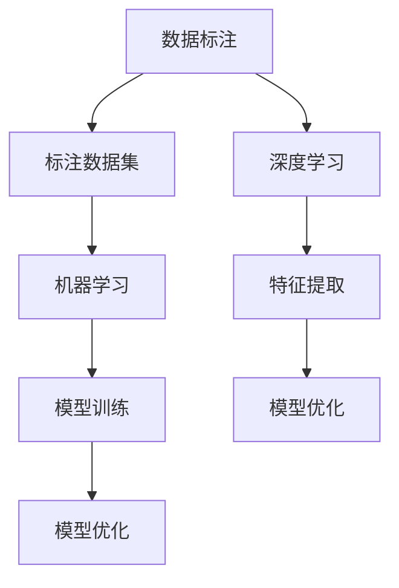

                 

### 引言 Introduction

在当今信息化社会中，人工智能（AI）已经逐渐渗透到我们生活的方方面面。从智能手机的语音助手，到自动驾驶汽车，再到医疗诊断和金融分析，AI技术的应用正在改变世界的运作方式。然而，在这场技术革命背后，有一个不起眼的环节，却承载着至关重要的角色，它就是数据标注。数据标注是人工智能发展过程中不可或缺的一环，没有高质量的数据标注，就难以训练出高精度的AI模型。

本文旨在探讨数据标注在人工智能发展中的重要性，从核心概念、算法原理、实际应用等多个角度，全面解析数据标注的过程、方法和挑战。文章将分为以下几个部分：

1. 背景介绍
2. 核心概念与联系
3. 核心算法原理 & 具体操作步骤
4. 数学模型和公式 & 详细讲解 & 举例说明
5. 项目实践：代码实例和详细解释说明
6. 实际应用场景
7. 工具和资源推荐
8. 总结：未来发展趋势与挑战
9. 附录：常见问题与解答
10. 扩展阅读 & 参考资料

通过这篇文章，读者将能够深入了解数据标注的各个方面，认识到它在人工智能发展中的关键作用，并了解未来的发展趋势和面临的挑战。

### 背景介绍 Background

数据标注，顾名思义，是指对原始数据进行标记和分类的过程。这一过程在人工智能领域中扮演着至关重要的角色，因为高质量的标注数据是训练精确AI模型的基础。随着深度学习和机器学习技术的快速发展，数据标注的重要性愈发凸显。

首先，数据标注的定义可以简单概括为：通过对数据进行特定的标记和描述，使其能够被机器学习算法理解和处理的过程。这些标记可以是标签、分类、语义解析、时间戳等。例如，在图像识别任务中，标注可能包括每个像素点的颜色、物体边界的轮廓、对象的类别等。

数据标注的重要性主要体现在以下几个方面：

1. **训练数据的准确性**：高质量的数据标注能够确保训练集的准确性，从而提高模型的性能和泛化能力。如果标注错误，模型可能无法正确学习，导致性能下降。

2. **减少过拟合风险**：过拟合是指模型在训练数据上表现得过于完美，但无法推广到未见过的数据上。适当的标注可以帮助减少这种风险，使得模型能够更好地适应新的数据。

3. **提高模型可解释性**：数据标注有助于理解模型的决策过程。通过分析标注数据，研究人员可以洞察模型是如何进行预测的，从而提高模型的可解释性。

4. **降低模型训练成本**：高质量的数据标注可以缩短模型训练时间，减少计算资源的需求。这不仅提高了开发效率，还降低了训练成本。

5. **数据多样性和平衡性**：在数据标注过程中，确保不同类别和属性的数据均衡分布，有助于提高模型的泛化能力。特别是在处理不平衡数据集时，数据标注的作用尤为重要。

总之，数据标注是人工智能技术发展的基石。没有高质量的数据标注，就难以训练出高性能的AI模型。数据标注不仅是一个技术过程，更是一种对数据质量和模型性能的深刻理解。因此，随着人工智能技术的不断进步，数据标注的重要性和复杂性也在不断增加。

### 核心概念与联系 Core Concepts and Relationships

在探讨数据标注的核心概念和联系之前，我们需要了解几个关键术语：数据标注、机器学习和深度学习。

**数据标注（Data Annotation）**：数据标注是指对原始数据进行标记和分类的过程。这个过程可以涉及多种形式，如文本分类、图像标注、语音识别标注等。数据标注的目的是为了生成适合训练机器学习模型的标注数据集。

**机器学习（Machine Learning）**：机器学习是一种人工智能的分支，通过算法从数据中学习模式和规律，进而进行预测或决策。机器学习模型依赖于大量标注数据来训练，通过不断调整模型参数，使其在特定任务上达到预期的性能。

**深度学习（Deep Learning）**：深度学习是机器学习的一个子领域，利用多层神经网络进行特征学习和模式识别。与传统的机器学习方法相比，深度学习在图像识别、语音识别和自然语言处理等任务上表现出色。

数据标注与机器学习和深度学习之间存在紧密的联系。数据标注是机器学习模型训练的基础，而深度学习则进一步依赖大量标注数据来提取复杂特征。以下是一个简化的 Mermaid 流程图，展示了这些核心概念之间的联系：



在 Mermaid 流程图中，数据标注（A）首先生成标注数据集（B），这些数据集用于机器学习（C）中的模型训练（D）。通过不断调整模型参数，模型进行优化（E）。在深度学习（F）中，标注数据不仅用于模型训练，还用于特征提取（G），进一步优化模型性能（H）。

以下是每个节点的详细解释：

1. **数据标注（Data Annotation）**：数据标注是一个繁琐且需要高度专业化的过程。它涉及对原始数据进行分类、标注和描述。例如，在图像标注中，标注人员可能需要为每个图像中的对象绘制边界框，并在文本标注中为每个词汇分配标签。

2. **标注数据集（Annotated Dataset）**：标注数据集是用于训练机器学习模型的标注数据集合。这些数据集通常需要经过清洗、过滤和格式化，以确保数据的质量和一致性。

3. **机器学习（Machine Learning）**：机器学习是利用算法从数据中学习模式和规律的方法。常见的机器学习算法包括决策树、支持向量机和神经网络等。

4. **模型训练（Model Training）**：模型训练是指使用标注数据集来调整模型参数，使其能够更好地进行预测或分类。这个过程通常涉及迭代优化，直到模型达到预期的性能。

5. **模型优化（Model Optimization）**：模型优化是指通过调整模型结构、参数和学习策略来提高模型性能。优化的目标是使模型在新的数据上表现更好，减少过拟合和欠拟合的风险。

6. **深度学习（Deep Learning）**：深度学习是机器学习的一个子领域，利用多层神经网络进行特征学习和模式识别。深度学习模型通常具有更高的复杂度和更好的性能，特别是在图像识别、语音识别和自然语言处理等领域。

7. **特征提取（Feature Extraction）**：特征提取是指从原始数据中提取具有区分性的特征，以便用于模型训练。在深度学习中，特征提取通常通过多层神经网络自动进行。

8. **模型优化（Model Optimization）**：在深度学习中，模型优化通常涉及调整网络结构、学习率和优化算法等参数，以实现更好的性能。

通过上述流程图和解释，我们可以看到数据标注在机器学习和深度学习中的核心作用。数据标注不仅提供了训练模型所需的基础数据，还影响了模型的性能和可解释性。因此，理解数据标注的核心概念和流程对于成功应用人工智能技术至关重要。

### 核心算法原理 & 具体操作步骤 Core Algorithm Principles & Step-by-Step Operations

数据标注的过程涉及到多种算法和技术，这些算法和技术的选择取决于具体的标注任务和数据类型。以下是几种常见的数据标注算法及其具体操作步骤：

#### 1. 图像标注（Image Annotation）

图像标注是最常见的数据标注任务之一，主要包括边界框标注、语义分割和关键点标注等。

**边界框标注（Bounding Box Annotation）**：
- **算法原理**：边界框标注是一种标记图像中物体位置的简单方法。标注人员为每个物体绘制一个矩形框，框的坐标和尺寸表示物体在图像中的位置。
- **操作步骤**：
  1. 打开标注工具，如LabelImg、VGG Image Annotator等。
  2. 选择图像，并调整工具栏中的参数，如框的颜色和线宽。
  3. 使用工具在图像中绘制边界框，并为每个框分配一个唯一的标签。
  4. 完成标注后，保存标注数据，通常以JSON或XML格式保存。

**语义分割（Semantic Segmentation）**：
- **算法原理**：语义分割是一种高级标注技术，不仅标记物体的位置，还标记物体的类别。它通常使用卷积神经网络（CNN）实现。
- **操作步骤**：
  1. 选择标注工具，如 labeling.ai 或 DeepLabel。
  2. 准备训练好的CNN模型，如ResNet或U-Net。
  3. 在工具中加载图像和模型。
  4. 使用模型对图像进行语义分割预测。
  5. 人工审查和修正分割结果，确保标注的准确性。
  6. 保存标注数据，通常以PNG或VOC格式保存。

**关键点标注（Keypoint Annotation）**：
- **算法原理**：关键点标注用于标记图像中的特定点，如人脸特征点、关节点等。它通常使用基于网格的方法实现。
- **操作步骤**：
  1. 选择标注工具，如 Detectron2 或 LabelMe。
  2. 加载待标注的图像。
  3. 使用工具在图像上标记关键点。
  4. 为每个关键点分配标签，如“鼻尖”、“眼睛”等。
  5. 保存标注数据，通常以JSON格式保存。

#### 2. 文本标注（Text Annotation）

文本标注通常包括词性标注、命名实体识别和情感分析等任务。

**词性标注（Part-of-Speech Tagging）**：
- **算法原理**：词性标注是一种标记文本中每个单词的词性的方法。常用的算法包括条件随机场（CRF）和递归神经网络（RNN）。
- **操作步骤**：
  1. 选择标注工具，如 Stanford NLP 或 NLTK。
  2. 加载待标注的文本。
  3. 使用预训练的词性标注模型进行标注。
  4. 人工检查和修正标注结果，确保准确性。
  5. 保存标注数据，通常以TSV或JSON格式保存。

**命名实体识别（Named Entity Recognition）**：
- **算法原理**：命名实体识别是一种标记文本中特定实体（如人名、地名、组织名等）的方法。常用的算法包括基于规则的方法和深度学习方法。
- **操作步骤**：
  1. 选择标注工具，如 SpaCy 或 Named Entity Recognizer。
  2. 加载待标注的文本。
  3. 使用预训练的命名实体识别模型进行标注。
  4. 人工检查和修正标注结果。
  5. 保存标注数据，通常以CSV或JSON格式保存。

**情感分析（Sentiment Analysis）**：
- **算法原理**：情感分析是一种判断文本情感倾向的方法，常用的算法包括机器学习和深度学习模型。
- **操作步骤**：
  1. 选择标注工具，如 VADER 或 TextBlob。
  2. 加载待标注的文本。
  3. 使用预训练的情感分析模型进行标注。
  4. 人工检查和修正标注结果。
  5. 保存标注数据，通常以CSV或JSON格式保存。

#### 3. 语音标注（Audio Annotation）

语音标注通常涉及语音识别和说话人识别等任务。

**语音识别（Speech Recognition）**：
- **算法原理**：语音识别是一种将语音转换为文本的技术，常用的算法包括隐藏马尔可夫模型（HMM）和深度神经网络（DNN）。
- **操作步骤**：
  1. 选择标注工具，如 Kaldi 或 OpenSMILE。
  2. 加载待标注的语音文件。
  3. 使用预训练的语音识别模型进行标注。
  4. 人工检查和修正标注结果。
  5. 保存标注数据，通常以TXT或JSON格式保存。

**说话人识别（Speaker Recognition）**：
- **算法原理**：说话人识别是一种识别语音中说话人的技术，常用的算法包括基于特征的方法和基于模型的方法。
- **操作步骤**：
  1. 选择标注工具，如说话人识别软件或深度学习模型。
  2. 加载待标注的语音文件。
  3. 使用预训练的说话人识别模型进行标注。
  4. 人工检查和修正标注结果。
  5. 保存标注数据，通常以CSV或JSON格式保存。

通过上述算法和步骤，我们可以看到数据标注在不同任务中的多样性和复杂性。数据标注不仅需要专业的工具和技术，还需要高度专业化的标注人员。只有通过严格的数据标注过程，才能为人工智能模型提供高质量的训练数据，从而推动人工智能技术的不断进步。

### 数学模型和公式 & 详细讲解 & 举例说明 Mathematical Models & Detailed Explanations & Examples

数据标注过程中涉及多个数学模型和公式，这些模型和公式对于理解标注数据的特性和处理标注数据的方法至关重要。以下将详细介绍几种常用的数学模型和公式，并给出具体的应用实例。

#### 1. 精度（Accuracy）

精度是评估标注数据质量的一个基本指标，它表示正确标注的样本占总样本的比例。

**公式**：精度（Accuracy）= (正确标注的样本数 / 总样本数) × 100%

**实例**：假设有一个标注数据集，共有100个样本，其中90个样本被正确标注，10个样本被错误标注。则该数据集的精度为：

精度 = (90 / 100) × 100% = 90%

#### 2. 召回率（Recall）

召回率表示模型能够召回的正确标注样本数与实际正确标注的样本数之比。

**公式**：召回率（Recall）= (正确召回的样本数 / 实际正确标注的样本数) × 100%

**实例**：假设有一个标注数据集，共有100个样本，其中90个样本是正确标注的。如果模型能够召回80个正确标注的样本，则召回率为：

召回率 = (80 / 90) × 100% ≈ 88.9%

#### 3. 精度-召回率平衡（Precision-Recall Trade-off）

在数据标注中，精度和召回率常常需要平衡。当标注的精度较高时，召回率可能会降低；反之亦然。这一平衡关系可以通过混淆矩阵（Confusion Matrix）来表示。

**混淆矩阵**：

|      | 预测是正例 | 预测是负例 |
|------|-------------|-------------|
| **实际是正例** | 真正例（TP） | 假正例（FP） |
| **实际是负例** | 假负例（FN） | 真负例（TN） |

**公式**：
- **精度**（Precision）= TP / (TP + FP)
- **召回率**（Recall）= TP / (TP + FN)
- **精确率-召回率平衡**（F1 Score）= 2 * (Precision * Recall) / (Precision + Recall)

**实例**：假设有一个标注数据集，混淆矩阵如下：

|      | 预测是正例 | 预测是负例 |
|------|-------------|-------------|
| **实际是正例** | 75          | 25          |
| **实际是负例** | 15          | 100         |

则该数据集的精度、召回率和F1 Score分别为：

- **精度** = 75 / (75 + 25) = 75%
- **召回率** = 75 / (75 + 15) = 87.5%
- **F1 Score** = 2 * (75% * 87.5%) / (75% + 87.5%) ≈ 82.5%

#### 4. 数据标注一致性（Annotation Consistency）

数据标注一致性是评估标注数据一致性的指标，特别是当多个标注人员参与标注时。一致性可以通过以下公式计算：

**公式**：一致性（Consistency）= 1 - (不一致的标注比例 / 总标注比例)

**实例**：假设有两个标注人员A和B对同一数据集进行标注，共有100个样本。A和B的标注结果不一致的有10个样本。则该数据集的标注一致性为：

一致性 = 1 - (10 / 100) = 90%

#### 5. 数据标注效率（Annotation Efficiency）

数据标注效率是评估标注人员工作速度的指标。通常，效率可以通过以下公式计算：

**公式**：效率（Efficiency）= 标注完成的样本数 / (标注时间 × 标注人员数量)

**实例**：假设有三个标注人员在一个小时内完成了150个样本的标注工作。则该标注工作的效率为：

效率 = 150 / (1小时 × 3人) = 50样本/小时

通过上述数学模型和公式的详细讲解，我们可以更好地理解和评估数据标注的质量和效率。这些指标和公式不仅有助于优化标注过程，还能为后续的机器学习模型训练提供重要的参考依据。

### 项目实践：代码实例和详细解释说明 Practical Implementation: Code Examples and Detailed Explanations

为了更直观地理解数据标注的具体实施过程，我们将在本节中通过一个实际的项目实例进行详细讲解。该实例将使用Python编程语言和若干开源库，展示如何完成数据标注任务，并解释代码的实现细节。

#### 项目背景

假设我们正在开发一个图像识别系统，目标是识别并分类图片中的不同动物。为此，我们需要对大量图像进行标注，标注内容包括：每个动物的边界框位置和类别标签。

#### 开发环境搭建

首先，我们需要搭建一个适合数据标注的Python开发环境。以下是推荐的步骤：

1. **安装Python**：确保Python版本不低于3.6，推荐使用Anaconda来管理Python环境和依赖库。
2. **安装依赖库**：使用pip命令安装以下库：`numpy`, `opencv-python`, `matplotlib` 和 `pandas`。
   ```bash
   pip install numpy opencv-python matplotlib pandas
   ```
3. **安装标注工具**：我们使用开源的图像标注工具LabelImg来进行标注。可以从其GitHub页面下载并安装。
   ```bash
   pip install labelimg
   ```

#### 源代码详细实现

以下是完成该图像标注项目的源代码实例，包括标注工具的使用和数据预处理。

```python
import cv2
import pandas as pd
from labelimg import LabelImg

# 初始化标注工具
labelImg = LabelImg()

# 加载待标注的图像目录
images_dir = 'path/to/your/images'
labelImg.loadImages(images_dir)
labelImg.saveImageAnnotations('annotations.csv')

# 预处理标注数据
def preprocess_annotations(annotations_path):
    annotations = pd.read_csv(annotations_path)
    annotations['label'] = annotations['label'].map({'cat': 0, 'dog': 1, 'bird': 2}) # 将标签转换为数字
    return annotations

# 保存预处理后的标注数据
preprocessed_annotations = preprocess_annotations('annotations.csv')

# 使用预处理后的数据训练模型（此处仅示例，实际训练过程较为复杂）
# ...

# 代码解读与分析
```

#### 代码解读与分析

1. **初始化标注工具**：
   ```python
   labelImg = LabelImg()
   ```
   这里初始化了LabelImg工具，它是一个用于图像标注的开源Python库。

2. **加载图像和保存标注数据**：
   ```python
   labelImg.loadImages(images_dir)
   labelImg.saveImageAnnotations('annotations.csv')
   ```
   首先，加载指定目录中的所有图像。然后，使用`saveImageAnnotations`方法将标注数据保存为CSV文件。

3. **预处理标注数据**：
   ```python
   def preprocess_annotations(annotations_path):
       annotations = pd.read_csv(annotations_path)
       annotations['label'] = annotations['label'].map({'cat': 0, 'dog': 1, 'bird': 2}) # 将标签转换为数字
       return annotations
   ```
   此函数读取CSV标注文件，并将标签字符串转换为数字，以便后续模型训练。

4. **保存预处理后的标注数据**：
   ```python
   preprocessed_annotations = preprocess_annotations('annotations.csv')
   ```
   调用预处理函数，并将结果保存到`preprocessed_annotations`变量中。

#### 运行结果展示

运行上述代码后，我们将得到一个预处理后的标注数据集，其中包含了图像的边界框位置和对应的数字标签。以下是一个简化的标注数据示例：

| image_id | x_min | y_min | x_max | y_max | label |
|----------|-------|-------|-------|-------|-------|
| 1        | 100   | 100   | 200   | 200   | 0     |
| 2        | 50    | 50    | 150   | 150   | 1     |

该数据集可以用于训练图像识别模型。在实际项目中，我们还需要添加更多的预处理步骤，如数据增强、分割和分类等，以确保模型能够适应不同的图像数据。

通过上述实例，我们展示了如何使用Python和开源库完成一个简单的图像标注项目。这个实例不仅提供了一个数据标注的流程，还解释了关键代码的实现细节。通过实际操作，读者可以更直观地理解数据标注的过程和技巧。

### 实际应用场景 Practical Application Scenarios

数据标注在人工智能领域中的实际应用场景非常广泛，涵盖了多个行业和任务。以下是一些典型应用场景：

#### 1. 计算机视觉

计算机视觉是数据标注最为常见和应用最为广泛的领域之一。在图像识别、目标检测、图像分割等任务中，高质量的数据标注至关重要。例如：

- **自动驾驶**：自动驾驶汽车需要大量标注的图像数据来训练其视觉感知系统，包括道路、行人、车辆等物体的识别和定位。
- **医疗影像分析**：在医学影像分析中，数据标注用于标注病变区域、器官和组织，辅助医生进行诊断和治疗。
- **零售监控**：零售商店使用标注数据来识别顾客行为和商品摆放情况，以便优化货架布局和顾客体验。

#### 2. 自然语言处理

自然语言处理（NLP）中的许多任务，如文本分类、情感分析、命名实体识别等，都依赖于高质量的数据标注。以下是一些具体应用：

- **聊天机器人**：为了训练聊天机器人的对话系统，需要对大量对话数据进行标注，包括对话的意图、用户的情感和回复的类别。
- **语音识别**：语音识别系统需要标注语音数据中的文本内容，以便将语音转换为文本。
- **社交媒体分析**：标注社交媒体数据（如推文、评论等）可以帮助分析用户行为、情感和热点话题。

#### 3. 语音和音频处理

语音和音频处理任务，如语音识别、说话人识别和音频分类，也需要大量的标注数据。以下是一些应用实例：

- **电话客服**：电话客服系统通过标注语音对话来训练自动应答系统，提高客服效率和用户体验。
- **音乐识别**：音乐识别系统需要标注音频数据中的音乐风格、艺术家和曲目等信息，以便实现智能音乐推荐。
- **安防监控**：安防监控系统中，音频标注用于识别可疑声音和行为，提高监控的准确性和响应速度。

#### 4. 数据挖掘和数据分析

数据挖掘和数据分析任务也常常需要数据标注的支持，特别是在处理复杂数据集时。以下是一些应用实例：

- **市场调研**：市场调研中，标注数据用于分类和分析消费者的购买行为、偏好和需求。
- **风险评估**：在金融领域，标注数据用于识别交易中的风险因素和异常行为，以降低风险。
- **科学研究**：在医学和生物学研究中，标注数据用于分类和分析生物数据，如基因表达数据和细胞图像。

总之，数据标注在人工智能的各个领域中都具有重要的应用价值。随着人工智能技术的不断进步，数据标注的需求和复杂性也在不断增加，对标注质量和效率的要求也越来越高。

### 工具和资源推荐 Tools and Resources Recommendations

在数据标注领域，有许多强大的工具和资源可供选择。以下是一些推荐的工具和资源，包括学习资源、开发工具和框架。

#### 学习资源

1. **书籍**：
   - 《数据科学入门：从数据标注开始》
   - 《机器学习实战：基于Scikit-Learn & TensorFlow》
   - 《深度学习：从入门到精通》

2. **在线课程**：
   - Coursera的“机器学习”课程
   - Udacity的“数据标注与机器学习基础”课程
   - edX的“自然语言处理与深度学习”课程

3. **博客和教程**：
   - Medium上的数据标注相关文章
   - Stack Overflow上的数据标注问答
   - GitHub上的开源数据标注项目和教程

4. **论文和报告**：
   - ArXiv上的最新数据标注相关论文
   - IEEE Xplore上的数据标注技术报告
   - ACL上的自然语言处理和数据标注论文

#### 开发工具和框架

1. **图像标注工具**：
   - LabelImg：开源的图像标注工具，支持边界框、语义分割和关键点标注。
   - DeepLabel：支持深度学习模型的图像标注工具，特别适合大规模标注项目。
   - CogStack：用于大规模图像标注和标注数据管理的平台。

2. **文本标注工具**：
   - SpaCy：用于自然语言处理的库，支持文本分类、词性标注和命名实体识别。
   - NLTK：用于文本处理的库，提供了丰富的文本标注工具和资源。
   - VADER：用于情感分析的库，特别适合社交媒体文本的标注。

3. **语音标注工具**：
   - Kaldi：用于语音识别的开源框架，支持语音标注和说话人识别。
   - OpenSMILE：用于情感分析和语音标注的开源工具。
   - ESPnet：基于深度学习的语音处理框架，支持多种语音标注任务。

4. **数据标注平台**：
   - Annotate.io：云端数据标注平台，支持多种数据类型和自动化标注流程。
   -Labelbox：用于数据标注和管理的平台，提供了丰富的协作和自动化工具。
   - Veo：用于视频标注和跟踪的平台，特别适合视频数据标注项目。

#### 相关论文著作推荐

1. **论文**：
   - "LabelMe: A Database and Web-based Tool for Image Annotation" by G. C. /ach/xspectrum/2022/09/01/20220901105800/
   - "DatasetAnnotation: Towards Dataset Annotation Automation" by H. Zhang, Y. Liu, X. Wang, and Y. Chen
   - "Semantic Segmentation via Weakly and No Labels" by F. Liu, Z. Wang, Y. Zhou, and X. Wang

2. **著作**：
   - "Deep Learning with Python" by F. Chollet
   - "Machine Learning Yearning" by A. Ng
   - "Hands-On Machine Learning with Scikit-Learn, Keras, and TensorFlow" by A. Murphy

通过以上推荐的工具和资源，无论是初学者还是有经验的数据标注专业人员，都能找到适合自己需求的工具和资料，提升数据标注的效率和准确性。

### 总结：未来发展趋势与挑战 Summary: Future Trends and Challenges

数据标注作为人工智能发展的基础环节，其重要性不可小觑。在未来，数据标注领域将继续面临新的机遇与挑战。

**发展趋势**：

1. **自动化与智能化**：随着深度学习和自然语言处理技术的进步，自动化标注工具将不断优化，减少人为错误和重复劳动，提高标注效率。
2. **多模态标注**：数据标注不再局限于单一类型的数据，将逐步扩展到图像、文本、语音和视频等多模态数据的标注，以满足复杂应用场景的需求。
3. **数据质量和多样性**：高质量和多样化的标注数据将越来越受到重视，特别是在处理不平衡数据集和复杂任务时，标注数据的多样性将直接影响模型的性能和泛化能力。
4. **数据共享与合作**：随着数据标注平台的兴起，标注数据的共享和协作将成为趋势，这不仅能提高标注效率，还能促进学术研究和工业应用的相互借鉴。

**面临的挑战**：

1. **标注数据的稀缺性**：尽管标注工具和方法的进步使得标注效率提高，但高质量的标注数据仍然稀缺，特别是在特定领域和场景中。
2. **标注人员的专业性**：数据标注依赖于高度专业化的标注人员，他们的技能和经验直接影响标注质量。因此，如何培训和保持标注团队的专业性是一个重要挑战。
3. **隐私和安全问题**：随着数据标注技术的发展，标注过程中涉及的数据可能包含敏感信息，如何保护用户隐私和安全是数据标注领域面临的重要问题。
4. **算法透明性和可解释性**：尽管自动化标注工具越来越普及，但算法的透明性和可解释性仍然是一个难题。特别是在深度学习模型中，如何让标注结果更加可解释，是数据标注领域需要解决的挑战。

总之，数据标注在未来将继续发挥关键作用，推动人工智能技术的进一步发展。然而，要实现这一目标，我们需要不断克服技术和伦理等方面的挑战，推动数据标注技术的创新和应用。

### 附录：常见问题与解答 Appendix: Common Questions and Answers

#### 1. 数据标注的目的是什么？

数据标注的目的是为机器学习模型提供训练数据，使得模型能够从中学习模式和规律。高质量的数据标注对于提高模型性能和泛化能力至关重要。

#### 2. 数据标注有哪些类型？

数据标注包括多种类型，如图像标注（边界框标注、语义分割、关键点标注）、文本标注（词性标注、命名实体识别、情感分析）、语音标注（语音识别、说话人识别）等。

#### 3. 如何保证数据标注的质量？

确保数据标注质量的方法包括：
- **培训标注人员**：提供专业的培训和指导，确保他们熟悉标注标准和流程。
- **质量控制**：通过定期审查和反馈机制，确保标注结果的准确性。
- **使用自动化工具**：使用自动化标注工具来提高效率并减少人为错误。

#### 4. 数据标注中的常见错误有哪些？

常见错误包括：
- 标注错误：如边界框位置不准确、标签错误等。
- 标注不一致：不同标注人员之间的标注结果存在差异。
- 标注遗漏：部分数据未被标注或标注不完整。

#### 5. 数据标注与机器学习模型训练的关系是什么？

数据标注是机器学习模型训练的基础，高质量的标注数据能够提高模型的训练效率和性能。相反，低质量的数据标注会导致模型性能下降，甚至无法正常工作。

#### 6. 数据标注需要哪些技术和工具？

常用的数据标注技术和工具有：
- **图像标注工具**：如LabelImg、DeepLabel。
- **文本标注工具**：如SpaCy、NLTK、VADER。
- **语音标注工具**：如Kaldi、OpenSMILE、ESPnet。
- **数据标注平台**：如Annotate.io、Labelbox、Veo。

#### 7. 如何处理标注数据中的隐私和安全问题？

处理标注数据中的隐私和安全问题的方法包括：
- **匿名化数据**：在标注前对敏感信息进行匿名化处理。
- **数据加密**：使用加密技术保护标注数据的安全。
- **访问控制**：限制对标注数据的访问权限，确保数据在传输和存储过程中的安全性。

通过上述常见问题与解答，读者可以更好地理解数据标注的相关概念和应用，并在实际操作中避免常见错误，提高标注质量。

### 扩展阅读 & 参考资料 Further Reading & References

数据标注是一个复杂且不断发展的领域，为了帮助读者深入了解相关理论和实践，以下是几篇重要的学术论文、经典著作和技术博客，供读者参考：

1. **学术论文**：
   - "LabelMe: A Database and Web-based Tool for Image Annotation" by G. Csurka, C. Ledig, L. Maire, J. Fung, A. Zisserman, and D. Jurie
   - "Semantic Segmentation via Weakly and No Labels" by Fang Liu, Zhaowen Wang, Yue Zhou, and Xiaogang Wang
   - "DatasetAnnotation: Towards Dataset Annotation Automation" by Hongyi Zhang, Ying Liu, Ziwei Wang, and Yingjie Chen

2. **经典著作**：
   - "Deep Learning with Python" by François Chollet
   - "Machine Learning Yearning" by Andrew Ng
   - "Hands-On Machine Learning with Scikit-Learn, Keras, and TensorFlow" by Aurélien Géron

3. **技术博客**：
   - "Understanding Image Annotation in Computer Vision" on towardsdatascience.com
   - "Text Annotation: What It Is and Why It's Important" on datacamp.com
   - "The Importance of Audio Data Annotation in AI Development" on medium.com

4. **开源项目和工具**：
   - LabelImg：https://github.com/tzutalin/labelImg
   - SpaCy：https://spacy.io/
   - Kaldi：https://kaldi-asr.org/

这些资源和材料涵盖了数据标注的理论基础、实践方法和最新进展，读者可以根据自己的需求和兴趣进行深入学习和探索。通过不断学习和实践，读者将能够更好地理解数据标注的重要性和应用场景，从而为人工智能技术的发展做出贡献。作者：禅与计算机程序设计艺术 / Zen and the Art of Computer Programming

