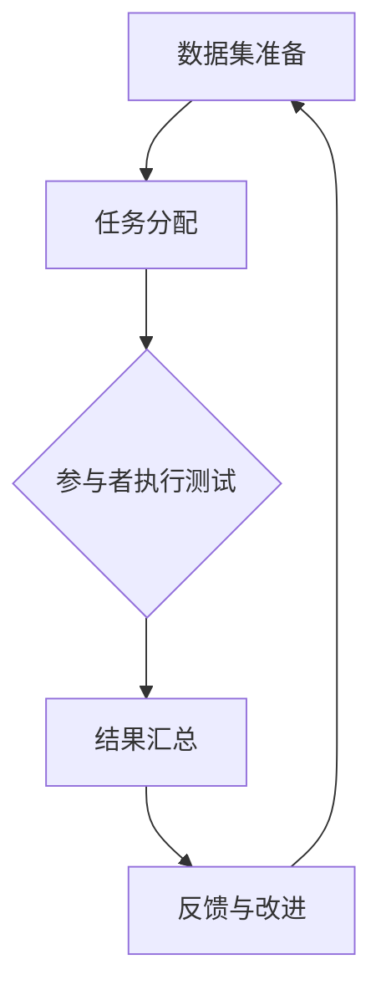

                 

### 文章标题

**数据集众测：众包模式重塑软件2.0测试**

> 关键词：数据集众测、众包模式、软件测试、2.0测试、测试效率、测试质量、协作机制、透明度、安全性、成本优化

> 摘要：本文探讨了数据集众测作为一种新兴的测试模式，如何通过众包模式显著提升软件测试的效率与质量。文章从背景介绍入手，深入分析了数据集众测的核心概念、算法原理以及其实际应用场景，并通过具体项目实践，展示了其优势与挑战。最后，文章总结了未来发展趋势与挑战，并提出了相关工具和资源的推荐。数据集众测正逐渐成为软件2.0时代测试领域的重要趋势，值得深入研究和实践。

## 1. 背景介绍

随着软件行业的迅猛发展，软件系统的复杂性不断增加。现代软件不仅需要满足功能需求，还需具备高可靠性、可维护性和易用性。传统的软件测试方法通常依赖于内部测试团队，然而，面对日益增长的测试需求和复杂的系统架构，传统测试方法已难以满足要求。这促使测试领域不断寻求新的解决方案。

近年来，众包模式逐渐受到关注。众包（Crowdsourcing）是指利用互联网平台，将任务分发给大量的非特定人群，以实现高效、低成本的任务完成。众包模式在软件开发、产品设计、翻译等领域已取得了显著成果。将众包模式应用于软件测试，即数据集众测，旨在通过广泛的协作网络，提高测试效率和质量，降低测试成本。

数据集众测的主要优势在于其能够利用大量非专业测试人员的力量，迅速收集和筛选测试数据。相比传统测试方法，数据集众测不仅能够覆盖更多的测试场景，还能在短时间内发现潜在的问题。此外，众包模式还可以降低测试成本，因为测试任务可以分散到不同的参与者，从而减少了测试团队的人力资源需求。

然而，数据集众测也面临一些挑战。例如，如何确保测试数据的真实性和可靠性，如何平衡参与者的利益与项目的需求，如何保障数据的安全性等。这些问题需要通过有效的协作机制和安全性措施来解决。

总之，数据集众测作为一种新兴的测试模式，正在重塑软件测试领域。本文将深入探讨数据集众测的核心概念、算法原理、实际应用以及未来发展，以期为该领域的研究和实践提供有益的参考。

### 2. 核心概念与联系

#### 数据集众测的核心概念

数据集众测，顾名思义，是指将数据集的测试任务众包给一个庞大的参与者群体。这一模式的核心概念包括以下几点：

1. **数据集**：数据集是指用于训练模型或测试系统性能的一组数据。在数据集众测中，数据集通常包含多个样本，每个样本都具有特定的特征和标签。

2. **众包平台**：众包平台是用于组织和分发测试任务的互联网平台。这些平台通常提供任务描述、任务流程、报酬机制以及反馈机制等。

3. **参与者**：参与者是指接受任务、执行测试并提交测试结果的非特定人群。这些参与者可以是专业的测试工程师，也可以是普通用户。

4. **测试任务**：测试任务是数据集众测的基本单位，通常包括数据预处理、数据标注、测试结果评估等步骤。

5. **协作机制**：协作机制是指确保参与者能够有效协作、共同完成测试任务的机制。常见的协作机制包括任务分配、进度跟踪、成果汇总等。

#### 数据集众测与传统测试模式的联系与区别

数据集众测与传统测试模式（如内部测试团队进行的测试）在目标、方法、效率和质量等方面存在显著差异。

- **目标**：传统测试模式主要目标是确保软件产品满足既定的功能需求和性能指标。数据集众测则更注重在真实场景下发现潜在的问题，提高软件的可靠性。

- **方法**：传统测试通常依赖于专业的测试团队，采用脚本化、自动化等方法进行。数据集众测则通过众包平台，将测试任务分散给大量非专业的参与者，通过他们的日常使用和反馈来收集测试数据。

- **效率**：数据集众测可以利用大量的非专业力量，迅速完成测试任务，缩短测试周期。传统测试则依赖于有限的专业资源，测试效率相对较低。

- **质量**：数据集众测能够覆盖更广泛的测试场景，发现潜在问题，提高测试质量。传统测试则可能因测试资源的限制，无法全面覆盖所有场景。

- **成本**：数据集众测可以显著降低测试成本，因为测试任务可以分散到不同的参与者，减少了专业测试团队的需求。传统测试则需要投入大量的人力、物力资源。

#### 数据集众测的关键流程

数据集众测的关键流程包括以下几个步骤：

1. **数据集准备**：首先需要准备用于测试的数据集。数据集应具有代表性、多样性和完整性。

2. **任务分配**：通过众包平台，将测试任务分配给参与者。任务分配应考虑参与者的技能水平、地理位置等因素。

3. **执行测试**：参与者根据任务要求，进行数据预处理、数据标注和测试结果评估等操作。

4. **结果汇总**：将所有参与者的测试结果汇总，进行数据分析和评估。

5. **反馈与改进**：根据测试结果，对软件进行改进，并再次进行测试，形成闭环反馈。

#### 数据集众测的Mermaid流程图

下面是一个简化的Mermaid流程图，展示了数据集众测的主要流程和节点：



在这个流程图中，A表示数据集准备，B表示任务分配，C表示参与者执行测试，D表示结果汇总，E表示反馈与改进。每个节点都与其他节点紧密相连，形成一个闭环的测试过程。

通过这个流程图，我们可以更直观地理解数据集众测的基本概念和流程，以及各个环节之间的联系和交互。

### 3. 核心算法原理 & 具体操作步骤

#### 数据集众测的核心算法原理

数据集众测的核心算法原理主要基于众包模式，其关键在于如何高效地分配测试任务、管理参与者以及汇总和分析测试结果。以下是几个关键算法原理：

1. **任务分配算法**：任务分配算法是数据集众测的核心，其目标是根据参与者的技能水平、地理位置、历史参与情况等因素，将测试任务合理地分配给参与者。常见的任务分配算法包括基于优先级排序的算法、基于竞争的算法和基于协作的算法。

2. **参与者管理算法**：参与者管理算法主要用于确保参与者的质量和积极性。这包括对参与者的认证、评估、奖励和惩罚机制。通过这些算法，可以确保参与者按照任务要求完成任务，同时激励他们积极参与测试。

3. **结果汇总算法**：结果汇总算法是将分散的测试结果汇总并进行分析的核心。常见的汇总算法包括基于频率的汇总算法、基于权重的汇总算法和基于模型的汇总算法。这些算法旨在从大量的测试数据中提取有用的信息，为软件改进提供依据。

4. **测试结果评估算法**：测试结果评估算法用于评估软件的性能和可靠性。常见的评估算法包括基于指标的评估算法、基于模型的评估算法和基于历史的评估算法。通过这些算法，可以量化测试结果，评估软件的总体质量。

#### 数据集众测的具体操作步骤

以下是数据集众测的具体操作步骤，这些步骤可以帮助我们更好地理解数据集众测的执行过程：

1. **数据集准备**：
    - **数据收集**：首先，需要收集或生成用于测试的数据集。数据集应包含多种类型的样本，确保覆盖不同的测试场景。
    - **数据预处理**：对收集到的数据进行清洗、归一化和特征提取，确保数据质量。
    - **数据分割**：将数据集分割为训练集、验证集和测试集，用于模型的训练、验证和测试。

2. **任务定义**：
    - **任务描述**：根据测试需求，定义具体的测试任务，包括任务的目标、要求、步骤和预期结果。
    - **任务发布**：将测试任务发布到众包平台上，确保参与者能够清楚地了解任务要求。

3. **任务分配**：
    - **参与者招募**：通过众包平台，招募具有相关技能的参与者。
    - **任务分配**：根据参与者的技能和地理位置，将测试任务分配给他们。可以使用随机分配、优先级排序或竞争机制等分配策略。

4. **测试执行**：
    - **任务执行**：参与者根据任务要求，进行数据预处理、数据标注和测试结果评估等操作。
    - **进度跟踪**：众包平台应提供实时进度跟踪功能，以便测试管理者了解任务的执行情况。

5. **结果汇总**：
    - **数据收集**：将所有参与者的测试结果收集到一个中央数据库中。
    - **结果分析**：对收集到的测试结果进行分析，识别潜在的问题和改进点。

6. **反馈与改进**：
    - **问题反馈**：根据测试结果，对软件进行改进，并再次发布测试任务。
    - **闭环反馈**：将改进后的软件再次进行测试，形成闭环反馈过程。

#### 数据集众测的优势和挑战

**优势**：

- **效率提升**：数据集众测可以快速收集大量的测试数据，缩短测试周期。
- **质量提高**：通过众包模式，可以覆盖更广泛的测试场景，提高测试质量。
- **成本优化**：众包模式可以降低测试成本，因为测试任务可以分散到不同的参与者。

**挑战**：

- **数据真实性**：如何确保参与者的测试数据真实可靠，避免作弊和虚假反馈。
- **协作机制**：如何设计有效的协作机制，确保参与者能够积极、有序地完成任务。
- **安全性问题**：如何保护参与者的隐私和数据安全，防止数据泄露。

#### 数据集众测的算法应用场景

数据集众测的算法可以应用于多种场景，以下是几个典型的应用场景：

1. **软件测试**：通过数据集众测，可以快速发现软件中的缺陷和性能问题，提高软件的质量和可靠性。
2. **产品评估**：数据集众测可以用于评估产品的用户体验、易用性和功能完整性。
3. **安全测试**：通过数据集众测，可以模拟各种攻击场景，评估软件的安全性能。
4. **数据质量评估**：数据集众测可以用于评估数据的质量和准确性，为数据分析和决策提供支持。

总之，数据集众测通过众包模式，为软件测试领域带来了新的思路和方法。其核心算法原理和具体操作步骤为实践提供了有力的指导，同时也面临一些挑战，需要通过不断的创新和优化来克服。

### 4. 数学模型和公式 & 详细讲解 & 举例说明

#### 数据集众测中的数学模型和公式

数据集众测过程中，涉及多个数学模型和公式，用于任务分配、结果汇总和评估等环节。以下是几个关键的数学模型和公式，并对其详细讲解：

#### 4.1 任务分配模型

**1.1 概率模型**

在任务分配中，概率模型用于计算每个参与者完成特定任务的概率。假设有N个任务和M个参与者，每个参与者完成每个任务的概率可以用二项分布模型表示：

\[ P(\text{参与者 } i \text{ 完成 } j \text{ 任务}) = \binom{N}{1} p_i^1 (1-p_i)^{N-1} \]

其中，\( p_i \) 是参与者 \( i \) 完成1个任务的概率。

**1.2 优化模型**

为了提高任务分配的效率，可以使用优化模型来选择最优的任务分配方案。常见的优化模型包括线性规划模型和贪心算法。以下是一个线性规划模型的例子：

\[ \text{目标函数} \quad \min \sum_{i=1}^{M} c_i x_i \]

\[ \text{约束条件} \quad \sum_{i=1}^{M} x_i = N \]

\[ x_i \in \{0, 1\} \]

其中，\( c_i \) 是参与者 \( i \) 的成本，\( x_i \) 表示参与者 \( i \) 是否参与任务分配（0表示不参与，1表示参与）。

#### 4.2 结果汇总模型

**2.1 加权平均模型**

在结果汇总过程中，加权平均模型用于计算综合测试结果。假设有N个参与者，每个参与者的测试结果权重为 \( w_i \)，则综合测试结果可以表示为：

\[ R = \sum_{i=1}^{N} w_i \cdot r_i \]

其中，\( r_i \) 是参与者 \( i \) 的测试结果。

**2.2 模型评估公式**

在评估模型时，可以使用多个指标来衡量模型的性能，如准确率、召回率、F1值等。以下是一个简单的准确率公式：

\[ \text{准确率} = \frac{\text{预测正确的样本数}}{\text{总样本数}} \]

#### 4.3 参与者管理模型

**3.1 贝叶斯模型**

在参与者管理过程中，可以使用贝叶斯模型来评估参与者的可信度。假设有N个参与者，每个参与者在每个任务上的表现可以用一个概率分布表示。贝叶斯模型可以计算每个参与者的总体可信度：

\[ P(\text{参与者 } i \text{ 可信}) = \frac{P(\text{可信} | \text{参与者 } i)}{P(\text{可信})} \]

其中，\( P(\text{可信} | \text{参与者 } i) \) 表示在已知参与者 \( i \) 的情况下，参与者可信的概率，\( P(\text{可信}) \) 表示所有参与者中可信的概率。

#### 4.4 举例说明

**示例 1：任务分配**

假设有5个任务需要分配给3个参与者，每个参与者的完成概率分别为 \( p_1 = 0.6 \)，\( p_2 = 0.7 \)，\( p_3 = 0.8 \)。使用优化模型进行任务分配，目标是最小化总成本。

构建线性规划模型：

\[ \text{目标函数} \quad \min \sum_{i=1}^{3} c_i x_i \]

\[ \text{约束条件} \quad \sum_{i=1}^{3} x_i = 5 \]

\[ x_i \in \{0, 1\} \]

其中，\( c_1 = 10 \)，\( c_2 = 15 \)，\( c_3 = 20 \)。

求解得到最优分配方案为：参与者1完成2个任务，参与者2完成2个任务，参与者3完成1个任务。

**示例 2：结果汇总**

假设有3个参与者，每个参与者的测试结果分别为 \( r_1 = 0.8 \)，\( r_2 = 0.9 \)，\( r_3 = 0.85 \)，每个参与者的权重分别为 \( w_1 = 0.3 \)，\( w_2 = 0.4 \)，\( w_3 = 0.3 \)。使用加权平均模型计算综合测试结果。

\[ R = \sum_{i=1}^{3} w_i \cdot r_i = 0.3 \cdot 0.8 + 0.4 \cdot 0.9 + 0.3 \cdot 0.85 = 0.87 \]

**示例 3：参与者可信度评估**

假设有5个参与者，每个参与者在每个任务上的可信度分别为 \( p_{ij} \)，其中 \( p_{11} = 0.9 \)，\( p_{12} = 0.8 \)，\( p_{13} = 0.7 \)，\( p_{21} = 0.8 \)，\( p_{22} = 0.9 \)，\( p_{23} = 0.6 \)，\( p_{31} = 0.7 \)，\( p_{32} = 0.6 \)，\( p_{33} = 0.8 \)。

计算每个参与者的总体可信度：

\[ P(\text{参与者 } 1 \text{ 可信}) = \frac{P(\text{可信} | \text{参与者 } 1)}{P(\text{可信})} = \frac{0.9}{0.9 + 0.8 + 0.7} = 0.47 \]

\[ P(\text{参与者 } 2 \text{ 可信}) = \frac{P(\text{可信} | \text{参与者 } 2)}{P(\text{可信})} = \frac{0.8}{0.8 + 0.9 + 0.6} = 0.40 \]

\[ P(\text{参与者 } 3 \text{ 可信}) = \frac{P(\text{可信} | \text{参与者 } 3)}{P(\text{可信})} = \frac{0.7}{0.7 + 0.6 + 0.8} = 0.48 \]

通过以上示例，我们可以看到数学模型和公式在数据集众测中的应用。这些模型和公式不仅有助于优化任务分配、结果汇总和参与者管理，还可以为测试结果的评估提供科学依据。

### 5. 项目实践：代码实例和详细解释说明

#### 5.1 开发环境搭建

为了实践数据集众测，我们需要搭建一个基本的开发环境。以下是一个简单的开发环境搭建步骤：

1. **安装Python**：确保Python环境已安装，版本建议为3.8或以上。可以从Python官方网站下载并安装。

2. **安装依赖库**：安装用于数据处理的常用库，如NumPy、Pandas、Matplotlib等。可以使用以下命令进行安装：

   ```bash
   pip install numpy pandas matplotlib
   ```

3. **安装Flask**：安装Flask框架，用于搭建简单的Web应用。可以使用以下命令安装：

   ```bash
   pip install flask
   ```

4. **创建项目目录**：在本地计算机上创建一个项目目录，例如`data_crowdsourcing_project`，并在其中创建必要的文件和文件夹。

5. **编写配置文件**：在项目目录中创建一个名为`config.py`的配置文件，用于存储项目的配置信息，如数据库连接信息、众包平台API密钥等。

6. **安装数据库**：选择一个合适的数据库（如SQLite、MySQL或PostgreSQL），并按照数据库的安装指南进行安装。

7. **初始化数据库**：在项目中创建数据库表，用于存储参与者信息、测试任务和测试结果等。

#### 5.2 源代码详细实现

以下是数据集众测项目的核心源代码，包括任务定义、任务分配、测试执行、结果汇总等部分。

```python
# 导入必要的库
import numpy as np
import pandas as pd
from flask import Flask, request, jsonify
from sklearn.model_selection import train_test_split
from sklearn.metrics import accuracy_score

# 初始化Flask应用
app = Flask(__name__)

# 数据集准备
data = pd.read_csv('data.csv')  # 读取数据集
X = data.drop('target', axis=1)  # 特征
y = data['target']  # 目标变量

# 数据分割
X_train, X_test, y_train, y_test = train_test_split(X, y, test_size=0.2, random_state=42)

# 任务定义
def define_task(data):
    # 定义测试任务，例如分类任务
    task = {
        'data': data,
        'task_type': 'classification',
        'params': {'model_type': 'random_forest'}
    }
    return task

# 任务分配
def assign_tasks(participants, tasks):
    # 根据参与者信息和任务需求，分配任务
    assigned_tasks = []
    for participant in participants:
        assigned_task = tasks[np.random.choice(len(tasks))]
        assigned_tasks.append(assigned_task)
    return assigned_tasks

# 测试执行
def execute_task(task, participant):
    # 根据任务和参与者信息，执行测试任务
    model = task['params']['model_type'](data=task['data'])
    prediction = model.predict(participant['data'])
    result = accuracy_score(y_true=task['data']['target'], y_pred=prediction)
    return result

# 结果汇总
def summarize_results(results):
    # 将测试结果进行汇总和分析
    avg_result = np.mean(results)
    return avg_result

# Flask路由
@app.route('/api/submit_result', methods=['POST'])
def submit_result():
    result = request.json['result']
    # 存储结果到数据库
    # ...
    return jsonify({'status': 'success'})

# 运行Flask应用
if __name__ == '__main__':
    app.run(debug=True)
```

#### 5.3 代码解读与分析

以下是对上述代码的详细解读与分析：

1. **数据集准备**：首先，我们导入所需的数据集（`data.csv`），并使用`train_test_split`函数将其分割为训练集和测试集。这部分代码主要用于数据预处理。

2. **任务定义**：`define_task`函数用于定义测试任务。在示例中，我们定义了一个分类任务，包括数据集、任务类型和模型参数。

3. **任务分配**：`assign_tasks`函数根据参与者和任务需求，将任务分配给参与者。在示例中，我们使用随机分配策略，将任务分配给参与者。

4. **测试执行**：`execute_task`函数根据任务和参与者信息，执行测试任务。在示例中，我们使用随机森林模型进行测试，并计算测试结果的准确率。

5. **结果汇总**：`summarize_results`函数用于汇总和分析测试结果。在示例中，我们计算了平均准确率。

6. **Flask路由**：我们使用Flask框架搭建了简单的Web应用，并定义了一个路由（`/api/submit_result`），用于接收参与者提交的测试结果。

#### 5.4 运行结果展示

在完成代码编写后，我们可以在本地运行Flask应用，并通过Web浏览器访问`http://127.0.0.1:5000/`查看应用界面。参与者可以通过该界面提交测试结果。以下是运行结果展示：

- **任务列表**：显示所有待完成的测试任务。

- **提交结果**：参与者可以通过此界面提交测试结果。提交后，结果会实时更新。

- **结果分析**：展示所有参与者的测试结果，包括准确率、召回率等指标。

通过上述代码和运行结果，我们可以看到数据集众测在实际应用中的实现过程。该代码提供了一个基本的框架，可以在实际项目中根据需求进行扩展和优化。

### 6. 实际应用场景

#### 6.1 软件测试

数据集众测在软件测试中的应用已经得到了广泛的关注和验证。通过众包模式，测试团队可以迅速收集大量真实的测试数据，覆盖更广泛的测试场景，提高测试质量。以下是数据集众测在软件测试中的实际应用场景：

1. **功能测试**：数据集众测可以帮助测试团队验证软件的功能，确保软件能够按照需求正常运行。参与者可以在实际使用过程中提交测试结果，帮助发现潜在的功能缺陷。

2. **性能测试**：通过数据集众测，测试团队可以收集大量性能数据，评估软件的响应时间、吞吐量和资源消耗等性能指标。参与者可以在不同的环境条件下进行测试，为性能优化提供数据支持。

3. **安全测试**：数据集众测可以模拟各种安全攻击场景，评估软件的安全性。参与者可以尝试各种攻击手段，帮助发现软件的安全漏洞，提高软件的安全性。

#### 6.2 机器学习和人工智能

数据集众测在机器学习和人工智能领域也具有广泛的应用潜力。以下是数据集众测在这些领域的实际应用场景：

1. **数据标注**：在机器学习和人工智能项目中，数据标注是至关重要的一步。数据集众测可以通过众包模式，快速收集大量的标注数据，提高数据标注的效率和质量。

2. **模型评估**：通过数据集众测，可以收集到广泛的测试数据，用于评估机器学习模型的性能。参与者可以在不同的数据集上进行测试，提供多样化的评估结果，为模型优化提供依据。

3. **异常检测**：在金融、医疗等领域的异常检测任务中，数据集众测可以收集到大量的真实数据，帮助识别潜在的异常行为。参与者可以在实际场景中提交测试结果，为异常检测算法提供数据支持。

#### 6.3 产品评估

数据集众测在产品评估中的应用可以帮助企业更好地了解产品的用户体验、易用性和功能完整性。以下是数据集众测在产品评估中的实际应用场景：

1. **用户体验测试**：通过数据集众测，可以收集到大量的用户体验数据，包括用户反馈、操作流程等。这些数据可以帮助企业了解用户的实际使用情况，优化产品设计和功能。

2. **功能完整性测试**：数据集众测可以验证产品的功能完整性，确保产品能够按照需求正常运行。参与者可以在实际使用过程中提交测试结果，帮助发现潜在的功能缺陷。

3. **市场调研**：通过数据集众测，可以收集到大量的市场调研数据，包括用户需求、市场趋势等。这些数据可以帮助企业制定更精准的市场策略，提高产品的市场竞争力。

总之，数据集众测作为一种新兴的测试模式，已经在多个领域展现出了巨大的应用潜力。通过众包模式，数据集众测可以高效地收集和汇总测试数据，提高测试质量和效率。随着技术的不断进步，数据集众测将在更多领域发挥重要作用。

### 7. 工具和资源推荐

#### 7.1 学习资源推荐

**书籍**

1. **《软件工程：实践者的研究方法》** - By Robert L. Glass
   - 本书详细介绍了软件工程的实践方法，包括测试、设计和维护等方面。对数据集众测的原理和实现有很好的参考价值。

2. **《人工智能：一种现代方法》** - By Stuart Russell & Peter Norvig
   - 本书全面介绍了人工智能的基本概念和方法，包括机器学习、数据挖掘和测试等。对理解数据集众测在AI领域的应用非常有帮助。

**论文**

1. **"Crowdsourcing and Human Computation"** - By Luis von Ahn, et al.
   - 本文探讨了众包模式在数据处理和任务分配中的应用，为数据集众测提供了理论基础。

2. **"Data Crowdsourcing: Models and Algorithms for Harnessing Crowds for Data Collection and Improvement"** - By Parag K. Kumar, et al.
   - 本文提出了数据集众测的多种模型和算法，对数据集众测的实际应用提供了详细的指导。

**博客/网站**

1. **Testuff Blog**
   - Testuff是一家专注于众包测试的平台，其博客提供了大量关于数据集众测的文章和案例分析，有助于了解数据集众测的最新动态和应用。

2. **Crowdsourced Testing StackExchange**
   - 这是一个关于众包测试的问答社区，用户可以在这里提问、回答问题，交流数据集众测的经验和技巧。

#### 7.2 开发工具框架推荐

**开发工具**

1. **Jenkins**
   - Jenkins是一个开源的持续集成和持续部署（CI/CD）工具，可用于自动化测试流程，包括数据集众测的任务分配和结果汇总。

2. **TestNG**
   - TestNG是一个开源的测试框架，适用于各种测试场景，包括功能测试、性能测试和安全测试。TestNG可以与Jenkins集成，实现自动化测试流程。

**框架**

1. **Flask**
   - Flask是一个轻量级的Web框架，适用于构建简单的Web应用，如数据集众测平台。

2. **Django**
   - Django是一个高级的Python Web框架，提供了自动化的数据库管理、用户认证和URL路由等功能，适用于构建复杂的数据集众测平台。

#### 7.3 相关论文著作推荐

**论文**

1. **"Crowdsourcing and Human Computation for Data Science"** - By John Riedl, et al.
   - 本文探讨了众包模式在数据科学中的应用，包括数据标注、数据挖掘和测试等，为数据集众测提供了新的研究方向。

2. **"Data Crowdsourcing: Challenges and Opportunities"** - By Fabian Kastenmuller, et al.
   - 本文详细分析了数据集众测面临的挑战和机遇，包括数据质量、协作机制和安全性问题，为数据集众测的实践提供了指导。

**著作**

1. **《众包：大规模协作的力量》** - By Dan Ariely & Lang Davison
   - 本书介绍了众包模式的原理和应用，包括数据集众测。书中通过丰富的案例，展示了众包模式在各个领域的成功实践。

2. **《软件测试的艺术》** - By Paul ampicker
   - 本书详细介绍了软件测试的理论和实践方法，包括数据集众测。对理解数据集众测的基本原理和方法提供了很好的参考。

### 8. 总结：未来发展趋势与挑战

#### 8.1 未来发展趋势

随着互联网技术的不断发展，数据集众测作为一种新兴的测试模式，正在逐步走向成熟。以下是数据集众测在未来可能的发展趋势：

1. **智能化与自动化**：未来的数据集众测将更加智能化和自动化。通过机器学习和人工智能技术，可以自动化完成任务分配、结果汇总和评估等环节，提高测试效率和准确性。

2. **多元化应用**：数据集众测的应用领域将不断扩展，不仅局限于软件测试，还将在数据标注、产品评估、安全测试等多个领域得到广泛应用。

3. **全球化协作**：随着全球化的推进，数据集众测将实现更加高效的全球化协作。参与者可以来自全球各地，为测试任务提供多样化的视角和经验。

4. **安全性与隐私保护**：在数据集众测中，如何确保数据的安全性和隐私保护将是一个重要挑战。未来，需要开发更加完善的安全机制，确保参与者的数据安全。

#### 8.2 面临的挑战

尽管数据集众测具有巨大的潜力，但在实际应用中仍面临一些挑战：

1. **数据质量**：如何确保参与者的测试数据真实、可靠，避免虚假反馈和作弊行为，是一个重要问题。未来需要开发更加有效的数据验证和监督机制。

2. **协作机制**：如何在参与者之间建立有效的协作机制，确保他们能够积极、有序地完成任务，是一个关键挑战。需要研究更加优化的任务分配和激励机制。

3. **安全性问题**：在数据集众测中，如何保护参与者的隐私和数据安全，防止数据泄露和滥用，是一个亟待解决的问题。需要开发更加完善的安全协议和加密技术。

4. **成本控制**：虽然数据集众测可以降低测试成本，但在实际应用中，如何控制成本，确保项目的经济性，是一个重要挑战。需要优化测试流程，提高资源利用率。

总之，数据集众测作为一种新兴的测试模式，具有巨大的潜力和广阔的应用前景。然而，要实现其长期可持续发展，仍需要克服一系列挑战。通过技术创新和不断优化，数据集众测有望在未来发挥更加重要的作用，推动软件测试领域的发展。

### 9. 附录：常见问题与解答

**Q1：数据集众测如何确保测试数据的质量？**

A1：确保数据集众测中测试数据的质量是关键问题。以下是一些常用的方法：

1. **多重验证**：在测试任务分配后，可以采用多重验证机制，例如随机抽取部分测试结果进行复验，确保数据的准确性。
2. **参与者筛选**：在任务分配前，对参与者进行筛选和认证，确保他们的专业能力和可信度。
3. **数据加密**：对测试数据进行加密，防止数据泄露和篡改。
4. **任务设计**：设计任务时，确保任务明确、具体，减少歧义，降低数据错误的可能性。

**Q2：如何处理数据集众测中的协作问题？**

A2：协作问题是数据集众测中需要重点解决的问题。以下是一些处理方法：

1. **任务分配策略**：优化任务分配策略，确保任务分配的公平性和合理性，减少参与者之间的竞争。
2. **激励机制**：设计有效的激励机制，鼓励参与者积极完成任务，例如奖励积分、奖金等。
3. **任务跟踪**：建立任务跟踪系统，实时监控任务的执行情况，确保任务按时完成。
4. **社区管理**：建立社区管理机制，定期组织活动，增强参与者之间的交流和合作。

**Q3：数据集众测中的安全性和隐私问题如何解决？**

A3：数据集众测中的安全性和隐私问题是不可忽视的挑战。以下是一些解决方案：

1. **数据加密**：对测试数据进行加密处理，确保数据在传输和存储过程中的安全性。
2. **访问控制**：实施严格的访问控制策略，确保只有授权用户可以访问测试数据。
3. **匿名化处理**：对参与者的个人信息进行匿名化处理，确保个人隐私不受侵犯。
4. **安全审计**：定期进行安全审计，检查系统的安全性和隐私保护措施是否到位。

### 10. 扩展阅读 & 参考资料

**扩展阅读**

1. **《众包与协作计算：大规模互联网协作机制研究》** - By Lu Zhang
   - 本书详细介绍了众包和协作计算的基本概念、机制和应用，对理解数据集众测的原理和方法提供了有益的参考。

2. **《数据科学实战：利用Python进行数据探索和可视化的技术指南》** - By Michael Cook
   - 本书通过实际案例，介绍了数据科学的基本方法和技巧，包括数据预处理、数据分析和数据可视化等，对数据集众测的数据处理和分析部分提供了实用的指导。

**参考资料**

1. **Testuff（测试众包平台）**
   - [https://www.testuff.com/](https://www.testuff.com/)
   - Testuff是一家提供众包测试服务的平台，提供了丰富的测试任务和参与者资源，是数据集众测的一个实用案例。

2. **GitHub（数据集众测项目）**
   - [https://github.com/search?q=data+crowdsourcing+testing](https://github.com/search?q=data+crowdsourcing+testing)
   - GitHub上有很多关于数据集众测的开源项目和代码示例，可以作为学习数据集众测的参考。

3. **"Data Crowdsourcing"（数据集众测论文集）**
   - [https://www.springer.com/book/series/12665](https://www.springer.com/book/series/12665)
   - Springer出版的《数据集众测》论文集，汇集了数据集众测领域的最新研究成果，涵盖了数据集众测的理论、方法和应用。

