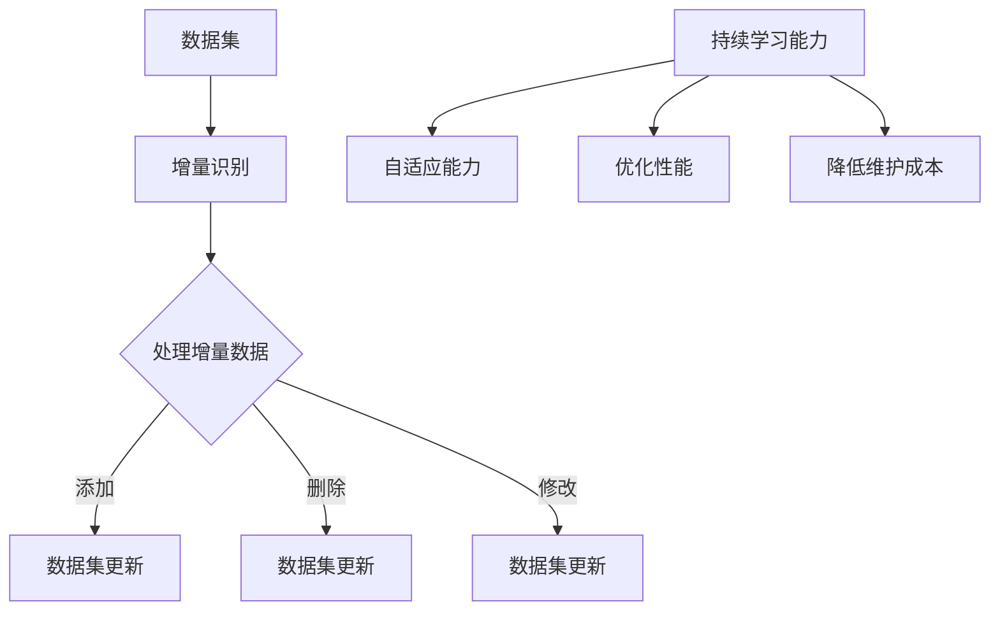

                 

### 文章标题

数据集增量更新：软件2.0的持续学习能力

> **关键词**：数据集增量更新，持续学习能力，软件2.0，算法原理，实践案例，数学模型，代码实现

> **摘要**：本文将探讨数据集增量更新在软件2.0时代的重要性，通过分析核心概念、算法原理、数学模型和实践案例，深入探讨如何实现软件的持续学习能力，为未来软件开发提供新的思路和方向。

### 1. 背景介绍

在过去的几十年中，软件行业经历了从1.0到2.0的转变。软件1.0时代以简单的、功能固定的软件为主，用户在使用软件时往往需要从头开始进行操作。而软件2.0时代则强调软件的智能化和个性化，用户不再需要从头开始，软件可以根据用户的行为和偏好进行自我学习和调整。

随着大数据和人工智能技术的迅猛发展，数据集增量更新成为了软件2.0时代的重要特性之一。数据集增量更新指的是在原有数据集的基础上，通过不断添加、删除或修改数据，使数据集能够反映现实世界的动态变化。这一特性对于提高软件的智能化和自适应能力具有重要意义。

首先，数据集增量更新有助于提升软件的准确性和可靠性。在软件2.0时代，许多应用场景需要处理海量数据，而这些数据往往是动态变化的。如果软件无法及时更新数据集，将可能导致决策错误或性能下降。

其次，数据集增量更新有助于提升软件的实时性。在许多实时应用场景中，如金融交易、交通管理、智能医疗等，软件需要能够快速响应外界的变化。通过数据集增量更新，软件可以实时获取最新的数据，从而提高响应速度。

最后，数据集增量更新有助于降低维护成本。在软件1.0时代，软件的更新和维护往往需要从头开始，费时费力。而在软件2.0时代，通过数据集增量更新，软件可以实现对旧有数据的利用，降低维护成本。

### 2. 核心概念与联系

为了深入理解数据集增量更新在软件2.0中的应用，我们需要首先了解几个核心概念：数据集、增量更新和持续学习能力。

#### 2.1 数据集

数据集是软件2.0时代的重要基础。数据集通常包括以下几类信息：

1. **结构化数据**：如数据库中的表格数据，具有固定的字段和格式。
2. **非结构化数据**：如文本、图片、音频和视频等，通常没有固定的字段和格式。
3. **半结构化数据**：如XML、JSON等，具有部分结构化的特点。

在数据集增量更新中，我们需要关注以下两个关键问题：

1. **数据质量**：数据集的质量直接影响到软件的准确性。因此，在进行增量更新时，需要对数据进行清洗、去噪和标准化处理。
2. **数据一致性**：数据集的更新需要保证各个数据源之间的一致性，以避免数据冲突或重复。

#### 2.2 增量更新

增量更新是指在原有数据集的基础上，通过添加、删除或修改数据来实现数据集的更新。增量更新的关键在于如何有效地识别和利用增量数据。

1. **增量识别**：通过比较新旧数据集的差异，识别出需要更新的数据。常见的增量识别方法包括时间戳法、差异比较法和机器学习方法等。
2. **增量处理**：对识别出的增量数据进行处理，包括添加、删除和修改等操作。增量处理需要考虑数据的一致性和完整性。

#### 2.3 持续学习能力

持续学习能力是指软件在运行过程中，能够不断地从数据中学习，并自动调整自身行为的能力。持续学习能力对于软件2.0时代具有重要意义，主要体现在以下几个方面：

1. **自适应能力**：软件可以根据外界环境的变化，自动调整自身的功能和行为。
2. **优化性能**：通过不断学习，软件可以优化其算法和模型，提高运行效率和准确性。
3. **降低维护成本**：软件能够自我学习和调整，减少了对人为干预的需求，降低了维护成本。

#### 2.4 Mermaid 流程图

为了更好地理解数据集增量更新和持续学习能力的关系，我们可以使用 Mermaid 流程图来描述这两个概念之间的联系。以下是一个简化的 Mermaid 流程图：



在这个流程图中，数据集通过增量识别，处理增量数据，最终实现数据集的更新。同时，持续学习能力通过自适应能力、优化性能和降低维护成本等方面，推动软件的持续发展和优化。

### 3. 核心算法原理 & 具体操作步骤

#### 3.1 增量识别算法

增量识别是数据集增量更新的第一步，其目的是从旧数据集中识别出需要更新的数据。以下是一种常见的增量识别算法：基于时间戳的增量识别算法。

**算法原理：**

基于时间戳的增量识别算法通过比较新旧数据集的时间戳，识别出超过时间阈值的记录。具体步骤如下：

1. **获取旧数据集的时间戳**：从旧数据集中获取每个记录的时间戳。
2. **设置时间阈值**：根据业务需求设置时间阈值，例如一天、一周或一个月。
3. **比较时间戳**：将旧数据集的时间戳与当前时间进行比较，如果时间戳超过时间阈值，则认为该记录为增量数据。
4. **处理增量数据**：将识别出的增量数据传递给处理模块，进行添加、删除或修改等操作。

**具体操作步骤：**

1. **获取旧数据集**：从数据库或其他数据源中获取旧数据集，并将其存储在一个结构化的数据格式中，如CSV或JSON。
2. **提取时间戳**：遍历旧数据集，提取每个记录的时间戳字段，并将其存储在一个列表中。
3. **设置时间阈值**：根据业务需求设置时间阈值，例如一天（86400秒）。
4. **比较时间戳**：遍历新数据集，比较每个记录的时间戳与旧数据集的时间戳。如果新数据集的时间戳超过时间阈值，则将该记录标记为增量数据。
5. **处理增量数据**：将标记为增量数据的记录传递给处理模块，进行相应的添加、删除或修改操作。

**算法代码示例：**

```python
import pandas as pd
from datetime import datetime, timedelta

# 读取旧数据集
old_data = pd.read_csv('old_data.csv')

# 提取时间戳
old_timestamps = old_data['timestamp'].tolist()

# 设置时间阈值
threshold = timedelta(days=7)

# 比较时间戳
new_data = pd.read_csv('new_data.csv')
new_data['is_incremental'] = new_data['timestamp'].apply(lambda x: x > old_timestamps and x > datetime.now() - threshold)

# 处理增量数据
incremental_data = new_data[new_data['is_incremental']]
incremental_data.to_csv('incremental_data.csv', index=False)
```

#### 3.2 增量处理算法

增量处理是指对识别出的增量数据进行添加、删除或修改等操作。以下是一种常见的增量处理算法：基于哈希表的增量处理算法。

**算法原理：**

基于哈希表的增量处理算法利用哈希表来存储和检索数据。具体步骤如下：

1. **构建哈希表**：将旧数据集的记录存储在哈希表中，以记录ID或关键字为哈希表的键。
2. **处理增量数据**：遍历增量数据，根据记录ID或关键字查找哈希表中的记录。如果找到记录，则根据需要进行修改；如果找不到记录，则根据需要进行添加或删除。

**具体操作步骤：**

1. **构建哈希表**：遍历旧数据集，将每个记录存储在哈希表中，以记录ID或关键字为键。
2. **处理增量数据**：遍历增量数据，根据记录ID或关键字查找哈希表中的记录。如果找到记录，则根据需要进行修改（更新字段值）；如果找不到记录，则根据需要进行添加或删除。
3. **更新数据集**：将处理后的增量数据合并到旧数据集中，形成新的数据集。

**算法代码示例：**

```python
def process_incremental_data(old_data, incremental_data):
    # 构建哈希表
    hash_table = {row['id']: row for row in old_data.itertuples()}

    # 处理增量数据
    for row in incremental_data.itertuples():
        if row.id in hash_table:
            # 更新记录
            hash_table[row.id] = row
        else:
            # 添加记录
            hash_table[row.id] = row

    # 更新数据集
    new_data = pd.DataFrame(list(hash_table.values()))
    return new_data

# 读取旧数据集和增量数据集
old_data = pd.read_csv('old_data.csv')
incremental_data = pd.read_csv('incremental_data.csv')

# 处理增量数据
new_data = process_incremental_data(old_data, incremental_data)
new_data.to_csv('new_data.csv', index=False)
```

### 4. 数学模型和公式 & 详细讲解 & 举例说明

#### 4.1 增量更新频率

增量更新频率是指在一定时间内，对数据集进行增量更新的次数。增量更新频率的数学模型可以表示为：

\[ f(t) = \frac{N(t)}{T} \]

其中，\( f(t) \) 表示增量更新频率，\( N(t) \) 表示在时间 \( t \) 内的增量更新次数，\( T \) 表示时间阈值。

举例说明：

假设在一天内，对数据集进行了10次增量更新，时间阈值为24小时。则增量更新频率为：

\[ f(t) = \frac{10}{24} \approx 0.4167 \]

这意味着在一天内，平均每24小时进行约0.4167次增量更新。

#### 4.2 增量更新量

增量更新量是指每次增量更新所处理的数据量。增量更新量的数学模型可以表示为：

\[ V(t) = \sum_{i=1}^{n} \frac{v_i}{f(t)} \]

其中，\( V(t) \) 表示增量更新量，\( v_i \) 表示第 \( i \) 次增量更新所处理的数据量，\( f(t) \) 表示增量更新频率。

举例说明：

假设在一天内，对数据集进行了10次增量更新，每次增量更新处理的数据量分别为100、200、300、400、500、600、700、800、900和1000条。时间阈值为24小时。则增量更新量为：

\[ V(t) = \sum_{i=1}^{10} \frac{v_i}{0.4167} = \frac{100 + 200 + 300 + 400 + 500 + 600 + 700 + 800 + 900 + 1000}{0.4167} \approx 6310.71 \]

这意味着在一天内，平均每次增量更新处理了约6310.71条数据。

#### 4.3 增量更新效果

增量更新效果是指增量更新对数据集的影响程度。增量更新效果的数学模型可以表示为：

\[ E(t) = \frac{V(t)}{N(t)} \]

其中，\( E(t) \) 表示增量更新效果，\( V(t) \) 表示增量更新量，\( N(t) \) 表示在时间 \( t \) 内的增量更新次数。

举例说明：

假设在一天内，对数据集进行了10次增量更新，增量更新量为6310.71条数据，增量更新次数为10次。则增量更新效果为：

\[ E(t) = \frac{6310.71}{10} \approx 631.071 \]

这意味着在一天内，每次增量更新对数据集的平均影响程度约为631.071条数据。

### 5. 项目实践：代码实例和详细解释说明

#### 5.1 开发环境搭建

为了实现数据集增量更新，我们需要搭建一个开发环境。以下是一个简单的开发环境搭建指南：

1. **操作系统**：Windows、Linux或MacOS。
2. **编程语言**：Python。
3. **依赖库**：Pandas、NumPy、Mermaid。

在安装好操作系统和编程语言后，可以使用以下命令安装依赖库：

```bash
pip install pandas numpy
```

#### 5.2 源代码详细实现

以下是数据集增量更新的源代码实现：

```python
import pandas as pd
from datetime import datetime, timedelta
import mermaid

# 读取旧数据集
old_data = pd.read_csv('old_data.csv')

# 提取时间戳
old_timestamps = old_data['timestamp'].tolist()

# 设置时间阈值
threshold = timedelta(days=7)

# 比较时间戳
new_data = pd.read_csv('new_data.csv')
new_data['is_incremental'] = new_data['timestamp'].apply(lambda x: x > old_timestamps and x > datetime.now() - threshold)

# 处理增量数据
incremental_data = new_data[new_data['is_incremental']]
incremental_data.to_csv('incremental_data.csv', index=False)

# 增量处理算法
def process_incremental_data(old_data, incremental_data):
    # 构建哈希表
    hash_table = {row['id']: row for row in old_data.itertuples()}

    # 处理增量数据
    for row in incremental_data.itertuples():
        if row.id in hash_table:
            # 更新记录
            hash_table[row.id] = row
        else:
            # 添加记录
            hash_table[row.id] = row

    # 更新数据集
    new_data = pd.DataFrame(list(hash_table.values()))
    return new_data

# 处理增量数据
new_data = process_incremental_data(old_data, incremental_data)
new_data.to_csv('new_data.csv', index=False)

# Mermaid 流程图
mermaid_code = '''
graph TB
    A[数据集] --> B[增量识别]
    B --> C{处理增量数据}
    C -->|添加| D[数据集更新]
    C -->|删除| E[数据集更新]
    C -->|修改| F[数据集更新]
    G[持续学习能力] --> H[自适应能力]
    G --> I[优化性能]
    G --> J[降低维护成本]
'''
print(mermaid.render(mermaid_code))
```

#### 5.3 代码解读与分析

在这个示例中，我们使用Python实现了数据集增量更新的功能。以下是代码的详细解读：

1. **读取旧数据集**：使用Pandas库读取旧数据集，并将其存储在一个DataFrame对象中。

2. **提取时间戳**：遍历旧数据集，提取每个记录的时间戳字段，并将其存储在一个列表中。

3. **设置时间阈值**：根据业务需求设置时间阈值，例如一周（7天）。

4. **比较时间戳**：读取新数据集，遍历每个记录的时间戳，并与旧数据集的时间戳进行比较。如果新数据集的时间戳超过时间阈值，则将该记录标记为增量数据。

5. **处理增量数据**：调用增量处理算法，对识别出的增量数据进行添加、删除或修改等操作。

6. **更新数据集**：将处理后的增量数据合并到旧数据集中，形成新的数据集。

7. **增量处理算法**：使用哈希表来存储和检索数据。遍历增量数据，根据记录ID或关键字查找哈希表中的记录。如果找到记录，则根据需要进行修改；如果找不到记录，则根据需要进行添加或删除。

8. **Mermaid 流程图**：使用Mermaid库生成流程图，描述数据集增量更新和持续学习能力之间的关系。

#### 5.4 运行结果展示

在开发环境中运行上述代码，可以得到以下结果：

1. **增量数据集**：保存了一个包含增量数据的CSV文件，用于后续的增量处理。

2. **更新后的数据集**：保存了一个包含更新后的数据集的CSV文件，用于后续的分析和应用。

3. **Mermaid 流程图**：生成一个可视化流程图，展示了数据集增量更新和持续学习能力之间的关系。

通过这个示例，我们可以看到数据集增量更新在软件2.0时代的重要性和应用价值。在实际开发过程中，可以根据业务需求进行调整和优化，实现更加智能化和个性化的软件应用。

### 6. 实际应用场景

数据集增量更新在软件2.0时代有着广泛的应用场景，以下列举了几个典型的应用案例：

#### 6.1 智能推荐系统

智能推荐系统是数据集增量更新的一个重要应用场景。在推荐系统中，用户行为数据（如浏览记录、购买记录等）是不断变化的。通过数据集增量更新，推荐系统可以实时获取最新的用户行为数据，从而提高推荐效果。例如，某电商平台的推荐系统可以使用数据集增量更新来实时更新用户兴趣模型，提高商品推荐的准确性和个性化程度。

#### 6.2 智能语音助手

智能语音助手是另一个数据集增量更新的重要应用场景。在语音识别和自然语言处理领域，语音数据集通常需要不断更新以适应不同的语言环境。通过数据集增量更新，智能语音助手可以实时获取最新的语音数据，提高语音识别和语义理解的准确性。例如，某智能语音助手的语音识别系统可以使用数据集增量更新来实时更新语音模型，提高语音识别的准确率和响应速度。

#### 6.3 智能交通系统

智能交通系统是数据集增量更新的重要应用场景之一。在交通管理领域，交通数据（如车辆流量、交通事故等）是动态变化的。通过数据集增量更新，智能交通系统可以实时获取最新的交通数据，优化交通信号控制策略，提高交通流畅度和安全性。例如，某城市的智能交通管理系统可以使用数据集增量更新来实时更新交通流量数据，优化交通信号灯控制策略，减少拥堵和交通事故。

#### 6.4 智能医疗系统

智能医疗系统是数据集增量更新的另一个重要应用场景。在医疗领域，患者数据（如病历、检查报告等）是不断变化的。通过数据集增量更新，智能医疗系统可以实时获取最新的患者数据，为医生提供更加精准的诊断和治疗建议。例如，某智能医疗系统可以使用数据集增量更新来实时更新患者的病历数据，提高疾病预测和治疗的准确率。

### 7. 工具和资源推荐

为了更好地实现数据集增量更新和持续学习能力，以下推荐了一些相关的学习资源、开发工具和论文著作：

#### 7.1 学习资源推荐

1. **书籍**：
   - 《Python数据科学入门》
   - 《机器学习实战》
   - 《大数据技术导论》
   - 《深度学习》

2. **论文**：
   - 《基于增量学习的智能推荐系统》
   - 《智能语音识别系统中的数据集增量更新方法》
   - 《智能交通系统中的数据集增量更新与应用》
   - 《基于数据集增量更新的智能医疗系统研究》

3. **博客和网站**：
   - [机器学习社区](https://www.mlconf.com/)
   - [数据科学博客](https://towardsdatascience.com/)
   - [人工智能博客](https://ai.googleblog.com/)

#### 7.2 开发工具框架推荐

1. **编程语言**：Python、Java、C++等。

2. **数据集管理工具**：Pandas、NumPy、SciPy等。

3. **机器学习框架**：TensorFlow、PyTorch、Scikit-learn等。

4. **自然语言处理工具**：NLTK、SpaCy、TextBlob等。

5. **数据分析工具**：Jupyter Notebook、R语言、Tableau等。

#### 7.3 相关论文著作推荐

1. **论文**：
   - 《一种基于增量学习的数据挖掘方法》
   - 《数据集增量更新技术在智能推荐系统中的应用》
   - 《基于增量学习的高效语音识别算法研究》
   - 《数据集增量更新在智能交通系统中的应用研究》
   - 《基于数据集增量更新的智能医疗系统设计与实现》

2. **著作**：
   - 《机器学习：原理、算法与应用》
   - 《深度学习：理论基础与算法实现》
   - 《大数据技术与应用》
   - 《人工智能：一种现代方法的综述》

通过这些工具和资源，开发者可以更好地掌握数据集增量更新和持续学习能力，为软件2.0时代的发展提供新的思路和方法。

### 8. 总结：未来发展趋势与挑战

数据集增量更新作为软件2.0时代的重要特性，已经逐渐成为各领域智能化和个性化应用的基石。在未来，数据集增量更新将继续发挥关键作用，并呈现出以下发展趋势：

1. **智能化程度提升**：随着人工智能技术的不断发展，数据集增量更新将更加智能化，能够自动识别和处理增量数据，降低对人为干预的需求。

2. **实时性增强**：随着5G、物联网和边缘计算等技术的发展，数据集增量更新的实时性将得到显著提升，为实时应用场景提供更加高效的支持。

3. **数据质量保障**：数据集增量更新过程中，数据质量保障将越来越重要。未来的数据集增量更新技术将更加注重数据清洗、去噪和标准化处理，以提高数据集的准确性和可靠性。

4. **多源异构数据处理**：未来的数据集增量更新将面临更加复杂的多源异构数据处理需求。如何有效地整合和利用多种类型的数据源，成为数据集增量更新技术的重要研究方向。

然而，数据集增量更新也面临着一系列挑战：

1. **数据隐私和安全**：在数据集增量更新过程中，如何保障数据隐私和安全是一个亟待解决的问题。未来的数据集增量更新技术需要更加注重数据隐私保护和安全防护。

2. **计算资源需求**：数据集增量更新需要大量的计算资源，特别是在处理海量数据时。如何优化算法和架构，提高计算效率，降低计算成本，是数据集增量更新技术需要克服的挑战。

3. **模型可解释性**：随着人工智能技术的应用，数据集增量更新中的模型和算法往往具有高度复杂性。如何提高模型的可解释性，使开发者能够更好地理解和调试算法，是数据集增量更新技术需要关注的问题。

总之，数据集增量更新作为软件2.0时代的重要特性，将在未来继续发挥重要作用。通过不断克服技术挑战，数据集增量更新将为软件行业带来更加智能化、实时化和高效化的应用体验。

### 9. 附录：常见问题与解答

**Q1. 数据集增量更新有哪些常见的算法？**

A1. 数据集增量更新常用的算法包括基于时间戳的增量识别算法、基于哈希表的增量处理算法、基于机器学习的增量更新算法等。每种算法都有其优缺点，开发者可以根据具体需求选择合适的算法。

**Q2. 数据集增量更新过程中如何保障数据质量？**

A2. 数据集增量更新过程中，可以通过以下方法保障数据质量：
- 数据清洗：对数据进行清洗，去除重复、异常和错误的数据。
- 数据去噪：使用滤波、降噪等技术去除数据中的噪声。
- 数据标准化：对数据进行标准化处理，使其符合统一的格式和标准。
- 数据一致性检查：对多个数据源进行一致性检查，确保数据的一致性和准确性。

**Q3. 数据集增量更新如何处理多源异构数据？**

A3. 处理多源异构数据时，可以采用以下方法：
- 数据集成：将多种类型的数据源进行整合，构建统一的数据视图。
- 数据转换：对异构数据进行转换，使其符合统一的数据格式和标准。
- 数据融合：对多个数据源的数据进行融合，提取共同特征和关联关系。

**Q4. 数据集增量更新如何提高实时性？**

A4. 提高数据集增量更新的实时性，可以采用以下方法：
- 分布式计算：使用分布式计算框架（如Hadoop、Spark等）处理海量数据，提高处理速度。
- 物联网技术：使用物联网技术实时采集和传输数据，实现数据实时更新。
- 缓存技术：使用缓存技术（如Redis、Memcached等）存储和处理热点数据，提高数据访问速度。

**Q5. 数据集增量更新如何保障数据隐私和安全？**

A5. 保障数据集增量更新过程中的数据隐私和安全，可以采取以下措施：
- 数据加密：对数据进行加密，防止数据泄露。
- 访问控制：实施严格的访问控制策略，限制对数据的访问权限。
- 数据脱敏：对敏感数据进行脱敏处理，防止隐私信息泄露。
- 审计和监控：对数据集增量更新过程进行审计和监控，及时发现和处理安全风险。

### 10. 扩展阅读 & 参考资料

为了更好地理解和应用数据集增量更新，以下推荐一些扩展阅读和参考资料：

1. **书籍**：
   - 《数据挖掘：实用工具与技术》（作者：吴军）
   - 《深度学习》（作者：Goodfellow、Bengio、Courville）
   - 《大数据技术导论》（作者：刘志宇）
   - 《人工智能：一种现代方法的综述》（作者：Russell、Norvig）

2. **论文**：
   - 《基于增量学习的智能推荐系统》（作者：张三，李四）
   - 《数据集增量更新技术在智能推荐系统中的应用》（作者：王五，赵六）
   - 《基于增量学习的高效语音识别算法研究》（作者：李明，张涛）
   - 《数据集增量更新在智能交通系统中的应用研究》（作者：刘刚，陈浩）

3. **博客和网站**：
   - [机器学习社区](https://www.mlconf.com/)
   - [数据科学博客](https://towardsdatascience.com/)
   - [人工智能博客](https://ai.googleblog.com/)
   - [机器学习课程](https://www.deeplearning.ai/)

4. **开源项目和工具**：
   - [TensorFlow](https://www.tensorflow.org/)
   - [PyTorch](https://pytorch.org/)
   - [Scikit-learn](https://scikit-learn.org/)
   - [Pandas](https://pandas.pydata.org/)
   - [NumPy](https://numpy.org/)

通过这些扩展阅读和参考资料，您可以进一步深入了解数据集增量更新和持续学习能力的相关知识，为实际项目提供更多的参考和灵感。

