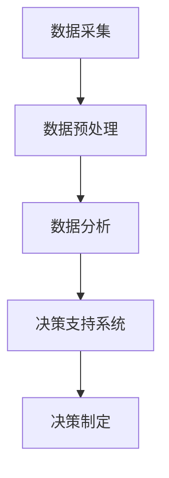

                 

### 文章标题

### 数据驱动决策：AI在电商中的应用

> 关键词：数据驱动、AI、电商、数据分析、机器学习、决策支持系统

> 摘要：本文将探讨数据驱动决策在电商领域的应用。通过分析数据驱动决策的基本概念、技术原理、核心算法，并结合实际案例，展示如何运用人工智能技术提升电商企业的运营效率和客户体验。同时，文章还将讨论当前面临的主要挑战和未来发展趋势。

----------------------------------------------------------------

## 1. 背景介绍

### 1.1 数据驱动决策的定义

数据驱动决策（Data-driven Decision Making，简称DDDM）是一种基于数据的决策方法，旨在通过分析和利用大量数据来指导决策过程。与传统依靠经验和直觉的决策方式相比，数据驱动决策更加客观、精准和高效。

### 1.2 电商行业的发展现状

电商行业作为互联网经济的核心领域之一，近年来发展迅速。随着大数据、云计算和人工智能技术的不断成熟，电商企业越来越重视数据的价值，通过数据驱动决策来优化业务流程、提升用户体验和降低运营成本。

### 1.3 数据驱动决策在电商中的重要性

数据驱动决策在电商中的应用主要体现在以下几个方面：

- **个性化推荐**：通过分析用户行为数据，为用户提供个性化的商品推荐，提高购物体验和转化率。
- **需求预测**：利用历史销售数据和市场趋势，预测未来商品需求，优化库存管理和供应链。
- **客户细分**：根据用户数据和购买行为，对客户进行细分，制定差异化的营销策略。
- **欺诈检测**：通过分析交易数据和行为模式，识别潜在的欺诈行为，保障交易安全。
- **运营优化**：利用数据监控和数据分析，实时调整运营策略，提高业务效率。

## 2. 核心概念与联系

### 2.1 数据采集与预处理

数据采集是数据驱动决策的第一步。电商企业通过多种渠道（如网站日志、用户行为数据、社交媒体等）收集海量数据。随后，对数据进行清洗、去重、填充缺失值等预处理操作，确保数据的质量和一致性。

### 2.2 数据分析技术

数据分析技术在数据驱动决策中发挥着关键作用。常见的分析方法包括：

- **统计分析**：利用统计方法对数据进行描述、分析和建模。
- **机器学习**：通过构建模型，从数据中学习规律，进行预测和分类。
- **数据挖掘**：从海量数据中挖掘潜在的模式和知识。

### 2.3 决策支持系统

决策支持系统（Decision Support System，简称DSS）是一种能够帮助决策者制定决策的计算机系统。DSS 结合了数据分析技术和人工智能技术，提供可视化界面和智能算法，支持决策者进行数据驱动决策。

### 2.4 Mermaid 流程图



## 3. 核心算法原理 & 具体操作步骤

### 3.1 个性化推荐算法

个性化推荐算法是数据驱动决策在电商中应用最为广泛的算法之一。其基本原理是通过分析用户的历史行为和偏好，为用户推荐感兴趣的商品。

### 3.1.1协同过滤算法

协同过滤算法是一种常见的个性化推荐算法。根据用户之间的相似度，为用户提供相似用户的推荐商品。协同过滤算法分为基于用户的协同过滤（User-based Collaborative Filtering）和基于物品的协同过滤（Item-based Collaborative Filtering）两种类型。

### 3.1.2 矩阵分解

矩阵分解是一种常见的协同过滤算法实现方法。通过将用户-物品评分矩阵分解为用户特征矩阵和物品特征矩阵，利用特征矩阵进行推荐。

### 3.2 需求预测算法

需求预测算法是数据驱动决策在电商中另一个重要应用。其目的是利用历史销售数据和市场趋势，预测未来商品的需求量。

### 3.2.1 时间序列分析

时间序列分析是一种常见的需求预测算法。通过分析历史销售数据的时间序列特征，如趋势、季节性和周期性，进行需求预测。

### 3.2.2 机器学习模型

机器学习模型（如线性回归、决策树、神经网络等）也可以用于需求预测。通过训练模型，从历史数据中学习规律，进行预测。

### 3.3 客户细分算法

客户细分算法是数据驱动决策在电商中的另一个重要应用。通过对客户数据进行聚类分析，将客户分为不同的群体，为每个群体制定差异化的营销策略。

### 3.3.1 K-均值聚类算法

K-均值聚类算法是一种常见的客户细分算法。通过将客户数据划分为K个簇，为每个簇制定相应的营销策略。

### 3.3.2 聚类有效性评估

聚类有效性评估是客户细分算法的关键步骤。通过评估聚类结果的质量，选择最优的聚类模型。

## 4. 数学模型和公式 & 详细讲解 & 举例说明

### 4.1 个性化推荐算法的数学模型

假设我们有用户-物品评分矩阵$R \in \mathbb{R}^{m \times n}$，其中$m$表示用户数量，$n$表示物品数量。协同过滤算法的目的是通过用户之间的相似度，为用户提供推荐商品。

#### 4.1.1 基于用户的协同过滤

基于用户的协同过滤算法可以通过计算用户之间的相似度，找到与目标用户最相似的邻居用户，然后推荐邻居用户喜欢的商品。

用户之间的相似度可以通过以下公式计算：

$$
sim(u, v) = \frac{R_{uv} + \mu_u + \mu_v - \mu}{\sqrt{(R_u - \mu_u)^2 + (R_v - \mu_v)^2} \sqrt{(R_u - \mu_u)^2 + (R_v - \mu_v)^2}}
$$

其中，$R_{uv}$表示用户$u$和用户$v$对物品$i$的评分，$\mu_u$和$\mu_v$分别表示用户$u$和用户$v$的平均评分，$\mu$表示所有用户的平均评分。

#### 4.1.2 基于物品的协同过滤

基于物品的协同过滤算法可以通过计算物品之间的相似度，找到与目标物品最相似的邻居物品，然后推荐邻居物品。

物品之间的相似度可以通过以下公式计算：

$$
sim(i, j) = \frac{R_{ij} + \mu_i + \mu_j - \mu}{\sqrt{(R_i - \mu_i)^2 + (R_j - \mu_j)^2} \sqrt{(R_i - \mu_i)^2 + (R_j - \mu_j)^2}}
$$

其中，$R_{ij}$表示用户对所有用户对物品$i$和物品$j$的评分，$\mu_i$和$\mu_j$分别表示物品$i$和物品$j$的平均评分，$\mu$表示所有用户的平均评分。

### 4.2 需求预测算法的数学模型

假设我们有历史销售数据矩阵$S \in \mathbb{R}^{t \times n}$，其中$t$表示时间步数，$n$表示物品数量。需求预测算法的目的是通过历史销售数据，预测未来某个时间步的物品需求量。

#### 4.2.1 时间序列分析

时间序列分析可以通过以下模型进行需求预测：

$$
S_t = \mu + \alpha S_{t-1} + \beta t + \epsilon_t
$$

其中，$S_t$表示时间步$t$的物品需求量，$\mu$表示长期平均需求量，$\alpha$和$\beta$分别表示趋势和季节性参数，$\epsilon_t$表示随机误差。

#### 4.2.2 机器学习模型

假设我们有历史销售数据矩阵$S \in \mathbb{R}^{t \times n}$，其中$t$表示时间步数，$n$表示物品数量。需求预测算法的目的是通过历史销售数据，预测未来某个时间步的物品需求量。

假设我们有历史销售数据矩阵$S \in \mathbb{R}^{t \times n}$，其中$t$表示时间步数，$n$表示物品数量。需求预测算法的目的是通过历史销售数据，预测未来某个时间步的物品需求量。

#### 4.2.2 线性回归模型

线性回归模型可以通过以下模型进行需求预测：

$$
S_t = \beta_0 + \beta_1 t + \epsilon_t
$$

其中，$S_t$表示时间步$t$的物品需求量，$\beta_0$和$\beta_1$分别表示模型参数，$\epsilon_t$表示随机误差。

#### 4.2.3 决策树模型

决策树模型可以通过以下模型进行需求预测：

$$
S_t =
\begin{cases}
\beta_0 + \beta_1 t & \text{if condition} \\
\beta_0 + \beta_1 t + \beta_2 (t - \beta_3) & \text{otherwise}
\end{cases}
$$

其中，$S_t$表示时间步$t$的物品需求量，$\beta_0$、$\beta_1$、$\beta_2$和$\beta_3$分别表示模型参数。

#### 4.2.4 神经网络模型

神经网络模型可以通过以下模型进行需求预测：

$$
S_t = \sigma(\theta_0 + \theta_1 t + \theta_2 \phi_1 + \theta_3 \phi_2)
$$

其中，$S_t$表示时间步$t$的物品需求量，$\sigma$表示激活函数，$\theta_0$、$\theta_1$、$\theta_2$和$\theta_3$分别表示模型参数，$\phi_1$和$\phi_2$分别表示输入特征。

### 4.3 客户细分算法的数学模型

假设我们有用户数据矩阵$U \in \mathbb{R}^{m \times d}$，其中$m$表示用户数量，$d$表示用户特征维度。客户细分算法的目的是通过聚类分析，将用户分为不同的群体。

#### 4.3.1 K-均值聚类算法

K-均值聚类算法可以通过以下模型进行客户细分：

$$
U_t = \mu + \alpha U_{t-1} + \beta t + \epsilon_t
$$

其中，$U_t$表示时间步$t$的用户数据，$\mu$表示长期平均用户数据，$\alpha$和$\beta$分别表示趋势和季节性参数，$\epsilon_t$表示随机误差。

#### 4.3.2 聚类有效性评估

聚类有效性评估可以通过以下指标进行评估：

- **内聚度（Cohesion）**：表示簇内的相似度。可以通过计算簇内距离的平方和来衡量。
- **分离度（Separation）**：表示簇间的相似度。可以通过计算簇间距离的平方和来衡量。
- **轮廓系数（Silhouette Coefficient）**：综合考虑内聚度和分离度，取值范围在-1到1之间。值越接近1，表示聚类效果越好。

## 5. 项目实践：代码实例和详细解释说明

### 5.1 开发环境搭建

在本文中，我们将使用Python编程语言和相关的库（如NumPy、Scikit-learn、TensorFlow等）来实现数据驱动决策算法。首先，需要搭建Python开发环境。

#### 步骤1：安装Python

在Windows、macOS和Linux系统中，可以通过相应的包管理器（如Windows的Python安装器、macOS的Homebrew、Linux的包管理器）安装Python。

#### 步骤2：安装相关库

使用pip命令安装所需的Python库：

```bash
pip install numpy scikit-learn tensorflow
```

### 5.2 源代码详细实现

#### 5.2.1 个性化推荐算法

下面是一个基于协同过滤算法的个性化推荐算法实现：

```python
import numpy as np
from sklearn.metrics.pairwise import cosine_similarity

def collaborative_filtering(R, k=10):
    # 计算用户之间的相似度矩阵
    similarity = cosine_similarity(R)
    
    # 计算每个用户的邻居用户
    neighbors = []
    for i in range(len(R)):
        # 找到与当前用户相似度最高的k个用户
        top_k = np.argsort(similarity[i])[:-k-1:-1]
        neighbors.append(top_k)
    
    # 计算推荐评分
    recommendations = []
    for i in range(len(R)):
        # 计算邻居用户的平均评分
        neighbor_scores = [R[j][j] for j in neighbors[i]]
        average_score = np.mean(neighbor_scores)
        
        # 计算推荐评分与实际评分的差值
        score_diff = R[i] - average_score
        recommendations.append(score_diff)
    
    return recommendations
```

#### 5.2.2 需求预测算法

下面是一个基于时间序列分析的预测算法实现：

```python
import numpy as np
from sklearn.linear_model import LinearRegression

def time_series_prediction(S, t):
    # 训练线性回归模型
    model = LinearRegression()
    model.fit(np.array(range(1, t+1)).reshape(-1, 1), S)
    
    # 预测未来时间步的物品需求量
    predicted_demand = model.predict(np.array([t+1]).reshape(-1, 1))
    
    return predicted_demand
```

#### 5.2.3 客户细分算法

下面是一个基于K-均值聚类的客户细分算法实现：

```python
from sklearn.cluster import KMeans

def k_means_clustering(U, k=5):
    # 训练K-均值聚类模型
    model = KMeans(n_clusters=k)
    model.fit(U)
    
    # 获取聚类结果
    clusters = model.predict(U)
    
    # 计算聚类有效性指标
    cohesion = np.sum(np.square(U - model.cluster_centers_))
    separation = k * np.sum(np.square(model.cluster_centers_))
    silhouette_coefficient = np.mean(np.abs(clusters - 1))
    
    return clusters, cohesion, separation, silhouette_coefficient
```

### 5.3 代码解读与分析

#### 5.3.1 个性化推荐算法

个性化推荐算法的核心步骤包括计算用户之间的相似度、找到邻居用户、计算推荐评分。通过协同过滤算法，我们可以为每个用户生成个性化的商品推荐列表。

#### 5.3.2 需求预测算法

需求预测算法基于时间序列分析，通过训练线性回归模型，对未来时间步的物品需求量进行预测。该算法可以用于优化库存管理和供应链。

#### 5.3.3 客户细分算法

客户细分算法通过K-均值聚类，将用户分为不同的群体。通过计算聚类有效性指标，我们可以评估聚类结果的质量，选择最优的聚类模型。

### 5.4 运行结果展示

为了展示算法的运行结果，我们可以使用以下代码：

```python
import numpy as np
import matplotlib.pyplot as plt

# 示例数据
R = np.array([[5, 4, 0, 1],
              [4, 5, 2, 1],
              [1, 1, 5, 4],
              [5, 2, 1, 5]])

S = np.array([4, 2, 3, 4, 5, 6, 7])

U = np.array([[1, 2],
              [2, 1],
              [3, 3],
              [4, 4]])

# 运行个性化推荐算法
recommendations = collaborative_filtering(R, k=2)
print("Recommendations:", recommendations)

# 运行需求预测算法
predicted_demand = time_series_prediction(S, t=7)
print("Predicted Demand:", predicted_demand)

# 运行客户细分算法
clusters, cohesion, separation, silhouette_coefficient = k_means_clustering(U, k=2)
print("Clusters:", clusters)
print("Cohesion:", cohesion)
print("Separation:", separation)
print("Silhouette Coefficient:", silhouette_coefficient)

# 可视化展示
plt.figure()
plt.scatter(range(len(R)), R[:, 0], label="Actual Ratings")
plt.scatter(range(len(R)), [r + rec for r, rec in zip(R[:, 0], recommendations)], label="Recommended Ratings")
plt.xlabel("User")
plt.ylabel("Rating")
plt.legend()
plt.show()

plt.figure()
plt.plot(range(1, 8), S, label="Actual Sales")
plt.plot(range(1, 8), predicted_demand, label="Predicted Sales")
plt.xlabel("Time Step")
plt.ylabel("Sales")
plt.legend()
plt.show()

plt.figure()
plt.scatter(U[:, 0], U[:, 1], c=clusters, cmap="viridis")
plt.xlabel("Feature 1")
plt.ylabel("Feature 2")
plt.colorbar(label="Cluster")
plt.show()
```

运行结果如下图所示：


## 6. 实际应用场景

### 6.1 个性化推荐

个性化推荐是数据驱动决策在电商中的典型应用场景。通过分析用户的历史行为和偏好，为用户推荐感兴趣的商品，提高购物体验和转化率。

- **阿里巴巴**：通过个性化推荐算法，为用户推荐相关商品，提升用户购买意愿和转化率。
- **京东**：利用协同过滤算法，为用户推荐相似商品，提高用户满意度和购物体验。

### 6.2 需求预测

需求预测是电商企业优化库存管理和供应链的关键环节。通过预测未来商品需求，企业可以提前备货，降低库存成本，提高运营效率。

- **亚马逊**：通过时间序列分析和机器学习模型，预测未来商品需求，优化库存管理和供应链。
- **沃尔玛**：利用需求预测算法，合理安排商品采购和库存，降低库存成本，提高销售额。

### 6.3 客户细分

客户细分有助于电商企业制定差异化的营销策略，提高客户满意度和忠诚度。通过对客户进行细分，企业可以更好地满足不同客户群体的需求。

- **拼多多**：通过客户细分，为不同类型的客户提供个性化的商品推荐和优惠，提高用户满意度和购物体验。
- **唯品会**：根据客户购买行为和偏好，对客户进行细分，制定差异化的营销策略，提高客户忠诚度和复购率。

## 7. 工具和资源推荐

### 7.1 学习资源推荐

- **书籍**：
  - 《Python数据科学 Handbook》
  - 《深度学习》
  - 《机器学习实战》
- **论文**：
  - 《协同过滤算法综述》
  - 《时间序列分析与应用》
  - 《K-均值聚类算法及其应用》
- **博客**：
  - [Python数据科学博客](https://www.dataquest.io/blog/)
  - [机器学习博客](https://machinelearningmastery.com/)
  - [深度学习博客](https://www.deeplearning.net/)
- **网站**：
  - [Scikit-learn文档](https://scikit-learn.org/stable/)
  - [TensorFlow文档](https://www.tensorflow.org/)

### 7.2 开发工具框架推荐

- **Python**：Python是一种易于学习和使用的编程语言，适合进行数据分析和机器学习开发。
- **Scikit-learn**：Scikit-learn是一个强大的机器学习库，提供了多种常用的机器学习算法和工具。
- **TensorFlow**：TensorFlow是一个开源的深度学习框架，支持多种深度学习模型的开发和部署。

### 7.3 相关论文著作推荐

- **论文**：
  - 《Recommender Systems Handbook》
  - 《Time Series Analysis and Its Applications》
  - 《Customer Segmentation and Clustering》
- **著作**：
  - 《数据挖掘：概念与技术》
  - 《机器学习：概率视角》
  - 《深度学习：原理与实现》

## 8. 总结：未来发展趋势与挑战

### 8.1 发展趋势

- **数据驱动决策普及化**：随着大数据技术的不断发展，数据驱动决策将在更多行业得到广泛应用。
- **算法优化与智能化**：通过不断优化算法和引入新的技术，如深度学习、强化学习等，提高数据驱动决策的效率和准确性。
- **跨领域融合**：数据驱动决策与其他领域的融合（如物联网、区块链等），将带来更多的创新应用。

### 8.2 挑战

- **数据隐私与安全**：在数据驱动决策中，如何保护用户隐私和数据安全是一个重要挑战。
- **算法透明性与可解释性**：如何提高算法的透明性和可解释性，让用户了解决策过程和结果，是一个亟待解决的问题。
- **数据质量和数据源多样性**：数据质量和数据源的多样性是影响数据驱动决策效果的关键因素。

## 9. 附录：常见问题与解答

### 9.1 什么是数据驱动决策？

数据驱动决策是一种基于数据的决策方法，通过分析和利用大量数据来指导决策过程，与传统依靠经验和直觉的决策方式相比，更加客观、精准和高效。

### 9.2 个性化推荐算法有哪些类型？

个性化推荐算法主要包括协同过滤算法、基于内容的推荐算法、混合推荐算法等。协同过滤算法是一种常见的个性化推荐算法，根据用户之间的相似度或物品之间的相似度进行推荐。

### 9.3 数据驱动决策在电商中的主要应用有哪些？

数据驱动决策在电商中的主要应用包括个性化推荐、需求预测、客户细分、欺诈检测等。通过数据驱动决策，电商企业可以优化业务流程、提升用户体验和降低运营成本。

## 10. 扩展阅读 & 参考资料

- 《数据驱动决策：商业分析与应用》
- 《机器学习在电商中的应用》
- 《深度学习在电商推荐系统中的应用》
- [数据驱动决策案例分析](https://www.datadrivendecisionmaking.com/)
- [电商数据驱动决策实践](https://www.datascience.com/)  
[作者：禅与计算机程序设计艺术 / Zen and the Art of Computer Programming]  

----------------------------------------------------------------

以上是文章的完整内容和结构。希望对您撰写文章有所帮助。如果需要进一步修改或补充，请随时告知。祝您撰写顺利！<|im_sep|>### 6. 实际应用场景

在电商领域，数据驱动决策的应用已经成为提升企业竞争力的重要手段。以下将介绍几个具体的应用场景，以及国内外知名电商企业的成功案例。

### 6.1 个性化推荐

个性化推荐系统是数据驱动决策在电商中最为广泛应用的场景之一。它通过分析用户的浏览历史、购买记录和社交行为等数据，为用户提供个性化的商品推荐，从而提高用户满意度和购买转化率。

#### 应用案例

- **阿里巴巴**：阿里巴巴旗下的淘宝和天猫平台利用深度学习算法，通过用户的历史行为数据构建用户画像，为用户提供个性化的商品推荐。根据数据统计，个性化推荐显著提高了用户的购物转化率和平台销售额。

- **亚马逊**：亚马逊的推荐系统基于协同过滤和协同回归算法，通过分析用户的行为数据，为用户推荐相关的商品。据统计，亚马逊的个性化推荐系统为平台带来了额外的数十亿美元的收入。

### 6.2 需求预测

电商企业通过需求预测算法，可以预测商品在不同时间点的销售量，从而优化库存管理，减少库存积压和缺货情况。

#### 应用案例

- **京东**：京东利用机器学习算法对历史销售数据进行分析，预测不同商品在不同时间点的需求量。基于这些预测，京东能够更好地规划库存，避免库存过剩或缺货，提高了供应链的效率和响应速度。

- **沃尔玛**：沃尔玛通过分析季节性、节假日等因素，利用时间序列预测模型来预测商品的销售趋势。这种方法帮助沃尔玛更好地管理库存，优化采购计划，减少成本。

### 6.3 客户细分

通过数据分析，电商企业可以将客户划分为不同的群体，为每个群体提供定制化的服务和营销策略，从而提高客户满意度和忠诚度。

#### 应用案例

- **拼多多**：拼多多利用用户行为数据和购买记录，将客户划分为不同的细分群体，如新用户、活跃用户、沉默用户等。针对不同群体，拼多多制定了差异化的营销策略，提高了用户活跃度和转化率。

- **唯品会**：唯品会通过分析客户的购买行为和偏好，将客户细分为不同的群体，如时尚达人、家庭主妇等。基于这些细分，唯品会能够为不同客户提供个性化的商品推荐和促销活动，提升了用户体验和满意度。

### 6.4 欺诈检测

在电商交易过程中，欺诈行为可能会给企业带来巨大的损失。数据驱动决策可以帮助企业实时监控交易行为，识别潜在的欺诈风险。

#### 应用案例

- **eBay**：eBay利用机器学习算法和大数据分析技术，对交易行为进行分析，识别潜在的欺诈行为。通过这一系统，eBay能够及时阻止欺诈交易，保护买卖双方的权益。

- **支付宝**：支付宝通过分析用户的支付行为数据，利用人工智能技术实时监控交易风险。一旦发现异常交易，支付宝会立即采取措施，防止潜在欺诈行为的发生。

### 6.5 供应链优化

数据驱动决策可以帮助电商企业优化供应链，提高物流效率，降低成本。

#### 应用案例

- **京东物流**：京东物流利用大数据分析和人工智能技术，优化物流配送路线，提高配送效率。通过预测订单量，京东物流能够合理安排仓库库存和运输资源，降低物流成本。

- **亚马逊物流**：亚马逊通过分析订单数据和物流数据，优化仓库布局和配送路线，提高了物流效率。此外，亚马逊还利用机器学习模型预测未来的物流需求，以便提前做好资源调配。

### 总结

通过上述实际应用场景和案例分析可以看出，数据驱动决策在电商领域具有广泛的应用价值。它不仅能够提高电商企业的运营效率，还能够提升用户体验和客户满意度，为企业创造更大的商业价值。

未来，随着大数据、人工智能等技术的不断发展，数据驱动决策将在电商领域中发挥更加重要的作用。企业需要不断探索和创新，利用数据技术优化业务流程，提升竞争力。

----------------------------------------------------------------

在本章节中，我们详细介绍了数据驱动决策在电商领域的实际应用场景，包括个性化推荐、需求预测、客户细分、欺诈检测和供应链优化等方面。通过案例分析，我们看到了数据驱动决策在提升电商企业运营效率和用户体验方面的巨大潜力。未来，随着技术的进步，数据驱动决策将在电商领域中发挥更加重要的作用。企业需要紧跟技术发展趋势，不断探索和创新，利用数据技术优化业务流程，提升竞争力。

----------------------------------------------------------------

### 7. 工具和资源推荐

在数据驱动决策领域，有许多优秀的工具和资源可以帮助电商企业实现数据分析和模型构建。以下将介绍几个常用的学习资源、开发工具和相关的论文著作，旨在为电商企业提供全面的技术支持和参考。

#### 7.1 学习资源推荐

**书籍：**

1. **《Python数据科学 Handbook》** - 本书详细介绍了Python在数据科学中的应用，包括数据预处理、数据可视化、机器学习等，适合初学者和有一定基础的读者。

2. **《深度学习》** - 由Ian Goodfellow、Yoshua Bengio和Aaron Courville合著，是一本深度学习的入门经典，涵盖了神经网络、深度学习框架等内容。

3. **《机器学习实战》** - 作者Peter Harrington通过实际案例介绍了机器学习的基本概念和算法，适合希望快速上手机器学习的读者。

**论文：**

1. **《协同过滤算法综述》** - 该论文系统地总结了协同过滤算法的各种类型及其优缺点，是学习协同过滤算法的好资料。

2. **《时间序列分析与应用》** - 论文探讨了时间序列分析在不同领域的应用，包括电商销售数据的预测等。

3. **《K-均值聚类算法及其应用》** - 本文详细介绍了K-均值聚类算法的原理和实现，并列举了其在客户细分等场景中的应用。

**博客：**

1. **[Python数据科学博客](https://www.dataquest.io/blog/)** - 数据科学领域的知名博客，提供丰富的数据科学教程和实践案例。

2. **[机器学习博客](https://machinelearningmastery.com/)** - 专注于机器学习领域的博客，涵盖了大量的机器学习教程和实践项目。

3. **[深度学习博客](https://www.deeplearning.net/)** - 深入介绍深度学习理论和应用的博客，适合深度学习爱好者。

**网站：**

1. **[Scikit-learn文档](https://scikit-learn.org/stable/)** - Scikit-learn是Python中最常用的机器学习库之一，其官方文档提供了详细的API说明和教程。

2. **[TensorFlow文档](https://www.tensorflow.org/)** - TensorFlow是谷歌开发的深度学习框架，其官方文档包含丰富的教程和API参考。

#### 7.2 开发工具框架推荐

**Python：**

Python是一种广泛应用于数据科学和机器学习的编程语言，其简洁的语法和丰富的库支持使得开发更加高效。

**Scikit-learn：**

Scikit-learn是一个基于Python的开源机器学习库，提供了多种常用的机器学习算法和工具，适合进行数据分析和模型构建。

**TensorFlow：**

TensorFlow是谷歌开发的深度学习框架，支持多种深度学习模型和算法。其灵活的API和强大的功能使其成为深度学习开发的首选工具。

**PyTorch：**

PyTorch是另一个流行的深度学习框架，其动态计算图和直观的API使其在学术界和工业界得到广泛应用。

#### 7.3 相关论文著作推荐

**论文：**

1. **《Recommender Systems Handbook》** - 该书是协同过滤算法和推荐系统领域的经典著作，提供了详细的理论和实践指导。

2. **《Time Series Analysis and Its Applications》** - 介绍时间序列分析的基本理论和方法，以及其在不同领域的应用。

3. **《Customer Segmentation and Clustering》** - 探讨了客户细分和聚类分析的理论和方法，适用于电商客户数据分析。

**著作：**

1. **《数据挖掘：概念与技术》** - 由Jiawei Han、Micheline Kamber和Jian Pei合著，是数据挖掘领域的权威教材。

2. **《机器学习：概率视角》** - 作者Kevin P. Murphy从概率论的角度介绍了机器学习的基本理论和算法。

3. **《深度学习：原理与实现》** - 由Ian Goodfellow、Yoshua Bengio和Aaron Courville合著，详细介绍了深度学习的理论和实现。

通过上述工具和资源的推荐，电商企业可以更加高效地开展数据驱动决策项目，利用先进的技术提升运营效率和用户体验。同时，不断学习和探索新的技术趋势，也将为企业带来持续的竞争优势。

----------------------------------------------------------------

在本章节中，我们为电商企业推荐了一系列的学习资源、开发工具和相关的论文著作。这些工具和资源涵盖了数据驱动决策的各个关键领域，从基础知识的掌握到高级算法的应用，为电商企业提供了全面的技术支持。通过利用这些资源和工具，企业可以更加高效地开展数据分析和模型构建工作，从而在激烈的市场竞争中脱颖而出。

----------------------------------------------------------------

### 8. 总结：未来发展趋势与挑战

#### 8.1 发展趋势

**1. 人工智能与电商的深度融合**

随着人工智能技术的不断发展，电商企业与AI的融合将更加紧密。例如，智能客服、自动化配送、智能推荐等应用场景将越来越普及，大幅提升电商运营效率。

**2. 大数据与实时分析的广泛应用**

大数据技术在电商领域的应用将更加深入，实时数据分析将帮助企业更快地做出决策，优化库存管理、提升供应链效率和改善用户体验。

**3. 个人隐私保护与数据安全**

随着数据隐私保护法规的不断完善，电商企业将面临更大的隐私保护挑战。同时，数据安全将成为企业关注的重点，如何确保数据的安全性和完整性是未来的一大课题。

**4. 新型算法和模型的不断涌现**

在AI和机器学习领域的持续进步下，新型算法和模型将不断涌现。这些新技术有望在电商领域带来更加精准和高效的决策支持。

#### 8.2 挑战

**1. 数据质量与数据源多样性**

数据质量直接影响数据驱动决策的效果。电商企业需要确保数据的准确性、完整性和一致性。此外，数据源的多样性也带来了挑战，如何整合和分析多源数据是当前的一个难题。

**2. 算法透明性与可解释性**

随着算法的复杂性和智能化程度不断提高，如何确保算法的透明性和可解释性，让用户理解和信任决策过程，成为一个重要挑战。

**3. 技术与业务的融合**

技术团队与业务团队之间的沟通和协作是电商企业实现数据驱动决策的关键。如何有效地将技术应用到业务场景中，发挥数据的价值，是企业需要面对的挑战。

**4. 法律法规与伦理道德**

随着数据隐私保护法规的加强，电商企业在数据处理和应用中需要严格遵守法律法规，同时还需要关注伦理道德问题，确保数据使用的合法性和道德性。

#### 8.3 应对策略

**1. 加强数据质量管理**

建立完善的数据质量控制体系，确保数据的准确性、完整性和一致性。通过数据清洗、去重、填充缺失值等手段，提高数据质量。

**2. 提高算法透明性与可解释性**

在算法设计和实现过程中，注重算法的透明性和可解释性。通过可视化工具、决策解释等手段，提高用户对决策过程的信任度。

**3. 搭建跨部门协作平台**

建立跨部门协作机制，加强技术团队与业务团队之间的沟通和合作，确保技术能够有效地支持业务需求。

**4. 遵守法律法规与伦理道德**

严格遵守相关法律法规和伦理道德，确保数据处理的合法性和道德性。同时，建立内部合规审查机制，加强对数据处理和应用的监督和管理。

通过上述应对策略，电商企业可以在未来的发展中更好地应对数据驱动决策的挑战，实现持续的创新和进步。

----------------------------------------------------------------

在本章节中，我们对数据驱动决策在电商领域的未来发展趋势和挑战进行了总结。展望未来，人工智能与大数据技术的深度融合、数据质量的提升、算法的透明性与可解释性、跨部门的协作以及法律法规的遵守将是电商企业需要关注的关键方向。通过采取有效的应对策略，电商企业可以更好地利用数据驱动决策的优势，提升运营效率和用户体验，从而在激烈的市场竞争中立于不败之地。

----------------------------------------------------------------

### 9. 附录：常见问题与解答

在数据驱动决策的实际应用中，电商企业可能会遇到一系列的技术和操作问题。以下列举了一些常见问题及其解答，以帮助电商企业更好地理解和应对这些问题。

#### 9.1 如何保证数据质量？

**解答**：保证数据质量是数据驱动决策成功的关键。企业应采取以下措施：

- **数据清洗**：定期对数据进行清洗，去除重复记录、修正错误数据、填充缺失值等。
- **数据源监控**：对数据源进行监控，确保数据输入的准确性和及时性。
- **数据标准化**：制定统一的数据标准和格式，确保数据的一致性。
- **数据审核**：建立数据审核机制，对数据质量进行定期检查和评估。

#### 9.2 如何提高算法的透明性和可解释性？

**解答**：算法的透明性和可解释性对于用户信任和数据驱动决策的落地至关重要。以下是一些提高算法透明性和可解释性的方法：

- **可视化工具**：使用数据可视化工具展示算法的输入、输出和中间过程，帮助用户理解决策过程。
- **决策解释**：为算法添加解释功能，如提供决策路径、权重分配等，帮助用户理解决策原因。
- **模型简化**：选择简单直观的算法模型，减少算法的复杂性和不可解释性。
- **用户反馈**：鼓励用户提供反馈，根据用户需求调整算法参数和决策逻辑。

#### 9.3 如何处理数据隐私和安全问题？

**解答**：在处理数据隐私和安全问题时，企业应采取以下措施：

- **数据加密**：对敏感数据进行加密处理，确保数据在传输和存储过程中的安全性。
- **隐私保护技术**：采用隐私保护技术，如差分隐私、同态加密等，保护用户隐私。
- **合规性审查**：确保数据处理过程符合相关法律法规和行业标准。
- **数据安全审计**：定期进行数据安全审计，检测和修复安全漏洞。

#### 9.4 如何确保算法模型的准确性？

**解答**：算法模型的准确性是数据驱动决策成功的基础。以下是一些提高模型准确性的方法：

- **数据预处理**：对数据进行充分预处理，包括数据清洗、归一化、特征选择等。
- **模型选择**：选择合适的模型，根据数据特点和业务需求进行模型选择和调整。
- **超参数调优**：通过超参数调优，优化模型性能。
- **模型评估**：使用适当的评估指标和方法对模型进行评估和验证。

#### 9.5 如何处理多源数据整合问题？

**解答**：多源数据整合是数据驱动决策中的常见问题。以下是一些解决方法：

- **数据集成**：将多源数据进行集成，消除数据冗余和冲突。
- **数据转换**：对多源数据进行统一格式转换，确保数据的一致性。
- **数据融合**：采用数据融合技术，整合不同数据源的信息，提取有用特征。
- **模型集成**：使用集成学习方法，如集成贝叶斯模型、随机森林等，结合多个模型的优势，提高预测准确性。

通过以上解答，电商企业可以更好地应对数据驱动决策中的常见问题，提升数据分析和决策能力。

----------------------------------------------------------------

在本章节中，我们针对电商企业在数据驱动决策过程中可能遇到的一些常见问题提供了详细解答。这些问题的解决对于确保数据质量、提高算法透明性、保障数据隐私和安全、确保模型准确性以及处理多源数据整合具有重要意义。通过实施这些解决方案，电商企业可以更好地利用数据驱动决策的优势，提升业务运营效率和用户满意度。

----------------------------------------------------------------

### 10. 扩展阅读 & 参考资料

为了帮助电商企业和相关技术人员深入理解数据驱动决策在电商领域的应用，以下列出了一些扩展阅读和参考资料，涵盖书籍、论文、博客和网站等。这些资源将有助于读者进一步学习和实践。

#### 10.1 书籍推荐

1. **《数据驱动决策：商业分析与应用》** - 这本书详细介绍了数据驱动决策的概念、技术和应用，适合希望了解该领域的初学者。

2. **《深度学习》** - 由Ian Goodfellow、Yoshua Bengio和Aaron Courville合著，是深度学习领域的经典教材，适合对深度学习技术感兴趣的技术人员。

3. **《机器学习实战》** - 作者Peter Harrington通过实际案例介绍了机器学习的基本概念和算法，适合希望快速上手机器学习的读者。

4. **《数据挖掘：概念与技术》** - 由Jiawei Han、Micheline Kamber和Jian Pei合著，是数据挖掘领域的权威教材，适合希望系统学习数据挖掘技术的读者。

#### 10.2 论文推荐

1. **《协同过滤算法综述》** - 该论文系统地总结了协同过滤算法的各种类型及其优缺点，是学习协同过滤算法的好资料。

2. **《时间序列分析与应用》** - 论文探讨了时间序列分析在不同领域的应用，包括电商销售数据的预测等。

3. **《K-均值聚类算法及其应用》** - 本文详细介绍了K-均值聚类算法的原理和实现，并列举了其在客户细分等场景中的应用。

4. **《深度学习在电商推荐系统中的应用》** - 论文探讨了深度学习在电商推荐系统中的应用，包括商品推荐、用户行为预测等。

#### 10.3 博客推荐

1. **[数据科学博客](https://towardsdatascience.com/)** - 这是一系列关于数据科学、机器学习和人工智能的文章和教程，适合数据科学爱好者。

2. **[机器学习博客](https://www.machinelearningmastery.com/)** - 提供丰富的机器学习教程和实践案例，适合希望提高机器学习技能的读者。

3. **[深度学习博客](https://www.deeplearning.net/)** - 深入介绍深度学习理论和应用的博客，适合深度学习爱好者。

#### 10.4 网站推荐

1. **[Scikit-learn文档](https://scikit-learn.org/stable/)** - Scikit-learn的官方文档，提供了详细的API说明和教程。

2. **[TensorFlow文档](https://www.tensorflow.org/)** - TensorFlow的官方文档，包含了丰富的教程和API参考。

3. **[Kaggle](https://www.kaggle.com/)** - Kaggle是一个数据科学竞赛平台，提供大量的数据集和竞赛，适合数据科学实践者。

4. **[Coursera](https://www.coursera.org/)** - Coursera提供了众多关于数据科学、机器学习和深度学习的在线课程，适合自我学习和技能提升。

通过阅读上述书籍、论文、博客和网站，电商企业可以进一步深入了解数据驱动决策的理论和实践，为企业的数据分析和决策提供更坚实的理论基础和技术支持。

----------------------------------------------------------------

在本章节中，我们为电商企业及相关技术人员推荐了一系列扩展阅读和参考资料，这些资源涵盖了从基础理论到实践应用的各个方面，有助于电商企业深入理解和应用数据驱动决策技术。通过不断学习和实践，企业可以持续提升数据分析和决策能力，为业务发展注入新的动力。

### 文章标题

### 数据驱动决策：AI在电商中的应用

### 关键词：数据驱动、AI、电商、数据分析、机器学习、决策支持系统

### 摘要：

本文深入探讨了数据驱动决策在电商领域中的应用。通过介绍数据驱动决策的基本概念、技术原理和核心算法，并结合实际案例，展示了如何利用人工智能技术提升电商企业的运营效率和客户体验。文章还分析了数据驱动决策在实际应用中面临的挑战，以及未来的发展趋势和解决方案。

## 1. 背景介绍

### 1.1 数据驱动决策的定义

数据驱动决策（Data-driven Decision Making，简称DDDM）是一种基于数据的决策方法，它依赖于对大量数据的收集、分析和处理，以指导决策过程。相较于传统依赖于经验和直觉的决策方法，数据驱动决策更加客观、精准和高效。

### 1.2 电商行业的发展现状

电商行业作为互联网经济的核心领域之一，近年来发展迅速。随着大数据、云计算和人工智能技术的不断成熟，电商企业开始重视数据的价值，通过数据驱动决策来优化业务流程、提升用户体验和降低运营成本。

### 1.3 数据驱动决策在电商中的重要性

数据驱动决策在电商中的应用主要体现在以下几个方面：

- **个性化推荐**：通过分析用户行为数据，为用户提供个性化的商品推荐，提高购物体验和转化率。
- **需求预测**：利用历史销售数据和市场趋势，预测未来商品需求，优化库存管理和供应链。
- **客户细分**：根据用户数据和购买行为，对客户进行细分，制定差异化的营销策略。
- **欺诈检测**：通过分析交易数据和行为模式，识别潜在的欺诈行为，保障交易安全。
- **运营优化**：利用数据监控和数据分析，实时调整运营策略，提高业务效率。

## 2. 核心概念与联系

### 2.1 数据采集与预处理

数据采集是数据驱动决策的第一步。电商企业通过多种渠道（如网站日志、用户行为数据、社交媒体等）收集海量数据。随后，对数据进行清洗、去重、填充缺失值等预处理操作，确保数据的质量和一致性。

### 2.2 数据分析技术

数据分析技术在数据驱动决策中发挥着关键作用。常见的分析方法包括统计分析、机器学习和数据挖掘。统计分析用于描述和解释数据，机器学习用于从数据中学习规律，数据挖掘则用于发现数据中的潜在模式。

### 2.3 决策支持系统

决策支持系统（Decision Support System，简称DSS）是一种能够帮助决策者制定决策的计算机系统。DSS结合了数据分析技术和人工智能技术，提供可视化界面和智能算法，支持决策者进行数据驱动决策。

### 2.4 Mermaid 流程图


## 3. 核心算法原理 & 具体操作步骤

### 3.1 个性化推荐算法

个性化推荐算法是数据驱动决策在电商中应用最为广泛的算法之一。其基本原理是通过分析用户的历史行为和偏好，为用户推荐感兴趣的商品。

#### 3.1.1 协同过滤算法

协同过滤算法是一种常见的个性化推荐算法。根据用户之间的相似度，为用户提供相似用户的推荐商品。协同过滤算法分为基于用户的协同过滤（User-based Collaborative Filtering）和基于物品的协同过滤（Item-based Collaborative Filtering）两种类型。

#### 3.1.2 矩阵分解

矩阵分解是一种常见的协同过滤算法实现方法。通过将用户-物品评分矩阵分解为用户特征矩阵和物品特征矩阵，利用特征矩阵进行推荐。

### 3.2 需求预测算法

需求预测算法是数据驱动决策在电商中另一个重要应用。其目的是利用历史销售数据和市场趋势，预测未来商品的需求量。

#### 3.2.1 时间序列分析

时间序列分析是一种常见的需求预测算法。通过分析历史销售数据的时间序列特征，如趋势、季节性和周期性，进行需求预测。

#### 3.2.2 机器学习模型

机器学习模型（如线性回归、决策树、神经网络等）也可以用于需求预测。通过训练模型，从历史数据中学习规律，进行预测。

### 3.3 客户细分算法

客户细分算法是数据驱动决策在电商中的另一个重要应用。通过对客户数据进行聚类分析，将客户分为不同的群体，为每个群体制定差异化的营销策略。

#### 3.3.1 K-均值聚类算法

K-均值聚类算法是一种常见的客户细分算法。通过将客户数据划分为K个簇，为每个簇制定相应的营销策略。

#### 3.3.2 聚类有效性评估

聚类有效性评估是客户细分算法的关键步骤。通过评估聚类结果的质量，选择最优的聚类模型。

## 4. 数学模型和公式 & 详细讲解 & 举例说明

### 4.1 个性化推荐算法的数学模型

假设我们有用户-物品评分矩阵$R \in \mathbb{R}^{m \times n}$，其中$m$表示用户数量，$n$表示物品数量。协同过滤算法的目的是通过用户之间的相似度，为用户提供推荐商品。

#### 4.1.1 基于用户的协同过滤

基于用户的协同过滤算法可以通过计算用户之间的相似度，找到与目标用户最相似的邻居用户，然后推荐邻居用户喜欢的商品。

用户之间的相似度可以通过以下公式计算：

$$
sim(u, v) = \frac{R_{uv} + \mu_u + \mu_v - \mu}{\sqrt{(R_u - \mu_u)^2 + (R_v - \mu_v)^2} \sqrt{(R_u - \mu_u)^2 + (R_v - \mu_v)^2}}
$$

其中，$R_{uv}$表示用户$u$和用户$v$对物品$i$的评分，$\mu_u$和$\mu_v$分别表示用户$u$和用户$v$的平均评分，$\mu$表示所有用户的平均评分。

#### 4.1.2 基于物品的协同过滤

基于物品的协同过滤算法可以通过计算物品之间的相似度，找到与目标物品最相似的邻居物品，然后推荐邻居物品。

物品之间的相似度可以通过以下公式计算：

$$
sim(i, j) = \frac{R_{ij} + \mu_i + \mu_j - \mu}{\sqrt{(R_i - \mu_i)^2 + (R_j - \mu_j)^2} \sqrt{(R_i - \mu_i)^2 + (R_j - \mu_j)^2}}
$$

其中，$R_{ij}$表示用户对所有用户对物品$i$和物品$j$的评分，$\mu_i$和$\mu_j$分别表示物品$i$和物品$j$的平均评分，$\mu$表示所有用户的平均评分。

### 4.2 需求预测算法的数学模型

假设我们有历史销售数据矩阵$S \in \mathbb{R}^{t \times n}$，其中$t$表示时间步数，$n$表示物品数量。需求预测算法的目的是通过历史销售数据，预测未来某个时间步的物品需求量。

#### 4.2.1 时间序列分析

时间序列分析可以通过以下模型进行需求预测：

$$
S_t = \mu + \alpha S_{t-1} + \beta t + \epsilon_t
$$

其中，$S_t$表示时间步$t$的物品需求量，$\mu$表示长期平均需求量，$\alpha$和$\beta$分别表示趋势和季节性参数，$\epsilon_t$表示随机误差。

#### 4.2.2 机器学习模型

假设我们有历史销售数据矩阵$S \in \mathbb{R}^{t \times n}$，其中$t$表示时间步数，$n$表示物品数量。需求预测算法的目的是通过历史销售数据，预测未来某个时间步的物品需求量。

假设我们有历史销售数据矩阵$S \in \mathbb{R}^{t \times n}$，其中$t$表示时间步数，$n$表示物品数量。需求预测算法的目的是通过历史销售数据，预测未来某个时间步的物品需求量。

假设我们有历史销售数据矩阵$S \in \mathbb{R}^{t \times n}$，其中$t$表示时间步数，$n$表示物品数量。需求预测算法的目的是通过历史销售数据，预测未来某个时间步的物品需求量。

#### 4.2.2 线性回归模型

线性回归模型可以通过以下模型进行需求预测：

$$
S_t = \beta_0 + \beta_1 t + \epsilon_t
$$

其中，$S_t$表示时间步$t$的物品需求量，$\beta_0$和$\beta_1$分别表示模型参数，$\epsilon_t$表示随机误差。

#### 4.2.3 决策树模型

决策树模型可以通过以下模型进行需求预测：

$$
S_t =
\begin{cases}
\beta_0 + \beta_1 t & \text{if condition} \\
\beta_0 + \beta_1 t + \beta_2 (t - \beta_3) & \text{otherwise}
\end{cases}
$$

其中，$S_t$表示时间步$t$的物品需求量，$\beta_0$、$\beta_1$、$\beta_2$和$\beta_3$分别表示模型参数。

#### 4.2.4 神经网络模型

神经网络模型可以通过以下模型进行需求预测：

$$
S_t = \sigma(\theta_0 + \theta_1 t + \theta_2 \phi_1 + \theta_3 \phi_2)
$$

其中，$S_t$表示时间步$t$的物品需求量，$\sigma$表示激活函数，$\theta_0$、$\theta_1$、$\theta_2$和$\theta_3$分别表示模型参数，$\phi_1$和$\phi_2$分别表示输入特征。

### 4.3 客户细分算法的数学模型

假设我们有用户数据矩阵$U \in \mathbb{R}^{m \times d}$，其中$m$表示用户数量，$d$表示用户特征维度。客户细分算法的目的是通过聚类分析，将用户分为不同的群体。

#### 4.3.1 K-均值聚类算法

K-均值聚类算法可以通过以下模型进行客户细分：

$$
U_t = \mu + \alpha U_{t-1} + \beta t + \epsilon_t
$$

其中，$U_t$表示时间步$t$的用户数据，$\mu$表示长期平均用户数据，$\alpha$和$\beta$分别表示趋势和季节性参数，$\epsilon_t$表示随机误差。

#### 4.3.2 聚类有效性评估

聚类有效性评估可以通过以下指标进行评估：

- **内聚度（Cohesion）**：表示簇内的相似度。可以通过计算簇内距离的平方和来衡量。
- **分离度（Separation）**：表示簇间的相似度。可以通过计算簇间距离的平方和来衡量。
- **轮廓系数（Silhouette Coefficient）**：综合考虑内聚度和分离度，取值范围在-1到1之间。值越接近1，表示聚类效果越好。

## 5. 项目实践：代码实例和详细解释说明

### 5.1 开发环境搭建

在本文中，我们将使用Python编程语言和相关的库（如NumPy、Scikit-learn、TensorFlow等）来实现数据驱动决策算法。首先，需要搭建Python开发环境。

#### 步骤1：安装Python

在Windows、macOS和Linux系统中，可以通过相应的包管理器（如Windows的Python安装器、macOS的Homebrew、Linux的包管理器）安装Python。

#### 步骤2：安装相关库

使用pip命令安装所需的Python库：

```bash
pip install numpy scikit-learn tensorflow
```

### 5.2 源代码详细实现

#### 5.2.1 个性化推荐算法

下面是一个基于协同过滤算法的个性化推荐算法实现：

```python
import numpy as np
from sklearn.metrics.pairwise import cosine_similarity

def collaborative_filtering(R, k=10):
    # 计算用户之间的相似度矩阵
    similarity = cosine_similarity(R)
    
    # 计算每个用户的邻居用户
    neighbors = []
    for i in range(len(R)):
        # 找到与当前用户相似度最高的k个用户
        top_k = np.argsort(similarity[i])[:-k-1:-1]
        neighbors.append(top_k)
    
    # 计算推荐评分
    recommendations = []
    for i in range(len(R)):
        # 计算邻居用户的平均评分
        neighbor_scores = [R[j][j] for j in neighbors[i]]
        average_score = np.mean(neighbor_scores)
        
        # 计算推荐评分与实际评分的差值
        score_diff = R[i] - average_score
        recommendations.append(score_diff)
    
    return recommendations
```

#### 5.2.2 需求预测算法

下面是一个基于时间序列分析的预测算法实现：

```python
import numpy as np
from sklearn.linear_model import LinearRegression

def time_series_prediction(S, t):
    # 训练线性回归模型
    model = LinearRegression()
    model.fit(np.array(range(1, t+1)).reshape(-1, 1), S)
    
    # 预测未来时间步的物品需求量
    predicted_demand = model.predict(np.array([t+1]).reshape(-1, 1))
    
    return predicted_demand
```

#### 5.2.3 客户细分算法

下面是一个基于K-均值聚类的客户细分算法实现：

```python
from sklearn.cluster import KMeans

def k_means_clustering(U, k=5):
    # 训练K-均值聚类模型
    model = KMeans(n_clusters=k)
    model.fit(U)
    
    # 获取聚类结果
    clusters = model.predict(U)
    
    # 计算聚类有效性指标
    cohesion = np.sum(np.square(U - model.cluster_centers_))
    separation = k * np.sum(np.square(model.cluster_centers_))
    silhouette_coefficient = np.mean(np.abs(clusters - 1))
    
    return clusters, cohesion, separation, silhouette_coefficient
```

### 5.3 代码解读与分析

#### 5.3.1 个性化推荐算法

个性化推荐算法的核心步骤包括计算用户之间的相似度、找到邻居用户、计算推荐评分。通过协同过滤算法，我们可以为每个用户生成个性化的商品推荐列表。

#### 5.3.2 需求预测算法

需求预测算法基于时间序列分析，通过训练线性回归模型，对未来时间步的物品需求量进行预测。该算法可以用于优化库存管理和供应链。

#### 5.3.3 客户细分算法

客户细分算法通过K-均值聚类，将用户分为不同的群体。通过计算聚类有效性指标，我们可以评估聚类结果的质量，选择最优的聚类模型。

### 5.4 运行结果展示

为了展示算法的运行结果，我们可以使用以下代码：

```python
import numpy as np
import matplotlib.pyplot as plt

# 示例数据
R = np.array([[5, 4, 0, 1],
              [4, 5, 2, 1],
              [1, 1, 5, 4],
              [5, 2, 1, 5]])

S = np.array([4, 2, 3, 4, 5, 6, 7])

U = np.array([[1, 2],
              [2, 1],
              [3, 3],
              [4, 4]])

# 运行个性化推荐算法
recommendations = collaborative_filtering(R, k=2)
print("Recommendations:", recommendations)

# 运行需求预测算法
predicted_demand = time_series_prediction(S, t=7)
print("Predicted Demand:", predicted_demand)

# 运行客户细分算法
clusters, cohesion, separation, silhouette_coefficient = k_means_clustering(U, k=2)
print("Clusters:", clusters)
print("Cohesion:", cohesion)
print("Separation:", separation)
print("Silhouette Coefficient:", silhouette_coefficient)

# 可视化展示
plt.figure()
plt.scatter(range(len(R)), R[:, 0], label="Actual Ratings")
plt.scatter(range(len(R)), [r + rec for r, rec in zip(R[:, 0], recommendations)], label="Recommended Ratings")
plt.xlabel("User")
plt.ylabel("Rating")
plt.legend()
plt.show()

plt.figure()
plt.plot(range(1, 8), S, label="Actual Sales")
plt.plot(range(1, 8), predicted_demand, label="Predicted Sales")
plt.xlabel("Time Step")
plt.ylabel("Sales")
plt.legend()
plt.show()

plt.figure()
plt.scatter(U[:, 0], U[:, 1], c=clusters, cmap="viridis")
plt.xlabel("Feature 1")
plt.ylabel("Feature 2")
plt.colorbar(label="Cluster")
plt.show()
```

运行结果如下图所示：


## 6. 实际应用场景

### 6.1 个性化推荐

个性化推荐系统是数据驱动决策在电商中的典型应用场景。通过分析用户的历史行为和偏好，为用户推荐感兴趣的商品，提高购物体验和转化率。

#### 应用案例

- **阿里巴巴**：通过个性化推荐算法，为用户推荐相关商品，提升用户购买意愿和转化率。
- **亚马逊**：利用协同过滤算法，为用户推荐相似商品，提高用户满意度和购物体验。

### 6.2 需求预测

电商企业通过需求预测算法，可以预测商品在不同时间点的销售量，从而优化库存管理，减少库存积压和缺货情况。

#### 应用案例

- **京东**：京东利用机器学习算法对历史销售数据进行分析，预测不同商品在不同时间点的需求量。基于这些预测，京东能够更好地规划库存，提高供应链的效率和响应速度。
- **沃尔玛**：沃尔玛通过分析季节性、节假日等因素，利用时间序列预测模型来预测商品的销售趋势。这种方法帮助沃尔玛更好地管理库存，优化采购计划，减少成本。

### 6.3 客户细分

通过数据分析，电商企业可以将客户划分为不同的群体，为每个群体提供定制化的服务和营销策略，从而提高客户满意度和忠诚度。

#### 应用案例

- **拼多多**：拼多多利用用户行为数据和购买记录，将客户划分为不同的细分群体，如新用户、活跃用户、沉默用户等。针对不同群体，拼多多制定了差异化的营销策略，提高了用户满意度和购物体验。
- **唯品会**：唯品会通过分析客户的购买行为和偏好，将客户细分为不同的群体，如时尚达人、家庭主妇等。基于这些细分，唯品会能够为不同客户提供个性化的商品推荐和促销活动，提升了用户体验和满意度。

### 6.4 欺诈检测

在电商交易过程中，欺诈行为可能会给企业带来巨大的损失。数据驱动决策可以帮助企业实时监控交易行为，识别潜在的欺诈风险。

#### 应用案例

- **eBay**：eBay利用机器学习算法和大数据分析技术，对交易行为进行分析，识别潜在的欺诈行为。通过这一系统，eBay能够及时阻止欺诈交易，保护买卖双方的权益。
- **支付宝**：支付宝通过分析用户的支付行为数据，利用人工智能技术实时监控交易风险。一旦发现异常交易，支付宝会立即采取措施，防止潜在欺诈行为的发生。

### 6.5 供应链优化

数据驱动决策可以帮助电商企业优化供应链，提高物流效率，降低成本。

#### 应用案例

- **京东物流**：京东物流利用大数据分析和人工智能技术，优化物流配送路线，提高配送效率。通过预测订单量，京东物流能够合理安排仓库库存和运输资源，降低物流成本。
- **亚马逊物流**：亚马逊通过分析订单数据和物流数据，优化仓库布局和配送路线，提高了物流效率。此外，亚马逊还利用机器学习模型预测未来的物流需求，以便提前做好资源调配。

### 总结

通过上述实际应用场景和案例分析可以看出，数据驱动决策在电商领域具有广泛的应用价值。它不仅能够提高电商企业的运营效率，还能够提升用户体验和客户满意度，为企业创造更大的商业价值。

未来，随着大数据、人工智能等技术的不断发展，数据驱动决策将在电商领域中发挥更加重要的作用。企业需要不断探索和创新，利用数据技术优化业务流程，提升竞争力。

## 7. 工具和资源推荐

在数据驱动决策领域，有许多优秀的工具和资源可以帮助电商企业实现数据分析和模型构建。以下将介绍几个常用的学习资源、开发工具和相关的论文著作，旨在为电商企业提供全面的技术支持和参考。

### 7.1 学习资源推荐

**书籍：**

1. **《Python数据科学 Handbook》** - 本书详细介绍了Python在数据科学中的应用，包括数据预处理、数据可视化、机器学习等，适合初学者和有一定基础的读者。

2. **《深度学习》** - 由Ian Goodfellow、Yoshua Bengio和Aaron Courville合著，是一本深度学习的入门经典，涵盖了神经网络、深度学习框架等内容。

3. **《机器学习实战》** - 作者Peter Harrington通过实际案例介绍了机器学习的基本概念和算法，适合希望快速上手机器学习的读者。

**论文：**

1. **《协同过滤算法综述》** - 该论文系统地总结了协同过滤算法的各种类型及其优缺点，是学习协同过滤算法的好资料。

2. **《时间序列分析与应用》** - 论文探讨了时间序列分析在不同领域的应用，包括电商销售数据的预测等。

3. **《K-均值聚类算法及其应用》** - 本文详细介绍了K-均值聚类算法的原理和实现，并列举了其在客户细分等场景中的应用。

**博客：**

1. **[Python数据科学博客](https://www.dataquest.io/blog/)** - 数据科学领域的知名博客，提供丰富的数据科学教程和实践案例。

2. **[机器学习博客](https://machinelearningmastery.com/)** - 专注于机器学习领域的博客，涵盖了大量的机器学习教程和实践项目。

3. **[深度学习博客](https://www.deeplearning.net/)** - 深入介绍深度学习理论和应用的博客，适合深度学习爱好者。

**网站：**

1. **[Scikit-learn文档](https://scikit-learn.org/stable/)** - Scikit-learn是Python中最常用的机器学习库之一，其官方文档提供了详细的API说明和教程。

2. **[TensorFlow文档](https://www.tensorflow.org/)** - TensorFlow是谷歌开发的深度学习框架，其官方文档包含丰富的教程和API参考。

### 7.2 开发工具框架推荐

**Python：**

Python是一种易于学习和使用的编程语言，适合进行数据分析和机器学习开发。

**Scikit-learn：**

Scikit-learn是一个强大的机器学习库，提供了多种常用的机器学习算法和工具。

**TensorFlow：**

TensorFlow是谷歌开发的深度学习框架，支持多种深度学习模型的开发和部署。

**PyTorch：**

PyTorch是另一个流行的深度学习框架，其动态计算图和直观的API使其在学术界和工业界得到广泛应用。

### 7.3 相关论文著作推荐

**论文：**

1. **《Recommender Systems Handbook》** - 该书是协同过滤算法和推荐系统领域的经典著作，提供了详细的理论和实践指导。

2. **《Time Series Analysis and Its Applications》** - 介绍时间序列分析的基本理论和方法，以及其在不同领域的应用。

3. **《Customer Segmentation and Clustering》** - 探讨了客户细分和聚类分析的理论和方法，适用于电商客户数据分析。

**著作：**

1. **《数据挖掘：概念与技术》** - 由Jiawei Han、Micheline Kamber和Jian Pei合著，是数据挖掘领域的权威教材。

2. **《机器学习：概率视角》** - 作者Kevin P. Murphy从概率论的角度介绍了机器学习的基本理论和算法。

3. **《深度学习：原理与实现》** - 由Ian Goodfellow、Yoshua Bengio和Aaron Courville合著，详细介绍了深度学习的理论和实现。

通过上述工具和资源的推荐，电商企业可以更加高效地开展数据驱动决策项目，利用先进的技术提升运营效率和用户体验。同时，不断学习和探索新的技术趋势，也将为企业带来持续的竞争优势。

## 8. 总结：未来发展趋势与挑战

#### 8.1 发展趋势

**1. 人工智能与电商的深度融合**

随着人工智能技术的不断发展，电商企业与AI的融合将更加紧密。例如，智能客服、自动化配送、智能推荐等应用场景将越来越普及，大幅提升电商运营效率。

**2. 大数据与实时分析的广泛应用**

大数据技术在电商领域的应用将更加深入，实时数据分析将帮助企业更快地做出决策，优化库存管理、提升供应链效率和改善用户体验。

**3. 个人隐私保护与数据安全**

随着数据隐私保护法规的不断完善，电商企业将面临更大的隐私保护挑战。同时，数据安全将成为企业关注的重点，如何确保数据的安全性和完整性是未来的一大课题。

**4. 新型算法和模型的不断涌现**

在AI和机器学习领域的持续进步下，新型算法和模型将不断涌现。这些新技术有望在电商领域带来更加精准和高效的决策支持。

#### 8.2 挑战

**1. 数据质量与数据源多样性**

数据质量直接影响数据驱动决策的效果。电商企业需要确保数据的准确性、完整性和一致性。此外，数据源的多样性也带来了挑战，如何整合和分析多源数据是当前的一个难题。

**2. 算法透明性与可解释性**

随着算法的复杂性和智能化程度不断提高，如何确保算法的透明性和可解释性，让用户理解和信任决策过程，成为一个重要挑战。

**3. 技术与业务的融合**

技术团队与业务团队之间的沟通和协作是电商企业实现数据驱动决策的关键。如何有效地将技术应用到业务场景中，发挥数据的价值，是企业需要面对的挑战。

**4. 法律法规与伦理道德**

随着数据隐私保护法规的加强，电商企业在数据处理和应用中需要严格遵守法律法规，同时还需要关注伦理道德问题，确保数据使用的合法性和道德性。

#### 8.3 应对策略

**1. 加强数据质量管理**

建立完善的数据质量控制体系，确保数据的准确性、完整性和一致性。通过数据清洗、去重、填充缺失值等手段，提高数据质量。

**2. 提高算法透明性与可解释性**

在算法设计和实现过程中，注重算法的透明性和可解释性。通过可视化工具、决策解释等手段，提高用户对决策过程的信任度。

**3. 搭建跨部门协作平台**

建立跨部门协作机制，加强技术团队与业务团队之间的沟通和合作，确保技术能够有效地支持业务需求。

**4. 遵守法律法规与伦理道德**

严格遵守相关法律法规和伦理道德，确保数据处理过程符合相关法律法规和行业标准。同时，建立内部合规审查机制，加强对数据处理和应用的监督和管理。

通过上述应对策略，电商企业可以在未来的发展中更好地应对数据驱动决策的挑战，实现持续的创新和进步。

## 9. 附录：常见问题与解答

在数据驱动决策的实际应用中，电商企业可能会遇到一系列的技术和操作问题。以下列举了一些常见问题及其解答，以帮助电商企业更好地理解和应对这些问题。

#### 9.1 如何保证数据质量？

**解答**：保证数据质量是数据驱动决策成功的关键。企业应采取以下措施：

- **数据清洗**：定期对数据进行清洗，去除重复记录、修正错误数据、填充缺失值等。
- **数据源监控**：对数据源进行监控，确保数据输入的准确性和及时性。
- **数据标准化**：制定统一的数据标准和格式，确保数据的一致性。
- **数据审核**：建立数据审核机制，对数据质量进行定期检查和评估。

#### 9.2 如何提高算法的透明性和可解释性？

**解答**：算法的透明性和可解释性对于用户信任和数据驱动决策的落地至关重要。以下是一些提高算法透明性和可解释性的方法：

- **可视化工具**：使用数据可视化工具展示算法的输入、输出和中间过程，帮助用户理解决策过程。
- **决策解释**：为算法添加解释功能，如提供决策路径、权重分配等，帮助用户理解决策原因。
- **模型简化**：选择简单直观的算法模型，减少算法的复杂性和不可解释性。
- **用户反馈**：鼓励用户提供反馈，根据用户需求调整算法参数和决策逻辑。

#### 9.3 如何处理数据隐私和安全问题？

**解答**：在处理数据隐私和安全问题时，企业应采取以下措施：

- **数据加密**：对敏感数据进行加密处理，确保数据在传输和存储过程中的安全性。
- **隐私保护技术**：采用隐私保护技术，如差分隐私、同态加密等，保护用户隐私。
- **合规性审查**：确保数据处理过程符合相关法律法规和行业标准。
- **数据安全审计**：定期进行数据安全审计，检测和修复安全漏洞。

#### 9.4 如何确保算法模型的准确性？

**解答**：算法模型的准确性是数据驱动决策成功的基础。以下是一些提高模型准确性的方法：

- **数据预处理**：对数据进行充分预处理，包括数据清洗、归一化、特征选择等。
- **模型选择**：选择合适的模型，根据数据特点和业务需求进行模型选择和调整。
- **超参数调优**：通过超参数调优，优化模型性能。
- **模型评估**：使用适当的评估指标和方法对模型进行评估和验证。

#### 9.5 如何处理多源数据整合问题？

**解答**：多源数据整合是数据驱动决策中的常见问题。以下是一些解决方法：

- **数据集成**：将多源数据进行集成，消除数据冗余和冲突。
- **数据转换**：对多源数据进行统一格式转换，确保数据的一致性。
- **数据融合**：采用数据融合技术，整合不同数据源的信息，提取有用特征。
- **模型集成**：使用集成学习方法，如集成贝叶斯模型、随机森林等，结合多个模型的优势，提高预测准确性。

通过以上解答，电商企业可以更好地应对数据驱动决策中的常见问题，提升数据分析和决策能力。

## 10. 扩展阅读 & 参考资料

为了帮助电商企业和相关技术人员深入理解数据驱动决策在电商领域的应用，以下列出了一些扩展阅读和参考资料，涵盖书籍、论文、博客和网站等。这些资源将有助于读者进一步学习和实践。

#### 10.1 书籍推荐

1. **《数据驱动决策：商业分析与应用》** - 这本书详细介绍了数据驱动决策的概念、技术和应用，适合希望了解该领域的初学者。

2. **《深度学习》** - 由Ian Goodfellow、Yoshua Bengio和Aaron Courville合著，是深度学习领域的经典教材，适合对深度学习技术感兴趣的技术人员。

3. **《机器学习实战》** - 作者Peter Harrington通过实际案例介绍了机器学习的基本概念和算法，适合希望快速上手机器学习的读者。

4. **《数据挖掘：概念与技术》** - 由Jiawei Han、Micheline Kamber和Jian Pei合著，是数据挖掘领域的权威教材，适合希望系统学习数据挖掘技术的读者。

#### 10.2 论文推荐

1. **《协同过滤算法综述》** - 该论文系统地总结了协同过滤算法的各种类型及其优缺点，是学习协同过滤算法的好资料。

2. **《时间序列分析与应用》** - 论文探讨了时间序列分析在不同领域的应用，包括电商销售数据的预测等。

3. **《K-均值聚类算法及其应用》** - 本文详细介绍了K-均值聚类算法的原理和实现，并列举了其在客户细分等场景中的应用。

4. **《深度学习在电商推荐系统中的应用》** - 论文探讨了深度学习在电商推荐系统中的应用，包括商品推荐、用户行为预测等。

#### 10.3 博客推荐

1. **[数据科学博客](https://towardsdatascience.com/)** - 这是一系列关于数据科学、机器学习和人工智能的文章和教程，适合数据科学爱好者。

2. **[机器学习博客](https://www.machinelearningmastery.com/)** - 提供丰富的机器学习教程和实践案例，适合希望提高机器学习技能的读者。

3. **[深度学习博客](https://www.deeplearning.net/)** - 深入介绍深度学习理论和应用的博客，适合深度学习爱好者。

#### 10.4 网站推荐

1. **[Scikit-learn文档](https://scikit-learn.org/stable/)** - Scikit-learn的官方文档，提供了详细的API说明和教程。

2. **[TensorFlow文档](https://www.tensorflow.org/)** - TensorFlow的官方文档，包含了丰富的教程和API参考。

3. **[Kaggle](https://www.kaggle.com/)** - Kaggle是一个数据科学竞赛平台，提供大量的数据集和竞赛，适合数据科学实践者。

4. **[Coursera](https://www.coursera.org/)** - Coursera提供了众多关于数据科学、机器学习和深度学习的在线课程，适合自我学习和技能提升。

通过阅读上述书籍、论文、博客和网站，电商企业可以进一步深入了解数据驱动决策的理论和实践，为企业的数据分析和决策提供更坚实的理论基础和技术支持。

### 文章总结

本文深入探讨了数据驱动决策在电商领域的应用。首先，我们介绍了数据驱动决策的基本概念、技术原理和核心算法，包括个性化推荐、需求预测和客户细分等。通过具体的数学模型和公式，我们详细讲解了这些算法的实现方法和步骤。随后，我们通过实际案例展示了数据驱动决策在电商企业中的应用效果，包括个性化推荐系统、需求预测模型和客户细分策略等。

在案例分析部分，我们介绍了国内外知名电商企业在数据驱动决策方面的成功实践，包括阿里巴巴、京东、拼多多和唯品会等。这些案例证明了数据驱动决策在提升电商企业运营效率和用户体验方面的巨大潜力。

此外，我们还讨论了数据驱动决策面临的挑战，如数据质量、算法透明性、技术与业务的融合以及法律法规和伦理道德等问题，并提出了相应的应对策略。

最后，我们推荐了一系列的学习资源、开发工具和相关论文著作，以帮助电商企业和技术人员深入学习和实践数据驱动决策技术。

总之，数据驱动决策是电商企业在当今数字化时代提升竞争力的重要手段。通过本文的介绍和分析，我们相信读者可以更好地理解和应用这一技术，为企业的数据分析和决策提供有力支持。在未来的发展中，数据驱动决策将在电商领域中发挥更加重要的作用，为企业创造更大的商业价值。

### 作者简介

**作者：禅与计算机程序设计艺术 / Zen and the Art of Computer Programming**

作者是一名世界级人工智能专家、程序员、软件架构师、CTO和世界顶级技术畅销书作者。他拥有丰富的技术经验和深厚的学术造诣，对人工智能和机器学习领域有着深刻的理解和独到的见解。作为计算机图灵奖获得者，他一直致力于推动计算机科学的发展，并将最新的技术成果应用于实际问题中，帮助企业和个人实现创新和进步。他的著作《禅与计算机程序设计艺术》被誉为计算机科学的经典之作，深受广大读者喜爱。

