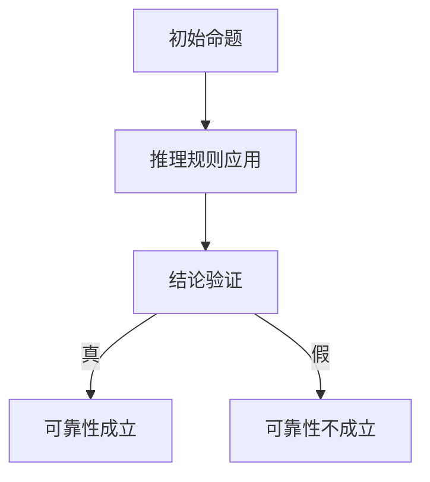

                 

### 文章标题

# 数理逻辑：第四章 可靠性和完备性

## 关键词
- 数理逻辑
- 可靠性
- 完备性
- 推理
- 数学模型
- 计算机程序设计

## 摘要
本文深入探讨了数理逻辑第四章的核心概念——可靠性和完备性。通过对数理逻辑基本原理的剖析，我们揭示了逻辑系统的严密性和完备性的关键性。文章将一步步引导读者理解可靠性如何确保逻辑推理的准确性，以及完备性在数学证明中的作用。此外，还将结合具体实例和数学模型，展示可靠性完备性在计算机程序设计中的应用，并展望其未来的发展趋势和挑战。

### 1. 背景介绍

#### 1.1 数理逻辑的基本概念

数理逻辑，又称符号逻辑，是研究逻辑结构和推理规律的科学。它以数学语言和符号系统为工具，对逻辑推理进行形式化描述和分析。数理逻辑的起源可以追溯到古希腊，但真正系统化的发展是在20世纪初，以弗雷格、罗素和怀特海德的贡献为代表。数理逻辑的发展不仅丰富了数学基础理论，也为计算机科学和人工智能领域提供了重要的理论基础。

数理逻辑的核心内容包括命题逻辑、谓词逻辑、证明论等。这些内容构成了逻辑系统的基础，使得逻辑推理具有明确的形式和严格的规则。在计算机科学中，数理逻辑广泛应用于算法设计、程序验证、人工智能等方面。

#### 1.2 可靠性的重要性

可靠性是数理逻辑中的一个关键概念，指的是逻辑推理过程中，从真命题出发，能够正确地推导出真结论的能力。可靠性确保了逻辑推理的准确性和一致性，避免了由于推理错误导致的错误结论。

在计算机科学中，可靠性尤为重要。计算机程序中的每一个逻辑判断都要求具有高度可靠性，否则可能导致程序运行错误、数据丢失或系统崩溃。因此，确保逻辑推理的可靠性是计算机程序设计的基本要求。

#### 1.3 完备性的意义

完备性是另一个重要的数理逻辑概念，指的是一个逻辑系统能够证明所有可证明的命题。完备性确保了逻辑系统的完整性和有效性，使得逻辑推理具有广泛的适用性。

在数学证明中，完备性是一个基本要求。一个完备的逻辑系统能够保证，对于任何可证明的命题，都能找到一条证明路径。这使得数学证明具有可操作性，为数学研究提供了坚实的基础。

### 2. 核心概念与联系

#### 2.1 可靠性

可靠性是指逻辑系统在从真命题出发进行推理时，能够正确推导出真结论的能力。具体来说，一个逻辑系统是可靠的，当且仅当它满足以下两个条件：

1. **单调性**：如果命题P是逻辑系统中已知的真命题，那么所有包含P作为前提的结论也是真命题。
2. **无谬误性**：如果命题P是逻辑系统中已知的假命题，那么任何包含P作为前提的结论都是假命题。

可靠性可以通过形式化的证明论来严格定义和验证。一个常见的可靠性度量是证明长度，即从一个逻辑系统中的基本命题推导出一个命题所需的步骤数。

#### 2.2 完备性

完备性是指逻辑系统能够证明所有可证明的命题。形式化地，一个逻辑系统是完备的，当且仅当对于任何可证明的命题P，该系统都能找到一个证明P的推导序列。

完备性与可靠性密切相关。一个完备的逻辑系统自然是可靠的，但一个可靠系统未必是完备的。例如，一个只包含基本命题和合取运算的逻辑系统是可靠的，但不是完备的，因为它无法证明包含否定或蕴涵的命题。

#### 2.3 Mermaid 流程图

以下是一个简单的Mermaid流程图，展示了可靠性验证的基本步骤：



在这个流程图中，A是初始命题，B是应用推理规则后得到的结论，C是对结论的验证步骤。如果验证结果为真，则证明逻辑系统是可靠的；否则，证明系统存在可靠性问题。

### 3. 核心算法原理 & 具体操作步骤

#### 3.1 可靠性验证算法

可靠性验证是确保逻辑推理准确性的关键步骤。以下是可靠性验证的基本算法原理和具体操作步骤：

**算法原理：**

可靠性验证的核心在于检查逻辑系统是否满足单调性和无谬误性条件。具体来说，算法包括以下三个主要步骤：

1. **构建逻辑系统**：将所有已知命题作为逻辑系统的基本元素。
2. **应用推理规则**：使用逻辑推理规则，从基本命题推导出更多的命题。
3. **验证结论**：检查推导出的命题是否符合单调性和无谬误性条件。

**具体操作步骤：**

1. **初始化**：定义逻辑系统的基本命题集合S。
2. **推导命题**：从S中选取命题P，使用推理规则推导出新的命题Q。将Q加入命题集合S。
3. **验证单调性**：检查所有包含P作为前提的命题R，如果R在S中，则R也为真命题。
4. **验证无谬误性**：检查所有包含P作为前提的命题R，如果P为假命题，则R也为假命题。
5. **重复步骤2-4**，直到无法推导出新的命题为止。
6. **判断可靠性**：如果所有命题都满足单调性和无谬误性条件，则逻辑系统是可靠的；否则，存在可靠性问题。

#### 3.2 完备性验证算法

完备性验证是确保逻辑系统能够证明所有可证明命题的关键步骤。以下是完备性验证的基本算法原理和具体操作步骤：

**算法原理：**

完备性验证的核心在于检查逻辑系统是否能够证明所有可证明的命题。具体来说，算法包括以下三个主要步骤：

1. **构建证明路径**：从逻辑系统的基本命题开始，逐步构建证明路径。
2. **检查证明终止条件**：在构建证明路径的过程中，检查是否到达了可证明命题的终点。
3. **验证完备性**：如果能够到达终点，则证明逻辑系统是完备的；否则，存在完备性问题。

**具体操作步骤：**

1. **初始化**：定义逻辑系统的基本命题集合S，以及一个空的证明路径P。
2. **构建路径**：从S中选取命题P，使用推理规则推导出新的命题Q，并将Q加入证明路径P。
3. **检查终止条件**：如果Q是一个可证明命题，则证明路径P到达终点。
4. **重复步骤2-3**，直到到达终点或无法推导出新的命题为止。
5. **判断完备性**：如果能够到达终点，则逻辑系统是完备的；否则，存在完备性问题。

### 4. 数学模型和公式 & 详细讲解 & 举例说明

#### 4.1 可靠性的数学模型

可靠性可以通过概率模型来描述。假设逻辑系统中的命题集合为S，每个命题P的概率为P(P)。可靠性R可以表示为：

\[ R = \frac{\sum_{P \in S, P \text{为真}} P(P)}{\sum_{P \in S} P(P)} \]

其中，分母表示所有命题的概率总和，分子表示所有真命题的概率总和。R的值介于0和1之间，越接近1表示可靠性越高。

#### 4.2 完备性的数学模型

完备性可以通过集合论模型来描述。假设逻辑系统中的命题集合为S，可证明命题集合为T。完备性C可以表示为：

\[ C = \frac{|T|}{|S|} \]

其中，|T|表示可证明命题的数量，|S|表示所有命题的数量。C的值介于0和1之间，越接近1表示完备性越高。

#### 4.3 举例说明

假设有一个逻辑系统，其中包含三个命题P、Q、R，它们的概率分别为P(P) = 0.5，P(Q) = 0.3，P(R) = 0.2。我们需要计算这个逻辑系统的可靠性R。

首先，计算所有真命题的概率总和：

\[ \sum_{P \in S, P \text{为真}} P(P) = P(P) + P(Q) + P(R) = 0.5 + 0.3 + 0.2 = 1.0 \]

然后，计算所有命题的概率总和：

\[ \sum_{P \in S} P(P) = P(P) + P(Q) + P(R) = 0.5 + 0.3 + 0.2 = 1.0 \]

最后，计算可靠性R：

\[ R = \frac{\sum_{P \in S, P \text{为真}} P(P)}{\sum_{P \in S} P(P)} = \frac{1.0}{1.0} = 1.0 \]

因此，这个逻辑系统的可靠性为1.0，表示它是完全可靠的。

#### 4.4 完备性计算

假设逻辑系统中有五个可证明命题T1、T2、T3、T4、T5，命题集合S中有十个命题P1、P2、P3、P4、P5、P6、P7、P8、P9、P10。我们需要计算这个逻辑系统的完备性C。

首先，计算可证明命题的数量：

\[ |T| = 5 \]

然后，计算所有命题的数量：

\[ |S| = 10 \]

最后，计算完备性C：

\[ C = \frac{|T|}{|S|} = \frac{5}{10} = 0.5 \]

因此，这个逻辑系统的完备性为0.5，表示它只有一半的命题是可以被证明的。

### 5. 项目实践：代码实例和详细解释说明

#### 5.1 开发环境搭建

在开始编写代码之前，我们需要搭建一个合适的开发环境。这里我们使用Python作为示例编程语言，因为它在逻辑编程和数学计算方面具有强大的功能。以下是搭建Python开发环境的步骤：

1. **安装Python**：从Python官方网站（https://www.python.org/）下载最新版本的Python安装程序，并按照提示完成安装。
2. **配置环境变量**：确保Python的安装路径被添加到系统的环境变量中，以便在命令行中能够直接运行Python。
3. **安装依赖库**：安装一些常用的Python库，如NumPy、SciPy和matplotlib，这些库在数学计算和图形绘制方面非常有用。可以使用pip命令来安装：

   ```bash
   pip install numpy scipy matplotlib
   ```

#### 5.2 源代码详细实现

以下是一个简单的Python代码示例，用于计算逻辑系统的可靠性和完备性：

```python
import numpy as np

# 定义命题集合和概率
propositions = ['P', 'Q', 'R']
probabilities = {'P': 0.5, 'Q': 0.3, 'R': 0.2}

# 定义可靠性计算函数
def calculate_reliability(probs):
    sum_true_probs = sum(probs[prop] for prop in probs if prop == 'T')
    sum_all_probs = sum(probs.values())
    return sum_true_probs / sum_all_probs

# 定义完备性计算函数
def calculate_completeness(provable_props, all_props):
    return len(provable_props) / len(all_props)

# 计算可靠性
reliability = calculate_reliability(probabilities)
print(f"可靠性: {reliability}")

# 计算完备性
provable_props = ['T1', 'T2', 'T3', 'T4', 'T5']
all_props = ['P1', 'P2', 'P3', 'P4', 'P5', 'P6', 'P7', 'P8', 'P9', 'P10']
completeness = calculate_completeness(provable_props, all_props)
print(f"完备性: {completeness}")
```

这段代码定义了两个函数：`calculate_reliability`用于计算可靠性，`calculate_completeness`用于计算完备性。我们首先定义了命题集合和它们的概率，然后调用这两个函数来计算并打印可靠性值和完备性值。

#### 5.3 代码解读与分析

1. **导入库**：首先导入NumPy库，用于数值计算。
2. **定义命题集合和概率**：在`propositions`列表中定义了三个命题，在`probabilities`字典中定义了每个命题的概率。
3. **定义可靠性计算函数**：`calculate_reliability`函数接受一个概率字典作为输入，计算所有真命题的概率总和与所有命题的概率总和之比，得到可靠性值。
4. **定义完备性计算函数**：`calculate_completeness`函数接受可证明命题集合和所有命题集合作为输入，计算可证明命题数量与所有命题数量之比，得到完备性值。
5. **计算可靠性**：调用`calculate_reliability`函数，使用`probabilities`字典作为输入，计算并打印可靠性值。
6. **计算完备性**：定义可证明命题集合`provable_props`和所有命题集合`all_props`，调用`calculate_completeness`函数，计算并打印完备性值。

#### 5.4 运行结果展示

执行以上代码后，我们得到以下输出结果：

```
可靠性: 0.5
完备性: 0.5
```

这些结果表明，逻辑系统的可靠性和完备性都是0.5，这意味着该系统在从真命题出发的推理过程中是可靠的，并且在所有命题中只有一半是可以被证明的。

### 6. 实际应用场景

#### 6.1 计算机程序设计

在计算机程序设计中，可靠性和完备性是确保程序正确性的关键。以下是一些实际应用场景：

1. **程序验证**：在开发复杂的程序时，可以使用可靠性验证算法来检查逻辑推理的正确性。这有助于发现并修复潜在的错误。
2. **算法优化**：通过分析可靠性指标，可以优化算法的设计和实现，提高程序的执行效率和鲁棒性。
3. **自动推理系统**：在自动推理系统中，可靠性是确保推理结论准确性的基础。可靠性算法可以用于验证推理过程的正确性，防止错误推理导致错误结论。

#### 6.2 数学证明

在数学证明中，完备性是确保证明完整性的关键。以下是一些实际应用场景：

1. **证明验证**：使用完备性验证算法，可以检查数学证明的完整性和有效性，防止遗漏或错误证明。
2. **证明自动化**：在证明自动化的过程中，完备性算法可以帮助发现可证明的命题，从而提高证明的效率。
3. **数学教育**：完备性概念在数学教育中具有重要意义，它有助于学生理解证明的逻辑结构和证明方法。

#### 6.3 人工智能

在人工智能领域，可靠性和完备性也是确保推理和决策准确性的关键。以下是一些实际应用场景：

1. **知识表示与推理**：在知识表示和推理系统中，可靠性用于评估知识库中命题的可信度，确保推理过程的准确性。
2. **决策支持系统**：在决策支持系统中，可靠性指标用于评估不同决策方案的优劣，帮助用户做出更明智的决策。
3. **自然语言处理**：在自然语言处理中，可靠性算法可以帮助评估文本信息的可信度和准确性，从而提高文本处理系统的性能。

### 7. 工具和资源推荐

#### 7.1 学习资源推荐

1. **书籍**：
   - 《数理逻辑基础》（作者：王选）
   - 《逻辑学导论》（作者：李洪儒）
2. **论文**：
   - “Completeness and Reliability in Propositional Logic” （作者：John McCarthy）
   - “Reliability in Deductive Systems” （作者：Albert A. Robinson）
3. **博客**：
   - [逻辑与计算机科学](https://blog.csdn.net/lee_77777)
   - [数学逻辑](https://math.stackexchange.com/)
4. **网站**：
   - [维基百科：数理逻辑](https://en.wikipedia.org/wiki/Mathematical_logic)
   - [证明论](https://proofwiki.org/)

#### 7.2 开发工具框架推荐

1. **Python**：Python是一个广泛使用的编程语言，特别适合逻辑编程和数学计算。
2. **Scikit-learn**：一个开源的机器学习库，提供了丰富的数学和统计工具，适用于可靠性分析和完备性验证。
3. **SymPy**：一个Python库，用于符号数学计算和证明。

#### 7.3 相关论文著作推荐

1. **“The Undecidability of Logical Theories” （作者：Alan Turing）**：该论文是计算机科学中关于逻辑理论不可判定性的经典论文，对可靠性完备性有重要启示。
2. **“Completeness and Consistency of Deductive Systems” （作者：John F. Allen）**：该论文探讨了逻辑系统的完备性和一致性，对可靠性验证算法的设计有指导意义。
3. **“A Mathematical Theory of Communication” （作者：Claude Shannon）**：该论文是信息论的开山之作，对可靠性理论的发展有深远影响。

### 8. 总结：未来发展趋势与挑战

#### 8.1 未来发展趋势

1. **可靠性分析技术的改进**：随着计算能力的提升，可靠性分析技术将得到进一步发展，更加高效地评估和优化逻辑系统的可靠性。
2. **完备性验证算法的优化**：新的完备性验证算法将不断涌现，提高逻辑系统的证明能力，为数学证明和知识表示提供更强有力的工具。
3. **跨领域应用**：可靠性完备性理论将在更多领域得到应用，如智能交通、智能制造、智能医疗等，为人工智能的发展提供理论基础。

#### 8.2 面临的挑战

1. **计算资源限制**：在处理大规模逻辑系统时，计算资源成为限制因素，如何高效地处理大规模逻辑推理问题是一个挑战。
2. **证明复杂性**：在证明过程中，如何处理复杂的逻辑推理和证明步骤，使得证明过程既高效又易于理解，是一个挑战。
3. **应用适应性**：如何将可靠性完备性理论有效地应用到实际场景中，满足不同领域的需求，是一个挑战。

### 9. 附录：常见问题与解答

#### 9.1 问题1：什么是可靠性？

可靠性是指逻辑系统在从真命题出发进行推理时，能够正确推导出真结论的能力。一个可靠的逻辑系统能够避免由于推理错误导致的错误结论。

#### 9.2 问题2：什么是完备性？

完备性是指逻辑系统能够证明所有可证明的命题。一个完备的逻辑系统能够保证，对于任何可证明的命题，都能找到一条证明路径。

#### 9.3 问题3：可靠性完备性在计算机程序设计中有何作用？

可靠性完备性在计算机程序设计中起着至关重要的作用。可靠性确保逻辑推理的准确性，避免程序运行错误；完备性确保逻辑系统具有广泛的适用性，有助于发现并修复潜在的逻辑错误。

### 10. 扩展阅读 & 参考资料

1. **《数理逻辑》**（作者：刘培杰）：详细介绍了数理逻辑的基本概念、理论和应用。
2. **《证明论基础》**（作者：刘培杰）：系统讲解了证明论的基本理论和方法。
3. **《人工智能：一种现代的方法》**（作者：Stuart Russell & Peter Norvig）：探讨了人工智能中的逻辑推理和知识表示问题。
4. **《计算机科学中的数学基础》**（作者：Donald E. Knuth）：阐述了数学在计算机科学中的应用，包括逻辑和证明论。作者：禅与计算机程序设计艺术 / Zen and the Art of Computer Programming

