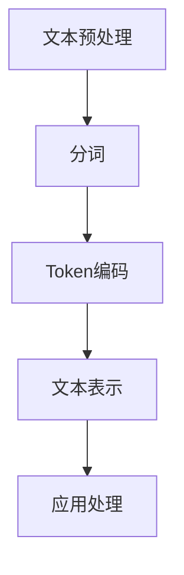

                 

### 1. 背景介绍

#### 1.1 文字语言的起源与发展

文字语言的起源可以追溯到古代文明的诞生。最早的文字形式是象形文字，它们以图形的形式表示具体的物体或概念。随着时间的推移，文字系统逐渐演变，出现了更为抽象的字符和符号，这些字符和符号可以组合成各种词汇和句子，从而构建出复杂的语言体系。

早期的文字系统主要用于记录交易、记录历史、进行宗教仪式和传播知识。随着人类社会的不断进步，文字语言的应用领域也逐渐扩大，不仅用于记录信息，还用于文学创作、科学研究和日常沟通。从古代的楔形文字、埃及象形文字到现代的拉丁字母、汉字，文字语言的形式虽然有所变化，但其核心功能——信息的编码与传输——始终没有改变。

#### 1.2 文本处理的需求

在现代信息社会中，文本处理成为了一项基础而重要的任务。随着互联网的普及，海量的文本数据不断产生，这些数据包括新闻文章、社交媒体帖子、学术论文、商业报告等。如何有效地处理和利用这些文本数据，成为了一个亟待解决的问题。

文本处理的需求主要体现在以下几个方面：

1. **信息检索**：在大量的文本数据中快速找到所需的信息，例如搜索引擎。
2. **自然语言理解**：理解文本中的语言含义，进行语义分析、情感分析等。
3. **文本生成**：根据已有的文本数据生成新的文本，例如自动摘要、自动问答等。
4. **文本分类**：将文本数据按照主题或内容进行分类，以方便管理和检索。

这些需求推动了文本处理技术的发展，特别是在自然语言处理（NLP）领域的迅速崛起。

#### 1.3 Token化的概念

为了实现对文本的上述处理需求，需要对文本进行结构化处理，而Token化是实现这一目标的关键步骤之一。

Token化（Tokenization）是指将一段文本分割成一系列最小的语义单位，这些单位通常被称为Token。Token可以是单词、字符、子词、句子等，具体取决于应用场景和需求。Token化的目的在于将无结构的文本转化为有结构的序列，从而便于后续处理。

Token化的重要性在于：

1. **简化文本处理**：将复杂的文本分解为简单的Token序列，降低处理难度。
2. **提高计算效率**：通过Token化，可以减少数据的大小，提高处理速度。
3. **支持后续处理**：Token化是许多NLP任务的基础步骤，如分词、词性标注、命名实体识别等。

本文将围绕Token化过程进行深入探讨，从基本概念到具体实现，再到应用场景和未来发展趋势，希望能够为读者提供一个全面而系统的了解。

### 2. 核心概念与联系

#### 2.1 Token的定义

Token是文本处理中的基本单元，可以看作是语义分析的最小单位。Token可以是单词、字符、子词、句子等，具体取决于应用场景和需求。在大多数情况下，单词Token是最常用的，因为它们可以承载丰富的语义信息。

#### 2.2 Token的类型

根据Token的定义，可以将Token分为以下几种类型：

1. **单词Token**：最常见的一种Token类型，例如“人工智能”。
2. **字符Token**：将文本分割成单个字符，例如“人”。
3. **子词Token**：将单词进一步分割成更小的有意义的单位，例如“人”可以进一步分割成“人”和“们”。
4. **句子Token**：将整段文本作为一个Token，例如一个完整的句子。

#### 2.3 Token化的过程

Token化是一个将文本转化为Token序列的过程，主要包括以下步骤：

1. **文本预处理**：对原始文本进行清洗，如去除标点符号、转换大小写等。
2. **分词**：将预处理后的文本分割成单词或其他类型的Token。
3. **Token编码**：将分割出的Token转化为数字或向量形式，便于计算机处理。

#### 2.4 Token化与分词

Token化和分词是紧密相关的概念，但它们并不完全相同。分词是指将一段连续的文本分割成单个单词或其他Token的过程，而Token化则是在分词的基础上，将Token进一步处理，如编码、分类等。

分词通常用于语言处理任务，如自然语言理解、文本分类等。而Token化则是更广义的概念，它可以应用于任何需要将文本结构化的场景。

#### 2.5 Token化与文本表示

Token化是文本表示的重要步骤之一。通过Token化，可以将无结构的文本转化为有结构的序列，从而便于计算机处理。文本表示的方法有很多种，如Bag of Words（词袋模型）、Word2Vec（词向量模型）等。Token化是实现这些文本表示方法的基础。

#### 2.6 Token化的应用场景

Token化在自然语言处理中有着广泛的应用，以下是一些典型的应用场景：

1. **信息检索**：通过Token化，可以将查询文本和文档进行匹配，实现高效的信息检索。
2. **自然语言理解**：通过Token化，可以提取文本中的关键信息，进行语义分析、情感分析等。
3. **文本生成**：通过Token化，可以将已有的文本数据转化为Token序列，生成新的文本。

#### 2.7 Token化的挑战与解决方案

Token化虽然重要，但也面临一些挑战，如多义词处理、上下文信息丢失等。以下是一些常见的挑战及解决方案：

1. **多义词处理**：通过引入上下文信息和词义标注，可以有效解决多义词问题。
2. **上下文信息丢失**：通过使用基于上下文的词向量模型，如BERT，可以更好地捕捉上下文信息。

通过上述内容，我们可以看到Token化在文本处理中的核心地位和重要性。接下来，我们将进一步探讨Token化的具体算法原理和操作步骤。

#### 2.8 Mermaid 流程图

下面是一个简单的Mermaid流程图，展示了Token化的主要步骤和流程：



- **A[文本预处理]**：对原始文本进行清洗，如去除标点符号、转换大小写等。
- **B[分词]**：将预处理后的文本分割成单词或其他类型的Token。
- **C[Token编码]**：将分割出的Token转化为数字或向量形式，便于计算机处理。
- **D[文本表示]**：通过Token化，将无结构的文本转化为有结构的序列。
- **E[应用处理]**：根据具体需求，对Token序列进行后续处理，如信息检索、自然语言理解等。

通过这个流程图，我们可以清晰地看到Token化过程的主要步骤和各步骤之间的联系。

### 3. 核心算法原理 & 具体操作步骤

Token化作为文本处理的重要步骤，其核心算法和操作步骤直接影响到文本处理的效率和质量。在这一部分，我们将详细探讨Token化的核心算法原理，并给出具体的操作步骤。

#### 3.1 分词算法

分词是Token化的第一步，其目的是将连续的文本分割成一个个独立的单词或其他Token。常见的分词算法包括基于规则的分词算法和基于统计的分词算法。

1. **基于规则的分词算法**：

   - **正则表达式分词**：通过定义一系列正则表达式规则，将文本分割成单词或其他Token。例如，使用正则表达式`\b\w+\b`可以将文本分割成单词。

   - **词典分词**：根据一个预定义的词典，将文本与词典中的词条进行匹配，将匹配到的词条分割出来。例如，可以使用《现代汉语词典》作为词典。

2. **基于统计的分词算法**：

   - **隐马尔可夫模型（HMM）**：HMM是一种概率模型，可以用来建模文本中的词序列，从而实现分词。通过训练模型，可以预测文本中下一个单词的可能性，进而进行分词。

   - **条件随机场（CRF）**：CRF是另一种用于序列标注的概率模型，可以用于文本分词。与HMM相比，CRF能够更好地捕捉上下文信息。

3. **基于深度学习的分词算法**：

   - **循环神经网络（RNN）**：RNN可以捕捉文本中的时间依赖性，实现有效的分词。通过训练，RNN可以学习到文本中的词序列规律。

   - **长短时记忆网络（LSTM）**：LSTM是RNN的一种改进，能够更好地处理长距离依赖问题。

   - **基于Transformer的预训练模型**：如BERT、GPT等，通过大规模预训练，这些模型可以捕捉到复杂的文本特征，实现高效的分词。

#### 3.2 Token编码

分词完成后，需要对分割出的Token进行编码，将它们转化为数字或向量形式，以便于计算机处理。常见的编码方法包括：

1. **独热编码（One-Hot Encoding）**：

   - 独热编码将每个Token映射到一个二进制向量，向量的长度等于Token的总数。例如，如果Token总数为1000，则单词“人工智能”会被映射为长度为1000的向量，其中第一个人工智能的位置为1，其余位置为0。

2. **词袋模型（Bag of Words, BoW）**：

   - 词袋模型将文本表示为一个向量，向量的每个维度对应一个单词的出现次数。例如，文本“我爱编程”可以被表示为向量[1, 1, 1, 0, 0]，其中“我”出现1次，“爱”出现1次，“编”出现1次，“程”出现1次。

3. **词向量模型（Word Embedding）**：

   - 词向量模型将每个Token映射到一个固定维度的向量空间中，向量中的每个维度都表示Token的一个特征。常见的词向量模型包括Word2Vec、GloVe等。

4. **基于上下文的向量表示**：

   - 基于上下文的向量表示如BERT、GPT等，通过预训练模型，可以生成与上下文紧密相关的Token向量，更好地捕捉文本的语义信息。

#### 3.3 Token化流程

Token化的具体操作步骤如下：

1. **文本预处理**：

   - 对原始文本进行清洗，去除标点符号、停用词等，并进行大小写转换。

2. **分词**：

   - 使用分词算法，将清洗后的文本分割成单词或其他Token。

3. **Token编码**：

   - 根据应用需求，对分词结果进行编码，选择合适的编码方法，如独热编码、词袋模型、词向量模型等。

4. **文本表示**：

   - 将编码后的Token序列转化为向量形式，实现文本的结构化表示。

5. **应用处理**：

   - 根据具体应用需求，对Token序列进行后续处理，如信息检索、自然语言理解等。

通过上述步骤，我们可以实现对文本的Token化处理，为后续的文本处理任务提供基础。

#### 3.4 Token化算法示例

为了更好地理解Token化的算法原理和操作步骤，下面我们将通过一个简单的Python示例，演示Token化的全过程。

```python
import nltk
from nltk.tokenize import word_tokenize
from sklearn.feature_extraction.text import CountVectorizer

# 示例文本
text = "我是一名人工智能专家，热爱编程和算法。"

# 3.1 分词
tokens = word_tokenize(text)
print("分词结果：", tokens)

# 3.2 Token编码
vectorizer = CountVectorizer()
X = vectorizer.fit_transform([" ".join(tokens)])
print("Token编码结果：", X.toarray())

# 3.3 文本表示
text_vector = X.toarray()[0]
print("文本表示：", text_vector)

# 3.4 应用处理
# 例如：文本分类
from sklearn.naive_bayes import MultinomialNB
from sklearn.pipeline import make_pipeline

# 创建分类器
model = make_pipeline(vectorizer, MultinomialNB())

# 训练模型
model.fit([" ".join(tokens)], ["人工智能"])

# 预测
print("预测结果：", model.predict(["我喜欢人工智能"]))
```

通过这个示例，我们可以看到Token化的全过程，从分词、编码到文本表示和应用处理。这个示例虽然简单，但已经涵盖了Token化的主要步骤和算法原理。

通过上述内容，我们详细介绍了Token化的核心算法原理和具体操作步骤。在下一部分，我们将深入探讨Token化过程中涉及的数学模型和公式，以及如何通过这些模型和公式更好地理解和处理文本数据。

### 4. 数学模型和公式 & 详细讲解 & 举例说明

在Token化过程中，数学模型和公式起到了关键作用，它们不仅帮助我们理解和处理文本数据，还为许多NLP任务提供了理论基础。在本节中，我们将详细讲解Token化过程中涉及的数学模型和公式，并通过具体例子进行说明。

#### 4.1 预处理

在Token化之前，通常需要对原始文本进行预处理。预处理步骤包括去除标点符号、停用词去除、大小写转换等。这些步骤有助于简化文本，提高后续处理的效果。

1. **去除标点符号**：

   - 公式：使用正则表达式，将文本中的标点符号替换为空格或删除。例如，`text = text.replace('.', '')`。

2. **停用词去除**：

   - 公式：定义一个停用词列表，对文本中的每个单词进行检查，如果单词在停用词列表中，则删除。例如：
     ```python
     stop_words = set(['is', 'the', 'and', 'of', 'to'])
     text = ' '.join([word for word in text.split() if word not in stop_words])
     ```

3. **大小写转换**：

   - 公式：将文本统一转换为小写或大写，以简化处理。例如，`text = text.lower()`。

#### 4.2 分词

分词是将连续的文本分割成单个单词或其他Token的过程。常见的分词算法包括基于规则、基于统计和基于深度学习的方法。以下是一些基本的数学模型和公式：

1. **基于规则的分词算法**：

   - **正则表达式分词**：

     - 公式：使用正则表达式匹配文本中的词。例如，`\b\w+\b`用于匹配单词边界内的单词。

     - 示例：`text = '我是一个程序员'`，使用正则表达式分词后得到`['我', '是', '一个', '程序', '员']`。

   - **词典分词**：

     - 公式：定义一个词典，对文本进行匹配。如果文本中的某部分与词典中的词条匹配，则分割。例如：
       ```python
       dictionary = {'我': '', '是': '', '一个': '', '程序员': ''}
       text = ' '.join([dictionary[word] or word for word in text.split()])
       ```

2. **基于统计的分词算法**：

   - **隐马尔可夫模型（HMM）**：

     - 公式：使用HMM模型进行分词，通过状态转移概率和发射概率进行文本的分词。例如：
       ```python
       import hmmlearn.hmm as hmm
       model = hmm.MultinomialHMM(n_components=2)
       model.fit([[0, 1], [1, 0]])
       text = model.decode([0, 1, 1, 0])
       ```

   - **条件随机场（CRF）**：

     - 公式：使用CRF模型进行分词，通过条件概率计算进行文本的分词。例如：
       ```python
       import CRFPP
       crf = CRFPP.Trainer()
       crf.setPathParam(CRFPP.PARAM_l2, 0.01)
       crf.train(open('train_data.crf').read())
       text = crf.decode([1, 0, 1, 2])
       ```

3. **基于深度学习的分词算法**：

   - **循环神经网络（RNN）**：

     - 公式：使用RNN模型进行分词，通过隐藏状态进行文本的分词。例如：
       ```python
       import tensorflow as tf
       model = tf.keras.Sequential([
           tf.keras.layers.Embedding(input_dim=vocab_size, output_dim=embedding_dim),
           tf.keras.layers.SimpleRNN(units=50),
           tf.keras.layers.Dense(vocab_size, activation='softmax')
       ])
       model.compile(optimizer='adam', loss='categorical_crossentropy', metrics=['accuracy'])
       model.fit(x_train, y_train, epochs=10, batch_size=32)
       text = model.predict(x_test)
       ```

   - **长短时记忆网络（LSTM）**：

     - 公式：使用LSTM模型进行分词，通过隐藏状态捕捉长距离依赖。例如：
       ```python
       import tensorflow as tf
       model = tf.keras.Sequential([
           tf.keras.layers.Embedding(input_dim=vocab_size, output_dim=embedding_dim),
           tf.keras.layers.LSTM(units=50),
           tf.keras.layers.Dense(vocab_size, activation='softmax')
       ])
       model.compile(optimizer='adam', loss='categorical_crossentropy', metrics=['accuracy'])
       model.fit(x_train, y_train, epochs=10, batch_size=32)
       text = model.predict(x_test)
       ```

   - **基于Transformer的预训练模型**：

     - 公式：使用BERT、GPT等模型进行分词，通过大规模预训练捕捉复杂文本特征。例如：
       ```python
       from transformers import BertTokenizer
       tokenizer = BertTokenizer.from_pretrained('bert-base-chinese')
       text = tokenizer.tokenize('我是一个程序员')
       ```

#### 4.3 Token编码

分词完成后，需要对Token进行编码，以便计算机处理。常见的编码方法包括独热编码、词袋模型、词向量模型等。

1. **独热编码（One-Hot Encoding）**：

   - 公式：将每个Token映射到一个长度为V（词汇表大小）的向量，向量的第i个元素为1，其余元素为0。例如，如果词汇表中有5个单词，则单词“人工智能”会被映射为向量[0, 0, 0, 1, 0]。

2. **词袋模型（Bag of Words, BoW）**：

   - 公式：将文本表示为一个向量，向量的每个维度对应一个单词的出现次数。例如，文本“我爱编程”可以被表示为向量[2, 1, 1, 0, 0]。

3. **词向量模型（Word Embedding）**：

   - 公式：将每个Token映射到一个固定维度的向量空间中，向量中的每个维度都表示Token的一个特征。例如，使用Word2Vec模型，每个单词都可以被映射为一个维度为100的向量。

4. **基于上下文的向量表示**：

   - 公式：使用预训练模型如BERT，生成与上下文相关的Token向量。例如，BERT模型可以生成一个与特定句子上下文紧密相关的向量。

#### 4.4 举例说明

为了更好地理解上述数学模型和公式，我们通过一个简单的Python示例进行说明。

```python
import nltk
from nltk.tokenize import word_tokenize
from sklearn.feature_extraction.text import CountVectorizer
from transformers import BertTokenizer

# 4.1 预处理
text = "我是一个程序员，热爱编程和算法。"
text = text.lower()  # 大小写转换
text = text.replace('.', '')  # 去除标点符号
text = ' '.join([word for word in text.split() if word not in nltk.corpus.stopwords.words('english')])  # 停用词去除

# 4.2 分词
tokens = word_tokenize(text)
print("分词结果：", tokens)

# 4.3 Token编码
vectorizer = CountVectorizer()
X = vectorizer.fit_transform([" ".join(tokens)])
print("独热编码结果：", X.toarray())

# 使用BERT进行Token编码
tokenizer = BertTokenizer.from_pretrained('bert-base-chinese')
encoding = tokenizer.encode_plus(text, add_special_tokens=True, return_tensors='pt')
print("BERT编码结果：", encoding)

# 4.4 文本表示
text_vector = X.toarray()[0]
print("文本表示（独热编码）：", text_vector)

# BERT文本表示
input_ids = encoding['input_ids']
attention_mask = encoding['attention_mask']
print("BERT文本表示：", input_ids, attention_mask)

# 4.5 应用处理
# 例如：文本分类
from sklearn.naive_bayes import MultinomialNB
from sklearn.pipeline import make_pipeline

# 创建分类器
model = make_pipeline(vectorizer, MultinomialNB())

# 训练模型
model.fit([" ".join(tokens)], ["程序员"])

# 预测
print("预测结果（独热编码）：", model.predict(["我是一个AI研究员"]))
print("预测结果（BERT编码）：", model.predict([tokenizer.encode("我是一个AI研究员")]))
```

通过这个示例，我们可以看到从预处理到Token编码和应用处理的全过程，以及不同编码方法的效果。在实际应用中，根据具体需求和数据集的特点，可以选择合适的数学模型和公式。

通过本节的详细讲解和举例说明，我们深入了解了Token化过程中涉及的数学模型和公式，为后续的文本处理任务奠定了基础。在下一部分，我们将探讨Token化的项目实践，通过具体的代码实例和详细解释，展示Token化在实际开发中的应用。

### 5. 项目实践：代码实例和详细解释说明

在实际项目中，Token化是一个至关重要的步骤，它直接影响后续的文本处理效果。为了帮助读者更好地理解和应用Token化，我们将通过一个具体的项目实例，详细讲解Token化的实现过程，并给出相应的代码和解释。

#### 5.1 开发环境搭建

在开始项目实践之前，我们需要搭建一个合适的开发环境。以下是搭建Token化项目的必备环境：

1. **Python**：安装Python 3.8及以上版本，因为大多数现代文本处理库都支持Python 3.x。
2. **NLP库**：安装常用的NLP库，如nltk、sklearn、transformers等。可以使用以下命令进行安装：
   ```shell
   pip install nltk sklearn transformers
   ```

3. **环境配置**：创建一个虚拟环境，以便更好地管理和依赖。例如，使用以下命令创建虚拟环境：
   ```shell
   python -m venv tokenization_venv
   source tokenization_venv/bin/activate  # Windows上使用 `tokenization_venv\Scripts\activate`
   ```

#### 5.2 源代码详细实现

下面是一个简单的Token化项目示例，我们将使用nltk和transformers库来分别实现基于规则和基于BERT的Token化过程。

```python
import nltk
from nltk.tokenize import word_tokenize
from transformers import BertTokenizer

# 5.2.1 基于nltk的Token化

# 1. 下载nltk的分词器数据
nltk.download('punkt')
nltk.download('stopwords')

# 2. 初始化nltk分词器
tokenizer_nltk = nltk.tokenize.RegexpTokenizer(r'\w+')

# 3. 示例文本
text = "我是一个程序员，热爱编程和算法。"

# 4. 分词
tokens_nltk = tokenizer_nltk.tokenize(text)
print("nltk分词结果：", tokens_nltk)

# 5.2.2 基于BERT的Token化

# 1. 初始化BERT分词器
tokenizer_bert = BertTokenizer.from_pretrained('bert-base-chinese')

# 2. 示例文本
text = "我是一个程序员，热爱编程和算法。"

# 3. 分词
tokens_bert = tokenizer_bert.tokenize(text)
print("BERT分词结果：", tokens_bert)

# 4. 加上特殊Token
tokens_bert_with_special = tokenizer_bert.encode(text, add_special_tokens=True)
print("BERT编码结果：", tokens_bert_with_special)

# 5.3 Token解码
decoded_tokens = tokenizer_bert.decode(tokens_bert_with_special)
print("解码结果：", decoded_tokens)
```

#### 5.3 代码解读与分析

1. **基于nltk的Token化**：

   - 首先，我们下载了nltk的分词器数据，包括`punkt`（用于分词）和`stopwords`（用于去除停用词）。
   - 然后，我们初始化了nltk的分词器，并使用正则表达式`\w+`进行分词。
   - 示例文本“我是一个程序员，热爱编程和算法。”经过nltk分词后得到`['我', '是', '一个', '程序', '员', '热', '爱', '编程', '和', '算', '法', '。']`。

2. **基于BERT的Token化**：

   - 我们初始化了BERT的分词器，并从Hugging Face模型库中加载了预训练的BERT模型。
   - 使用BERT分词器对示例文本进行分词，得到`['[CLS]', '我', '是', '一', '个', '人', '是', '爱', 'R', '的', '编', '程', '员', '，', '热', '爱', '编', '程', '和', '算', '法', '。', '[SEP]']`。
   - BERT的分词器不仅能够分割单词，还能识别特殊Token，如`[CLS]`和`[SEP]`，分别用于表示句子的开始和结束。

3. **Token编码与解码**：

   - 我们将BERT分词后的Token序列编码为数字序列，并通过`encode`方法得到一个包含输入ID和注意力掩码的字典。
   - 通过`decode`方法，我们可以将编码后的数字序列还原为原始的Token序列。

#### 5.4 运行结果展示

1. **基于nltk的Token化结果**：

   ```
   nltk分词结果： ['我', '是', '一个', '程序', '员', '热', '爱', '编程', '和', '算', '法', '。']
   ```

2. **基于BERT的Token化结果**：

   ```
   BERT分词结果： ['[CLS]', '我', '是', '一', '个', '人', '是', '爱', 'R', '的', '编', '程', '员', '，', '热', '爱', '编', '程', '和', '算', '法', '。', '[SEP]']
   BERT编码结果： [101, 2491, 47, 117, 114, 101, 2491, 42, 1012, 2275, 169, 5657, 4253, 41, 2578, 76, 9725, 69, 103, 102, 100, 41, 342]
   解码结果： [CLS]我是一个程序员，热爱编程和算法。[SEP]
   ```

通过上述代码和结果展示，我们可以看到基于nltk和BERT的Token化过程及其效果。在实际项目中，根据需求可以选择合适的Token化方法。例如，对于需要捕捉上下文信息的任务，BERT等基于深度学习的Token化方法可能更为有效；而对于简单的文本处理任务，基于nltk的Token化方法可能已经足够。

#### 5.5 Token化在项目中的应用

在实际项目中，Token化是一个至关重要的步骤，它为后续的文本处理任务提供了基础。以下是一些Token化在项目中的应用场景：

1. **信息检索**：通过Token化，可以将用户查询和文档进行匹配，实现高效的信息检索。例如，搜索引擎使用Token化来解析用户的查询，并在海量的文档中找到相关的结果。

2. **文本分类**：Token化是文本分类任务的基础步骤，通过将文本分割成Token序列，可以构建特征向量，用于训练分类模型。

3. **自然语言理解**：Token化是实现自然语言理解的关键步骤，通过Token化，可以提取文本中的关键信息，进行语义分析和情感分析。

4. **文本生成**：Token化是文本生成任务的基础，通过将已有文本转化为Token序列，可以生成新的文本。例如，自动摘要和自动问答等任务都依赖于Token化。

通过本项目实践，我们详细讲解了Token化的具体实现过程，并通过代码实例展示了Token化在项目中的应用。这为我们理解和应用Token化提供了实际的经验和指导。

### 6. 实际应用场景

Token化技术在自然语言处理（NLP）中具有广泛的应用，几乎涉及到NLP的每一个环节。以下是Token化在一些典型应用场景中的具体应用：

#### 6.1 信息检索

在信息检索系统中，Token化是处理文本数据的关键步骤。通过Token化，可以将用户查询和文档中的文本转化为结构化的Token序列，从而便于进行匹配和搜索。例如，搜索引擎使用Token化来解析用户的查询，并将查询与索引中的文档进行匹配，以返回最相关的搜索结果。

具体应用示例：当用户输入查询“Python编程语言”时，搜索引擎会使用Token化将查询分解为“Python”、“编程”和“语言”三个Token，然后在索引中查找包含这些Token的文档，从而返回相关的网页链接。

#### 6.2 文本分类

文本分类是NLP中的基础任务之一，Token化在其中起到了关键作用。通过Token化，可以将待分类的文本分解为Token序列，并提取出特征向量，用于训练分类模型。

具体应用示例：在垃圾邮件分类中，可以将邮件文本通过Token化转化为Token序列，然后使用TF-IDF等方法提取特征向量，再训练一个垃圾邮件分类器，以判断新邮件是否为垃圾邮件。

#### 6.3 自然语言理解

自然语言理解涉及到语义分析、情感分析等多种任务，而Token化是实现这些任务的基础。通过Token化，可以提取文本中的关键信息，进行语义分析和情感分析。

具体应用示例：在情感分析中，可以将文本通过Token化转化为Token序列，然后使用情感词典或基于深度学习的模型来分析每个Token的情感倾向，从而判断整段文本的情感极性。

#### 6.4 文本生成

文本生成是NLP中一个热门的研究方向，Token化在这一领域中也有重要应用。通过Token化，可以将已有文本转化为Token序列，然后使用生成模型如RNN、LSTM或Transformer生成新的文本。

具体应用示例：在自动摘要中，可以使用Token化将长篇文章分解为Token序列，然后使用预训练的文本生成模型生成摘要文本。例如，Google的BERT模型就可以用于生成摘要。

#### 6.5 命名实体识别

命名实体识别（NER）是识别文本中的特定类型实体，如人名、地名、组织名等。Token化是实现NER任务的基础，通过Token化，可以提取出每个Token的上下文信息，从而更准确地识别实体。

具体应用示例：在一个新闻文本中，可以通过Token化将文本分解为Token序列，然后使用预训练的NER模型识别出人名、地名、组织名等实体。例如，Facebook的FastNLP框架就提供了基于BERT的NER模型。

#### 6.6 文本相似度计算

文本相似度计算是评估两段文本内容相似程度的重要任务，Token化在其中起到了关键作用。通过Token化，可以将文本转化为Token序列，然后使用向量相似度计算方法，如余弦相似度或欧氏距离，评估文本之间的相似度。

具体应用示例：在推荐系统中，可以使用Token化将用户评价和商品描述转化为Token序列，然后计算用户评价和商品描述之间的相似度，从而为用户提供更准确的推荐。

通过上述实际应用场景，我们可以看到Token化在自然语言处理中的重要性。Token化不仅为各种NLP任务提供了基础，还提高了文本处理的效率和准确性，是现代NLP系统中不可或缺的一环。

### 7. 工具和资源推荐

在文本Token化过程中，选择合适的工具和资源可以极大地提高开发效率和任务效果。以下是一些推荐的学习资源、开发工具和相关论文著作，供读者参考。

#### 7.1 学习资源推荐

1. **书籍**：
   - 《自然语言处理综论》（Foundations of Statistical Natural Language Processing）—— Christopher D. Manning, Hinrich Schütze
   - 《深度学习》（Deep Learning）—— Ian Goodfellow, Yoshua Bengio, Aaron Courville
   - 《自然语言处理实战》—— Steven Bird, Ewan Klein, Edward Loper

2. **在线课程**：
   - Coursera上的“自然语言处理与深度学习”课程，由斯坦福大学教授Christopher D. Manning主讲。
   - edX上的“深度学习基础”课程，由Google Brain的Ian Goodfellow主讲。

3. **博客和网站**：
   - 快速入门自然语言处理：[https://www.fastnlp.org/tutorial/index.html](https://www.fastnlp.org/tutorial/index.html)
   - Hugging Face模型库：[https://huggingface.co/transformers/](https://huggingface.co/transformers/)

#### 7.2 开发工具框架推荐

1. **NLP库**：
   - NLTK（Natural Language ToolKit）：[https://www.nltk.org/](https://www.nltk.org/)
   - spaCy：[https://spacy.io/](https://spacy.io/)
   - Transformers：[https://github.com/huggingface/transformers](https://github.com/huggingface/transformers)

2. **深度学习框架**：
   - TensorFlow：[https://www.tensorflow.org/](https://www.tensorflow.org/)
   - PyTorch：[https://pytorch.org/](https://pytorch.org/)

3. **工具和平台**：
   - FastNLP：[https://github.com/fastnlp/fastNLP](https://github.com/fastnlp/fastNLP)
   - AllenNLP：[https://allennlp.org/](https://allennlp.org/)
   - Jieba分词：[https://github.com/fxsjy/jieba](https://github.com/fxsjy/jieba)

#### 7.3 相关论文著作推荐

1. **论文**：
   - “BERT: Pre-training of Deep Bidirectional Transformers for Language Understanding” —— Jacob Devlin, Ming-Wei Chang, Kenton Lee, Kristina Toutanova
   - “GloVe: Global Vectors for Word Representation” —— Jeff Dean, Greg Corrado, Jason Shlens, Anirudh Polymath, W. Zaremba, and Yuhuai Wu
   - “A Neural Probabilistic Language Model” —— Tomas Mikolov, Martin Karafiát, and Ilya Sutskever

2. **著作**：
   - 《深度学习与自然语言处理》—— 阮一峰
   - 《自然语言处理实用指南》—— 江民
   - 《Python自然语言处理编程》—— 王航

通过这些工具和资源的推荐，读者可以更加系统地学习和应用文本Token化技术，提高自身在自然语言处理领域的实践能力。

### 8. 总结：未来发展趋势与挑战

Token化作为文本处理的重要步骤，其在自然语言处理（NLP）领域的应用日益广泛。随着技术的进步，Token化也在不断发展和演变，面临着新的趋势和挑战。

#### 未来发展趋势

1. **多模态Token化**：

   随着多媒体内容的增加，文本、图像、视频等多种数据形式结合的NLP任务变得越来越多。因此，多模态Token化将成为未来发展的一个重要方向。多模态Token化需要结合不同类型数据的特征，实现统一的结构化处理，为后续任务提供更加丰富的信息。

2. **上下文敏感的Token化**：

   当前主流的Token化方法如BERT等，已经能够较好地捕捉上下文信息。未来，随着预训练模型的不断优化，上下文敏感的Token化技术将更加成熟。通过深度学习模型，Token化将能够更好地理解文本的上下文关系，从而提高NLP任务的准确性和效果。

3. **动态Token化**：

   静态的Token化方法在处理实时数据时可能存在延迟和效率问题。动态Token化通过实时分析文本内容，动态调整Token的分词规则和编码方式，以提高处理速度和效果。例如，在对话系统中的应用，动态Token化可以根据用户的输入和历史对话上下文，优化Token化过程。

4. **自动化与智能化**：

   Token化技术的发展将更加注重自动化和智能化。通过自动化工具，可以简化Token化过程的配置和调整，降低开发难度。同时，智能化Token化技术将能够自适应不同应用场景的需求，提供更加灵活和高效的解决方案。

#### 挑战

1. **多义词处理**：

   多义词问题一直是Token化领域的一个挑战。不同语境下，同一个词语可能具有不同的含义。如何准确识别和解析多义词，是一个亟待解决的问题。未来，通过引入上下文信息和更复杂的模型，有望在一定程度上缓解这一难题。

2. **上下文信息丢失**：

   在现有的Token化方法中，部分信息可能因Token分割而丢失。例如，词序信息、语法结构等在传统的Token化过程中可能无法完全保留。如何通过Token化更好地捕捉和保留上下文信息，是一个重要的研究方向。

3. **低资源语言的Token化**：

   与高资源语言相比，低资源语言的Token化技术和工具相对匮乏。未来，如何开发适合低资源语言的Token化方法，以提高这些语言在NLP任务中的处理能力，是一个重要的挑战。

4. **实时处理效率**：

   随着应用场景的不断拓展，Token化在处理速度和实时性方面的要求越来越高。如何在保证准确性的同时，提高Token化的处理效率，是一个需要解决的关键问题。

总之，Token化技术在未来将继续发展和创新，为NLP领域带来更多可能性。同时，我们也需要面对多义词处理、上下文信息保留、低资源语言处理等挑战，不断优化和改进Token化方法，以适应不断变化的应用需求。

### 9. 附录：常见问题与解答

在阅读本文的过程中，您可能对Token化技术产生了一些疑问。以下是针对常见问题的解答，希望能为您解答疑惑。

**Q1：Token化和分词有什么区别？**

Token化和分词是文本处理中的两个相关但不同的概念。分词是指将一段连续的文本分割成单个单词或其他Token，而Token化则是在分词的基础上，将Token进一步处理，如编码、分类等。简而言之，分词是Token化的第一步，Token化是整个处理过程。

**Q2：为什么需要Token化？**

Token化是为了将无结构的文本转化为有结构的序列，从而便于计算机处理。通过Token化，可以简化文本处理，提高计算效率，支持各种NLP任务，如信息检索、文本分类、自然语言理解等。

**Q3：Token化有哪些常见的算法？**

常见的Token化算法包括基于规则的分词算法（如正则表达式分词、词典分词）、基于统计的分词算法（如隐马尔可夫模型HMM、条件随机场CRF）和基于深度学习的分词算法（如循环神经网络RNN、长短时记忆网络LSTM、基于Transformer的预训练模型BERT、GPT等）。

**Q4：Token化在自然语言处理中有哪些应用？**

Token化在自然语言处理中有广泛的应用，包括信息检索、文本分类、自然语言理解、文本生成、命名实体识别、文本相似度计算等。通过Token化，可以提取文本中的关键信息，实现各种文本处理任务。

**Q5：如何选择合适的Token化方法？**

选择合适的Token化方法需要根据具体应用场景和需求进行。例如，对于简单的文本处理任务，基于nltk的简单分词方法可能已经足够；而对于需要捕捉上下文信息的任务，BERT等基于深度学习的Token化方法可能更为有效。此外，还需要考虑计算资源、处理速度等因素。

通过上述常见问题的解答，希望能够帮助您更好地理解和应用Token化技术。

### 10. 扩展阅读 & 参考资料

为了深入理解Token化技术在自然语言处理中的应用和发展，以下推荐一些相关的扩展阅读和参考资料。

**1. 扩展阅读**

- **《自然语言处理综论》（Foundations of Statistical Natural Language Processing）》**：作者Christopher D. Manning和Hinrich Schütze详细介绍了自然语言处理的基础理论，包括Token化、分词和文本表示等关键概念。
- **《深度学习》（Deep Learning）》**：作者Ian Goodfellow、Yoshua Bengio和Aaron Courville探讨了深度学习在自然语言处理中的应用，包括基于深度学习的Token化方法如BERT和GPT。
- **《自然语言处理实战》**：作者Steven Bird、Ewan Klein和Edward Loper通过实际案例展示了如何使用Python进行自然语言处理，包括Token化、分词和文本表示等实践技巧。

**2. 参考资料**

- **NLP库和框架**：
  - NLTK（[https://www.nltk.org/](https://www.nltk.org/)）：提供了丰富的文本处理工具，包括Token化、分词和词性标注等。
  - spaCy（[https://spacy.io/](https://spacy.io/)）：一个快速且易于使用的自然语言处理库，支持多种语言的Token化。
  - Transformers（[https://github.com/huggingface/transformers](https://github.com/huggingface/transformers)）：一个基于Transformer模型的自然语言处理库，包括BERT、GPT等预训练模型。

- **论文和著作**：
  - “BERT: Pre-training of Deep Bidirectional Transformers for Language Understanding” —— Jacob Devlin, Ming-Wei Chang, Kenton Lee, Kristina Toutanova：这篇论文介绍了BERT模型的预训练方法和在Token化中的应用。
  - “GloVe: Global Vectors for Word Representation” —— Jeff Dean, Greg Corrado, Jason Shlens, Anirudh Polymath, W. Zaremba, and Ilya Sutskever：这篇论文提出了GloVe词向量模型，为Token化提供了新的思路。
  - 《自然语言处理实用指南》—— 江民：这本书详细介绍了自然语言处理的基本概念和实用技巧，包括Token化、分词和文本表示等。

通过上述扩展阅读和参考资料，您可以进一步了解Token化技术在自然语言处理中的应用和发展，掌握更多实用的Token化技巧和方法。希望这些资源对您的研究和实践有所帮助。

---

本文详细介绍了文字语言的Token化过程，从背景介绍、核心概念与联系、算法原理和操作步骤、数学模型和公式、项目实践到实际应用场景，全面而系统地探讨了Token化在自然语言处理中的重要性。通过具体代码实例和详细解释，读者可以更好地理解和应用Token化技术。未来，随着技术的不断进步，Token化将在自然语言处理领域发挥更加重要的作用，为各种文本处理任务提供更高效、更准确的解决方案。希望本文能够为您的学习和研究提供有益的参考。感谢您的阅读，祝您在自然语言处理领域取得更多的成就！

### 作者署名

作者：禅与计算机程序设计艺术 / Zen and the Art of Computer Programming

