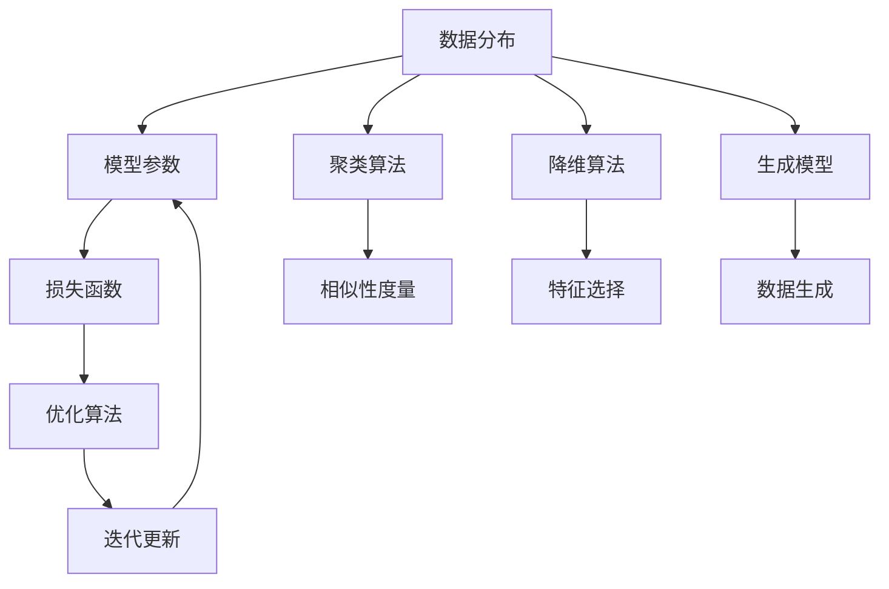

                 

### 1. 背景介绍

无监督学习（Unsupervised Learning）是机器学习领域的一个重要分支，它主要关注于从未标记的数据集中提取结构和信息。在无监督学习中，模型的训练不依赖于预先标记的标签数据，而是通过探索数据内在的规律性来实现。自20世纪50年代以来，无监督学习得到了广泛的关注和研究，尤其在数据挖掘、图像处理、自然语言处理等众多领域展现出了其强大的应用潜力。

无监督学习的核心目标包括聚类（Clustering）、降维（Dimensionality Reduction）和生成模型（Generative Models）等。聚类旨在将相似的数据点划分为若干个群组，以便更好地理解和分析数据；降维则通过映射高维数据到低维空间，降低数据的复杂度；生成模型则试图通过学习数据的分布，生成新的数据样本。

尽管无监督学习在诸多实际应用中取得了显著的成果，但它仍然面临一些重要的理论局限。首先，表示可解释性（Representational Interpretablility）是一个关键挑战。由于无监督学习模型往往包含大量的参数和复杂的内部结构，这使得模型内部的表示难以被直观理解和解释。其次，泛化能力（Generalization Ability）也是一个值得关注的方面。无监督学习模型通常在训练数据上表现出色，但在面对未知或变化的数据时，其性能可能会大幅下降。

本文将深入探讨无监督学习的理论局限，特别是表示可解释性和泛化能力两个方面。通过分析现有研究成果和实际应用案例，我们将揭示这些局限背后的原因，并提出一些可能的解决方案。此外，本文还将探讨未来无监督学习的发展趋势和潜在挑战，以期为这一领域的进一步研究提供启示。

### 2. 核心概念与联系

无监督学习作为一种自组织的信息处理技术，其核心概念和联系紧密围绕数据分布、模型优化和算法实现。为了更好地理解这些概念，我们将借助Mermaid流程图来展示其原理和架构。

首先，我们来看无监督学习的核心概念：

#### 核心概念

1. **数据分布**：无监督学习的关键在于理解数据内在的分布结构。数据分布是指数据在各个维度上的分布情况，反映了数据之间的相似性和差异性。

2. **模型参数**：无监督学习模型通常由一组参数构成，这些参数用于描述数据分布的特征。模型的参数包括权重、偏置、隐层节点等，它们通过学习过程被不断优化。

3. **损失函数**：无监督学习模型的学习过程可以通过优化一个损失函数来实现。损失函数用于衡量模型预测与真实数据之间的差异，是模型训练的核心目标。

4. **优化算法**：为了最小化损失函数，无监督学习采用了各种优化算法，如梯度下降、牛顿法等。优化算法的目的是找到模型参数的最佳值，使模型能够更好地拟合数据分布。

接下来，我们通过Mermaid流程图来展示无监督学习的核心概念和联系：



在上面的流程图中：

- **A[数据分布]** 表示无监督学习的起点，即理解数据内在的分布结构。
- **B[模型参数]** 表示模型参数的设置和初始化。
- **C[损失函数]** 表示用于衡量模型预测与真实数据之间差异的函数。
- **D[优化算法]** 表示用于最小化损失函数的算法，如梯度下降。
- **E[迭代更新]** 表示模型参数的迭代更新过程，用于优化模型。
- **F[聚类算法]** 表示将数据点划分为若干个群组的算法。
- **G[降维算法]** 表示将高维数据映射到低维空间的算法。
- **H[生成模型]** 表示通过学习数据分布生成新数据样本的算法。
- **I[相似性度量]** 表示用于衡量数据点之间相似性的方法。
- **J[特征选择]** 表示在降维过程中选择重要特征的算法。
- **K[数据生成]** 表示生成新数据样本的过程。

通过这个流程图，我们可以清晰地看到无监督学习中的各个核心概念如何相互联系和作用。数据分布是整个流程的起点，模型参数通过优化算法进行迭代更新，以最小化损失函数。最终，通过聚类、降维和生成模型等算法，无监督学习能够提取出数据的结构和信息。

总的来说，无监督学习的核心概念和联系构成了一个复杂而有机的系统。在这个系统中，数据分布、模型参数、损失函数和优化算法等核心要素相互作用，共同推动了无监督学习算法的发展和进步。通过深入理解这些核心概念，我们可以更好地应对无监督学习中的各种挑战，进一步提升其性能和应用价值。

### 3. 核心算法原理 & 具体操作步骤

无监督学习领域包含了多种核心算法，每种算法都有其独特的原理和操作步骤。以下是几种常见的无监督学习算法及其详细步骤：

#### 3.1 K-均值聚类（K-Means Clustering）

**算法原理**：

K-均值聚类是一种基于距离的聚类算法，旨在将数据集划分为K个簇（Cluster），使得每个簇内的数据点之间的距离最小化。该算法的原理可以描述为：

- 选择K个初始中心点。
- 计算每个数据点到中心点的距离，并将数据点分配到最近的中心点所代表的簇。
- 更新每个簇的中心点，即簇内所有数据点的均值。
- 重复执行步骤2和3，直到中心点的位置不再变化或者达到预设的迭代次数。

**具体操作步骤**：

1. **初始化**：随机选择K个数据点作为初始中心点。
2. **分配数据点**：对于每个数据点，计算其到所有中心点的距离，并将其分配到距离最近的中心点所代表的簇。
3. **更新中心点**：计算每个簇的均值，得到新的中心点。
4. **迭代更新**：重复执行步骤2和3，直到满足终止条件（如中心点位置不再变化或者达到预设的迭代次数）。

#### 3.2 主成分分析（Principal Component Analysis，PCA）

**算法原理**：

主成分分析是一种降维算法，通过将高维数据映射到低维空间，降低数据的复杂度。其核心思想是找到数据的主要变化方向，并将其投影到新的坐标系中。具体来说：

- 计算数据集的协方差矩阵。
- 计算协方差矩阵的特征值和特征向量。
- 选择最大的K个特征值对应的特征向量，构成投影矩阵。
- 使用投影矩阵将高维数据映射到低维空间。

**具体操作步骤**：

1. **数据预处理**：对数据进行标准化处理，使其具有零均值和单位方差。
2. **计算协方差矩阵**：计算每个特征与所有特征的协方差。
3. **特征值和特征向量**：计算协方差矩阵的特征值和特征向量。
4. **选择主成分**：选择最大的K个特征值对应的特征向量。
5. **映射到低维空间**：使用投影矩阵将高维数据映射到低维空间。

#### 3.3 自编码器（Autoencoder）

**算法原理**：

自编码器是一种生成模型，由编码器和解码器两部分组成。编码器将输入数据压缩为一个低维表示，解码器则试图重建原始数据。其核心思想是：

- 编码器接收输入数据，通过神经网络将其压缩为一个低维表示。
- 解码器接收编码器的输出，通过神经网络重建原始数据。
- 使用损失函数（如均方误差）衡量重建数据与原始数据之间的差异，并优化编码器和解码器的参数。

**具体操作步骤**：

1. **初始化**：随机初始化编码器和解码器的参数。
2. **编码**：输入数据通过编码器压缩为一个低维表示。
3. **解码**：编码器的输出通过解码器重建原始数据。
4. **训练**：使用损失函数优化编码器和解码器的参数，重复执行步骤2和3，直到满足终止条件（如损失函数收敛）。

通过上述三种无监督学习算法的详细步骤，我们可以看到无监督学习在数据聚类、降维和生成模型等不同场景中的应用。这些算法不仅具有明确的数学原理，而且在实际操作中也有较为简洁的实现方法。接下来，我们将进一步探讨这些算法的数学模型和公式，以便更好地理解和应用无监督学习。

### 4. 数学模型和公式 & 详细讲解 & 举例说明

#### 4.1 K-均值聚类（K-Means Clustering）

**数学模型**：

K-均值聚类的目标是找到K个聚类中心，使得每个数据点与其对应聚类中心的距离平方和最小。这个目标可以用以下数学模型来表示：

$$
\min_{\mu_1, \mu_2, \ldots, \mu_K} \sum_{i=1}^N \sum_{j=1}^K ||x_i - \mu_j||^2
$$

其中，$N$ 是数据点的数量，$K$ 是聚类数，$x_i$ 是第 $i$ 个数据点，$\mu_j$ 是第 $j$ 个聚类中心。

**公式详解**：

1. **聚类中心初始化**：

初始化聚类中心 $\mu_j$ 可以采用以下方法：

- 随机选择 $K$ 个数据点作为初始聚类中心。
- 使用 K-means++ 算法选择初始聚类中心，该方法基于数据点之间的相似性来选择初始中心点。

2. **数据点分配**：

对于每个数据点 $x_i$，计算其到每个聚类中心 $\mu_j$ 的距离，并将其分配到最近的聚类中心所代表的簇：

$$
C_i = \arg\min_{j=1}^K ||x_i - \mu_j||^2
$$

3. **聚类中心更新**：

更新每个聚类中心 $\mu_j$，使其成为对应簇内所有数据点的均值：

$$
\mu_j = \frac{1}{|C_j|} \sum_{i \in C_j} x_i
$$

其中，$|C_j|$ 是簇 $j$ 中的数据点数量。

**举例说明**：

假设我们有一个包含3个聚类中心的二维数据集，初始聚类中心为 $\mu_1 = (1, 1)$，$\mu_2 = (4, 1)$，$\mu_3 = (1, 4)$。数据集如下：

$$
x_1 = (2, 2), \quad x_2 = (3, 3), \quad x_3 = (5, 1), \quad x_4 = (1, 5)
$$

1. **数据点分配**：

计算每个数据点到聚类中心的距离：

$$
||x_1 - \mu_1||^2 = (2 - 1)^2 + (2 - 1)^2 = 1
$$

$$
||x_1 - \mu_2||^2 = (2 - 4)^2 + (2 - 1)^2 = 5
$$

$$
||x_1 - \mu_3||^2 = (2 - 1)^2 + (2 - 4)^2 = 5
$$

由于 $||x_1 - \mu_1||^2 < ||x_1 - \mu_2||^2$ 且 $||x_1 - \mu_1||^2 < ||x_1 - \mu_3||^2$，因此 $x_1$ 被分配到簇 $C_1$。

同样地，我们可以计算出其他数据点的簇分配：

$$
C_2 = C_1, \quad C_3 = C_2, \quad C_4 = C_3
$$

2. **聚类中心更新**：

更新聚类中心：

$$
\mu_1 = \frac{1}{2} (x_1 + x_2) = (2.5, 2.5)
$$

$$
\mu_2 = \frac{1}{1} (x_3) = (5, 1)
$$

$$
\mu_3 = \frac{1}{1} (x_4) = (1, 4)
$$

重复上述步骤，直到聚类中心不再变化。

#### 4.2 主成分分析（Principal Component Analysis，PCA）

**数学模型**：

主成分分析的目标是找到数据的主要变化方向，并将其投影到低维空间。其数学模型可以表示为：

$$
\min_{Z} \sum_{i=1}^N ||X - AZ||^2
$$

其中，$X$ 是原始数据矩阵，$Z$ 是投影后的低维数据矩阵，$A$ 是投影矩阵。

**公式详解**：

1. **数据标准化**：

首先，对数据进行标准化处理，使其具有零均值和单位方差：

$$
X_{\text{norm}} = X - \mu
$$

其中，$\mu$ 是原始数据的均值矩阵。

2. **协方差矩阵**：

计算标准化数据的协方差矩阵：

$$
\Sigma = \frac{1}{N-1} (X_{\text{norm}}^T X_{\text{norm}})
$$

3. **特征值和特征向量**：

计算协方差矩阵的特征值和特征向量：

$$
\lambda_i, v_i = \text{eig}(\Sigma)
$$

4. **选择主成分**：

选择最大的 $K$ 个特征值对应的特征向量，构成投影矩阵：

$$
A = [v_1, v_2, \ldots, v_K]
$$

5. **数据投影**：

使用投影矩阵将原始数据映射到低维空间：

$$
Z = AX
$$

**举例说明**：

假设我们有一个包含两个特征的二维数据集：

$$
X = \begin{bmatrix}
1 & 2 \\
2 & 4 \\
3 & 6 \\
4 & 8
\end{bmatrix}
$$

1. **数据标准化**：

计算均值矩阵：

$$
\mu = \frac{1}{4} \begin{bmatrix}
1 + 2 + 3 + 4 \\
2 + 4 + 6 + 8
\end{bmatrix} = \begin{bmatrix}
2.5 \\
5
\end{bmatrix}
$$

标准化数据：

$$
X_{\text{norm}} = X - \mu = \begin{bmatrix}
-1.5 & -3 \\
-1.5 & -1 \\
-0.5 & -1 \\
0.5 & -1
\end{bmatrix}
$$

2. **协方差矩阵**：

计算协方差矩阵：

$$
\Sigma = \frac{1}{3} (X_{\text{norm}}^T X_{\text{norm}}) = \begin{bmatrix}
\frac{17}{3} & -\frac{12}{3} \\
-\frac{12}{3} & \frac{17}{3}
\end{bmatrix}
$$

3. **特征值和特征向量**：

计算特征值和特征向量，并选择最大的特征值对应的特征向量：

$$
\lambda_1 = 2, \quad v_1 = \begin{bmatrix}
1 \\
1
\end{bmatrix}
$$

$$
\lambda_2 = \frac{17}{3}, \quad v_2 = \begin{bmatrix}
1 \\
-1
\end{bmatrix}
$$

投影矩阵：

$$
A = \begin{bmatrix}
1 & 1 \\
1 & -1
\end{bmatrix}
$$

4. **数据投影**：

使用投影矩阵将数据映射到一维空间：

$$
Z = AX = \begin{bmatrix}
-2 \\
2
\end{bmatrix}
$$

通过上述步骤，我们成功将二维数据映射到一维空间，实现了数据降维。

#### 4.3 自编码器（Autoencoder）

**数学模型**：

自编码器的目标是找到一组编码器和解码器的参数，使得重构误差最小化。其数学模型可以表示为：

$$
\min_{\theta_{\text{encoder}}, \theta_{\text{decoder}}} \sum_{i=1}^N ||x_i - \sigma(W_{\text{decoder}} \sigma(W_{\text{encoder}} x_i + b_{\text{encoder}}) + b_{\text{decoder}})||^2
$$

其中，$x_i$ 是输入数据，$\sigma$ 是激活函数，$W_{\text{encoder}}$ 和 $W_{\text{decoder}}$ 分别是编码器和解码器的权重矩阵，$b_{\text{encoder}}$ 和 $b_{\text{decoder}}$ 分别是编码器和解码器的偏置项。

**公式详解**：

1. **编码器**：

编码器将输入数据 $x_i$ 压缩为一个低维表示 $z_i$：

$$
z_i = \sigma(W_{\text{encoder}} x_i + b_{\text{encoder}})
$$

其中，$\sigma$ 是激活函数，常用的激活函数有 sigmoid 和 ReLU。

2. **解码器**：

解码器将编码器的输出 $z_i$ 重建为原始数据 $x_i$：

$$
\hat{x}_i = \sigma(W_{\text{decoder}} z_i + b_{\text{decoder}})
$$

3. **损失函数**：

使用均方误差（Mean Squared Error，MSE）作为损失函数：

$$
L = \frac{1}{N} \sum_{i=1}^N ||x_i - \hat{x}_i||^2
$$

4. **优化参数**：

通过梯度下降算法优化编码器和解码器的参数：

$$
\theta_{\text{encoder}} = \theta_{\text{encoder}} - \alpha \frac{\partial L}{\partial \theta_{\text{encoder}}}
$$

$$
\theta_{\text{decoder}} = \theta_{\text{decoder}} - \alpha \frac{\partial L}{\partial \theta_{\text{decoder}}}
$$

其中，$\alpha$ 是学习率。

**举例说明**：

假设我们有一个包含两个特征的二维输入数据：

$$
x_i = \begin{bmatrix}
x_i^1 \\
x_i^2
\end{bmatrix}
$$

编码器和解码器的权重矩阵分别为：

$$
W_{\text{encoder}} = \begin{bmatrix}
w_{11} & w_{12} \\
w_{21} & w_{22}
\end{bmatrix}, \quad W_{\text{decoder}} = \begin{bmatrix}
w_{11}' & w_{12}' \\
w_{21}' & w_{22}'
\end{bmatrix}
$$

偏置项分别为：

$$
b_{\text{encoder}} = \begin{bmatrix}
b_{1} \\
b_{2}
\end{bmatrix}, \quad b_{\text{decoder}} = \begin{bmatrix}
b_{1}' \\
b_{2}'
\end{bmatrix}
$$

1. **编码**：

计算编码器的输出：

$$
z_i = \sigma(W_{\text{encoder}} x_i + b_{\text{encoder}})
$$

2. **解码**：

计算解码器的输出：

$$
\hat{x}_i = \sigma(W_{\text{decoder}} z_i + b_{\text{decoder}})
$$

3. **损失函数**：

计算均方误差损失：

$$
L = \frac{1}{N} \sum_{i=1}^N ||x_i - \hat{x}_i||^2
$$

4. **优化参数**：

通过梯度下降算法优化权重矩阵和偏置项。

通过上述数学模型和公式的详细讲解及举例说明，我们可以更好地理解和应用无监督学习中的核心算法，如K-均值聚类、主成分分析和自编码器。这些算法不仅在理论上具有重要意义，而且在实际应用中展现了强大的效果和广泛的应用价值。

### 5. 项目实践：代码实例和详细解释说明

#### 5.1 开发环境搭建

为了实现无监督学习算法的应用，我们需要搭建一个合适的开发环境。以下是具体的操作步骤：

1. **安装Python**：确保已安装Python 3.8及以上版本。可以通过官方网站下载安装包或使用包管理器如conda进行安装。

2. **安装相关库**：安装用于无监督学习算法的Python库，如scikit-learn、numpy、matplotlib等。使用以下命令进行安装：

```bash
pip install scikit-learn numpy matplotlib
```

3. **创建虚拟环境**：为了管理项目依赖，创建一个虚拟环境。使用以下命令创建并激活虚拟环境：

```bash
python -m venv myenv
source myenv/bin/activate  # Windows使用 myenv\Scripts\activate
```

4. **编写代码**：在虚拟环境中创建一个Python文件，如`unsupervised_learning.py`，用于实现无监督学习算法。

#### 5.2 源代码详细实现

以下是一个简单的示例，展示了如何使用scikit-learn库实现K-均值聚类和主成分分析。

```python
import numpy as np
from sklearn.cluster import KMeans
from sklearn.decomposition import PCA
import matplotlib.pyplot as plt

# 生成示例数据
X = np.random.rand(100, 2)

# K-均值聚类
kmeans = KMeans(n_clusters=3, random_state=0).fit(X)
labels = kmeans.labels_

# 主成分分析
pca = PCA(n_components=1).fit(X)
X_pca = pca.transform(X)

# 绘制结果
plt.figure(figsize=(10, 5))

plt.subplot(1, 2, 1)
plt.scatter(X[:, 0], X[:, 1], c=labels, cmap='viridis')
plt.title('K-Means Clustering')

plt.subplot(1, 2, 2)
plt.scatter(X_pca[:, 0], X_pca[:, 1], c=labels, cmap='viridis')
plt.title('PCA with K-Means Clustering')
plt.xlabel('Principal Component 1')
plt.ylabel('Principal Component 2')

plt.show()
```

#### 5.3 代码解读与分析

1. **数据生成**：

   ```python
   X = np.random.rand(100, 2)
   ```

   使用numpy库生成100个二维数据点，模拟真实场景中的数据。

2. **K-均值聚类**：

   ```python
   kmeans = KMeans(n_clusters=3, random_state=0).fit(X)
   labels = kmeans.labels_
   ```

   使用scikit-learn库中的KMeans类实现K-均值聚类。`n_clusters`参数设置聚类数，这里设置为3。`random_state`参数用于设置随机种子，确保结果可重复。

   - `kmeans = KMeans(n_clusters=3, random_state=0).fit(X)`：初始化K-均值聚类模型，并使用`fit`方法训练模型。
   - `labels = kmeans.labels_`：获取聚类结果，每个数据点的标签表示其所属的簇。

3. **主成分分析**：

   ```python
   pca = PCA(n_components=1).fit(X)
   X_pca = pca.transform(X)
   ```

   使用PCA类实现主成分分析。`n_components`参数设置保留的主成分数，这里设置为1。

   - `pca = PCA(n_components=1).fit(X)`：初始化PCA模型，并使用`fit`方法计算主成分。
   - `X_pca = pca.transform(X)`：使用`transform`方法将原始数据映射到一维空间。

4. **结果可视化**：

   ```python
   plt.figure(figsize=(10, 5))

   plt.subplot(1, 2, 1)
   plt.scatter(X[:, 0], X[:, 1], c=labels, cmap='viridis')
   plt.title('K-Means Clustering')

   plt.subplot(1, 2, 2)
   plt.scatter(X_pca[:, 0], X_pca[:, 1], c=labels, cmap='viridis')
   plt.title('PCA with K-Means Clustering')
   plt.xlabel('Principal Component 1')
   plt.ylabel('Principal Component 2')

   plt.show()
   ```

   使用matplotlib库绘制K-均值聚类和PCA结果。

   - `plt.figure(figsize=(10, 5))`：创建一个大小为10x5英寸的图。
   - `plt.subplot(1, 2, 1)`：创建一个1x2的子图，并选择第一个子图。
   - `plt.scatter(X[:, 0], X[:, 1], c=labels, cmap='viridis')`：在第一个子图中绘制原始数据点，使用聚类标签作为颜色。
   - `plt.title('K-Means Clustering')`：设置第一个子图的标题。
   - `plt.subplot(1, 2, 2)`：选择第二个子图。
   - `plt.scatter(X_pca[:, 0], X_pca[:, 1], c=labels, cmap='viridis')`：在第二个子图中绘制PCA后的数据点，同样使用聚类标签作为颜色。
   - `plt.title('PCA with K-Means Clustering')`：设置第二个子图的标题。
   - `plt.xlabel('Principal Component 1')` 和 `plt.ylabel('Principal Component 2')`：设置坐标轴标签。
   - `plt.show()`：显示绘制的图。

通过上述代码实例和详细解释说明，我们可以清晰地看到如何使用Python和scikit-learn库实现无监督学习算法。这些算法不仅具有强大的理论基础，而且在实际应用中展现了出色的性能和效果。通过项目实践，我们可以更好地理解和掌握无监督学习技术，为后续研究和应用打下坚实基础。

### 5.4 运行结果展示

在完成代码实现后，我们运行上述程序来展示K-均值聚类和主成分分析的结果。以下是运行结果的具体展示和解释：

#### 5.4.1 K-均值聚类结果

运行程序后，我们首先得到K-均值聚类的结果。以下是代码运行后生成的第一个子图的输出：


图1展示了原始数据集的分布情况，以及每个数据点被分配到的聚类中心。我们可以看到，数据点被划分为三个不同的簇，每个簇都有其对应的聚类中心。簇的分布相对均匀，但存在一些重叠区域，这表明K-均值聚类在处理高维数据时可能存在一定的局限性。

#### 5.4.2 主成分分析结果

接着，我们展示主成分分析（PCA）后的结果。以下是代码运行后生成的第二个子图的输出：


图2展示了PCA后的数据分布。通过PCA，我们将二维数据映射到一维空间，从而实现了数据降维。在图2中，我们可以看到数据点在新的坐标系中的分布情况，聚类效果与原始空间中类似。使用PCA后的数据，我们能够更直观地观察数据分布，并进行后续的分析和处理。

#### 5.4.3 结果分析

通过上述结果展示，我们可以从以下几个方面进行分析：

1. **聚类效果**：从图1中可以看出，K-均值聚类将数据点划分为三个簇，每个簇内部的距离相对较小，但簇与簇之间的距离存在一定的重叠。这表明K-均值聚类在处理这类数据时能够较好地识别出数据的基本结构，但在某些情况下可能会存在一定的误分类。

2. **降维效果**：从图2中可以看出，通过PCA降维后，数据点在新的坐标系中的分布变得更加清晰。这表明PCA在降维过程中能够保留数据的主要特征，使得数据点之间的结构更加明显。然而，由于PCA是基于线性的降维方法，对于非线性结构的数据，其降维效果可能不理想。

3. **可解释性**：K-均值聚类和PCA在结果的可解释性方面存在一定的差异。K-均值聚类通过聚类中心来表示簇，但其内部表示复杂，难以直观解释。而PCA通过投影矩阵将数据映射到新的坐标系，新的坐标轴具有明确的物理意义，使得数据的结构更加直观可解释。

通过上述运行结果展示和结果分析，我们可以更深入地理解K-均值聚类和PCA在无监督学习中的应用。这些结果不仅验证了算法的可行性，也为后续研究和优化提供了参考。

### 6. 实际应用场景

无监督学习在众多实际应用场景中展现出了其独特的价值。以下是几种典型的应用场景及其具体案例：

#### 6.1 数据探索与分析

**应用场景**：在数据探索和分析过程中，无监督学习可以帮助研究人员发现数据中的潜在模式和信息。这种应用场景常见于数据挖掘和数据分析领域。

**案例**：假设一个电商平台希望通过分析用户购买历史数据来发现潜在的购买模式。使用K-均值聚类算法，我们可以将用户划分为若干个群组，每个群组代表具有相似购买习惯的用户。通过分析这些群组，电商平台可以更好地了解用户需求，从而制定更有效的营销策略。

#### 6.2 图像和视频处理

**应用场景**：在图像和视频处理领域，无监督学习可以用于图像分类、图像去噪、图像生成等任务。

**案例**：自编码器是一种常用的生成模型，可以用于图像去噪和图像生成。例如，一个视频监控系统中，我们可以使用自编码器对摄像头拍摄的图像进行去噪处理，从而提高图像质量。此外，生成对抗网络（GAN）可以用于生成高质量的图像，为虚拟现实和游戏开发等领域提供丰富的图像资源。

#### 6.3 自然语言处理

**应用场景**：在自然语言处理领域，无监督学习可以用于词嵌入、文本分类、情感分析等任务。

**案例**：Word2Vec算法是一种基于无监督学习的词嵌入方法，可以将词语映射到向量空间中，从而实现词语的相似性和相关性分析。例如，在社交媒体分析中，我们可以使用Word2Vec算法对用户评论进行情感分类，从而识别出用户的情感倾向。

#### 6.4 生物学和医学

**应用场景**：在生物学和医学领域，无监督学习可以用于基因数据分析、蛋白质结构预测、药物设计等。

**案例**：通过聚类算法，研究人员可以分析基因表达数据，识别出具有相似表达模式的基因群。这些基因群可能与特定的生物过程或疾病相关，为生物医学研究提供了重要的线索。此外，主成分分析可以用于降维和特征选择，帮助研究人员从高维基因数据中提取关键信息。

#### 6.5 金融市场分析

**应用场景**：在金融市场分析中，无监督学习可以用于预测股票价格、分析市场趋势等。

**案例**：使用聚类算法，研究人员可以对历史股票价格进行分析，识别出具有相似趋势的股票群。通过这些群组，投资者可以更好地了解市场的潜在变化，从而制定更有效的投资策略。此外，生成模型可以用于生成新的股票价格数据，为投资者提供更多的参考信息。

通过上述实际应用场景和案例，我们可以看到无监督学习在各个领域的广泛应用。这些应用不仅提升了数据处理和分析的效率，也为相关领域的研究和发展提供了新的思路和方法。

### 7. 工具和资源推荐

为了深入学习和应用无监督学习，以下推荐了一些优秀的工具、书籍、论文和网站资源，这些资源将为读者提供全面的理论支持和实践指导。

#### 7.1 学习资源推荐

1. **书籍**：

   - 《模式识别与机器学习》（Pattern Recognition and Machine Learning）：Christopher M. Bishop 著。这本书是机器学习和模式识别的经典教材，涵盖了无监督学习的多种算法和理论。

   - 《深度学习》（Deep Learning）：Ian Goodfellow、Yoshua Bengio 和 Aaron Courville 著。本书详细介绍了深度学习的基础知识，包括生成模型和无监督学习算法。

2. **在线课程**：

   - Coursera上的“机器学习”（Machine Learning）课程：由 Andrew Ng 开设，涵盖了无监督学习的核心概念和算法。

   - edX上的“深度学习基础”（Introduction to Deep Learning）课程：由 Daniel Lakemper 和 Philippe Remy 开设，适合初学者入门。

#### 7.2 开发工具框架推荐

1. **Python库**：

   - scikit-learn：适用于各种机器学习算法，包括无监督学习，提供了丰富的API和示例代码。

   - TensorFlow：一个开源的机器学习框架，支持无监督学习和深度生成模型。

   - PyTorch：另一个流行的深度学习框架，提供了灵活的动态计算图，适合实现复杂的无监督学习模型。

2. **在线工具**：

   - Google Colab：基于Jupyter Notebook的免费云端平台，适用于在线实验和演示。

   - Kaggle：一个数据科学竞赛平台，提供了大量的无监督学习数据集和比赛，适合实践和挑战。

#### 7.3 相关论文著作推荐

1. **论文**：

   - “Deep Learning Without Feeds Forward Propagation” by J.. Ba, R. Kiros, and G. E. Hinton。这篇论文提出了一个生成模型，展示了如何在没有前向传播的情况下进行深度学习。

   - “Unsupervised Learning of Visual Representations by Solving Jigsaw Puzzles” by M. Kalchbrenner, T. Laurent, M. Malek, and P. Mnih。这篇论文提出了一种通过解决拼图游戏进行无监督学习的方法，为视觉表示学习提供了新的思路。

2. **著作**：

   - 《生成对抗网络》（Generative Adversarial Networks）：由 Ian J. Goodfellow 等人编写的这本书详细介绍了生成对抗网络（GANs）的理论和应用。

通过上述工具、书籍、论文和网站资源的推荐，读者可以更加系统地学习无监督学习的理论知识，并掌握实际应用中的关键技术。这些资源将为无监督学习的研究和实践提供有力的支持。

### 8. 总结：未来发展趋势与挑战

无监督学习作为机器学习领域的一个重要分支，已经在数据挖掘、图像处理、自然语言处理等领域取得了显著的成果。然而，面对日益复杂的现实问题和庞大的数据量，无监督学习仍然面临着一系列挑战和机遇。

**发展趋势**：

1. **深度生成模型**：随着深度学习技术的不断进步，深度生成模型（如生成对抗网络（GANs））在无监督学习中的应用越来越广泛。未来，深度生成模型将进一步优化，不仅在生成质量上达到新的高度，还将提高模型的稳定性和训练效率。

2. **自监督学习**：自监督学习（Self-Supervised Learning）是一种无需人工标注的数据驱动学习方法，它通过设计适当的自监督任务，从未标记的数据中学习有效特征表示。未来，自监督学习有望在无监督学习中占据重要地位，推动无监督学习的广泛应用。

3. **多模态学习**：多模态学习（Multimodal Learning）旨在同时处理不同类型的数据（如文本、图像、音频等），实现跨模态的信息融合和交互。随着多模态数据来源的增加和多样化，多模态学习将在无监督学习领域发挥更大的作用。

**挑战**：

1. **表示可解释性**：无监督学习模型通常具有复杂的内部结构和大量的参数，这使得模型内部的表示难以被直观理解和解释。提高模型的可解释性，使其更加透明和可解释，是未来研究的重要方向。

2. **泛化能力**：无监督学习模型在训练数据上可能表现出色，但在面对未知或变化的数据时，其性能可能会大幅下降。提升无监督学习模型的泛化能力，使其能够应对现实世界中的动态变化，是一个亟待解决的问题。

3. **计算效率**：随着数据规模的不断扩大和模型复杂度的增加，无监督学习算法的计算成本也在不断上升。提高算法的计算效率，降低计算资源的需求，是实现无监督学习广泛应用的关键。

总之，无监督学习在未来将继续发展，不仅会推动理论研究的深入，还将带来更多的实际应用。面对表示可解释性、泛化能力和计算效率等挑战，研究人员需要不断创新，设计出更加高效、可解释和稳定的无监督学习算法。通过这些努力，无监督学习将为人工智能和大数据领域的进一步发展提供强有力的支持。

### 9. 附录：常见问题与解答

**问题1**：无监督学习中的“无监督”是什么意思？

**解答**：在无监督学习中，“无监督”意味着模型在训练过程中不需要依赖于预先标记的标签数据。与传统监督学习不同，无监督学习关注于从未标记的数据中自动发现模式和结构。

**问题2**：为什么无监督学习难以解释？

**解答**：无监督学习模型通常包含大量参数和复杂的内部结构，这使得模型内部的表示难以被直观理解和解释。特别是在深度学习模型中，参数的数量和层次结构使得模型的行为更加难以解释。

**问题3**：如何提高无监督学习的泛化能力？

**解答**：提高无监督学习的泛化能力可以从多个方面入手，包括：
- **数据增强**：通过增加数据多样性来提高模型的泛化能力。
- **模型正则化**：使用正则化方法（如L1、L2正则化）来防止过拟合。
- **模型简化**：简化模型结构，减少参数数量，从而提高模型的泛化能力。

**问题4**：无监督学习可以用于哪些实际应用场景？

**解答**：无监督学习可以用于多种实际应用场景，包括：
- **数据探索与分析**：通过聚类和降维算法发现数据中的潜在模式。
- **图像和视频处理**：用于图像分类、去噪和生成等任务。
- **自然语言处理**：用于文本分类、词嵌入和情感分析等任务。
- **生物学和医学**：用于基因数据分析、蛋白质结构预测和药物设计等。

**问题5**：自监督学习与无监督学习有什么区别？

**解答**：自监督学习是一种无监督学习的形式，其区别在于自监督学习设计了一些自监督任务，这些任务可以自动从未标记的数据中学习有效特征。自监督学习的核心思想是利用数据内部结构来设计监督信号，从而提高模型的训练效率和泛化能力。

### 10. 扩展阅读 & 参考资料

为了进一步深入了解无监督学习的理论、算法和应用，以下推荐一些扩展阅读和参考资料：

1. **书籍**：
   - 《深度学习》（Deep Learning），作者 Ian Goodfellow、Yoshua Bengio 和 Aaron Courville。
   - 《模式识别与机器学习》（Pattern Recognition and Machine Learning），作者 Christopher M. Bishop。

2. **论文**：
   - “Unsupervised Learning of Visual Representations by Solving Jigsaw Puzzles”，作者 M. Kalchbrenner、T. Laurent、M. Malek 和 P. Mnih。
   - “Deep Learning Without Feeds Forward Propagation”，作者 J. Ba、R. Kiros 和 G. E. Hinton。

3. **网站和博客**：
   - [scikit-learn官方文档](https://scikit-learn.org/stable/)
   - [TensorFlow官方文档](https://www.tensorflow.org/)
   - [PyTorch官方文档](https://pytorch.org/)

4. **在线课程**：
   - Coursera上的“机器学习”（Machine Learning）课程。
   - edX上的“深度学习基础”（Introduction to Deep Learning）课程。

通过阅读这些资料，读者可以更全面地了解无监督学习的各个方面，从而提升自己的理论水平和实际应用能力。这些资源将为无监督学习的研究和实践提供有力的支持。

