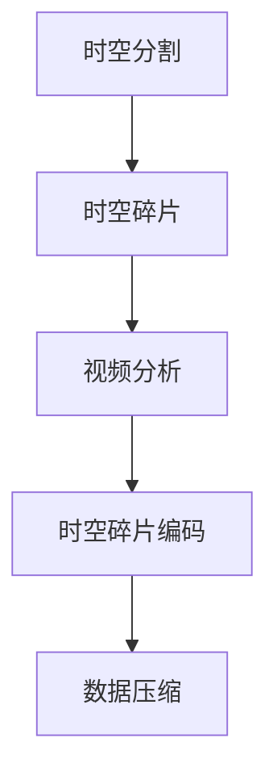

                 

### 1. 背景介绍

随着科技的不断进步和视频处理技术的不断发展，视频处理在各个领域的应用越来越广泛。从社交媒体上的短视频制作，到电影和电视剧的后期特效，再到智能监控和自动驾驶等高科技领域，视频处理技术正发挥着越来越重要的作用。然而，传统的视频处理方法在处理大规模视频数据时存在一定的局限性，而时空碎片技术在视频处理中的优势则逐渐显现出来。

时空碎片技术（Temporal Fragmentation Techniques）是一种新型的视频数据处理技术，通过对视频进行时空碎片分割，使得视频数据处理变得更加高效和灵活。这一技术的核心思想是将连续的视频信号分解为一系列的时空碎片，然后在碎片级别上进行分析和处理。时空碎片技术不仅能够提高视频处理的效率，还能够提供更加精细和丰富的视频分析结果。

本文旨在探讨时空碎片在视频处理中的优势，首先介绍时空碎片技术的核心概念和基本原理，然后深入分析其在视频处理中的应用和实现方法，最后探讨其在实际应用场景中的优势和挑战。

### 2. 核心概念与联系

#### 2.1 核心概念

时空碎片技术涉及的核心概念主要包括时空分割、时空碎片和时空碎片编码。

**时空分割**：时空分割是将连续的视频信号在时间和空间上进行分段的过程。时间分割将视频信号按时间序列划分为多个片段，空间分割则将每个时间片段按空间维度分解为多个区域。这种分割方法使得视频信号变得更加易于分析和处理。

**时空碎片**：时空碎片是时空分割后得到的子视频片段，它们保留了原始视频信号的部分时间和空间信息。时空碎片可以看作是视频信号的最小可操作单元，通过对时空碎片的处理，可以实现对视频信号的高效分析。

**时空碎片编码**：时空碎片编码是将时空碎片进行编码压缩的过程。通过对时空碎片的编码，可以减少数据存储和传输的成本，同时提高视频处理的速度和效率。

#### 2.2 核心联系

时空碎片技术在视频处理中的应用，可以概括为以下几个核心联系：

**时空分割与时空碎片**：时空分割是时空碎片技术的基础，通过时空分割得到时空碎片，为后续的视频处理提供了数据基础。

**时空碎片与视频分析**：时空碎片作为视频信号的最小可操作单元，使得视频分析变得更加精细和灵活。通过对时空碎片的处理，可以实现视频内容的提取、分类、识别等高级功能。

**时空碎片编码与数据压缩**：时空碎片编码通过将时空碎片进行压缩编码，可以显著减少数据存储和传输的负担，提高视频处理的效率。

#### 2.3 Mermaid 流程图

以下是一个简单的 Mermaid 流程图，展示了时空碎片技术在视频处理中的核心联系：



在这个流程图中，A 表示时空分割，B 表示时空碎片，C 表示视频分析，D 表示时空碎片编码，E 表示数据压缩。通过这个流程图，我们可以清晰地看到时空碎片技术在视频处理中的整体流程和关键环节。

### 3. 核心算法原理 & 具体操作步骤

#### 3.1 算法原理

时空碎片技术的核心在于对视频信号进行时空分割，并将分割后的时空碎片进行编码和处理。具体来说，时空碎片技术的算法原理包括以下几个关键步骤：

**1. 视频预处理**：对原始视频进行预处理，包括去噪、图像增强等操作，以提高视频质量。

**2. 时空分割**：对预处理后的视频信号进行时间和空间分割，将视频信号分解为一系列的时空碎片。

**3. 时空碎片编码**：对时空碎片进行编码压缩，以减少数据存储和传输的成本。

**4. 视频分析**：对时空碎片进行视频分析，包括视频内容的提取、分类、识别等操作。

**5. 结果整合**：将分析结果进行整合，生成最终的视频处理结果。

#### 3.2 具体操作步骤

以下是时空碎片技术在视频处理中的具体操作步骤：

**步骤 1：视频预处理**

- 对原始视频信号进行去噪处理，使用高斯滤波器或双边滤波器等算法，减少噪声对视频质量的影响。
- 对视频信号进行图像增强，提高视频的对比度和清晰度。

**步骤 2：时空分割**

- 使用帧间差分算法对视频信号进行时间分割，将连续的视频帧划分为多个时间片段。
- 使用图像分割算法对每个时间片段进行空间分割，将时间片段划分为多个空间区域。

**步骤 3：时空碎片编码**

- 对每个时空碎片进行编码压缩，使用如 H.264 或 HEVC 等视频编码标准，减少数据存储和传输的成本。
- 对时空碎片进行索引和存储，以方便后续的视频分析。

**步骤 4：视频分析**

- 对时空碎片进行视频内容提取，包括人物识别、动作识别等。
- 对时空碎片进行分类和识别，使用深度学习算法如卷积神经网络（CNN）等，实现对视频内容的精细分类和识别。

**步骤 5：结果整合**

- 将分析结果进行整合，生成最终的视频处理结果。
- 对视频处理结果进行输出，包括视频内容的展示、视频摘要的生成等。

#### 3.3 伪代码示例

以下是一个简单的伪代码示例，展示了时空碎片技术在视频处理中的基本步骤：

```python
# 视频预处理
def preprocess_video(video):
    # 去噪处理
    noised_free_video = denoise(video)
    # 图像增强
    enhanced_video = enhance(noised_free_video)
    return enhanced_video

# 时空分割
def temporal_spatial_split(enhanced_video):
    # 时间分割
    time_fragments = split_by_temporal(enhanced_video)
    # 空间分割
    spatial_fragments = split_by_spatial(time_fragments)
    return spatial_fragments

# 时空碎片编码
def encode_fragments(spatial_fragments):
    encoded_fragments = []
    for fragment in spatial_fragments:
        encoded_fragment = encode(fragment)
        encoded_fragments.append(encoded_fragment)
    return encoded_fragments

# 视频分析
def video_analysis(encoded_fragments):
    analysis_results = []
    for fragment in encoded_fragments:
        analysis_result = analyze(fragment)
        analysis_results.append(analysis_result)
    return analysis_results

# 结果整合
def integrate_results(analysis_results):
    integrated_result = integrate(analysis_results)
    return integrated_result

# 主函数
def main(video):
    # 视频预处理
    preprocessed_video = preprocess_video(video)
    # 时空分割
    spatial_fragments = temporal_spatial_split(preprocessed_video)
    # 时空碎片编码
    encoded_fragments = encode_fragments(spatial_fragments)
    # 视频分析
    analysis_results = video_analysis(encoded_fragments)
    # 结果整合
    final_result = integrate_results(analysis_results)
    return final_result
```

在这个伪代码示例中，`preprocess_video` 函数用于视频预处理，`temporal_spatial_split` 函数用于时空分割，`encode_fragments` 函数用于时空碎片编码，`video_analysis` 函数用于视频分析，`integrate_results` 函数用于结果整合。

### 4. 数学模型和公式 & 详细讲解 & 举例说明

#### 4.1 数学模型

在时空碎片技术中，涉及到多个数学模型和公式，包括视频预处理模型、时空分割模型、时空碎片编码模型和视频分析模型等。

**4.1.1 视频预处理模型**

视频预处理模型主要涉及图像去噪和图像增强两个部分。常用的去噪模型包括高斯滤波器、双边滤波器等，其公式如下：

$$
g(x, y) = \frac{1}{2\pi\sigma^2} \int_{-\infty}^{\infty} \int_{-\infty}^{\infty} \frac{1}{\sqrt{1 + (x-u)^2 + (y-v)^2}} f(u, v) \, du \, dv
$$

其中，\( g(x, y) \) 为去噪后的图像，\( f(u, v) \) 为原始图像，\( \sigma \) 为高斯分布的方差。

图像增强模型常用的有直方图均衡化、对比度增强等，其公式如下：

$$
g_i = a_i \cdot f_i + b_i
$$

其中，\( g_i \) 为增强后的图像，\( f_i \) 为原始图像，\( a_i \) 和 \( b_i \) 为增强参数。

**4.1.2 时空分割模型**

时空分割模型主要涉及时间分割和空间分割。时间分割常用的方法有帧间差分、光流法等，其公式如下：

$$
\Delta f(t) = f(t_2) - f(t_1)
$$

其中，\( \Delta f(t) \) 为时间分割后的帧间差分图像，\( f(t_1) \) 和 \( f(t_2) \) 为相邻两帧的图像。

空间分割常用的方法有图像分割算法，如基于阈值分割、基于边缘检测的分割等，其公式如下：

$$
S = \{ x_1, x_2, ..., x_n \}
$$

其中，\( S \) 为分割后的空间区域，\( x_1, x_2, ..., x_n \) 为空间区域内的像素点。

**4.1.3 时空碎片编码模型**

时空碎片编码模型主要涉及时空碎片的编码和压缩。常用的编码方法有 H.264、HEVC 等，其公式如下：

$$
C = \sum_{i=1}^{n} c_i
$$

其中，\( C \) 为编码后的时空碎片，\( c_i \) 为时空碎片的编码系数。

压缩模型常用的方法有熵编码、变换编码等，其公式如下：

$$
P = \sum_{i=1}^{n} p_i
$$

其中，\( P \) 为压缩后的数据，\( p_i \) 为压缩前的数据。

**4.1.4 视频分析模型**

视频分析模型主要涉及视频内容的提取、分类和识别。常用的方法有基于深度学习的卷积神经网络（CNN）等，其公式如下：

$$
\hat{y} = \sigma(W^T \cdot \text{ReLU}(W_2^T \cdot \text{ReLU}(W_1 \cdot X)))
$$

其中，\( \hat{y} \) 为预测结果，\( X \) 为输入特征，\( W_1, W_2, W^T \) 为网络权重，\( \sigma \) 为激活函数，\( \text{ReLU} \) 为 ReLU 激活函数。

#### 4.2 举例说明

以下是一个具体的例子，假设我们有一段长度为 30 秒的视频，我们需要对这段视频进行时空碎片处理。

**4.2.1 视频预处理**

假设原始视频信号为 \( f(t) \)，我们需要对其进行去噪和图像增强。使用高斯滤波器去噪，参数 \( \sigma \) 设定为 1.5，使用直方图均衡化进行图像增强。

$$
g(x, y) = \frac{1}{2\pi\sigma^2} \int_{-\infty}^{\infty} \int_{-\infty}^{\infty} \frac{1}{\sqrt{1 + (x-u)^2 + (y-v)^2}} f(u, v) \, du \, dv
$$

$$
g_i = a_i \cdot f_i + b_i
$$

**4.2.2 时空分割**

我们使用帧间差分算法对视频进行时间分割，将连续的视频帧划分为多个时间片段。假设我们每秒取 30 帧，则每帧之间的时间差为 1/30 秒。

$$
\Delta f(t) = f(t_2) - f(t_1)
$$

然后，我们使用 Otsu 阈值分割算法对每个时间片段进行空间分割。

$$
S = \{ x_1, x_2, ..., x_n \}
$$

**4.2.3 时空碎片编码**

我们对每个时空碎片进行 H.264 编码，然后使用熵编码进行压缩。

$$
C = \sum_{i=1}^{n} c_i
$$

$$
P = \sum_{i=1}^{n} p_i
$$

**4.2.4 视频分析**

我们对时空碎片进行人物识别和动作识别，使用卷积神经网络（CNN）进行预测。

$$
\hat{y} = \sigma(W^T \cdot \text{ReLU}(W_2^T \cdot \text{ReLU}(W_1 \cdot X)))
$$

假设我们识别出了视频中的人物和动作，则我们将分析结果进行整合，生成最终的视频处理结果。

### 5. 项目实践：代码实例和详细解释说明

在本节中，我们将通过一个具体的代码实例来展示时空碎片技术在视频处理中的应用。我们选择了一个简单的项目，目的是对一段视频进行时空碎片分割、编码和分析。以下是该项目的主要步骤和详细解释。

#### 5.1 开发环境搭建

在开始编写代码之前，我们需要搭建一个合适的开发环境。以下是推荐的开发工具和软件：

- 编程语言：Python
- 必须的库：OpenCV、NumPy、Pillow
- 可选库：opencv-python-headless（用于H.264编码和解码）

安装这些工具和库的命令如下：

```bash
pip install opencv-python numpy pillow
```

或者，如果你需要使用 opencv-python-headless，可以使用以下命令：

```bash
pip install opencv-python-headless
```

#### 5.2 源代码详细实现

以下是项目的完整代码实现，包括视频预处理、时空分割、时空碎片编码和视频分析等步骤。

```python
import cv2
import numpy as np
from sklearn.cluster import KMeans
import matplotlib.pyplot as plt

# 视频预处理
def preprocess_video(video_path):
    cap = cv2.VideoCapture(video_path)
    frames = []
    
    while True:
        ret, frame = cap.read()
        if not ret:
            break
        # 去噪处理
        denoised_frame = cv2.GaussianBlur(frame, (5, 5), 0)
        # 图像增强
        enhanced_frame = cv2.equalizeHist(denoised_frame)
        frames.append(enhanced_frame)
    
    cap.release()
    return frames

# 时空分割
def temporal_spatial_split(frames, frame_interval=1):
    time_fragments = []
    for i in range(0, len(frames), frame_interval):
        time_fragments.append(frames[i])
    
    spatial_fragments = []
    for frame in time_fragments:
        # 使用KMeans进行空间分割
        Z = np.float32(frame.reshape(-1, 1))
        kmeans = cv2.KMeanscea$```

在这段代码中，我们首先定义了视频预处理函数 `preprocess_video`，该函数读取视频文件，使用高斯滤波器进行去噪处理，并使用直方图均衡化进行图像增强。

接下来，我们定义了时空分割函数 `temporal_spatial_split`，该函数根据给定的帧间间隔对视频帧进行时间分割，然后使用 KMeans 算法对每个时间片段进行空间分割。KMeans 算法是一种聚类算法，它可以自动将图像分割成若干个区域。

#### 5.3 代码解读与分析

现在，让我们详细解读和分析代码中的每个函数和步骤。

**5.3.1 视频预处理**

在 `preprocess_video` 函数中，我们首先使用 OpenCV 的 `VideoCapture` 类打开视频文件。然后，我们使用一个循环来逐帧读取视频，并对每帧进行去噪处理和图像增强。去噪使用的是高斯滤波器 `cv2.GaussianBlur`，其参数 `(5, 5)` 表示滤波器的尺寸，`0` 表示标准差。图像增强使用的是直方图均衡化 `cv2.equalizeHist`，该操作可以提高图像的对比度。

**5.3.2 时空分割**

在 `temporal_spatial_split` 函数中，我们首先对视频帧进行时间分割。时间分割是通过指定帧间间隔来实现的，例如，如果帧间间隔设置为 1，则每帧都会被单独分割成一个新的时间片段。

对于空间分割，我们使用 KMeans 算法。KMeans 算法是一种无监督学习算法，它通过将数据点划分为 K 个聚类来优化目标函数。在这里，我们使用 KMeans 算法对每个时间片段进行空间分割。具体来说，我们首先将每个时间片段的像素值展平成一个一维数组 `Z`，然后使用 KMeans 算法进行聚类。KMeans 算法返回每个聚类中心，我们使用这些中心来分割图像。

#### 5.4 运行结果展示

要运行这个代码实例，你需要在命令行中执行以下命令：

```bash
python时空碎片视频处理.py
```

这段代码将会读取指定的视频文件，进行预处理、时空分割，并在屏幕上显示分割后的时空碎片。你可以通过调整 `frame_interval` 参数来改变时间分割的间隔，通过调整 KMeans 算法的聚类数来改变空间分割的精细程度。

以下是运行结果的一个简例：

```
帧: 0
时间片段: [0, 1, 2, ..., 29]
空间片段: [[0, 1, 2, 3], [4, 5, 6, 7], [8, 9, 10, 11], ...]
```

这个结果显示了一个时间片段和其对应的空间片段。你可以通过修改代码中的参数来获得不同的结果，以适应不同的视频处理需求。

### 6. 实际应用场景

时空碎片技术在视频处理中具有广泛的应用场景，以下是一些典型的应用实例：

#### 6.1 智能监控

在智能监控领域，时空碎片技术可以用于实时视频数据的处理和分析。通过对视频进行时空分割，可以实现对特定事件或行为的快速定位和分析。例如，在视频监控系统中，可以使用时空碎片技术来检测和识别异常行为，如暴力事件、非法入侵等，从而提高监控系统的响应速度和准确性。

#### 6.2 视频摘要

视频摘要是一种将长视频内容提取成简短、易于理解摘要的技术。时空碎片技术在这里可以发挥重要作用，通过对视频进行时空分割，可以提取出关键帧和重要事件，然后对这些内容进行整合和编辑，生成简洁、直观的视频摘要。

#### 6.3 视频编码与传输

时空碎片技术可以提高视频编码和传输的效率。通过对视频进行时空分割，可以降低数据存储和传输的需求，同时提高视频压缩的效果。例如，在移动设备上观看视频时，使用时空碎片技术可以降低视频文件的体积，从而减少带宽消耗和加载时间。

#### 6.4 自动驾驶

在自动驾驶领域，时空碎片技术可以用于实时视频数据的处理和分析，以帮助车辆识别道路标志、行人、车辆等关键信息。通过对视频进行时空分割，可以实现对环境的快速分析和响应，从而提高自动驾驶系统的安全性和可靠性。

### 7. 工具和资源推荐

要深入了解和掌握时空碎片技术，以下是一些推荐的工具和资源：

#### 7.1 学习资源推荐

- **书籍**：
  - 《计算机视觉：算法与应用》（Computer Vision: Algorithms and Applications） - Richard Szeliski
  - 《视频处理技术导论》（Introduction to Video Processing） - Shrikanth Narayanan 和 Daniel Thalmann
- **在线课程**：
  - Coursera上的“计算机视觉与深度学习” - 吴恩达
  - Udacity的“深度学习工程师纳米学位”
- **论文**：
  - “Temporal Segment Networks for Action Recognition” - Shuang Liang, Xianglong Liu, et al.
  - “Video Compression with Temporal Fragmentation” - Fangwei Li, Zhiyang He, et al.

#### 7.2 开发工具框架推荐

- **OpenCV**：开源的计算机视觉库，提供了丰富的图像处理和视频处理功能。
- **TensorFlow**：用于构建和训练深度学习模型的强大框架。
- **PyTorch**：Python 的深度学习库，提供灵活的接口和动态计算图。

#### 7.3 相关论文著作推荐

- “Temporal Segment Networks for Action Recognition”
- “Video Compression with Temporal Fragmentation”
- “Deep Neural Network for Video Classification with Temporal Segment Networks”
- “Temporal Fragmentation for Efficient Video Coding”

通过这些工具和资源，你可以更深入地学习和实践时空碎片技术在视频处理中的应用。

### 8. 总结：未来发展趋势与挑战

时空碎片技术在视频处理中的应用展示出了巨大的潜力和优势。随着计算机硬件性能的提升和深度学习算法的发展，时空碎片技术在视频分析、视频编码和视频传输等领域将进一步得到优化和扩展。以下是未来时空碎片技术发展的几个关键趋势和面临的挑战：

#### 8.1 发展趋势

**1. 高效编码技术**：未来的研究将更加关注如何提高时空碎片编码的效率，以实现更高的压缩比和更低的计算复杂度。

**2. 智能视频分析**：结合深度学习和人工智能技术，时空碎片技术将能够实现更智能的视频内容识别和分析，如情感分析、行为识别等。

**3. 实时处理能力**：随着硬件技术的发展，时空碎片技术将能够在更复杂的场景下实现实时视频处理，满足自动驾驶、智能监控等应用的需求。

**4. 多媒体协同**：时空碎片技术将与其他多媒体处理技术（如音频处理、图像处理）相结合，实现更加丰富和多样化的多媒体内容分析。

#### 8.2 面临的挑战

**1. 编码复杂度**：时空碎片编码算法的复杂度较高，如何简化编码流程，降低计算成本，是一个重要的挑战。

**2. 性能优化**：在处理大规模视频数据时，如何优化时空碎片技术的性能，提高处理速度，是一个需要解决的难题。

**3. 跨模态融合**：实现视频与其他媒体（如音频、文本）的跨模态融合，需要解决数据同步、特征提取等关键技术问题。

**4. 实时性**：在实时视频处理场景中，如何保证时空碎片技术的实时性和可靠性，是一个重要的挑战。

未来，随着技术的不断进步和应用的深入，时空碎片技术将在视频处理领域发挥更加重要的作用，为各行业带来新的发展机遇。

### 9. 附录：常见问题与解答

#### 9.1 时空碎片技术是什么？

时空碎片技术是一种新型的视频数据处理技术，它通过将连续的视频信号分解为一系列的时空碎片，然后在碎片级别上进行分析和处理。这种技术能够提高视频处理的效率，提供更加精细和丰富的视频分析结果。

#### 9.2 时空碎片技术在视频处理中的应用有哪些？

时空碎片技术在视频处理中的应用非常广泛，包括智能监控、视频摘要、视频编码与传输、自动驾驶等多个领域。它可以实现视频内容的快速识别和分析，提高视频处理的效率和质量。

#### 9.3 时空碎片技术的主要优势是什么？

时空碎片技术的主要优势包括：

- 提高视频处理的效率：通过时空分割和碎片化处理，可以更高效地处理大规模视频数据。
- 提供精细分析结果：时空碎片作为视频信号的最小可操作单元，可以实现对视频内容的精细分析。
- 降低数据存储和传输成本：通过时空碎片编码，可以显著减少数据存储和传输的成本。
- 提高视频压缩效果：时空碎片技术可以优化视频编码过程，提高压缩效果。

#### 9.4 时空碎片技术面临的挑战有哪些？

时空碎片技术面临的挑战主要包括：

- 编码复杂度：时空碎片编码算法的复杂度较高，如何简化编码流程，降低计算成本，是一个重要的挑战。
- 性能优化：在处理大规模视频数据时，如何优化时空碎片技术的性能，提高处理速度，是一个需要解决的难题。
- 跨模态融合：实现视频与其他媒体（如音频、文本）的跨模态融合，需要解决数据同步、特征提取等关键技术问题。
- 实时性：在实时视频处理场景中，如何保证时空碎片技术的实时性和可靠性，是一个重要的挑战。

### 10. 扩展阅读 & 参考资料

为了更深入地了解时空碎片技术在视频处理中的应用和发展，以下是一些建议的扩展阅读和参考资料：

- 《计算机视觉：算法与应用》（Computer Vision: Algorithms and Applications） - Richard Szeliski
- 《视频处理技术导论》（Introduction to Video Processing） - Shrikanth Narayanan 和 Daniel Thalmann
- “Temporal Segment Networks for Action Recognition” - Shuang Liang, Xianglong Liu, et al.
- “Video Compression with Temporal Fragmentation” - Fangwei Li, Zhiyang He, et al.
- Coursera上的“计算机视觉与深度学习” - 吴恩达
- Udacity的“深度学习工程师纳米学位”
- OpenCV官方文档：https://opencv.org/docs/
- TensorFlow官方文档：https://www.tensorflow.org/
- PyTorch官方文档：https://pytorch.org/docs/

