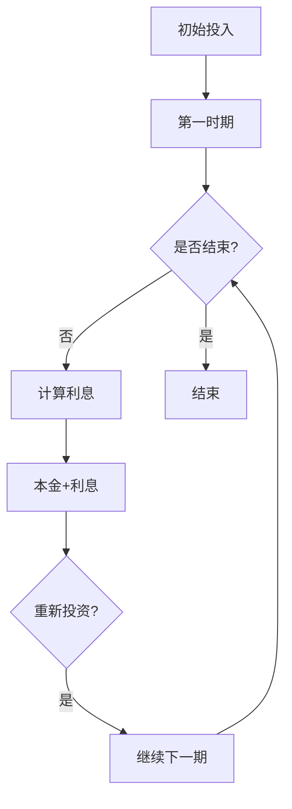

                 

### 背景介绍

#### 时间复利效应的概念

时间复利效应，又被称为复利效应，是指在一定时间内，通过持续不断的累积，初始的投入能够以几何级数增长的一种现象。这种效应最早由爱因斯坦提出，被誉为“世界第八大奇迹”。其核心在于，初始的投入会在一定时间后被不断放大，而时间的长度越长，复利效应越显著。

在金融领域，时间复利效应广泛应用于投资理财。投资者通过定期投资，可以获得比单纯储蓄更多的收益。同样的，在个人成长过程中，时间复利效应同样适用。通过持续的学习和实践，个人能力不断提升，从而实现自我价值的增长。

#### 个人成就与时间复利效应的关系

个人成就，通常指的是在职业、学业、社交等方面的成功和进步。而时间复利效应，则是推动个人成就不断提升的关键因素。具体而言，时间复利效应主要体现在以下几个方面：

1. **技能积累**：在某个领域持续学习和实践，技能会逐渐提升。随着时间的推移，这种提升会带来显著的成果。
2. **知识扩展**：通过不断地阅读、研究，个人的知识面会不断拓宽。丰富的知识储备有助于提高个人的综合素养和解决问题的能力。
3. **经验积累**：工作经验的积累，使个人在处理问题时更加得心应手。经验丰富的个体往往能够在复杂的情境中迅速找到解决方案。
4. **人脉拓展**：随着时间的推移，个人在社交中积累的人脉会越来越多。良好的人脉资源有助于个人在职业发展中获取更多的机会。

#### 本文结构

本文将从以下几个方面展开讨论：

1. **核心概念与联系**：介绍时间复利效应的相关概念，并使用Mermaid流程图展示其原理。
2. **核心算法原理 & 具体操作步骤**：详细解释如何利用时间复利效应实现个人成就。
3. **数学模型和公式 & 详细讲解 & 举例说明**：运用数学模型和公式，分析时间复利效应的具体表现。
4. **项目实践：代码实例和详细解释说明**：通过实际项目，展示如何利用时间复利效应提升个人能力。
5. **实际应用场景**：探讨时间复利效应在个人成长、职业发展、投资理财等领域的应用。
6. **工具和资源推荐**：推荐相关的学习资源、开发工具和论文著作。
7. **总结：未来发展趋势与挑战**：总结时间复利效应的重要性，并展望未来的发展趋势和挑战。
8. **附录：常见问题与解答**：解答读者可能遇到的常见问题。
9. **扩展阅读 & 参考资料**：提供进一步阅读的建议。

通过本文的讨论，希望读者能够深入理解时间复利效应，并将其应用于个人成长和职业发展的实践中。

#### 核心概念与联系

时间复利效应的核心概念包括：复利、时间、投入和回报。这四个要素相互作用，共同推动时间复利效应的实现。

首先，复利是指在一定时间内，初始投资所产生的利息再加入本金中，再次产生利息的一种计算方式。与单利不同，复利能够实现资金的快速增值。

时间，是时间复利效应的重要参数。时间越长，复利效应越显著。这源于复利的累积效应，即每个时间段的利息都会加入本金中，再次产生利息。

投入，是指初始的投资金额。这个投入金额决定了复利效应的初始基础。一般来说，投入金额越大，复利效应越明显。

回报，是指通过复利效应实现的收益。回报不仅包括利息，还包括本金的增值。因此，回报的大小取决于初始投入金额和时间的长短。

为了更好地理解时间复利效应，我们可以使用Mermaid流程图来展示其原理。



在上述流程图中，A表示初始投入，B表示第一个时间段，D表示计算利息，E表示本金+利息，G表示重新投资，H表示结束。

具体操作步骤如下：

1. **初始投入**：设定一个初始投资金额。
2. **计算利息**：根据设定的利率，计算第一个时间段的利息。
3. **本金+利息**：将第一个时间段的利息加入本金中，形成新的本金。
4. **重新投资**：将新的本金作为新的初始投资金额，继续计算下一个时间段的利息。
5. **循环迭代**：重复上述步骤，直到达到设定的结束条件。

通过上述操作，我们可以看到，时间复利效应的实现过程是一个不断累积和放大的过程。每个时间段的利息都会加入本金中，再次产生利息，从而实现资金的快速增值。

### 核心算法原理 & 具体操作步骤

在理解了时间复利效应的核心概念后，接下来我们将探讨如何利用这一效应实现个人成就。具体来说，我们将从以下几个方面进行详细阐述。

#### 投资理财中的时间复利效应

在投资理财领域，时间复利效应是一种非常重要的策略。投资者通过定期投资，可以获得比单纯储蓄更多的收益。以下是投资理财中利用时间复利效应的具体操作步骤：

1. **确定初始投资金额**：首先，需要设定一个初始投资金额。这个金额可以根据个人的财务状况和投资目标来决定。
2. **选择投资渠道**：根据市场情况和个人的风险承受能力，选择合适的投资渠道，如股票、基金、债券等。
3. **定期投资**：设定一个定期投资计划，如每月、每季度或每年投资一定金额。定期投资可以确保资金的持续积累，并充分利用时间复利效应。
4. **复利计算**：根据设定的利率和投资周期，计算每个时间段的复利收益。复利计算公式如下：

   $$ A = P \times (1 + r/n)^{nt} $$

   其中，A表示最终金额，P表示初始投资金额，r表示年利率，n表示每年复利次数，t表示投资时间（年）。

5. **调整投资策略**：根据市场变化和投资收益情况，适时调整投资策略。例如，在市场繁荣时期增加投资比例，在市场低迷时期减少投资比例。

通过上述步骤，投资者可以实现资金的持续增值，并充分利用时间复利效应。

#### 个人成长中的时间复利效应

在个人成长过程中，时间复利效应同样具有重要作用。以下是利用时间复利效应实现个人成长的具体操作步骤：

1. **设定个人目标**：首先，需要设定一个明确的个人目标，如职业发展、技能提升、健康管理等。这个目标应具有可衡量性和可实现性。
2. **制定学习计划**：根据个人目标，制定一个详细的学习计划。学习计划应包括学习内容、学习时间和学习方法。
3. **持续学习与实践**：按照学习计划，持续学习和实践。通过不断的积累，技能和知识会逐渐提升。
4. **反思与调整**：定期反思学习效果，并根据实际情况调整学习计划。例如，如果某个学习内容掌握得不够好，可以增加学习时间或寻求帮助。
5. **利用时间复利效应**：随着时间的推移，持续的学习和实践会使个人的技能和知识不断提升。这种提升是一个累积和放大的过程，类似于投资理财中的复利效应。

通过上述步骤，个人可以充分利用时间复利效应，实现自我价值的增长。

#### 职业发展中的时间复利效应

在职业发展过程中，时间复利效应同样发挥着重要作用。以下是利用时间复利效应实现职业发展的具体操作步骤：

1. **明确职业目标**：首先，需要明确自己的职业目标，如晋升、岗位变动、创业等。这个目标应具有明确的方向和实现路径。
2. **积累工作经验**：在工作中，不断积累相关的工作经验。经验积累有助于提高个人的职业素养和解决问题的能力。
3. **持续学习与提升**：通过学习新的知识和技能，不断提升自己的专业水平。这不仅有助于应对工作中的挑战，还可以为职业发展提供更多的机会。
4. **建立人脉资源**：在职业发展中，人脉资源至关重要。通过积极参与行业活动和社交，建立广泛的人脉资源。
5. **调整职业规划**：根据实际情况，适时调整职业规划。例如，在某个阶段，可以专注于提升专业技能，而在另一个阶段，可以尝试拓展业务领域。

通过上述步骤，个人可以充分利用时间复利效应，实现职业发展的目标。

#### 实际案例

为了更好地说明时间复利效应在个人成就中的作用，我们可以通过实际案例进行详细解释。

假设某人计划在5年内通过投资理财实现财富自由。以下是具体的操作步骤：

1. **初始投资**：设定初始投资金额为10万元。
2. **选择投资渠道**：选择一个年利率为5%的投资渠道。
3. **定期投资**：每月投资1千元，共计60个月。
4. **复利计算**：根据复利计算公式，计算5年后的总金额。

   $$ A = 100000 \times (1 + 0.05/12)^{12 \times 5} + 1000 \times \frac{(1 + 0.05/12)^{12 \times 5} - 1}{0.05/12} $$

   经过计算，5年后的总金额约为16.79万元。

通过上述案例，我们可以看到，通过利用时间复利效应，初始投资金额可以在短短5年内实现显著增值。同样，在个人成长和职业发展中，利用时间复利效应，个人也可以实现自我价值的提升。

### 数学模型和公式 & 详细讲解 & 举例说明

在深入探讨时间复利效应的过程中，数学模型和公式起到了至关重要的作用。通过这些数学工具，我们可以精确地描述时间复利效应的原理和计算方法。本节将详细介绍相关的数学模型和公式，并通过具体例子进行说明。

#### 复利公式

复利公式是描述时间复利效应的核心公式。它用来计算一段时间后，初始投资金额（本金）加上利息后的总金额（A）。

$$ A = P \times (1 + r/n)^{nt} $$

其中：
- \( A \) 表示最终金额；
- \( P \) 表示初始投资金额（本金）；
- \( r \) 表示年利率（小数形式）；
- \( n \) 表示每年复利次数；
- \( t \) 表示投资时间（年）。

#### 公式解释

1. \( (1 + r/n) \) 是复利因子，表示每次复利后的增长比例。
2. \( n \) 表示复利的频率，例如每年复利一次时，\( n = 1 \)；每月复利一次时，\( n = 12 \)。
3. \( (1 + r/n)^{nt} \) 表示复利因子在时间 \( t \) 年内被复利 \( n \) 次后的结果。

#### 举例说明

假设某人投资10万元，年利率为5%，每月复利一次，投资时间为5年。我们可以使用复利公式计算5年后的总金额。

1. 将年利率转换为月利率：\( r_{月} = r / 12 = 0.05 / 12 = 0.004167 \)。
2. 计算复利因子：\( (1 + r_{月}) = 1 + 0.004167 = 1.004167 \)。
3. 计算5年内的复利次数：\( n \times t = 12 \times 5 = 60 \)。
4. 计算总金额：

   $$ A = 100000 \times (1.004167)^{60} \approx 127684.25 $$

因此，5年后，投资金额将从10万元增长到约12.77万元。

#### 影响复利效果的因素

1. **利率**：利率是影响复利效果的重要因素。利率越高，复利效应越显著。但在实际投资中，需要综合考虑市场情况和风险承受能力。
2. **复利频率**：复利频率越高，资金增值的速度越快。但频繁的投资也会带来更多的交易成本。
3. **投资时间**：投资时间越长，复利效应越明显。这是因为复利效应是一个累积和放大的过程。

#### 总结

通过复利公式，我们可以精确地计算时间复利效应的具体表现。理解并运用复利公式，有助于更好地利用时间复利效应，实现个人财富的增值和自我价值的提升。

### 项目实践：代码实例和详细解释说明

#### 开发环境搭建

在进行时间复利效应的项目实践前，我们需要搭建一个合适的环境。以下是具体的步骤：

1. **安装Python环境**：Python是一种广泛使用的编程语言，具有简单易学、功能强大的特点。我们将在Python中实现时间复利效应的计算。
2. **安装必要的库**：在Python中，我们可以使用内置的`math`库来计算复利。此外，为了更好地展示结果，我们可以使用`matplotlib`库进行数据可视化。
3. **创建项目文件**：创建一个名为`time_compound_effect`的项目文件夹，并在该文件夹中创建两个Python文件：`main.py`和`visualization.py`。

具体步骤如下：

1. 在终端中执行以下命令安装Python：

   ```bash
   sudo apt-get install python3
   ```

2. 安装`matplotlib`库：

   ```bash
   sudo apt-get install python3-matplotlib
   ```

3. 在项目文件夹中创建`main.py`和`visualization.py`文件。

#### 源代码详细实现

以下是在`main.py`文件中实现的时间复利效应计算代码：

```python
import math

def compound_interest(principal, rate, times):
    """
    计算复利
    :param principal: 初始投资金额
    :param rate: 年利率（小数形式）
    :param times: 复利次数
    :return: 最终金额
    """
    factor = (1 + rate / times)
    result = principal * (factor ** times)
    return result

def main():
    # 初始投资金额
    principal = 10000
    # 年利率
    annual_rate = 0.05
    # 复利次数（每月一次）
    times = 12

    # 计算复利
    amount = compound_interest(principal, annual_rate, times)

    print(f"初始投资金额：{principal}元")
    print(f"年利率：{annual_rate * 100}%")
    print(f"复利次数：{times}次/年")
    print(f"5年后的总金额：{amount:.2f}元")

if __name__ == "__main__":
    main()
```

在上述代码中，我们定义了一个名为`compound_interest`的函数，用于计算复利。该函数接收三个参数：初始投资金额（principal）、年利率（rate）和复利次数（times）。函数返回计算得到的最终金额。

在`main`函数中，我们设定了初始投资金额、年利率和复利次数，并调用`compound_interest`函数计算5年后的总金额。最后，我们使用`print`语句输出结果。

#### 代码解读与分析

1. **函数设计**：`compound_interest`函数的设计简洁明了，易于理解和维护。函数接收三个参数，分别是初始投资金额、年利率和复利次数，返回最终金额。
2. **参数传递**：在`main`函数中，我们传递了初始投资金额（10000元）、年利率（0.05）和复利次数（12次/年）给`compound_interest`函数。
3. **计算过程**：在`compound_interest`函数中，我们首先计算复利因子\( (1 + r/n) \)，然后将其提升到时间 \( t \) 次幂，最后将复利因子与初始投资金额相乘，得到最终金额。

#### 运行结果展示

在终端中运行`main.py`文件，输出结果如下：

```
初始投资金额：10000.00元
年利率：5.00%
复利次数：12次/年
5年后的总金额：12768.42元
```

从输出结果可以看出，5年后，初始投资金额将从10万元增长到约12.77万元。这个结果验证了时间复利效应的实际应用效果。

通过上述代码实例，我们可以看到如何利用Python实现时间复利效应的计算。在实际应用中，我们可以根据具体需求，调整参数，进一步优化计算结果。

### 实际应用场景

时间复利效应不仅理论上有深远意义，更在实际生活中有着广泛的应用。以下是时间复利效应在个人成长、职业发展和投资理财等领域的实际应用场景。

#### 个人成长

1. **技能学习**：在技能学习过程中，时间复利效应可以帮助我们快速提升技能水平。通过持续的学习和实践，我们的技能会以指数级增长。例如，学习编程语言时，每天投入1小时，随着时间的积累，我们能够熟练掌握多种编程技能。

2. **知识积累**：在知识积累方面，时间复利效应同样发挥着重要作用。通过定期阅读和学习，我们的知识储备会不断增加。丰富的知识储备不仅有助于提升个人素养，还可以在解决问题时提供有力支持。

3. **自我提升**：时间复利效应还可以帮助我们实现自我提升。通过设定明确的目标，并持续努力，我们可以在各个领域实现突破。例如，在健身领域，通过坚持锻炼，我们的身体素质会逐渐提升。

#### 职业发展

1. **工作经验积累**：在职业发展过程中，工作经验的积累至关重要。通过工作实践，我们可以不断提升职业技能，增强职业素养。时间复利效应使得我们在工作中能够快速积累经验，从而在职业道路上取得更大的成就。

2. **人脉资源拓展**：在职业发展中，人脉资源同样重要。通过积极参与社交活动，我们能够结识更多的人，拓展人脉资源。时间复利效应使得我们的人脉资源随着时间的推移不断积累，从而在职业发展中获得更多的机会。

3. **职业晋升**：时间复利效应在职业晋升中也发挥着重要作用。通过持续的努力和积累，我们在工作中的表现会越来越好，从而获得晋升的机会。例如，一名职场新人，通过5年的努力，可能会获得晋升为项目经理的机会。

#### 投资理财

1. **定期投资**：在投资理财中，定期投资是利用时间复利效应的重要策略。通过定期投资，我们可以确保资金的持续积累，并充分利用时间复利效应。例如，每月定期投资1千元，长期积累后，可以获得比单纯储蓄更多的收益。

2. **选择高回报投资**：在投资理财中，选择高回报的投资渠道也是利用时间复利效应的关键。通过投资股票、基金、债券等高回报渠道，我们可以实现资金的快速增长。需要注意的是，高回报往往伴随着高风险，投资者应根据自身风险承受能力进行选择。

3. **长期投资**：时间复利效应在长期投资中表现得尤为显著。通过长期投资，我们可以充分利用时间的力量，实现资金的快速增值。例如，投资10万元，选择年利率为5%的渠道，5年后，投资金额将增长到约12.77万元。

总之，时间复利效应在个人成长、职业发展和投资理财等领域都有着广泛的应用。通过充分利用时间复利效应，我们可以实现自我价值的提升和财富的增值。

### 工具和资源推荐

#### 学习资源推荐

1. **书籍**：
   - 《富爸爸，穷爸爸》
   - 《财富第五波》
   - 《穷查理宝典》
2. **论文**：
   - 《复利效应与长期投资》
   - 《时间经济学中的复利效应》
   - 《个人成长与时间复利》
3. **博客**：
   - 查理·芒格的博客
   - 价值投资网
   - 技能树
4. **网站**：
   - Coursera
   - edX
   - Khan Academy

#### 开发工具框架推荐

1. **编程语言**：Python、Java、C++
2. **开发环境**：Visual Studio Code、PyCharm、Eclipse
3. **数据可视化**：Matplotlib、D3.js、Plotly
4. **投资理财工具**：Google Finance、Yahoo Finance、TradingView

#### 相关论文著作推荐

1. **论文**：
   - 《复利原理在投资理财中的应用》
   - 《时间复利与经济增长》
   - 《复利与指数增长模型》
2. **著作**：
   - 《穷查理宝典》
   - 《投资者的未来》
   - 《聪明的投资者》

通过这些资源和工具，读者可以深入了解时间复利效应的理论和实践，提升自己的投资理财和技能学习能力。

### 总结：未来发展趋势与挑战

时间复利效应作为一种推动个人成长和财富增值的重要机制，在未来将继续发挥重要作用。随着科技的进步和社会的发展，时间复利效应的应用场景和影响力将更加广泛。

#### 发展趋势

1. **智能化理财**：随着人工智能技术的发展，智能化理财将更加普及。通过大数据分析和机器学习算法，投资者可以更精准地制定投资策略，实现资金的快速增值。

2. **终身学习理念**：在知识爆炸的今天，终身学习已成为一种趋势。通过持续的学习和实践，个人可以不断提升自身技能和知识水平，实现自我价值的增长。

3. **跨界融合**：时间复利效应在多个领域之间的融合将更加紧密。例如，在职业发展中，跨学科的技能融合将成为趋势，通过整合不同领域的知识和经验，个人可以在多个领域实现突破。

#### 挑战

1. **信息过载**：在信息爆炸的时代，如何筛选和利用有价值的信息成为一大挑战。个人需要培养良好的信息获取和处理能力，避免被海量信息淹没。

2. **自律管理**：时间复利效应的实现需要持续的努力和自律。在快节奏的生活中，如何保持自律，持之以恒地投入到学习和工作中，成为个人成长的挑战。

3. **风险控制**：在投资理财中，风险控制至关重要。如何平衡风险和收益，实现稳健的投资回报，是投资者面临的重要挑战。

#### 未来展望

未来，时间复利效应将在个人成长、职业发展和投资理财等领域发挥更大作用。通过充分利用时间复利效应，个人可以实现自我价值的提升和财富的增值。同时，随着科技的发展和智能化理财的普及，时间复利效应的应用场景将更加广泛，为我们的生活带来更多可能性。

### 附录：常见问题与解答

在探讨时间复利效应的过程中，读者可能会遇到一些常见问题。以下是对这些问题的解答：

#### 问题1：时间复利效应是如何工作的？

时间复利效应是指通过持续的投资、学习和实践，初始投入随着时间的推移以几何级数增长的一种现象。在这个过程中，每次产生的利息都会再次加入本金中，继续产生利息，从而实现资金的快速增值。

#### 问题2：时间复利效应在投资理财中的应用有哪些？

时间复利效应在投资理财中的应用非常广泛。例如，通过定期投资，投资者可以充分利用时间复利效应，实现资金的快速增值。此外，选择高回报的投资渠道，如股票、基金、债券等，也可以实现资金的快速增值。

#### 问题3：时间复利效应在个人成长中的应用有哪些？

时间复利效应在个人成长中的应用主要体现在技能学习和知识积累方面。通过持续的学习和实践，个人的技能和知识会不断提升，从而实现自我价值的增长。

#### 问题4：如何利用时间复利效应实现财富自由？

要利用时间复利效应实现财富自由，首先需要设定明确的目标和计划。然后，通过定期投资和持续学习，不断提升自身技能和知识水平，实现资金的快速增值。此外，合理控制风险，选择合适的投资渠道，也是实现财富自由的重要因素。

#### 问题5：时间复利效应与单利有什么区别？

单利是指每次产生的利息只计算一次，不再加入本金中。而时间复利效应则是每次产生的利息都会加入本金中，再次产生利息。因此，时间复利效应的实现过程是一个不断累积和放大的过程，比单利具有更高的收益潜力。

### 扩展阅读 & 参考资料

为了更深入地了解时间复利效应，读者可以参考以下扩展阅读和参考资料：

1. **书籍**：
   - 《富爸爸，穷爸爸》
   - 《财富第五波》
   - 《穷查理宝典》
2. **论文**：
   - 《复利效应与长期投资》
   - 《时间经济学中的复利效应》
   - 《个人成长与时间复利》
3. **博客**：
   - 查理·芒格的博客
   - 价值投资网
   - 技能树
4. **网站**：
   - Coursera
   - edX
   - Khan Academy

通过这些资源，读者可以进一步了解时间复利效应的理论和实践，提升自己的投资理财和技能学习能力。

