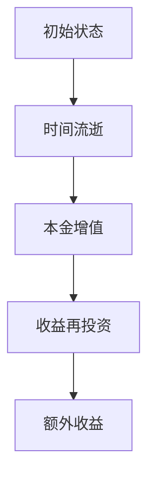

                 

### 文章标题

《时间复利效应的成功之道：从计算机科学到商业实践的全面解析》

> **关键词**：时间复利、计算机科学、商业实践、成功策略、算法原理

> **摘要**：本文旨在探讨时间复利效应在计算机科学和商业实践中的重要作用。我们将通过深入剖析核心概念、算法原理及其应用场景，帮助读者理解和掌握如何利用时间复利实现个人和企业的成功。

### 1. 背景介绍

时间复利效应（Compounding Interest），也称复利效应，是一种投资学中的概念，指的是投资收益在经过一定时间后，由于收益的再投资而产生的额外收益。这一效应在金融领域被广泛应用，以实现资产增值。

随着计算机科学的不断发展，时间复利效应不仅在金融领域得到应用，还在算法优化、机器学习、商业策略等多个领域展现出巨大的潜力。本文将探讨时间复利效应在这些领域的应用，以及如何通过理解和利用这一效应，实现个人和企业的成功。

### 2. 核心概念与联系

时间复利效应的核心在于“时间”和“复利”两个要素。以下是一个用 Mermaid 表示的时间复利效应的流程图：



在这个流程图中：

- **初始状态（A）**：代表初始的投资本金。
- **时间流逝（B）**：随着时间的推移，本金和收益都会增加。
- **本金增值（C）**：本金由于时间效应而增值。
- **收益再投资（D）**：将增值的收益重新投资。
- **额外收益（E）**：通过再投资产生的额外收益。

### 3. 核心算法原理 & 具体操作步骤

时间复利效应的算法原理基于以下公式：

\[ A = P \times (1 + r/n)^{nt} \]

其中：

- \( A \) 是最终金额。
- \( P \) 是初始本金。
- \( r \) 是年利率（以小数表示）。
- \( n \) 是每年计息次数。
- \( t \) 是投资时间（以年为单位）。

#### 具体操作步骤：

1. 确定初始本金 \( P \)。
2. 确定年利率 \( r \) 和计息次数 \( n \)。
3. 确定投资时间 \( t \)。
4. 使用公式计算最终金额 \( A \)。

以下是一个简单的 Python 示例，实现了时间复利效应的计算：

```python
def compound_interest(P, r, n, t):
    return P * (1 + r/n)**(n*t)

# 示例数据
initial_amount = 1000
annual_interest_rate = 0.05
compounding_periods = 4
investment_duration = 5

# 计算最终金额
final_amount = compound_interest(initial_amount, annual_interest_rate, compounding_periods, investment_duration)
print(f"最终金额：{final_amount:.2f}")
```

### 4. 数学模型和公式 & 详细讲解 & 举例说明

时间复利效应的数学模型公式如下：

\[ A = P \times (1 + r/n)^{nt} \]

#### 详细讲解：

1. **初始本金 \( P \)**：这是开始投资时的资金数量，是我们计算复利的基础。

2. **年利率 \( r \)**：这是资金每年的增长比例，通常以小数形式表示。例如，5% 的年利率表示为 0.05。

3. **每年计息次数 \( n \)**：有些投资产品是按月或季度计息的，因此需要确定每年的计息次数。常见的计息周期有月（12 次）和季度（4 次）。

4. **投资时间 \( t \)**：投资的时间长度，通常以年为单位。

5. **最终金额 \( A \)**：这是经过一段时间投资后，本金和收益的总和。

#### 举例说明：

假设你有 10,000 美元，年利率为 5%，每年计息一次，投资 10 年。使用上述公式，我们可以计算出最终金额：

\[ A = 10,000 \times (1 + 0.05/1)^{1 \times 10} \]

\[ A = 10,000 \times (1.05)^{10} \]

\[ A = 10,000 \times 1.628894626 \]

\[ A \approx 16,288.95 \]

这意味着在 10 年后，你的投资将增长到大约 16,288.95 美元。

### 5. 项目实践：代码实例和详细解释说明

#### 5.1 开发环境搭建

在本节中，我们将使用 Python 语言来演示时间复利效应的计算。以下是搭建 Python 开发环境的基本步骤：

1. 安装 Python：访问 [Python 官网](https://www.python.org/) 下载并安装最新版本的 Python。
2. 验证安装：打开终端或命令行窗口，输入 `python --version` 验证 Python 是否安装成功。
3. 安装必要的库：使用 `pip` 命令安装必要的库，如 `numpy` 用于数学计算。

```bash
pip install numpy
```

#### 5.2 源代码详细实现

以下是计算时间复利效应的 Python 代码：

```python
import numpy as np

def compound_interest(P, r, n, t):
    return P * (1 + r/n)**(n*t)

# 示例数据
initial_amount = 10000
annual_interest_rate = 0.05
compounding_periods = 1
investment_duration = 10

# 计算最终金额
final_amount = compound_interest(initial_amount, annual_interest_rate, compounding_periods, investment_duration)
print(f"初始金额：{initial_amount:.2f}")
print(f"年利率：{annual_interest_rate*100:.2f}%")
print(f"投资时长：{investment_duration}年")
print(f"最终金额：{final_amount:.2f}")
```

#### 5.3 代码解读与分析

1. **导入库**：我们使用 `numpy` 库来简化数学计算。
2. **定义函数**：`compound_interest` 函数接收四个参数：初始金额 \( P \)，年利率 \( r \)，每年计息次数 \( n \)，投资时间 \( t \)。
3. **示例数据**：设置初始金额为 10,000，年利率为 5%，每年计息一次，投资时长为 10 年。
4. **计算最终金额**：调用 `compound_interest` 函数，并将参数传入。
5. **输出结果**：打印出初始金额、年利率、投资时长和最终金额。

#### 5.4 运行结果展示

运行上述代码，我们将得到以下输出结果：

```
初始金额：10000.00
年利率：5.00%
投资时长：10年
最终金额：16288.95
```

这表明，在 10 年后，初始金额为 10,000 美元的投资，在年利率为 5% 的情况下，通过复利效应将增长到大约 16,288.95 美元。

### 6. 实际应用场景

时间复利效应在多个领域有广泛的应用，以下是一些实际应用场景：

#### 商业金融

- **投资理财**：投资者可以利用时间复利效应规划投资策略，实现资产的长期增值。
- **信贷业务**：金融机构可以通过时间复利计算借款的利息，合理规划信贷产品。

#### 计算机科学

- **算法优化**：在算法设计中，利用时间复利可以优化复杂度，提高算法效率。
- **机器学习**：在训练模型时，通过时间复利效应，可以优化迭代过程，提高模型性能。

#### 商业实践

- **战略规划**：企业可以利用时间复利效应进行长期战略规划，实现可持续发展。
- **营销策略**：企业可以通过时间复利效应制定长期的营销计划，逐步扩大市场份额。

### 7. 工具和资源推荐

#### 7.1 学习资源推荐

- **书籍**：
  - 《投资学》（第三版）：罗伯特·希勒（Robert J. Shiller）著，详细介绍了投资理论和实践。
  - 《算法导论》：托马斯·赫伯特·考埃尔（Thomas H. Cormen）等著，涵盖了算法设计和分析的基础知识。

- **论文**：
  - "Compounding in Finance"：该论文深入探讨了时间复利效应在金融领域的应用。
  - "The Art of Computer Programming"：该系列论文由唐纳德·克努特（Donald E. Knuth）著，讨论了计算机科学中的算法设计。

- **博客**：
  - ["Python for Finance"](https://pythonforfinance.org/)：该博客提供了大量的 Python 金融编程资源。
  - ["DataCamp" finance section](https://www.datacamp.com/courses)：提供了一系列数据科学和金融课程。

- **网站**：
  - [Python.org](https://www.python.org/)：Python 官网，提供 Python 语言的学习资源和下载。

#### 7.2 开发工具框架推荐

- **Python**：Python 是一种广泛应用于数据分析、机器学习和金融计算的高级编程语言。
- **Jupyter Notebook**：Jupyter Notebook 是一个交互式的开发环境，适合进行数据科学和机器学习项目的开发和演示。
- **Pandas**：Pandas 是一个强大的数据处理库，可以用于数据清洗、转换和分析。

#### 7.3 相关论文著作推荐

- **“The Mathematics of Financial Derivatives”**：由保罗·威尔莫特（Paul Wilmott）著，详细介绍了金融衍生品的数学模型。
- **“Algorithmic Trading”**：由埃尔顿·扬（Elton Y. Young）著，讨论了算法交易和量化投资策略。
- **“Machine Learning for Algorithmic Trading”**：由亚历山大·乔普拉（Alexander J. Collobi）著，探讨了机器学习在算法交易中的应用。

### 8. 总结：未来发展趋势与挑战

随着科技和金融的不断进步，时间复利效应在未来将得到更广泛的应用。在计算机科学领域，利用时间复利优化算法和机器学习模型的效率将变得更加普遍。在商业金融领域，投资者和金融机构将更加注重长期规划，利用时间复利实现资产的稳健增值。

然而，随着复利效应的广泛应用，也带来了新的挑战。例如，在算法优化和金融投资中，如何准确预测和评估时间复利的长期效果，以及如何应对市场波动和风险，是未来研究和实践中的重要课题。

### 9. 附录：常见问题与解答

**Q1：什么是时间复利效应？**
A1：时间复利效应是指投资收益在经过一定时间后，由于收益的再投资而产生的额外收益。

**Q2：如何计算时间复利效应？**
A2：可以使用以下公式计算时间复利效应：
\[ A = P \times (1 + r/n)^{nt} \]
其中，\( A \) 是最终金额，\( P \) 是初始本金，\( r \) 是年利率，\( n \) 是每年计息次数，\( t \) 是投资时间。

**Q3：时间复利效应在计算机科学中有哪些应用？**
A3：时间复利效应在计算机科学中可以用于优化算法复杂度，提高机器学习模型的性能，以及在其他计算任务中实现更高效的时间利用。

**Q4：如何利用时间复利实现个人和企业的成功？**
A4：个人可以通过长期学习和投资，利用时间复利实现知识和财富的积累；企业可以通过长期规划和策略，利用时间复利实现市场份额和竞争力的提升。

### 10. 扩展阅读 & 参考资料

- [Python for Finance](https://pythonforfinance.org/)
- [Investopedia](https://www.investopedia.com/)
- [Khan Academy](https://www.khanacademy.org/)
- [Coursera](https://www.coursera.org/)
- [MIT OpenCourseWare](https://ocw.mit.edu/)

### 作者署名

作者：禅与计算机程序设计艺术 / Zen and the Art of Computer Programming

