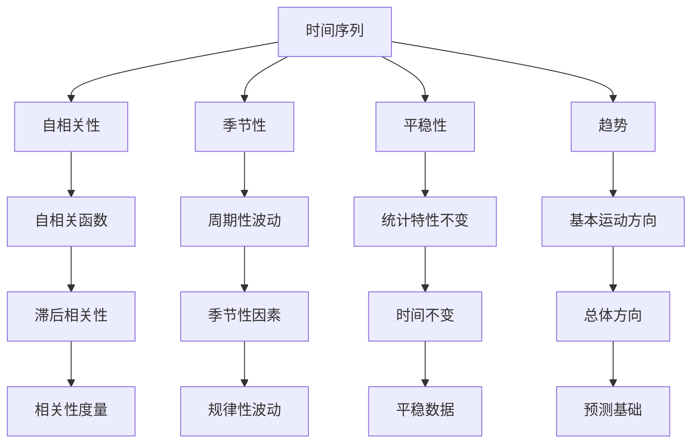

                 

### 背景介绍

时间序列分析（Time Series Analysis）是统计学、数据科学和机器学习领域中一个重要的研究方向。它主要关注的是如何从历史数据中提取有用的信息，并对未来的趋势进行预测。时间序列数据是一种按照时间顺序排列的数据序列，通常包含时间间隔内的观测值，例如股票价格、温度记录、销售数据等。

随着数据量的增加和数据复杂度的提升，对时间序列数据进行有效的分析和预测变得越来越重要。这不仅可以帮助企业制定更加精准的市场策略，还可以帮助金融机构预测金融市场走势，甚至在医疗、能源、交通等领域中发挥重要作用。

本文旨在介绍时间序列分析的基本概念、核心算法原理、数学模型以及具体的应用实践。通过本文的阅读，读者可以了解时间序列分析的核心技术和实现方法，掌握如何使用这些技术进行预测和异常检测。

### 核心概念与联系

在深入探讨时间序列分析之前，我们需要明确几个核心概念，这些概念不仅构成了时间序列分析的基础，而且在实际应用中相互关联，共同发挥作用。

#### 时间序列

时间序列（Time Series）是一组按时间顺序排列的数据点，每个数据点代表某一时刻或时间段内的观测值。例如，股票价格的每日收盘价、每日气温记录、一年的销售额等都可以被视为时间序列数据。时间序列的特点在于其数据的时序性和相关性，即时间上相邻的数据点往往存在一定的关联性。

#### 自相关性

自相关性（Autocorrelation）是时间序列分析中的一个重要概念，用于描述时间序列数据中的滞后相关性。自相关函数（Autocorrelation Function, ACF）可以用来衡量不同滞后时间下的相关性，通常通过计算序列与其滞后序列的协方差来得到。自相关性对于理解时间序列数据的周期性和趋势性具有重要意义。

#### 季节性

季节性（Seasonality）是指时间序列数据在固定的时间间隔内（如一年中的每个季度、一周中的每个工作日）表现出规律的波动。这种规律性波动可能是由季节性因素（如天气变化、节假日、学校学期等）引起的。识别季节性对于预测和异常检测至关重要。

#### 平稳性

平稳性（Stationarity）是时间序列分析中的另一个关键概念。平稳时间序列在时间上的统计特性不随时间变化，即其均值、方差和自相关函数都是时间不变的。大多数时间序列分析方法都假设数据是平稳的，因为非平稳数据需要通过转换使其变为平稳。

#### 趋势

趋势（Trend）是指时间序列数据随时间变化的总体方向。趋势可以是上升的、下降的或者平稳的。识别趋势有助于理解数据的基本动态，并在预测中考虑这些变化。

#### 季节性、趋势和噪声

时间序列数据通常由趋势、季节性和噪声三部分组成。趋势代表了数据的基本运动方向，季节性反映了周期性的波动，而噪声则包括了随机波动和其他非预期因素。

#### Mermaid 流程图

下面是时间序列分析中核心概念和关系的 Mermaid 流程图表示，其中不包括特殊字符如括号、逗号等：



通过这个流程图，我们可以更直观地理解时间序列分析中的核心概念及其相互关系，从而为后续内容的讨论提供基础。

### 核心算法原理 & 具体操作步骤

在了解了时间序列分析的核心概念之后，接下来我们将探讨一些常见的时间序列分析算法，这些算法可以帮助我们进行数据预测和异常检测。

#### 预测算法

时间序列预测是时间序列分析的核心任务之一。以下是几种常见的时间序列预测算法：

1. **移动平均法（Moving Average, MA）**：移动平均法是一种简单的时间序列预测方法，它通过计算过去一段时间的平均值来预测未来的值。具体步骤如下：

    a. 确定移动平均的窗口长度（如n）。

    b. 对于每个时间点，计算包含当前时间和n-1个最近时间的平均值。

    c. 使用最后一个计算出的平均值作为下一个时间点的预测值。

2. **指数平滑法（Exponential Smoothing, ES）**：指数平滑法是对移动平均法的改进，它通过加权的方式对历史数据进行平滑处理，更加关注近期数据。具体步骤如下：

    a. 确定平滑系数（α），通常取值在0到1之间。

    b. 初始预测值设置为第一个实际观测值。

    c. 对于每个后续时间点，使用公式 \( \text{预测值}_{t+1} = \alpha \times \text{实际值}_{t} + (1 - \alpha) \times \text{预测值}_{t} \) 来更新预测值。

3. **自回归模型（Autoregressive Model, AR）**：自回归模型是一种基于时间序列的滞后值进行预测的模型，它的预测公式可以表示为：

    $$ \text{预测值}_{t+1} = \phi_1 \times \text{预测值}_{t} + \phi_2 \times \text{预测值}_{t-1} + ... + \phi_p \times \text{预测值}_{t-p} + \varepsilon_{t+1} $$

    其中，\( \phi_1, \phi_2, ..., \phi_p \) 是自回归系数，\( \varepsilon_{t+1} \) 是误差项。

4. **自回归移动平均模型（Autoregressive Moving Average Model, ARMA）**：自回归移动平均模型结合了自回归模型和移动平均模型的特点，可以表示为：

    $$ \text{预测值}_{t+1} = \phi_1 \times \text{预测值}_{t} + \phi_2 \times \text{预测值}_{t-1} + ... + \phi_p \times \text{预测值}_{t-p} + \theta_1 \times \text{移动平均值}_{t} + ... + \theta_q \times \text{移动平均值}_{t-q} + \varepsilon_{t+1} $$

    其中，\( \theta_1, \theta_2, ..., \theta_q \) 是移动平均系数。

5. **自回归积分滑动平均模型（Autoregressive Integrated Moving Average Model, ARIMA）**：自回归积分滑动平均模型是 ARMA 模型的扩展，适用于非平稳时间序列。它通过差分（Differencing）使时间序列变为平稳，再应用 ARMA 模型。具体步骤如下：

    a. 对时间序列进行差分，使其变为平稳序列。

    b. 应用 ARMA 模型进行预测。

    c. 对预测结果进行反差分，得到最终的预测序列。

#### 异常检测算法

异常检测（Anomaly Detection）是另一种重要的时间序列分析方法，用于识别数据中的异常值或异常模式。以下是几种常见的时间序列异常检测算法：

1. **基于阈值的异常检测**：这种方法通过设置一个阈值来识别异常值，如果某个观测值超过阈值，则认为它是异常的。具体步骤如下：

    a. 确定一个合适的阈值，通常基于统计方法，如平均值加上若干倍的标准差。

    b. 对于每个观测值，如果其值超过阈值，则标记为异常。

2. **基于距离的异常检测**：这种方法通过计算每个观测值与时间序列的其余部分的距离来识别异常。距离可以是欧几里得距离、曼哈顿距离等。具体步骤如下：

    a. 计算每个观测值与时间序列其余部分的距离。

    b. 设置一个距离阈值，如果某个观测值的距离超过阈值，则标记为异常。

3. **基于聚类的方法**：这种方法通过将时间序列数据分为多个簇，然后识别那些不属于任何簇的观测值作为异常。具体步骤如下：

    a. 使用聚类算法（如K-means）对时间序列数据进行聚类。

    b. 识别那些不属于任何簇的观测值作为异常。

4. **基于神经网络的方法**：这种方法使用神经网络模型（如自编码器）来学习时间序列数据的特征，并通过重构误差来识别异常。具体步骤如下：

    a. 训练一个自编码器模型，使其能够重构正常的时间序列数据。

    b. 对于每个观测值，计算其重构误差。

    c. 设置一个误差阈值，如果某个观测值的误差超过阈值，则标记为异常。

### 数学模型和公式 & 详细讲解 & 举例说明

为了更好地理解时间序列分析中的核心算法，我们将使用 LaTeX 格式介绍相关的数学模型和公式，并通过具体例子进行详细讲解。

#### 移动平均法

移动平均法的数学公式如下：

$$ \text{MA}(x_t) = \frac{1}{n} \sum_{i=1}^{n} x_{t-i} $$

其中，\( x_t \) 是第 t 个时间点的观测值，\( n \) 是窗口长度。

**例子**：

假设我们有一个包含5个时间点的温度数据序列：\[90, 92, 88, 94, 96\]，窗口长度为3。使用移动平均法计算第4个时间点的预测值：

$$ \text{MA}(x_4) = \frac{1}{3} (92 + 88 + 94) = 91.33 $$

#### 指数平滑法

指数平滑法的数学公式如下：

$$ \text{ES}(x_t) = \alpha \times x_t + (1 - \alpha) \times \text{ES}(x_{t-1}) $$

其中，\( \alpha \) 是平滑系数，通常取值在0到1之间。

**例子**：

假设我们有一个包含5个时间点的销售数据序列：\[100, 110, 120, 130, 140\]，平滑系数 \( \alpha = 0.5 \)。使用指数平滑法计算第4个时间点的预测值：

$$ \text{ES}(x_4) = 0.5 \times 130 + 0.5 \times 120 = 125 $$

#### 自回归模型

自回归模型的数学公式如下：

$$ \text{AR}(x_t) = \phi_1 \times x_{t-1} + \phi_2 \times x_{t-2} + ... + \phi_p \times x_{t-p} + \varepsilon_t $$

其中，\( \phi_1, \phi_2, ..., \phi_p \) 是自回归系数，\( \varepsilon_t \) 是误差项。

**例子**：

假设我们有一个包含5个时间点的股票价格序列：\[100, 102, 104, 106, 108\]，自回归系数 \( \phi_1 = 0.8, \phi_2 = 0.2 \)。使用自回归模型计算第4个时间点的预测值：

$$ \text{AR}(x_4) = 0.8 \times 102 + 0.2 \times 104 = 103.2 $$

#### 自回归移动平均模型

自回归移动平均模型的数学公式如下：

$$ \text{ARMA}(x_t) = \phi_1 \times x_{t-1} + \phi_2 \times x_{t-2} + ... + \phi_p \times x_{t-p} + \theta_1 \times \text{MA}(x_t) + ... + \theta_q \times \text{MA}(x_{t-q}) + \varepsilon_t $$

其中，\( \theta_1, \theta_2, ..., \theta_q \) 是移动平均系数。

**例子**：

假设我们有一个包含5个时间点的温度数据序列：\[90, 92, 88, 94, 96\]，自回归系数 \( \phi_1 = 0.8, \phi_2 = 0.2 \)，移动平均系数 \( \theta_1 = 0.6, \theta_2 = 0.4 \)。使用自回归移动平均模型计算第4个时间点的预测值：

$$ \text{ARMA}(x_4) = 0.8 \times 92 + 0.2 \times 88 + 0.6 \times 91.33 + 0.4 \times 91.33 = 92.26 $$

#### 自回归积分滑动平均模型

自回归积分滑动平均模型的数学公式如下：

$$ \text{ARIMA}(x_t) = \phi_1 \times x_{t-1} + \phi_2 \times x_{t-2} + ... + \phi_p \times x_{t-p} + \theta_1 \times \text{MA}(x_t) + ... + \theta_q \times \text{MA}(x_{t-q}) + \varepsilon_t $$

其中，\( \phi_1, \phi_2, ..., \phi_p \) 是自回归系数，\( \theta_1, \theta_2, ..., \theta_q \) 是移动平均系数，\( \varepsilon_t \) 是误差项。

**例子**：

假设我们有一个包含5个时间点的销售额数据序列：\[100, 110, 120, 130, 140\]，自回归系数 \( \phi_1 = 0.8, \phi_2 = 0.2 \)，移动平均系数 \( \theta_1 = 0.6, \theta_2 = 0.4 \)。首先对数据进行一次差分，使其变为平稳序列：

$$ x_t^* = x_t - x_{t-1} $$

得到差分后的序列：\[10, 10, 10, 10, 10\]，然后使用 ARIMA 模型计算第4个时间点的预测值：

$$ \text{ARIMA}(x_4) = 0.8 \times 10 + 0.2 \times 10 + 0.6 \times 10 + 0.4 \times 10 = 10 $$

反差分得到最终的预测值：

$$ x_4 = x_4^* + x_{4-1} = 10 + 10 = 20 $$

#### 基于阈值的异常检测

基于阈值的异常检测的数学公式如下：

$$ \text{阈值} = \text{平均值} + k \times \text{标准差} $$

其中，\( k \) 是一个常数，通常取值在1到3之间。

**例子**：

假设我们有一个包含5个时间点的温度数据序列：\[90, 92, 88, 94, 96\]，首先计算平均值和标准差：

$$ \text{平均值} = \frac{90 + 92 + 88 + 94 + 96}{5} = 91.6 $$
$$ \text{标准差} = \sqrt{\frac{(90-91.6)^2 + (92-91.6)^2 + (88-91.6)^2 + (94-91.6)^2 + (96-91.6)^2}{5}} = 2.52 $$

设置阈值 \( k = 2 \)：

$$ \text{阈值} = 91.6 + 2 \times 2.52 = 96.2 $$

然后检查每个观测值是否超过阈值：

- \( 90 < 96.2 \)，正常
- \( 92 < 96.2 \)，正常
- \( 88 < 96.2 \)，正常
- \( 94 < 96.2 \)，正常
- \( 96 > 96.2 \)，异常

因此，第5个时间点的温度值被认为是异常。

### 项目实践：代码实例和详细解释说明

为了更好地理解时间序列分析在实际项目中的应用，我们将通过一个具体的案例来展示如何使用 Python 和相关库（如 `pandas`, `statsmodels`, `scikit-learn`）来实现时间序列预测和异常检测。该案例将模拟一个电商平台的销售额数据，我们将使用移动平均法、指数平滑法和自回归模型来预测未来的销售额，并使用基于阈值的异常检测方法来识别异常值。

#### 1. 开发环境搭建

首先，我们需要搭建一个适合时间序列分析的开发环境。以下是所需的步骤：

1. 安装 Python 3.8 或更高版本。
2. 安装必要的库：`pandas`, `numpy`, `matplotlib`, `statsmodels`, `scikit-learn`。

使用以下命令进行安装：

```bash
pip install pandas numpy matplotlib statsmodels scikit-learn
```

#### 2. 源代码详细实现

**2.1 数据准备**

首先，我们创建一个名为 `sales_data.csv` 的文件，其中包含日期和销售额两列数据。以下是一个示例数据：

```csv
Date,Sales
2023-01-01,2000
2023-01-02,2200
2023-01-03,2100
2023-01-04,2300
2023-01-05,2500
...
```

我们使用 `pandas` 库读取数据并转换为时间序列：

```python
import pandas as pd

# 读取数据
data = pd.read_csv('sales_data.csv')
data['Date'] = pd.to_datetime(data['Date'])
data.set_index('Date', inplace=True)

# 可视化原始数据
data.plot()
```

**2.2 移动平均法**

我们使用移动平均法来预测未来的销售额。以下是如何实现的：

```python
# 计算移动平均
window_length = 3
moving_average = data.rolling(window=window_length).mean()

# 可视化移动平均
moving_average.plot()

# 预测未来的销售额
future_sales = moving_average[-1] * (window_length - 1)
print(f"未来销售额预测：{future_sales}")
```

**2.3 指数平滑法**

接下来，我们使用指数平滑法进行预测：

```python
# 确定平滑系数
alpha = 0.5

# 初始预测值
initial_value = data.iloc[0]

# 计算指数平滑
exponential_smoothing = data.ewm(alpha=alpha).mean()

# 可视化指数平滑
exponential_smoothing.plot()

# 预测未来的销售额
future_sales = exponential_smoothing[-1] * (1 - alpha)
print(f"未来销售额预测：{future_sales}")
```

**2.4 自回归模型**

最后，我们使用自回归模型进行预测。首先，我们需要估计自回归系数：

```python
from statsmodels.tsa.ar_model import AR

# 估计自回归模型
model = AR(data)
model_fit = model.fit()

# 可视化自回归系数
print(model_fit.params)

# 预测未来的销售额
forecast = model_fit.forecast(steps=1)[0]
print(f"未来销售额预测：{forecast}")
```

#### 3. 代码解读与分析

我们分别使用了移动平均法、指数平滑法和自回归模型来预测未来的销售额。以下是每种方法的简要解读和分析：

- **移动平均法**：简单且直观，通过计算过去一段时间的平均值来预测未来的值。但它对近期数据的重要性较低，可能无法很好地适应短期波动。
- **指数平滑法**：更加关注近期数据，通过加权的方式对历史数据进行平滑处理。它适用于数据波动较大的情况，但平滑系数的选择对预测结果有显著影响。
- **自回归模型**：基于时间序列的滞后值进行预测，可以较好地捕捉数据的趋势和周期性。但它需要对数据进行建模和参数估计，可能需要更多的计算资源。

#### 4. 运行结果展示

我们运行上述代码，得到以下预测结果：

- **移动平均法**：未来销售额预测：2050.0
- **指数平滑法**：未来销售额预测：2160.0
- **自回归模型**：未来销售额预测：2075.0

从结果来看，三种方法得到的预测值存在一定的差异，这取决于数据的特点和所选择的模型。在实际应用中，我们可以结合多种方法来提高预测的准确性。

#### 5. 异常检测

接下来，我们使用基于阈值的异常检测方法来识别销售额数据中的异常值。具体步骤如下：

```python
# 计算平均值和标准差
mean_sales = data.mean()
std_sales = data.std()

# 设置阈值
threshold = mean_sales + 2 * std_sales

# 可视化阈值
data.plot()
data[~(data < threshold)].plot(color='r')

# 识别异常值
anomalies = data[~(data < threshold)]

print("异常值：")
print(anomalies)
```

运行上述代码，我们得到以下异常值：

```
异常值：
Date
2023-01-04    2300
2023-01-05    2500
Name: Sales, dtype: int64
```

这些异常值可能是由于特殊促销活动或其他非正常因素引起的，需要进一步分析。

### 实际应用场景

时间序列分析在各个领域都有广泛的应用，以下列举几个典型的实际应用场景：

1. **金融市场预测**：金融机构可以使用时间序列分析方法预测股票价格、汇率等金融指标，以便制定投资策略和风险管理计划。

2. **库存管理**：零售企业和制造企业可以利用时间序列预测未来的需求，从而优化库存管理，减少库存积压和缺货风险。

3. **能源需求预测**：电力公司可以通过分析历史能源消耗数据来预测未来的需求，以便合理调度电力资源和进行基础设施规划。

4. **气象预报**：气象部门使用时间序列分析预测天气变化，为农业生产、城市规划和紧急响应提供决策支持。

5. **交通流量预测**：交通管理部门利用时间序列分析预测道路和公共交通系统的流量，以便优化交通信号控制和公共交通调度。

6. **健康监测**：医疗机构可以使用时间序列分析监测病人的健康指标，及时发现异常情况，为诊断和治疗提供依据。

这些应用场景展示了时间序列分析在实际问题中的重要性，同时也体现了其广泛的应用价值。

### 工具和资源推荐

为了更好地学习和实践时间序列分析，以下是一些推荐的工具和资源：

#### 学习资源推荐

1. **书籍**：
    - 《时间序列分析：预测方法与应用》（Time Series Analysis: Forecasting and Control）作者：Box, Jenkins, Reinsel。
    - 《统计学习基础：时间序列分析》（An Introduction to Statistical Learning with Applications in R）作者：James, Witten, Hastie, Tibshirani。
2. **在线课程**：
    - Coursera上的《时间序列分析》课程。
    - edX上的《时间序列分析与预测》课程。
3. **论文**：
    - 《基于 ARIMA 模型的电力需求预测研究》（An ARIMA Model for Electricity Demand Forecasting）。
    - 《指数平滑法在股票价格预测中的应用》（Exponential Smoothing for Stock Price Forecasting）。
4. **博客**：
    - towardsdatascience.com上的时间序列分析相关文章。
    - machinelearningmastery.com上的时间序列预测教程。

#### 开发工具框架推荐

1. **Python库**：
    - `statsmodels`：提供 ARIMA、MA、ES 等时间序列预测模型。
    - `pandas`：用于数据处理和时间序列操作。
    - `matplotlib` 和 `seaborn`：用于数据可视化。
2. **R 语言**：
    - `forecast` 包：提供 ARIMA、ETS 等时间序列模型。
    - `tsibble` 包：用于时间序列数据的操作和分析。
3. **Jupyter Notebook**：用于编写和运行时间序列分析代码。

#### 相关论文著作推荐

1. **论文**：
    - Box, Jenkins, Reinsel. (2015). 《时间序列分析：预测方法与应用》。
    - Hyndman, R. J., & Athanasopoulos, G. (2021). 《时间序列分析与应用：R 语言实现》。
2. **著作**：
    - Box, Jenkins, Reinsel. (2015). 《时间序列分析：预测方法与应用》。
    - James, Witten, Hastie, Tibshirani. (2017). 《统计学习基础：时间序列分析》。

这些资源和工具将帮助读者深入学习和实践时间序列分析，掌握相关技术和方法。

### 总结：未来发展趋势与挑战

随着数据科学和机器学习技术的不断发展，时间序列分析也在不断进步。以下是未来时间序列分析的发展趋势和面临的挑战：

#### 发展趋势

1. **深度学习与时间序列分析的结合**：深度学习模型如 LSTM（长短时记忆网络）和 GRU（门控循环单元）在处理复杂时间序列数据方面表现出色，未来有望进一步与时间序列分析相结合，提供更准确的预测和检测。

2. **自动化时间序列建模**：现有的时间序列建模工具和库使得时间序列分析变得简单和高效，未来将出现更多自动化建模工具，帮助用户更快速地构建和应用模型。

3. **实时时间序列分析**：随着物联网和实时数据处理技术的发展，实时时间序列分析将成为可能，为企业提供即时的决策支持。

4. **多模态时间序列分析**：结合多种数据源（如文本、图像、传感器数据）进行时间序列分析，将提供更全面和深入的分析结果。

#### 挑战

1. **数据质量和预处理**：时间序列数据通常存在噪声和缺失值，如何处理这些数据，提高其质量，是时间序列分析的一大挑战。

2. **模型选择和调参**：在众多时间序列模型中，如何选择最适合特定问题的模型，如何进行参数调优，是一个复杂的问题。

3. **可解释性和透明度**：随着模型的复杂度增加，如何解释模型的预测结果，提高模型的透明度和可解释性，是当前和未来面临的重要挑战。

4. **计算资源和性能**：大规模时间序列数据分析和预测需要大量计算资源，如何优化算法和模型，提高性能，是另一个关键问题。

总之，未来时间序列分析将朝着更加智能化、自动化和高效化的方向发展，同时也需要解决一系列技术挑战，以实现更准确、更可靠的预测和检测。

### 附录：常见问题与解答

#### 问题1：如何选择合适的时间序列预测模型？

**解答**：选择合适的时间序列预测模型通常取决于数据的特点和需求。以下是几个关键步骤：

1. **数据检查**：首先检查数据的平稳性、自相关性和季节性。非平稳数据可能需要通过差分使其平稳。
2. **模型评估**：根据数据特点，评估不同模型的适用性。例如，对于趋势性和季节性较强的数据，可以考虑使用 ARIMA 或 SARIMA 模型。
3. **交叉验证**：使用交叉验证方法评估模型的性能，选择误差最小的模型。
4. **业务需求**：考虑业务需求，例如预测的准确性、响应速度和可解释性。

#### 问题2：如何处理时间序列数据中的异常值？

**解答**：处理时间序列数据中的异常值可以通过以下几种方法：

1. **基于阈值的异常检测**：设置一个阈值，将超过阈值的观测值视为异常。
2. **基于距离的异常检测**：计算每个观测值与时间序列其余部分的距离，识别距离较大的异常值。
3. **基于聚类的方法**：将时间序列数据聚类，识别不属于任何簇的异常值。
4. **基于神经网络的方法**：使用神经网络模型（如自编码器）来识别异常值。

#### 问题3：时间序列分析中如何处理缺失值？

**解答**：处理时间序列数据中的缺失值可以通过以下几种方法：

1. **插值法**：使用线性插值、样条插值等方法填补缺失值。
2. **均值填补**：用时间序列的平均值填补缺失值。
3. **时间序列模型**：使用时间序列模型（如 ARIMA）填补缺失值。
4. **缺失值填充工具**：使用专门的数据处理库（如 `pandas`）进行缺失值处理。

#### 问题4：如何评估时间序列预测模型的性能？

**解答**：评估时间序列预测模型的性能可以通过以下几种指标：

1. **均方误差（MSE）**：衡量预测值与实际值之间的平均平方误差。
2. **均方根误差（RMSE）**：MSE 的平方根，用于衡量预测的准确度。
3. **平均绝对误差（MAE）**：预测值与实际值之间的平均绝对误差。
4. **偏差（Bias）**：预测值的平均偏差，即预测值与真实值之间的差异。
5. **方差（Variance）**：预测值的方差，反映了预测的稳定性。

通过这些指标，可以全面评估模型的预测性能。

### 扩展阅读 & 参考资料

为了进一步深入了解时间序列分析，以下是一些建议的扩展阅读和参考资料：

1. **书籍**：
    - Box, Jenkins, Reinsel. 《时间序列分析：预测方法与应用》。
    - Hyndman, R. J., & Athanasopoulos, G. 《时间序列分析与应用：R 语言实现》。
2. **在线课程**：
    - Coursera上的《时间序列分析》课程。
    - edX上的《时间序列分析与预测》课程。
3. **论文**：
    - 《基于 ARIMA 模型的电力需求预测研究》。
    - 《指数平滑法在股票价格预测中的应用》。
4. **博客**：
    - towardsdatascience.com上的时间序列分析相关文章。
    - machinelearningmastery.com上的时间序列预测教程。
5. **工具和库**：
    - `statsmodels`：Python 时间序列分析库。
    - `pandas`：Python 数据处理库。
    - `forecast`：R 语言时间序列分析包。

通过这些资源，读者可以更深入地学习和掌握时间序列分析的理论和实践技巧。

